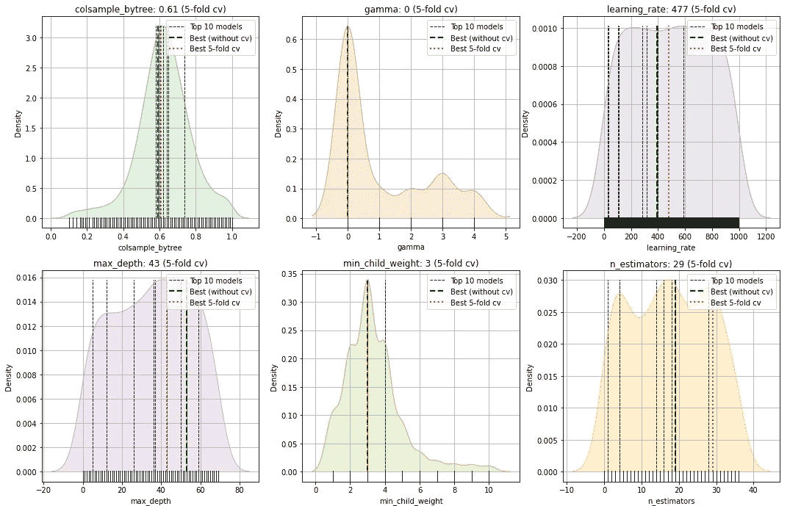
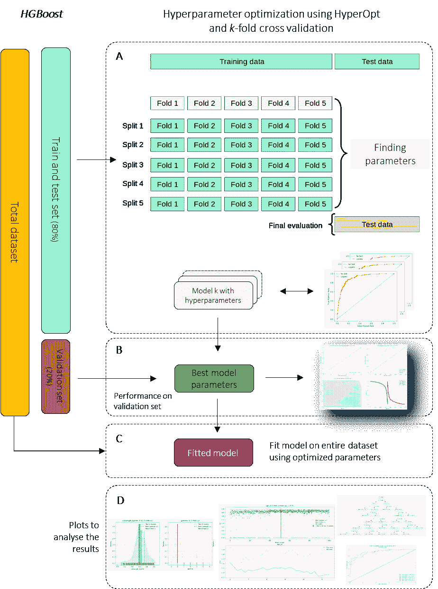
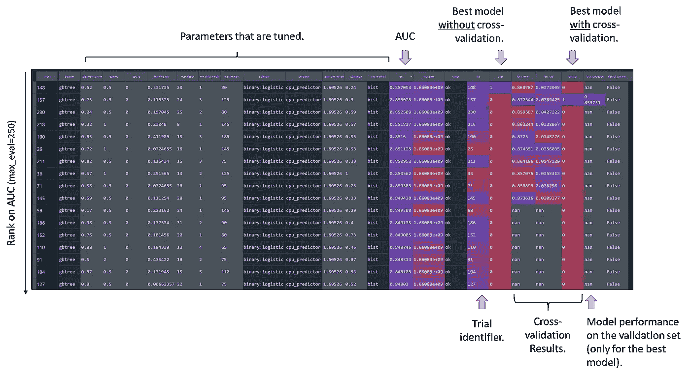
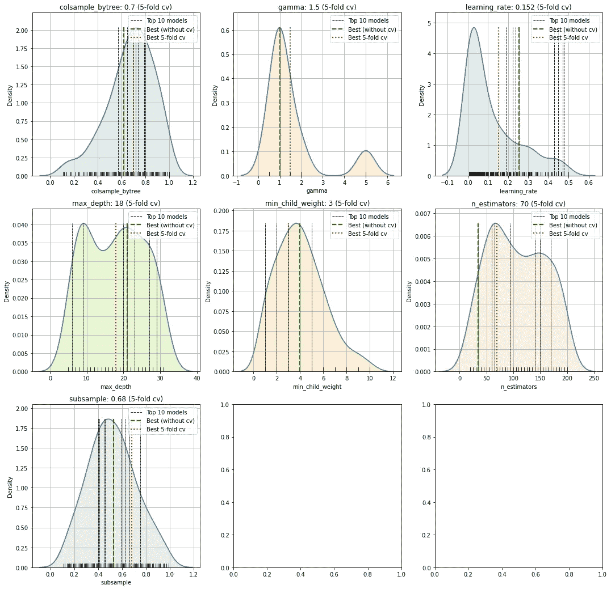
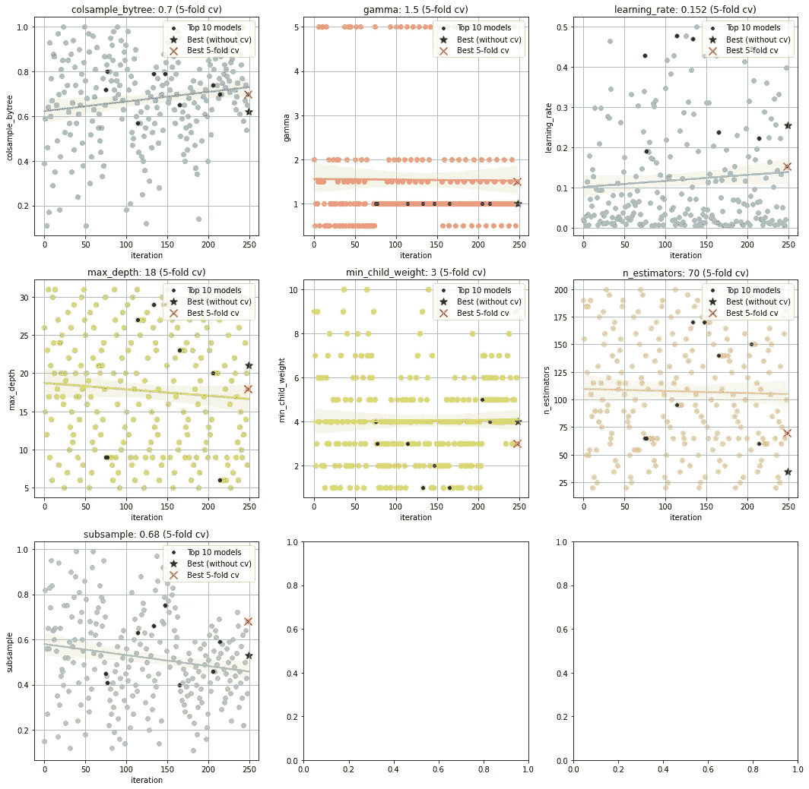
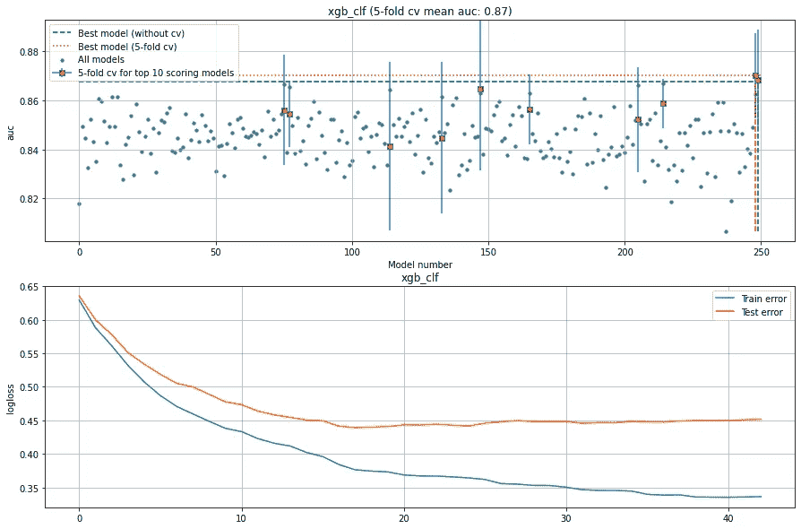
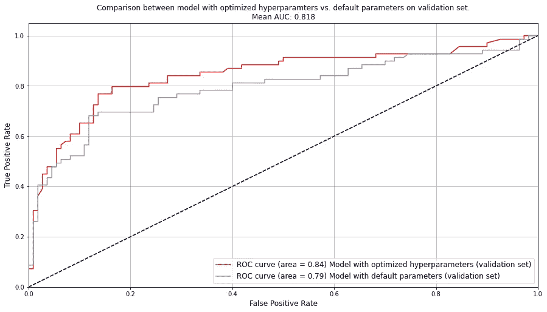
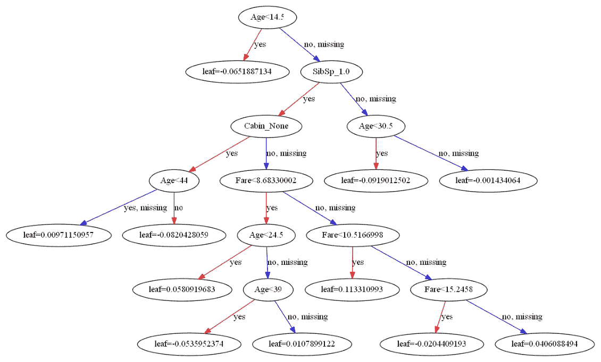

# 使用贝叶斯超参数调整但不过度拟合找到最佳推进模型的指南

> 原文：<https://towardsdatascience.com/a-guide-to-find-the-best-boosting-model-using-bayesian-hyperparameter-tuning-but-without-c98b6a1ecac8>

## 使用增强的决策树算法，如 XGBoost、CatBoost 和 LightBoost，您可能会胜过其他模型，但过度拟合是一个真正的危险。了解如何使用 HGBoost 库拆分数据、优化超参数，以及在不过度训练的情况下找到性能最佳的模型。



图片来自作者。

近年来，梯度推进技术在分类和回归任务中得到了广泛的应用。一个重要的部分是调整超参数，以获得最佳的预测性能。这需要搜索数千个参数组合，这不仅是一项计算密集型任务，而且会很快导致模型过度训练。因此，模型可能无法对新的(看不见的)数据进行归纳，并且性能准确性可能比预期的差。幸运的是，有*贝叶斯优化*技术可以帮助优化网格搜索并减少计算负担。但是还有更多的原因，因为优化的网格搜索仍然可能导致模型训练过度。在优化超参数时，仔细地将数据分成一个训练集、一个测试集和一个独立的验证集是应该包含的另一个重要部分。***HGBoost 库进场了！*** *HGBoost 代表超优化梯度提升，是一个针对 XGBoost、LightBoost、CatBoost 进行超参数优化的 Python 包。它会小心地将数据集分成训练集、测试集和独立的验证集。在训练测试集中，有一个使用贝叶斯优化(使用 hyperopt)优化超参数的内环，以及一个基于 k-fold 交叉验证对性能最佳的模型的概括程度进行评分的外环。因此，它将尽最大努力选择具有最佳性能的最稳健的模型。* ***在这篇博客中，我将首先简单讨论 boosting 算法和超参数优化。然后，我将讨论如何使用优化的超参数来训练模型。我将演示如何解读和直观地解释优化的超参数空间，以及如何评估模型性能。***

# 升压算法的简单介绍。

极端梯度增强( *XGboost* )、轻度梯度增强( *Lightboost* )和 *CatBoost* 等梯度增强算法是强大的集成机器学习算法，用于预测建模，可应用于表格和连续数据，以及用于[分类](https://erdogant.medium.com/hands-on-guide-for-hyperparameter-tuning-with-bayesian-optimization-for-classification-models-2002224bfa3d)和回归任务。

增强决策树算法非常受欢迎并不奇怪，因为在 Kaggle [ [1](https://www.kdnuggets.com/2016/03/xgboost-implementing-winningest-kaggle-algorithm-spark-flink.html) ]举办的机器学习挑战中，这些算法参与了超过一半的获胜解决方案。*梯度推进和决策树的结合在许多应用中提供了最先进的结果。*也正是*这种*组合使得 *XGboost、CatBoost 和 Lightboost* 之间产生了差异。共同的主题是，每个 boosting 算法都需要为每片叶子找到最佳分裂，并且需要最小化[计算成本](https://arxiv.org/abs/1706.08359)。高计算成本是因为模型需要为每片叶子找到精确的分裂点，这需要对所有数据进行迭代扫描。这个过程很难优化。

粗略地说，有两种不同的策略来计算树: ***逐层和逐叶。逐级策略*** *逐级增长树。在这种策略中，每个节点分割数据，并对靠近树根的节点进行优先级排序。* ***逐叶策略*** *通过在具有最高损失变化的节点处分割数据来增长树。*级别式增长通常对较小的数据集更好，而叶式增长在较小的数据集中往往会过拟合。然而，叶方向的增长[倾向于在更大的数据集](http://researchcommons.waikato.ac.nz/handle/10289/2317)中表现出色，在那里它比水平方向的增长 [2](https://www.kdnuggets.com/2017/08/lessons-benchmarking-fast-machine-learning-algorithms.html) 要快得多。让我们从树分裂和计算成本的角度总结一下 *XGboost、LightBoost 和 CatBoost* 算法。

## XGBoost。

极端梯度提升 *(XGboost)* 是最流行的梯度提升技术类型之一，其中提升的决策树在内部由弱[决策树](https://en.wikipedia.org/wiki/Decision_tree_learning)的集合组成。最初 *XGBoost* 基于逐层增长算法，但最近增加了一个逐叶增长选项，使用直方图实现分裂近似。**优点**是 *XGBoost* 学习有效，泛化性能强。此外，它还可以捕捉非线性关系。**缺点**是超参数调整可能会很复杂，当使用稀疏数据集时，它可能会很快导致高计算成本(内存方面和时间方面)，因为当使用非常大的数据集时需要许多树[ [2](https://www.kdnuggets.com/2017/08/lessons-benchmarking-fast-machine-learning-algorithms.html) ]。

## 灯光增强。

*LightBoost* 或 *LightGBM* 是一个梯度提升框架，它使用基于树的学习算法，对树进行垂直分割(或逐叶分割)。当生长相同的叶子时，与逐层算法相比，这种方法可以更有效地减少损失。此外， *LightBoost* 使用基于直方图的算法，将连续的特征值存储到离散的容器中。这加快了训练速度，减少了内存使用。它被设计成高效的，并具有许多**优点**，例如快速训练、高效率、低内存使用、更好的准确性、支持并行和 GPU 学习、能够处理大规模数据 [3](https://lightgbm.readthedocs.io/) 。计算和内存高效的优势使 *LightBoost* 适用于大量数据。**缺点**是由于逐叶分裂，对过拟合敏感，并且由于超参数调整，复杂度高。

## CatBoost。

*CatBoost* 也是决策树上梯度提升的高性能方法。 *Catboost 使用* [*不经意*](https://en.wikipedia.org/wiki/Oblivious_data_structure) *树或对称树生成平衡树，以加快执行速度*。这意味着通过创建特征分割对，将 pér 特征、值划分到桶中，例如(temperature，< 0)、(temperature，1–30)、(temperature，> 30)，等等。在不经意树的每一层中，带来最低损失(根据惩罚函数)的特征分裂对被选择并用于所有层节点。据描述， *CatBoost* 使用默认参数提供了很好的结果，因此在参数调整上需要较少的时间[ [4](http://CatBoost is a high-performance open source library for gradient boosting on decision trees) ]。另一个**优势**是 *CatBoost* 允许你使用非数字因子，而不是必须预处理你的数据或者花费时间和精力把它变成数字。**的一些缺点**是:它需要构建深度决策树来恢复数据中的依赖性，以防具有高基数的特性，并且它不能处理缺失值。

每个提升决策树都有自己的优势(劣势),因此，结合您要开发的应用程序，很好地理解您正在使用的数据集是非常重要的。

# 超参数还是参数？

简单介绍一下 ***超参数*** 的定义，以及它们与 ***正常参数*** 的区别。总的来说，我们可以说*正常参数*是由机器学习模型本身优化的，而超参数 ***不是*** 。在回归模型的情况下，输入特征和结果(或目标值)之间的关系是已知的。在回归模型的训练过程中，*通过调整权重来优化回归线的斜率(假设与目标值的关系是线性的)*。或者换句话说，在训练阶段学习*模型参数*。

> 参数由机器学习模型本身来优化，而超参数在训练过程之外，需要一个元过程来调整。

**然后还有另外一组参数叫做*超参数*** (在统计学*中又称为*滋扰参数*)。这些值必须在训练过程之外指定，并且是模型的输入参数。一些模型没有任何超参数，其他模型有一些(两个或三个左右)仍然可以手动评估。然后是有很多超参数的模型。我是说，真的很多。增强的决策树算法，如 *XGBoost、CatBoost 和 LightBoost* 都是有很多超参数的例子，考虑期望的深度、树中的叶子数量等。您可以使用默认的超参数来训练模型，但是调整超参数通常会对训练模型的最终预测精度产生很大影响[ [8](https://www.oreilly.com/library/view/evaluating-machine-learning/9781492048756/ch04.html) ]。此外，不同的数据集需要不同的超参数。这很麻烦，因为一个模型可以很容易地包含几十个超参数，这随后会产生(几万)个超参数组合，需要对这些组合进行评估以确定模型性能。这被称为*搜索空间*。因此，计算负担(时间方面和内存方面)可能是巨大的。因此，优化*搜索空间*是有益的。*

# *仔细分割数据集的情况。*

*对于受监督的机器学习任务，重要的是将数据分成单独的部分，以避免在学习模型时[过拟合](https://www.techtarget.com/whatis/definition/overfitting)。过度拟合是指模型对数据拟合(或学习)得太好，然后无法预测(新的)看不见的数据。最常见的方式是将数据集分成**训练集**和独立的**验证集**。然而，当我们也执行超参数调优时，比如在 boosting 算法中，也需要一个**测试集**。模型现在可以 ***看到*** 的数据， ***从数据中学习*** ，最后，我们可以 ***在看不见的数据上评估*** 的模型。这种方法不仅可以防止过度拟合，而且有助于确定模型的*鲁棒性*，即使用 *k* 折叠交叉验证方法。因此，当我们需要调整超参数时，我们应该将数据分成三部分，即:*训练集、测试集和验证集。**

1.  ***训练集**:这是模型看到并从数据中学习的部分。它通常由 70%或 80%的样本组成，以确定数千个可能的超参数中的最佳拟合(例如，使用*k*-折叠交叉验证方案)。*
2.  ***测试集:**该集通常包含 20%的样本，可用于评估模型性能，如特定的超参数集。*
3.  ***验证集:**该集通常也包含数据中 20%的样本，但在最终模型被训练之前保持不变。现在可以以公正的方式评估该模型。*请务必意识到，本器械包只能使用一次。*或者换句话说，如果模型在获得对验证集的见解后得到进一步优化，那么您需要另一个独立的集来确定最终的模型性能。*

*建立嵌套的交叉验证方法可能很耗时，甚至是一项复杂的任务，但如果您想要创建一个健壮的模型，并防止过度拟合，这是非常重要的。 ***自己做出这样的做法是很好的*练习*，不过这些也在***[***HGBoost 库***](https://erdogant.github.io/hgboost/pages/html/index.html)**[**1**](https://erdogant.github.io/hgboost/pages/html/index.html)***中实现。*** *在我讨论 HGBoost 的工作原理之前，我将首先简要描述一下针对具有不同超参数组合的模型的大规模优化的贝叶斯方法。****

# ***超参数优化是一项复杂的任务。***

***当使用提升决策树算法时，可能很容易有几十个输入超参数，这可能随后导致需要评估(几万)个超参数组合。这是一项重要的任务，因为超参数的特定组合可以为特定数据集带来更准确的预测。尽管有许多超参数需要优化，但有些参数比其他参数更重要。此外，一些超参数可能对结果影响很小或没有影响，但是如果没有智能方法，需要评估超参数的所有组合，以找到最佳执行模型。这使得它成为计算负担。***

> ***超参数优化可以大大提高机器学习模型的准确性。***

***通常使用*网格搜索*来搜索参数组合。一般有两种类型: ***网格搜索*** 和 ***随机搜索*** 可用于参数整定。 ***网格搜索*** 将遍历整个搜索空间，因此非常有效，但也非常非常慢。另一方面， ***随机搜索*** 很快，因为它会在搜索空间中随机迭代，虽然这种方法已经被证明是有效的，但它很容易错过搜索空间中最重要的点。 ***幸运的是，还有第三种选择:基于序列模型的优化，也称为贝叶斯优化*。*****

******贝叶斯优化*** 进行参数整定是在几次迭代内确定最佳的超参数集。*贝叶斯*优化技术是一种高效的函数最小化方法，在[hyperpt](http://hyperopt.github.io/hyperopt/)库中实现。该效率使其适合于优化训练缓慢的机器学习算法的超参数[ [5](https://conference.scipy.org/proceedings/scipy2013/pdfs/bergstra_hyperopt.pdf) ]。关于 Hyperopt 的深入细节可以在这个博客中找到[ [6](https://medium.com/district-data-labs/parameter-tuning-with-hyperopt-faa86acdfdce) ]。总的来说，它首先对参数的随机组合进行采样，然后使用交叉验证方案来计算性能。在每次迭代期间，样本分布被更新，并且以这种方式，它变得更有可能对具有良好性能的参数组合进行采样。传统的*网格搜索*、*随机搜索、*和*远视*之间的巨大对比可以在这个[博客](https://www.kaggle.com/code/ilialar/hyperparameters-tunning-with-hyperopt/notebook)中找到。***

> *********贝叶斯优化*** 的*** 效率使其适合于优化训练缓慢的机器学习算法的超参数 [5](https://conference.scipy.org/proceedings/scipy2013/pdfs/bergstra_hyperopt.pdf) 。***

***[*远视*](http://hyperopt.github.io/hyperopt/) *被并入* [*HGBoost*](https://erdogant.github.io/hgboost/pages/html/index.html) *的方法来做超参数优化。在下一节中，我将描述如何处理分割数据集和超参数优化的不同部分，包括目标函数、搜索空间和所有试验的评估****

# ***超优化梯度增强库。***

***超优化的梯度增强库( [*HGBoost*](https://erdogant.github.io/hgboost/pages/html/index.html) )，是一个针对 *XGBoost* 、 *LightBoost* 和 *CatBoost* 进行超参数优化的 Python 包。它将把数据集分成*系列*、*测试、*和*独立验证集。*在训练测试集中，有使用贝叶斯优化(使用 [*超点)*](http://hyperopt.github.io/hyperopt/) 来优化超参数的内部循环，以及使用 *k* 折叠交叉验证来对表现最佳的模型能够概括得多好进行评分的外部循环。这种方法的优点在于，不仅可以选择精度最高的模型，还可以选择最能概括的模型。***

***[*HGBoost*](https://erdogant.github.io/hgboost/pages/html/index.html) *有很多优点，比如；它尽最大努力检测最能概括的模型，从而降低选择过度训练模型的可能性。它通过提供深刻的情节提供可解释的结果，例如:对超参数空间的深入检查、所有评估模型的性能、k 倍交叉验证的准确性、验证集以及最后但同样重要的最佳决策树可以与最重要的特征一起绘制。****

****hgboost* 提供的好处更多:***

1.  ***它由最流行的决策树算法组成； *XGBoost、LightBoost 和 Catboost* 。***
2.  ***它包括最流行的贝叶斯优化的超参数优化库；*远视*。***
3.  ***一种将数据集分为训练测试和独立验证以对模型性能评分的自动化方式。***
4.  ***流水线有一个嵌套方案，内循环用于超参数优化，外循环使用 *k* -fold 交叉验证来确定最健壮和性能最好的模型。***
5.  ***它可以处理*分类*和*回归*任务。***
6.  ***创建一个*多类模型*或增强决策树模型的*集合是很容易的。****
7.  ***它处理不平衡的数据集。***
8.  ***它为超参数搜索空间创建可解释的结果，并通过创建有洞察力的图来模拟性能结果。***
9.  ***它是开源的。***
10.  ***有很多例子证明了这点。***

# ***走向超优化和稳健模型的步骤。***

***[*HGBoost*](https://erdogant.github.io/hgboost/pages/html/index.html) 方法由流水线中的各个步骤组成。*图 1* 中描绘了示意图。让我们来看看这些步骤。***

******

***图一。HGBoost 的示意图。(图片来自作者)***

******第一步*** 是将数据集拆分成*训练集*，一个*测试集，*和一个*独立验证集*。*请记住，验证集在整个训练过程中保持不变，并在最后用于评估模型性能。*在*训练测试集* ( ***图 1A*** )中，有使用贝叶斯优化来优化超参数的内循环，以及使用外部*k*-折叠交叉验证来测试最佳性能模型在未发现的测试集上的概括程度的外循环。搜索空间取决于模型类型的可用超参数。需要优化的模型超参数见 ***代码段 1*** 。***

***代码部分 1。为 XGBoost、LightBoost 和 CatBoost 的分类和回归任务搜索空间。***

***在贝叶斯优化部分，我们通过*探索*整个空间来最小化超参数空间上的成本函数。与传统的*网格搜索*不同，*贝叶斯方法*搜索最佳参数集，并在每次迭代后优化搜索空间。使用 *k* 折叠交叉验证方法对模型进行内部评估。或者换句话说，我们可以评估固定数量的函数评估，并采取最佳尝试。默认设置为 250 次评估，因此产生 250 个模型。*完成此步骤后，您现在可以选择表现最佳的模型(基于 AUC 或任何其他指标),然后停止。*然而，这是非常不鼓励的，因为我们只是在整个搜索空间中搜索了一组现在似乎最适合训练数据的参数，而不知道它概括得有多好。或者换句话说，表现最好的模型可能会，也可能不会过度训练。*为了避免找到过度训练的模型，k-fold 交叉验证方案将继续我们寻找最稳健模型的探索。我们进行第二步。****

******第二步*** 是根据指定的评估指标(默认设置为 AUC)对模型(本例中为 250 个)进行排名，然后取表现最好的前 ***p*** 模型(默认设置为***p****= 10*)。以这种方式，我们不依赖于具有最佳超参数的单个模型，即*可能或可能不会*过度拟合。*请注意，可以评估所有 250 个模型，但这是计算密集型的，因此我们选择最好的(性能)模型。*为了确定前 10 名执行模型如何概括，使用了***k***-折叠交叉验证方案进行评估。 ***k*** *的缺省值为* 5 折，这意味着对于每一款***【p】***车型，我们都将检查跨越 ***k*** =5 折的性能。为了确保前***p****= 10*模型之间的交叉验证结果具有可比性，抽样以分层方式进行。总的来说，我们会评价***p****x****k***；10x5=50 个模型。***

******第三步，*** 我们有了表现最好的 ***p*** 模型，我们用一种***k***-折叠交叉验证的方法计算了它们的性能。我们现在可以计算跨越*-褶皱的平均准确度(例如 AUC)，然后对模型进行排序，最后选择排序最高的模型*。*交叉验证方法将有助于选择最稳健的模型，即也能在不同数据集之间推广的模型。*请注意，可能存在其他模型，这些模型在没有交叉验证方法的情况下会产生更好的性能，但这些模型可能会被过度训练。*****

*******第四步，*** 我们将在独立验证集上检验模型的准确性。这一套到目前为止还没有接触过，因此将给出一个很好的估计。由于我们广泛的模型选择方法(模型是否可以一般化，并限制选择过度训练模型的可能性)，我们不应该期望与我们容易看到的结果相比，在性能上有很大的差异。****

*******在最后一步*** 中，我们可以使用整个数据集上的优化参数重新训练模型( ***图 1C*** )。下一步( ***图 1D*** )就是对结果的解读，为其创造有见地的情节。****

# ****导入并初始化。****

****在我们可以使用 *HGBoost* 之前，我们需要先使用命令行*安装*:****

```
******pip install hgboost******
```

****安装完成后，我们可以导入 *HGBoost* 并初始化。我们可以保持输入参数的默认值(在 ***代码段 2*** 中描述)或相应地改变它们。在接下来的部分中，我们将讨论一组参数。****

****代码部分 2。导入并初始化 HGBoost。****

****每个任务(*分类、回归、多类或集成*)和每个模型( *XGBoost、LightBoost 和 CatBoost* )的初始化保持一致，这使得在不同决策树模型甚至任务之间切换变得非常容易。*输出也保持一致*是一个包含六个键的字典，如 ***代码段 3*** 所示。****

****代码部分 3:输出参数的描述。****

# ****读取和预处理数据集。****

****为了演示，让我们使用可以使用函数`import_example(data=’titanic’)`导入的 [*泰坦尼克号*数据集](https://www.kaggle.com/c/titanic/)【10】。这个数据集是免费使用的，是 Kaggle 竞赛 [*机器从灾难中学习*](https://www.kaggle.com/c/titanic) 的一部分。可以使用依赖于 [***df2onehot 库***](https://github.com/erdogant/df2onehot)*【11】的函数`.preprocessing()`来执行预处理步骤。*该函数将分类值编码成一个 hot，并保持连续值不变。我手动去掉了一些特性，比如 *PassengerId* 和*名字* ***(代码段 4)*** *。请注意，在正常的用例中，建议仔细进行探索性的数据分析、特性清理、特性工程等等。最大的性能提升通常来自这些最初的步骤。*****

****请记住，当使用 *XGBoost* 、 *LightBoost、*或 *CatBoost* 训练模型时，预处理步骤可能会有所不同。例如，模型是否需要对特征进行编码，或者它能否处理非数字特征？模型是否可以处理缺失值，或者是否应该移除这些特征？参见第 ***节升压算法的简要介绍*** 以了解三种模型之间优势(劣势)的更多详细信息，并相应地进行预处理。****

****代码部分 4:输入参数以及如何使用 XGBoost、LightBoost 和 Catboost 模型进行分类和回归任务以及多类和集成模型的概述。****

## ****训练一个模特。****

****初始化之后，我们可以使用 *XGBoost* 决策树来训练一个模型。*注意，您也可以使用 LightBoost 或 CatBoost 模型，如代码部分 3 所示。*在训练过程中(运行第 4 节*中的 ***代码*** )，它将遍历搜索空间并创建 250 个不同的模型(`max_eval=250`)，为这些模型评估特定决策树模型可用的一组超参数的模型准确性(在这种情况下为 *XGBoost，代码第 1 节*)。接下来，对模型的准确性进行排名，选出前 10 个表现最好的模型`top_cv_evals=10`。现在使用 5 折交叉验证方案(`cv=5`)对这些进行进一步研究，以对模型的概括程度进行评分。在这个意义上，我们的目标是防止找到一个过度训练的模型。*****

****返回不同模型的所有测试超参数，可进一步检查(手动)或使用绘图功能。例如， *HGBoost* 的输出在 ***代码段 5*** 中描述，更多细节在 ***图 2*** 中描述。****

****代码部分 HGBoost 模型返回的结果。****

********

****图二。结果输出['summary']显示了所有已执行评估的摘要。(图片来自作者)****

# ****使用绘图功能创建可解释的结果。****

****返回最终模型后，可以创建各种图来更深入地检查模型性能和超参数搜索空间。这有助于获得更好的直觉和关于模型参数相对于性能如何表现的可解释的结果。 ***可以创建以下情节:*******

1.  *****为了更深入地研究超参数空间。*****
2.  *****总结所有被评估的模型。*****
3.  *****使用交叉验证方案显示性能。*****
4.  *****独立验证集上的结果*。****
5.  *****最佳模型和最佳性能特征的决策树图。*****

****代码部分 6:对模型结果的深入研究。****

## ****超参数调谐的解释。****

****为了更深入地研究超参数空间，可以使用功能`.plot_params()`***(图 3 和图 4)*** 。让我们从研究在贝叶斯优化过程中如何调整超参数开始*。*两个图都包含多个直方图(或核密度图)，其中每个子图是在 250 次模型迭代期间优化的单个参数。直方图底部的小条描绘了 250 个评估，而黑色垂直虚线描绘了前 10 个最佳性能模型中使用的特定参数值。绿色虚线描绘了没有 交叉验证方法的最佳表现模型 ***，红色虚线描绘了具有*** 交叉验证的最佳表现模型 ***。*******

****我们来看看 ***图 3*** 。左上角有参数***col sample _ bytree***，取值范围从 0 到 1.2。***col sample _ bytree****的平均值为* ~0.7，这表明针对该参数使用贝叶斯优化的优化样本分布已移至该值。我们表现最好的模型的值正好是***col sample _ bytree =***0.7，(*红色虚线*)。但是还有更多值得关注的。当我们现在查看 ***图 4*** 时，我们也有***col sample _ bytree***，其中每个点都是根据迭代次数排序的 250 个模型之一。水平轴是迭代，垂直轴是优化的参数值。对于该参数，在优化过程的迭代期间有向上的趋势；接近 0.7 的值。这表明在迭代期间，当增加***col sample _ bytree****的值时，优化了***col sample _ bytree***的搜索空间，并且看到了更多具有更好准确性的模型。以这种方式，所有的超参数可以相对于不同的模型被解释。*****

******

***图 3。在回归模型的 250 次迭代中调整超参数。七个参数的分布。(图片来自作者)***

******

***图 4。在回归模型的 250 次迭代中调整超参数。每个点是一次迭代，为其选择特定的值。(图片来自作者)***

## ***解释所有评估模型的模型性能。***

***通过绘图功能`.plot()`，我们可以深入了解 250 款车型的性能(本例中为 AUC)(***图 4*** )。这里，绿色虚线再次描绘了没有 交叉验证方法的表现最好的模型 ***，而红色虚线描绘了具有*** 交叉验证的表现最好的模型 ***。 ***图 5*** 描绘了与具有默认参数的模型相比，具有优化超参数的最佳表现模型的 ROC 曲线。******

******

***图 4。250 次评估和交叉验证的模型准确性。(图片来自作者)***

******

***图 5。与具有默认参数的模型相比，具有优化超参数的最佳性能模型的 ROC 曲线。(图片来自作者)***

## ****最佳模型的决策树图。****

***有了决策树图( ***图 6*** )我们可以更好的理解模型是如何工作的。它也可以给我们一些直觉，这样一个模型是否可以推广到其他数据集。注意，默认情况下会返回最佳树`num_tree=0`，但是通过指定输入参数`.treeplot(num_trees=1)`可以创建许多可以返回的树。此外，我们还可以绘制出性能最佳的特性(此处未显示)。***

******

***图 6。最佳模型的决策树图。(图片来自作者)***

## ***做预测。***

***有了最终的训练模型后，我们现在可以用它对新数据进行预测。假设 ***X*** 是新数据，并且在训练过程中进行了类似的预处理，那么我们可以使用`.predict(X)`函数进行预测。该函数返回分类概率和预测标签。示例见 ***代码第 7 节*** 。***

***代码第 7 部分。预测。***

## ***保存并加载模型。***

***保存和加载模型会变得很方便。为了完成这个，有两个函数:`**.save()**`和函数`**.load()**` ***(代码段 8)*** 。***

***代码第 8 部分。保存和加载模型。***

# ***结束了。***

***我演示了如何通过将数据集分为训练集、测试集和独立验证集来训练具有优化的超参数的模型。在训练测试集中，有使用贝叶斯优化来优化超参数的内部循环，以及基于 k-fold 交叉验证来对表现最好的模型的概括程度进行评分的外部循环。以这种方式，我们尽最大努力选择能够概括和具有最佳准确性的模型。***

***在训练任何模型之前，一个重要的部分就是做典型的建模工作流程:*首先做探索性数据分析(EDA)，迭代做清洗，特征工程，特征选择。这些步骤通常会带来最大的性能提升。****

***[*HGBoost*](https://erdogant.github.io/hgboost/pages/html/index.html) 支持学习 [*分类模型*](https://erdogant.medium.com/hands-on-guide-for-hyperparameter-tuning-with-bayesian-optimization-for-classification-models-2002224bfa3d) *，回归模型*，*多类模型*，甚至是 boosting 树模型的*集合。对于所有任务，应用相同的程序以确保选择最佳性能和最稳健的模型。如果你需要更多关于如何训练一个可解释的梯度推进分类模型的细节，请阅读这个博客*【12】*。****

***此外， *HGboost* 依靠[hyperpt](http://hyperopt.github.io/hyperopt/)进行贝叶斯优化，这是最流行的超参数优化库之一。最近开发的另一种贝叶斯优化算法叫做 [Optuna](https://optuna.org/) 。如果你想阅读更多的细节，以及两种方法之间的比较，试试这个博客。***

***这就是了。我希望你喜欢读它！如果有不清楚的地方或者你有其他建议，请告诉我。***

***注意安全。保持冷静。***

******欢呼，E.******

****如果你觉得这篇文章很有帮助，* [*关注我*](https://erdogant.medium.com/) *，Star the*[*HGBoost Github Repo*](https://github.com/erdogant/hgboost)*，和/或支持我的内容，并通过使用我的* [*推荐链接*](https://erdogant.medium.com/membership) *注册一个媒体会员来访问类似的博客。****

## ***软件***

*   ***HGBoost Github***
*   ***[HGBoost 文档页面](https://erdogant.github.io/hgboost/)***
*   ***[Colab 笔记本](https://erdogant.github.io/hgboost/pages/html/Blog.html)***

## ***我们连线吧！***

*   ***让我们在 LinkedIn 上联系吧***
*   ***[在 Github 上关注我](https://github.com/erdogant)***
*   ***[在媒体上跟随我](https://erdogant.medium.com/)***

# ***参考***

1.  ***南珠等， [*XGBoost:在 Spark 和 Flink*](https://www.kdnuggets.com/2016/03/xgboost-implementing-winningest-kaggle-algorithm-spark-flink.html) 中实现 Winningest Kaggle 算法。***
2.  ***米盖尔·菲耶罗等人 [*从基准测试快速机器学习算法中吸取的教训*](https://www.kdnuggets.com/2017/08/lessons-benchmarking-fast-machine-learning-algorithms.html) *。****
3.  ***[*欢迎来到 LightGBM 的文档*](https://lightgbm.readthedocs.io/) *！****
4.  ***[*CatBoost 是一个高性能的开源库，用于决策树*](https://catboost.ai/) *上的梯度提升。****
5.  ***James Bergstra 等人，2013， [*Hyperopt:一个优化机器学习算法超参数的 Python 库。*](https://conference.scipy.org/proceedings/scipy2013/pdfs/bergstra_hyperopt.pdf)***
6.  ***Kris Wright，2017， [*用超视进行参数调谐。*](https://medium.com/district-data-labs/parameter-tuning-with-hyperopt-faa86acdfdce)***
7.  ****E.Taskesen，2019，* [*Classeval:两类和多类分类器的监督预测评估*](https://github.com/erdogant/classeval) *。****
8.  ***[爱丽丝一怔，*第四章。超参数调谐*。](https://www.oreilly.com/library/view/evaluating-machine-learning/9781492048756/ch04.html)***
9.  ***E.Taskesen，2020， [*超优化梯度提升*](https://github.com/erdogant/hgboost) *。****
10.  ***卡格尔， [*机器从灾难中学习*](https://www.kaggle.com/c/titanic) *。****
11.  ***E.Taskesen，2019， [*df2onehot:将非结构化数据帧转换为结构化数据帧。*](https://github.com/erdogant/df2onehot)***
12.  ***E.Taskesen，2022， [*使用贝叶斯超参数优化创建可解释的梯度推进分类模型的实践指南。*](https://erdogant.medium.com/hands-on-guide-for-hyperparameter-tuning-with-bayesian-optimization-for-classification-models-2002224bfa3d)***