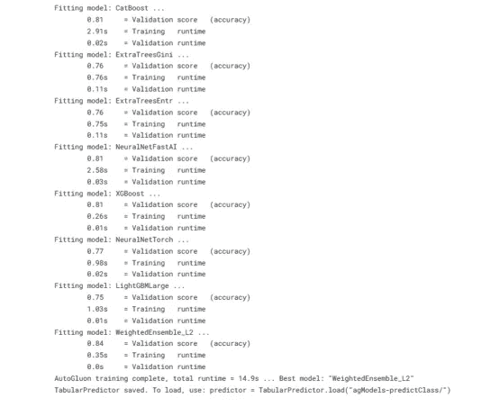
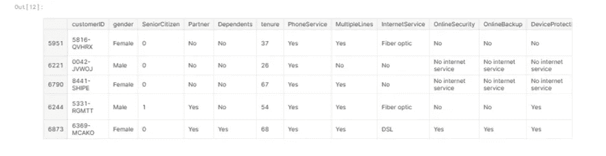
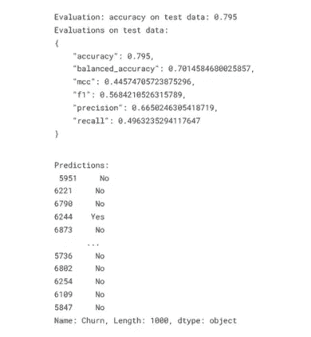
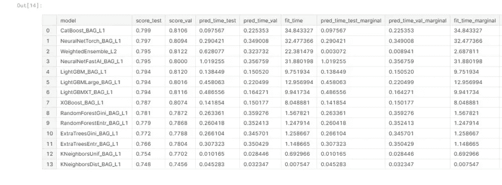
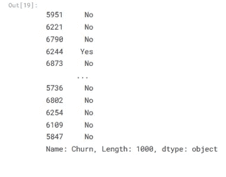
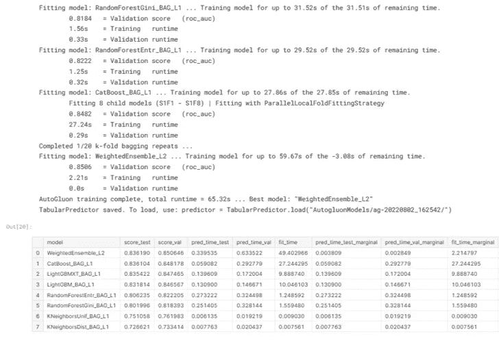
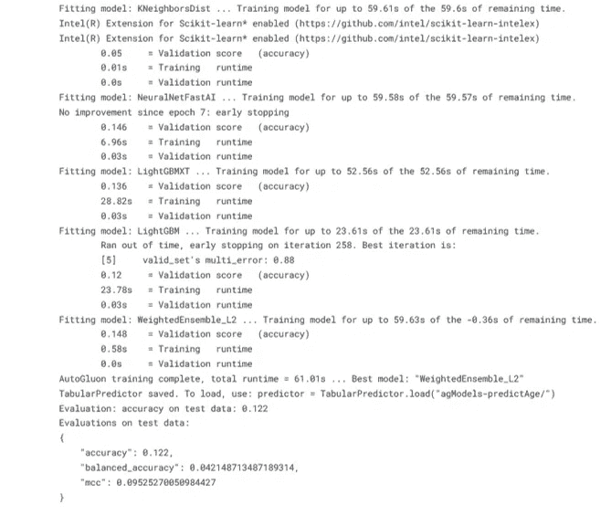
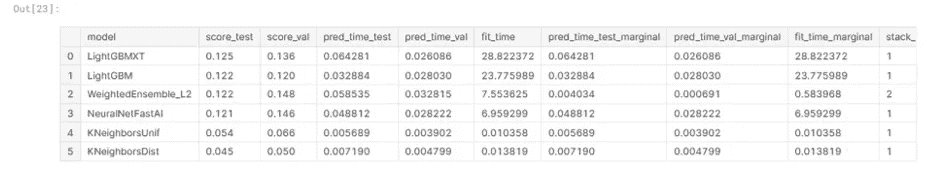
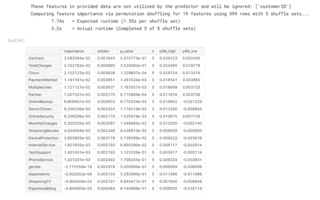

# 使用 AutoGluon 2022 新功能制作最佳 ML 管道指南

> 原文：<https://towardsdatascience.com/a-guide-to-making-the-best-ml-pipeline-using-autogluon-2022-new-features-3fcb0b7f47d6>

## 或者如何在不过度拟合的情况下获得最好的 python 开源模型


阿德里安在 [unsplash](https://unsplash.com/photos/DZRO3iMsiLg?utm_source=unsplash&utm_medium=referral&utm_content=creditShareLink) 拍摄的照片

答自动模型选择工具是在监督和非监督机器学习中以简单快速的方式获得最佳预测的最佳方式。在大多数数据科学项目中，选择最佳模型选择是特征选择之后的关键步骤。高级数据科学家需要掌握最先进的 ML 管道方法。在本文中，我们将回顾最佳 Kaggle 获奖者的自动化 ML 管道选择方法 **AutoGluon** 。AWS 创建的一个开源包，可以用简短的 python 代码实现。

对于本文，我们将使用流失预测数据集创建分类和回归模型管道，您可以在这里找到从 IBM 样本集集合[数据集](https://community.ibm.com/community/user/businessanalytics/blogs/steven-macko/2019/07/11/telco-customer-churn-1113)修改而来的[。该数据集包含 7043 个客户信息，包括人口统计(性别、任期、合作伙伴)、账户信息(账单、电话服务、多条线路、互联网服务、支付方式等)..)，以及二进制标签流失(0:客户离开或 1:没有)。](https://www.kaggle.com/datasets/palashfendarkar/wa-fnusec-telcocustomerchurn/metadata)

**包含 21 个特征的挑战性数据集与目标特征“流失”相关。**

*autoglon 提供了*开箱即用的自动化监督机器学习，可优化机器学习管道，在几秒钟内自动搜索最佳学习算法(神经网络、SVM、决策树、KNN 等)和最佳超参数。点击[此处](https://auto.gluon.ai/stable/tutorials/tabular_prediction/tabular-quickstart.html)查看自动生成中可用的估算器/模型的完整列表。

*AutoGluon* 可以在[文本](https://auto.gluon.ai/stable/tutorials/text_prediction/beginner.html)、[图像](https://auto.gluon.ai/stable/tutorials/image_prediction/dataset.html)、[时间序列](https://auto.gluon.ai/stable/tutorials/timeseries/forecasting-quickstart.html)和[管状](https://auto.gluon.ai/stable/tutorials/tabular_prediction/tabular-quickstart.html)数据集上生成模型，自动处理数据集清理特征工程、模型选择、超参数调整等。

完整的*自动旋转*分析可以在 18 个步骤中完成，您可以在此[链接](https://jovian.ai/yeonathan/autogluon-2022-churn2)中找到。在本文中，我们将只关注 2022 年新的自动旋转功能。


菲利普·布阿齐兹在 [unsplash](https://unsplash.com/photos/oRs4LfFfX-A?utm_source=unsplash&utm_medium=referral&utm_content=creditShareLink) 上的照片

**1。带自动增长的分类**

首先，我们需要为训练和测试数据集创建管状数据集，如下所示:

```
train_data = TabularDataset(train_df)subsample_size = 5000 # subsample subset train_data = train_data.sample(n=subsample_size, random_state=0)train_data.head()test_data = TabularDataset(test_df)subsample_size = 1000 # subsample subset test_data = test_data.sample(n=subsample_size, random_state=0)test_data.head()
```

下一步包括一次拟合()，以获得具有最佳选择指标的 ML 管道:

```
label = 'Churn'save_path = 'agModels-predictClass' # specifies folder to store trained modelspredictor = task(label=label, path=save_path).fit(train_data)
```



**带自动旋转的 ML 模型管道** **(图片作者)**

我们可以评估测试数据集预测的最佳模型，如下所示:

```
y_test = test_data[label] # values to predicttest_data_nolab = test_data.drop(columns=[label]) # delete label columntest_data_nolab.head()
```



**测试数据** **(图片由作者提供)**

我们现在可以用最佳拟合模型预测:

```
predictor = task.load(save_path)y_pred = predictor.predict(test_data_nolab)print(“Predictions: \n”, y_pred)perf = predictor.evaluate_predictions(y_true=y_test, y_pred=y_pred, auxiliary_metrics=True)
```



****(图片由作者提供)**最佳模型测试评价**

**在一行代码中，我们可以轻松地为我们的 ML 管道制作一个排行榜，以选择最佳模型。**

```
predictor.leaderboard(test_data, silent=True)
```

****

******(图片由作者提供)******

****我们可以使用最佳拟合模型对测试数据集进行预测:****

```
**predictor.predict(test_data, model='WeightedEnsemble_L2')**
```

********

******最佳模型预测使用‘加权邓布尔 _ L2’(图片由作者提供)******

********

****菲利普·布阿齐兹在 [unsplash](https://unsplash.com/photos/H0JvCBTX9_4?utm_source=unsplash&utm_medium=referral&utm_content=creditShareLink) 上拍摄的照片****

****最后，我们可以一步调优最佳模型的超参数:****

```
**time_limit = 60 # for quick demonstration only (in seconds)metric = 'roc_auc' # specify your evaluation metric herepredictor = task(label, eval_metric=metric).fit(train_data, time_limit=time_limit, presets='best_quality')predictor.leaderboard(test_data, silent=True)**
```

********

******ML 模型超参数** **调整管道排行榜(图片由作者提供)******

****胶子自动分类任务产生了一个'**加权的登斯布尔 _L2** '模型，在测试数据集上优化**之前的精度为 0.794** ，优化**之后的精度为 0.836** ，而没有从**验证/测试= 0.85–0.835(0.015)**过度拟合，从而在几分钟内调整出最佳模型。****

********

****Alessia Cocconi 在 [unsplash](https://unsplash.com/photos/rF1OwUp065Q?utm_source=unsplash&utm_medium=referral&utm_content=creditShareLink) 上拍摄的照片****

******2。带自动引导的回归任务******

****Gluon AutoML 的另一个特性是用几行代码创建 ML 回归管道，如下所示:****

```
**predictor_age = task(label=age_column, path="agModels-predictAge").fit(train_data, time_limit=60)performance = predictor_age.evaluate(test_data)**
```

********

******回归任务 ML 模型流水线自动生成** **(图片由作者提供)******

****如前所述，我们可以在测试数据集上制作最佳模型预测排行榜:****

```
**predictor_age.leaderboard(test_data, silent=True)**
```

********

******带自动增长功能的 ML 车型渠道排行榜** **(图片由作者提供)******

****我们可以看到,“KNeighborsUnif”模型在测试数据集( **0.054** )和验证数据集( **0.066** )上显示了接近的精度，没有过度拟合。****

********

****Eric Brehem 在 [unsplash](http://photo by Philippe Bouaziz on unsplash) 上拍摄的照片****

****我们现在可以找到在测试和验证数据集上具有最佳结果的最佳模型的名称:****

```
**predictor_age.persist_models()**
```

******输出:******

****['KNeighborsUnif '，' NeuralNetFastAI '，' weighted densemble _ L2 ']****

****年龄预测的最佳模型是' **KNeighborsUnif** '，其特征重要性列表如下:****

```
**predictor_age.feature_importance(test_data)**
```

********

******最佳回归模型的重要度排行榜(图片由作者提供)******

********

****Alessia Cocconi 在 [unsplash](https://unsplash.com/photos/8WzCaqC_0ic?utm_source=unsplash&utm_medium=referral&utm_content=creditShareLink) 上拍摄的照片****

# ****结论****

****AutoGluon 的 2022 新功能侧重于 ML 管道和最先进的技术，包括模型选择、集成和超参数调整。监督/非监督机器学习中的自动增长原型任务，以及对真实世界数据集(文本、图像、管状)的深度学习，如对 churn 数据集的分析所示。AutoGluon 提供一套独特的 ML 管道，有 20 个模型以及神经网络和组装模型(装袋、堆垛、称重)。只需一个代码行，AutoGluon 就能提供高准确度的客户流失预测，无需繁琐的任务，如数据清理、功能选择、模型工程和超参数调整。****

****对于没有自动增长的相同数据集的流失预测分析，我建议您阅读这篇文章:****

****</telco-customer-churnrate-analysis-d412f208cbbf> **** 

# ******总结******

****这个简短的概述提醒我们在数据科学中使用正确的算法选择方法的重要性。这篇文章涵盖了 AWS 2022 Gluon AutoML Python automate ML pipeline 特性，用于分类和回归任务，并分享了有用的文档。****

********

****Philippe Bouaziz 在 [unsplash](https://unsplash.com/photos/E7PH8MhojQU?utm_source=unsplash&utm_medium=referral&utm_content=creditShareLink) 上的照片****

******希望你喜欢，继续探索:-)******