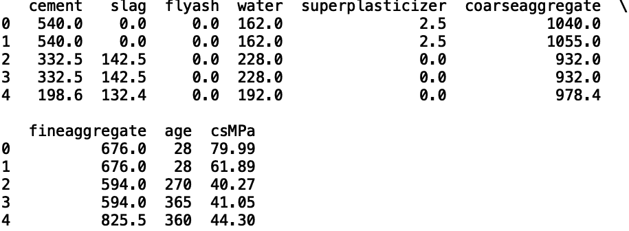
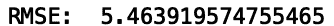
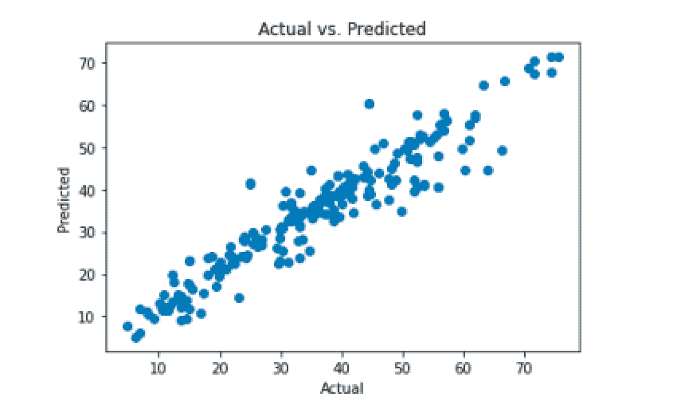
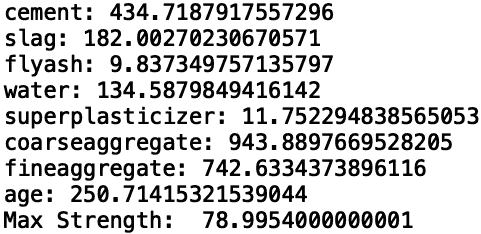
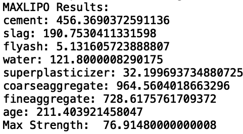

# Python 中机器学习模型的元启发式优化指南

> 原文：<https://towardsdatascience.com/a-guide-to-metaheuristic-optimization-for-machine-learning-models-in-python-6d85ef8230ee>

## 优化机器学习模型输出的方法


图片由 [Cottonbro](https://www.pexels.com/@cottonbro/) 在[像素](https://www.pexels.com/photo/a-woman-typing-on-keyboard-5473337/)上拍摄

数学优化是寻找使函数输出最大化(或最小化)的最佳输入集的过程。在最优化领域，被优化的函数称为目标函数。有许多现成的工具可以用来解决优化问题，这些工具只适用于性能良好的函数，也称为凸函数。性能良好的函数包含一个最优值，不管它是最大值还是最小值。在这里，一个函数可以被认为是一个只有一个谷(最小值)和/或一个峰(最大值)的曲面。非凸函数可以被认为是具有多个山谷和山丘的曲面。

凸函数的优化，也称为凸优化，已被应用于简单的任务，如投资组合优化，航班调度，最佳广告和机器学习。在机器学习的背景下，凸优化在训练几种机器学习模型时起作用，包括[线性回归](https://builtin.com/data-science/linear-regression-tensorflow)、[逻辑回归](https://builtin.com/data-science/guide-logistic-regression-tensorflow-20)和[支持向量机](/support-vector-machine-introduction-to-machine-learning-algorithms-934a444fca47)。

凸优化的一个限制是它假设目标函数保证有一个谷和/或山。用专业术语来说，凸函数保证有所谓的全局最大值或最小值。然而在实践中，许多目标函数并不具有这种特性，这使得它们是非凸函数。这是因为在实际应用中使用的许多目标函数非常复杂，并且包含许多峰和谷。当目标函数包含许多峰和谷时，通常很难找到最低的谷或最高的峰。

元启发式优化是优化这种非凸函数的最佳方法。这些算法是最佳选择，因为它们不假设函数包含多少个峰和谷。虽然这种方法有助于找到最小值和最大值，但它们对应于所谓的局部最大值(靠近高山)和最小值(靠近低谷)。因此，当使用元启发式优化来优化非凸函数时，记住这些算法不能保证找到全局最大值(最高的山)或最小值(最低的谷)。这是因为当优化具有许多峰和谷的非凸函数时，找到最低的谷或最高的峰通常在计算上不可行。尽管如此，元启发式优化通常是现实生活应用的唯一手段，因为凸优化对函数中存在的单个峰和/或谷做出了强有力的假设。这些算法通常提供接近足够低的山谷或足够高的山丘的解决方案。

元启发式优化对于优化机器学习模型的输出是重要的。例如，如果您为水泥制造商构建一个预测水泥强度的模型，您可以使用元启发式优化来查找使水泥强度最大化的最佳输入值。像这样的模型采用对应于水泥混合物中成分数量的输入值。然后，优化程序将能够找到最大化强度的每种成分的数量。

Python 提供了各种各样的元启发式优化方法。差分进化是一种常用的方法。它的工作原理是提供一系列候选最优解，并通过在搜索空间中移动候选解来迭代改进这些解。Maxlipo 是另一种类似于差分进化的方法，附加了一个假设，即函数是连续的。连续函数是没有间断或跳跃的函数。Maxlipo 是对差分进化的改进，因为它能够以明显更少的函数调用找到最优值。这意味着算法运行更快，同时仍然能够找到接近最优的值。差分进化和 maxlipo 都是遗传算法的变体，遗传算法通过重复修改候选解来工作，直到找到接近最优的解。

这两种元启发式优化算法在 Python 中都有易于使用的库。使用 Python 科学计算库 [Scipy](https://scipy.org/) 和使用 Python 包装的 C++库[dlib](https://pypi.org/project/dlib/)max lipo 可以实现差分进化。

在这里，我们将建立一个简单的机器学习模型，用于预测混凝土强度。然后，我们将构建一个优化器来搜索最大化强度的属性值。我们将使用[混凝土强度回归数据集](https://archive.ics.uci.edu/ml/datasets/Concrete+Compressive+Strength) [1]。

**注**:本数据库的重复使用是不受限制的，保留叶义成教授的版权声明和文章末尾引用的已发表论文。

**读入数据**

让我们首先导入 Pandas 库并将数据读入 Pandas 数据框:

```
import pandas as pd
df = pd.read_csv("Concrete_Data_Yeh.csv")
```

接下来，让我们显示前五行数据:

```
print(df.head())
```



作者图片

我们看到数据包含水泥、矿渣、粉煤灰、水、超塑化剂、粗骨料、细骨料、龄期和 CsMPa。最后一列包含对应于混凝土强度的 csMPa 值。我们将构建一个随机森林模型，使用所有前面的输入来预测 csMPa。接下来，让我们定义我们的输入和输出:

```
X = df[['cement', 'slag', 'flyash', 'water', 'superplasticizer',
       'coarseaggregate', 'fineaggregate', 'age']]y = df['csMPa']
```

接下来，让我们将数据分为训练和测试两部分:

```
from sklearn.model_selection import train_test_splitX_train, X_test, y_train, y_test = train_test_split(X,y, test_size=0.2, random_state = 42)
```

接下来，让我们从 Scikit learn 中的 ensemble 模块导入随机森林类:

```
from sklearn.ensemble import RandomForestRegressor
```

让我们将随机森林回归类的一个实例存储在一个名为 model 的变量中。我们将定义一个随机森林模型，它有 100 个估计值，最大深度为 100:

```
model = RandomForestRegressor(n_estimators=100, max_depth=100)
```

接下来，让我们将模型与通过训练/测试分割方法返回的训练数据相匹配:

```
model.fit(X_train, y_train)
```

然后，我们可以对测试集进行预测，并将预测存储在一个名为 y_pred 的变量中:

```
y_pred = model.predict(X_test)
```

接下来，让我们评估我们的回归模型的性能。我们可以使用均方根误差(RMSE)来评估我们的模型表现如何:

```
from sklearn.metrics import mean_squared_errorimport numpy as nprmse = np.sqrt(mean_squared_error(y_test, y_pred))print("RMSE: ", rmse)
```



作者图片

我们看到我们的随机森林模型给出了不错的性能。我们还可以使用实际对比预测图来直观显示性能。实际值和预测值之间的线性关系表明性能良好:

```
import matplotlib.pyplot as pltplt.scatter(y_test, y_pred)
plt.title("Actual vs. Predicted")
plt.xlabel("Actual")
plt.ylabel("Predicted")
```



作者图片

我们看到，我们确实有一个线性关系，我们的 RMSE 很低，所以我们可以对我们的模型的性能感到满意。

既然我们对我们的模型感到满意，我们可以定义一个新的模型对象，我们将在完整的数据集上对其进行训练:

```
model_full= RandomForestRegressor(n_estimators=100, max_depth=100, random_state =42)model_full.fit(X, y)
```

model_full 对象有一个 predict 方法，它将作为我们要优化的函数，也称为目标函数。

我们优化任务的目标是找到优化水泥强度的每个输入的值。

**差异进化**

让我们从 Scipy 中的优化模块导入差分进化类:

```
from scipy.optimize import differential_evolution
```

接下来，让我们定义我们的目标函数。它将获取与模型输入相对应的输入数组，并返回每个集合的预测值:

```
def obj_fun(X):
    X = [X]
    results = model_full.predict(X)
    obj_fun.counter += 1
    print(obj_fun.counter)
    return -results
```

我们还将打印每一步的函数调用次数。这将有助于比较优化器之间的运行时性能。理想情况下，我们希望优化器能够最快地找到最大值，这通常意味着更少的函数调用。

接下来，我们需要为每个输入定义上限和下限。让我们使用每个输入数据中可用的最大值和最小值:

```
boundaries = [(df['cement'].min(), df['cement'].max()), (df['slag'].min(), df['slag'].max()), (df['flyash'].min(), df['flyash'].max()), 
                (df['water'].min(), df['water'].max()), (df['superplasticizer'].min(), df['superplasticizer'].max()),
       (df['coarseaggregate'].min(), df['coarseaggregate'].max()), (df['fineaggregate'].min(), df['fineaggregate'].max()), (df['age'].min(), df['age'].max())]
```

接下来，让我们将目标函数和边界传递给差分进化优化器:

```
if __name__ == '__main__':
    opt_results = differential_evolution(obj_fun, boundaries)
```

然后，我们可以打印最佳输入和输出值:

```
 print('cement:', opt_results.x[0])
    print('slag:', opt_results.x[1])
    print('flyash:', opt_results.x[2])
    print('water:', opt_results.x[3])
    print('superplasticizer:', opt_results.x[4])
    print('coarseaggregate:', opt_results.x[5])
    print('fineaggregate:', opt_results.x[6])
    print('age:', opt_results.x[7])

    print("Max Strength: ", -opt_results.fun)
```



作者图片

我们看到，在 5500 次函数调用之后，差分进化优化器找到了一个最佳值 79。这种性能相当差，因为它需要大量的函数调用，这使得算法运行非常慢。此外，所需的函数调用次数不能由研究人员指定，实际上可能在运行之间有所不同。这为优化创造了不可预测的运行时间。

**MAXLIPO 优化器**

Maxlipo 是一个更好的选择，因为它能够用更少的函数调用找到接近最优的值。此外，用户可以指定函数调用，这解决了运行时不可预测的问题。

所以，让我们建立我们的 maxlipo 优化器。我们将从 Python 中的 dlib 库中导入该方法:

```
import dlib
```

接下来，让我们定义函数调用的上限和下限以及数量:

```
import dliblbounds = [df['cement'].min(), df['slag'].min(), df['flyash'].min(), df['water'].min(), df['superplasticizer'].min(), df['coarseaggregate'].min(), 
           df['fineaggregate'].min(), df['age'].min()]
ubounds = [df['cement'].max(), df['slag'].max(), df['flyash'].max(), df['water'].max(), df['superplasticizer'].max(), df['coarseaggregate'].max(), 
           df['fineaggregate'].max(), df['age'].max()]
max_fun_calls = 1000
```

由于目标函数需要采取稍微不同的形式，让我们重新定义它:

```
def maxlip_obj_fun(X1, X2, X3, X4, X5, X6, X7, X8):
    X = [[X1, X2, X3, X4, X5, X6, X7, X8]]
    results = model_full.predict(X)
    return results
```

接下来，我们将边界、目标函数和函数调用的最大数量传递给优化器:

```
sol, obj_val = dlib.find_max_global(maxlip_obj_fun, lbounds, ubounds, max_fun_calls)
```

现在，我们可以打印我们的 Maxlipo 优化器的结果:

```
print("MAXLIPO Results: ")
print('cement:', sol[0])
print('slag:', sol[1])
print('flyash:', sol[2])
print('water:', sol[3])
print('superplasticizer:', sol[4])
print('coarseaggregate:', sol[5])
print('fineaggregate:', sol[6])
print('age:', sol[7])print("Max Strength: ", obj_val)
```



作者图片

我们看到该算法发现 1000 次函数调用的最大强度为 77。Maxlipo 算法找到了一个接近差分进化找到的最优值，但只有五分之一的函数调用。因此，Maxlipo 算法比差分进化快五倍。

这篇文章中的代码可以在 [GitHub](https://github.com/spierre91/builtiin/blob/main/optimization_tutorial.py) 上找到。

**结论**

优化是一种非常重要的计算方法，在各行各业都有广泛的应用。鉴于许多机器学习模型的复杂性质，在数值优化中做出的许多理想主义假设并不适用。这就是为什么不对函数形式做出强假设的优化方法对机器学习很重要。

可用于元启发式优化的 Python 库非常适合机器学习模型。当考虑优化器时，研究人员需要了解优化器在运行时和函数调用方面的效率，因为它会显著影响生成好结果所需的时间。忽略这些因素会导致公司因浪费计算资源而损失数千美元。出于这个原因，数据科学家需要对可用的元启发式优化方法有一个相当好的理解和熟悉。

如果你有兴趣学习 python 编程的基础知识、Pandas 的数据操作以及 python 中的机器学习，请查看[*Python for Data Science and Machine Learning:Python 编程、Pandas 和 sci kit-初学者学习教程*](https://www.amazon.com/dp/B08N38XW2Q/ref=sr_1_1?dchild=1&keywords=sadrach+python&qid=1604966500&s=books&sr=1-1) *。我希望你觉得这篇文章有用/有趣。*

***本帖原载于*** [***内置博客***](https://builtin.com/data-science) ***。原片可以在这里找到***<https://builtin.com/data-science/metaheuristic-optimization-python>****。****

***引文**:*

*[1].叶一成，“使用人工神经网络对高性能混凝土的强度进行建模”，水泥与混凝土研究，第 28 卷，第 12 期，第 1797–1808 页(1998 年)。*