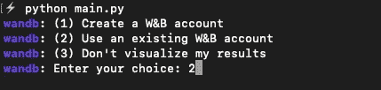
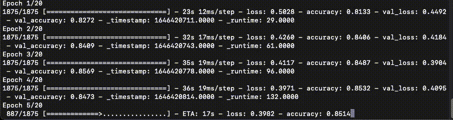
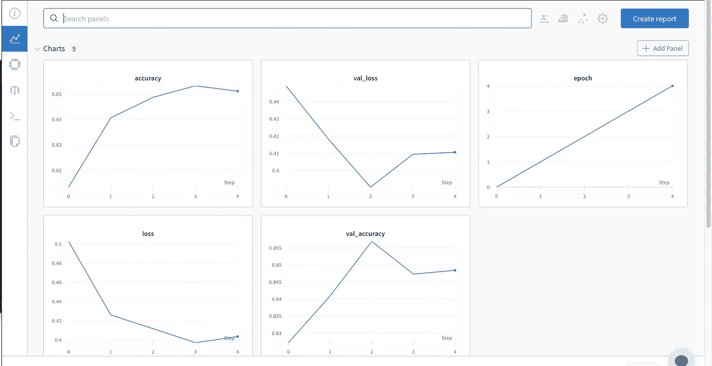
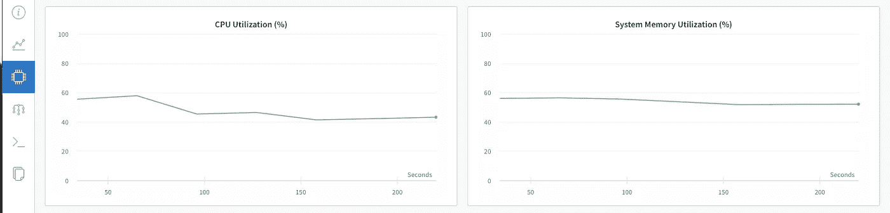
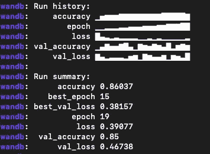
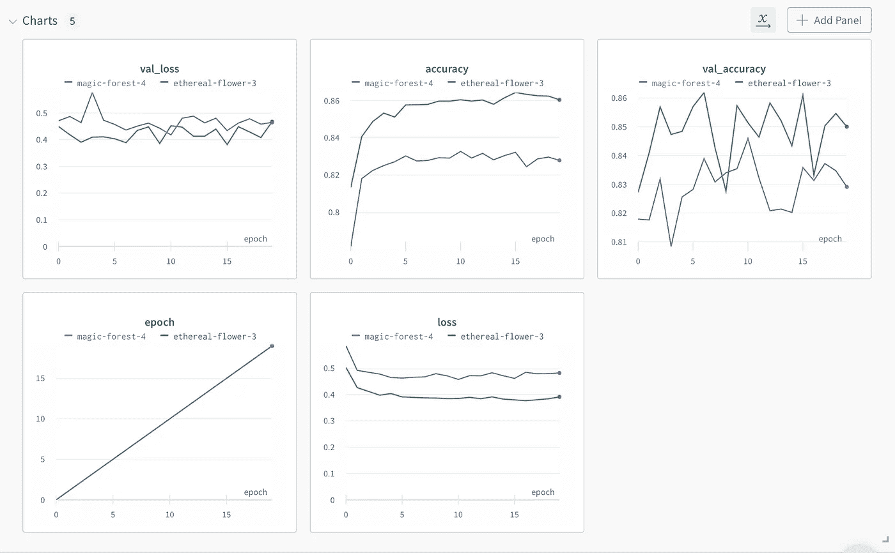
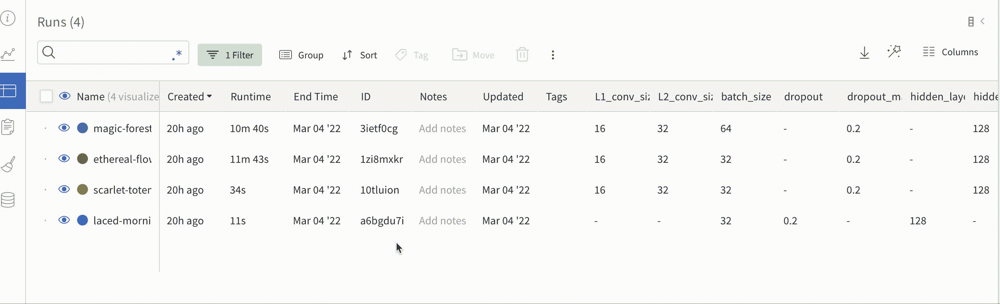

# ML 实验跟踪快速指南——带权重和偏差

> 原文：<https://towardsdatascience.com/a-guide-to-ml-experiment-tracking-with-weights-biases-93a3a2544413>

## 通过度量和日志以及一个示例项目演练，轻松学习跟踪您的所有 ML 实验


照片由[吴镇男·麦金尼](https://unsplash.com/@derickray?utm_source=medium&utm_medium=referral)在 [Unsplash](https://unsplash.com?utm_source=medium&utm_medium=referral) 上拍摄

对于数据科学从业者来说，反复试验的艰苦过程并不陌生。在您的日常工作或附带项目中，您会遇到各种用例，这些用例需要您能够跟踪 ML 管道的分支和实验，其数量级超过了通常的软件项目。

您的目标是为您的解决方案产生可重复的结果并实现更高的准确性(或您需要的任何其他指标),如果不牢牢把握您的管道及其每一个组件，您就无法做到这一点。

通过帮助您跟踪、可视化和试验您的训练数据、代码以及超参数的工具，这种事情变得更加容易，这些工具使您能够在详细的级别上监控您的模型的性能。

**让我给你介绍一个这方面的绝妙工具——**[**权重和偏见**](https://docs.wandb.ai/) **。**

在本教程中，我将帮助您了解基础知识，并让您熟悉深度学习项目的训练运行的设置和实验跟踪。

所以，让我们开始吧！

# 项目设置

在这个使用权重和偏差的演练中，我们将在 Keras 中对时尚 MNIST 数据(与 Keras 捆绑在一起)探索卷积神经网络(我们将它称为:W&B 或`**wandb**`)。

通常，第一步是在虚拟环境中安装所需的库:

```
pip install tensorflow wandb # or if you use pipenv like myselfpipenv shell
pipenv install tensorflow wandb
```

最后，让我们为代码创建两个 python 文件:

1.  `**train.py:**` 存储模型架构和
2.  `**main.py:**` 以超参数为自变量进行训练。

# 带有 wandb 的模型

我们将要构建的 Keras 模型将根据数据进行多类分类，分为 10 个不同的类。

第一步是初始化项目的`**wandb**`:

```
# initialize wandb logging to your projectwandb.init(project=args.project_name)
```

> 注意:现在不要担心`**args**`变量，我们稍后会谈到它。:)

然后，我们希望确保我们的模型可以访问我们传递给它的任何参数(超参数):

```
# log all experimental args to wandbwandb.config.update(args)
```

现在，就像在一个简单的 Keras 工作流中一样，让我们接收数据，对其进行规范化，并对其进行整形:

```
# load and prepare the data(X_train, y_train), (X_test, y_test) = fashion_mnist.load_data()labels=["T-shirt/top","Trouser","Pullover","Dress","Coat", "Sandal","Shirt","Sneaker","Bag","Ankle boot"] # normalize the dataX_train = X_train.astype('float32')X_train /= 255.X_test = X_test.astype('float32')X_test /= 255.# reshape the dataX_train = X_train.reshape(X_train.shape[0], img_width, img_height, 1)X_test = X_test.reshape(X_test.shape[0], img_width, img_height, 1)
```

现在，我们想一次性将数据和标签编码成分类值。这可以简单地通过以下方式实现:

```
# one hot encode outputsy_train = np_utils.to_categorical(y_train)y_test = np_utils.to_categorical(y_test)num_classes = y_test.shape[1] # = 10, as there are 10 classes in fashion mnist dataset
```

现在，我们需要建立我们的模型。为了这个教程，我们先来看一个简单的 CNN。

```
# build modelmodel = Sequential()model.add(Conv2D(args.L1_conv_size, (5, 5), activation='relu', input_shape=(img_width, img_height,1)))model.add(MaxPooling2D(pool_size=(2, 2)))model.add(Conv2D(args.L2_conv_size, (5, 5), activation='relu'))model.add(MaxPooling2D(pool_size=(2, 2)))model.add(Dropout(args.dropout_mask))model.add(Flatten())model.add(Dense(args.hidden_size, activation='relu'))model.add(Dense(num_classes, activation='softmax'))
```

看到了吗？不要太花哨。

> **额外**:如果你在上面的代码中看到一些你并不真正理解的东西，那也没关系。我也为一个真实世界的项目写了另一个在 Keras 做 CNN 的教程。[想学就从这里学吧。](/image-classification-with-early-stopping-a-quick-tutorial-58d3d346184c):)

现在，我们准备好声明我们的优化器了。对于这种情况，我们使用`**Adam**`。

```
adam = Adam(lr = args.learning_rate)
```

现在，我们想使用 Keras 的`**ImageDataGenerator**`模块，在我们的训练过程中接收验证图像，并输出我们的验证精度和损失:

```
val_generator = ImageDataGenerator()
```

最后，我们可以用两行代码来编译和拟合我们的模型:

```
model.compile(loss='categorical_crossentropy', optimizer=adam, metrics=['accuracy'])model.fit(X_train, y_train, validation_data = (X_test, y_test), epochs = args.epochs, callbacks = [WandbCallback(data_type = "image", labels = labels, generator = val_generator.flow(X_test, y_test, batch_size=32))])
```

> **Extra** :你也可以用另一个简单的语句保存你的模型:
> 
> `model.save(f"{args.model_name}.h5")`

让我们把所有这些都打包到我们的`**train.py**`模块中的一个函数中，好吗？

这里是在`**train.py**`的完整代码，以及导入。

**train . py 的代码** —作者提供

注意到结尾的小`**WandbCallback**`了吗？它的行为就像 Keras 中的一个典型回调，将有关训练时期的每个细节传递给 wandb 接口，以便跟踪它们。

好吧，看起来不错。现在，我们可以继续构建`**main.py**`来使用不同的超参数作为参数运行我们的模型。这是我们所有的"`**args**`"对象发挥作用的地方。

让我们从定义一个参数解析器对象开始:

```
import argparse # build in Python module for just the thing!parser = argparse.ArgumentParser()
```

让我们为我们的模型运行提供一个项目名称，好吗？

```
parser.add_argument("-p","--project_name",type=str,default= "fashion_mnist")
```

既然您已经看到了如何使用解析器添加/读取额外的参数，那么很容易看到我们如何以类似的方式指定所有其他的参数(没有双关的意思)。

例如，像这样阅读`**learning rate**`参数:

```
parser.add_argument("-lr","--learning_rate",type=float,default=LEARNING_RATE,help="learning rate")
```

诸如此类。整个代码将如下所示:

来自作者的完整 main.py 代码

既然我们已经完成了所有的代码，让我们继续运行所有的代码吧！

# 执行和跟踪实验

难的部分结束了，容易和好玩的部分从这里开始。

当您第一次尝试运行该脚本时，您将得到以下结果:



作者图片—**wandb 终端登录**

在这里，我建议您选择(2)，为了做到这一点，我建议您在浏览器中导航到 W&B 页面来执行步骤(1)。

一旦成功登录，您就可以用上面的命令执行`**main.py**`。它会像这样继续下去:



作者图片— **纪元执行**

现在，当您的培训正在进行时，转到您打开 W&B 仪表板的浏览器选项卡。我们欢迎你来到这样一个不断更新的屏幕:



作者图片— r **在 W & B 界面**中培训期间实时更新指标

您还可以访问实时更新的 CPU/内存利用率:



作者图片— **系统标签**

当运行结束时，您将在终端中看到以下屏幕:



作者图片— **培训完成后的终端**

注意我们是如何运行 main.py 脚本而不传递任何参数的？这表明我们仍然使用我们在上面的代码中定义的缺省值。

让我们使用通过的两个 **参数**进行另一次训练运行:

```
python main.py --learning_rate 0.015 --batch_size 64
```

这些将**覆盖**我们提供的默认设置。现在，您的 W & B 仪表盘将显示您刚刚完成的两次训练跑步的对比:



作者图片— **两次训练的总结**

您现在有了一个**比较表**，其中包含了您已经执行的所有运行中的每一次运行中使用的指标和相关特性，如下所示:



作者图片— **所有运行对比表**

随着您的团队的成长，您的模型变得越来越复杂，同时还被部署到生产中，记录所发生的一切变得至关重要。

这看起来是一个很好的起点。

# 几句临别赠言…

感谢您的阅读。

我希望这篇简短的教程是一个很好的方法，可以为一个简单但有用的项目选择这个非常方便的工具。我建议您继续尝试使用“`**Sweeps**`”权重和偏差功能来运行任何超参数调整管道，如本项目中的网格搜索。这可能是一个很好的学习途径，让你更加熟悉这个平台和它的易用性。

下次见，[关注我，不要错过我的下一篇文章](https://ipom.medium.com/)。

## [我还建议成为一名中等会员，以便不要错过我每周发表的任何数据科学文章。在此加入👇](https://ipom.medium.com/membership/)

[](https://ipom.medium.com/membership/) [## 通过我的推荐链接加入 Medium

### 作为一个媒体会员，你的会员费的一部分会给你阅读的作家，你可以完全接触到每一个故事…

ipom.medium.com](https://ipom.medium.com/membership/) 

## 我的另外几篇文章你可能会感兴趣:

[](/31-datasets-for-your-next-data-science-project-6ef9a6f8cac6) [## 您下一个数据科学项目的 31 个数据集

### 基于任务的数据集的汇编，可用于构建下一个数据科学项目

towardsdatascience.com](/31-datasets-for-your-next-data-science-project-6ef9a6f8cac6) [](/26-github-repositories-to-inspire-your-next-data-science-project-3023c24f4c3c) [## 26 个 GitHub 存储库，激发您的下一个数据科学项目

### 用这个有趣的代码列表开始新的一年，包括库、路线图和项目书签

towardsdatascience.com](/26-github-repositories-to-inspire-your-next-data-science-project-3023c24f4c3c)