# 生存分析模型选择指南

> 原文：<https://towardsdatascience.com/a-guide-to-model-selection-for-survival-analysis-2500b211c733>

## 如何检查和评估事件时间数据的模型

[m.](https://unsplash.com/@m_____me?utm_source=medium&utm_medium=referral) 在 [Unsplash](https://unsplash.com?utm_source=medium&utm_medium=referral) 上拍照

为感兴趣的事件时间数据选择合适的模型是生存分析中的重要步骤。

不幸的是，由于生存分析可用的模型数量庞大，很容易被所有可用的信息淹没。

虽然仔细研究每一种建模方法可能很有诱惑力，但让自己沉浸在统计术语中只会妨碍找到最佳模型的努力。

在这里，我们探讨了生存分析中的一些流行模型，然后讨论了在确定感兴趣的事件时间数据的最佳模型时应该考虑的因素。

## 关键术语

在介绍任何模型之前，熟悉一些在生存分析中感兴趣的指标是很重要的。

1.  **生存功能**

生存函数由 S(t)表示，其中:

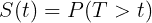

生存功能(由作者创建)

它显示了受试者存活(即未经历该事件)超过时间 t 的概率。这是一个非递增函数。

**2。危险功能**

风险函数，也称为风险率，用 h(t)表示，其中

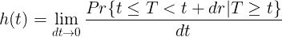

危险函数(由作者创建)

它显示了事件在时间 t 发生的*瞬时*概率，假设该事件尚未发生。危险函数可以从生存函数中导出，反之亦然。

**3。累积危险函数**

累积风险函数是一个非递减函数，它显示在时间 t 发生的事件的总累积风险。在数学术语中，它是风险函数下的面积。

**4。危险比率**

危险比是两组之间危险率的比率。这是对协变量如何影响研究中受试者生存期的量化测量。

## 选择正确的模型

有许多模型可以用于生存分析。

但是，每种型号在以下方面都是独一无二的:

*   他们做出的假设
*   他们提供的信息

因此，选择正确的模型可以归结为确定一个模型，该模型做出适合事件发生时间数据的假设，并使用户能够通过后续分析获得所需的信息。

## 生存分析中的流行模型

在可用于分析事件发生时间数据的众多模型中，有 4 个模型最为突出:Kaplan Meier 模型、指数模型、Weibull 模型和 Cox 比例风险模型。

在下面的演示中，将使用 Python 的[生命线](https://lifelines.readthedocs.io/en/latest/index.html)模块探索每种建模方法。这些模型将用于检查内置数据集中的事件发生时间数据。

下面是数据集的预览:

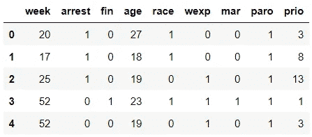

代码输出(由作者创建)

`week`栏显示存活持续时间，而`arrest`栏显示事件(即停搏)是否已经发生。

## **1 -卡普兰迈耶模型**

Kaplan-Meier 模型可以说是生存分析中最著名的模型。

它被归类为*非参数*模型，这意味着它不假设数据的分布。它只利用*提供的*信息生成一个生存函数。

Kaplan Meier 模型使用以下公式计算生存函数:

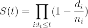

生存功能(由作者创建)

这是根据事件发生时间数据构建的卡普兰·迈耶曲线:

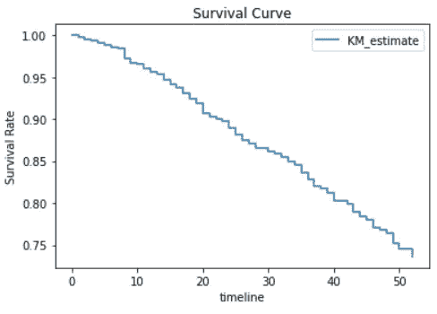

代码输出(由作者创建)

不同组的生存函数可以用*对数秩检验*进行比较，这是一种非参数假设检验。

作为一个例子，我们可以使用`logrank_test`方法比较有和没有经济援助的受试者的生存功能，以查看经济援助是否影响生存持续时间。

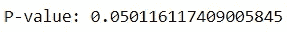

代码输出(由作者创建)

卡普兰迈耶模型的好处是直观，易于解释。由于它很少做潜在的假设，这个模型经常被用作生存分析的基线。

不幸的是，由于模型的最小复杂性，很难从中得出有意义的见解。它不能用于比较不同组之间的风险，也不能用于计算风险比等指标。

## 双指数模型

指数模型是生存分析中另一个流行的模型。与 Kaplan Meier 模型不同，它是一个*参数*模型，这意味着它假设数据符合特定的分布。

指数模型的生存函数由以下公式导出:

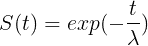

生存功能(由作者创建)

指数模型的风险率由以下公式得出:

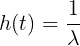

危险函数(由作者创建)

指数模型假设风险率为常数。换句话说，在整个观察期内，相关事件发生的风险保持不变。

下面是根据指数模型绘制的生存曲线:

为了确定危险度量，可以计算该分布中的λ值:

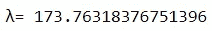

代码输出(由作者创建)

用户还可以直接获得具有生命线程序包中提供的属性的风险度量，该程序包在数据框中报告风险率和累积风险函数:

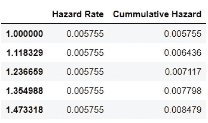

代码输出(由作者创建)

基于输出，危险率保持不变，这符合指数模型的性质。

总的来说，指数模型提供了生存函数和风险函数的大量信息。此外，它还可以用来比较不同群体的风险率。

但是，它强烈假设风险率在任何给定时间都是恒定的，这可能不适合感兴趣的事件发生时间数据。

## 3 -威布尔模型

另一个可以考虑的参数模型是威布尔模型。

威布尔模型中的存活率由以下公式确定:

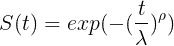

生存功能(由作者创建)

威布尔模型中的危险率由以下公式确定:

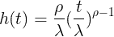

危险率(由作者创建)

威布尔模型中的数据分布由两个参数决定:λ和ρ。

λ参数表示 63.2%的受试者经历该事件所需的时间。

ρ参数表示危险率是增加、减少还是保持不变。如果ρ大于 1，则危险率不断增加。如果ρ小于 1，则危险率不断降低。

换句话说，威布尔模型假设危险率的变化是线性的。危险率可以总是增加，总是减少，或者保持不变。但是，危险率不能波动。

下面是根据威布尔模型绘制的生存曲线:

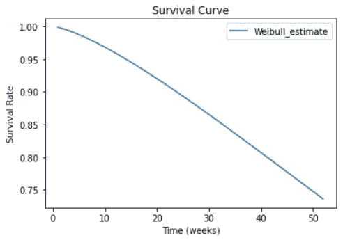

代码输出(由作者创建)

生命线程序包可用于获取λ和ρ参数:

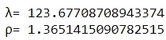

代码输出(由作者创建)

由于ρ值大于 1，所以该模型中的危险率总是增加的。

我们可以通过推导风险率和累积风险函数来证实这一点。

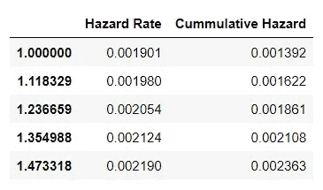

与指数模型相似，威布尔模型能够计算生存分析中的许多相关指标。

然而，其结果是基于一个强有力的假设，即风险率随时间呈线性变化，这可能不适合所讨论的事件时间数据。

## 4 - Cox 比例风险模型

虽然指数模型和威布尔模型可以评估协变量，但它们只能单独检查每个协变量。

如果目标是进行生存分析，一次检查多个变量的事件发生时间数据，Cox 比例风险模型(也称为 Cox 模型)可能是更好的选择。

Cox 模型实现了生存回归，这是一种针对生存期回归协变量的技术，以深入了解协变量如何影响生存期。

该模型被归类为*半参数*，因为它结合了参数和非参数元素。

它基于以下危险率公式:

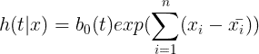

危险率公式(由作者创建)

与风险率遵循固定模式的参数模型相反，Cox 模型允许风险率波动。

然而，该模型依赖于比例风险假设。它假设各组之间的危险比保持不变。换句话说，无论受试者的风险率在观察期间如何变化，一组相对于另一组的风险率将始终保持不变。

生命线模块允许用户可视化基线生存曲线，该曲线说明了当所有协变量都设置为中值时的生存函数。

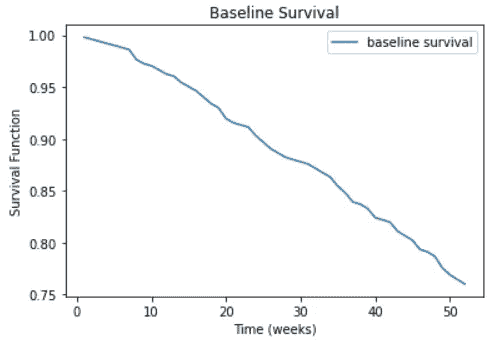

代码输出(由作者创建)

此外，Cox 模型可以用生存回归来量化协变量和受试者生存持续时间之间的关系强度。生命线模块中的`summary`方法显示了回归的结果。

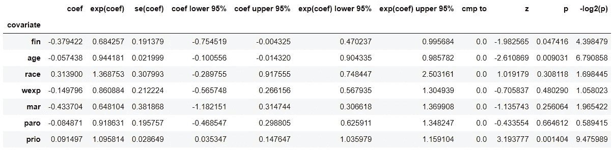

输出提供了很多信息，但是最深刻的见解可以从`exp(coef)`列和`p`列(p 值)中获得。

p 值表示哪些协变量对生存期有显著影响。基于这些结果，`fin`、`age`和`prio`协变量是决定生存期的统计显著预测因子，因为它们的系数的 p 值很小。

此外，每个协变量的风险比相当于 e 的协变量系数(eᶜᵒᵉᶠ)的幂，这已经在`exp(coef)`栏中提供。

例如，代表财政援助的`fin`协变量的 eᶜᵒᵉᶠ值是 0.68。

从数学上讲，这可以解释如下:

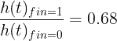

鳍的危险比率(由作者创建)

这意味着获得经济援助会使风险率降低 0.68 倍(即降低 32%)。

当然，只有当 Cox 模型的比例风险假设符合事件发生时间数据时，它才适用。为了证明模型的使用，可以使用`check_assumptions`方法来测试这个假设。

## 如何挑选合适的型号

当然，除了这四个模型之外，还有许多其他模型值得考虑，例如对数逻辑模型和加速故障时间模型(AFT)。因此，您可能会发现自己有太多的型号可供选择。

为了简化对最佳模型的搜索，请考虑以下因素:

1.  **目标**

你应该决定的第一件事是你想从你的生存分析中获得什么信息。有了明确的目标，就更容易找到理想的模式。

**2。领域知识**

可能有多个模型可用于导出所讨论的事件时间数据的期望指标。在这种情况下，利用主题的领域知识可以帮助过滤掉不合适的模型。

例如，如果你正在进行一项生存分析来研究机器故障，你应该考虑到机器容易磨损的事实。由于磨损，机器故障的风险会随着时间的推移而增加。在这种情况下，假设风险率始终不变的指数模型是不合适的，应该不予考虑。

**3。模型性能**

如果您发现有多个模型有助于实现研究的目标，并且符合主题的领域知识，您可以通过使用评估指标来衡量模型的性能，从而确定理想的模型。

一个合适的度量标准是赤池信息标准(AIC)，它是对模型预测误差的估计。较低的 AIC 分数对应于较好的模型。

例如，如果我们在指数模型和威布尔模型之间进行选择来分析事件发生时间数据，我们可以通过计算这两个模型的 AIC 分数来确定更优的模型。

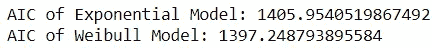

代码输出(由作者创建)

基于 AIC 度量，威布尔模型更适合于分析事件时间数据。

## 结论

在 [Unsplash](https://unsplash.com?utm_source=medium&utm_medium=referral) 上 [Prateek Katyal](https://unsplash.com/@prateekkatyal?utm_source=medium&utm_medium=referral) 拍摄的照片

总而言之，每一个模型在它所做的假设和提供的信息方面都是独一无二的。

如果您了解感兴趣的事件时间数据的性质，并且知道您希望从生存分析中获得什么，那么找到理想的模型应该是一项相对简单的任务。

如果您熟悉生存分析的方法，但想知道为什么它能在时间-事件数据上胜过其他类型的分析，请查看下面的文章:

 [## 生存分析:简介

### 最适合检查事件时间数据的方法初探

towardsdatascience.com](/survival-analysis-a-brief-introduction-bdba3a275b5f) 

我祝你在数据科学的努力中好运！