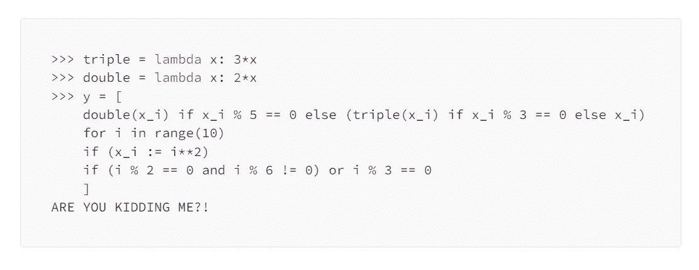
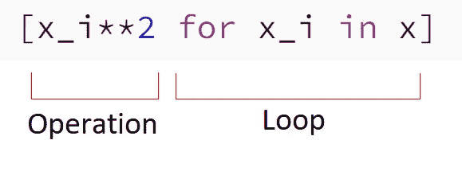
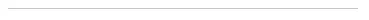

# Python 理解指南

> 原文：<https://towardsdatascience.com/a-guide-to-python-comprehensions-4d16af68c97e>

## PYTHON 编程

## 学习列表理解(listcomps)、集合理解(setcomps)、字典理解(dictcomps)甚至生成器表达式的复杂性


[祖扎娜·鲁特凯](https://unsplash.com/es/@zuzi_ruttkay?utm_source=medium&utm_medium=referral)在 [Unsplash](https://unsplash.com?utm_source=medium&utm_medium=referral) 上的照片

理解可能是 Python 中最流行的语法糖。它们是如此强大，当我最终理解它们时，它们让我大吃一惊，从那以后我就一直喜欢使用它们。

是的，你说得对。我第一次*理解*理解，而不是*看见*它们。这是因为，乍一看，它们似乎不那么可读。许多初学 Python 的人发现它们既不清晰也不容易理解。有些人可能更喜欢`for`循环；[有些人可能更喜欢](https://medium.com/towards-data-science/does-python-still-need-the-map-function-96787ea1fb05) `[map()](https://medium.com/towards-data-science/does-python-still-need-the-map-function-96787ea1fb05)` [功能](https://medium.com/towards-data-science/does-python-still-need-the-map-function-96787ea1fb05)；还有一些人可能更喜欢其他有用的东西——只是不喜欢理解。

如果你也是其中一员，我希望这篇文章能让你相信理解在不同的情况下可以派上用场，有时比 Python 提供的任何其他工具都更具可读性。如果你不在其中，我希望这篇文章能帮助你更多地了解理解是如何工作的；这可以帮助你理解和创造简单和高级的理解。此外，我们将讨论理解的一个重要方面:当理解越过太难的界限时，在这种情况下你应该放弃使用它。有时候，为了做到这一点，您必须能够说服自己放弃某个特定的理解，这个理解是如此高级，以至于使用它可能会显示您是一个有经验的 Python 程序员。

这是因为在某些情况下，不同的工具可以做得更好。我们将深入挖掘理解的实用性，我希望你不仅能从这篇文章中学到东西，还能喜欢阅读它。我会试着写下你需要知道的关于他们的一切，但这并不意味着我会写下关于他们的一切。但是一旦你理解了他们的要点并想学习更多，你就有足够的知识去做。

因此，本文旨在解释什么是 Python 理解，以及如何和何时使用它们。它也提供了理解和使用它们的一些重要的复杂性。

我还会介绍一个新名词，Python 的不解。虽然基于 Python 的通用代码库充满了理解和不理解，但你应该争取合理数量的前者，而不是后者。

# 理解入门

关于理解，我想让你理解的第一件事是单词*理解*的意思。虽然我在学习 Python 理解之前已经知道这个词的意思很多年了，但是我没能把这个意思放到 Python 的上下文中。[剑桥词典](https://dictionary.cambridge.org/dictionary/english/comprehension)对*理解*一词给出了如下定义:

> 完全理解和熟悉情况、事实的能力…

现在，这是我想让你记住的事情——这正是 Python 理解所做的事情:它们帮助理解代码正在做的动作。所以，你可以用另一种方式做这个动作，但这个动作是通过理解来完成的，它有助于理解正在发生的事情。这对他们的作者和读者都有帮助。

尽管如此，要注意 [*不理解*](https://dictionary.cambridge.org/dictionary/english/incomprehension) 这个词，是*理解*的反义词。虽然 Python 不提供*不解*，但当我们过度理解并使其不可读时，它们就会变成*不解。*下图介绍了 *Python 不解*这个术语，就是一个 Python 的领悟变成了一个无法理解的东西；也就是说，与理解存在的目的相反的东西:帮助理解代码正在做的动作。相反，不理解使得理解代码要做什么变得困难。



一句 Python 不解，意思是“*不要试图理解我！”*。图片作者。

我们将讨论如何让我们的理解变得可理解，而不是变得不可理解；如何*不*把它们变成 Python 的不解；因此，反过来，如何使你的代码 Pythonic 化，简单易懂。

我将理解视为语法糖，使我能够使用更简洁的代码而不是不同的编码工具，如`for`循环，来创建列表、字典、集合或生成器表达式。如你所见，你可以使用理解来创建四种不同类型的对象。在继续之前，让我们分析一个简单的例子，类似于您可能在许多其他资源中看到的例子。

在第一个例子中，我将向您展示如何使用最简单的理解类型来创建一个列表、一个集合、一个生成器表达式和一个字典。稍后，我们将主要使用列表或字典，这取决于我们将要讨论的内容。生成器表达式虽然使用相同的语法-糖语法创建，但提供了完全不同的行为，所以我将把它们留到另一篇文章中，专门讨论它们以及它们与列表理解的比较。

*列表理解(又名列表组件)*

假设在 Python 中没有理解，我们想做以下事情。我们有一个数值列表，比如说`x`，我们想要创建一个包含平方值`x`的列表。让我们开始吧:

```
>>> x = [1, 2, 3]
>>> x_squared = []
>>> for x_i in x:
...     x_squared.append(x_i**2)
>>> x_squared
[1, 4, 9]
```

现在让我们回到现实:Python 确实提供了列表理解。我们可以用更短、更容易理解的代码达到同样的效果:

```
>>> x = [1, 2, 3]
>>> x_squared = [x_i**2 for x_i in x]
>>> x_squared
[1, 4, 9]
```

这里的列表理解为`[x_i**2 for x_i in x]`。可以这样读:对`x`中的每个值计算`x_i**2`，并以列表形式返回新值。

为了比较两种方法的长度，让我来定义理解率:

```
n_for / n_comprehension
```

其中`n_for`代表`for`循环中的字符数，而`n_comprehension`代表相应理解中的字符数。为了公平起见，我将只使用一个字符的名称。该比率可以用百分比表示。

理解率显示理解代码与`for`循环相比有多短。警告:这只代表了故事的一个方面:理解的简洁。虽然对于某些示例来说，这种简洁是一件好事，但在其他一些示例中却不是，因为代码可能会变得太难理解。我们无论如何都会使用这个比率，这样你就可以知道与`for`循环相比，理解的时间有多短。此外，有时另一个编码工具可以比`for`循环做得更好，例如`[map()](/does-python-still-need-the-map-function-96787ea1fb05)`[函数](/does-python-still-need-the-map-function-96787ea1fb05)。

在这个简单的例子中，最初的`for`循环需要 26 个字符(不含空格)；列表理解，15 个字符。为了说明这一点，我计算了以下文本中的字符:

```
for loop:
y=[]foriinx:y.append(i**2)

list comprehension:
y=[i**2foriinx]
```

在这个例子中，理解率是 173%。还不错！

*集合理解(又名集合组合)*

```
>>> x = [1, 2, 3]
>>> x_squared = set()
>>> for x_i in x:
...     x_squared.add(x_i**2)
>>> x_squared
{1, 4, 9}
```

下面是相应的集合理解:

```
>>> x = [1, 2, 3]
>>> x_squared = {x_i**2 for x_i in i}
>>> x_squared
{1, 4, 9}
```

理解率为 186%。

*字典理解(又名字典理解，字典组合)*

```
>>> x = [1, 2, 3]
>>> x_squared = {}
>>> for x_i in x:
...     x_squared[x_i] = x_i**2
>>> x_squared
{1: 1, 2: 4, 3: 9}
```

一句名言理解成了现在:

```
>>> x = [1, 2, 3]
>>> x_squared = {x_i: x_i**2 for x_i in x}
>>> x_squared
{1: 1, 2: 4, 3: 9}
```

它的理解率比 listcomps 和 setcomps 低，为 124%。

*生成器表达式*

你可能想知道，术语*生成器表达式*与理解有什么关系？应该是类似*发电机领悟*的东西吧？

有效的观点。我想…我想可能是。对我来说，这很有意义。但我们就是这么叫的:*生成器表达式*。它们在这里是因为生成器表达式是使用与其他理解相同的语法糖创建的，尽管它们的行为非常不同。我不会讨论这种行为上的差异，因为这个话题太重要了，不能藏在一篇关于理解的普通文章里。因此，我在这里只展示生成器表达式，并保证以后会写更多关于它们的内容。

要创建一个生成器表达式，只需将 listcomp 代码放在方括号(`[]`)内，并用括号(`()`)括起来:

```
>>> x = [1, 2, 3]
>>> x_squared = (x_i**2 for x_i in x)
```

这里，`x_squared`是一个基于列表创建的生成器表达式。很容易看出，生成器表达式的理解率与相应的列表理解率相同。

# 扩展理解

上面的理解是最简单的，因为它们包含了对 iterable 的每个元素的操作。我说的*操作*是指理解的这一部分:`x_i**2`；不管我们还在对`x_i`做什么——请看下图，它解释了什么是*操作*。我们可以扩展这一部分，但不仅仅是这一部分；有很多扩展 Python 理解的可能性，这就是这个工具的强大之处。



列表理解的结构。图片作者。

下面的列表显示了我们如何扩展最简单的理解。我们可以使用

*   操作中的一个或多个功能
*   使用`if`语句对原始数据进行一个或多个过滤
*   操作输出的一个或多个过滤器，使用`if`语句
*   在操作中使用条件表达式，以对原始数据使用一个或多个过滤器；或者对操作的输出使用一个或多个过滤器
*   使用高级循环
*   以上各项的组合

这就是事情变得复杂的地方，我们的任务是确保我们的理解不会变成不理解。在讨论原因之前，我们先来看一下上述场景的例子。分析每一个例子，如果可能的话，在你的 Python 解释器中运行它，特别是当你对 Python 理解还是新手的时候。


上面的分类旨在帮助你理解理解是如何工作的。这不是正式的，老实说，你甚至不需要记住它。我用它来告诉你理解是多么的不同和强大。所以，分析例子，理解它们，如果你认为它们能帮助你，试着记住它们。



## 在操作中使用函数

```
>>> def square(x):
...     return x**2
>>> x = [1, 2, 3]
>>> x_squared_list = [square(x_i) for x_i in x]
>>> x_square_list
[1, 4, 9]
>>> x_squared_dict = {x_i: square(x_i) for x_i in x}
{1: 1, 2: 4, 3: 9}
```

例如，将`[square(x_i) for x_i in x]`理解为:为`x`中的每个值计算`square(x_i)`，并将结果作为列表返回。

上面，我们使用了一个函数。我们可以使用更多:

```
>>> def multiply(x, m):
...     return x*m
>>> def square(x):
...     return x**2
>>> x = [1, 2, 3]
>>> x_squared_list = [multiply(square(x_i), 3) for x_i in x]
>>> x_squared_dict = {x_i: multiply(square(x_i), 3) for x_i in x}
>>> x_square_list
[3, 12, 27]
>>> x_squared_dict = {x_i: square(x_i) for x_i in x}
{1: 3, 2: 12, 3: 27}
```

从现在开始，我将只列出理解。我希望在这一点上你知道不同类型的理解是如何工作的，所以没有必要一遍又一遍地重复它们，那样会弄乱代码。

## 过滤原始数据

```
>>> x = [1, 2, "a", 3, 5]
>>> integers = [x_i for x_i in x if isinstance(x_i, int)]
>>> integers
[1, 2, 3, 5]
```

我们从`x`开始创建这个列表，只取整数(所以，当`x_i`的类型是`int`，也就是`if isinstance(x_i, int)`)。

你看出这个版本和上一个版本有多相似了吗？是因为两者都使用了`if`语句过滤原始数据；他们只是以稍微不同的方式做它。以前，我们将其添加到操作中；这里，我们在循环之后添加了它。

这个版本和以前的版本过滤原始数据，与我们将在下一点所做的相反，即过滤操作的结果。换句话说，在这里您可以通过首先过滤数据并对过滤的数据应用列表理解来达到同样的目的。在下面的版本中，您将首先使用 list comprehension，然后过滤其值。

## 过滤操作的输出

```
>>> x = [1, 2, 3, 4, 5, 6]
>>> x_squared = [x_i**2 for x_i in x if x_i**2 % 2 == 0]
```

这里，我们只保留那些偶数的结果，拒绝奇数的结果。

注意这段代码并不完美:我们两次运行相同的操作*，第一次在操作中，然后在条件表达式中(以`if`开始)。从 Python 3.8 开始，我们可以使用 walrus 操作符来改进这段代码:*

```
*>>> x = [1, 2, 3, 4, 5, 6]
>>> x_squared = [y for x_i in x if (y := x_i**2) % 2 == 0]*
```

*如您所见，walrus 操作符使我们能够在这个列表理解中节省一半的计算。这就是为什么，如果你想使用比最简单的更高级的理解，你应该和海象算子成为朋友。*

*为了好玩和学习，我们可以使用 [timeit](https://medium.com/towards-data-science/benchmarking-python-code-with-timeit-80827e131e48) 来测试这两种理解，看看 walrus 操作符是否真的帮助我们提高了 listcomp 的性能。对于基准测试，我使用了下面的*性能*部分中的代码，代码片段如下:*

```
*setup = """x = list(range(1000))"""
code_comprehension = """[x_i**2 for x_i in x if x_i**2 % 2 == 0]"""
code_alternative = """[y for x_i in x if (y := x_i**2) % 2 == 0]"""*
```

*这是我在我的机器上得到的(32 GB 内存，Windows 10，WSL 1):*

```
*Time for the comprehension : 26.3394
Time for the alternative   : 31.1244
comprehension-to-alternative ratio: 0.846*
```

*显然，使用 walrus 操作符绝对是值得的——尽管性能增益没有达到人们预期和希望的 50%。一旦你知道这个操作符和这个版本的理解是如何工作的，你就可以使代码不仅性能更好，而且更容易理解。*

*这个理解比前几个稍微难读一点，虽然意思也一样简单:为`x`中的每个值计算`x_i**2`，拒绝输出(`x_i**2`)的所有偶数值；以列表形式返回结果。*

*正如你所看到的，你需要理解错综复杂的理解来阅读这一篇，但是一旦它们对你不构成问题，这样的理解就变得容易阅读了。然而，正如你稍后会看到的，有些理解一点也不容易读懂…*

## *在运算中使用条件表达式过滤数据*

```
*>>> x = [1, 2, "a", 3, 5]
>>> res = [x_i**2 if isinstance(x_i, int) else x_i for x_i in x]
>>> res
[1, 4, 'a', 9, 25]*
```

*这个列表理解应该这样理解:对于`x`中的每一个值，使用以下算法:当它是整数时，求平方；否则不要碰它；将结果收集到列表中。*

*这个版本非常类似于数据过滤；事实上，它是一种特定类型的数据过滤，是作为操作内部(而不是外部)的条件表达式(`x if condition else y`)来实现的。老实说，你可以使用上面介绍的数据过滤很容易地重写这个列表理解。为了避免混淆，我不会在这里展示它。但是你可以认为这是一个很好的练习:在操作之外，也就是在理解循环之后，使用数据过滤重写这个理解。*

**注释*:参见下一小节中的注释块，了解什么时候可以使用条件表达式，什么时候最好避免使用。*

## *在运算中使用条件表达式过滤结果*

*上面的 listcomp 过滤了数据；我们还可以使用条件表达式来过滤操作的结果，如下所示:*

```
*>>> x = [1, 2, 70, 3, 5]
>>> res = [y if (y := x_i**2) < 10 else 10 for x_i in x]
>>> res
[1, 4, 10, 9, 10]*
```

*为了避免两次使用相同的计算，我们再次使用了 walrus 运算符，如下所示:*

```
*>>> res = [x_i**2 if x_i**2 < 10 else 10 for x_i in x]*
```

*虽然这个版本不是*不正确的*(特别是对于 Python 3.7 和更早的版本)，但它不是高性能的。*

**

*由于在操作码中添加了条件表达式，所以当条件较短时，它会很有用。否则会弄乱操作码。在这种情况下，最好使用常规过滤，在理解循环之后出现`if`条件。*

**

## *使用高级循环*

*你不必像我们到目前为止所做的那样，只使用简单的循环。例如，我们可以在理解循环中使用`enumerate()`，就像在`for`循环中一样:*

```
*>>> texts = ["whateveR! ", "\n\tZulugula RULES!\n", ]
>>> d = {i: txt for i, txt in enumerate(texts)}
>>> d
{1: "whateveR! ", 2: "\n\tZulugula RULES!\n"}*
```

*现在，让我们遍历一下`d`字典的键值对:*

```
*>>> [(k, v.lower().strip()) for k, v in d.items()]
[(1, 'whatever!'), (2, 'zulugula rules!')]*
```

*基本上，你可以使用任何可以在`for`循环中工作的方法。*

## *上述场景的组合*

*上述情景是基本的，通常你不需要考虑这样的理解是否太难；他们不是。然而，情况可能会变得更加困难，尤其是当它包含不止一个正义的操作或过滤时；换句话说，当它结合了上述场景(包括在一次理解中使用同一个场景两次甚至更多次)。*

*如果你听说过 Python 的理解会变得太复杂，那你一定没听错。这就是为什么你可以经常读到你不应该过度使用理解；这也是事实。这就是我提出术语*不理解*的原因。你应该*绝对*避免在你的 Python 代码中使用不理解。*

*让我们考虑几个例子，这样你就可以自己看到理解会变得困难。虽然不是所有的例子都太复杂——但有些肯定会。*

*考虑这个 listcomp，它结合了过滤数据和过滤输出:*

```
*>>> x = range(50)
>>> [y for x_i in x if x_i % 4!= 0 if (y := x_i**2) % 2 == 0]
[4, 36, 100, 196, 324, 484, 676, 900, 1156, 1444, 1764, 2116]*
```

*看看我们在这里做了什么:计算所有能被 4 整除的`x`值的`x_i**2`，并且只取那些能被 2 整除的结果输出值。*

*这里我们有两个`if`条件。在这种情况下，我们可以通过使用`and`连接两个条件来简化理解:*

```
*>>> [y for x_i in x if x_i % 4!= 0 and (y := x_i**2) % 2 == 0]
[4, 36, 100, 196, 324, 484, 676, 900, 1156, 1444, 1764, 2116]*
```

*老实说，对我来说，两个`if`块中的两个条件似乎比一个`if`块中的两个条件用`and`操作符连接起来更容易理解。如果你不同意，那么如果你认为`and`有助于增加可读性，请在评论中分享。这个*在某种程度上是一个主观的问题，所以我不期望你们所有人都同意我。**

*不管你对使用`and`有什么想法，我们可以通过将它分成几行来提高这种理解的可读性，每一行代表一个块，该块表示*意味着某些事情*和/或*做某些事情*:*

```
*>>> [y for x_i in x
...  if x_i % 4 != 0
...  and (y := x_i**2) % 2 == 0]
[4, 36, 100, 196, 324, 484, 676, 900, 1156, 1444, 1764, 2116]*
```

*或者*

```
*>>> [
...     y for x_i in x
...     if x_i % 4 != 0
...     and (y := x_i**2) % 2 == 0
... ]
[4, 36, 100, 196, 324, 484, 676, 900, 1156, 1444, 1764, 2116]*
```

*以至*

```
*>>> [
...     y
...     for x_i in x
...     if x_i % 4 != 0
...     and (y := x_i**2) % 2 == 0
... ]
[4, 36, 100, 196, 324, 484, 676, 900, 1156, 1444, 1764, 2116]*
```

*当我们在第一行应用一个或多个函数时，最后一个版本更有用，所以这一行比一个名字要长，就像这里。*

*正如我提到的，两个`if`块对我来说更具可读性:*

```
*>>> [
...     y for x_i in x
...     if x_i % 4 != 0
...     if (y := x_i**2) % 2 == 0
... ]
[4, 36, 100, 196, 324, 484, 676, 900, 1156, 1444, 1764, 2116]*
```

*这个版本中我特别喜欢的是左边`if`积木的视觉对称性。你看到了吗？如果没有，返回到前面的代码块，并注意这两部分的区别:*

```
*...     if x_i % 4 != 0
...     if (y := x_i**2) % 2 == 0*
```

*这一部分:*

```
*...     if x_i % 4 != 0
...     and (y := x_i**2) % 2 == 0*
```

*虽然这些方面不太重要，但至少对我来说是有帮助的。我的意思是，当我在做一个更长的理解时，我会把它们考虑进去——我想建议你也把这些方面考虑进去。首先，信不信由你，这给了我乐趣。第二，当你确实注意到你理解的这些小方面时，你会觉得你非常了解它们；你会觉得他们已经(或者还没有，当他们没有准备好的时候)准备好了，完成了，完整了。*

*这种理解并没有那么难，是吗？所以，让我们把情况变得更复杂一点，从而理解列表:*

```
*>>> [
...     y for x_i in x
...     if x_i % 4 != 0 and x_i % 5 != 0
...     if (y := square(multiply(x_i, 3))) % 2 == 0
... ]
[36, 324, 1764, 2916, 4356, 6084, 10404, 12996, 15876, 19044]*
```

*这个*比*更复杂，但是我认为从这个角度来说，即使是这个理解也是非常可读的。然而，随着越来越多的条件被加入，它会变得越来越复杂——最终，在某一点上，越过了太复杂的界限。*

# *备选方案和示例*

*正如我已经写的，有时候一个`for`循环比理解更具可读性。然而，还有更多选择，比如`map()`和`filter()`功能。你可以在本文的[中阅读更多关于`map()`的内容，在这篇文章中，我解释了为什么了解这个函数的工作原理是有好处的，以及它何时可能是比理解更好的解决方案。](https://medium.com/towards-data-science/does-python-still-need-the-map-function-96787ea1fb05)*

*这些函数甚至比相应的理解更快，所以每当性能很重要时，你可能希望检查基于`map()`和`filter()`的代码是否比你使用的理解更好。*

*在简单的场景中，理解通常更好；在复杂的情况下，情况不一定如此。最好用例子来说明这一点。因此，下面我展示了几个理解的例子(包括生成器表达式)和相应的替代解决方案。*

**例 1。*`map()`函数代替了简单的生成器表达式。*

```
*>>> x = range(100)
>>> gen = (square(x_i) for x_i in x)
>>> other = map(square, x)*
```

*在这种情况下，这两个版本对我来说似乎同样可读，但理解看起来更熟悉。`map()`函数是一个抽象:你需要知道它是如何工作的，哪个参数必须先去(callable ),哪个参数必须后去(iterable)。*

*不像`map()`，在我看来，简单的理解，就像上面这个，看起来并不抽象。我可以直接阅读它们，从左到右写:我正在将函数`square()`应用到`x_i`，而`x_i`是`x`的后续元素；我将结果存储在一个`generator`对象中。*

*听起来很容易，但是我知道要阅读这样的理解(是的，我确实是这样读的！)，你需要知道这个特定的 Python 语法糖。这就是为什么对于高级(甚至中级)Python 程序员来说，这个生成器表达式(以及其他类似的简单理解)看起来很简单，但是对于初级 Python 开发人员来说，它们很少看起来简单。所以，理解也可以是抽象的。然而，我们很快就会看到，这种语法比它的直接替代方法要清晰得多。*

*当您在`map()`中使用`lambda` 函数时，`map()`函数的使用变得不那么清晰。比较:*

```
*>>> x = range(100)
>>> gen = (x_i**2 for x_i in x)
>>> other = map(lambda x_i: x_**2, x)*
```

*虽然`lambda`在 Python 中确实有它们的位置并且非常有用，但是在某些情况下它们会降低可读性——这就是这样的情况。在这里，比起`map()`版本，我更喜欢生成器表达式。*

**例 2* :使用`filter()`函数代替带有`if`块的生成器表达式进行数据过滤。*

```
*>>> x = range(100)
>>> gen = (x_i for x_i in x if x_i % 5 == 0)
>>> other = filter(lambda x_i: x_i % 5 == 0, x)*
```

*以上所有关于`map()`的注释都适用于`filter()`功能。和`map()`一样，可以带(像这里)也可以不带`lambda`使用。这里，我还是更喜欢发电机的说法。*

**例 3* :结合`map()`和`filter()`代替使用函数处理元素和`if`块过滤数据的生成器表达式。*

```
*>>> x = range(100)
>>> gen = (square(x_i) for x_i in x if x_i % 5 == 0)
>>> other = map(square, filter(lambda x_i: x_i % 5 == 0, x))*
```

*您可以分两步完成同样的操作:*

```
*>>> x_filtered = filter(lambda x_i: x_i % 5 == 0, x)
>>> other = map(square, x_filtered)*
```

*这是结合`map()`和`filter()`功能来处理和过滤数据的情况之一。但这也是我需要一些时间来理解这段代码在做什么的情况之一，同时能够几乎立即理解相应的理解(这里是一个生成器表达式)。在这里，我肯定会选择生成器表达式版本。*

**例 4:* 用`map()`带包装器功能代替字典理解。*

*字典理解使得创建字典非常简单。考虑这个例子:*

```
*>>> def square(x):
...     return x**2
>>> y = {x: square(x) for x in range(5)}
>>> y
{0: 0, 1: 1, 2: 4, 3: 9, 4: 16}*
```

*这看起来很简单，不是吗？现在尝试使用`map()`达到同样的效果。*

*问题是你需要创建键值对，所以，如果我们想用`map()`，函数返回输出是不够的；它也需要返回密钥。一个好的解决方案是在`square()`周围使用一个包装函数:*

```
*>>> def wrapper_square(x):
...     return x, square(x)
>>> y = dict(map(wrapper_square, range(5)))
>>> y
{0: 0, 1: 1, 2: 4, 3: 9, 4: 16}*
```

*你同意上面的字典理解比这个基于 T6 的版本可读性更好，更容易写，更容易读吗？这里，`for`循环比`map()`版本更容易理解:*

```
*>>> y = {}
>>> for x in range(5):
...     y[x] = square(x)
>>> y
{0: 0, 1: 1, 2: 4, 3: 9, 4: 16}*
```

**例 5* :一个`for`循环，用于过滤数据和过滤输出。*

*让我们回到我们实现了一个相当复杂的 listcomp 的例子:*

```
*>>> [
...     y for x_i in x
...     if x_i % 4 != 0 and x_i % 5 != 0
...     if (y := square(multiply(x_i, 3))) % 2 == 0
... ]
[36, 324, 1764, 2916, 4356, 6084, 10404, 12996, 15876, 19044]*
```

*相应的`for`循环如下所示:*

```
*>>> output = []
>>> for x_i in x:
...     y = square(multiply(x_i, 3))
...     if y % 2 == 0 and x_i % 4 != 0 and x_i % 5 != 0:
...         output.append(y)
>>> output
[36, 324, 1764, 2916, 4356, 6084, 10404, 12996, 15876, 19044]*
```

*实际上，没那么糟。我认为这是一种边缘情况，有些人仍然会选择 listcomp 版本，而其他人会认为它不可读，而选择`for`循环。对我来说，listcomp 仍然很好，但我很确定对一些人来说，它已经越过了太难的界限。*

**例 6* :拆分 listcomp。*

*让我们用和上面完全一样的例子。让我们试着做一些我不太喜欢的事情；也就是说，让我们将这个复杂的理解分成几个部分，希望这样可以简化代码:*

```
*>>> y_1 = [x_i for x_i in x]
>>> y_2 = [
...     y_1_i
...     for y_1_i in y_1
...     if y_1_i % 4 != 0 and y_1_i% 5 != 0
... ]
>>> y = [
...     y_final
...     for y_2_i in y_2
...     if (y_final := square(multiply(y_2_i, 3))) % 2 == 0
... ]
>>> y
[36, 324, 1764, 2916, 4356, 6084, 10404, 12996, 15876, 19044]*
```

*尽管进行了拆分，但在我看来，这个版本甚至比之前的版本可读性更差。它不仅长得多；对我来说，它的可读性也更差。我不会选择这个，但是我想给你看一下，以防你想知道这样的方法是否可行。这一次，不会了。*

**例 7* :使用函数简化运算和过滤。*

*有时，您可以通过将一些要完成的工作导出到外部函数来简化理解。在我们的例子中，我们可以通过操作和过滤器来实现:*

```
*>>> def filter_data(x_i):
...     return x_i % 4 != 0 and x_i % 5 != 0
>>> def filter_output(y_i):
...     return y_i % 2 == 0
>>> def pipeline(x_i):
...     return square(multiply(x_i, 3))
>>> def get_generator(x):
...     return (
...         y for x_i in x
...         if filter_output(y := pipeline(x_i))
...         and filter_data(x_i)
..      )
>>> list(get_generator(x))
[36, 324, 1764, 2916, 4356, 6084, 10404, 12996, 15876, 19044]*
```

*我认为这使得理解更容易阅读。然而，我们可以用`for`循环做同样的事情:*

```
*>>> output = []
>>> for x_i in x:
...     y = pipeline(x_i)
...     if filter_output(y) and filter_data(x_i):
...         output.append(y)
>>> output
[36, 324, 1764, 2916, 4356, 6084, 10404, 12996, 15876, 19044]*
```

*但是这个`for`循环比下面对应的生成器好吗(从上面的片段复制过来的)？*

```
*>>> (
...     y for x_i in x
...     if filter_output(y := pipeline(x_i))
...     and filter_data(x_i)
... )*
```

*我会选择 listcomp。它更简洁，看起来可读性更强，至少对我来说是这样。*

# *命名*

*这是一个提到命名的好时机。再看一遍以上理解中使用的函数名:`filter_data`、`filter_output`和`pipeline`。这些都是清楚的名字，这些名字告诉他们该负责什么；这样，他们应该帮助我们理解在理解中发生了什么。*

*也许有些人会说它们不是函数的好选择，因为理解应该很短，而更短的函数名将有助于我们写出更简洁的理解。他们只有一点是对的:理解会更简洁。但是写*简短的*理解并不意味着写*好的因为可读的*理解。将上面的理解与下面的进行比较，在下面的理解中，我使用了更短但同时意义更小的名称:*

```
*>>> def fd(x_i):
...     return x_i % 4 != 0 and x_i % 5 != 0
>>> def fo(y_i):
...     return y_i % 2 == 0
>>> def pi(x_i):
...     return square(multiply(x_i, 3))
>>> def g_g(x):
...     return (y for x_i in x if fo(y := pi(x_i)) and fd(x_i))
>>> list(get_generator(x))
[36, 324, 1764, 2916, 4356, 6084, 10404, 12996, 15876, 19044]*
```

*肯定更短——也肯定更糟。*

*注意，虽然这样理解的作者会知道`fd`代表`filter_data`而`pi`代表`pipeline`，但是其他人会知道吗？一个月后作者还会记得吗？还是一年？我不这么认为。因此，这是一个糟糕的命名，它没有函数所负责的真正含义，并且它的秘密代码(`fo`代表`filter_output`)将很快被遗忘。*

*如果你决定在理解中使用外部函数，一定要记住使用好的名字——好的含义*简短而有意义的*。这同样适用于理解中使用的所有名称。然而，在这里，我们应该使用尽可能短的名字，而不是更长。有一个不成文的规则，当一个变量有一个狭窄的范围，它不需要一个长名字。虽然这条规则并不总是合理的，但在理解中它往往是合理的。例如，考虑这些列表组合:*

```
*>>> y = [square(x_i) for x_i in x if x_i % 2 == 0]
>>> y = [square(xi) for xi in x if xi % 2 == 0]
>>> y = [square(p) for p in x if p% 2 == 0]
>>> y = [square(element_of_x) for element_of_x in x if element_of_x % 2 == 0]*
```

*前两个对我来说几乎一样好，尽管我会选择第一个。这是因为`x_i`看起来像带下标`i`的`x`；`xi`看起来不是那样。所以，我准备用额外的`_`字符来连接`x`和`i`，来表达这个额外的意思。这样，`x_i`在数学上看起来有点像`x_i`，意味着`x_i`属于`x`。虽然`xi`版本看起来非常相似，但它错过了数学方程的这种良好的相似性。因此我选择了前者。*

*我不喜欢第三个版本。为什么使用`p`作为循环变量的名称？`p`是什么意思？如果从我们实现的算法的角度来看，这意味着什么，那很好。但除此之外，就不好了。基本上，使用有意义的名字是好的——但是记住在理解中，你应该使用有意义的*简称。**

> *在理解中，你应该使用有意义的简短名字。*

*这也是我不喜欢第四版的原因。虽然名称`element_of_x`确实具有正确的含义，但该名称不必要太长。不要用长名字，因为短名字同样能提供信息。这里的情况是:`x_i`比`element_of_x`短得多，至少和`element_of_x`一样信息量大，如果不是更多的话——这要归功于`x_i`与数学方程式的共鸣。*

*还有一件事。当*不*使用循环变量时，使用`_`作为其名称。例如:*

```
*>>> template = [(0, 0) for _ in range(10)]*
```

*这里不需要使用`i`或任何我们想要的东西。*

# *太复杂还是还没？*

*随着时间和经验的积累，你会发现有时候很难决定一个特定的理解是否仍然可以理解，或者是否已经达到了太难的界限。如果你不知所措，选择`for`循环会更安全，因为几乎每个人都能理解它——虽然不是每个人都能理解复杂的列表组件。*

*然而，请记住，要尽可能使理解变得简单。例如，我们通过将一些或所有的计算转移到命名良好的外部函数来实现(在上面的例子中，这些函数是`pipeline()`、`filter_data()`和`filter_output()`)。但是，不要过度使用这种方法，因为它比纯粹的理解更罗嗦。更重要的是，定义只在代码中使用一次的函数并不是一个好主意。*

*关键是，任何时候你写了一个看起来复杂的理解，你应该分析它，并决定它是否足够容易理解。如果没有，用不同的方法替换它。有时基于函数组合的生成器管道可能是一个很好的解决方案，正如这里提出的。*

*决定哪个理解太复杂并不总是容易的。操作的数量不一定是一个好的指标，因为有时长的理解可能比短的理解更容易理解，这取决于它的目标和使用的命名。*

*还有一点需要记住的是，一个难理解的意思是*对一般开发者来说很难*，对你来说并不难。所以，如果你写了一篇非常复杂的理解文章，而且你理解起来没有问题，这并不意味着你应该去做。这可能是你理解它的原因，因为你花了三个小时写了这几行代码！因此，记住要让你的理解——就此而言，还有代码——对其他人来说也是可理解的。*

# *变量作用域*

*变量作用域在理解中的工作方式使它们不同于`for`循环——不同之处在于:*理解中使用的循环变量在理解的外部作用域中不可见，也不会覆盖外部作用域中的变量*。*

*用一个例子来解释会更容易些:*

```
*>>> x = [i**2 for i in range(10)]
>>> x
[0, 1, 4, 9, 16, 25, 36, 49, 64, 81]
>>> i
Traceback (most recent call last):
  File "<stdin>", line 1, in <module>
NameError: name 'i' is not defined*
```

*你看到发生了什么吗？虽然我们在列表理解中使用了`i`作为循环变量，但是它只在这个理解的范围内有效。在这个范围之外它是不可见的——一旦理解完成了列表的创建，它就被删除了。*

> **理解中使用的循环变量在理解的外部作用域中不可见，也不会覆盖外部作用域中的变量*。*

*这还不是全部。如下面的代码片段所示，即使在外部作用域中使用了同名的变量，也可以在理解中使用名称。所以，会同时出现两个不同的同名对象！但是这些名称只在它们的作用域中可见。*

```
*>>> i = "this is i"
>>> x = [i**2 for i in range(10)]
>>> x
[0, 1, 4, 9, 16, 25, 36, 49, 64, 81]
>>> i
'this is i'*
```

*当然，如果循环变量有相同的名字，你不能在理解中使用外作用域变量。换句话说，您无法从使用内部作用域`i`变量进行循环(或任何其他操作)的列表理解内部访问外部作用域`i`。*

**警告*:记住这条规则不适用于使用[walrus 运算符](/the-walrus-operator-in-python-a315e4f84583)赋值的变量:*

```
*>>> i = "this is i"
>>> x = [i for j in range(10) if (i := j**2) < 10]
>>> x
[0, 1, 4, 9]
>>> i
81*
```

*如您所见，使用 walrus 操作符将赋值变量(这里是`i`)放在理解的外部范围内。*

*再警告一次。不要过度使用这个特性，因为生成的代码会变得难以阅读，如下所示:*

```
*>>> x = range(10)
>>> x = [x**2 for x in range(10)]
>>> x
[0, 1, 4, 9, 16, 25, 36, 49, 64, 81]*
```

*这太过分了。*

*这种处理变量范围的方法使得使用理解变得安全，因为你不必担心理解的循环变量会覆盖一个重要的变量。如上所述，这是*而不是*循环如何工作:*

```
*>>> i = "this is i"
>>> for i in range(3):
...     print(i)
...
0
1
2
>>> i
2*
```

*如你所见，如果你在一个`for`循环中使用相同的名字，在外部作用域中以相同方式命名的变量将被循环变量的当前值覆盖；最终用它的最后一个值。*

# *表演*

*许多开发人员在决定使用语法糖时考虑的一个方面是性能。有人说没那么重要；也有人说是。*

*我的意见介于两者之间。请不要嘲笑我，但是我认为性能很重要，当…当性能很重要的时候。当它不存在时，不需要考虑它。*

> *当…当性能很重要时，性能很重要。*

*即使这听起来有点滑稽，如果不是愚蠢的，这是完全有道理的。如果您的应用程序是否快速并不重要，那么您为什么要担心性能呢？在这种情况下，最好使用其他因素来选择编码风格，比如简洁和可读性。然而，当性能很重要时，尤其是当性能很重要时(例如，在仪表板中)，您可以牺牲可读性来优化代码。*

*另一件重要的事情是开发时间。如果这很重要，那么也许你不应该花整整两天的时间来优化代码，这样可以节省两秒钟的应用程序执行时间。*

*好了，现在我们知道了什么时候考虑性能，让我们讨论性能理解是什么。一般来说，性能很大程度上取决于数据和理解本身，所以如果性能对特定的理解很重要，你应该对这种理解进行基准测试(如果可能的话)。*

*在这里，我将向您展示如何使用内置的`[timeit](https://docs.python.org/3/library/timeit.html)`模块来执行这样的基准测试。你可以从这篇介绍性文章中了解更多。您可以使用下面的片段作为模板，来进行您自己的基准测试。然而，在不久的将来，我将写另一篇文章，专门讨论这类基准测试。它们将被设计成能让我们对理解的表现得出深刻的结论。*

```
*# benchmark_comprehension.py
import timeit

def benchmark(code_comprehension: str,
              code_alternative: str,
              setup: str,
              n: int,
              rep: int) -> None:
    t_comprehension = timeit.repeat(
        code_comprehension,
        setup=setup,
        number=n,
        repeat=rep
    )
    t_alternative = timeit.repeat(
        code_alternative,
        setup=setup,
        number=n,
        repeat=rep
   )
    print(
        "Time for the comprehension :"
        f" {round(min(t_comprehension), 4)}"
        "\nTime for the  alternative : "
        f"{round(min(t_alternative), 4)}"
        "\ncomprehension-to-alternative ratio: "
        f"{round(min(t_comprehension)/min(t_alternative), 3)}"
    )

# timeit settings
n = 100
rep = 7

# code
setup = """pass"""
code_comprehension = """
for _ in [x**2 for x in range(1_000_000)]:
    pass
"""
code_alternative = """
for _ in map(lambda x: x**2, range(1_000_000)):
    pass
"""

if __name__ == "__main__":
    benchmark(code_comprehension, code_alternative, setup, n, rep)*
```

*为了运行这段代码，使用下面的 shell 命令(在 Windows 和 Linux 中都有效):*

```
*$ python benchmark_comprehension.py*
```

*这将运行基准并将结果打印到控制台。例如，这个在我的机器上提供了以下输出:*

```
*Time for the comprehension : 20.3807
Time for the alternative   : 19.9166
comprehension-to-alternative ratio: 1.023*
```

*您可以更改代码片段的以下部分:*

*   *设置代码→改变`setup`；这是在运行基准代码之前*运行的代码。**
*   *代码→改变`code_comprehension`和`code_alternative`；注意代码是用三重引号写的，所以你可以把它拆分成更多的行；但是，您也可以使用一行程序。*
*   *传递到`timeit.repeat()`的重复次数→改变`rep`。*
*   *运行代码的次数，传递到`timeit.repeat()` →改变`n`。*

*(如果您不确定`number`和`repeat`参数在`timeit.repeat()`中是如何工作的，您将在[这篇文章](/benchmarking-python-code-with-timeit-80827e131e48)中找到这一点以及更多内容。)*

*我使代码尽可能简单，这就是为什么我没有使用命令行参数；只是一个简单的基准测试应用程序。当然，你可以随心所欲地改进它。*

## *我们应该根据什么来衡量理解？*

*这可能是我们在进行此类基准测试之前需要问的最重要的问题。明显但不令人满意的答案是，反对最佳对应方法；它不能令人满意，因为它没有真正回答问题。让我们考虑一下。*

*   **生成器表达式**

*很容易决定我们应该对哪些生成器表达式进行基准测试:`map()`和`filter()`和/或它们的组合，或者反对任何其他返回生成器的方法。这两个函数分别返回`map`和`filter`对象，它们是生成器，就像生成器表达式一样。*

*   *列举理解*

*一个显而易见的比较方法是`for`循环。我们需要记住，在简单的场景中，列表理解将比相应的`for`循环更具可读性；然而，在复杂的场景中，通常情况相反。*

*另一种方法是使用`map()`和/或`filter()`，随后使用`list()`。然而，在这种情况下，请注意这不是一个自然的比较，因为当您需要一个列表时，您使用的是列表理解，而不是生成器理解。*

*   **词典释义**

*像上面一样，我们有两个最自然的版本:`for`循环和`map()`和/或`filter()`函数。然而，这次使用这两个函数有点棘手，因为我们需要使用键值对，所以函数也必须返回它们。我已经在上面展示了如何使用包装函数来实现这一点。然而，事实是，在这方面，字典理解在这里更容易使用。*

*   **集合理解**

*对于集合，情况几乎和列表一样，所以使用上面的建议。*

## *一些基准*

*如前所述，我们甚至不会试图在这里分析理解的表现，因为对于它们是否比它们的替代品更有表现的问题，没有一个简单的答案。答案取决于上下文。然而，我想在使用理解的这个方面给你们一些启发——至少向你们展示一些基础。*

*在下面的例子中，我将提供*

*   *分别作为`number`和`repeat`传递给`timeit.repeat()`的参数`n`和`rep`；*
*   *上面提供的基准测试代码片段中的`setup`、`code_comprehension`和`code_alternative`；和*
*   *输出，如前面提供的示例中的格式。*

**基准 1**

```
*n = 1_000_000
rep = 7

# code
length = 10
setup = """pass"""
code_comprehension = f"""y = [x**2 for x in range({length})]"""
code_alternative = f"""
y = []
for x_i in range({length}):
    y.append(x_i**2)
"""*
```

```
*Time for the comprehension : 1.6318
Time for the  alternative : 1.7296
comprehension-to-alternative ratio: 0.943*
```

*`length = 100`(对于`100`元素列表也是如此)和`n = 100_000`的结果:*

```
*Time for the comprehension : 1.4767
Time for the  alternative : 1.6281
comprehension-to-alternative ratio: 0.907*
```

*现在对于`length = 1000`(【T4 元素】列表)和`n = 10_000`:*

```
*Time for the comprehension : 1.5612
Time for the  alternative : 1.907
comprehension-to-alternative ratio: 0.819*
```

*最后，对于`length = 10_000`(`10_000` 元素列表)和`n = 1000`:*

```
*Time for the comprehension : 1.5692
Time for the  alternative : 1.9641
comprehension-to-alternative ratio: 0.799*
```

*在输出中，要查看的最重要的元素是比率，因为它是无单位的，而前两行中的时间不是，这取决于`number`(在我们的例子中是`n`)。如您所见，构造的列表的长度有所不同:列表越长，`for`循环相对越慢。*

**基准 2**

*我们将定义一个函数`length(x: Any) -> int`，它*

*   *当`x`为空可迭代或`None`时返回`0`；*
*   *返回可以确定的对象的长度；和*
*   *否则返回`1`。*

*因此，例如，一个数字的长度为`1`。我们将使用这个函数创建一个字典*

*   *键是来自 iterable 的值；和*
*   *如上所述，值是对象长度的元组；以及 iterable `x`中该元素的计数。*

```
*setup = """
def length(x):
    if not x:
        return 0
    try:
        return len(x)
    except:
        return 1

x = [1, 1, (1, 2, 3), 2, "x", "x", 1, 2, 1.1,
     "x", 66, "y", 34, 34, "44", 690.222, "bubugugu", "44"]
"""
code_comprehension = """
y = {el: (length(el), x.count(el)) for el in set(x)}
"""
code_alternative = """
y = {}
for el in set(x):
    y[el] = (length(el), x.count(el))
"""*
```

```
*Time for the comprehension : 0.5727
Time for the  alternative : 0.5736
comprehension-to-alternative ratio: 0.998*
```

*当我们制作由 100 个`x`列表组成的`x`时，我们得到了`comprehension-to-alternative ratio: 1.009`。正如我们所看到的，在这种情况下，列表的长度并不重要:两种方法都具有相同的性能——尽管 dict comprehension 要短得多，也很优雅，但是我认为您需要了解 Python comprehensions 才能理解它们。*

> *你需要了解 Python 的理解才能欣赏它们。*

# *需要的时候使用理解*

*这可能看起来很奇怪，但是即使你不需要结果对象，使用理解也是很有诱惑力的。这是一个例子:*

```
*>>> def get_int_and_float(x):
...     [print(i) for i in x]
...     return [i for i in x if isinstance(i, (int, float))]
>>> y = get_int_and_float([1, 4, "snake", 5.56, "water"])
1
4
snake
5.56
water
>>> y
[1, 4, 5.56]*
```

*注意这个函数的作用:它接受一个 iterable 并过滤数据，通过删除那些不属于`int`和`float`类型的数据。我们在`return`行中看到的列表理解的这种用法很好。尽管如此，我们还可以看到函数中使用的另一个列表理解:`[print(i) for i in x]`。这个列表只理解*打印*所有的条目，结果列表既不被存储也不被使用。那么，它是为了什么而创造的呢？我们需要它吗？当然不是。我们应该使用一个`for`循环来代替:*

```
*>>> def get_int_and_float(x):
...     for i in x:
...         print(i)
...     return [i for i in x if isinstance(i, (int, float))]
>>> y = get_int_and_float([1, 4, "snake", 5.56, "water"])
1
4
snake
5.56
water
>>> y
[1, 4, 5.56]*
```

*在这个例子中，`for`循环是一种自然的方法。*

*这是一个非常简单的例子，可能看起来有点太简单了。那么，让我们考虑另一个例子。想象一个从文件中读取文本，以某种方式处理文本，并将输出(处理后的文本)写入另一个文件的函数:*

```
*import pathlib

def process_text_from(input_path: pathlib.Path
                      output_path: pathlib.Path) -> None:
    # text is read from input_path, as string;
    # it is then processed somehow;
    # the resulting processed_text object (also string)
    # is written to an output file (output_path)

def make_output_path(path: pathlib.Path):
    return path.parent / path.name.replace(".", "_out.")*
```

*重要提示:注意`process_text_from()`函数不返回任何东西。*

*接下来，我们需要实现一个函数，它为路径的 iterable 的每个元素运行`process_text_from()`，`input_paths`:*

```
*from typing import List

def process_texts(input_paths: List[pathlib.Path]) -> None:
    [process_text_from(p, make_output_path(p)) for p in input_paths]*
```

*同样，这是*而不是*一个全功能的列表理解:我们创建一个既不存储也不使用的列表。如果你看到这样的东西，这是一个暗示，你不应该使用理解。想另一种方法。*

*这里，再一次，一个`for`循环似乎是最好的选择:*

```
*def process_texts(input_paths: List[pathlib.Path]) -> None:
    for p in input_paths:
        process_text_from(p, make_output_path(p))*
```

# *结论*

*Python 简单易读，或者至少这是我们被告知的——这也是大多数 python 爱好者对它的看法。简单性和可读性至少部分源于语言提供的语法优势。也许这种句法糖最重要的元素是理解。*

*我把理解和优雅联系在一起。它们使我们能够编写简洁易读的代码——以及优雅的代码。有时代码很复杂，但通常很简单——至少对那些了解 Python 的人来说是这样。这就是为什么 Python 初学者理解理解有问题，从而欣赏它们；这就是为什么他们一有机会就开始学习。*

> *我把理解和优雅联系在一起。它们使我们能够编写简洁易读的代码——以及优雅的代码。*

*这是个好主意，因为理解在 Python 代码中随处可见。我无法想象一个不写理解的中级 Python 开发人员，更不用说高级 Python 开发人员了。它们对 Python 来说是如此自然，以至于没有理解就没有 Python。至少我不能——也不想——想象没有它们的 Python。*

*本文旨在介绍 Python 的理解:列表、字典和集合理解；和生成器表达式。最后一种类型与其他类型完全不同，所以这可能是它的名字如此不同的原因。生成器表达式的语法与其他类型的语法相似，但它们生成生成器。因此，他们应该有自己的文章，我很快就要写了。*

*这里有一个总结，以及几个关于理解的附加想法:*

1.  *使用理解来帮助用户理解代码负责什么。*
2.  *当你需要创建一个列表时，使用列表理解，而不是不同类型的理解。同理，当你需要创建一个特定类型的对象时，使用相应的 list comprehension: dictcomp 用于字典，setcomp 用于集合，generator expression 用于生成器。*
3.  *有时候，使用一个特别复杂的理解可能很有诱惑力。一些人屈服于这种诱惑，希望通过这种方式，他们可以证明他们可以编写复杂和高级的 Python 代码。不惜任何代价抵制这样的诱惑。而不是炫耀，写清楚代码；当理解不清楚时，无论如何都要抵制住把它保留在代码中的诱惑。永远不要把你的理解变成不理解，就像永远不要放弃可读性一样。*
4.  *当你看到理解变得比可读性更复杂时，是时候考虑简化代码了——要么通过简化理解代码，要么通过使用替代解决方案。也许更好的名字会有用？或者把理解拆分成几行？或者，如果你已经这样做了，也许你可以尝试改变这种分裂？如果没有效果，请尝试不同的解决方案。有时一个`for`循环会工作得最好；有时候是别的东西。*
5.  *如果你选择使用理解力，即使你知道它太难了，要知道大多数高级程序员会认为你想炫耀。我知道这有多诱人！我陷入这种诱惑的次数比我愿意承认的要多。如果你意识到这个问题，并努力克服它，随着时间和经验的积累，你会发现它更容易抵挡诱惑。*
6.  *在某些情况下，你可以用一个[生成器管道](/building-generator-pipelines-in-python-8931535792ff)来代替一个过于复杂的理解；在这种情况下，你会显示出对 Python 编程相当*深刻*的理解，不像前一种情况。*
7.  *记住理解范围是如何工作的。为你的目的使用它——但是不要过度使用它。*
8.  *在理解的时候，注意它的每一个细节。这包括你是否把它分成更多的行；要拆分的行数，以及如何拆分；是用`if`还是`and`；理解是否看起来视觉上很好；等等。考虑你理解中的每一个微小的细节可以帮助你更好地理解它们。*
9.  *命名很重要，有几个原因:理解是简洁的，因此是微妙的，一个错误可能会弄糟整个理解；它们通常承担很多责任，比如应用一个或多个函数，过滤数据和/或输出，循环遍历一个 iterable 他们需要使用至少一个局部范围的变量(也就是说，一个被*限制*在理解范围内的变量)。因此，在理解内部和外部如何命名对象是有区别的。使用下面的建议来命名理解中的变量:*使用简短且有意义的名字*。*
10.  *当你不需要结果对象时，不要使用理解。*

> *永远不要把你的理解变成不理解，就像永远不要放弃可读性一样。*

# *资源*

*</does-python-still-need-the-map-function-96787ea1fb05>  </building-generator-pipelines-in-python-8931535792ff>    </benchmarking-python-code-with-timeit-80827e131e48>  </the-walrus-operator-in-python-a315e4f84583>  

# 脚注

在 R，情况稍微差一点。内置的`Map()`函数(以 R 为基数)将一个函数作为第一个参数，将一个向量作为第二个参数:

```
> Map(function(x) x^2, 1:3)
[[1]]
[1] 1

[[2]]
[1] 4

[[3]]
[1] 9
```

然而，`purrr::map()`函数更受欢迎，尤其是在`dplyr`用户中，它采用相同的参数，但顺序相反:

```
> purrr::map(1:3, function(x) x^2)
[[1]]
[1] 1

[[2]]
[1] 4

[[3]]
[1] 9
```

这是因为当您使用 pip 操作符`%>%`时，您使用了一个管道向量:

```
> library(dplyr)
> 1:3 %>% purrr::map(function(x) x^2)
```

理论上，你可以用相反的顺序来做这件事，使用`Map()`:

```
> (function(x) x^2) %>% Map(1:3)
[[1]]
[1] 1

[[2]]
[1] 4

[[3]]
[1] 9
```

但在我看来这不自然。

如果你懂围棋，你可能已经注意到了两者的相似之处，因为这就是作用域在围棋中的工作方式。

<https://medium.com/@nyggus/membership> *