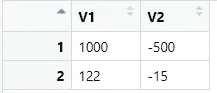
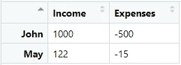
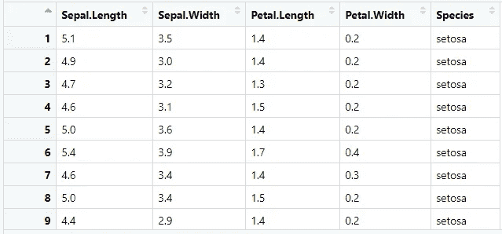

# R 对象索引指南

> 原文：<https://towardsdatascience.com/a-guide-to-r-objects-indexing-936a4adcb38b>

## 让我们学习如何操作不同的 R 对象并从中检索数据


照片由[mak sym Kaharlytskyi](https://unsplash.com/@qwitka)@ unsplash . com 拍摄

*【免责声明:此帖子包含一些我的 Udemy 课程的附属链接】*

当你学习一门语言时，特别是当它们是为处理数据而定制的时候，你很容易对你将要学习的所有新的数据结构和复杂性感到困惑。学习如何处理每种语言的对象可能会非常令人沮丧——特别是如果您正在从另一个框架迁移，这可能是一个很大的挑战，因为您可能会有某些习惯不适合您正在学习的新语言。

关于 R，如果您以前从未使用过数据框结构，或者您没有使用过专门为数据分析而设计的编程语言，那么索引对象和检索您想要的数据一开始可能看起来有点令人生畏，特别是因为在这种语言中有大量关于维度和类型的对象。

在这篇文章中，我想带你了解一些关于 R 中索引的最重要的概念——在文章的最后，你将能够:

*   在 R 的上下文中区分单维和多维对象；
*   随心所欲地查询数据框；
*   现在，如何从 R 语言中最重要的对象中提取任何元素的子集。

简而言之，在这篇文章的最后，你应该会对不同的 R 对象非常熟悉，我希望这会给你的 R 之旅带来巨大的推动。

开始吧！

# 向量索引

向量是一维的，单一类型的对象，我们可以在语言中找到。它们被认为是最基本的元素，也是最不容易混淆的。

例如，让我们考虑包含一年中 12 个不同月份的特定区域的平均温度的向量:

```
temperatures <- c(12.9, 13.2, 15.0, 19.2, 21.4, 24.5, 29.5, 24.2, 20.5, 14.5, 10.2, 9.8)
```

是时候介绍 R 中最简单的索引方法了——**数字索引！**

这是在 R 对象中索引元素的最著名的方法之一——如果您是通过 Python 学习这种语言，R 索引从 1 开始，这是一个显著的不同。

假设我们想要获得数字`12.9`，在我们的`temperatures`向量中可用的第一个`temperature`。我们如何做到这一点？

让我们看看:

```
temperatures[1]
```

`[]`是我们的索引锚。通过在 R 中的任何对象附近使用它们，我们打开了索引的可能性，并让 R 知道我们想要从我们的对象中提取某些元素。

上面的代码将产生`12.9`，这是我们在`temperatures`获得的第一个温度。这非常简单，因为我们使用`[]`让 R 知道我们想要索引我们的对象，并且我们在方括号内传递一个`1`来检索第一个元素。

如果我们只能做到这一点，R 语言将会变得极其乏味。如果我们想要多个温度呢？

我们有两种选择——使用*切片*或*向索引提供一个向量*。

从切片开始，我们可以传递一个格式为`i:j`的索引，从元素`i`到元素`j`进行索引。

好的，让我来分解一下——例如，假设我们希望在向量中包含第二、第三和第四个月的温度，我们可以使用:

```
temperatures[2:4]
```

这将产生`13.2, 15.0, 19.2`，这是我们试图达到的三个温度。同样，我们传递方括号内的数字(格式为`i:j`)。这些方括号将成为 r 中大多数索引的标准。

所以对于`temperatures[2:4]`，我们实际上是在问 R:请给我检索一下`temperatures`向量中从第二个到第四个元素的元素。

切片只适用于连续的元素(即相邻的元素)。如果我们想要提取某些单独的元素，例如第一、第三和第八个元素，该怎么办？

在这种情况下，我们可以将向量直接传递到方括号中:

```
temperatures[c(1,3,8)]
```

在我们的索引中传递一个`c(1,3,8)`，我们从`temperatures`向量中选取第一、第三和第八个元素，即值`12.9, 15.0, 24.2`。使用向量来索引是最灵活的方式来索引我们想要的任何向量中的元素——对我们想要选取的元素的数量没有限制，也没有像切片中那样的额外限制。

当然，唯一的挫折是，如果我们通过一个不存在的位置，例如，请求第 1、第 3 和第 20 个元素:

```
temperatures[c(1,3,20)]
```

该代码的结果元素是:

```
12.9 15.0   NA
```

由于没有第 20 个位置(我们的向量只有 12 个元素)，R 将返回给我们`NA`(不可用)信息。请注意，R 不会抛出任何错误，它只是通过结果让你知道这个元素在向量中根本不存在。

除了数字索引，我们还有命名索引。这很重要，因为我们通常不知道对象中的数据在什么位置。例如，如果我们有一个包含 1000 个客户年龄的向量，我怀疑没有人能记住哪个客户属于哪个年龄。

虽然在我们的`temperatures`例子中，我们知道，根据常识，我们向量的第一个月是一月，第二个月是二月，等等。

但是，如果我们想在向量中明确地说明这一点，有什么方法可以做到吗？

是啊！我们只需用每个职位的名称值给`temperatures`分配一个名称属性:

```
names(temperatures) <- c('Jan','Feb','Mar','Apr','May','Jun','Jul','Aug','Sep','Oct','Nov','Dec')
```

就索引而言，这打开了一个可能性的新世界！现在，我们能够依靠名称来检索元素—例如，检查一月的温度非常简单:

```
temperatures['Jan']
```

这将输出一月份的温度信息:

```
Jan 
12.9
```

然而，就指数而言，有一个主题是反复出现的。尽管我们使用名字来索引对象，T2 仍然存在！

您能猜到我们如何使用命名版本索引多个元素吗？

```
temperatures[c('Jan','Mar')]
```

只需将向量中可用的两个值传递给我们的索引，我们就能够使用多索引来提取信息:

```
Jan  Mar 
12.9 15.0
```

**爽！让我们把这个变得更有趣一点。我们已经了解了索引向量的基础知识，以及如何索引一个只包含一个维度的对象。**

但是如果我们有一个包含不止一个维度(例如行和列)的对象呢？

接下来，让我们学习如何索引多维对象！

# 矩阵索引

让我创建一个两行两列的简单矩阵:

```
matrix_example <- matrix(
  data = c(1000,122,-500,-15),
  nrow = 2,
  ncol = 2
)
```

现在，我们的矩阵是完全无名的(意味着行和列没有名称属性):



示例矩阵—作者图片

以任意值为例，我们如何从上面的矩阵中获取值 1000？我们可以利用我们在这篇文章的前一部分学到的知识吗？

我们可以，但是我们必须深入研究如何使用多索引对象。

索引这些对象实际上很简单——我们依靠逗号向我们著名的`[]`添加一个新的位置元素。

让我用代码解释一下:

```
matrix_example[1,1]
```

**上面的代码选择矩阵的第一行和第一列。**

在逗号的左侧，我们有一个行索引器，它从第一维度(行)中选择数据—如果我们只有左侧的数据，那么我们是在处理一个维对象！

在逗号的右侧，我们有第二维度的索引位置(在本例中是列)。根据这个解释，你能猜出我们如何索引第一行第二列吗？

```
matrix_example[1,2]
```

没错，只需在逗号的右边提供索引 2，我们就可以索引第二列，在本例中是值`-500`。

如果我们能够用这种逻辑提取某些元素，是否有可能从一个维度中选择所有元素——例如，从第一列中选择所有行？

是的，就像将“维度”留空一样简单！在上面的例子中，如果我们想从第一个**列中选择**所有**行，我们需要将行索引器留空:**

```
matrix_example[,1]
```

这实际上与我们描述过的句子相吻合:

*   所有行->索引器在第一维上都保持空白。
*   第一列的->索引器在第二维度上为 1。

这将输出两个值，`1000`和`122`，所有值都来自第一列。

如果我们想要相反的，第 1 行的所有列呢？你能猜出我们如何做这件事吗？

```
matrix_example[1,]
```

是的，我们只是镜像我们的索引！

这将输出第 1 行两列的值`1000`和`-500`。

与单维对象一样，在处理多维时，我们也有命名的索引版本。

假设上面的数据与两个人的`income`和`expenses`有关。根据这个想法命名我们的维度:

```
rownames(matrix_example) <- c('John','May')
colnames(matrix_example) <- c('Income','Expenses')
```

我们的矩阵现在有如下外观:



带有姓名的示例矩阵—按作者分类的图片

通过名字索引是可能的，甚至在多维度的水平上！例如，如果我想要约翰的收入，我只需键入:

```
matrix_example['John','Income']
```

Thsi 输出`1000`，约翰的收入值！所以基本上，逻辑是一样的:

*   我想要检索的行名是`John`，所以我将该名称传递到逗号的左侧，即第一维度。
*   我想要检索的列名是`Income`，所以我将这个名称传递给逗号右边的第二维。

如果我们想要费用，那很简单:

```
matrix_example['John','Expenses']
```

但是..如果我们想要约翰和梅的收入呢？因为我们只有两个人，所以可以将行索引器留空。但是，如果矩阵中有更多的个体，我们将使用以前使用过的相同策略—传递一个向量来索引多个元素:

```
matrix_example[c('John','May'),'Income']
```

这将输出以下内容:

```
John  May 
1000  122
```

酷！我们能够毫无问题地索引多个元素。仅仅通过扩展我们的向量索引知识，我们就能够从一个看起来更复杂的对象中提取数据。

矩阵实际上是数组的一个子集——一种只有二维的特殊类型。

但是..数组可以不止是 2D，我们可以用同样的逻辑索引它们吗？接下来看看吧！

# 数组索引

数组可以将我们的数据扩展到二维以上，进入张量领域。

最酷的是我们索引背后的逻辑保持不变！让我创建一个三维数组，扩展我们上面看到的数据:

```
array_example <- array(
  data = c(1000,122,-500,-15, 200,250,-200,-30),
  dim = c(2,2,2)
)
```

如果我们打印`array_example`，我们将在控制台上看到以下数组:

```
, , 1[,1] [,2]
[1,] 1000 -500
[2,]  122  -15, , 2[,1] [,2]
[1,]  200 -200
[2,]  250  -30
```

那么现在，我们如何从上面的数组中获得值`-200`?

良好的..应用同样的逻辑！谁说我们必须使用单个逗号？我们可以用另一个逗号来扩展索引器！

```
array_example[1, 2, 2]
```

所以基本上，我们要说的是:

*   在第一个逗号的左侧，我们有行索引器，第一维。
*   在逗号之间，我们有列索引器，第二维。
*   在第二个逗号的右边，我们有“矩阵”索引器，第三维。

当然，随着我们维度数量的增加，这开始变得有点混乱和难以想象。

但是，上面的代码将输出`-200`，来自第一行，第二列，第二个矩阵的值。

对于任何 *n 维*数组，逻辑将继续是这样的(使用逗号打开新的维度)。到目前为止，我们所学的一切(空索引、传递向量)也适用于数组。

当然，我们也可以向数组中添加名称—例如，让我们假设第三个维度与 John 和 May 两个不同月份的收入和支出相关:

```
dimnames(array_example) <- list(
  c('John','May'),
  c('Income','Expenses'),
  c('Jan2022','Feb2022')
)
```

打印我们的`array_example`会给我们以下内容:

```
, , Jan2022 Income Expenses
John   1000     -500
May     122      -15, , Feb2022 Income Expenses
John    200     -200
May     250      -30
```

到目前为止，按名称索引这些对象也与我们看到的其他对象相似。如果我们想要约翰 2022 年 1 月的收入:

```
array_example['John','Income','Jan2022']
```

上面的代码将输出`1000`，期望值。该指数的工作方式如下:

*   `John`被用作第一维度的行索引器。
*   `Income`被用作第二维度的列索引器。
*   `Jan2022`被用作矩阵索引器，第三维度。

你能猜出如何获得 2022 年 2 月 May 的费用吗？

```
array_example[‘May’,’Expenses’,’Feb2022']
```

超级容易！

到目前为止，我们只处理过当时接受单一类型的对象。例如，对于向量、矩阵或数组，我们不能在同一个对象中混合整数和字符串元素——这是数据分析的一大缺点。

要做到这一点，我们需要依靠其他对象，如列表或数据框——它们非常强大，也在索引方面开辟了新的可能性，接下来让我们来探索它们！

# 列表索引

让我们首先创建一个包含与一个虚构学生`Anne`相关的数据的列表:

```
list_example <- list(
 name = ‘Anne’,
 grades = c(‘A’,’C’,’C’,’A’),
 GPA = 3.2
)
```

上面的列表包含三个不同的对象:

*   包含值`Anne`的名为`name`的字符元素
*   一个名为`grades`的字符向量，包含值`A,C,C,A`
*   名为`GPA`的数值元素，包含值`3.2`

索引这些元素可以使用我们的旧的`[]`(尽管有很大的挫折)——假设我们想要访问第二个对象`grades`，我们可以在这里使用数字索引:

```
list_example[2]
```

命名索引在这里也可以使用——当我们创建列表时，我们会自动将元素分配给我们的名称，因此我们可以使用:

```
list_example['grades']
```

**不过，这些指数存在一个问题。**如果我们看到上面两条指令的输出，我们会看到:

```
$grades
[1] "A" "C" "C" "A"
```

看到输出上面的`$grades`了吗？这意味着我们只访问这个对象的“表示”,而不是对象本身。我知道这看起来有点奇怪，但是这将阻止我们访问底层元素(大多数情况下，这是您想要做的)。

例如，假设我想通过使用一个法向量索引来访问第一级(`A`)——在尝试新的索引之前，我将把检索到的元素(`grades`)保存到一个名为`grades_vector`的新对象中:

```
grades_vector = list_example['grades']
```

如果我们从`list_example`中检索一个向量到`grades_vector`中，我应该能够使用我们已经学过的索引来访问该对象中的元素，对吗？毕竟这是一个向量！

让我们看看:

```
grades_vector[1]
```

这将输出:

```
$grades
[1] "A" "C" "C" "A"
```

嗯..很奇怪，对吧？我们期望只检索到`grades_vector`的第一个元素。发生了什么事？

这与我之前所说的有关，**在列表索引上使用** `**[]**` **只会检索底层对象的一个 *meta* 表示。要访问对象本身，我们有两种方法——使用双方括号或美元符号符号！让我们看看两者，从双方括号开始:**

```
grades_vector = list_example[['grades']]
```

现在，事情有点不同了。让我们再次尝试索引我们的`grades_vector`:

```
grades_vector[1]
```

我们现在输出`A`！双方括号符号对数字索引和命名索引都有效。请记住，这是索引`list`类型对象的特殊情况，与我们到目前为止所学的其他对象无关！

此外，我们还可以使用美元符号符号从列表中检索元素:

```
list_example$grades
```

这将输出:

```
[1] "A" "C" "C" "A"
```

美元符号符号只适用于列表索引的命名版本。使用美元符号符号，访问对象的一个*元*表示的问题不会发生。

由于列表的灵活性和强大功能，当涉及到索引时，列表也有其自身的复杂性——简而言之:

*   使用`[]`只会访问对象的一个表示，阻止我们访问底层元素。
*   使用`[[]]`可以让我们访问列表对象中的底层元素。
*   使用`$`是我们可以在列表对象上使用的索引器的一个特例，但是它只对我们的索引的命名版本起作用。

我们还要学习另一个对象，也可以说是最著名的 R 对象——R 数据框。

在底层，R 将数据帧存储为列表，但它们也是二维对象(类似于矩阵)。该组合将在其索引中表示出来！让我们看看，下一个。

# 数据帧索引

由于它们是二维对象，数据框在索引时实际上类似于矩阵。它们比后者有优势，因为它们可以保存多种数据类型。

让我们以`iris`数据帧为例，我将在我的环境中将其保存为`iris_df`:

```
iris_df <- iris
```



Iris_Df 预览—作者图片

假设我们想要选取第一行第三列，其中包含值`1.4`——使用我们从矩阵中获得的知识:

```
iris_df[1,3]
```

我们在矩阵中看到的规则同样适用于这里。但是..这似乎不是处理数据框的最实用的方式。

此外，还记得美元符号吗？在数据框中，它们可用于选择整列，例如:

```
iris_df$Species
```

上面的代码输出数据框中这一列的所有值。就这么简单！由于数据帧(底层)是一个`list`元素的集合，使用`$`就好像我们在处理一个包含多个向量的列表。

关于索引数据框，仍然缺少一些东西。通常，当我们索引类似于表的对象时，我们希望执行某种类型的过滤或列子集，对吗？—如果您曾经使用过 SQL，您会非常清楚我在说什么！

你认为我们如何索引上面数据框中的所有`Species`集合？下面是一个例子:

```
iris_df[iris_df$Species == 'setosa',]
```

让我们慢慢来看最后一条指令，因为它包含了我们到目前为止还没见过的新概念。

*   在上面的代码中，我们仍然通过使用一个`,`来维护第一和第二维索引的逻辑。
*   专注于`iris_df$Species == 'setosa'`，我们到底在这里做什么？我们使用`$`从`Species`获取所有值，并检查这些值是否等于`setosa`。在这段代码中，R 将输出一个包含`TRUE`或`FALSE`的向量，这取决于该植物是否为`setosa`。
*   接下来，进入一个我们从未见过的很酷的魔术。如果我们将向量`TRUE`和`FALSE`传递给索引器，R 将只选择找到`TRUE`的元素——在上面的例子中，我们实际上是在声明“请检索所有`Species`等于`setosa`的索引”。
*   我们在哪里应用这个条件？看看我们如何在逗号前应用它，这意味着我们在过滤行索引(第一维)。
*   因为逗号的右边是空白的，我们从第二维度带来了什么元素呢？良好的..所有人！

运行上面的代码将返回一个有 50 行的新 dataframe 我们原来的`iris_df`中的`setosas`的数量！

你能猜到我是如何在应用上述条件的同时只选择`Sepal.Width`的吗？

```
iris_df[iris_df$Species == 'setosa','Sepal.Width']
```

没错——只需将该名称添加到第二维索引中即可！如果我想要两个子集`Sepal.Width`和`Sepal.Length`呢？一个载体来救援！

```
iris_df[iris_df$Species == ‘setosa’,c(‘Sepal.Width’, ‘Sepal.Length’)]
```

如你所见，数据框索引融合了我们在这篇文章中学到的一些概念。在我们离开之前，让我向您展示我们如何在索引上使用更多的条件，假设我想检索`setosa`和`virginica`花:

```
iris_df[(iris_df$Species == 'setosa') | (iris_df$Species == 'virginica'),]
```

我现在使用的是 r 中的 OR 运算符`|`，这个`|`使我能够访问更高级的属性，比如选择所有属于`setosa`或`virginica`的花。注意我是如何在索引器中的逗号前做所有事情的！这是为什么呢？因为，在这种情况下，我们总是在行上工作！

感谢你花时间阅读这篇文章！我希望我已经澄清了您关于 R 索引的一些问题，并且您现在能够更有效地使用不同的 R 对象。

我已经详细描述了 R 中关于索引的最重要的元素，但是有几个概念我没有提到，特别是关于库的。例如，作为这篇文章的后续，我提出的一个建议是自己研究如何索引`dplyr`包中的对象，这是最重要的数据争论 R 包之一。

***我在 Udemy 上建立了一个***[***R***](https://www.udemy.com/course/r-for-absolute-beginners/?couponCode=IVOSTUDENTSAUGUST)***入门和一个*** [***数据科学学习训练营***](https://www.udemy.com/course/r-for-data-science-first-step-data-scientist/?referralCode=IVOSTUDENTSJUNE) ***。这两个课程都是为初学者量身定做的，我希望你能在我身边！***


绝对初学者的 R 编程课程 —图片由作者提供

[](https://medium.com/membership/@ivopbernardo) 