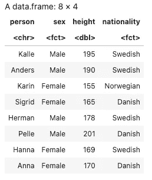

# R 系列应用指南-第 1 部分

> 原文：<https://towardsdatascience.com/a-guide-to-the-apply-family-in-r-part-1-a4073c0dad3e>

## lapply、sapply、apply 和 tapply 函数


迈克·科诺诺夫在 [Unsplash](https://unsplash.com?utm_source=medium&utm_medium=referral) 上拍摄的照片

R 中的 apply-family 是 R 中的一个内置包，它允许您在探索和分析数据时避免循环。我发现 apply-functions 对于在 r 中处理数据非常有用。它们允许你编写简短有效的代码。起初，我对不同的应用功能有点困惑，不知道何时以及如何使用哪一个。使用哪一种取决于数据的结构，在某种程度上，还取决于您希望输出的结构。在本指南第 1 部分中，我将详细介绍每个应用函数，并展示它们是如何工作的，以帮助您避免任何混淆。[本指南的第 2 部分](https://medium.com/@andreagustafsen/a-guide-to-the-apply-family-in-r-part-2-227da1c1bc92)展示了一些应用功能的实际应用。

[](https://medium.com/@andreagustafsen/a-guide-to-the-apply-family-in-r-part-2-227da1c1bc92)  

本指南还以 jupyter 笔记本和 pdf 文件的形式出现在本 [GitHub repo](https://github.com/TalkingDataScience/apply-family) 中。

本指南中涵盖的应用功能有:

*   **lapply()** :循环遍历一个列表，并对该列表的每个元素应用一个函数(lapply 返回一个列表)。
*   **sapply()** :简化结果的 lapply 版本(如果可能的话，sapply 返回一个向量或矩阵)。
*   **在数组的页边(行或列)上应用**:()循环，这对于获取矩阵或高维数组的摘要很有用。
*   **tapply()** :“表格应用”的简称。对向量的子集应用函数。
*   **侧栏:匿名函数**:在*apply 函数中使用的函数

# 拉普利()

`lapply()`需要三个参数:

*   `x`一个列表
*   `FUN`一个函数
*   `...`可用于向函数传递参数

如果`x`不是一个列表，它将被强制为一个列表，并且`lapply`总是返回一个列表。

**示例:**循环遍历一个包含三个元素的列表， *a* ， *b* 和 *c，*并取每个元素的平均值。

```
*# Create a list of three vectors*
my_list **<-** (list(a **=** 1**:**100, b **=** rnorm(100, 10, 4), c **=** rnorm(100, 20, 5)))Output:$a
 [1]  1  2  3  4  5  6  7  8  9 10 11 12 13 14 15 16 17 18 19
[20] 20

$b
 [1] 11.126883  9.486250  4.888522 17.979359 10.488388
 [6] 11.386035  9.533153 11.840724  6.894381  9.320159
[11]  8.011970  5.168468 11.168965  5.949377  7.602794
[16]  3.415012  9.000652  8.590869 11.081774  5.504183

$c
 [1] 27.71358 22.78353 21.27341 14.18033 19.44619 21.22942
 [7] 19.80918 24.49109 24.79348 20.92665 22.03669 23.37730
[13] 28.31326 11.24070 17.55119 22.98123 18.12479 18.27029
[19] 25.84009 13.60632
```

我们现在可以使用`lapply()`来寻找每个列表的平均值。

```
*# Take the mean of each vector*
lapply(my_list, mean)Output:$a
[1] 50.5

$b
[1] 10.8271

$c
[1] 20.0546
```

**示例:** R 将在向量 *x* 上循环，并为每次循环生成 x 个随机正态变量。

```
*# Create vector (1, 2, 3, 4, 5)*
x **<-** 1**:**5

*# Generate a list with five elements, each containing x number of random normal variables*
lapply(x, rnorm)Output:[[1]]
[1] -0.392326

[[2]]
[1] -0.4011685  0.2915179

[[3]]
[1] -1.0637220 -0.1090642  0.1463136

[[4]]
[1] -0.91545274  1.66578574  0.48180671 -0.08540264

[[5]]
[1]  1.0197346  1.2672367 -0.2227637  0.7901403  0.4313318
```

**例子续:**我们可以通过将函数的参数传递给`...`参数来指定函数的参数。因此，如果我们想要指定我们上面生成的随机数的 man 和标准差，我们可以简单地将平均值和 sd 传递给`...`参数。

```
*# Create vector (1, 2, 3, 4, 5)* x **<-** 1**:**5*# Generate numbers from the normal distribution with mean 10 and sd 2*
lapply(x, rnorm, mean **=** 10, sd **=** 2) *#default is mean = 0 and sd = 1*Output:[[1]]
[1] 9.978319

[[2]]
[1]  7.501266 12.984743

[[3]]
[1] 10.87127 10.20457 10.63069

[[4]]
[1] 8.652868 7.390537 9.390650 7.895302

[[5]]
[1] 10.655694 12.378678  7.262178 13.547734  6.125808
```

# 侧栏:匿名函数

`*apply`家族函数大量使用了匿名函数，所以在我们进入下一个应用函数之前，我想为那些不熟悉的人解释一下匿名函数。

如果我们想应用一个在 R 中不存在的函数，我们需要直接在 apply 函数中编写自己的函数。

**示例:**假设我们有两个矩阵，我们想要提取特定的行或列，我们可以通过传递匿名函数来实现。

```
*# Create a list of two matrices*
mat_list **<-** list(matrix(1**:**4, nrow **=** 2), matrix(1**:**9, nrow **=** 3)) Output:[[1]]
     [,1] [,2]
[1,]    1    3
[2,]    2    4

[[2]]
     [,1] [,2] [,3]
[1,]    1    4    7
[2,]    2    5    8
[3,]    3    6    9
```

这里，我们通过将匿名函数`function(row2) row2[2,]`添加到`lapply()`函数中，从每个矩阵中提取第二行。

```
# Using an anonymous function in lapply()
lapply(mat_list, function(row2) row2[2,])Output:[[1]]
[1] 2 4

[[2]]
[1] 2 5 8
```

# 萨普利()

与`lapply`唯一不同的是`sapply`总是尽量简化结果。`lapply`函数的输出总是一个列表。`sapply`中的输出将是:

*   如果结果是一个每个元素长度为 1 的列表:输出是一个向量
*   如果结果是一个列表，其中每个元素都是长度大于 1 的向量:则输出是一个矩阵
*   否则一个列表

**例子:**结果是一个向量。
取列表中每个元素的平均值。

```
*# This function gives two elements of length 1, result as a vector*
my_list **<-** (list(a **=** 1**:**10, b **=** 11**:**20, c **=** 21**:**30, d **=** 31**:**40))
sapply(my_list, mean)Output: a    b    c    d 
 5.5 15.5 25.5 35.5
```

**示例:**结果是一个矩阵
从列表中的每个元素提取第一列。

```
*# Create three 2x2 matrices*
mat3 **<-** list(matrix(1**:**4, 2, 2), matrix(5**:**8, 2, 2), matrix(9**:**12, 2, 2))[[1]]
     [,1] [,2]
[1,]    1    3
[2,]    2    4

[[2]]
     [,1] [,2]
[1,]    5    7
[2,]    6    8

[[3]]
     [,1] [,2]
[1,]    9   11
[2,]   10   12 *# Using an anonymous function. sapply gives three vectors of equal length 2, result is a matrix*
sapply(mat3, function(col1) col1[, 1])[,1] [,2] [,3]
[1,]    1    5    9
[2,]    2    6   10
```

# 应用()

用于在数组的**边距**上计算函数(最常用于矩阵的行或列或高维数组)。

```
*# Show arguments for apply*
args(apply)Output:
function (X, MARGIN, FUN, ..., simplify = TRUE)
```

参数 MARGIN 指定应该保留哪个边距。MARGIN=1 在行上循环，MARGIN=2 在列上循环。

```
*# 10x5 matrix of random variables from the uniform dist between 1 and 10*
my_uniform_mat **<-** matrix(runif(50, 1, 10), nrow **=** 10, ncol **=** 5) [,1]     [,2]    [,3]     [,4]     [,5]
 [1,] 9.807216 6.332778 5.966729 9.176292 6.185254
 [2,] 5.874502 2.430018 4.512795 4.094072 1.192640
 [3,] 7.030518 8.663532 7.566979 8.009686 8.510568
 [4,] 3.012011 7.210664 3.890397 7.204866 7.544637
 [5,] 2.586223 2.420773 1.039854 9.737979 9.016665
 [6,] 4.423740 2.240283 1.934197 7.976354 8.697875
 [7,] 2.302334 1.734337 4.326069 4.121796 2.230787
 [8,] 2.085405 1.386700 6.370785 3.052539 6.207375
 [9,] 8.385375 7.476500 7.475415 7.098384 2.844853
[10,] 8.135351 3.386021 5.700849 9.158787 9.694943*# Means for all rows*
apply(my_uniform_mat, 1, mean)[1] 5.785832 5.912120 5.016462 5.821229 6.741198 4.767206 5.913186
[8] 4.669230 7.142562 6.813925*# Means for all columns*
apply(my_uniform_mat, 2, mean)[1] 5.517655 5.274760 6.643334 5.002985 6.852742
```

值得一提的是，在 R:

*   rowRums = apply(x，1，sum)
*   colSums = apply(x，2，sum)
*   rowMeans = apply(x，1，mean)
*   colMeans = apply(x，2，mean)

这些功能经过优化，比使用应用功能更有效。但是我们可以评估其他函数，比如分位数。

```
my_uni_mat <- matrix(runif(200, min= 0, max = 19), 20, 10)# specifying which quantiles in the ... argument
apply(my_uni_mat, 1, quantile, probs = c(0.25, 0.75))[,1]     [,2]      [,3]      [,4]      [,5]      [,6]
25%  3.486147 2.070579  3.440077  3.747711  6.430088  6.211664
75% 14.243051 9.824579 13.108914 12.592477 13.620125 16.071445
         [,7]      [,8]      [,9]     [,10]    [,11]     [,12]
25%  5.519152  9.668082  4.548434  3.128967 2.584743  3.056771
75% 14.633494 14.353726 15.403053 15.980496 9.856545 14.886065
        [,13]    [,14]    [,15]     [,16]     [,17]     [,18]
25%  9.444413  7.85192 4.428376  6.784206  8.607954  5.840153
75% 15.118429 15.50309 8.562812 15.423813 13.430605 13.439571
        [,19]     [,20]
25%  8.773012  3.403049
75% 11.887930 12.880902
```

三维数组和折叠其中一个维度的示例。

```
# Think 10 2x2 matrices stacked together
x <- array(rnorm(2 * 2 * 10), c(2, 2, 10))
apply(x, MARGIN = c(1, 2), FUN = mean)[,1]       [,2]
[1,] -0.33305439 -0.5067485
[2,]  0.04002034 -0.1403010
```

该操作与`rowMeans(x, dim = 2).`相同

# 塔普利()

`tapply`对向量的子集应用函数。为此，我们需要指定一个 vector (arg INDEX)来标识我们将要计算的数值向量的元素。

例如，我们可以有一个男性和女性的数据集，我们想分别评估两组的平均身高。

`tapply:`的论点

*   x:一个向量
*   指数:一个因素或一系列因素
*   乐趣:我们想要应用的功能
*   …:要传递给 FUN 的其他参数

```
*# Create a data frame*
person **<-** c("Kalle", "Anders", "Karin", "Sigrid", "Herman", "Pelle", "Hanna", "Anna")
sex **<-** factor(c("Male", "Male", "Female", "Female", "Male", "Male", "Female", "Female"))
height **<-** c(195, 190, 155, 165, 178, 201, 169, 170)
nationality **<-** factor(c("Swedish", "Swedish", "Norwegian", "Danish", "Swedish", "Danish", "Swedish", "Danish"))

my_df **<-** data.frame(person, sex, height, nationality)
my_df
```



作者图片

```
*# Get the mean for each sex*
tapply(X **=** my_df**$**height, INDEX **=** sex, FUN **=** mean)Female   Male 
164.75 191.00
```

我希望这个指南对你有用。如果你想看几个你可能想使用这些应用功能的实际例子，请务必阅读本指南的第 2 部分。

[](https://medium.com/@andreagustafsen/a-guide-to-the-apply-family-in-r-part-2-227da1c1bc92) 