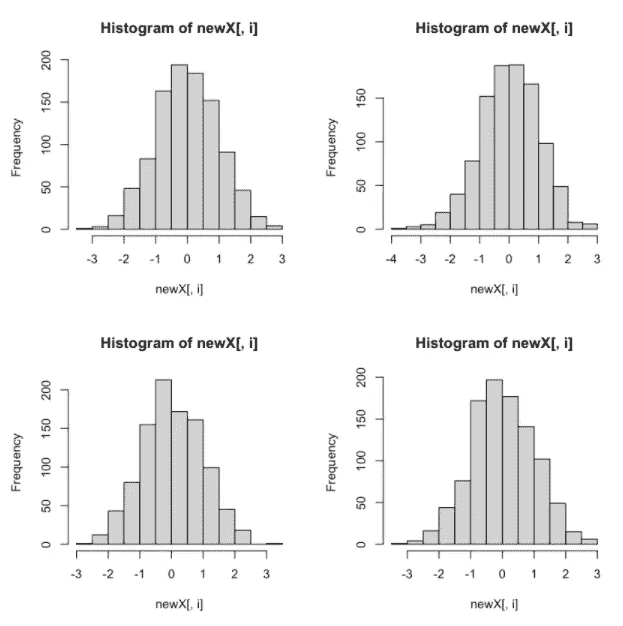

# R 中的应用系列指南—第 2 部分

> 原文：<https://towardsdatascience.com/a-guide-to-the-apply-family-in-r-part-2-227da1c1bc92>

## 使用应用功能的实例


照片由[迈克·科诺诺夫](https://unsplash.com/@mikofilm?utm_source=medium&utm_medium=referral)在 [Unsplash](https://unsplash.com?utm_source=medium&utm_medium=referral) 上拍摄

这是我的 r 中 apply 系列指南的第二部分。请查看[第 1 部分](https://medium.com/@andreagustafsen/a-guide-to-the-apply-family-in-r-part-1-a4073c0dad3e)了解每个 apply 函数的演练。在本文中，我给出了两个在一些常见的数据工作流中使用 apply-function 的实例。

[](https://medium.com/@andreagustafsen/a-guide-to-the-apply-family-in-r-part-1-a4073c0dad3e)  

本指南还以 jupyter 笔记本和 pdf 文件的形式出现在本 [GitHub repo](https://github.com/TalkingDataScience/apply-family) 中。

# 示例:计算单样本 t 检验的功效

单样本 t 检验确定未知总体均值是否不同于特定值。

进行假设检验时，功效是拒绝错误的零假设的概率。换句话说，它给出了检验将检测到均值真正差异的概率。

使用模拟，我们实际上可以评估测试的功效，因为我们将知道参数的真实值，在这种情况下，是平均值。

下面我们从正态分布中生成 1000 个样本，平均值为 1.75，标准差为 sqrt(5/3)。我们测试了均值为 1 且显著性水平为 95%的零假设。我们通过使用`apply`函数对 1000 个样本中的每一个都这样做，并计算我们拒绝零假设的次数的比例。我们可以看到，测试在 71%的情况下发现了差异。

```
*# Function to generate data from the normal distribution*
*# S = number of samples*
*# n = sample size*
*# mu = mean*
*# sigma = standard deviation*generate.normal **<-** function(S,n,mu,sigma){
  *# generate one data set, each row is one sample*
  data **<-** matrix(rnorm(n*****S,mu,sigma), ncol **=** n, byrow **=** T) 
}

*# Set seed and parameter values*
*# Generate 1000 samples from the normal distribution*
set.seed(28)
S **<-** 1000
n **<-** 20
sigma **<-** sqrt(5**/**3)
mu **<-** 1.75
mu0 **<-** 1 *#test generated data against this mean*

*# Generate data from normal*
data **<-** generate.normal(S, n, mu, sigma)

*# Calculate test statistic for each sample*
*# Using apply here to gets the mean and variance for each sample in the generated data*
ttest_statistic **<-** (apply(data, 1, mean) **-** mu0) **/** sqrt(apply(data, 1, var) **/** n)

*# rejection area in the t-distribution*
*# two sided test, alpha 0.05, n-1 degrees of freedom*
t05 **<-** qt(0.975, n-1)

*# calculate power of test (proportion of rejections)*
power **<-** sum(abs(ttest_statistic)**>**t05)**/**S
powerOutput:0.707
```

对于该参数(平均值为 1.75，标准偏差为 sqrt(5/3))，使用 20 的样本量并测试平均值为 1，我们将在 71%的情况下检测到差异。

# 示例:测试需要多大的样本量？(对一个参数的多个值运行函数)

如果我们想知道需要多大的样本量才能获得至少 80%的期望功效，我们可以利用`sapply`函数在一次调用中测试样本量的几个值，并比较结果。

我们将上面的代码放在一个名为`ttest_power()`的函数中，这样我们就可以将它传递给`sapply`函数。

```
*# Put into a function*
ttest_power **<-** function(seed **=** 28, S**=**1000, n **=** 20, mu **=** 0, sigma **=** 1, mu0 **=** 0.1){
    set.seed(seed)
    *# function to generate data from the normal distribution*
    generate.normal **<-** function(S,n,mu,sigma){

      data **<-** matrix(rnorm(n*****S,mu,sigma), ncol **=** n, byrow **=** T) 
      return(data)
    }

    *# Generate data from normal*
    data **<-** generate.normal(S, n, mu, sigma)

    *# Calculate test statistic* 
    ttest_statistic **<-** (apply(data, 1, mean) **-** mu0) **/**        sqrt(apply(data, 1, var) **/** n)

    *# Rejection area in the t-distribution*
    t05 **<-** qt(0.975, n-1)

    *# Calculate power of test*
    power **<-** sum(abs(ttest_statistic)**>**t05)**/**S

    return(power)
}
```

我们创建一个不同样本大小的向量，我们将在函数中测试它。根据我们想要测试的内容，我们可以操作`ttest_function()`中的任何参数。在这种情况下，我们使用不同的样本大小值`n`运行函数。

```
*# Vector with sample sizes we wish to evaluate*
sample_size **<-** c(10, 15, 20, 25, 30, 35, 40)

*# Use sapply to test different sample sizes in the ttest_power function*
power **<-** sapply(sample_size, function(x)ttest_power(S **=** 1000, n **=** x, mu **=** 0, sigma **=** 1, mu0 **=** 0.5))

*# Add sample sizes as names to the result*
names(power) **<-** sample_size
powerOutput:
   10    15    20    25    30    35    40 
0.311 0.448 0.563 0.676 0.748 0.820 0.868
```

如果我们有均值为 0、标准差为 1 的数据，并针对均值为 0.5 的零假设进行测试，我们必须至少有 35 个样本才能获得高于 80%的功效。我们可以看到，如果我们的样本量为 20，检测到真正差异的概率只有 56%。

# 示例:生成几个图

`apply`也可用于一次调用产生几个情节。如果我们想查看一些生成数据的分布，我们可以使用 apply。

```
*# generate four samples of 1000 random variable from the normal distribution*
random_normal **<-** generate.normal(S **=** 4, n **=** 1000, mu **=** 0, sigma **=** 1)

*# display plots 2 by 2*
par(mfrow**=**c(2,2))

*# samples are stored row wise, so we call margin = 1*
plots **<-** apply(random_normal, 1, hist)
```



作者图片

这些只是应用函数如何帮助你用几行代码进行大量计算的几个例子！我真的觉得 apply-family 非常有用，希望这个指南也能帮助你开始使用这些功能。