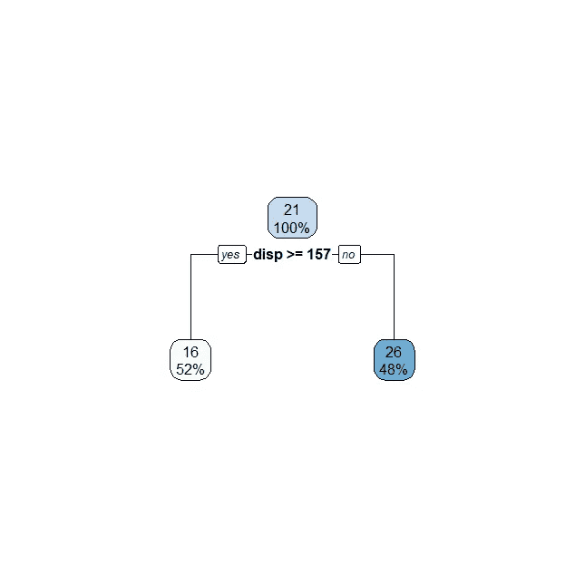
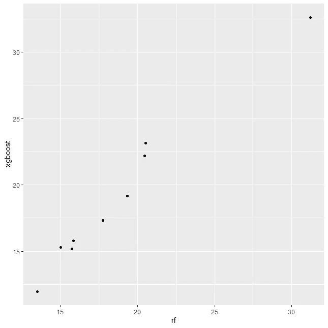

# 在 R 中使用插入符号的指南

> 原文：<https://towardsdatascience.com/a-guide-to-using-caret-in-r-71dec0bda208>

## 学习如何使用 R 使用 caret(分类和回归训练)包


照片由 [Heidi Fin](https://unsplash.com/@heidijfin) @unsplash.com 拍摄

C aret 是 r 中一个非常强大的机器学习库，`caret`以其灵活性为主要特点，使你能够使用一个简单的`train`函数训练不同类型的算法。这个抽象层提供了一个通用接口来训练 R 中的模型，只需要调整一个参数——`method`。

`caret`(用于分类和回归训练)是 R 中[最流行的机器学习库之一。为了增加灵活性，我们获得了嵌入超参数调整和交叉验证——这两项技术将提高我们算法的泛化能力。](https://www.geeksforgeeks.org/7-best-r-packages-for-machine-learning/)

在本指南中，我们将从四个不同的方面来探讨该产品包:

*   我们将从学习**如何通过改变`method`参数来训练不同的模型**开始。对于我们将训练的每个算法，我们将接触到新的概念，如超参数调整、交叉验证、因子和其他有意义的细节。
*   然后，我们将学习如何设置我们自己的**自定义交叉验证函数**，然后针对**不同的优化指标调整我们的算法。**
*   试验我们自己的**超参数调谐。**
*   我们将通过检查`predict`如何与不同的`caret`型号一起工作来总结一切。

为了简单起见，并且因为我们想把重点放在库本身，我们将使用 R:

*   *iris* 数据集，这是一个非常著名的数据集，将代表我们的分类任务。
*   将用作我们回归任务的 *mtcars* 数据集。

我将做一个小小的调整，使 *iris* 问题变成二进制问题(不幸的是`glm`，R 中的逻辑回归实现不支持多类问题):

```
iris$target <- ifelse(
  iris$Species == 'setosa',
  1,
  0
)
```

因为我们想要评估 predict 方法，所以让我们先将两个数据帧分成 train 和 test 我将使用个人最喜欢的方法，`caTools`:

```
library(caTools)# Train Test Split on both Iris and Mtcars
train_test_split <- function(df) {
  set.seed(42)
  sample = sample.split(df, SplitRatio = 0.8)
  train = subset(df, sample == TRUE)
  test  = subset(df, sample == FALSE)
  return (list(train, test))
}# Unwrapping mtcars
mtcars_train <- train_test_split(mtcars)[[1]]
mtcars_test <- train_test_split(mtcars)[[2]]# Unwrapping iris
iris_train <- train_test_split(iris)[[1]]
iris_test <- train_test_split(iris)[[2]]
```

一切就绪，我们开始吧！

# 拟合线性回归

我们的第一个`caret`例子是拟合一个简单的线性回归。线性回归是最著名的算法之一。在 base R 中，您可以使用`lm`方法安装一个。在`caret`中，您可以使用以下命令进行同样的操作:

```
lm_model <- train(mpg ~ hp + wt + gear + disp, 
      data = mtcars_train, 
      method = "lm")
```

`train`是`caret`图书馆的中心功能。它使用指定的`method`使算法适合数据。在这种情况下，我们在`mtcars`数据框架上拟合一条回归线，试图使用汽车的马力、重量、齿轮数和发动机排量来预测每加仑的英里数。

通常，该方法与用于训练模型的独立函数紧密相关。例如，`method='lm'`会产生类似于`lm`函数的东西。很酷的事情，我们可以把`caret`生成的`lm_model`当作 R 中的其他线性模型——调用`summary`是可能的:

```
summary(lm_model)Call:
lm(formula = .outcome ~ ., data = dat)Residuals:
    Min      1Q  Median      3Q     Max 
-3.6056 -1.8792 -0.4769  1.0658  5.6892Coefficients:
            Estimate Std. Error t value Pr(>|t|)    
(Intercept) 31.67555    6.18241   5.123 7.11e-05 ***
hp          -0.04911    0.01883  -2.609  0.01777 *  
wt          -3.89388    1.28164  -3.038  0.00707 ** 
gear         1.49329    1.29311   1.155  0.26327    
disp         0.01265    0.01482   0.854  0.40438    
---
Signif. codes:  0 ‘***’ 0.001 ‘**’ 0.01 ‘*’ 0.05 ‘.’ 0.1 ‘ ’ 1Residual standard error: 2.915 on 18 degrees of freedom
Multiple R-squared:  0.8246, Adjusted R-squared:  0.7856 
F-statistic: 21.15 on 4 and 18 DF,  p-value: 1.326e-06
```

如果您使用`lm(mpg ~ hp + wt + gear + disp, data = mtcars_train)`拟合线性模型，您将获得完全相同的系数。因此..使用`caret`的确切优势是什么？

其中最重要的是我们将在下一节看到的——改变模型是如此简单！

# 拟合逻辑回归

要在`caret`中的模型之间进行更改，我们只需更改`train`函数中的`method`——让我们在 iris 数据框架上拟合一个逻辑回归:

```
glm_model <- train(target ~ Sepal.Length + Sepal.Width + Petal.Length + Petal.Width, 
                  data = iris_train, 
                  method = "glm",
                  family = "binomial")
```

使用`method='glm'`我们打开了训练逻辑回归的可能性。注意，我还可以通过将方法的其他参数传递给 train 函数来访问它们— `family='binomial'`是我们可以用来让 R 知道我们想要训练一个逻辑回归的参数。根据我们正在使用的`method`在`train`函数中如此容易地扩展参数，是`caret`库的另一个伟大特性。

当然，我们可以看到`summary`的逻辑回归结果:

```
summary(glm_model)Call:
NULLDeviance Residuals: 
 Min 1Q Median 3Q Max 
-2.487e-05 -2.110e-08 -2.110e-08 2.110e-08 1.723e-05Coefficients:
 Estimate Std. Error z value Pr(>|z|)
(Intercept) 45.329 575717.650 0 1
Sepal.Length -5.846 177036.957 0 1
Sepal.Width 11.847 88665.772 0 1
Petal.Length -16.524 126903.905 0 1
Petal.Width -7.199 185972.824 0 1(Dispersion parameter for binomial family taken to be 1)Null deviance: 1.2821e+02 on 99 degrees of freedom
Residual deviance: 1.7750e-09 on 95 degrees of freedom
AIC: 10Number of Fisher Scoring iterations: 25
```

现在不要太担心结果——重要的是你理解使用`train`功能在模型之间切换是多么容易。

从线性回归到逻辑回归的跳跃似乎并不令人印象深刻..我们仅仅局限于线性模型吗？没有。接下来，让我们看看一些基于树的模型。

# 拟合决策树

我们还可以通过切换`method`来使用`train`拟合基于树的模型，就像我们在线性和逻辑回归之间切换时所做的那样:

```
d.tree <- train(mpg ~ hp + wt + gear + disp, 
                  data = mtcars_train, 
                  method = "rpart")
```

最酷的事？这是一个`rpart`对象——我们甚至可以使用`rpart.plot`来绘制它:

```
library(rpart.plot)
rpart.plot(d.tree$finalModel)
```



生成的决策树—使用插入符号的序列—按作者排序的图像

为了绘制决策树，我们只需要访问`d.tree`的`finalModel`对象，它是`rpart`对象的模拟。

`caret`或单独使用`rpart`功能的显著区别在于，后者不会执行任何[超参数调整](/5-decision-tree-hyperparameters-to-enhance-your-tree-algorithms-aee2cebe92c8)。另一方面，caret 的`rpart`已经用复杂度参数(`cp`)执行了一些小的“超参数调整”，正如我们在详述我们的`d.tree`时所看到的:

```
d.treeCART23 samples
 4 predictorNo pre-processing
Resampling: Bootstrapped (25 reps) 
Summary of sample sizes: 23, 23, 23, 23, 23, 23, ... 
Resampling results across tuning parameters:cp         RMSE      Rsquared   MAE     
  0.0000000  4.805918  0.4932426  3.944907
  0.3169698  4.805918  0.4932426  3.944907
  0.6339397  4.953153  0.5061275  4.105045RMSE was used to select the optimal model using the smallest value.
The final value used for the model was cp = 0.3169698.
```

在我们的例子中，最低的 RMSE(均方根误差)最终在`cp` = 0 或`cp` = 0.32 之间，并且`caret`选择其中一个值作为我们决策树的最终值。我们也可以在`train`函数中执行自定义的超参数调整，稍后我们会在本文中看到！

# 拟合随机森林

为了适应 randomForest，我们可以使用几个`methods`——就我个人而言，我喜欢使用`ranger`实现，方法是在`train`函数的参数中提供:

```
r.forest <- train(mpg ~ hp + wt + gear + disp, 
                data = mtcars_train, 
                method = "ranger")
```

让我们看看我们的`r.forest`对象:

```
r.forestRandom Forest23 samples
 4 predictorNo pre-processing
Resampling: Bootstrapped (25 reps) 
Summary of sample sizes: 23, 23, 23, 23, 23, 23, ... 
Resampling results across tuning parameters:mtry  splitrule   RMSE      Rsquared   MAE     
  2     variance    2.672097  0.8288142  2.160861
  2     extratrees  2.844143  0.8054631  2.285504
  3     variance    2.700335  0.8212250  2.189822
  3     extratrees  2.855688  0.8024398  2.295482
  4     variance    2.724485  0.8144731  2.213220
  4     extratrees  2.892709  0.7918827  2.337236Tuning parameter 'min.node.size' was held constant at a value of 5
RMSE was used to select the optimal model using the smallest value.
The final values used for the model were mtry = 2, splitrule =
 variance and min.node.size = 5.
```

就像在我们的决策树示例中一样，`caret`在选择最终使用的模型之前，也在自己执行一些简单的超参数调优。在这种情况下，`train`用`mtry`和`splitrule`执行一个双参数超参数调整。它选择了`mtry` = 2 和`splitrule` =方差作为最终模型。

请注意，`train`函数使用的超参数与`method`中可用的超参数紧密相关！

请记住，这是第一个我们使用非 R 自带的`method`的`train`示例——当你试图运行上面的代码时，R 会提示你安装`ranger`库，如果你没有的话。这是另一个很酷的`caret`细节——我们可以使用许多 base R 中没有的模型。

底线是，`train`函数只是这个高层次的 API，它用一个公共接口为我们管理关于模型训练的一切。

# 装配 XGBoost

Kaggle 竞赛中使用的最著名的模型类型之一是梯度推进模型。这些类型的基于树的模型以其稳定性和性能而闻名。

XGBoost 是这些 boosting 模型的一个实现，它依靠模型的误差来提高它们的性能。与随机森林一样，我们可以在`caret`中访问不同的 boosting 实现——这里有一个使用`xbgTree`库的小例子:

```
xg.boost <- train(mpg ~ hp + wt + gear + disp, 
                  data = mtcars_train, 
                  method = "xgbTree")
```

`xgbTree`实现执行了一些广泛的调优(可能需要一段时间运行)——如果我们看一下输出:

```
xg.boosteXtreme Gradient Boosting23 samples
 4 predictorNo pre-processing
Resampling: Bootstrapped (25 reps) 
Summary of sample sizes: 23, 23, 23, 23, 23, 23, ... 
Resampling results across tuning parameters:eta  max_depth  colsample_bytree  subsample  nrounds  RMSE    
  0.3  1          0.6               0.50        50      2.946174
  0.3  1          0.6               0.50       100      2.944830
  0.3  1          0.6               0.50       150      2.962090
  0.3  1          0.6               0.75        50      3.112695
  0.3  1          0.6               0.75       100      3.099010
  0.3  1          0.6               0.75       150      3.110219
  0.3  1          0.6               1.00        50      3.077528
  0.3  1          0.6               1.00       100      3.097813
  0.3  1          0.6               1.00       150      3.109069
  0.3  1          0.8               0.50        50      3.097415
  0.3  1          0.8               0.50       100      3.097322
  0.3  1          0.8               0.50       150      3.098146
  0.3  1          0.8               0.75        50      3.078441
  0.3  1          0.8               0.75       100      3.120153
  0.3  1          0.8               0.75       150      3.124199
  0.3  1          0.8               1.00        50      3.174089
  0.3  1          0.8               1.00       100      3.194984
...Tuning parameter 'gamma' was held constant at a value of 0Tuning parameter 'min_child_weight' was held constant at a value of 1
RMSE was used to select the optimal model using the smallest value.
The final values used for the model were nrounds = 50, max_depth = 3,
 eta = 0.3, gamma = 0, colsample_bytree = 0.6, min_child_weight = 1
 and subsample = 1.
```

我只是展示了几个`train`执行的全超参数调优的例子。请注意，我们如何通过简单的调整，毫无问题地训练三种不同类型的基于树的模型。没有复杂的争论，没有数据和训练之间的硬接口，什么都没有！为我们照料一切。

在检查交叉验证、超参数调整和指标之前，让我们再看两个模型！

# 拟合 K-最近邻

我们的`method`还提供 k-最近邻算法:

```
knn <- train(mpg ~ hp + wt + gear + disp, 
                  data = mtcars_train, 
                  method = "knn")
```

对于`knn`，`caret`查看不同的`k`以选择最终型号:

```
knnk-Nearest Neighbors23 samples
 4 predictorNo pre-processing
Resampling: Bootstrapped (25 reps) 
Summary of sample sizes: 23, 23, 23, 23, 23, 23, ... 
Resampling results across tuning parameters:k  RMSE      Rsquared   MAE     
  5  3.541489  0.7338904  2.906301
  7  3.668886  0.7033751  2.909202
  9  3.868597  0.6580107  2.965640RMSE was used to select the optimal model using the smallest value.
The final value used for the model was k = 5.
```

# 拟合香草神经网络

`caret`也使我们能够训练我们自己的神经网络——尽管使用其他软件包(h20、keras 等)会更好。)您也可以使用`nnet`、`neuralnet`或`mxnet`方法在`caret`中训练一个——这里有一个使用`neuralnet`的例子

```
neural.network <- train(mpg ~ hp + wt + gear + disp, 
             data = mtcars_train, 
             method = "neuralnet")
```

看到我们网络的结果:

```
Neural Network23 samples
 4 predictorNo pre-processing
Resampling: Bootstrapped (25 reps) 
Summary of sample sizes: 23, 23, 23, 23, 23, 23, ... 
Resampling results across tuning parameters:layer1  RMSE      Rsquared   MAE     
  1       5.916693  0.5695443  4.854666
  3       5.953915  0.2311309  4.904835
  5       5.700600  0.4514841  4.666083Tuning parameter 'layer2' was held constant at a value of 0Tuning parameter 'layer3' was held constant at a value of 0
RMSE was used to select the optimal model using the smallest value.
The final values used for the model were layer1 = 5, layer2 = 0 and
 layer3 = 0.
```

`nnet`的一个主要问题是它不适合分类任务——对于适合的`method`,我们可以使用`nnet`,另一种实现:

```
neural.network.class <- train(target ~ Sepal.Length + Sepal.Width + Petal.Length + Petal.Width, 
                        data = iris_train, 
                        method = "nnet")
```

如果我们检查一下`neural.network.class`，会发现一些奇怪的事情:

```
neural.network.classNeural Network100 samples
  4 predictorNo pre-processing
Resampling: Bootstrapped (25 reps) 
Summary of sample sizes: 100, 100, 100, 100, 100, 100, ... 
Resampling results across tuning parameters:size  decay  RMSE         Rsquared   MAE        
  1     0e+00  0.153228973  0.9370545  0.106767943
  1     1e-04  0.074206333  0.9759492  0.052561227
  1     1e-01  0.116518767  0.9977164  0.112402210
  3     0e+00  0.229154294  0.9616348  0.124433888
  3     1e-04  0.027172779  0.9887259  0.021662284
  3     1e-01  0.080126891  0.9956402  0.074390107
  5     0e+00  0.098585595  0.9999507  0.060258715
  5     1e-04  0.004105796  0.9999710  0.003348211
  5     1e-01  0.073134836  0.9944261  0.065199393RMSE was used to select the optimal model using the smallest value.
The final values used for the model were size = 5 and decay = 1e-04.
```

我们的神经网络仍然将此视为回归问题(根据它试图优化的指标)——为什么？

因为`nnet`需要目标作为一个因素来理解我们正在尝试做一个分类任务——这是使用`caret`时遇到的*之一——你仍然需要理解特定`methods`的某个部分，以避免你的代码中出现任何错误。让我们把我们的`target`变成一个因素专栏:*

```
iris_train$target = factor(iris_train$target)
```

现在再次拟合我们的神经网络:

```
neural.network.class.2 <- train(target ~ Sepal.Length + Sepal.Width + Petal.Length + Petal.Width, 
                              data = iris_train, 
                              method = "nnet")
```

查看我们的对象`neural.network.class.2`:

```
Neural Network100 samples
  4 predictor
  2 classes: '0', '1'No pre-processing
Resampling: Bootstrapped (25 reps) 
Summary of sample sizes: 100, 100, 100, 100, 100, 100, ... 
Resampling results across tuning parameters:size  decay  Accuracy   Kappa    
  1     0e+00  0.9591083  0.8776744
  1     1e-04  0.9507270  0.8400000
  1     1e-01  1.0000000  1.0000000
  3     0e+00  0.9845919  0.9474580
  3     1e-04  1.0000000  1.0000000
  3     1e-01  1.0000000  1.0000000
  5     0e+00  0.9988889  0.9969231
  5     1e-04  1.0000000  1.0000000
  5     1e-01  1.0000000  1.0000000Accuracy was used to select the optimal model using the largest value.
The final values used for the model were size = 1 and decay = 0.1.
```

酷！我们的对象现在显示的是`Accuracy`，这是一个只与分类任务相关的指标。`caret`在调优过程中修改了哪些参数？`size`和`decay`！

我们在这里对不同的`methods`进行了很好的报道——你可能会问，我们遗漏了其中的一些吗？是的，我们做到了——在我写这篇文章的时候，关于 [231 方法](https://topepo.github.io/caret/available-models.html)！请随意尝试其中的一些！

# 定义您自己的交叉验证

在`caret`中，你也可以给`train`函数自定义的交叉验证方法。例如，让我们在下面的例子中的决策树上使用 [k 倍交叉验证](/k-fold-cross-validation-explained-in-plain-english-659e33c0bc0):

```
ctrl<- trainControl(method="cv", number=10)d.tree.kfold <- train(mpg ~ hp + wt + gear + disp, 
                data = mtcars_train,
                trControl = ctrl,
                method = "rpart")
```

因此..有什么新鲜事？两件事:

*   我们正在用函数`trainControl`定义一个`ctrl`对象。在函数中，我们将实验的`method`定义为`cv`(交叉验证)，其中`number`等于 10，`number`与 k 相同。
*   我们将 k 倍交叉验证传递给`train`中的`trControl`参数。这将让`caret`明白我们想在我们的培训过程中应用这种交叉验证方法。

让我们检查一下我们的决策树:

```
dtreeCART23 samples
 4 predictorNo pre-processing
Resampling: Cross-Validated (10 fold) 
Summary of sample sizes: 21, 20, 21, 21, 21, 21, ... 
Resampling results across tuning parameters:cp         RMSE      Rsquared   MAE     
  0.0000000  5.717836  0.7373485  4.854541
  0.3169698  5.717836  0.7373485  4.854541
  0.6339397  6.071459  0.6060227  5.453586RMSE was used to select the optimal model using the smallest value.
The final value used for the model was cp = 0.3169698.
```

请注意，现在我们可以看到关于`Resampling: Cross-Validated (10 fold)`的评估结果，确认我们正在使用不同的交叉验证方法。

# 不同的指标

我们也可以根据不同的度量标准来选择算法的结果。例如，在我们决策树的输出中，深入查看最后一段:

```
RMSE was used to select the optimal model using the smallest value.
The final value used for the model was cp = 0.3169698.
```

我们的算法针对均方根误差进行了优化。如果我们想针对另一个指标进行优化，比如 R 平方，该怎么办？我们可以用论点`metric`来做:

```
d.tree.kfold.rsquared <- train(mpg ~ hp + wt + gear + disp, 
                      data = mtcars_train,
                      trControl = ctrl,
                      metric = "Rsquared",
                      method = "rpart")
```

如果我们检查输出，我们会看到以下内容:

```
d.tree.kfold.rsquaredCART23 samples
 4 predictorNo pre-processing
Resampling: Cross-Validated (10 fold) 
Summary of sample sizes: 21, 21, 21, 21, 21, 20, ... 
Resampling results across tuning parameters:cp         RMSE      Rsquared   MAE     
  0.0000000  4.943094  0.8303833  4.342684
  0.3169698  4.943094  0.8303833  4.342684
  0.6339397  6.022911  0.7031709  5.472432Rsquared was used to select the optimal model using the largest value.
The final value used for the model was cp = 0.3169698.
```

在本例中，这没有任何区别，因为三个指标(RMSE、Rsquared 和 MAE)的结果将始终指向同一个`cp`。在有更多超参数的情况下，这是不正确的，它们可能不同。

然而，我们可以通过调整`metric`参数来选择不同的模型参数，这真的很酷！在这里检查您可以使用的所有指标[。](https://topepo.github.io/caret/measuring-performance.html)

# 超参数调整示例

虽然`caret`会自己进行一些默认的超参数调整，但对于大多数机器学习任务来说，它通常有点过于简单。

例如，如果我想检查其他`cp`参数怎么办？我们可以在我们的`train`函数中使用`tuneGrid`参数:

```
d.tree.hyperparam <- train(mpg ~ hp + wt + gear + disp, 
                               data = mtcars_train,
                               trControl = ctrl,
                               metric = "Rsquared",
                               method = "rpart",
                               tuneGrid = data.frame(
                                 cp = c(0.0001, 0.001, 0.35, 0.65)))
```

通过在`tuneGrid`中传递一个`data.frame`，我可以在我的决策树中为自定义`cp`进行优化。`caret`的缺点之一是其他参数(如 maxdepth、minsplit 或其他)不能通过`rpart`方法的`train`函数进行调整。您可以通过访问 caret 官方文档上的[可用型号页面](https://topepo.github.io/caret/available-models.html)查看您可以为每个`method`调整的所有参数。

使用`ranger`方法调整几个参数的例子:

```
r.forest.hyperparam <- train(mpg ~ hp + wt + gear + disp, 
                           data = mtcars_train,
                           trControl = ctrl,
                           metric = "Rsquared",
                           method = "ranger",
                           tuneGrid = data.frame(
                             mtry = c(2, 3, 4),
                             min.node.size = c(2, 4, 10),
                             splitrule = c('variance')))
```

这将产生以下输出:

```
Random Forest23 samples
 4 predictorNo pre-processing
Resampling: Cross-Validated (10 fold) 
Summary of sample sizes: 21, 20, 21, 21, 21, 20, ... 
Resampling results across tuning parameters:mtry  min.node.size  RMSE      Rsquared   MAE     
  2      2             2.389460  0.9377971  2.192705
  3      4             2.325312  0.9313336  2.112829
  4     10             2.723303  0.9147017  2.425553Tuning parameter 'splitrule' was held constant at a value of variance
Rsquared was used to select the optimal model using the largest value.
The final values used for the model were mtry = 2, splitrule =
 variance and min.node.size = 2.
```

由于我们保持`variance`不变，我们的随机森林将针对`mtry`和`min.node.size`进行优化。请注意，我们是如何通过为我们输入到`tuneGrid`的 data.frame 提供额外的列，将超参数调整扩展到更多变量的。

# 预测测试集

最后，我们如何预测新数据上的东西？就像我们在其他模型中做的一样！使用`predict`和使用`caret`模型一样简单——使用不同的模型:

```
# Linear Regression
predict(lm_model, mtcars_test)# Decision Tree 
predict(d.tree, mtcars_test)# Random Forest
predict(r.forest, mtcars_test)# XGBoost
predict(xg.boost, mtcars_test)
```

多酷啊。我们甚至可以将不同的预测传递到散点图中，以了解我们的不同模型如何对同一示例进行分类——将随机森林与我们的 xgboost:

```
library(ggplot2)ggplot(
  data = predictions,
  aes(x = rf, y = xgboost)
) + geom_point()
```



随机森林与 XGBoost —作者图片

我希望你喜欢这篇文章，它能帮助你掌握这个伟大的机器学习库。`caret`有许多特性，这使得它成为使用 R 编程构建有趣的数据科学模型的首选库。

如果你想参加我的 R 课程，请随时加入这里([绝对初学者 R 编程](https://www.udemy.com/course/r-for-absolute-beginners/?couponCode=IVOSTUDENTSJULY))或这里([数据科学训练营](https://www.udemy.com/course/r-for-data-science-first-step-data-scientist/?couponCode=IVOSTUDENTSJULY))。我的课程教授 R 编程和数据科学，我希望你能在我身边！


[数据科学训练营:你成为数据科学家的第一步](https://www.udemy.com/course/r-for-data-science-first-step-data-scientist/?couponCode=IVOSTUDENTSJULY) —作者图片

[](https://medium.com/membership/@ivopbernardo) [## 通过我的推荐链接加入 Medium-Ivo Bernardo

### 阅读我在 Medium 上的所有故事，了解更多关于数据科学和分析的信息。加入中级会员，您将…

medium.com](https://medium.com/membership/@ivopbernardo) 

下面是我们在这篇文章中使用的代码的一个小要点: