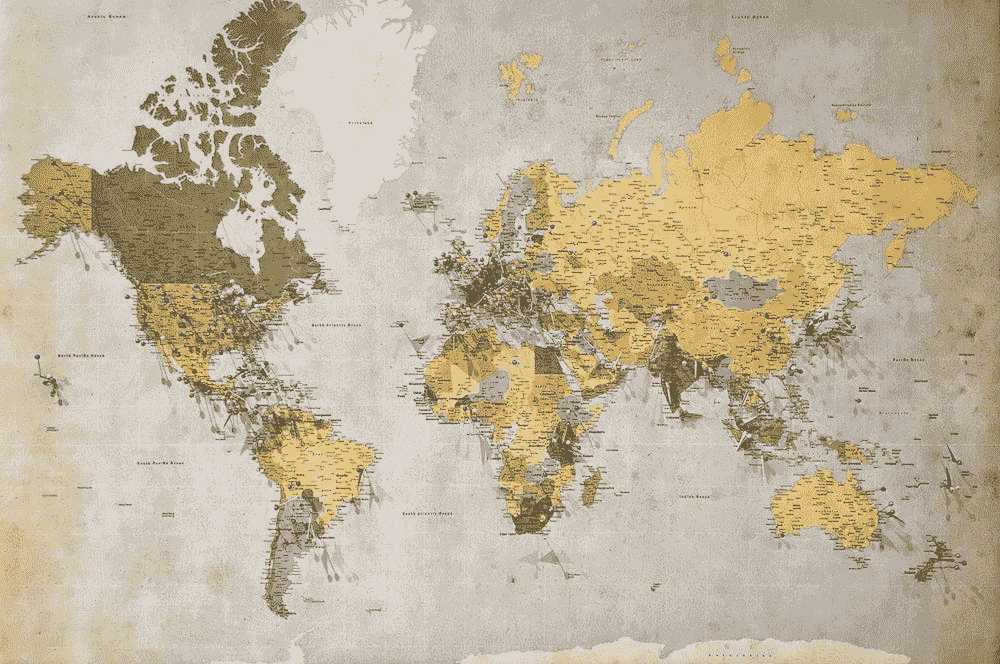
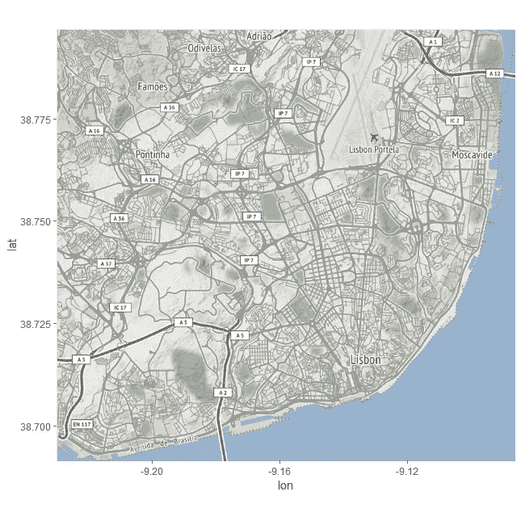
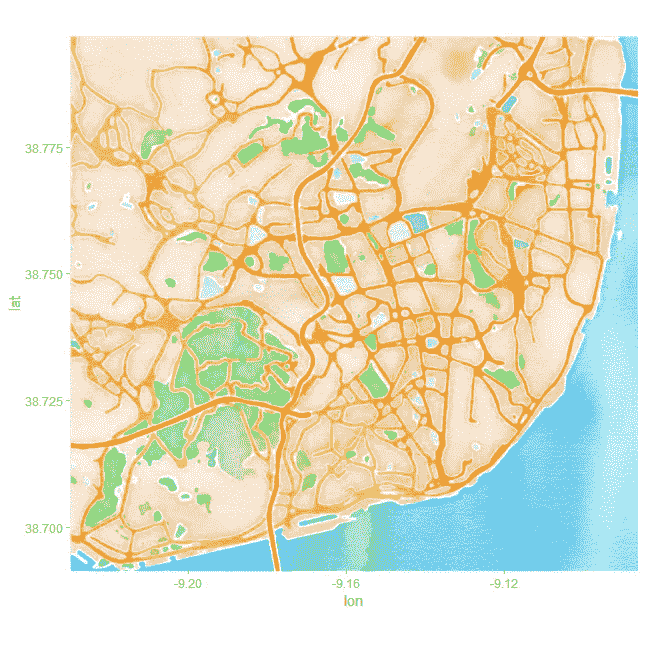
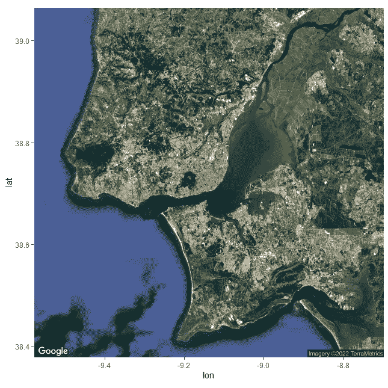
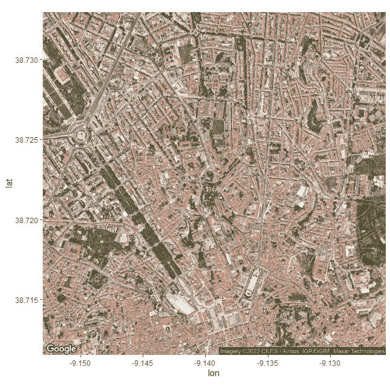
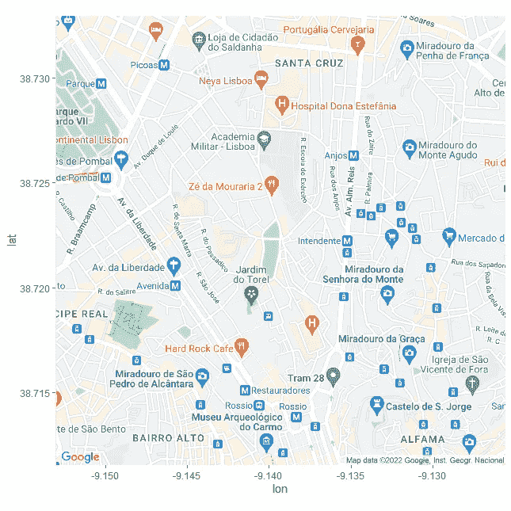
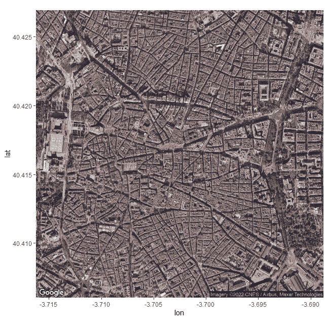
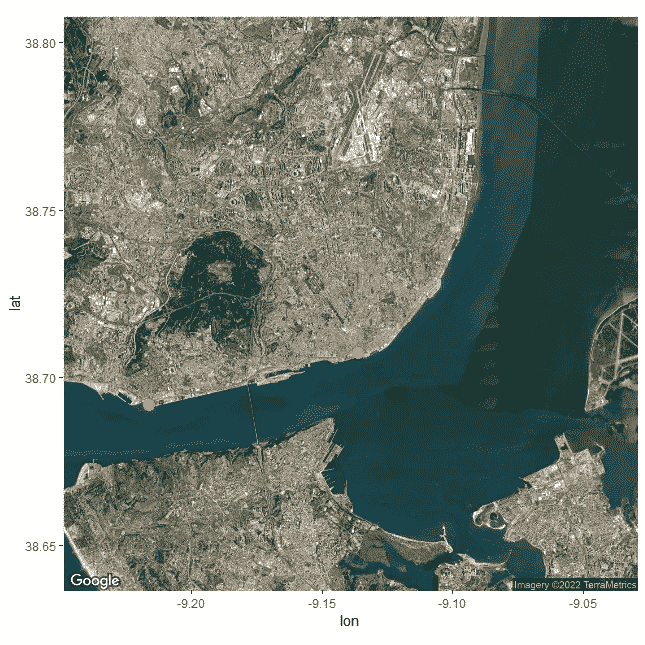
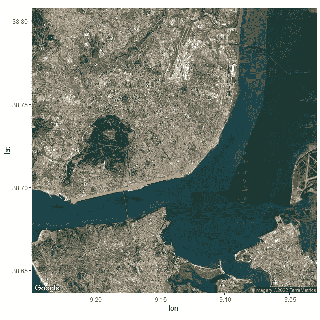
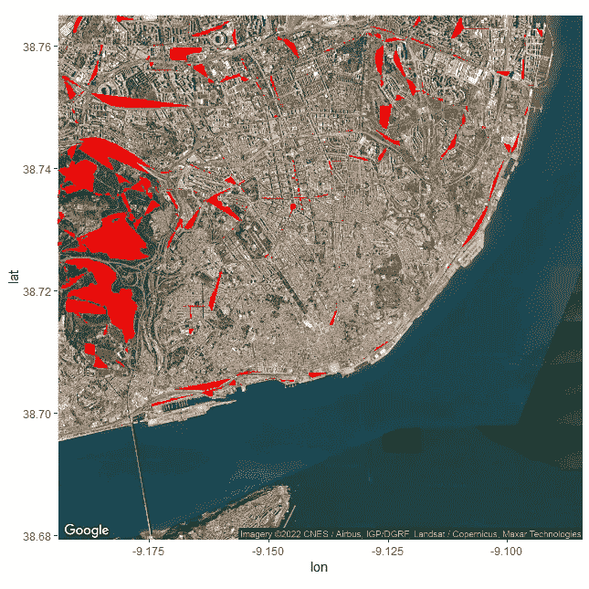

# 在 R 中使用 ggmap 的指南

> 原文：<https://towardsdatascience.com/a-guide-to-using-ggmap-in-r-b283efdff2af>

## 了解如何使用 ggmap，一个很酷的 R 库来可视化数据



A 添加空间和地图功能是增强您的数据科学或分析项目的一种非常好的方式。无论是因为您想要在地图上展示一些示例，还是因为您有一些地理要素来构建算法，拥有将数据和地图结合起来的能力对于任何开发人员来说都是一笔巨大的财富。

在这篇文章中，我将带您进入 ggmap 的世界，探索它的特性和功能，并向您展示它如何改变您使用空间数据的方式。无论您是数据科学家、GIS 专业人员，还是对地图和空间分析感兴趣的人，这篇文章都将帮助您使用 R 编程语言掌握`ggmap`包的基本概念。

`ggmap`是一个 R 包，允许用户从谷歌地图、Stamen 地图或其他类似的地图服务中检索和可视化空间数据。通过它，您可以创建以有意义的方式显示数据的地图，从而为数据可视化和探索提供强大的工具。

开始吧！

# 入门指南

要使用 ggmap，首先需要在 r 中安装软件包，这可以通过运行以下命令来完成:

```
install.packages("ggmap")
```

一旦安装包，您可以通过运行常用的`library`命令将它加载到您的 R 会话中:

```
library(ggmap)
```

我们需要做的第一件事是创建一个地图——我们可以使用`get_map()`来完成，这是一个使用 R 代码检索地图的函数！

# 使用 get_map()

该函数采用多个参数，允许您指定位置、类型(例如，街道、卫星、地形等。)和一张图的来源。例如，以下代码检索里斯本的街道地图，使用 [stamen](https://stamen.com/open-source/) 作为源:

```
 lisbon_map <- get_map(location ='lisbon', source="stamen")
```

在 ggmaps 中，你也可以使用谷歌地图作为你的来源。为此，我们需要设置一个 google maps api 键(我们将在几分钟内完成)。在我写这篇文章的时候，OpenStreetMap 不再被支持。

当您运行上面的代码时，您会注意到输出中有些奇怪的东西:

```
Google now requires an API key; see `ggmap::register_google()`
```

发生这种情况是因为`location`使用谷歌地图将位置转换成磁贴。要在不依赖谷歌地图的情况下使用`get_map`，我们需要依赖库`osmdata`:

```
install.packages('osmdata')
library(osmdata)
```

现在，我们可以使用函数`getbb`(来自 get boundary box)并将其提供给函数的第一个参数:

```
lisbon_map <- get_map( getbb('lisbon'), source="stamen")
```

有了上面的代码，我们就把地图下载到了一个 R 变量中。通过使用这个变量，我们将能够使用类似 ggplot 的特性来绘制我们下载的地图！

# 绘制我们的地图

一旦我们检索到地图，我们就可以使用`ggmap()`功能来查看它。该函数使用我们用`get_map()`创建的地图对象，并以 2D 格式绘制它:

```
ggmap(lisbon_map)
```



里斯本地图—作者图片

在 x 轴上，我们可以看到地图的经度，而在 y 轴上，我们可以看到纬度。我们还可以通过在`get_map`上提供一个`maptype`参数来请求其他类型的地图:

```
lisbon_watercolor <- get_map( getbb('lisbon'), maptype='watercolor', source="stamen")
ggmap(lisbon_watercolor)
```



里斯本水彩地图——作者图片

此外，您可以将坐标作为参数传递给函数。但是，为了使用该功能，您需要设置您的 Google Maps API。

解锁谷歌地图作为`ggmap`包的来源，你将获得一系列有用的功能。设置好 API 后，您将能够使用`get_map`功能根据指定的坐标检索地图图像，并解锁新类型和大小的地图图像。让我们看看，下一个！

# 通过 ggmap 使用 Google 服务

如上所述，在撰写本文时，在没有谷歌地图的情况下使用`ggmap`将会阻止您使用一系列非常重要的不同功能，例如:

*   将坐标转换成地图查询；
*   访问不同类型的地图，如卫星图像或路线图；

所以让我们继续使用`ggmap`，但是这次通过提供一个 Google Maps API 键来使用 Google 服务。您可以通过点击此[链接](https://developers.google.com/maps/documentation/embed/get-api-key)来设置自己的 API 密钥——要使用它，您需要在谷歌云平台上有一个活跃的计费地址，因此风险自担(我还建议您设置一些计费提醒，以防谷歌地图 API 价格在未来发生变化)。

要在 R 中注册您的 API 密钥，您可以使用`register_google`函数:

```
api_secret <- '#### YOUR API KEY'

register_google(key = api_secret)
```

现在，你可以要求一些很酷的东西，例如，卫星地图:

```
lisbon_satellite <- get_map(‘Lisbon’, maptype=’satellite’, source=”google”, api_key = api_secret)
```

可视化我们的新地图:



里斯本卫星地图-图片由作者提供

非常酷！我们还可以调整`zoom`参数来获得卫星的额外细节:

```
lisbon_satellite <- get_map('Lisbon', maptype='satellite', source="google", api_key=api_secret, zoom=15)
```



里斯本放大地图-作者图片

我们可以通过谷歌服务访问的另一个熟悉的地图是著名的路线图:

```
lisbon_road <- get_map('Lisbon', maptype='roadmap', source="google", api_key = api_secret, zoom=15)
ggmap(lisbon_road)
```



里斯本路线图—作者图片

现在，我们也可以向`location`提供坐标，而不是命名版本:

```
madrid_sat <- get_map(location = c(-3.70256, 40.4165), maptype='satellite', source="google", api_key = api_secret, zoom=15)
ggmap(madrid_sat)
```

`madrid_sat`地图是一个以马德里为中心的地图——我们通过向 location 参数传递一个带有经度和纬度的向量来给`get_map`提供马德里坐标。



马德里卫星地图-图片由作者提供

到目前为止，我们已经看到了使用`ggmap`的地图可视化的强大功能。但是，当然，这些地图应该能够与我们的 R 数据集成！接下来，让我们做这篇文章最有趣的部分——将 R 数据与我们的`ggmap`混合！

# 向我们的地图添加数据

您还可以使用 ggmap 在地图上叠加您自己的数据。首先，我们将创建一个样本数据框，然后使用 ggplot2 包中的`geom_point()`函数将这些坐标添加到地图中。

让我们从葡萄牙的两个著名地点 Torre de Belém 和 Terreiro do Paç创建一个数据框，然后使用`geom_point()`将这些地点添加到地图中:

```
lisbon_locations <- data.frame(lat = c(38.70742536396477, 38.69171766489758),
                               lon = c(-9.136270433729706, -9.216095320576182))
```

我们现在可以将我们的`lisbon_locations`覆盖在`ggmap`之上:

```
lisbon_map <- get_map('Lisbon', maptype='satellite', source="google", api_key = api_secret, zoom=12)

ggmap(lisbon_map) +
  geom_point(data = lisbon_locations, aes(x = lon, y = lat), color = "orange", size = 4)
```



突出显示两个坐标的里斯本卫星地图-图片由作者提供

同样，我们可以依靠`geom_segment`来连接这两点:

```
(
  ggmap(lisbon_map) 
  +
  geom_point(data = lisbon_locations, aes(x = lon, y = lat), color = "orange", size = 4)
  +
  geom_segment(
    data = lisbon_locations,
    aes(x = lon[1], y = lat[1], xend = lon[2], yend = lat[2]),
    color = "orange",
    size = 2
  )
)
```



两个坐标相连的里斯本卫星地图-图片由作者提供

只需几行代码，我们就可以轻松地从 Google Maps 中检索和可视化空间数据，并将我们的坐标添加到其中，为数据探索和可视化提供了一个有价值的工具。

最后，我们还可以在绘图中使用 shapefile 和其他复杂的坐标数据——例如，我将通过读取 shape file 并使用`geom_polygon`绘制来将 [Lisbon Cycling Roads](https://opendata.arcgis.com/datasets/440b7424a6284e0b9bf11179b95bf8d1_0.geojson) 添加到上面的地图中:

```
library(geojsonio)
cycling_df <- geojson_read("Ciclovias.geojson",  what = "sp")

ggmap(lisbon_map) +
  geom_polygon(data = cycling_df, aes(x = long, y = lat, group = group), fill = "red")
```



带有自行车道的里斯本地图

虽然不完美，上面的地图是里斯本自行车区的一个非常详细的可视化(只有几个错误)。我们通过以下方式制作了这张地图:

*   使用 [geojson](https://geojson.org/) 文件加载地理数据。
*   给我们的`ggmap`增加一个红色的`geom_polygon`。

感谢你花时间阅读这篇文章！

总之，R 中的`ggmap`包提供了一个有用的工具，用于处理空间数据和为数据可视化和探索创建地图。它允许用户检索和可视化各种来源的地图，如 Google Maps、Stamen Maps 等，并提供定制地图类型、位置和大小的选项。

此外，设置一个 Google Maps API 可以释放额外的功能，例如将坐标转换为地图查询和访问不同类型的地图的能力。总体而言，将空间和地图功能融入数据科学项目可以极大地增强您的数据讲述技能，并提供有价值的见解。

我写了一本学习 R 的书，为完全的初学者量身定制，有数百个例子和练习——通过在下面的[链接](http://link)找到我的书，迈出掌握 R 编程语言和增强你的数据科学技能的第一步！