# 差异中的差异回归模型使用指南

> 原文：<https://towardsdatascience.com/a-guide-to-using-the-difference-in-differences-regression-model-87cd2fb3224a>

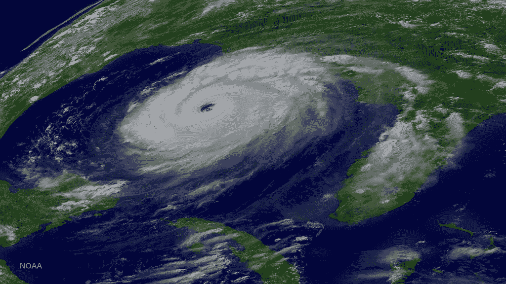

2005 年 8 月 28 日 21 时 15 分，美国宇航局拍摄的卡特里娜飓风照片，从路易斯安那州出发，穿过墨西哥湾，进入加勒比海。(提供: [NOAA](https://www.nesdis.noaa.gov/news/hurricane-katrina) 在[公共领域许可](https://photolib.noaa.gov/About)下)

## 我们将展示如何使用 DID 模型来估计飓风对房价的影响

在本文中，我们将研究**差异中的差异回归模型**。DID 模型是一种强大而灵活的回归技术，可用于估计“治疗”对接受治疗的一组个人或事物的不同影响。

# 定义术语:治疗、治疗组、对照组

“治疗”和“治疗组”这两个词可能会让人联想到随机对照试验的画面，以测试药物或药物治疗的功效。

虽然 DID 模型确实可以在这种情况下非常有效地使用，但在统计学中，习惯于对“治疗”一词进行更广泛的解释。**治疗**是选择性地只影响研究中某些个体或事物的任何事件。治疗的例子包括提高州政府规定的最低工资，这只影响到一个州的餐馆(正如在 1994 年由 [Card 和 Krueger 进行的被广泛引用的研究](https://econpapers.repec.org/article/aeaaecrev/v_3a84_3ay_3a1994_3ai_3a4_3ap_3a772-93.htm)中所分析的)，或者开通一条连接一个大国的两个地区的新航线，或者只影响到一个国家的部分地区的自然灾害，或者只对研究中的部分参与者进行实验性药物或医疗程序。在所有这些例子中，学习的**单元**分别是餐馆、城镇或县、县或州、或志愿者。

一项研究包括许多单位(个人或事物),根据他们是否接受治疗分为**治疗组**或**对照组**。

# 响应变量

在每一个这样的研究中，人们想要测量一个结果，一个反应，并且知道它是否会达到一个平均值，该平均值在治疗组中与在对照组中在统计学上不同。例如，Card 和 Krueger 在 1994 年进行的研究分析了 1992 年新泽西州最低工资从 4.25 美元增加到 5.05 美元是否会导致新泽西州快餐店员工的**就业水平**发生统计学上的显著变化，而邻近的宾夕法尼亚州的最低工资没有变化。响应变量的其他例子是参与者的 SAT 分数、一个县的污染水平和一个国家的树木覆盖率。

# 时间的影响

实际上，随着时间的推移，情况变得复杂了。无论被测量的反应变量是什么，是 SAT 分数、就业水平、房价通胀还是参与者的血糖水平，随着研究从实验的治疗前阶段进展到治疗后阶段，时间的自然流动将以潜在的显著方式改变该变量的值。实验者必须忽略时间(以及时间代表的众多隐藏因素)对对照组和治疗组反应变量平均值变化的部分影响。换句话说，实验者必须确定治疗本身是否引起了治疗组内反应变量平均值的任何变化，即随着时间的推移引起的*超过*、*和*，在治疗组中观察到的这种额外的治疗诱导效应是否比对照组多得多。

差异中的差异(DID)回归模型可用于轻松、优雅地执行上述所有分析。

拟合的 DID 模型将告诉我们是否有在治疗组中观察到的纯治疗诱导的净附加效应的证据，其估计值，该估计值是否具有统计显著性，如果是，95%或 99%的置信区间在估计的效应附近。

# 差异中的差异模型的结构

以下等式说明了 DID 模型的结构:

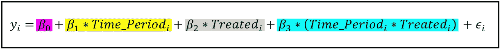

差异中的差异回归模型(图片来自作者)

我们注意到的关于这个方程的第一件事是，它是一个线性回归模型。

*y_i* 是对*和*观察的观察响应。它是在治疗前后在每组中测量的值。

*β_0* 为回归的截距。

*Time_Period_i* 是一个虚拟变量，根据第*次*次测量分别指的是治疗前还是治疗后期间，该变量取值为 0 或 1。

*Treated_i* 是一个虚拟变量，其取值为 0 或 1，取决于第*和第*次测量分别是指对照组还是治疗组中的个体。

*(Time _ Period _ I * Treated _ I)*是一个交互项。它存储了*和*观察值的两个虚拟变量值的乘积。

*ϵ_i* 是与*和*观测值相关的误差项，它捕捉了模型无法充分表现的所有因素的影响。

模型中的两个虚拟变量产生以下 2 X 2 回归方程矩阵:

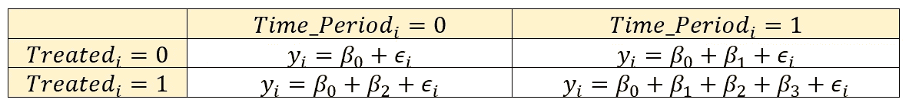

由两个虚拟变量产生的可能回归方程的矩阵(图片由作者提供)

使用普通最小二乘回归技术训练 DID 模型。

对于经过训练的(也称为拟合的)模型，相应的期望如下。系数上方的大写(^)表示它们是相应系数的估计(拟合)值。将 *y_i* 替换为 *y_i* 的期望值也允许我们去掉误差项 *ϵ_i* ，因为在一个表现良好的 OLS 回归模型中，误差项的期望值为零:

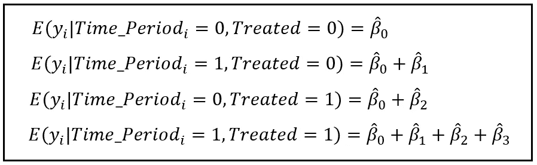

由两个虚拟变量产生的四种情景中每一种情景的拟合回归模型的预期值(预测值)(图片由作者提供)

我们希望计算研究的治疗前(前)和治疗后(后)阶段之间的预期值 *y_i* 的差异。

对于治疗组，期望值的差异计算如下:

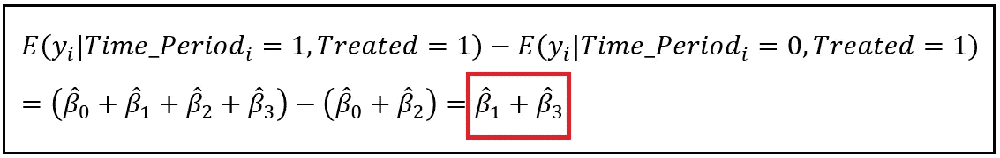

研究的治疗后和治疗前阶段之间的治疗组内估计反应的差异(图片由作者提供)

同样，对于对照组，我们有:

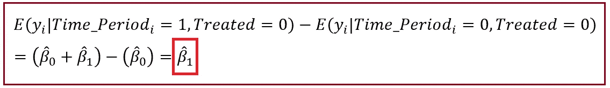

研究的治疗后阶段和治疗前阶段在对照组中的估计反应的差异(图片由作者提供)

两个差异之间的差异给出了治疗组治疗的**净效果:**

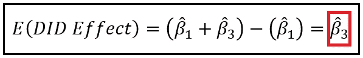

治疗组和对照组之间差异效应的期望值(图片由作者提供)

> 我们看到这种差异中的差异效应就是交互项(Time _ Period _ I * Treatment _ Group _ I)*的系数。*

正是这个结果使得 DID 模型非常有用。

在 DID 模型被训练之后，*相互作用项(Time _ Period _ I * Treatment _ Group _ I)*的拟合系数将给出我们正在寻求的差异效应的估计值。系数的 t 得分和相应的 p 值将告诉我们影响是否显著，如果显著，我们可以使用模型报告的系数标准误差，围绕估计系数构建 [95%或 99%置信区间](/interval-estimation-an-overview-and-a-how-to-guide-for-practitioners-e2a0c4bcf108)。

让我们使用一个有趣的真实世界示例来说明构建和训练差异中的差异回归模型的过程。

# 如何建立一个差异中的差异模型来估计沿海天气事件对房价的影响

我们将使用 DID 模型来估计沿海天气事件对美国房价的影响。具体来说，我们将分析 2005 年大西洋飓风季[的影响，该季](https://en.wikipedia.org/wiki/2005_Atlantic_hurricane_season)是截至 2020 年有记录以来最活跃的飓风季*。*

顺便说一下，这个主题已经使用各种方法进行了广泛的研究。一些研究人员关注单个风暴或多个风暴对单个城市或单个州房价的影响，而另一些人则把注意力扩大到地区或国家层面。有关于恶劣天气事件对美国单个县房价影响的超本地化研究，而其他人则研究了几年的恶劣天气事件对几个沿海城市房价的影响。最近还有一项有趣的研究，是关于估计[遥远但正在逼近的](https://link.springer.com/article/10.1007/s11146-021-09843-3)飓风对房地产价格的影响。

这些研究中有几项使用了差异中的差异回归模型(或其一些变体或增强)。有趣的是，尽管可能并不令人惊讶，但这些研究的结果是多样且矛盾的，这取决于研究人员使用的方法和研究的时空范围。

## 我们解决问题的方法

在本文的其余部分，我们将构建一个相当简单的差异中的差异回归模型来研究 2005 年飓风季节对房价指数变化的影响，也称为受飓风季节严重影响的沿海各州与未受飓风季节影响的沿海各州的房价通胀。与该领域先前工作中使用的模型相比，我们的模型是一个简单的模型。然而，正如我们将很快看到的那样，我们将得出与在这一领域的研究文献中所获得的同样的结果。

在我们的小实验中，‘**待遇**将意味着遭受 2005 年飓风季节的全部冲击。接受(或不接受)处理的'**单元'**,是一个拥有海岸线的美国州。美国有 24 个这样的州:

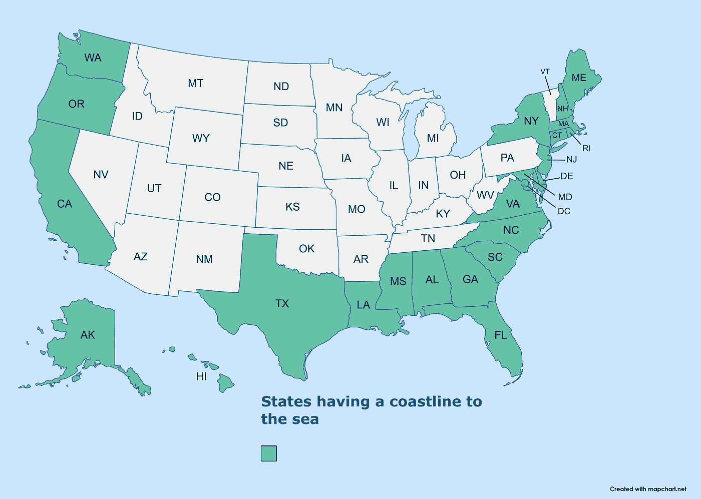

有海岸线的州(来源:[地图](https://www.mapchart.net/feedback.html)在 [CC BY-SA 4.0](https://www.mapchart.net/feedback.html) 下)

## 定义纳入治疗组的标准

我们将通过检查美国联邦紧急事务管理局(FEMA)在 2005 年大西洋飓风季节在该州采取的行动来决定一个州是否属于治疗组。

本联合会向因灾害而遭受大范围破坏的各县的个人提供直接援助。这种类型的援助称为[个人援助](https://www.fema.gov/assistance/individual)，不同于联邦应急管理局提供的另一种类型的援助，称为[社区援助](https://www.fema.gov/floodplain-management/community-assistance-program)。在 2005 年大西洋飓风季节的任何时候，我们将统计每个沿海州有资格接受联邦应急管理局个别援助的县的数量。以下是各州的统计数据:

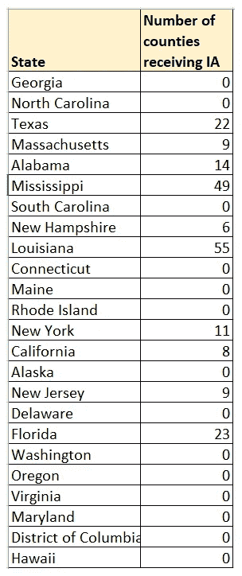

2005 年大西洋飓风季节各州符合 IA 资格的县数。数据来源:[2005 年 FEMA 公布的灾难清单](https://www.fema.gov/disaster/declarations?field_dv2_state_territory_tribal_value=All&field_year_value%5B%5D=2005&field_dv2_declaration_type_value=All&field_dv2_incident_type_target_id_selective=All)(图片由作者提供)

如果一个县不止一次获得 IA 的资格，我们会多次计算。重复计算背后的基本原理是，在每次灾害中，一些受损财产可能与上次灾害中受损的财产不同。同样，一些重建或修复的财产也可能在随后的事件中再次受损。这两种情况都会影响房产的转售价值。此外，理论上，同一县的多个灾难事件至少暂时会降低该县房产对潜在购房者的吸引力，从而压低房价或降低房价涨幅。另一方面，该县有交易价值的房屋库存的减少可能(暂时)增加房价通胀。我们的回归模型应该帮助我们确定这些影响中哪些是主要的。

上表包含了计数的广泛可变性，我们面临的问题是如何确定一个状态是否“足够”被认为是一个治疗状态。我们是否应该考虑将有 9 个受影响县的新罕布什尔州作为治疗州？加利福尼亚州有 8 个受影响的县，或者纽约州有 11 个受影响的县呢？在计数标尺的另一端是海湾州路易斯安那州、阿拉巴马州和密西西比州，这些州从各方面来看都受到了很大的影响，显然是“治疗”组的州。

我们将尝试通过在计数的**中位数**处画线来解决这个问题。任何计数大于或等于中位数(14)的州都将被归入治疗组。其余的将是控制组的一部分。以下是群组地图的外观:

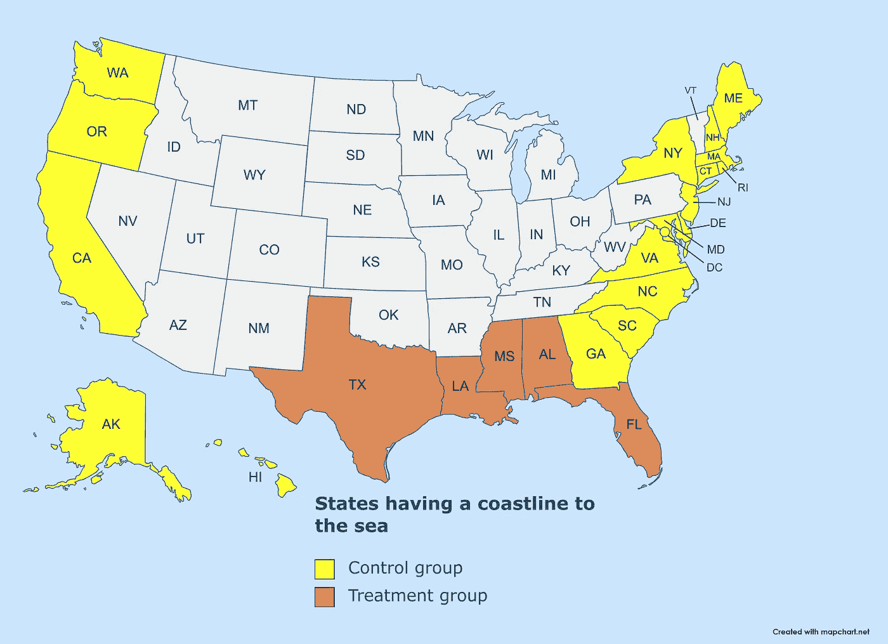

面向海洋的国家中的治疗和控制组(来源:[地图](https://www.mapchart.net/feedback.html)在 [CC BY-SA 4.0](https://www.mapchart.net/feedback.html) 下)

正如我们从图上看到的，我们将处理一个**高度不平衡的**数据集，其中治疗组远远小于对照组。这几乎肯定会影响由我们的 DID 模型产生的估计的质量。

## 设置治疗柱

使用上面概述的治疗组选择标准，我们将添加一个名为***Disaster _ Affected***的列，对于计数≥14 的州，将其值设置为 1，对于其余的州，将其值设置为 0:

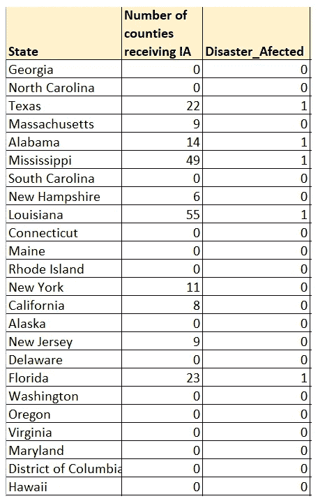

(图片由作者提供)

## 设置时间段列

接下来，我们将添加一个 ***Time_Period*** 列，我们将把它设置为 0 来表示 2005 年飓风季节开始之前的时期，设置为 1 来表示飓风季节结束之后的时期。注意下面我们复制了行，这样每个状态都有一个 *Time_Period=0* 的行和一个 *Time_Period=1* 的行。

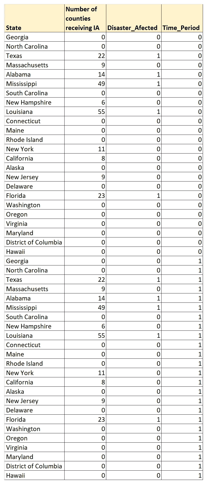

(图片由作者提供)

## 计算响应变量值的方法

本节描述了计算响应变量 *y_i* 值的程序。

我们的目标是研究 2005 年飓风季节对沿海各州房价的影响。为此，我们将使用美国美联储发布的**州级*所有交易房价指数*，以及可从[美国弗雷德](https://fred.stlouisfed.org/)获得的公共领域许可下载的[。以下是哥伦比亚特区的指数情况:](https://fred.stlouisfed.org/categories/27290?t=public%20domain%3A%20citation%20requested%3Bquarterly&ob=pv&od=desc)**

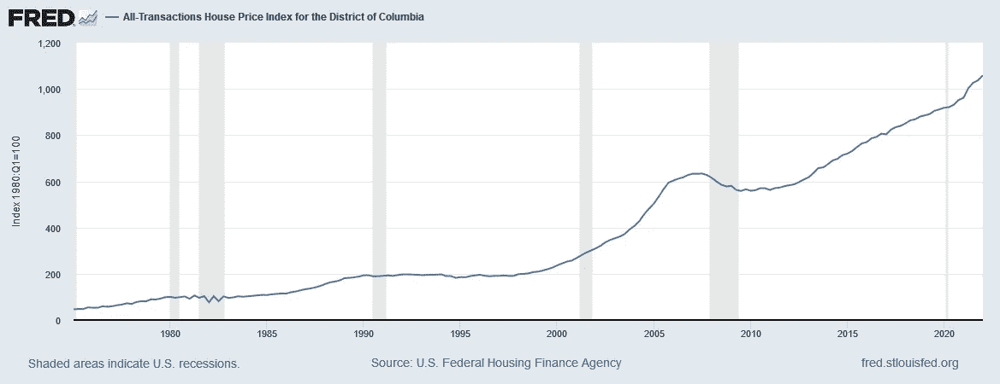

美国联邦住房金融署，[哥伦比亚特区所有交易房价指数](https://fred.stlouisfed.org/series/DCSTHPI) [DCSTHPI]，从圣路易斯美联储银行的 FRED 处检索；，2022 年 6 月 12 日([公有领域](https://fred.stlouisfed.org/categories/27290?t=public%20domain%3A%20citation%20requested%3Bquarterly&ob=pv&od=desc))

我们将访问 24 个相关状态的 24 个时间序列数据集，并将它们组合成 24 状态数据面板，如下所示:

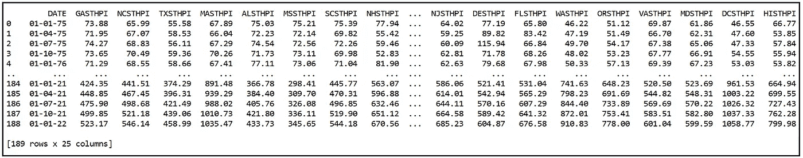

从 1975 年的 Q1 到 2022 年的 Q1，所有沿海州的房价指数数据

在我们的研究中，我们感兴趣的时间段是 2005 年飓风季节之前的 4 个季度和该季节之后的 4 个季度。飓风季节从 2005 年 6 月 8 日持续到 2006 年 1 月 6 日。因此，我们感兴趣的是从 2004 年 7 月 1 日、2004 年 10 月 1 日、2005 年 1 月 1 日和 2005 年 4 月 1 日开始的各个季度的房价指数变化，然后是 2005 年季度之后的 4 个季度，即 2006 年 4 月 1 日、2006 年 7 月 1 日、2006 年 10 月 1 日和 2007 年 1 月 1 日。让我们放大这个感兴趣的区域，看看它是什么样子的:

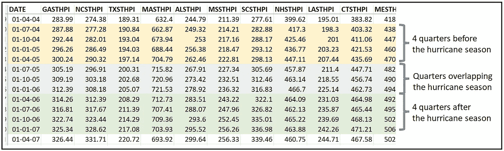

2005 年飓风季节前后的四个季度利息。(图片由作者提供)

对于每个州，我们将计算两组季度房价指数的平均季度环比变化。这样做将为我们提供反应变量的值，即每个州在研究的治疗前和治疗后阶段 HPI 的平均 Q-o-Q 变化。

任意连续两个季度 *i* 和 *(i-1)* 的房价指数季度环比变化率可使用以下公式计算:

*HPI 分数变化=[HPI _ I—HPI _(I-1)]/HPI _(I-1)*

以下是 2005 年飓风季节前后 4 个季度的 Q-o-Q 分数变化值。突出显示的单元格说明了其中一个季度的计算结果:

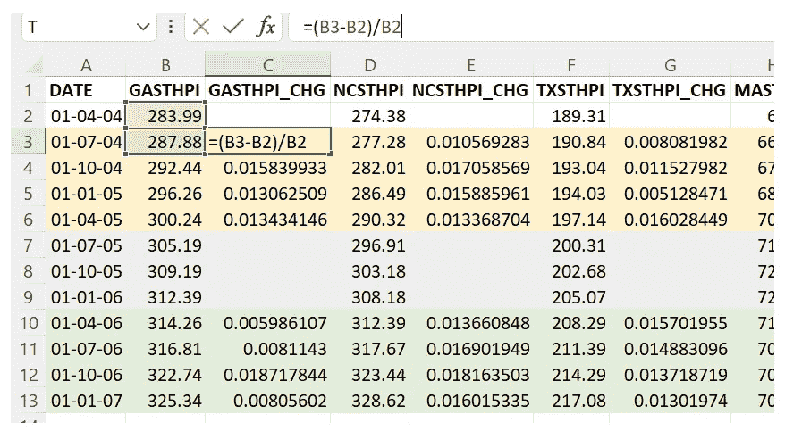

利息季度 HPI 季度环比变化百分比的计算(图片由作者提供)

接下来，我们取每个区块 4 个季度的垂直平均值，得出 2005 年飓风季节前后 HPI 4 个季度的平均分数变化。我们对每个状态重复这种计算，以获得治疗前和治疗后阶段的响应变量 HPI_CHG 的值。

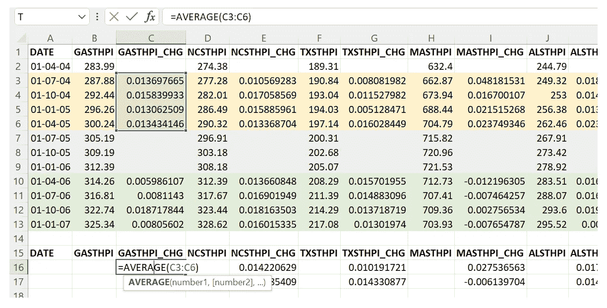

计算 HPI 在飓风季节前后 4 个季度的 Q-o-Q 分数变化平均值(图片由作者提供)

注意，对于每个状态，我们已经计算了两个响应值:顶部的值是治疗前的值，底部的值是治疗后的值。因此，有一个值对应于*时间周期=0* ，另一个值对应于*时间周期=1* 。让我们将这些平均值包括在我们将用于训练 DID 模型的数据集中:

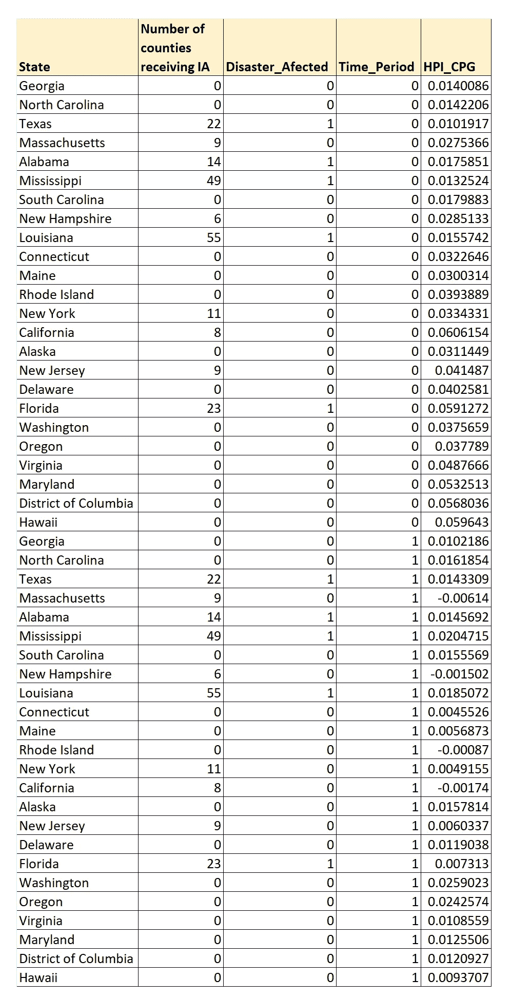

用于训练差异中的差异模型的数据集(图片由作者提供)

上述数据集 set HPI_CPG 的最后一列是我们的响应变量 *y_i* 。

数据集可从此处 下载 [**。**](https://gist.github.com/sachinsdate/1fc451683137398e11c75b2e47031cf1)

既然我们的数据集已经构建好了，我们就可以继续构建和训练 DID 模型了。

## 构建房价上涨的差异模型

让我们从陈述 DID 模型的等式开始:

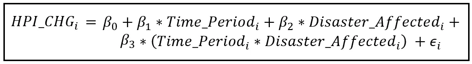

用于估计飓风灾害对房价变化影响的 DID 模型方程(图片由作者提供)

为了构建和训练模型，我们将使用 Python 和基于 Python 的库 [Pandas](https://pandas.pydata.org/getting_started.html) 和 [statsmodels](https://www.statsmodels.org/stable/gettingstarted.html) 。

让我们从导入所有必需的包开始:

```
**import** pandas **as** pd
**from** patsy **import** dmatrices
**import** statsmodels.api **as** sm
```

接下来，我们将数据集加载到 Pandas 数据帧中，如下所示:

```
df = pd.**read_csv**(**'**us_fred_coastal_us_states_avg_hpi_before_after_2005.csv**'**, **header**=0)
```

用 [Patsy](https://patsy.readthedocs.io/en/latest/quickstart.html) 语法形成回归表达式。假设截距存在，并将自动包含在数据集中:

```
reg_exp = **'HPI_CHG ~ Time_Period + Disaster_Affected + Time_Period*Disaster_Affected'**
```

使用 Patsy 绘制培训矩阵:

```
y_train, X_train = **dmatrices**(reg_exp, df, **return_type**=**'**dataframe**'**)
```

构建 DID 模型:

```
did_model = sm.**OLS**(**endog**=y_train, **exog**=X_train)
```

训练模型:

```
did_model_results = did_model.**fit**()
```

打印培训总结:

```
did_model_results.**summary**()
```

我们看到以下输出(我已经突出显示了有趣的部分):

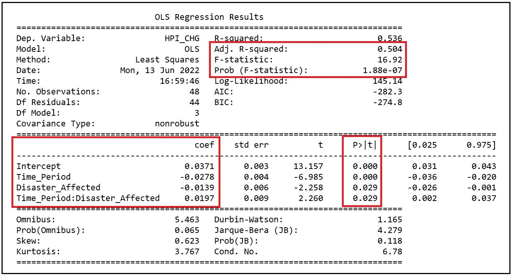

差异中的差异回归模型的训练输出(图片由作者提供)

## 如何解释 DID 模型的训练输出

我们看到调整后的 R 平方为 0.504。该模型已经能够解释响应变量 HPI_CHG 中超过 50%的方差。这是一个伟大的结果。F 统计量的 p 值为 1.88e-07，从统计学上讲，这是非常显著的，这使我们得出结论，模型的变量是共同显著的，它们一起比简单的均值模型更好地解释了 CHG HPI 的方差。

我们还注意到，所有系数都具有统计显著性，正如它们的 p 值都小于 0.05 所示。

拟合模型的方程如下:

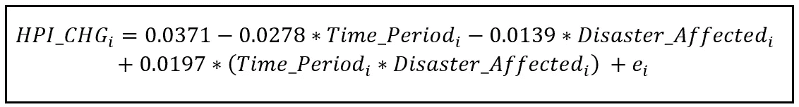

拟合的差异中的差异模型的方程(图片由作者提供)

Time_Period 和 Disaster_Affected 是 0/1 虚拟变量。四种可能的组合是:

让我们来看看如何解释两个虚拟变量的每个组合:*时间段*和*受灾*。我们还将切换到使用 *HPI_CHG* 的期望值，这导致下标 *i* 以及残差项 *e_i* 的下降。

## Time_Period_i=0，Disaster_Affected_i=0

我们得到下面的等式:

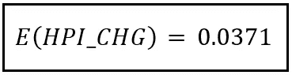

飓风前控制组各州房价指数的预期环比变化(图片由作者提供)

这个等式给出了在 2005 年飓风季节之前的四个季度中，控制组**的房价平均通货膨胀的估计值。估计的平均通货膨胀值就是回归的截距:0.0371，或 3.71%。**

## Time_Period_i=1，Disaster_Affected_i=0

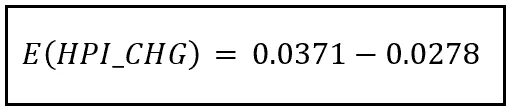

飓风过后，对照组各州房价指数的预期环比变化(图片由作者提供)

这个等式给出了在后处理期间，即在飓风季节之后的四个季度期间，在**控制组**各州房价的估计平均通货膨胀率。估计的平均通货膨胀值为 0.0371 — 0.0278=0.0093，即 0.93%。

## Time_Period_i=0，Disaster_Affected_i=1

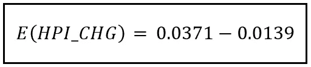

飓风前期间，治疗组各州房价指数的预期环比变化(图片由作者提供)

这个等式给出了在飓风季节开始前的四个季度中，在**治疗组**各州的估计平均房价通胀。这个通货膨胀的值是 0.0371 — 0.0139=0.0232，即 2.32%。

## *Time_Period_i=1* 和 *Disaster_Affected_i=1*

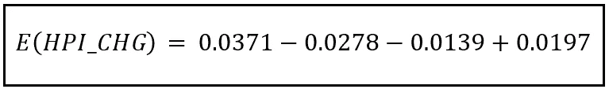

飓风过后，治疗组各州房价指数的预期环比变化(图片由作者提供)

这个等式给出了治疗组在飓风季节结束后的四个季度中估计的平均房价通胀。这个通货膨胀的值是 0.0371—0.0278—0.0139+0.0197 = 0.0151 或 1.51%。

让我们把我们的发现制成表格:

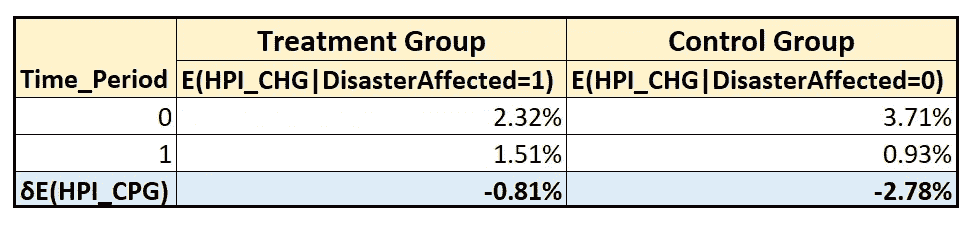

治疗组和对照组治疗前后房价指数的估计变化(图片由作者提供)

表格的第三行提到了估计值的垂直差异(季节后-季节前)。

我们看到，对于受灾群体而言，与飓风季节开始前的四个季度相比，飓风季节后四个季度的房价通胀率降低了 0.81%。

对于未受灾害影响的群体而言，与飓风季节开始前的四个季度相比，飓风季节后四个季度的房价通胀率降低了 2.78%。

两组之间的差异效应为:


差异中的差异效应估计值(图片由作者提供)

下图可能有助于可视化各种估计值:

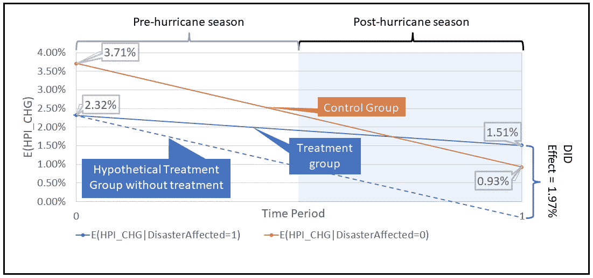

飓风季节治疗前后治疗组和对照组房价指数的估计变化(图片由作者提供)

1.97%的值正是训练好的 DID 回归模型报告的*时间段* * *受灾*相互作用项的系数值；

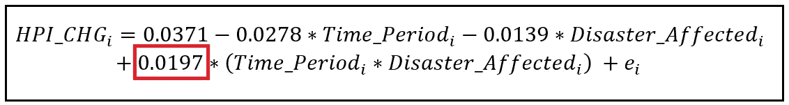

拟合的 DID 模型(图片由作者提供)

估计的 1.97%的差异表明，在 2005 年飓风季节结束后，特别受飓风季节影响的各州的房价通胀比其他沿海各州降温更少。解释这一效应的一种方法是注意到通货膨胀通常与供给成反比。由于治疗组各州遭受了广泛的财产损失，因此导致的房屋库存减少可能会在飓风季节结束后的四个季度内暂时加剧这些州的房价上涨。

下面是本文中使用的源代码:

# 参考文献、引文和版权

## 数据集

美国各州的所有交易房价指数，由美国联邦住房金融局提供，从圣路易斯的美联储银行检索；，2022 年 6 月 12 日(可在[公共领域](https://fred.stlouisfed.org/categories/27290?t=public%20domain%3A%20citation%20requested%3Bquarterly&ob=pv&od=desc)获得)。**本文中使用的数据集的策划版本** [**可以从这里**](https://gist.github.com/sachinsdate/1fc451683137398e11c75b2e47031cf1) 下载。

## 报纸

卡，大卫和克鲁格，艾伦，(1994)，[最低工资和就业:新泽西州和宾夕法尼亚州的快餐业案例研究](https://EconPapers.repec.org/RePEc:aea:aecrev:v:84:y:1994:i:4:p:772-93)，*《美国经济评论》*，84 年，第 4 期，第 772-93 页。

Ortega，Francesc 和 Taspinar，Suleyman，《海平面上升和房地产价值下降:飓风桑迪对纽约住房市场的影响》(2018 年 3 月 29 日)。在 http://dx.doi.org/10.2139/ssrn.3074762 的 [SSRN](https://ssrn.com/abstract=3074762) 或[有售](https://dx.doi.org/10.2139/ssrn.3074762)

廖，和 Graff Zivin，Joshua 和 Panassie，Yann，飓风如何席卷住房市场:来自佛罗里达州的证据。可在 http://dx.doi.org/10.2139/ssrn.4103049 的 [SSRN](https://ssrn.com/abstract=4103049) 或[买到](https://dx.doi.org/10.2139/ssrn.4103049)

飓风对商业房地产价值的影响。*公交经济* 56 **，**129–145(2021)。[https://doi.org/10.1057/s11369-021-00212-9](https://doi.org/10.1057/s11369-021-00212-9)

Seung Kyum Kim，Richard B. Peiser，风暴频率和强度增加对沿海住房市场的影响，洪水风险管理杂志，2020 年 5 月 26 日，[https://doi.org/10.1111/jfr3.12626](https://doi.org/10.1111/jfr3.12626)

安东尼·墨菲和埃里克·施特罗布尔，2010。[飓风对房价的影响:来自美国沿海城市的证据](https://ideas.repec.org/p/fip/feddwp/1009.html)，[工作文件](https://ideas.repec.org/s/fip/feddwp.html) 1009，达拉斯美联储银行。

远方飓风对当地住宅市场的影响。 *J 房地产金融经济* (2021)。[https://doi.org/10.1007/s11146-021-09843-3](https://doi.org/10.1007/s11146-021-09843-3)

## 形象

本文中的所有图片版权归 [CC-BY-NC-SA](https://creativecommons.org/licenses/by-nc-sa/4.0/) 所有，除非图片下方提到了不同的来源和版权。

*如果您喜欢这篇文章，请关注我的*[***Sachin Date***](https://timeseriesreasoning.medium.com)*以获得关于回归、时间序列分析和预测主题的提示、操作方法和编程建议。*