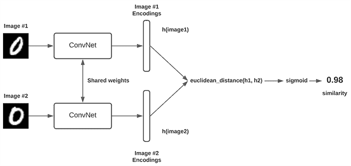

# PyTorch 图像检索简介

> 原文：<https://towardsdatascience.com/a-hands-on-introduction-to-image-retrieval-in-deep-learning-with-pytorch-651cd6dba61e>

# 【PyTorch 图像检索简介

## *用 PyTorch 的完整代码简单而彻底地介绍了图像检索的世界*

马库斯·温克勒在 [Unsplash](https://unsplash.com?utm_source=medium&utm_medium=referral) 上的照片

随着电子商务和在线网站的出现，图像检索应用一直在我们的日常生活中不断增加。亚马逊、阿里巴巴、Myntra 等。一直在大量利用图像检索，根据我们刚才看到的内容，提出他们认为最合适的产品。当然，只有当通常的信息检索技术失效时，图像检索才会被调用。例如，尽管基于元数据的方法会失败，但我们的人眼会很容易地将右边的所有衬衫聚集在一起作为相似的。

> 文章底部列出了不同的资源。

# 一点背景

图像检索的基本本质是根据查询图像的特征从集合或数据库中找出一幅图像的问题。大多数时候，这种特征是图像之间简单的视觉相似性。在一个复杂的问题中，特征可以是两个图像的风格相似性，甚至是互补的性质。由于原始形式的图像在其基于像素的数据中不反映这些特征，我们需要将该像素数据转换到潜在空间中，在该空间中图像的表示将反映这些特征。

一般来说，任何两个相似的图像在潜在空间中会彼此靠得更近，而不同的图像会离得更远。这是我们用来训练模型的基本管理规则。一旦我们这样做了，检索部分简单地搜索潜在空间，以在给定查询图像的表示的潜在空间中挑选最接近的图像。大多数时候，它是在[最近邻搜索](https://scikit-learn.org/stable/modules/neighbors.html)的帮助下完成的。

因此，我们可以将我们的方法分为两部分:

1.  ***图像表示***
2.  ***搜索***

> 我们将在**牛津 102 朵花**数据集上整体解决这两个部分。你可以在这里下载并阅读数据集。

# **形象再现**

我们将使用一种叫做连体模型(来自连体双胞胎)的东西，它本身并不是一个全新的模型，而是一种训练我们模型的新技术。大多数情况下，这与所谓的三重态损失一起使用。这个想法的基本组成部分是三胞胎。

现在，三胞胎到底是什么？三元组是 3 个独立的数据样本，假设 A(锚)、B(正)和 C(负)；其中 A 和 B 相似或具有相似的特征(可能是同一个类),而 C 与 A 和 B 都不相似。这 3 个样本一起形成训练数据的一个单元——三元组。

> **注**:任何图像检索任务的 90%都体现在连体网络、三元组丢失和生成真三元组上。如果你成功地完成了这些，整个努力的成功或多或少是有保证的。

首先，我们将创建管道的这个组件——数据。下面我们将在 PyTorch 中创建一个自定义数据集和数据加载器，它从数据集生成三个一组的图像。

现在我们有了数据，让我们继续到暹罗网络。暹罗网络本身是一个单一模型，我们将其应用于一对或三个输入。它给人一种 2 或 3 个模型的明显印象，但中心思想是所有这些模型必须共享权重，即只有一个模型。

暹罗网络。这里的 ConvNet 实际上是一个单一的模型。

如前所述，维系整个架构的关键是三重态损耗。三重损失创建了一个目标函数，该目标函数强制相似输入对(锚定&正)之间的距离比相异输入对(锚定&负)之间的距离小某个定义的余量。下面我们将看看三重损失以及培训管道。

到目前为止，我们的模型已经被训练成将图像转换到嵌入空间，该嵌入空间反映了我们想要实现的相似感。接下来，我们进入搜索部分。

# **搜索**

我们可以很容易地使用 Scikit-Learn 提供的最近邻搜索。我们将探索新的更好的东西，而不是走那条简单的路线。

我们将使用脸书研究公司的 Faiss。这比最近邻法要快得多，如果我们有大量的图像，这种速度上的差异会变得更加突出。

下面我们将演示如何在给定一个查询图像的情况下，在存储的图像表示中搜索最接近的图像。

这涵盖了基于现代深度学习的图像检索，而不会使它变得太复杂。大多数检索问题都可以用这个基本管道来解决。根据问题陈述的创新主要在于根据需要修改的基础模型。

# 资源

1.  包含本文所有代码的样板笔记本可以在这里找到:[https://www . ka ggle . com/mayukh 18/Oxford-flowers-image-retrieval-py torch](https://www.kaggle.com/mayukh18/oxford-flowers-image-retrieval-pytorch)
2.  这里列出了图像检索界流行的基准数据集:[https://paperswithcode.com/task/image-retrieval](https://paperswithcode.com/task/image-retrieval)