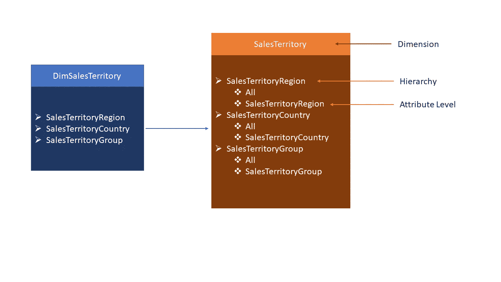
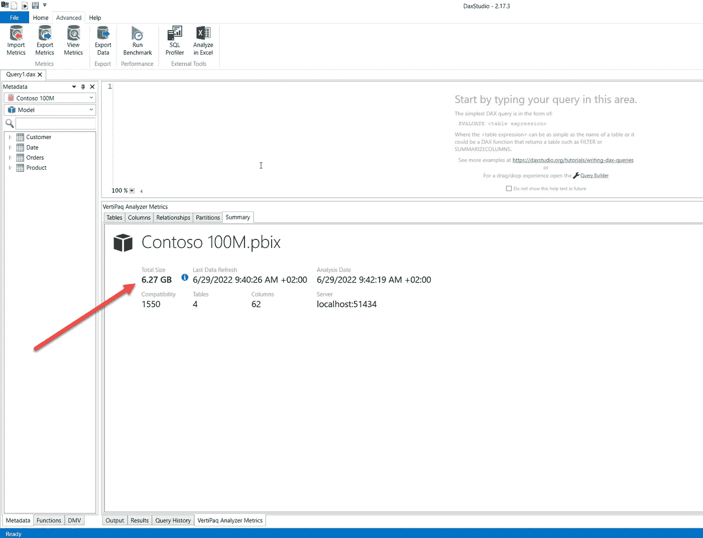
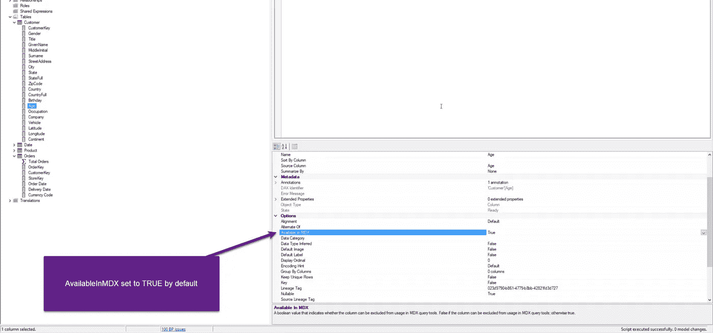
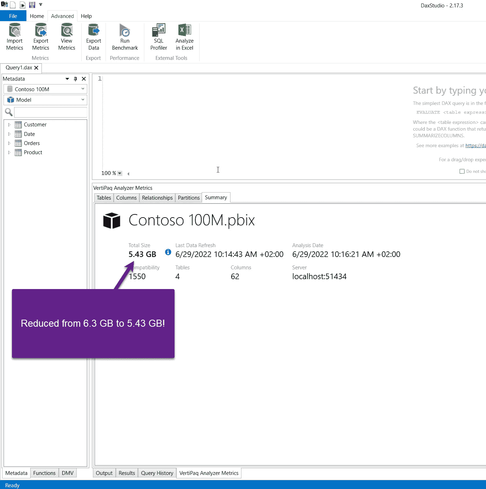
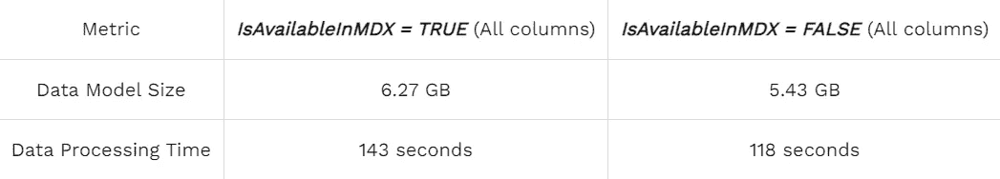
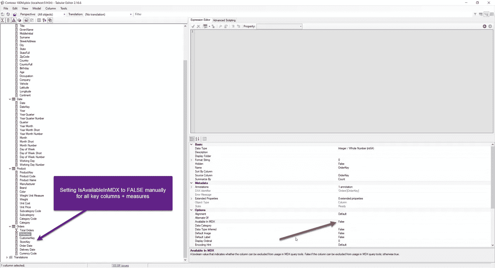
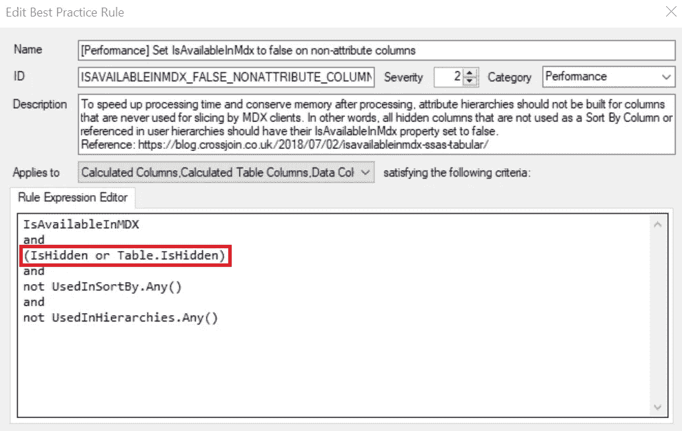
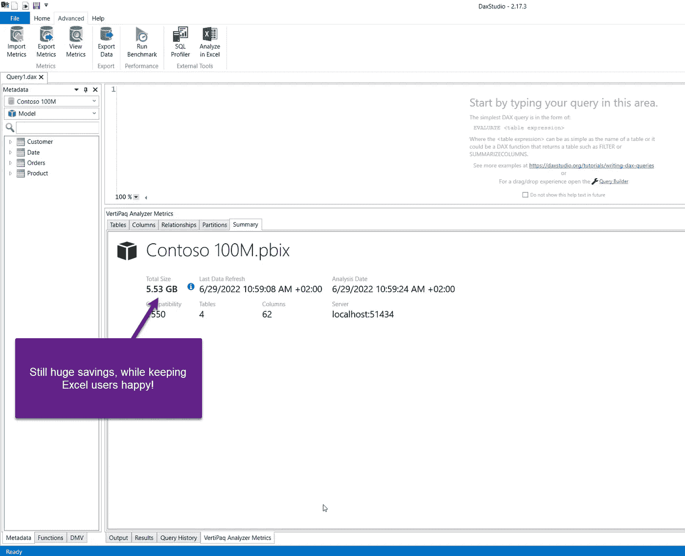

# 一个隐藏的小宝石，可以拯救你的生命

> 原文：<https://towardsdatascience.com/a-hidden-little-gem-that-can-save-your-power-bi-life-f73f9e8c75af>

## 改变隐藏在表格模型中的属性的默认值可以让你成为一个真正的 BI 英雄


[pix abay 在 Pexels 上拍摄的照片](https://www.pexels.com/de-de/foto/braune-katze-208849/)

有时候，事情的发生是有原因的。

几周前，我参加了本尼·德·贾格尔在 Data Grillen 举办的关于 Power BI 性能调整的会议。这是一次很棒的会议，本尼分享的技巧之一与表格模型中的 *IsAvailableInMDX* 属性有关。我记得有时在某个地方听说过它，但老实说很少有机会在现实世界中应用它。但是，正如我一开始所说的，事情的发生是有原因的…

上周，我在为一个客户优化 Power BI 解决方案。我确保将所有的王牌都拿出来，以使数据模型更加高效— [删除了不必要的数据](https://medium.com/p/76d7c4377f2d)，[尽可能地减少基数](https://medium.com/p/3add4137753e)，调整列数据类型，并应用了一些[额外的推荐实践](https://data-mozart.com/power-bi-performance-tuning-cheatsheet/)…然后，我想起了本尼的提示，决定试一试，看看如果禁用 *IsAvailableInMDX* 属性会发生什么…

# 但是，让我们从解释什么是 IsAvailableInMDX 属性开始…

如果你去微软文档，你可能会失望，因为这里有一个模糊的财产定义。然而， [Chris Webb 不久前写了一篇很棒的博文](https://blog.crossjoin.co.uk/2018/07/02/isavailableinmdx-ssas-tabular/)(许多博文中的一篇)，解释了这种房产及其运作方式。如果您出于某种原因不想阅读 Chris 的原始帖子(尽管我鼓励您阅读它)，简单地说，IsAvailableInMDX 属性值(TRUE 或 FALSE) **决定了是否构建列上的属性层次结构**。

现在，公平的问题应该是:

# 什么是属性层次结构？

```
[Date].[Fiscal Year].&[2022]
,[Product].[Category].[Bikes]
,[Sales Territory].[Sales Territory Group].&[Europe]
,[Measures].[Internet Sales Amount]
```

所有认识老好人 MDX 的人请举手！用于查询 SSAS 多维模型的语言…正如您可能(也可能没有)看到的，每一列都属于特定的层次结构:财政年度属于日期层次结构，自行车是类别层次结构的一部分，其中父级别是产品…此外，度量也是层次结构的一部分！理解这一点很重要，你很快就会发现。这些都是用户定义的层次结构。

然而，SSAS 多维还创建了**属性层次**，其中每个常规属性都成为 2 级层次的一部分，以“全部”作为顶级:



作者插图

属性层次结构的主要特征是，作为层次结构一部分的列既可以用作 MDX 查询中的行，也可以用作列。好了，现在你(希望)知道什么是属性层次结构，但是…嘿，Nikola，我们在这里谈论的是 Power BI，表格模型…SSAS 多维是一项传统技术，对吗？我们可以争论这个问题，但这显然超出了本文的范围:)

然而，这仍然是一个有效的问题:

# MDX 和 Power BI 到底有什么共同点？！

测验问题:Excel 在连接到 Analysis Services ***表格*** 模型时使用哪种语言(在表格上用粗体和斜体表示)？我来帮你一点:这不是达克斯…

是的，Excel 在连接到表格模型时会生成 MDX 查询！这给我们带来了一个关键的收获:由于 Excel 依赖于 MDX，它也依赖于多维模型中的数据结构。这意味着除非将 IsAvailableInMDX 属性显式设置为 FALSE，否则属性层次结构将成为数据模型的一部分。

现在，下一个问题是:为什么这个属性没有默认设置为 FALSE？在许多实际情况下，Excel 是许多数据分析师的首选工具。他们应该能够连接到 Power BI 后面的 Analysis Services 表格式模型(不要忘记， [Power BI 将数据存储在 Analysis Services 表格式](https://data-mozart.com/mastering-dp-500-power-bi-xmla-endpoints-demystified/)的实例中)，因此如果该属性在默认情况下被禁用，他们应该不能执行他们的分析。

更有意思的是，大部分 Power BI 开发者根本没有意识到这个属性！他们为什么要这么做？它不能从 Power BI 桌面访问，在 Power BI 桌面上根本看不到属性层次结构，而在 Power BI 本身中，您不会注意到视觉效果中显示的数字有任何差异。那么，既然 Power BI 中的一切都完美地工作，而您的 Excel 分析师也乐于使用 Power BI 数据集的数据创建他们的数据透视表，为什么还要为此烦恼呢？

现在，我们来了解一下这个问题……这个问题帮助我对客户的 Power BI 解决方案做出了惊人的改进。

在显示存储在表格模型中的数据时，我不会浪费时间来演示 Excel 和 Power BI 之间的区别(同样，去阅读 Chris Webb 的博客文章，在那里一切都有解释)，而是专注于启用或禁用该属性时数据模型性能的差异。

# 数据模型起点

在本文中，出于演示的目的，我将使用一个 Contoso 示例数据库，该版本在事实表中包含 1 亿条记录(承蒙 SQLBI.com 的帮助，您可以在这里下载和定制不同版本的 Contoso 数据库[。它在麻省理工学院许可下可用)。](https://github.com/sql-bi/Contoso-Data-Generator/releases/tag/v1.0.0)

因此，让我们将数据导入 Power BI，并检查数据模型背后的数字。像往常一样，我将在 DAX Studio 中使用 VertiPaq 分析器工具:



作者图片

如您所见，我的数据集的总大小几乎是 6.3 GBs！现在，如果您决定使用 IsAvailableInMDX 属性，有两种可能的选择:

*   将数据模型中所有列的**的属性值设置为 FALSE 这意味着根本没有 Excel 分析。因此，这里的主要问题是:您想完全限制从 Excel 连接到数据模型吗？**
*   将数据模型中某些列的属性值设置为 FALSE 即非属性列，如事实(度量)和键。这仍将启用 Excel 连接，但禁用的列将不能作为层次结构的一部分

我将向您展示这两个选项对数据模型大小和处理时间的影响。

# 将所有列的 IsAvailableInMDX 设置为 FALSE

让我们从整体方法开始，禁用数据模型中所有列的属性层次结构。因此，我们将测量两个指标:数据模型大小和完整的数据处理持续时间。我们最初的基准是 **6.27 GBs** 和 **143 秒**。显然，数据处理的持续时间取决于多个不同的方面，但是我将尝试在我的(相当强大的)本地机器上隔离这一点。



作者图片

当然，您可以手动更改每一列的属性值，但是这将花费很长时间，尤其是在大型模型中。因此，下面是一个简单的脚本，您可以从表格编辑器的高级编辑器窗口中执行该脚本，它会将数据模型中所有列的 IsAvailableInMDX 属性设置为 FALSE:

```
foreach(var column in Model.AllColumns)
    column.IsAvailableInMDX = false;
```

一旦我将更改保存回我的模型，让我们刷新数据集并检查是否有更改:



作者图片

哦，哇哦！仅仅通过改变一个“隐藏”财产的价值就可以节省 15%。在数据处理方面，时间缩短到了 118 秒，比以前快了 25 秒。



作者图片

**备注:**在实际案例中，事实表有大约 5 亿行，以及更多的维度(其中一些包含 200 万到 300 万条记录)，因此性能提升更加显著。

这很好，但是客户的要求是让 Excel 用户满意，并使他们能够继续使用他们最喜欢的工具。

因此，让我们将 IsAvailableInMDX 属性设置为 FALSE，仅用于事实(用于创建度量的列)和键列(根据推荐的实践，无论如何都应该对最终用户隐藏)。

# 处理“某些”列的 IsAvailableInMDX 属性的两种方法

现在，是讨论另一点的时候了，当您只想禁用 MDX 查询的某些列时，这一点很有用。有两种可能的方法来处理 *IsAvailableInMDX* 属性，我将向您展示这两种方法。让我们从一个简单的开始，但是需要大量手工操作的。



作者图片

另一个更方便的，我敢说也是推荐的方法来实现完全相同的结果，就是利用表格编辑器中的最佳实践分析器扩展来为您完成繁琐的工作！ [Best Practice Analyzer](https://docs.tabulareditor.com/te2/Best-Practice-Analyzer.html) 是 Michael Kowalsky 创造的神奇工具，它可以极大地帮助你优化你的数据模型。简而言之，它扫描整个数据模型，并根据结果列出所有未遵循的规则。然后，您可以决定是自己应用推荐的实践，还是让 Best Practice Analyzer 为您做这件事。

现在，在这个特定的场景中有一个小问题:BPA 有一个规则，只为隐藏列或表被隐藏的列将 IsAvailableInMDX 属性设置为 FALSE，如 Michael Kovalsky 的文章中所解释的:



作者图片

简而言之，如果您没有按照建议的做法首先隐藏非属性列(事实表列和键)，那么将 IsAvailableInMDX 属性设置为 FALSE 的规则将不起作用。这就是迈克尔在他的文章中所说的“规则协同”…

无论如何，让我们对 MDX 查询禁用非属性列的基准进行最后一次检查:



作者图片

这一更改增加了 100 MBs 的整体数据模型大小，但我们仍然比起点低 750 MBs！而且，不要忘记，在这种情况下，这是一个双赢的局面——我们减少了数据模型的大小，同时让我们的 Excel 用户满意。处理时间略微增加到 124 秒，因此下面是第二个用例之后的概述:


作者图片

# 结论

Power BI(和表格模型)充满了隐藏的宝石。有时候，这些宝石真的很难找到(或者很难理解它们可能的影响)，但是一旦你设法做到了，你就可以对你的 Power BI 解决方案做出重大改进。

正如您所看到的，通过简单地更改深深隐藏在表格模型中的属性的默认值，我能够提高 Power BI 解决方案的效率，而不牺牲整体用户体验和核心功能(即，使用 Excel 查询 Power BI 数据集)。

感谢本尼的提示，感谢克里斯精彩的博文。

感谢阅读！

成为会员，阅读 Medium 上的每一个故事！