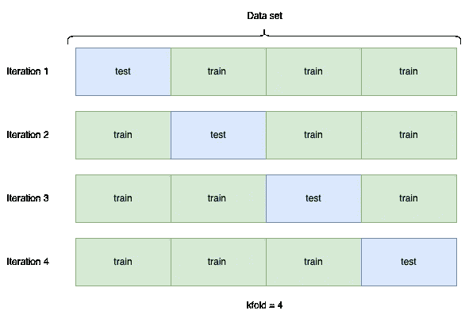
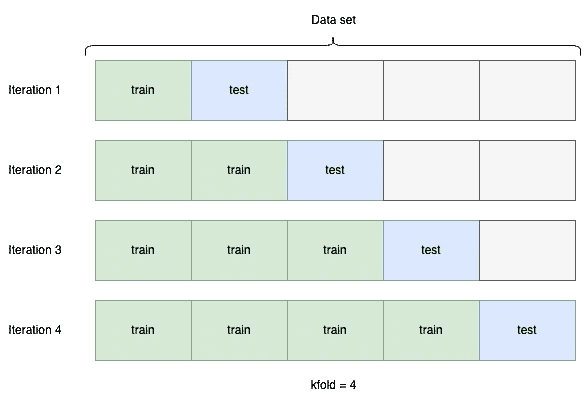
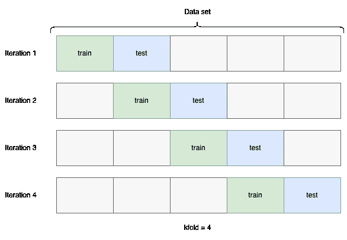
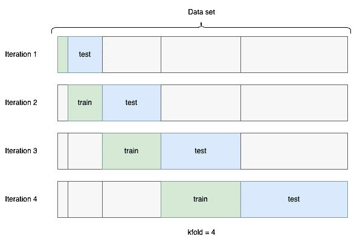
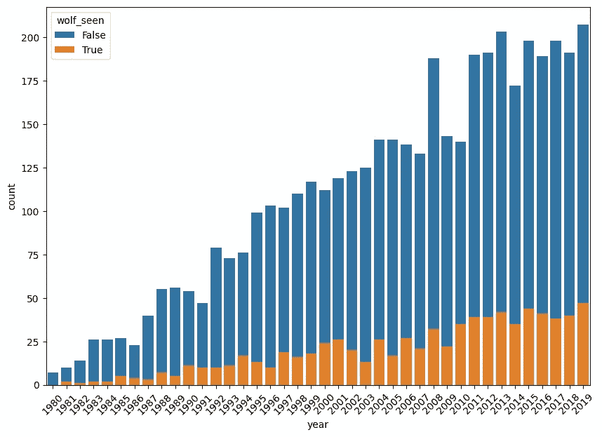
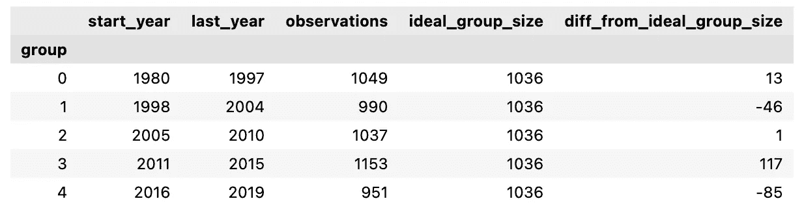
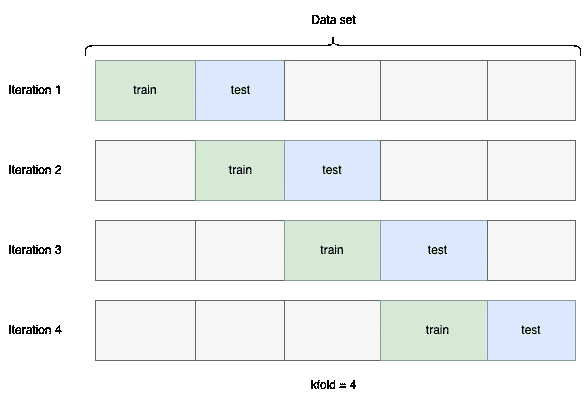

# 备受期待的时间序列交叉验证器终于来了

> 原文：<https://towardsdatascience.com/a-highly-anticipated-time-series-cross-validator-is-finally-here-7dc99f672736>

## 不均匀分布的时间序列数据不再是交叉验证的问题

由 [Unsplash](https://unsplash.com?utm_source=medium&utm_medium=referral) 上的[Max bhme](https://unsplash.com/@max_thehuman?utm_source=medium&utm_medium=referral)拍摄的照片

交叉验证是训练机器学习模型的数据科学家经常使用的方法。探究使用交叉验证的原因超出了本文的范围，但是可以找到许多关于它的好文章，例如[这篇文章](/cross-validation-430d9a5fee22)。

下面是用`kfold=4`进行简单交叉验证划分的图示。

[作者插图]

在时间序列问题中，我们不能使用这种标准的交叉验证划分。在大多数时间序列问题中，您希望训练数据在测试数据之前，否则，您将使用未来数据来预测过去。因此，为每次迭代划分训练和测试折叠的常用技术如下:

[作者插图]

Scikit-learn 的`TimeSeriesSplit`正在拆分数据，如上图所示。

你可能已经注意到，现在数据被分成了五份，而不是四份，尽管 *kfold* 仍然是四份。这是因为我们不能使用第一个折叠作为测试折叠，因为在它之前没有火车折叠。然而，这里出现了更多。训练数据的大小随着每次迭代而增加。这并不总是理想的，因为在时间序列问题中，您可能希望您的模型只学习根据最近的数据进行预测。因此，我们也可以选择创建这样的折叠:

[作者插图]

这接近于 sktime 的 T2 所做的。

到目前为止还不错，但是如果你的数据集不包含均匀分布的数据呢？

Scikit-learn 的`TimeSeriesSplit` 和 sktime 的`SlidingWindowSplitter` 都没有对此进行调整。你可能会像这样结束分裂:

[作者插图]

到目前为止，您必须编写自己的交叉验证器来解决时间序列问题中数据分布不均匀的问题，这不是一件小事。随着 [Scikit-lego](https://scikit-lego.netlify.app/) 发布`GroupTimeSeriesSplit`，我们终于可以利用开源代码来实现这一点了！

让我们通过一个例子来说明时间序列数据分布不均匀的问题以及`GroupTimeSeriesSplit`如何缓解这个问题:

# 狼的崛起

照片由[雷·轩尼诗](https://unsplash.com/@rayhennessy?utm_source=medium&utm_medium=referral)在 [Unsplash](https://unsplash.com?utm_source=medium&utm_medium=referral) 拍摄

狼在欧洲又开始抬头了。它正从东欧稳步蔓延到整个欧洲大陆。让我们考虑下面的假设情况:

1980 年，一个组织开始联系公园管理员，打电话问他们那天是否在公园里看到了狼。他们记录每年公布的数据。随着技术的进步，该组织开始使用更现代的技术来联系更多的公园管理员，从短信到 2010 年以来完全开发的应用程序。因此，他们收集的数据量会随着时间的推移而增加。此外，随着狼在欧洲的扩张，看到狼的机会也在增加。

这为我们提供了以下[数据集](https://github.com/sTomerG/GroupTimeSeriesSplit/blob/main/wolf_train.csv):

[作者提供的图表]

这个数据集跨越了 40 年。从 1980 年到 2019 年。假设我们想使用 kfold 与`k=4`交叉验证来训练一个模型，该模型可以预测公园管理员是否会在特定的一天看到狼。现在，我们不能简单地把 40 年分成 8 年的 5 倍，因为那会导致这些倍:

当每列火车或测试装置有 8 年时折叠。[作者插图]

除此之外，每个折叠都有非常不同的大小，我们总是有一个比训练集大得多的测试集，这对于训练和测试模型来说几乎从来都不是首选的。计算如何在每个折叠中划分年份以获得尽可能相等大小的折叠可能需要我们检查所有选项(所谓的*蛮力*方法)。对于 40 年和 5 个折叠(当`kfold=4`时是必要的)已经有 658.008 种不同的可能性来在折叠上划分年份，同时保持时间顺序。不同组合的金额可以用 *n 计算！/(n-r)！(r)！*其中 *n* =组数量(在本例中为唯一年份数量)，而 *r* =折叠数量。

[Scikit-Lego’s](https://scikit-lego.netlify.app/index.html)s`GroupTimeSeriesSplit`正在使用一个智能版本的*蛮力，*它可以避免检查所有可能的选项。在这种特殊情况下，`GroupTimeSeriesSplit`没有检查 658.008 个组合，而是只检查 20.349 个组合(减少了近 97%！)同时仍然得出与检查所有 658.008 个组合时相同的最佳答案。

下面你可以看到如何用 Scikit-learn 的`GridSearchCV`使用`GroupTimeSeriesSplit`进行网格搜索:

[作者要点]

`GroupTimeSeriesSplit`对褶皱的划分如下:

[图片由作者提供]

图形看起来是这样的:

使用 sklego 的 GroupTimeSeriesSplit 后折叠。[作者插图]

数据现在几乎是均匀分布的，或者说，实际上是尽可能均匀分布的，限制条件是在训练集和测试集中没有相同的年份。因此，我们现在终于可以在组大小不均匀的时间序列问题中使用滑动窗口了。

# 结论

Scitkit-learn 和 sktime 有很好的交叉验证器来解决时间序列问题。然而，当每单位时间的观察数量波动很大时，你可能会以非常不平衡的训练和测试折叠结束。随着 scikit-lego 发布`GroupTimeSeriesSplit`，我们现在有了一个针对这些情况的开箱即用的交叉验证器。

本文使用的数据和代码可以在[这里](https://github.com/)找到。

点击这里查看我关于数据科学、机器学习和 Python [的其他文章，或者关注我以获得更多关于这些主题的文章！](https://medium.com/@tomergabay)