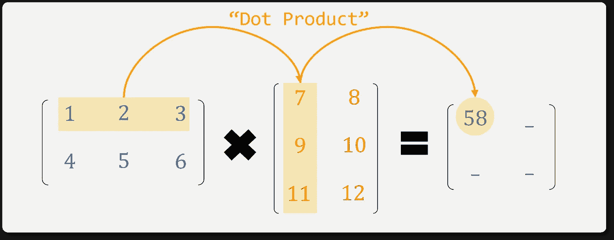
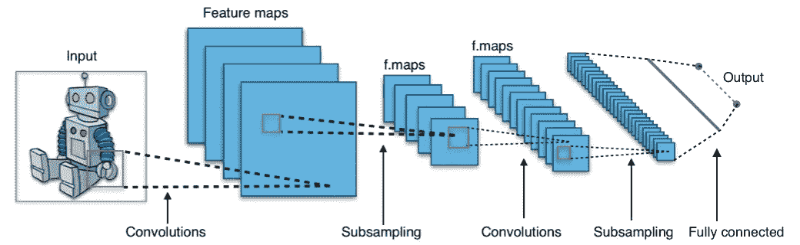
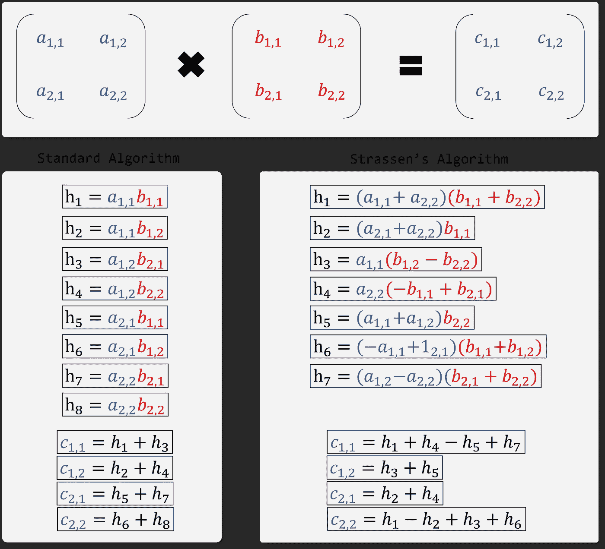
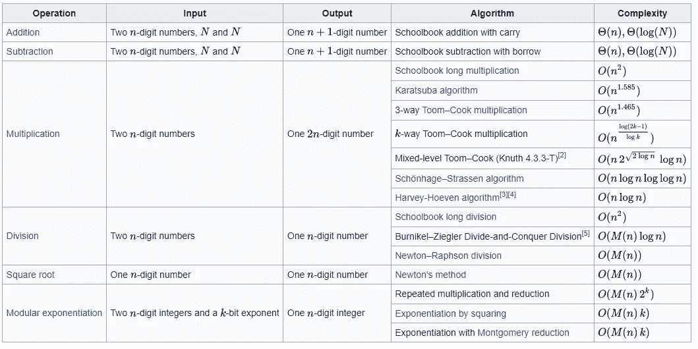
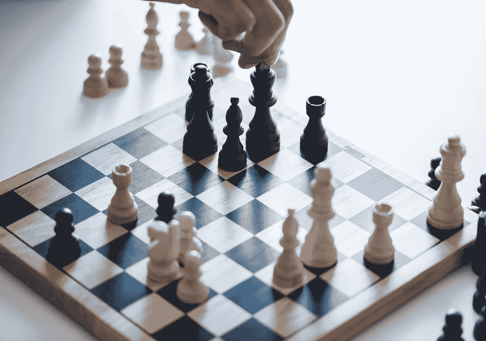
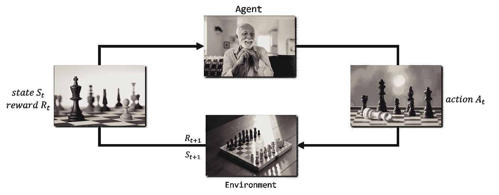
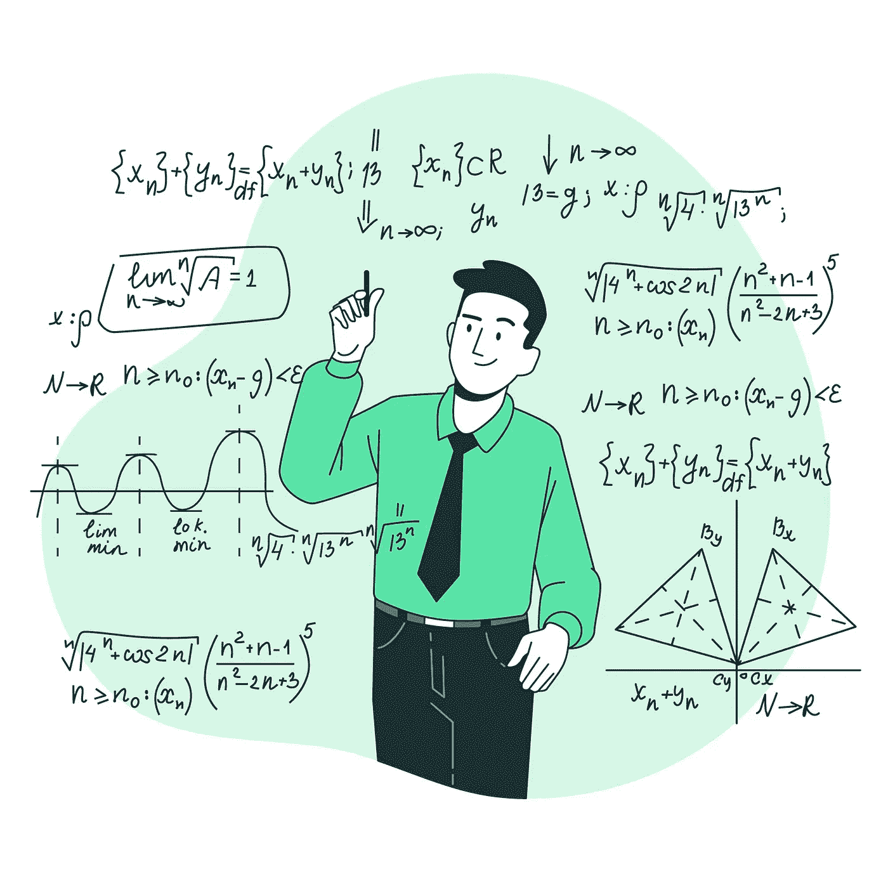
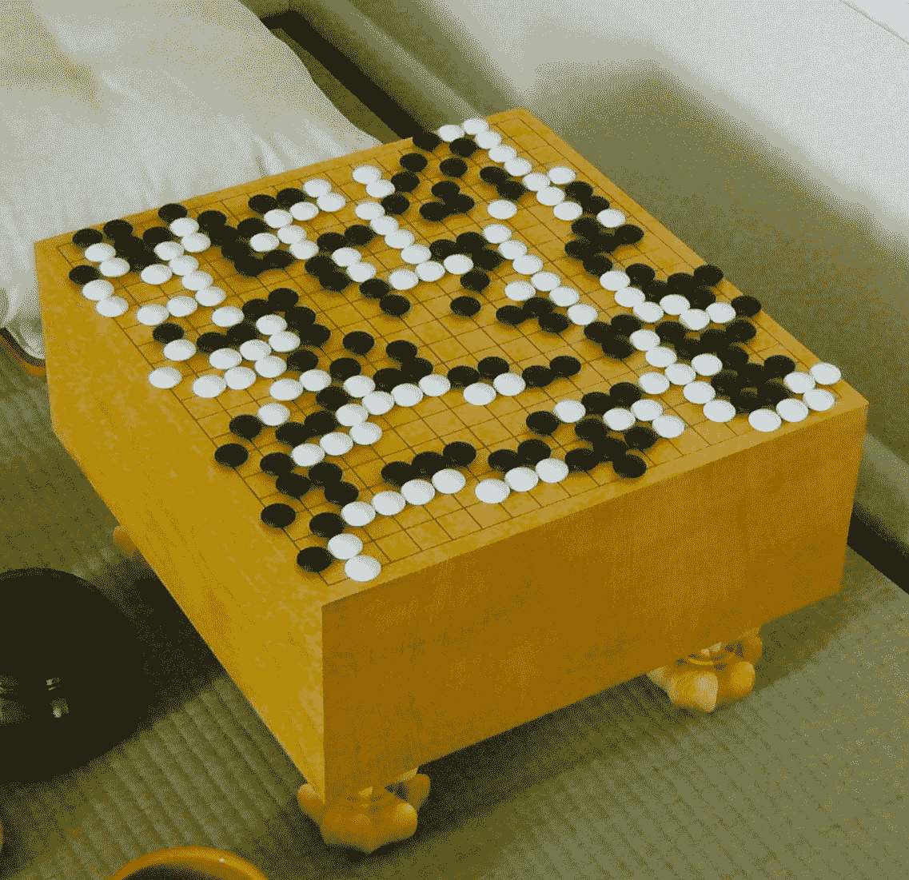
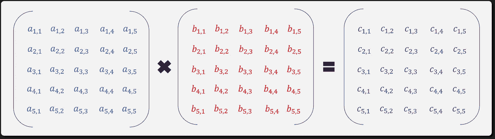

# 人工智能数学家？DeepMind 的 AlphaTensor 的简化视图

> 原文：<https://towardsdatascience.com/a-i-mathematician-a-simplified-look-at-deepminds-alphatensor-feeeac90c9f3>

## 谷歌 DeepMind 的 AlphaTensor 是 AI 驱动的数学创新的开始。

[图像来源](https://www.freepik.com/free-vector/scientific-formulas-chalkboard_7458753.htm#query=math&position=13&from_view=search&track=sph)

谷歌的 DeepMind 研究小组最近开发了“AlphaTensor”。第一个人工智能系统，用于发现执行矩阵乘法等基本任务的新算法。这一应用为 50 年来寻找两个矩阵相乘的最快方法的数学挑战带来了创新。我们来分解一下这个发现的意义。

# 什么是矩阵乘法？

我们大多数人第一次接触矩阵乘法是在初中或高中。它由一系列按预定义顺序的乘法和加法组成，用于计算两个 n 次张量的乘积。两个矩阵相乘最著名的机制是使用行和列的点积(图 1)。

图一。矩阵点积—(图片由作者提供)

在 K-12 教育之外，这种数学运算影响了现代计算，并且是数字系统的基石。几乎任何可以标记或编码成数字的多维表示的数据类型都需要一些矩阵乘法。图像处理和计算机视觉应用极大地受益于高效的矩阵运算。

图二。卷积神经网络运算— [来源](https://en.wikipedia.org/wiki/Convolutional_neural_network)

在卷积神经网络中(图 2)，离散卷积相当于在滤波器权重和滤波器下的值之间取点积，简而言之，这是另一种矩阵乘法应用。

数百年来，数学家们认为标准点积是矩阵相乘的最佳和最有效的方法。直到 Colker Strassen 介绍了 Strassen 的算法(图 3)，并通过证明存在更有效的算法而震惊了世界。Strassen 的算法比传统方法少用了一个标量乘法。

图 3。与 Strassen 算法相比的标准算法，Strassen 算法使用少一个标量乘法(7 而不是 8)来乘以 2x2 矩阵。对于整体效率来说，乘法比加法重要得多。(图片由作者提供)

尽管 Strassen 的算法包含更少的算术运算，但必须考虑到，对于当前一代的 CPU，乘法器可以在每个机器周期产生一个结果，但加法器也可以。乘法器需要更多的门和更长的等待时间来获得第一个结果，但它们在吞吐量方面的速度相同。乘法比加法具有更高的“大 O”复杂度(图 4)。总之，Strassen 效率更高，因为他少执行了一个乘法步骤。

图 4。数学运算的计算复杂度— [来源](https://en.wikipedia.org/wiki/Computational_complexity_of_mathematical_operations#Arithmetic_functions)

AlphaTensor 进一步利用人工智能技术，通过自我游戏和强化学习进行优化，发现新的矩阵乘法算法。

# 什么是深度强化学习？

深度强化学习(Deep RL)利用深度神经网络的能力来优化特定问题的解决方案。我们采用代理人、环境和报酬的概念作为现实世界系统的模型，其目标是代理人在特定环境中最大化其报酬。

图 5。棋盘— [图片来源](https://www.freepik.com/free-photo/chess-game-business-strategy-concept_2753717.htm#query=chess&position=0&from_view=search&track=sph)

假设您考虑国际象棋游戏(图 5)，其中的目标是捕获对手的棋子并将死他们的国王。在这种情况下，棋盘上每一个可能的场景都有一套最佳的走法，可以最大化成功的几率。对于这种情况，RL 模式可以定义如下:

*   代理人就是棋手。
*   环境就是棋盘和所有的棋子。
*   奖励框架:
    —靠近对方棋盘一侧加 2 分
    —俘获一个棋子加 5 分
    —俘获一个骑士或主教加 10 分
    —俘获一个女王加 50 分
    —失去任何棋子减 10 分
    —失去你的女王减 50 分

我们会对每一步给予适当的奖励，直到任何一个玩家被对弈或者出现和棋(图 6)。这个过程将反复执行，直到我们的模型分数始终高到足以满足我们的需求。

图 6。强化学习培训周期—来自 Microsoft Powerpoint 2022 的个别图片(图片由作者提供)

AlphaTensor 做了一些非常类似的事情，以发现数学运算的最佳组合，从而以一种新颖有效的方式执行矩阵乘法。

# AlphaTensor 如何实现算法发现的自动化？

利用自我游戏的概念，DeepMind 的团队建立了他们的强化学习模式，用于优化矩阵乘法问题。

[图像来源](https://www.freepik.com/free-vector/mathematics-concept-illustration_10733824.htm#query=mathematics&position=24&from_view=search&track=sph)

正如他们在[的论文](https://www.nature.com/articles/s41586-022-05172-4)中所描述的，他们的模式看起来像这样:

*   AlphaTensor 代理在不了解现有矩阵乘法算法的情况下启动，并负责编译一组操作，以最小化矩阵乘法的正确值与其结果之间的误差。
*   环境是被操作的矩阵的实际定义。在这种情况下，DeepMind 使用 3D 张量。
*   奖励被定义为新算法结果中的误差测量值和使张量归零所采取的步骤数的组合(处理所涉及的矩阵的所有分量)。

这种模式产生了一个搜索空间，其中可能的算法大大超过了宇宙中的原子。作为参考，DeepMind 多年前解决的围棋(图 7)游戏中每一步可能的走法比 AlphaTensor 遇到的复杂度少 30 个数量级。

图 7。围棋棋盘游戏— [图片来源](https://en.wikipedia.org/wiki/Go_(game))

为了增加这一努力的可行性，AlphaTensor 采用了“一种新的神经网络架构，它结合了特定问题的归纳偏差、生成有用合成数据的程序以及利用问题对称性的方法。”

随着时间的推移，DeepMind 团队观察到 AlphaTensor 重新发现 Strassen 等可行算法的能力有所提高，并最终超过人类定义的方法，以比任何探索都更快的速度支持算法。

在使用 Strassen 算法和 AlphaTensor 对 5x5 和 5x5(图 8)矩阵进行乘法运算的测试中，我们发现 AlphaTensor 可以在 76 次乘法中完成运算，而 Strassen 的乘法是 80 次！

图 8。5x5 矩阵乘法示例(图片由作者提供)

# 为什么这是一件大事？

AlphaTensor 帮助揭示了矩阵乘法算法的丰富性。这些知识无疑将塑造多维数据处理速度和效率的未来。

AlphaTensor 还证明了机器学习技术可以用来发现超越人类创造力的数学创新。这种深度强化学习的味道还处于早期，AlphaTensor 的工作更多地是作为可行性的证明，而不是立即的解决方案。这是计算优化和自优化 AGI 向前迈出的激动人心的一步。

DeepMind 的 GitHub 包括 AlphaTensor 发现的一些算法和一个 jupyter 笔记本，上面有加载和测试这些算法的说明。我在下面的源代码中链接了它。

***别忘了关注*** [***我的简介更多文章***](https://eduand-alvarez.medium.com/) ***这样！***

**来源:**

*   *用 AlphaTensor 发现新颖算法|*[*https://www . deep mind . com/blog/discovery-novel-algorithms-with-alpha tensor*](https://www.deepmind.com/blog/discovering-novel-algorithms-with-alphatensor)
*   *数学运算的计算复杂度|*[*https://en . Wikipedia . org/wiki/Computational _ complexity _ of _ mathematic _ operations #算术 _functions*](https://en.wikipedia.org/wiki/Computational_complexity_of_mathematical_operations#Arithmetic_functions)
*   *alpha tensor GitHub |*[*https://github.com/deepmind/alphatensor*](https://github.com/deepmind/alphatensor)
*   *利用强化学习发现更快的矩阵乘法算法| Fawzi，a .等.|*[*https://www.nature.com/articles/s41586-022-05172-4*](https://www.nature.com/articles/s41586-022-05172-4)