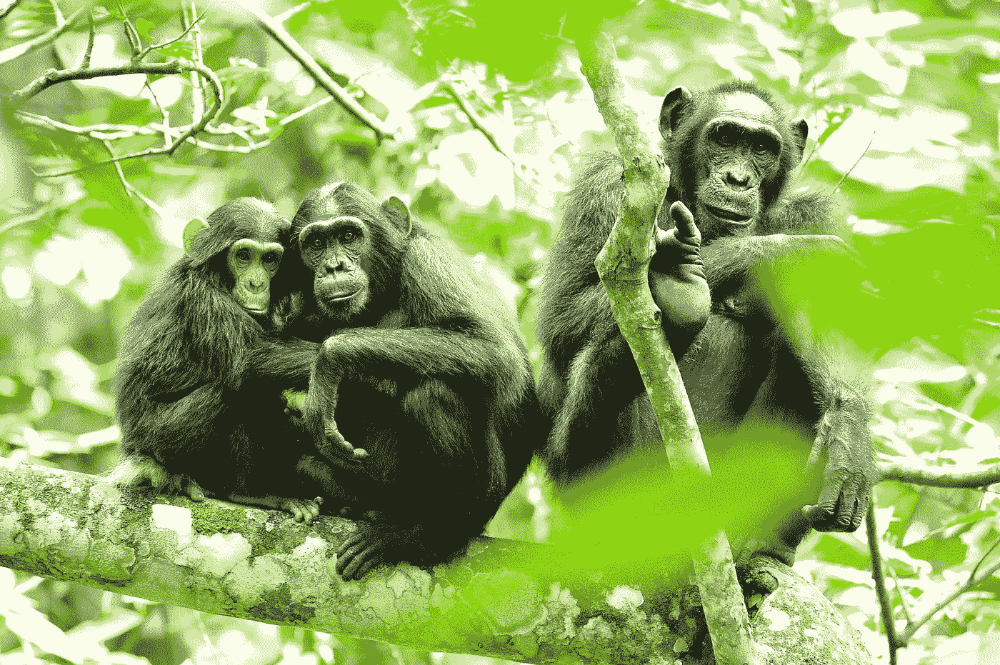
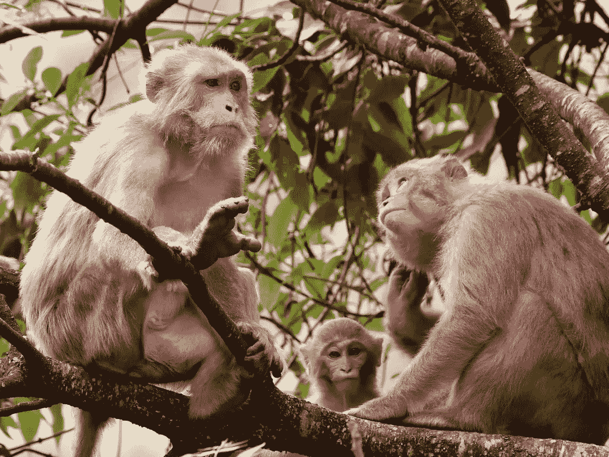
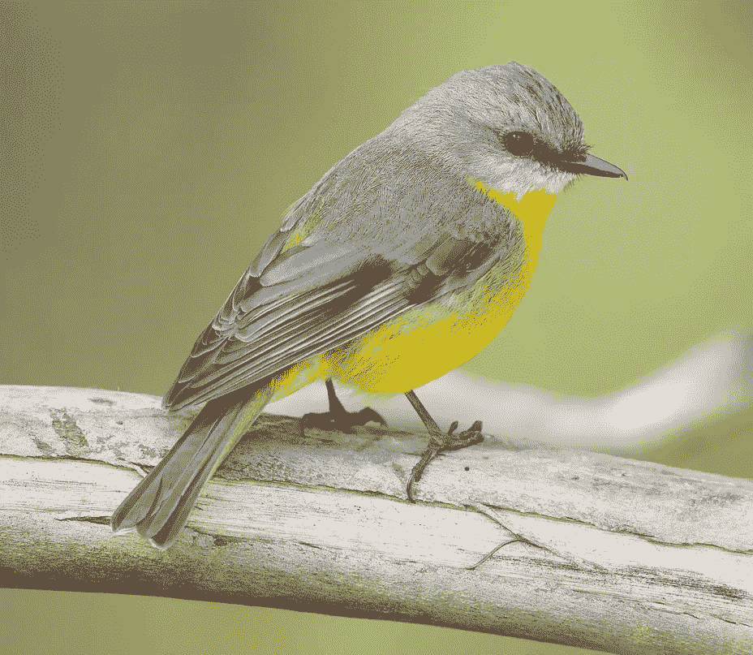
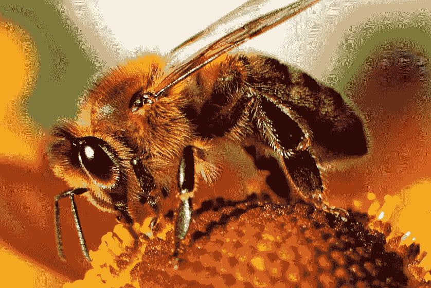
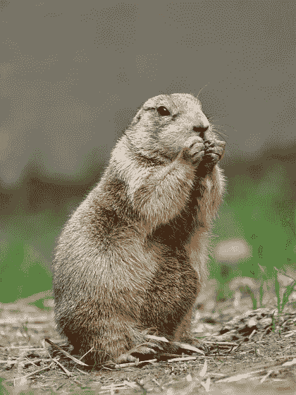
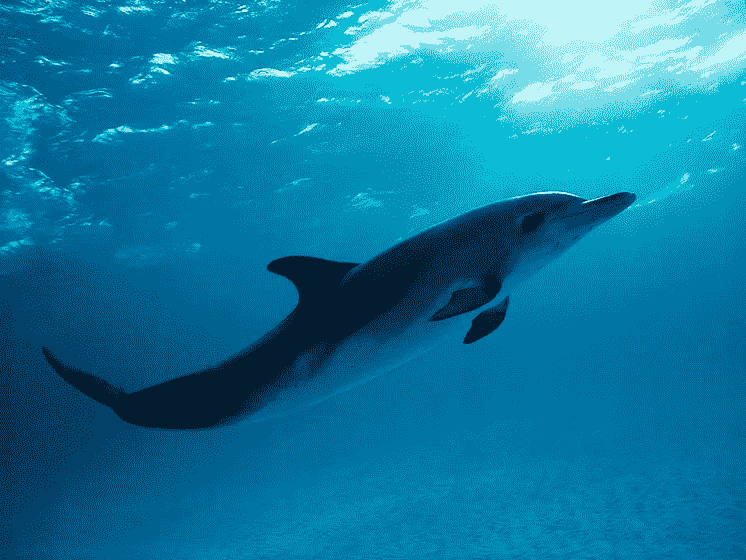
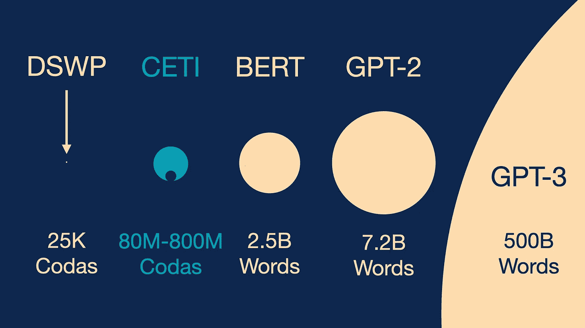

# 人工智能和动物交谈

> 原文：<https://towardsdatascience.com/a-i-talks-with-animals-3f0a266acc79>

## 机器学习算法能窃听动物语言吗？

像这些在乌干达的黑猩猩，可以学习理解人类的语言，就像理解人类的 2-year-old⁹.一样[照片](https://commons.wikimedia.org/wiki/File:Chimpanzees_in_Uganda_(5984913059).jpg)由[美国国际开发署非洲局](https://www.flickr.com/people/57424551@N06)拍摄

被圈养的黑猩猩理解英语的能力和一个 2 岁的人类一样，并且使用人类手语 languages⁵.海豚共同协调他们的行动，打开集装箱⁴和履行新的 tricks⁹.一只鹦鹉能可靠地报告⁰.物品的数量或颜色土拨鼠发出警报，一个穿着白色衣服的高大人类正在快速靠近！

动物会使用语言吗？如果是这样，我们能用人工智能和他们交流吗？

# 人类语言

人类使用语言交流。动物也可以通过视觉和语言交流各种话题，从哪里可以找到食物，到交配的欲望，或者危险的警告。

但是人类语言不仅仅是交流。人类语言有效地组合了一系列独立的、几乎任意的声音单位，每个单位都有各自固定的含义，共同传达新奇的信息。语言可以描述当下、遥远的时间或空间，甚至是假设的事物，而复杂的规则支配着我们组合这些单位的方式。单词分为几类:名词、动词、介词。一些类别，比如动词，需要其他词来充当从属的语义角色:动词 *give* 需要几个参数:给予者、给予物和接受者。你不能说**莎拉给了约翰*，否则听者会问“*莎拉给了什么*”

但也许人类语言最与众不同的方面是它使用递归结构来编码意义。在"看见了开爆了轮胎的卡车的男人的女孩已经走了"中，每个" that "引入一个有助于整个句子的意思的递归子句。

人类语言使用递归来表达意思。在这里，“女孩”、“男人”和“卡车”都是由嵌套的、递归的从属从句修饰的。作者图解。

人工智能讲座涵盖了人类试图教会人工系统使用语言进行交流的内容。理解人类语言和动物交流系统之间的微妙差异和惊人的相似之处，可以帮助我们专注于人工语言系统到底需要完成什么。

# 动物交流

乍一看，与人类语言相比，大多数动物的交流似乎过于简单，但实际上，各种动物几乎具备了语言的所有特性！

许多动物都有一套带有固定含义的离散发声法。举个例子，

*   一只地位较低的恒河猴在面对社会群体中地位较高的成员时会发出“嘈杂的尖叫声”，而地位较高的成员会发出“拱形尖叫声”——一种独立的截然不同的声音。
*   许多鸣禽会发出高音调的纯音“seet”叫声，警告捕食者正在靠近，还会发出另一种更刺耳的“mobbing”叫声，召集附近的鸟类向捕食者聚拢。

动物可以交流非即时发生的事件。蜜蜂跳舞是为了告诉蜂巢的其他成员在远处哪里可以找到食物。草原土拨鼠的报警声已经被证明是对人类正在靠近的信息进行编码，这个人在过去的某个时候开过枪。当被要求一起表演一个新奇的戏法时，被训练的海豚会发出不同的指令“表演一个新奇的杂技戏法”和“和另一只海豚表演一个戏法”，以某种方式协调它们未来的动作来表演 so⁹！

恒河猴、鸣禽(如这只黄知更鸟)、蜜蜂、草原犬鼠和海豚在交流中都表现出人类语言的一些特征。图片鸣谢:**左上**[恒河猴](https://en.wikipedia.org/wiki/File:Rhesus_macaque_monkey_family_D72_16866k.jpg)作者:[蒂莫西·贡萨尔维斯](https://commons.wikimedia.org/wiki/User:Tagooty)，**右上** ) [黄知更鸟](https://en.wikipedia.org/wiki/File:Eopsaltria_australis_-_Mogo_Campground.jpg)作者:[JJ·哈里逊](https://www.jjharrison.com.au/)，**左下** ) [蜜蜂](https://en.wikipedia.org/wiki/File:Bee-apis.jpg)作者:马切伊泽夫斯基，**中下** ) [草原土拨鼠](https://en.wikipedia.org/wiki/File:Black-Tailed_Prairie_Dog.jpg)作者:

动物产生的某些信号的物理形式肯定会影响这些信号的含义。例如，鸣禽的警告“seet”可能是高且纯音的，因为更难定位高音调声音的来源。但是动物用来交流的许多信号都有任意的含义。Con Slobodchikoff 已经证明，土拨鼠通过以特定但任意的方式调制它们短促的鸣叫报警声的频率来编码大量的信息。

一些动物，如斯洛博奇科夫的草原土拨鼠，似乎能够富有成效地描述新颖的想法。在一次实验中，Slobodchikoff 使用晾衣绳滑轮系统将真人大小的胶合板剪切件发送到草原犬鼠群体的中间。一个剪影是郊狼的轮廓，而另一个是同样大小的抽象椭圆形。每一个侧影都引起草原土拨鼠不同的叫声。郊狼切口收到的叫声类似于土拨鼠对真正的郊狼发出的叫声，但作为对椭圆形的回应，土拨鼠发出了一种全新的叫声。同样，当一只名叫瓦肖的年轻圈养黑猩猩不知道她便盆椅的标志时，她有效地组合了一系列她知道的新颖标志:**脏**和**好** ⁵.

更深入到人类语言领域，黑猩猩和海豚已经被证明至少理解有限形式的语义论元结构。一只名为 Ally 的圈养黑猩猩理解介词短语，如“毯子上的牙刷”,它需要两个参数:一个项目和该项目的位置。在对他的理解能力的正式测试中，尽管极度活跃的黑猩猩个性经常导致他在完成任务前失去兴趣，但 Ally 在 60%的时间里都会将正确的项目放在正确的目标上😬。

在另一组实验中，研究人员还使用两种非常不同的命令结构，向两只圈养海豚 Ake 和 Phoenix 教授介词短语。阿克学会了一种基于手势的语言，而菲尼克斯则被给予口头命令；与此同时，就像不同的人类语言使用不同的词序一样，菲尼克斯被给予“objectA on objectB”形式的命令，而阿克的指令则是“objectA objectB on”。即使命令的形式不同，Ake 和 Phoenix 将物体放置在其他物体上的正确率都高于 time⁶—的 60%,远远高于随机猜测的 4%!

在人类语言所有被提出的属性中，唯一没有在动物交流系统中被最终证明的是递归结构。即使在这里，人们仍在争论一些鸣禽是否使用递归语法将不同含义的叫声结合在一起。

那么，由于与人类语言有许多相似之处，动物交流系统有资格成为成熟的语言吗？

# 动物语言？

人类和动物用时尚来表示许多东西，而不借助语言。作者和他的女儿穿着典型的服装。在其他事物中，人类的着装标志着年龄、性别、交配状态和社会阶层。作者照片。(**右**一只孔雀灿烂的皇冠显示了他的性健康。[图片](https://commons.wikimedia.org/wiki/File:Pavo_Real_Venezolano.jpg)由 [Wilfredor](https://commons.wikimedia.org/wiki/User:Wilfredor) 拍摄

人类和动物都使用非语言的交流系统来指挥交通。(**左**)作者照片。(**右** ) [图片](https://en.wikipedia.org/wiki/File:Dog_marking_his_spot.jpg)作者[迪安·比勒](https://www.flickr.com/people/70379677@N00)。

包括 Slobodchikoff 在内的一些科学家将动物交流称为“动物语言”，正是因为正如人类使用语言进行交流一样，动物的口头和手势信号是动物交流的方式。如果人类的语言是从我们遥远祖先的交流系统进化而来的，那么动物的交流难道不应该被视为语言吗？如果我们系统地将人类语言与动物交流分开，我们就有可能在我们崇高的人类和我们所在的自然世界之间设置一道屏障。毕竟，动物的交流系统在它们的环境中为它们服务，就像人类的语言在我们的环境中为我们服务一样。仅仅因为动物可能不会像我们一样交流，就把它们驱逐出语言俱乐部，这似乎非常不公平。

但是动物和人类都使用明显不是语言的交流系统。路标使用非任意符号传达信息，这些符号指示周围环境的各个方面，但很少能以任何可理解的方式组合。动物也不借助语言来标记领域和路径。人类和动物都用外表来表示年龄、性别和社会地位。但是我们的时尚宣言并不遵循自然语言的语法规则。

# 我们能和动物说话吗？

抹香鲸的大脑是所有动物中最大的，它们使用被称为尾音的短促咔哒声进行交流。加布里埃尔·巴拉蒂乌拍摄的照片。

然而，虽然目前没有压倒性的证据表明任何动物的交流系统表现出人类语言的所有特征，但这并不保证我们可能还没有发现这样的系统！这就是为什么我对目前的项目如此兴奋，这些项目使用人工智能和机器学习的技术来分析和破译地球上最聪明和最大大脑的非人类物种——鲸鱼的发声。

由伦敦帝国理工学院的迈克尔·布朗斯坦领导的 CETI 项目正在分析抹香鲸用于远距离交流的卡嗒声，而由野生海豚项目的研究主任丹尼斯·赫津和佐治亚理工学院的萨德·斯塔默领导的另一个小组正在分析 dolphins⁷.发出的声音这两个小组使用的技术都直接来自现代自然语言处理。具体来说，他们使用深度神经网络来建立动物发声的语言模型。

语言模型是一个计算系统，给定一个序列的前几个项目，预测接下来会发生什么。在过去几年中，大预算科技公司已经训练了巨大的神经网络来预测英语(或其他自然语言)句子的下一个单词。而 10 年前，最好的语言模型甚至不能生成一个连贯的句子；现在，像 GPT-3⁴这样的深度语言模型可以生成完整的段落，这些段落基本上是连在一起的。

要将深度语言模型应用于鲸鱼发声，必须克服许多挑战:如何找到鲸鱼对应的单词？如何扩大鲸鱼发声记录的数量？目前成功的深度学习算法是在比我们目前拥有的抹香鲸记录数量多几个数量级的数据上训练的。

CETI 的目标是收集抹香鲸尾音的语料库，其规模接近最近流行的深度语言模型，如 BERT 和 GPT-2，训练的语料库规模。虽然与用于建造 GPT 3 号的数据相比相形见绌，但 CETI 本身将使目前存在的最大的抹香鲸标本 DSWP 相形见绌。作者图片，灵感来自[布朗斯坦(2020](https://www.youtube.com/watch?v=6B8Fg2kZrxA&ab_channel=SimonsInstitute) )

但也许最大的挑战将是，即使我们能够建立一个鲸鱼发声的语言模型，该模型可能产生的输出，虽然对抹香鲸来说听起来自然而正确，但对我们人类来说只是另一个难以理解的点击序列！

艾米丽·本德和亚历山大·柯勒最近发表的一篇论文认为，像 GPT-3 这样只在文本上训练的现代语言模型天生无法将它们产生的单词与现实世界中的物体和实体联系起来。这些模型既不“理解”输入文本也不“理解”输出文本。它们只是产生人类能够理解的点击序列！

为了解决这个问题，将音频记录与关于环境的上下文信息联系起来是至关重要的。例如，在他对草原土拨鼠的研究中，康·斯洛博奇科夫仔细记录了每只草原土拨鼠发出警报时哪个捕食者正在靠近。

我个人希望这些挑战能够被克服。我们发现鲸鱼确实能用成熟的语言交流。鲸鱼已经清楚地操纵和利用它们的环境，通过以复杂的甚至是递归的方式组合任意的符号来交流意义。我希望我们不仅能发现对鲸鱼发声的正确反应，还能用人类理解的语言来解释这种发声。

就我个人而言，我期待着有一天我们能与鲸鱼进行有意义的对话——当人工智能说话的时候！

这个帖子也有视频！

# 文献学

约翰·博尔胡伊斯、加布里埃尔·贝克尔斯、马里努斯·胡布雷格茨、罗伯特·贝里克、马丁·埃弗雷特。2018.鸣禽发声中有意义的句法结构？PLoS Biol 16(6): e2005157。[https://doi.org/10.1371/journal.pbio.2005157](https://doi.org/10.1371/journal.pbio.2005157)

艾米莉·本德和亚历山大·柯勒。2020.向 NLU 攀登:论数据时代的意义、形式和理解。计算语言学协会第 58 届年会会议录。https://aclanthology.org/2020.acl-main.463.pdf

迈克尔·布朗斯坦。2020.CETI 项目下一步:工业规模的鲸鱼生物声学数据收集和分析。非人类物种解码交流研讨会。https://www.youtube.com/watch?v=6B8Fg2kZrxA&ab _ channel = SimonsInstitute

tom 布朗、本杰明·曼、尼克·赖德、梅勒妮·苏比亚、贾里德·卡普兰、普拉富拉·达里瓦尔、阿尔温德·尼拉坎坦、普拉纳夫·希亚姆、吉里什·萨斯特里、阿曼达·阿斯克尔、桑迪尼·阿加瓦尔、阿里尔·赫伯特-沃斯、格雷琴·克鲁格、汤姆·海尼汉、雷文·蔡尔德、阿迪蒂亚·拉梅什、丹尼尔·齐格勒、杰弗里·吴、克莱门斯·温特、克里斯托弗·黑塞、马克·陈、埃里克·西格勒、马特乌斯·利特温、斯科特·格雷、本杰明·切斯、杰克·克拉克、克里斯托弗·伯纳、萨姆·麦卡德里什 2020.语言模型是一次性学习者。NeurIPS 2020。[https://papers.nips.cc/paper/2020/file/ 1457c0d6bfcb4967418bfb8ac142f64a-Paper.pdf](https://papers.nips.cc/paper/2020/file/1457c0d6bfcb4967418bfb8ac142f64a-Paper.pdf)

⁵roger·福茨。1997.近亲:我与黑猩猩的对话。纽约哈珀柯林斯。

⁶louis·赫尔曼。1986.宽吻海豚的认知和语言能力。海豚的认知和行为:比较方法，221–252。

⁷denise·赫尔津。2017.破解海豚通讯密码。在谷歌的演讲。https://www.youtube.com/watch?v=Mfb6zoB_yII&ab _ channel = talksat Google

⁸edward·卡科。1999.三种受过语言训练的动物系统中的句法成分。动物学习与行为，27 (1)，1–14。

⁹Nova 科学新闻。2011.海豚有多聪明？第五季第四集。[https://www . PBS . org/video/nova-science now-how-smart-are-dolphins/](https://www.pbs.org/video/nova-sciencenow-how-smart-are-dolphins/)

⁰irene·m·佩珀堡。2002.寻找所罗门王的戒指:灰鹦鹉的认知和交际研究。大脑、行为和进化，59(1–2)，54–67。

E.苏·萨凡格-伦堡、珍妮·墨菲、罗斯·塞夫奇克、卡伦·布雷克、雪莉·威廉斯和杜安·伦堡。1993.猿和儿童的语言理解，儿童发展研究学会专论，58(第 3-4 号)。

Con Slobodchikoff。2012.追逐杜立德医生:学习动物的语言。纽约圣马丁出版社。

铃木，大卫·惠特克罗夫特，迈克尔·格里斯。2018.鸟类的叫声组合和合成句法的进化。PLoS Biol 16(8): e2006532。【https://doi.org/10.1371/journal.pbio.2006532 

⁴Yamamoto，柏木信行，大冢，酒井麻衣和友永正树。2019.宽吻海豚的合作:拉绳任务中的双向协调。PeerJ 7:e 7826[http://doi.org/10.7717/peerj.7826](http://doi.org/10.7717/peerj.7826)