# 深度强化学习之旅

> 原文：<https://towardsdatascience.com/a-journey-into-deep-reinforcement-learning-41b6ee5e860e>

## 深 Q 网解释

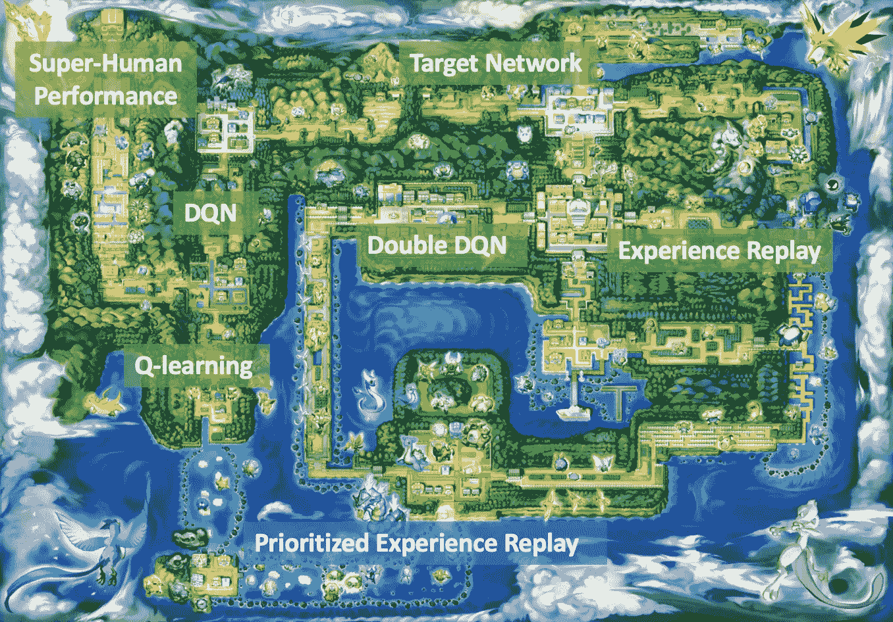

必须抓住所有的概念💫

**深度强化学习** (DRL)在过去几年里一直是人工智能领域的焦点。在游戏世界中，几个机器人(在本文的其余部分也称为代理人或模型)如围棋游戏的 [AlphaGo](https://www.youtube.com/watch?v=WXuK6gekU1Y) 或星际争霸的 [AlphaStar](https://www.deepmind.com/blog/alphastar-mastering-the-real-time-strategy-game-starcraft-ii) 和 Dota 视频游戏的 [Open AI Five](https://openai.com/blog/openai-five/) ，仅举几个著名的例子，它们表明，通过将**深度神经网络代表性力量**和**强化学习框架**巧妙结合，有可能主宰职业游戏玩家联盟。

DRL 不仅限于游戏，它还在更实际的问题上表现出强大的能力，如物流、生物、电子设计，甚至在聚变反应堆中指导等离子体操纵，这表明以前难以解决的问题可以由“超人”代理来解决。

知道了这一点，我非常好奇，想知道这样的结果是如何得到的。一如既往，从学科的最底层开始帮助我掌握了基本概念，并在挖掘更复杂的架构之前建立了对 DRL 的理解。因此，这篇帖子的目的是专注于理论，并解释 DRL 基金会算法之一的**深度 Q-网络** (DQN)的一些主要概念，以了解深度学习&强化学习(RL)如何联合起来构建这样的超人代理。

在继续这篇文章之前，我假设读者已经熟悉 RL 的基本概念和词汇。如果没有，你可以先看看 RL 上的这个很棒的 [UCL 课程，或者看看你真实的介绍:](https://www.davidsilver.uk/teaching/)

 [## 强化学习扑克牌

### 概念和 Python 代码🐍

towardsdatascience.com](/playing-cards-with-reinforcement-learning-1-3-c2dbabcf1df0) 

👾 🎮**太空入侵者** (S-I)是一款来自著名的雅达利 2600 主机的视频游戏(图 1)。这款视频游戏被广泛用于 DRL 模型的基准测试。在《星际迷航》中，你驾驶一艘小飞船，在外星人摧毁你之前，你必须通过射击摧毁尽可能多的外星人飞船。我们将使用 S-I 游戏作为一个玩具环境来说明我们在这篇文章中涉及的 RL 概念。

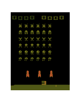

**图一**。扮演太空入侵者的随机特工

正如我们已经提到的，球员经纪人将由 DRL 砖块制成。它将通过**观看游戏的原始图像**和**从所有可能的动作中选择一个动作做出相应的反应**来直接学习玩 S-I(就像人类会做的那样)。

为了理解代理背后的 DRL 砖块，我们剖析了 DeepMind 的三篇主要论文(按出版时间顺序排列如下)，它们是许多现代 DRL 方法的核心:

*   [**玩雅达利用深度强化学习**](https://arxiv.org/abs/1312.5602) **(一)**
*   [**深度强化学习与双 Q 学习**](https://arxiv.org/pdf/1509.06461.pdf) **(二)**
*   ****(三)****

**让我们从直接查看狮穴开始我们的旅程(下面的算法 1👇).**

**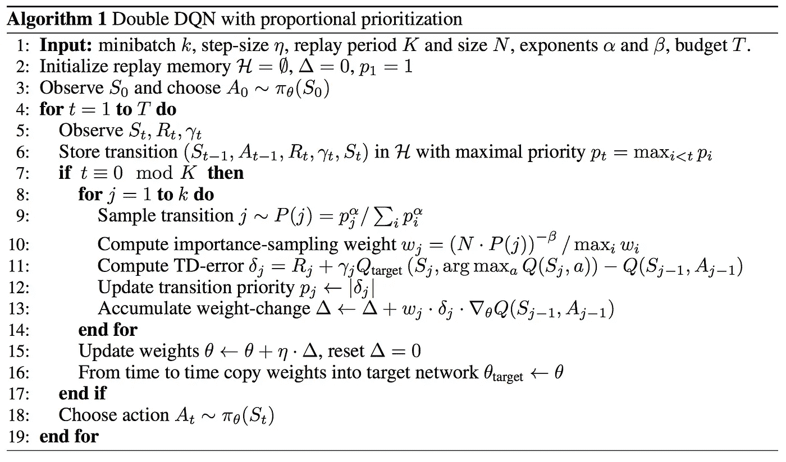**

****算法 1** 。下面我们来解开那些**伪代码** **步骤****

**天啊😱！乍一看，这看起来很可怕…但是不要担心，我们将一行一行地检查它，并解开每个概念。**

# **⛰️ Q 学习**

**首先，在深度 **Q** 网络中我们有一个 **Q** 。并且，在一开始[萨顿&巴尔托](https://web.stanford.edu/class/psych209/Readings/SuttonBartoIPRLBook2ndEd.pdf)创造了 **Q 函数**。Q 函数(也称为状态-动作值函数)将几个<状态、动作>映射到一个值(或预期回报)。**

**简单地说，Q 函数告诉你，在你所处的特定状态下，你想采取的行动有多好。下面的图 2 用 S-I 环境中的一个具体例子说明了这个定义。**

**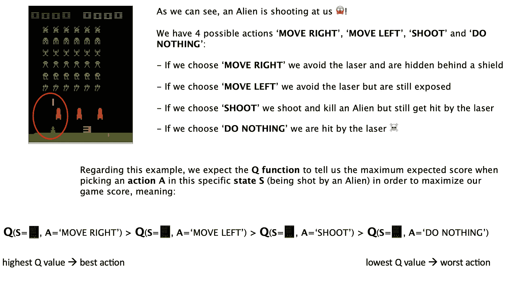**

****图二**。S-I 中给定情况下 4 种潜在行动的 4 Q 函数输出图**

**一旦与环境相关的 Q 函数已知，代理总是可以选择导致最大期望回报的行动，因此在该环境中遵循所谓的**最优策略**。正是对最优策略的了解，使得智能体达到了超人的性能。**

**S-I 博弈类似于一个[马尔可夫决策过程](https://en.wikipedia.org/wiki/Markov_decision_process) (MDP)环境。RL 研究人员提出了在这种环境下寻找最优策略的几种方法。在 DQN 代理中， **Q 学习**方法用于寻找最佳 Q 函数。因此，让我们深入研究一下这种方法背后的数学原理，分解将我们引向算法 1 核心部分的不同步骤。**

**根据定义，Q 函数方程已经被[贝尔曼](https://en.wikipedia.org/wiki/Bellman_equation)提出为一个递归(动态规划)问题:**

**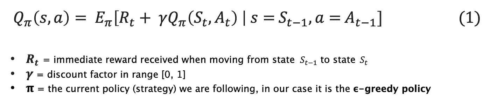**

****Eq 1** 。定义 Q 函数的贝尔曼方程**

**贝尔曼方程表明，处于状态*的动作*的 Q 函数可以分解成两部分:****

*   ****一份立即的奖励****
*   ****一个贴现的**未来的**预期报酬****

****通过将期望函数发展为所有可能的下一个状态上的状态转移概率的加权平均值，以及遵循我们的当前策略在特定状态中选择任何可能动作的概率的加权平均值，可以在下面的等式(2)中导出第一个等式。****

****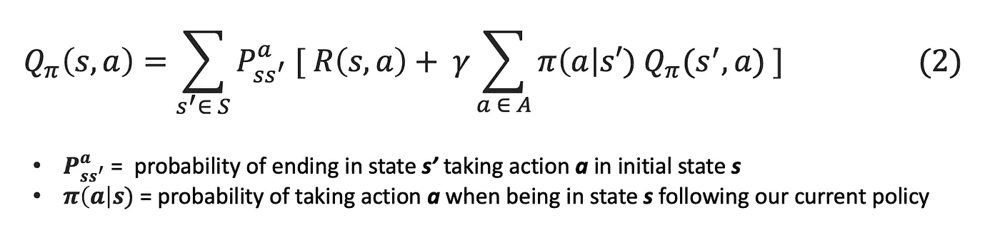****

******Eq 2。**Q 函数的扩展定义****

****实际上，我们的 S-I 环境可以看作是一个**确定性**环境。的确，按下左键时向左移动是肯定的。因此，它使我们能够摆脱状态转移的概率。****

****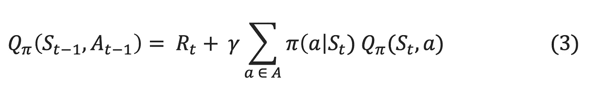****

******情商 3。**Q 函数的确定性方程****

****现在我们已经推导出了 Q 函数方程，让我们记住我们要寻找的是**最优** **Q 函数**(具有最高值)。这意味着我们不想再考虑所有可能的行动，而只考虑最大化预期回报的行动。一个自然的替代是查看最大预期回报，因此是下面的(4):****

****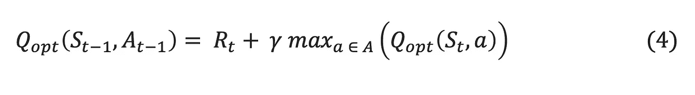****

******Eq 4。**最优 Q-函数方程****

****从数学上来说，最佳 Q 函数应该遵守(4)中的等式。****

****从理论上的最佳 Q-函数定义(4)，Q-learning 使用以下更新步骤推导出收敛到最佳 Q-函数的**估计值**的迭代算法:****

****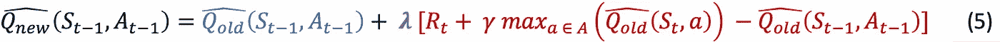****

******情商 5。****Q-学习步骤**。****

*   ****红色的[**TD-误差**](https://en.wikipedia.org/wiki/Temporal_difference_learning#:~:text=TD%20algorithm%20in%20neuroscience,-The%20TD%20algorithm&text=The%20error%20function%20reports%20back,the%20expected%20and%20actual%20reward.) :是两个时间上不同的估计值之间的差距。越接近 0，越接近最优，因此更新越小；越大越接近最优，因此更新越大。****
*   ****绿色部分显示的是**学习速率** **λ** ，表示我们希望更新多少旧的估计 Q 值。****
*   ****蓝色表示更新后的旧估计 Q 值。****

****用简单的英语总结最后一个等式(5): Q 学习迭代地朝着最优方向更新估计的 Q 值。在这个迭代过程结束时，它收敛到**最优 Q 函数**。****

# ****💧深度 Q 学习****

****你看到它来到这里(或者深度 Q 网络不够明确🙃).这确实是深度神经网络(DNN)的用途，以 [**通用函数逼近器**](https://en.wikipedia.org/wiki/Universal_approximation_theorem) **而闻名。**最重要的是，DNN 在处理图像等非结构化数据时特别有效(与更传统的 ML 方法相比)。请注意，在这篇文章的其余部分，我们交替使用 DQN 和 DNN 术语来指代代理的模型(假设 DQN 是一个 DNN)。****

****让我们记住，我们直接使用 S-I 视频游戏的图像流，让代理学习最优 Q 函数。所以问题如下:****

> ****为什么不用 DNN 作为 Q 函数的近似值呢？****

****让我们看看如何在 Q 函数近似任务中利用 DNN 的代表性力量。因为一张图片胜过千言万语，所以下面是(如图 3 所示👇2)DNN 如何处理 S-I 游戏图像以输出与可能的游戏动作相关的值(准确地说是 Q 值)的方法。****

****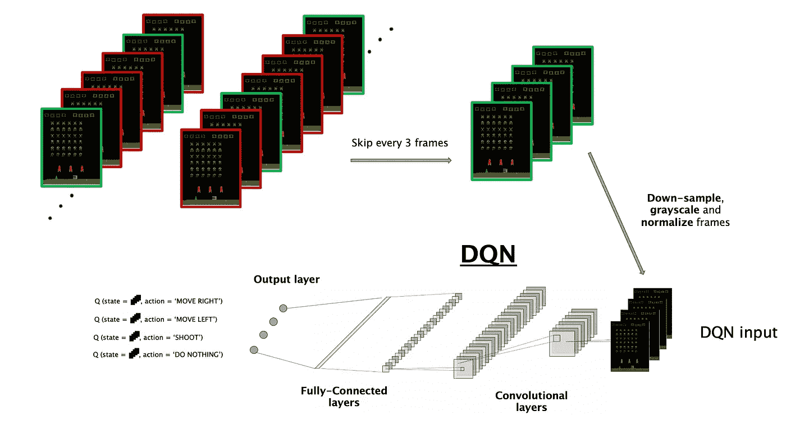****

******图 3** 。DQN 向前传球，从 S-I 真实游戏画面流中学习(详细图例如下)****

*   ******跳过帧**:非常接近的状态(或转换)不会携带太多信息，我们更喜欢探索更多不同的模式，而不是收集高度相关的转换，这将输出非常接近的 Q 值。此外，运行更少帧的游戏引擎比计算所有这些高度相关的转换的 Q 值更便宜。因此，使用这种技术可以运行更多不同的剧集。****
*   ******向下采样，灰度调整&归一化**:在 ML 中，为了减少从图像中学习所需的计算量，并保持像素表示在可比的尺度上，遵循这些预处理步骤是一种常见的做法。****
*   ******DQN 输入**:来自 S-I 的 4 帧作为 DNN 输入，它们被称为一个状态或转换。****
*   ******卷积层**:从原始图像中学习信息特征恰恰属于神经网络的范畴，更具体地说是控制计算机视觉领域的 c [卷积神经网络](http://cs231n.stanford.edu/) (CNN)。****
*   ******输出层**:DNN 的最后一层给出与每 4 个潜在动作相关的 4 个分数(分数越高，动作越好)。****

****这是如何处理图像的一个很好的可视化，但要让 DNN 学会最后一个要素是一个损失函数。这里没有什么特别的，所用的损失是一个自适应的均方误差(TD-MSE，见下面图 4 中的等式(6 )),它使用估计的最佳 Q 函数。最后，经典的[随机梯度下降](https://en.wikipedia.org/wiki/Stochastic_gradient_descent)被用于向等式(7)上的损失最小值更新 DNN 网络权重。****

****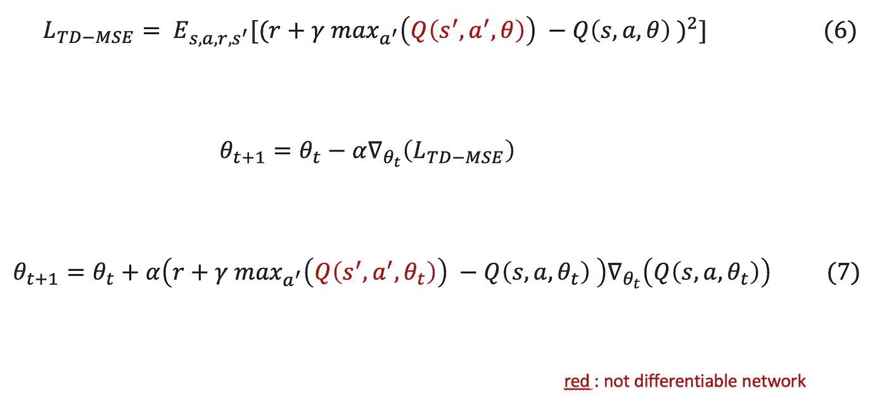****

******图 4** 。深度 Q 网络随机梯度下降步长****

****到目前为止一切顺利。现在让我们看看为什么在梯度下降更新步骤中区分损失时，红色参数(图 4 ⬆️上)保持冻结。****

# ****⚡在线与目标网络****

****如果我们正确理解了等式(6)，我们在损失中使用的目标/标签来自我们更新的同一模型。换句话说，模型正在从自己的预测中学习…这难道不像蛇咬尾巴一样奇怪吗？♾️****

****乍听起来确实很奇怪。但是如果我们想到它，它就像使用我们对估计的最优 Q 函数的最佳猜测(到目前为止)。并且假设 Q 学习迭代地收敛到最优 Q 函数，我们可以期望我们的噪声估计在开始时变得越来越一致，一次又一次迭代。
理论上，当且仅当模型在训练时给出越来越相关的目标时，这才会起作用**。******

****不幸的是，实际上它并不那么有效。事实上，在每个学习步骤中，模型的权重都会更新，这可能会导致两个相似状态的目标预测发生巨大变化，从而阻止 DNN 有效学习。
例如，对于两个连续的学习步骤，给定一个非常相似的输入状态，DNN 可能会选择不同的最优行动……这意味着我们的目标不一致。😢****

****这种不一致性被称为**移动目标**问题，导致学习不稳定。这就是使用 **2 网络**的想法的来源:****

*   ******在线网络**:每步更新的学习网络****
*   ******目标网络**:在线网络的副本，在几个步骤中保持冻结，以确保目标保持稳定****

****该在线/目标网络工作流在⬇️下面的图 5 中解释****

****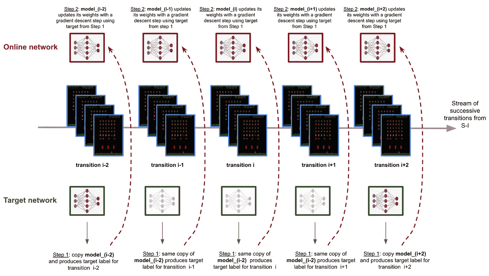****

******图 5** 。目标网络产生目标，而在线网络向它学习。在线网络的权重被不时地复制到目标网络。****

*   ******步骤 1** :目标网络产生给定过渡的目标****
*   ******步骤 2** :在线模型从目标网络产生的目标中学习****

****遵循在线/目标网络方法保证了 DNN 学习的稳定目标。****

****我们开始看到这一点，要将深度学习和强化学习结合起来，我们必须确保 DNN 有一个高效的学习机制。所以，让我们看看释放全部 DNN 能量所必需的其他工程技巧吧！💥****

# ****🍃双(深度)Q 学习****

****再一次，另一个障碍落在 DQN 学习和收敛的路上。****

****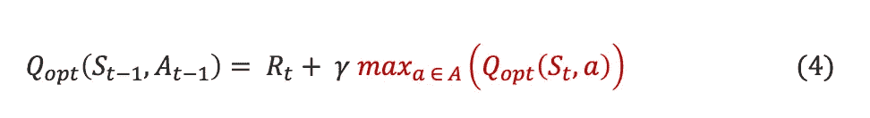****

******方程式(4)******

****回顾 Q-学习最优(上面的等式(4))，我们可以看到<state action="">对的 Q 值取决于下一状态的所有可能动作的**最大 Q 值**(等式(4)上的红色项)。这意味着，在 Q 学习中，所有可能动作的最大值是估计状态值的相关代理。</state>****

****如此确信最大值是对一个状态值的正确估计被认为是**偏向最大值**。这就是下图 6 中的玩具例子所展示的👇****

****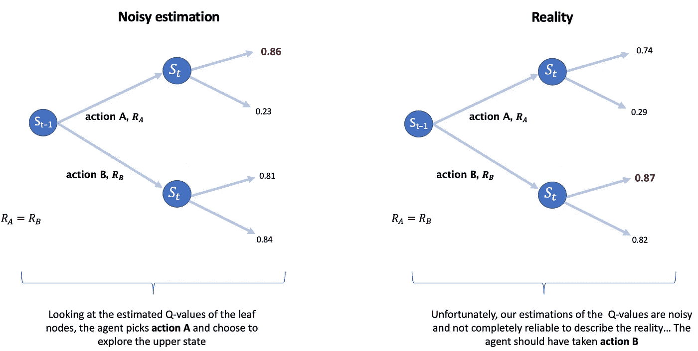****

******图六。**盲目相信**嘈杂的 Q 值估计，**与隐藏的现实不同，使智能体探索错误的方向:**选择动作 A** 而不是**动作 B** 。****

****简而言之，偏向最大值会使代理选择不感兴趣的动作并探索错误的方向，这可能会导致模型收敛更慢，并恶化其学习机制。****

> ******注意**:那些噪声估计**不是随机的**，因为它们来自单一模型，该模型总是高估给定相似状态的相同动作。否则就不会产生这种偏见。****

****[Hado van Hasselt](https://arxiv.org/abs/1509.06461) 纠正这种偏差的想法是并行使用 **2 个函数逼近器**(因此得名**双** Q-learning):****

*   ****一个用于给定状态下的**最大**动作选择****
*   ******另一个用于与所选最大动作相关的 Q 值计算******

******事实上，使用两个智能体给我们嘈杂的估计带来了渴望已久的随机性。让我解释一下🤓
两个模型不会高估给定相似状态的相同动作，因为它们被不同地训练，所以使用一个选择动作，另一个计算关联的<状态，选择的动作>值以随机方式混合两个模型的噪声，因此**去偏置值估计**。******

******为了避免有太多的网络和混淆整个培训架构(我们已经有了在线和目标网络😅！)，已经表明使用在线网络作为 Q 值计算机和目标网络作为最大动作选择器对于代理学习能力来说工作良好。******

# ******🌀体验回放******

******到目前为止，人们理所当然地认为 DQN 正在从一系列连续的转变中学习...我们再想想。******

******如果我们采取一系列连续的转变，大多数情况下，它们看起来是一样的。在 ML 中，我们可以说**连续转换是高度相关的**……向 DNN 输入相关输入会使 DNN 连续过度拟合少数相关样本，从而降低其学习速度。事实上，我们都知道改组数据集对模型收敛更好🙏******

******因此，**经验重放**程序(在下面的图 7 中解释)来解除输入到 DNN 的输入转换的相关性。******

******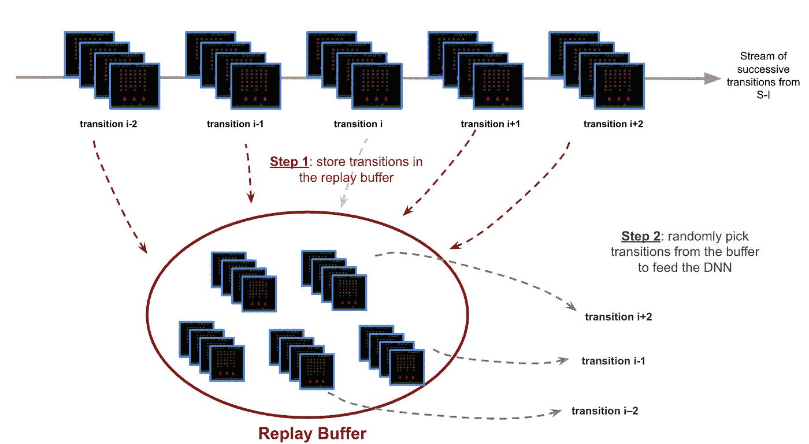******

********图 7。**不是直接从连续的过渡流中学习，而是将图像存储在一个缓冲区中，并从中随机采样以提供给代理。******

> ********注意**:重放记忆是一种真正的神经科学现象，发生在海马体(至少对啮齿动物来说是这样的*🐭*)。******

# ******🔥优先体验重放(PER)******

******对于这一个，一切都在名字里。事实上，不是从重放缓冲区统一采样，而是根据*对代理的*转换有多感兴趣，以**优先级**采样转换。简而言之，更多的*有趣的*跃迁被采样的概率更高。******

******一、*有趣的*对代理来说意味着什么？有时，对于某些转换，代理的表现要比其他的差得多。这意味着代理的 TD 误差对于这些转换来说更高。因此，PER 背后的想法是关注那些预测不佳的转换(也称为*有趣的*转换),以提高代理的学习。******

> ******永远针对你的弱点进行训练🦾#保护******

******下面的图 8 显示了如何计算转换的优先级分数。一旦一个转换被采样，它的 TD 误差(以及它的优先级分数)立即被学习代理更新。******

******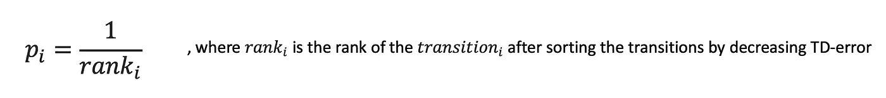******

********图 8。**优先级分数计算******

******然而，采样策略中的这种优先化也导致了对代理学习机制的干扰。事实上，一遍又一遍地重复具有高 TD 误差的转换使得代理由于缺乏多样性而过度适应那些预测不佳的例子。除此之外，优先化使输入跃迁分布偏离真实跃迁分布，因此引入了干扰 DNN 收敛的偏差。******

******但是不用担心，像往常一样一些聪明的咒语被发现来对付这些诅咒🧙‍♂️******

*   ********随机优先级**通过**平滑**原始优先级分数分布，允许对一些低 TD 误差的转换进行采样，从而避免了缺乏多样性的问题(参见下图 9)******

************

********图九。**α*越接近 1，采样优先级越高，越接近 0，越均匀。*******

*   ********重要性-采样**进入环中**重新权衡**在深度 Q 学习中代理的参数更新了多少，以补偿由优先采样引起的分布偏移。 *β* 越接近 1，补偿越多。******

******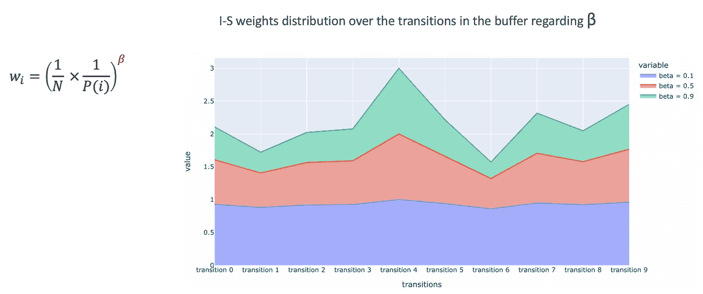******

********图 10。**给定一个特定的 *α(本例中α=0.5)，β补偿优先采样引入的偏差(当β → 1 时完全补偿)。*******

******能够在训练期间调整两个参数 *α* 和*β增强了代理的学习能力和其更快地收敛到最优策略*******

> ********NB** :重复优先级化采样和更新那些优先级具有线性复杂度 O(n)。然而，在 DRL，代理的学习必须探索大量的转换，因此这种线性采样的复杂性在整个训练过程中产生了瓶颈。因此，为了克服这一工程问题，一种特定的数据结构被用于优先化缓冲器: [**SumTree**](https://www.fcodelabs.com/2019/03/18/Sum-Tree-Introduction/#:~:text=What%20is%20a%20Sum%20Tree,the%20values%20of%20its%20children.) ，这将采样复杂度从 O(n)提高到 O(log(n))。******

# ******结论******

******干得好！我们已经完成了一件很好的工作，🥵.******

******现在我们有足够的徽章来理解 DQN 的初始算法 1。让我们快速回顾一下不同的关键思想，并将它们映射到算法 1 伪代码的行中:******

******⛰️ Q-learning:第 11 行
💧深度 q-learning:11 线、13 线& 15 线
⚡在线 vs 目标网:11 线& 16 线
🍃双(深度)Q 学习:第 11 行
🌀体验回放:第 6 行&第 9 行
🔥优先体验回放:6、9、10 线& 12******

******正如我们所见，需要无数数学/工程/计算**技巧**来成功混合强化学习框架和深度学习，以达到超人的性能。
DQN 可能是一个旧模型(2015 年在 ML 时间尺度上就像一个永恒)，但其核心概念是更复杂和最近的深度 RL 架构的构建块。******

******我希望这篇文章澄清了你可能有的一些疑问，并让你对深度学习和强化学习如何结合起来构建超人代理有更多的直觉和理解。******

******瞧啊！👌******

*******除特别注明外，所有图片均为作者所有*******

# ********参考文献********

********论文:**
- [玩雅达利用深度强化学习](https://arxiv.org/abs/1312.5602)论文来自 DeepMind
- [深度强化学习用双 Q 学习](https://arxiv.org/pdf/1509.06461.pdf)论文来自 DeepMind
- [优先化经验回放](https://arxiv.org/pdf/1511.05952.pdf)论文来自 DeepMind******

********博客&帖子:**
- [用深度强化学习打败雅达利！](https://becominghuman.ai/lets-build-an-atari-ai-part-1-dqn-df57e8ff3b26)来自 Adrien Ecoffet 的 great Deep RL 系列
- [让我们制作一个 DQN:双重学习和优先化经验回放](https://jaromiru.com/2016/11/07/lets-make-a-dqn-double-learning-and-prioritized-experience-replay/)来自 Jaromiru 在 Deep RL
上的非常好的博客——丹尼尔·晴太在 RL
上的[博客](https://danieltakeshi.github.io/archive.html)帖子——罗伯特·兰格在 DQN 的[博客](https://roberttlange.github.io/posts/2019/08/blog-post-5/)******

*******Au plus gentil des gars，我的朋友阿德里安。*******