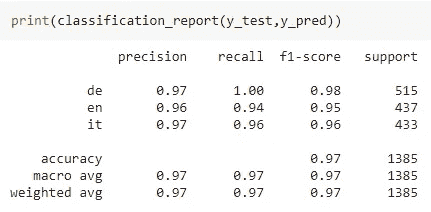

# 纯 Javascript 语言检测模型

> 原文：<https://towardsdatascience.com/a-language-detection-model-in-pure-javascript-b3296ad15e0>

## 如何创建不太耗费 CPU 的 Node.js 或客户端模型——同时仍然充分利用 Python 的库


*照片由* [*雷奥纳多大久保*](https://unsplash.com/@leookubo?utm_source=unsplash&utm_medium=referral&utm_content=creditCopyText) *上* [*下*](https://unsplash.com/s/photos/language?utm_source=unsplash&utm_medium=referral&utm_content=creditCopyText)

模型是在几个 web 应用程序中使用的非常强大的工具。一般的方法是通过使用 REST APIs 使它们可访问。在本文中，我将讨论一个可以用 Python 创建，然后用纯 Javascript 部署的模型。

# 为什么是 Javascript？

机器学习模型往往是用 Python 或者 R 创建的，那么为什么要用 Javascript 呢？因为 Javascript 在我们用户的浏览器上运行，所以用这种语言部署模型允许我们分散计算工作。使用 Javascript，我们将不再需要 REST APIs 来使用我们的模型，这是一件非常有用的事情，因为它简化了我们的应用程序的架构。如果我们仍然想让我们的模型在服务器端工作(例如，如果我们不想让用户访问它)，我们可以在 Node.js 上运行它，以便从 Javascript 的使用中受益。所以，这些就是使用 Javascript 部署模型的优势。

# 框架

那么，我们应该用 Javascript 创建我们的模型吗？这个想法是我们仍然需要 Python 来创建我们的模型，但是我们可以在以后把它翻译成 Javascript。这样，我们将受益于 Python 编程语言及其库的所有功能。然后，我们将只在 Javascript 中部署最终结果。

# 模型

在本文中，我将用 Python 创建一个简单的语言检测模型，然后用 Javascript 部署它，创建一个简单的 web 应用程序，在用户编写文本时检测文本的语言。我之前已经谈过使用朴素贝叶斯模型的语言检测模型。在本文中，我将使用相同的数据集，但使用不同的模型(逻辑回归)。

你可以在我的 [GitHub repo](https://github.com/gianlucamalato/machinelearning/blob/master/Language_detector_in_Javascript.ipynb) 上找到整个笔记本。

数据集是我的意大利短篇小说《L'isola del male》及其英译本。对于德语，我会用弗里德里希·尼采的《查拉图斯特拉如是说》。因此，这个模型中使用的语言是意大利语、英语和德语。

首先，让我们使用一个定制函数来清理数据集，该函数接受一个 txt 文件并返回一个句子列表。

```
def file2sentences(filename):
  txt = ""with open(filename,"r",encoding="utf-8") as f:
    txt = f.read()txt = txt.replace("?",".")
  txt = txt.replace("!",".")
  txt = txt.replace("»","")
  txt = txt.replace("«","")
  txt = txt.replace(":","")
  txt = txt.replace(";","")
  txt = txt.replace("...",".")
  txt = txt.replace("…",".")
  txt = txt.replace("\n",".")
  txt = txt.replace("  "," ")
  txt = txt.replace("“","")
  txt = txt.replace("„","")

  sentences = txt.split(".")for i in range(len(sentences)):
    sentences[i] = sentences[i].strip()sentences = [x for x in sentences if x != ""]return sentences
```

然后，让我们加载文件并贴上正确的标签。

```
italian = file2sentences("isola del male.txt")
english = file2sentences("island of evil.txt")
german = file2sentences("also sprach zarathustra.txt")
```

因此， *X* 包含句子， *y* 包含语言标签。

现在，我们可以将数据集分为训练和测试两部分。

```
X_train, X_test, y_train, y_test = train_test_split(X, y, test_size=0.33, random_state=42)
```

我最初的文章的核心是使用人物二元模型作为特征。对于这个例子，我将计算它们并创建一个二元特征，如果二元模型出现在句子中，它等于 1，如果没有，它等于 0。

```
cnt = CountVectorizer(analyzer = 'char',ngram_range=(2,2), binary=True) cnt.fit(X_train)
```

现在模型来了。对于这个例子，我将使用逻辑回归

```
model = LogisticRegression() model.fit(cnt.transform(X_train),y_train) 
y_pred = model.predict(cnt.transform(X_test))
```

让我们看看分类报告。



对于像我们这样的简单模型来说，结果是相当令人印象深刻的。高召回值告诉我们，该模型能够有效地检测语言。

现在，我们必须将这个 Python 模型翻译成 Javascript。

# 从 Python 到 Javascript 的模型转换

为了将 sklearn 模型翻译成 Javascript，我使用了 [m2cgen](https://github.com/BayesWitnesses/m2cgen) 库，它允许从 Python 到不同语言的这种转换。Javascript 就是其中之一。

我们先安装一下:

```
!pip install m2cgen
```

现在我们可以导入它了。

```
import m2cgen as m2c
```

为了转换我们的模型，我们必须增加递归极限。这是因为我们有 800 多种功能。

```
import sys 
sys.setrecursionlimit(10000)
```

最后，这里是我们模型的 Javascript 代码:

```
print(m2cgen.export_to_javascript(model))
```

该函数返回一个数组，其中包含每个类的分数。被选中的班级将是得分最高的班级。

现在我们必须实现预处理部分。我们必须首先将二元模型保存到一个 Javascript 数组中。姑且称之为*二元模型*。

```
cnt.get_feature_names_out()
```

我们现在必须根据这些二元模型创建二元变量。在 Javascript 中，我们可以使用这些代码来根据给定的模型选择语言。

```
languages = ['de', 'en', 'it'];function getLanguage(text) {
  vect = [];
  for (i = 0; i < bigrams.length; i++) {
    vect.push(text.toLowerCase().indexOf(bigrams[i]) > 0 ? 1 : 0);
  }
  scores = score(vect);
  return languages[scores.indexOf(Math.max(...scores))];
}
```

我们现在可以将一切嵌入到一个简单的 HTML 应用程序中。

# 最终应用

我们可以用 Bootstrap 构建一个简单的 web 页面来管理图形，用 JQuery 来更新一个语言检测字段，当用户写一些文本时，这个字段会自动更新检测到的语言。

下面是 JSFiddle 应用程序。只需点击“结果”标签，开始用 3 种语言输入一些句子。例如，意大利语为“questaèuna applicazione per riconoscere il linguaggio”，英语为“这是一个识别语言的应用程序”，德语为“Dies is eine Anwendung zur Spracherkennung”。

这是相当令人印象深刻的，即使因为不是所有这些句子的单词都在原始语料库中使用。

# 结论

在本文中，我展示了如何从 Python 强大的 sklearn 库开始，用 Javascript 实现一个简单的机器学习模型。例如，这个概念可以用来创建 Node.js 中的服务器端模型或不太耗费 CPU 的客户端模型。我们仍然受益于 Python 的库，但是我们现在能够将我们的模型翻译成客户端语言，这可以用于多种目的。

*原载于 2022 年 4 月 13 日*[*【https://www.yourdatateacher.com】*](https://www.yourdatateacher.com/2022/04/13/a-language-detection-model-in-pure-javascript/)*。*