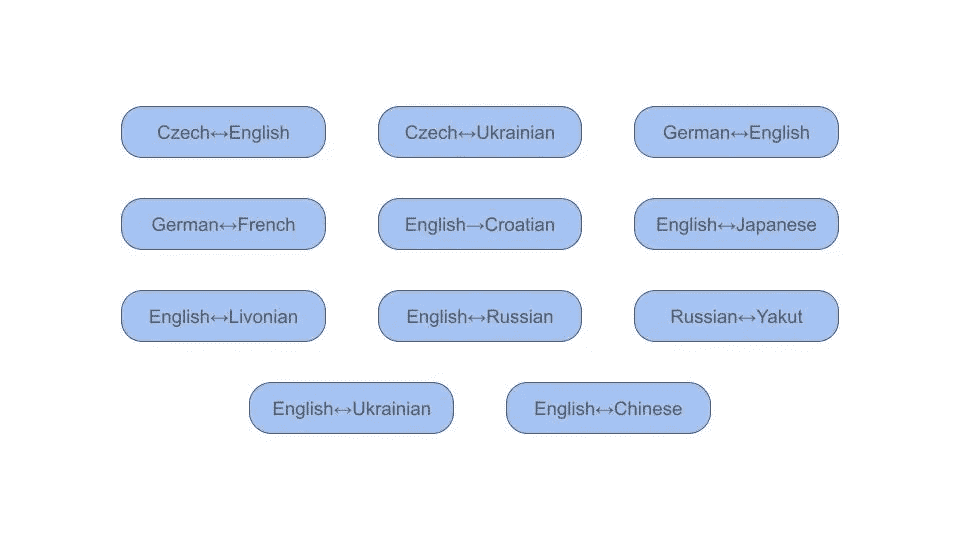
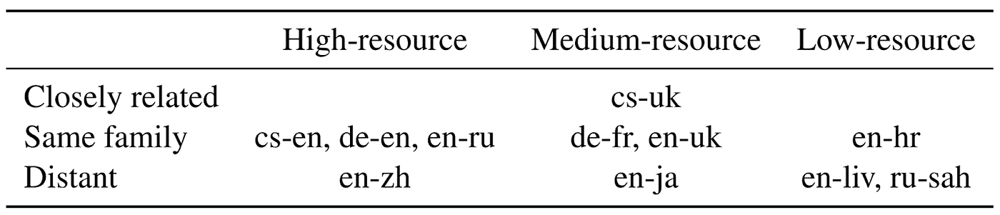
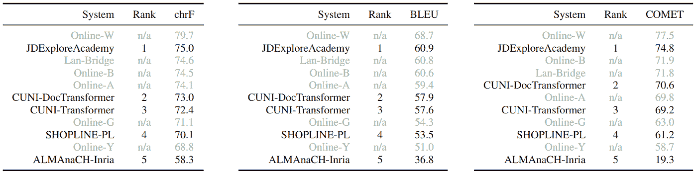
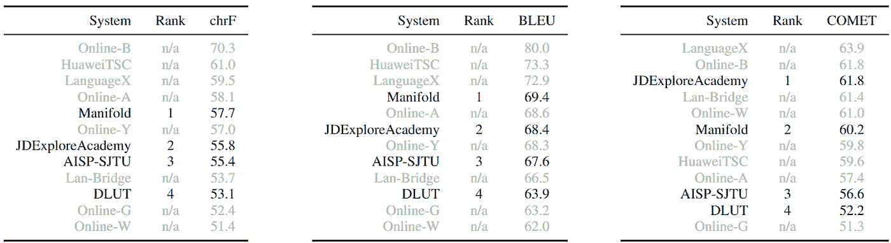
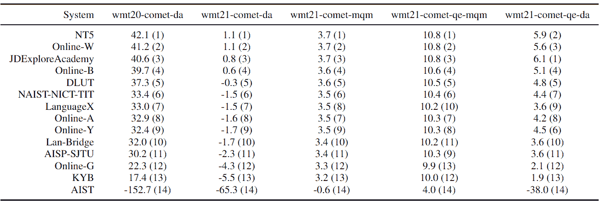
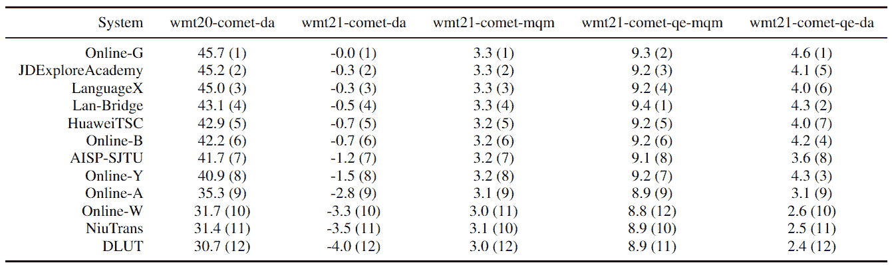

# 机器翻译的大规模自动评估

> 原文：<https://towardsdatascience.com/a-large-scale-automatic-evaluation-of-machine-translation-b700df93d4c0>

## 在 WMT22 的 21 个翻译方向上评估了 185 个系统



WMT22 语言对—作者图片

像 2006 年以来的每一年一样，机器翻译大会(WMT)组织了广泛的机器翻译共享任务。来自世界各地的众多参与者提交了他们的机器翻译(MT)成果，以展示他们在该领域的最新进展。WMT 通常被认为是观察和评估 MT 最新技术水平的参照事件。

2022 年的版本用一个“通用”翻译任务取代了原来的新闻翻译任务，涵盖了各个领域，包括新闻、社交、会话和电子商务等。仅这项任务就收到了主办方准备的 21 个翻译方向的 185 份投稿:Czech↔English (cs-en)、Czech↔Ukrainian (cs-uk)、German↔English (de-en)、French↔German (fr-de)、英语→克罗地亚语(en-hr)、English↔Japanese (en-ja)、English↔Livonian (en-liv)、English↔Russian (en-ru)、Russian↔Yakut (ru-sah)、英语≤乌克兰语(en-uk)、英语≤中文(en-zh)。这些翻译方向涵盖了广泛的场景。根据语言的相关性和可用于训练机器翻译系统的资源数量，组织者将它们分类如下:



图片由作者提供—数据来源:[https://statmt.org/wmt22/translation-task.html](https://statmt.org/wmt22/translation-task.html)

有了这种多种多样的语言对与多种多样的领域相结合，我们可以准确地描绘出机器翻译的现状。

在本文中，我报告了对 185 份提交材料的自动评估，包括组织者添加的在线系统。我的主要观察如下:

*   低资源远距离语言对的机器翻译仍然是一项极其困难的任务。
*   对于某些翻译方向(例如 de→fr)，提交的最佳输出与在线系统交付的翻译质量相差甚远。
*   在这项任务中，两个 MT 系统之间高于 0.9 的 BLEU 得分差异在统计上总是显著的。
*   对于几乎所有翻译方向的翻译质量评估，BLEU 与 COMET 的相关性很差，但作为诊断和分析工具仍然很有用。
*   绝对彗星分数毫无意义。

在这项研究中，我使用了由 WMT22 的组织者公开发布的参考译文和系统输出[，并且由于](https://github.com/wmt-conference/wmt22-news-systems/tree/main/txt)[Tom KOC mi](https://github.com/wmt-conference/wmt22-news-systems/blob/main/scores/automatic_scores_results.pdf)发布的初步报告，我可以交叉检查我的一些结果。

这不是 WMT22 的官方评价。WMT22 正在进行一项人体评估，该评估将在 2022 年 12 月 7 日至 8 日的会议上详细介绍，该会议与 2022 年 EMNLP 在阿布扎比共同举办。

请注意，这篇文章是我最近报告的一个更容易理解和更简短的版本，你可以在 arXiv: [上找到 WMT22 通用机器翻译任务的自动评估](https://arxiv.org/abs/2209.14172)。

## 使用指标进行评分和排名

在这次评估中，我使用了三种不同的自动指标:

chrF ( [波波维奇，2015](https://aclanthology.org/W15-3049.pdf) ):一种在字符级操作的独立于标记化的度量，与人类判断的相关性高于 BLEU。这是我通常推荐的评估翻译质量的标准，因为它计算起来非常便宜，可重复，并且适用于任何语言。

蓝色([帕皮尼尼等人，2002 年](https://aclanthology.org/P02-1040.pdf)):标准蓝色。

COMET ( [Rei 等人，2020](https://aclanthology.org/2020.emnlp-main.213.pdf) ):基于预训练语言模型的最先进的度量标准。我们使用默认模型“wmt20-comet-da”

请注意，在这个特定的研究中，chrF 和 BLEU 仅用于诊断目的，并用于回答这个问题:我们离达到特定的参考译文还有多远？我不会用它们来对翻译质量下结论。为此，我使用 COMET 对系统进行排序，以便更好地与人类评估相关联。

我根据分数对每个翻译方向的系统进行了排名，但我只对那些被作者声明为“受限”的系统进行了排名，即只使用组织者提供的数据的系统。在下表中，等级为“不适用”的系统是不受约束的系统。

使用两个参考翻译进行评估，我们获得了机器翻译研究文献中罕见的绝对 BLEU 分数，例如，JDExploreAcademy for cs→en 的 60.9 BLEU 分，如下所示:



图片由作者提供。

对于 en→zh，观察到甚至更高的 BLEU 分数，这是由于使用了更小的标记，这使得 4-gram 匹配成为更容易的任务:



图片由作者提供。

绝对 BLEU 分数并不能告诉我们翻译质量本身，即使分数超过 60 也不一定意味着翻译是好的，因为 BLEU 取决于许多参数。然而，BLEU 确实告诉我们，这些系统在参考译文中产生了大量的 4-gram。

虽然 chrF 和 BLEU 直接指示翻译与分数在 0 到 100 分之间的参考文献的匹配程度，但是 COMET 分数没有限制。例如，在极端情况下，对于 uk→cs，AMU 获得 104.9 个彗星点，而对于 liv→en，AIST 获得-152.7 个彗星点。实际上，我对这个幅度感到惊讶，并不得不在验证这些分数之前重新检查 COMET 是如何计算的(更多细节在下面的“关于 COMET 的说明”一节)。

对于 21 个语言对中的 11 个，COMET 找到了一个最佳系统，该系统不是 BLEU 和 chrF 找到的最佳系统。令人惊讶的是，对于某些翻译方向，受约束的系统优于不受约束的系统。按照彗星的说法，cs→uk，uk→cs，de→en，ja→en，en→ja 都是这种情况。对于其他一些方向，在线系统似乎要好得多。例如，对于 de→fr，Online-W 比最佳约束系统好 18.3 BLEU 点。

我从这些排名中得到的主要收获是，使用 WMT22 没有提供的数据是获得最佳系统的关键。当然这并不奇怪，但我希望参与者能够充分描述和分析他们的数据集，以更好地理解为什么它们如此重要。

## 统计显著性检验

现在我们已经有了每个系统的分数，我们想根据一些度量标准来衡量一个系统比另一个系统好的结论的可靠性。换句话说，我们想要测试系统的度量分数之间的差异在统计上是否显著。有几种工具和技术可以执行统计显著性测试。对于这个评估，我选择了最常用的:配对自举重采样，最初由 [Koehn (2004)](https://aclanthology.org/W04-3250.pdf) 提出。

第一个有趣的观察结果是，高于 0.9 点的 BLEU 差异(cs→uk)总是显著的，p 值< 0.05。鉴于我用于 p 值的相对较高且有争议的阈值，我发现 0.9 相当高，因为大多数 MT 研究论文会声称他们的系统在 BLEU 差异高于 0.5 时明显更好。

在 chrF 中，不显著的最大差异是 0.6 分(en→zh)，而对于 COMET 则达到 2.6 分(liv→en)。请注意，这将因 COMET 所用的模型而有很大差异。

这三个指标仅在 21 个翻译方向中的 5 个方向上一致认为系统明显优于所有其他系统:cs→en (Online-W)、fr→de (Online-W)、en→liv (TAL-SJTU)、sah→ru (Online-G)和 en→uk (Online-B)。

我从这个统计显著性测试中得到的主要收获是，它很有见地。这是机器翻译研究社区经常讨论的问题，但我真的认为这是一个必要的工具。对于众所周知的指标，如 BLEU，研究人员通常应用经验法则，例如，1.0 或以上的差异在统计上是显著的。这可能是正确的，尽管在测试之前没有科学可信度。尽管如此，我们不太了解的新指标呢？1.0 彗星点差异显著吗？显然，这取决于任务和 COMET 模型(正如我们将在下面看到的)。这就是为什么在宣称一个系统优于另一个系统之前，必须进行统计显著性测试。两个系统得分之间的差异幅度应该被认为是无意义的。

## 标准化影响

我还试验了标准化的翻译输出，以观察 BLEU 和 COMET 对标点符号和编码问题的变化是如何敏感的。它还可以突出显示系统是否依赖一些特殊的后处理来增加度量分数。为了标准化，我使用了以下顺序的[摩西手稿](https://github.com/moses-smt/mosesdecoder/tree/master/scripts):

```
tokenizer/replace-unicode-punctuation.perl | tokenizer/normalize-punctuation.perl -l <target_language> | /tokenizer/remove-non-printing-char.perl
```

不出所料，我发现 COMET 对这种规范化几乎不敏感。另一方面，它对 BLEU 分数有更强的影响，但是它可以从一个系统到另一个系统有很大的不同。比如 en→cs，对 JDExploreAcademy 没有影响，而 Online-Y 的分数下降了 1.4 BLEU 分。对于 de→fr，归一化将 Online-A 的 BLEU 分数增加了 4.9 分，并且变得比 Online-W 更好，对于 Online-W，归一化对 BLEU 没有影响。尽管如此，Online-W 仍然比 Online-A 好大约 10 个彗星点。

这里没有什么出乎意料的，但是提醒了我们为什么 BLEU 作为翻译质量的评估标准是非常不准确的。

## 彗星的奇特之处

BLEU 和 chrF 绝对分数可用于诊断目的并回答基本问题:对于给定的表征化，我们离参照有多近？系统有可能生成目标语言的文本吗？等等。COMET 不能，但是对于排名系统来说要可靠得多，正如前面的工作所展示的。

因为我观察到彗星得分之间的振幅很大，所以我用了几个彗星模型来观察它们之间的得分差异。

我可以观察到 wmt20-comet-da(默认模型)的分数实际上与所有其他模型都很不同。虽然具有 wmt20-comet-da 的系统获得的最高分数是 104.9 (uk→cs)，但是对于所有平移方向，使用其他 4 个模型获得的分数从未超过 15.9。更具体地说，对于 wmt21-comet-da，对于 ja→en，最佳系统得分为 1.1，如下表所示。



图片由作者提供。

更奇怪的是，对于 zh→en，wmt21-comet-da 分数对所有系统都是负的:



图片由作者提供。

有了 wmt21-comet-mqm，这些系统的分数四舍五入后看起来非常接近。

我的结论是，无论我们使用什么模型，绝对彗星分数都不能提供信息。负的 COMET 分数可以分配给优秀的机器翻译系统。

## 下一步是什么？

这个评价清楚地表明，有些翻译方向比其他方向更容易。然而，在运行所有这些实验后，我发现最有趣的是，我不知道这些系统有多好！BLEU 和 chrF 只会告诉我们离一个特定的参考译文有多近，但是给定所使用的标记化，绝对分数会有很大的不同。COMET 只对排名系统有用。据我所知，到 2022 年，我们仍然没有针对机器翻译的自动评估指标，即:

*   关于翻译质量的信息，即不仅对于排名系统是准确的；
*   这将产生跨不同设置(如域、语言对、标记化等)的可比较分数。

感谢 BLEU 和 chrF，我们可以观察到，对于一些翻译方向，如 cs→en 和 en→zh，我们的参考译文有些接近，但对于其他方向，如 en↔liv 和 ru↔sah.，我们的参考译文仍然很远另一方面，COMET 显示 WMT22 系统在 19 个翻译方向中只有 5 个明显优于在线系统(我省略了 en↔liv): cs→英国(AMU)、英国→cs (AMU)、de→en (JDExploreAcademy)、en→ja (JDExploreAcademy、NT5、LanguageX)和 en→zh (LanguageX)。

观察这些发现是否与 WMT22 进行的人类评估相关将是有趣的。

我只强调了我的评估的主要结果。在我提交给 arXiv 的文件中，还有更多，特别是试图将所有提交的系统结合起来。

## 感谢

我要感谢 WMT 会议组织者提供的译文，感谢 Tom Kocmi 提供的初步结果以及对我的 arXiv 报告初稿的深刻评论和建议。

如果你想支持这项工作，[请在 Medium](https://medium.com/@bnjmn_marie) 上跟随我。