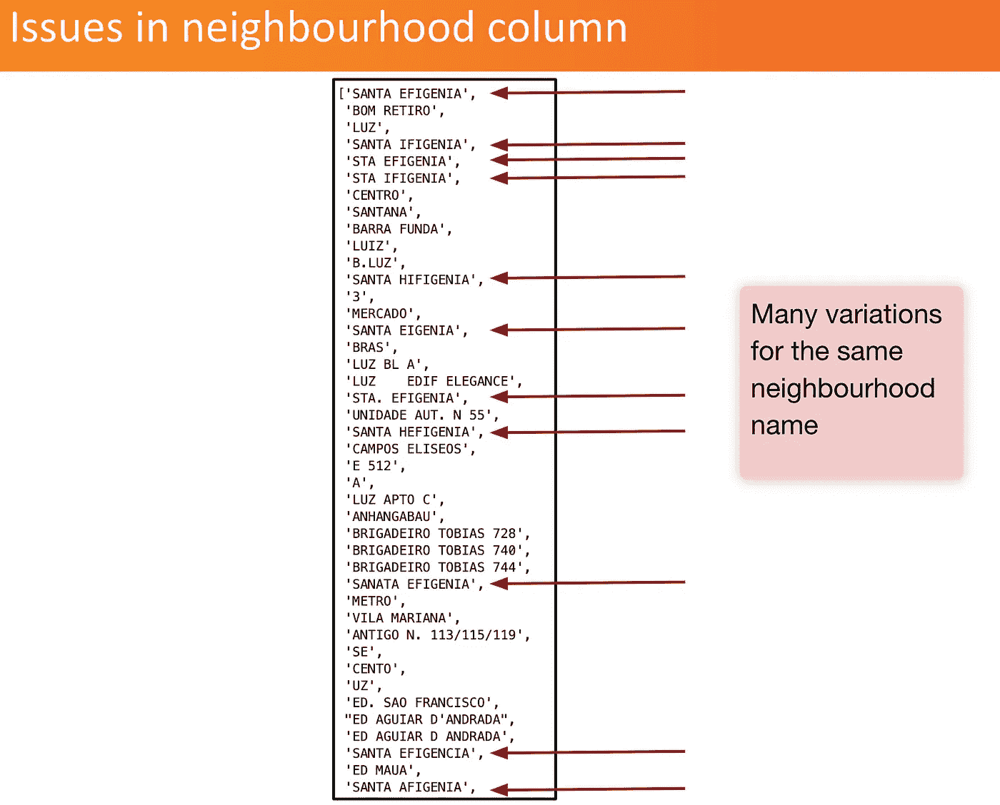
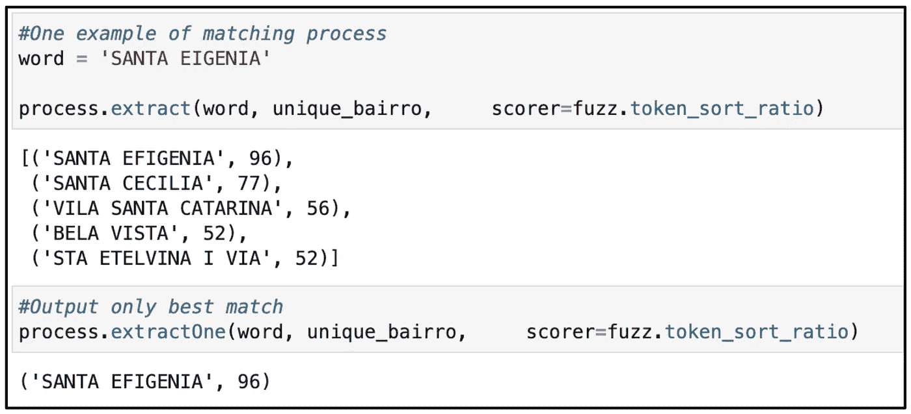
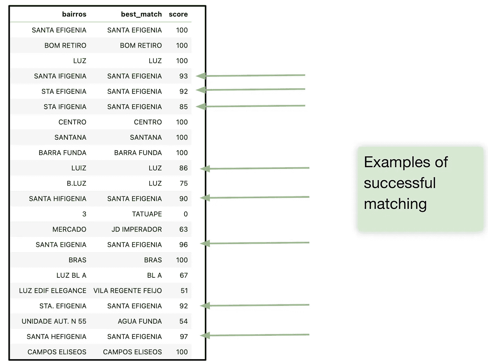
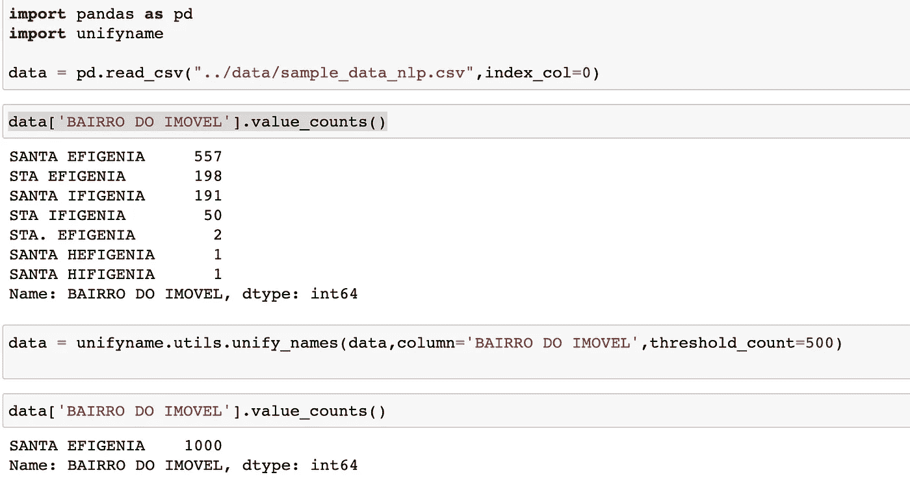

# 一个在混乱的字符串列中统一名称的库

> 原文：<https://towardsdatascience.com/a-library-to-unify-names-in-a-messy-string-column-d77e0ef521b2>

## 一种统一熊猫字符串列中名字的方法。

## 介绍

当处理 pandas 数据帧中的字符串列时，经常会遇到输入错误，同一名称有许多变体。我在查看 SP IPTU 房地产数据集的邻里专栏时遇到了这个问题(要了解如何下载这些数据的更多信息，请单击[此处](https://gestaourbana.prefeitura.sp.gov.br/noticias/prefeitura-disponibiliza-base-do-iptu-em-formato-aberto-no-geosampa/))。下面是一个名称变体类型的示例:

作者图片

这是有问题的，因为我们只需要一种方法来书写每个实体的邻域名称。让我们看看如何解决这个问题。

## 方法学

由于我们有许多以非常不同的方式书写的名字，第一步将是减少只有最可能的名字的名字列表。为此，我们可以查看每个唯一名称的出现次数，只保留出现频率最高的名称。对于我的情况，我的数据集有超过 2000 万条线，每个街区可能包含数千套公寓。我过滤了最有可能出现超过 5000 次的街区名称。如果数据集较小或每个唯一实体出现的次数较少，则应调整此过滤。这个过滤部分不是强制性的，但它有助于减少真实姓名候选人的数量。

从这个唯一名称列表中，我使用 [fuzzywuzzy](https://github.com/seatgeek/fuzzywuzzy) 包基于 [Levenshtein](https://en.wikipedia.org/wiki/Levenshtein_distance) 距离对相似名称执行重复数据删除:

在这里，名为 *unique_bairro* 的列表现在没有任何重复的名称。

在那之后，我们获得一个减少的邻居名称列表，这将是我们的候选，作为每个邻居的最终名称。我们称之为*邻居列表*。

然后，对于字符串列中所有唯一的名字，我们使用 [fuzzywuzzy](https://github.com/seatgeek/fuzzywuzzy) 包在邻居列表中获得一个匹配及其分数(其中 100 表示完全匹配)。

下面是一个单词匹配过程的示例:

作者图片

我们可以看到它成功的找到了 96 分的好配“圣埃菲格尼亚”。100 分意味着完全匹配，通常 80 分以上是很好的候选人。

让我们再解释一下匹配过程如何与 [fuzzywuzzy](https://github.com/seatgeek/fuzzywuzzy) 包一起工作:

*   比率函数计算两个序列之间的标准 [Levenshtein 距离](https://en.wikipedia.org/wiki/Levenshtein_distance)相似性比率。
*   使用“最优部分”逻辑:如果短字符串的长度为 k，而较长的字符串的长度为 m，则算法会寻找最佳匹配长度为 k 的子字符串的得分。
*   字符串被[标记化](https://nlp.stanford.edu/IR-book/html/htmledition/tokenization-1.html)，并通过将它们转换成小写和去掉标点符号进行预处理。
*   字符串标记按字母顺序排序，然后连接在一起。之后，应用比率函数来获得相似性百分比。

现在我们已经看到了一个单词的过程，我们将在字符串列' bairros '中获得所有唯一名称的匹配。由此，我们创建了一个表，其中包含所有唯一名称的最佳匹配及其得分。以下是结果的一个示例:

作者图片

然后，我们过滤 80 分以上的分数，以确定所有唯一名称的匹配对应关系。
当分数低于 80 分时，我们不承认任何比赛。

我们可以对所有唯一的名称使用这种表对应来合并回原始的邻居表。我们现在有了具有统一名称的邻居列(列“最佳匹配”)。

## 一个应用整个过程的库

在混乱的字符串列中统一名称非常有用，可以应用于许多类型的字符串列。出于这个原因，我们决定将这个过程转换成一个简单的库，让每个人都可以使用。
图书馆的知识库可以在[这里找到](https://github.com/vincent-belz/unifyname)

要使用该库，只需在终端中键入:

> pip 安装统一名称

以下是我们如何在玩具数据集中应用该库的示例:

作者图片

点击[此处](https://github.com/vincent-belz/unifyname/blob/master/demo/demo.ipynb)可获得演示笔记本。

图书馆成功地将名字统一为“圣埃菲金尼亚”

正如我们所看到的，处理一个具有许多不同名称的字符串列是很有挑战性的。我们提出了解决这个问题的方法。我们制作了一个易于使用的库，这样你就可以用一行代码申请你自己的数据集。为您自己的项目尝试一下吧！