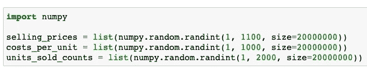
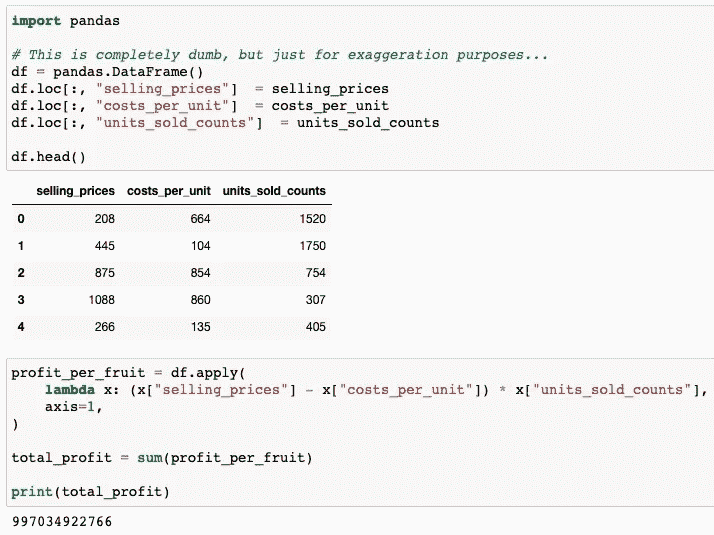
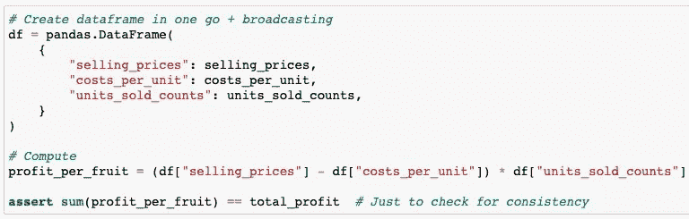
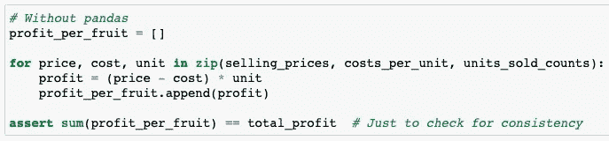
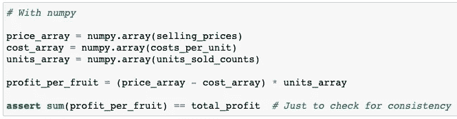
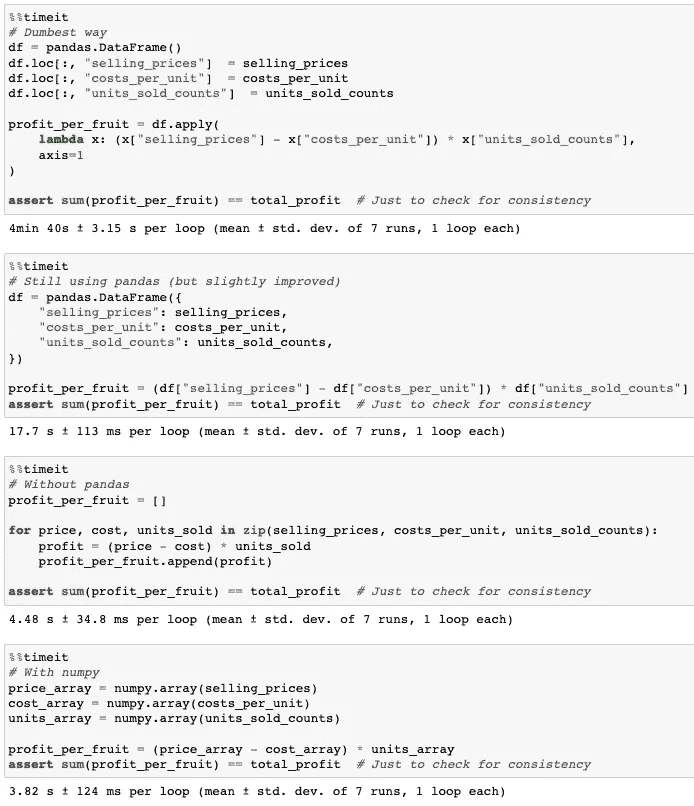

# 一点点代码优化大有帮助

> 原文：<https://towardsdatascience.com/a-little-code-optimisation-goes-a-long-way-91f92ff9f468>

## 即使是原型代码，微小的优化也是有益的


照片由[在](https://unsplash.com/@laurentmedia?utm_source=medium&utm_medium=referral) [Unsplash](https://unsplash.com?utm_source=medium&utm_medium=referral) 上画

> 原型代码通常有可能导致严重的头痛或噩梦。这样会造成不同团队之间的摩擦，容易积累技术债。如果在每个阶段都注意一点代码优化和简化，就不会出现这种情况。

需要为客户快速构建模型原型。然后，炸弹被投入生产。在生产过程中的某个地方，新的炸弹被扔了过来，循环继续，我们都快乐地生活着(不是)。

我们总是匆忙地快速开发代码以满足最后期限，这通常意味着草率/复杂的代码，转化为技术债务(因此术语“炸弹”，或者有些人可能使用术语“雪球”)。虽然很容易认为“这只是一点债务”，或者“我们可以以后再解决这个问题”，但可怕的是，每一点都很重要，越积越多。债务就是债务，如果不偿还，“利息”或罚款是巨大的，当所有这些小事被忽视并积累到为时已晚时，这很容易引起摩擦并淹没团队。

虽然只有在接近(甚至在之后)生产时才考虑优化代码是很常见的，但如果在原型构建的早期阶段对代码进行[优化(即运行更有效或使用更少的资源)](https://en.wikipedia.org/wiki/Program_optimization)和简化，也不会有什么坏处。澄清一下，我并不是说原型模型需要完全优化。我提倡的是，任何开发代码的人都应该:

*   [“保持简单，笨蛋”(KISS)](https://en.wikipedia.org/wiki/KISS_principle) ( [见我的老文章](https://ernchow.medium.com/the-importance-of-kiss-ing-and-testing-when-mixing-programming-languages-and-in-general-3c20ead71d9f))
*   学会更有效地使用你的工具(例如包/库)

详细说明一下第二点，使用一个包的方法是非常低效的(例如`pandas`)。但是稍加调整，这可以显著地改善您的代码。

下面是一些虚构的场景，展示了一些非常愚蠢的代码来说明这一点。

# 虚构的场景

假设我们有一些 2000 万件商品的销售数据，用“列”`selling_prices`、`costs_per_unit`、`unit_sold_counts`，例如:



创建虚拟数据(来源:作者)

这给了我们类似于:

```
selling_prices = [142, 52, 94, 72, 47, 86, ...] 
costs_per_unit = [21, 14, 26, 18, 27, 38, ...] 
units_sold_counts = [9090, 70, 300, 930, 204, 650, ...]
```

可能有比列表更好的方法来存储/处理这种大小的数据，但是为了便于讨论，让我们坚持使用 3 个单独的列表作为起点，如上所示。然后，我们要计算`total_profit`，即对每个水果的(`selling_price` - `cost_per_unit` ) x `units`求和。

# 探测

出于演示的目的，让我们做一些夸张的傻事(即匆忙和草率的代码):

1.  创造一个空的`pandas.DataFrame()`
2.  逐一插入信息栏
3.  用`df.apply` + a `lambda`函数计算`total_profit`，并对结果求和
4.  任务完成。(真的吗？)



计算总利润的仓促草率的代码(来源:作者)

# 优化/简化

如果您正在使用`pandas`，有一个简单的变化来优化我们想要实现的目标:

1.  一步创建完整的`pandas.DataFrame`
2.  使用[广播操作](https://numpy.org/doc/stable/user/basics.broadcasting.html)计算所需输出
3.  (断言输出只是为了检查结果是否与原来的`total_profit`一致)



计算总利润的优化代码(来源:作者)

为了进一步简化(和优化)，我们可以直接计算输出，而不需要`pandas`。



计算没有熊猫的总利润(来源:作者)

在这种规模下(2000 万行)，也许使用`numpy`可以加快速度，但仍然保持代码简单，就像这样:



进一步加快 numpy 计算利润的速度(来源:作者)

# 计时！

现在，让我们用 IPython/jupyter notebook 的 [%timeit](https://ipython.readthedocs.io/en/stable/interactive/magics.html#magic-timeit) 神奇命令来计时每种方法运行我们的 2000 万个数据集需要多长时间。结果如下:

*   (夸张地哑)原方法:280 秒
*   方法同`pandas`(改进):17.7 秒
*   无`pandas`的方法:4.48 秒
*   使用`numpy`的方法:3.82 秒



计算总利润的每种方法的计时运行(来源:作者)

# 思想

结果非常清楚。只需对如何使用`pandas`进行计算进行简单的调整，就可以使计算速度提高 10 倍以上！想象一下，为了各种各样的[探索性数据分析(EDA)](https://en.wikipedia.org/wiki/Exploratory_data_analysis) 项目，你不得不一次又一次地使用`pandas`，难道你不想通过更有效地使用这个包来自动加速吗？

如果你真的不需要使用`pandas`，另一个额外的调整(即直接计算结果)会给你更好的性能(>快 50 倍)，只是因为你不需要创建整个数据帧(即使重构，这也是一个很大的开销！)过程中。该方法仍然比使用`numpy`的方法慢，但性能不会相差太远。这是 KISS 经常被忽视和低估的优点，通过剥离不需要的东西，代码在某种程度上自然得到了优化，而没有使用任何“专门的”加速库。

这些都是微小的细节，但每一个小细节都很重要！你越了解如何更有效地使用你的工具，你就能更自然地优化和简化你的代码。这可能会有很长的路要走，因为团队会随着时间积累更少的技术债务，代码通常会运行得更快更好！

“就这些！”(引用团队成员的话，每当他觉得自己说了一些合理的话时)

# 承认

非常感谢 [Yaqub Alwan](https://www.linkedin.com/in/yaqubalwan/) 、 [Gal Lellouche](https://gal-lellouche.medium.com/) 和 [Saed Hussain](https://medium.com/@saedhussain) 富有洞察力的讨论和这篇文章的校对。

注意事项:

*   原工作 jupyter 笔记本可以在[这里](https://github.com/chilledgeek/blog_dump/blob/main/fictional_scenarios/fictional_sales.ipynb)找到。
*   这篇文章也张贴在[blog.chilledgeek.com](https://www.blog.chilledgeek.com/)