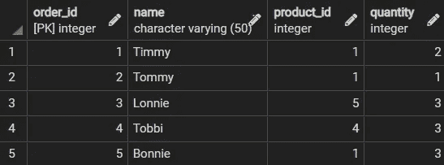
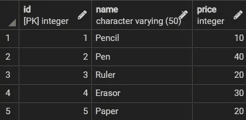
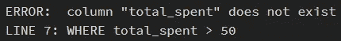
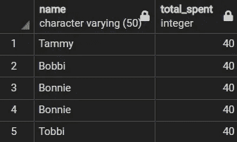

# 对 SQL 执行顺序的研究

> 原文：<https://towardsdatascience.com/a-look-into-sqls-order-of-execution-d0b81e361c66>

## 这就是执行选择查询的方式

Bradyn Trollip 在 [Unsplash](https://unsplash.com?utm_source=medium&utm_medium=referral) 上拍摄的照片

在编写了大量的 SQL 脚本之后，您可能会在性能方面达到某种形式的平稳状态。你用同样的策略提取洞察力，并遇到同样类型的错误。

幸运的是，通过花时间了解 SQL 中的子句是如何计算的，您可以改善编写查询的体验。

在这里，我们讨论 SQL 中的执行顺序，并解释为什么它很重要。

## 执行顺序

SQL 查询在计算子句时遵循特定的顺序，类似于数学运算遵循 PEMDAS 或比德马斯的方式。

从用户的角度来看，查询从第一个子句开始，到最后一个子句结束。然而，在执行时，查询实际上并不是从上到下读取的。

查询中子句的执行顺序如下:

**1。FROM/JOIN:** 首先执行 FROM 和/或 JOIN 子句来确定感兴趣的数据。

**2。WHERE:** 执行 WHERE 子句来过滤掉不符合约束的记录。

**3。GROUP BY:** 执行 GROUP BY 子句，根据一列或多列中的值对数据进行分组。

**4。HAVING:** 执行 HAVING 子句来删除不满足约束条件的已创建的分组记录。

**5。SELECT:** 执行 SELECT 子句来导出所有需要的列和表达式。

**6。ORDER BY:** 执行 ORDER BY 子句，以升序或降序对派生值进行排序。

**7。LIMIT/OFFSET:** 最后，执行 LIMIT 和/或 OFFSET 子句来保持或跳过指定的行数。

## 个案研究

为了说明 SQL 的执行顺序，最好使用一个例子。

我们有两个名为 Orders 和 Products 的表，其中详细列出了购买文具的情况。

订单表(由作者创建)

产品表(由作者创建)

使用这些表格，我们想要找出:

谁在钢笔上花了第二多的钱？

我们可以通过下面的查询获得答案。

代码输出(由作者创建)

答案成功输出，但最初是如何导出的？

如前所述，用户可能会从 SELECT 子句开始读取查询，并以 OFFSET 子句结束，但是 SQL 不会从上到下读取子句。

相反，它通过以下步骤得出答案:

1.FROM 和 JOIN 子句合并 Products 和 Orders 表以获得感兴趣的总数据。

2.WHERE 子句删除未购买钢笔的记录。

3.GROUP BY 子句按名称将记录分组在一起。

4.HAVING 子句删除在钢笔上花费超过 2000 英镑的群体。

5.SELECT 子句派生出购买者和他们在钢笔上花费的相应金额。

6.ORDER BY 子句根据在笔上花费的总金额以降序对结果进行排序。

7.LIMIT 和 OFFSET 子句跳过第一行，只保留下一条记录，其中包含在钢笔上花费第二多的人。

## 为什么这很重要

初看起来，SQL 的执行顺序似乎并不重要。毕竟，如果查询提供了想要的输出，谁会关心子句是如何计算的呢？

不幸的是，不熟悉执行顺序的用户将难以编写更复杂的查询，因为出现的任何问题都将更难调试。那些希望更轻松地排除错误的人将受益于理解 SQL 中子句的读取顺序。

例如，SQL 中的一个常见错误是错误地引用列别名。

我们可以通过使用“订单”和“产品”表来回答另一个问题，从而突出这个错误:

在那些花费不到 50 英镑的人中，谁在一份订单上花了最多的钱？

我们可以通过将 Products 表中的 price 变量乘以 Orders 表中的 quantity 变量，并用别名“total_spent”来命名该表达式，从而计算出在一个订单上花费的总金额。

让我们看看以下查询输出的答案。

代码输出(由作者创建)

一个错误？这是怎么回事？

不熟悉执行顺序的用户可能看不到在 WHERE 子句中使用列别名“total _ spent”的问题，因此从表面上看，该查询似乎是有效的。

但是，知道了 SQL 中的执行顺序，很明显，由于列别名是在 SELECT 子句中创建的，在 WHERE 子句之后的对其进行评估，所以 SQL 在评估 WHERE 子句时不会包含该别名，因此会出现错误。

既然我们可以识别错误的来源，我们可以通过在 WHERE 子句的表达式中不使用列别名来修复它。

代码输出预览(由作者创建)

查询现在成功运行。

请注意，ORDER BY 子句仍然使用列别名“total _ spent ”,这很好，因为该子句是在 SELECT 子句的之后计算的*。*

一般来说，对于理解 SQL 执行顺序的人来说，这样的问题很容易解决。然而，那些对它视而不见的人将很难修复表面上看似良性的错误。

## 结论

照片由 [Unsplash](https://unsplash.com?utm_source=medium&utm_medium=referral) 上的 [Prateek Katyal](https://unsplash.com/@prateekkatyal?utm_source=medium&utm_medium=referral) 拍摄

总而言之，了解查询是如何被读取的将有助于用户改进他们的脚本，并在排除任何错误时获得更轻松的体验。

起初，记住这个顺序可能会令人生畏，但只要有一点经验，执行的顺序就会很容易记住(就像 PEMDAS 或比德马斯)。

我祝你在数据科学的努力中好运！