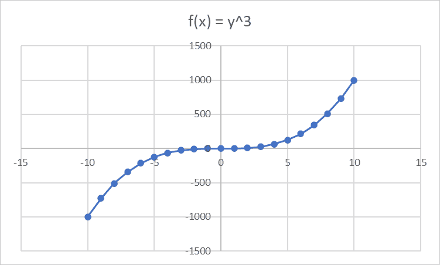
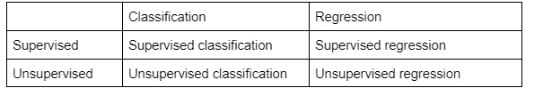
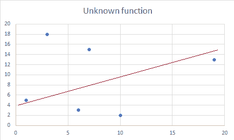

# 机器学习的内幕

> 原文：<https://towardsdatascience.com/a-low-down-on-machine-learning-9cc56ded0ea>

由 [Unsplash](https://unsplash.com?utm_source=medium&utm_medium=referral) 上的 [Pietro Jeng](https://unsplash.com/@pietrozj?utm_source=medium&utm_medium=referral) 拍摄

# 第一部分

> 机器学习和人工智能是如何产生的

机器学习、模型、人工智能——我们在 IT 界经常会遇到所有这些词。根据你问的是谁，他们中的每一个似乎都意味着完全不同的事情。这主要是由于围绕这些技术的商业驱动的炒作。

所有这一切可能会有点混乱，特别是对于那些刚刚开始在该地区。人们很容易迷失在所有复杂的术语、技术和解决看似相同问题的不同方法之间。

虽然商业中的机器学习仍处于“弄清楚事情”的过程中，但无论是通过实际应用还是理论知识，都已经奠定了足够的基础，为我们提供了一个很好的起点。

# 人工智能简史

在所有与人工智能相关的词汇中，*人工智能*本身可能是定义最不严格的。一般来说，人们通常认为，任何能够以任何形状或形式复制人类认知或智能的机器都可以被视为人工智能。

什么构成了“复制人类认知或智力”,在许多领域仍然是一个激烈辩论的话题，包括哲学等较少被提及的领域。

图灵在 1950 年提出了他的[著名测试](https://academic.oup.com/mind/article/LIX/236/433/986238?login=false)，表明将会有一段时间(据推测，大约在 2000 年左右)机器可以很好地模仿反应，以至于人类法官在某种程度上无法有效地决定它是人还是计算机。

继图灵之后，哲学领域出现了一些质疑他的方法的发展，其中最著名的是塞尔的[中文房间论证](https://plato.stanford.edu/entries/chinese-room/)。简而言之，塞尔认为模仿能力(可以用 *if-then* 语句来表达)和理解能力之间有着重要的区别。

如果有足够的计算能力，一台机器完全有能力用中文回答任何问题，但这不会让它理解，因此我们不会认为它在思考。

无论情况如何，尽管塞尔的论点在哲学话语中掀起了波澜，但它对其他学科对人工智能的理解并没有太大的影响。令塞尔可能感到沮丧的是，人工智能的早期方法围绕着所谓的符号人工智能。

符号 AI 大致可以定义为类似图灵理解的东西。这种想法过去是(从某种意义上说，现在仍然是)人工智能可以通过创建规则、符号和逻辑来发展。如果你曾经看过流程图，那是对符号人工智能的合理估计。

这种方法在很大程度上围绕着 *if-then* 语句，这被称为*规则*。整套规则被称为*知识库*。一些数学，一些逻辑，整个事情变成了人工智能，有时被称为基于规则的方法。

虽然它们对于一些解决方案来说很棒，但人工智能研究人员很快就遇到了一个千年的哲学问题——这个世界并不那么容易翻译成语言。例如，假设你想创建一个机器，通过一个基于规则的系统来识别猫和非猫。你会遇到一个困扰古希腊哲学家的问题——猫的一些本质特征可以用规则来表达吗？

不管你往哪个方向转，每个规则都会有可能的例外。有些猫可能只有一只耳朵，有些猫可能没有尾巴，当然还有一些猫没有皮毛。

很快就会有太多的规则，它们会开始互相矛盾。一直以来，人类对猫有一些看似直觉的了解。然而，还不清楚我们用什么规则来做这些评估。

此外，基于规则的系统还会遇到其他问题，比如知识库难以更改和维护。最后，他们不擅长处理部分信息和不确定性——这两件事在实际情况中比看起来更常见。

需要注意的是，我不想贬低基于规则的系统的价值和重要性。它们有许多好处，例如透明(而机器学习是不透明的)，它们可以更有效地解决确定性问题，并且从商业角度来说，维护起来更便宜。

然而，有两组不同的问题是显而易见的。符号人工智能在处理概率挑战方面存在问题。碰巧的是，许多现实世界的应用程序更接近于扑克而不是象棋——只有一些模糊的参与规则的部分信息是可用的。

# 进入机器学习

机器学习(ML)是作为符号人工智能系统的替代物出现的。没有使用规则和知识库，而是采用了经验驱动的方法。简而言之，机器学习模型被输入训练数据(“经验”)，建立数学模型，并提供输出。

虽然 ML 在早期(70 年代和 80 年代初)并不流行，但它在接下来的几十年里迅速崛起。它的主要好处之一是从规则创建(将知识转化为 *if-then* 语句的复杂而具有挑战性的任务)转变为数据收集和标记，这是一项相对容易得多的任务。

此外，机器学习允许研究人员处理一组完全不同的问题，即随机问题。由于 ML 模型基于一组数据和参数创建数学预测，它们必然会进行概率评估。

换句话说，想象你有一个数学函数 *f(x) = y* 。它陈述了两个变量之间的关系。你可以取任何一个 *x* 值，并得到它在 *y* 轴上的位置。最终，你可以画一条线来代表这个函数，并在上面画尽可能多的点。

作者图片

从某种意义上来说，机器学习模型的工作方式正好相反。我们有一批点(或数据点)，它们之间的关系不清楚。如果你有和上面例子中相同的点，你最终可以得到 *f(x) = y* 。

然而，有一个重要的警告。其中之一是，与现有的真实世界数据量相比，数据集总是有限的。换句话说，每个数据集都是所有可能性的一个小子集。因此，任何绘制在线条之间的曲线都是一个预测，如果有足够的数据，它可能会与从初始设置中得出的曲线不同。

# 第二部分

# 分类和回归

模型可以分为两种主要类型—分类和回归。两者都是依靠数学建模来进行预测。但是，分类仅限于两个值:1 或 0。换句话说，这些算法寻找数据之间的相关性，并分配两个值中的一个。

简单地说，分类预测给定的数据点是否属于特定的类别。假设你想做一个算法来预测一个名字是属于一个人还是一个城市。这样一个模型，给定足够的数据，将能够分配给定的名字是属于一个人还是一个城市。此外，输出将是概率性的，并且，大多数模型，将在其准确性方面提供*信心*。

起初，分类似乎只有极其狭窄的应用可能性。然而，它们已经在许多实际应用中使用。语音识别就是一个很好的例子。这是一个分类问题，因为每种语言都有一组有限的单词。模型所要做的就是将语音与其中一个匹配。

另一方面，回归模型有连续的值。他们可以指定介于 1 和 0 之间的任何值，例如[0；1].虽然这两种类型解决的问题基本相似，但它们为我们提供了更好的解决方案。

例如，我们可能希望预测一辆汽车一年的平均运营成本。我们需要几个变量，如马力、平均重量、年龄、燃料类型和已经行驶的距离。所有这些变量都会对汽车运营成本产生影响(由于燃料消耗、预计的维修频率等。)

这样的问题没有办法通过分类来解决。最好的情况是，我们可以定义某个汽车不再经济的任意时间点，并根据这些时间点对我们的产品进行分类。然而，回归会给我们带来一套比 T2 更节省 T3 或比 T4 更节省 T5 的汽车。

# 监督和非监督学习

人们可能会注意到，一个问题是向模型显示哪些数据是相关的，哪些是不相关的。毕竟，汽车有更多的特征——它们有品牌、型号、体型等。这些数据很可能与我们声明的目的完全不相关或不太相关。

监督学习是这种情况下的解决方案。将收集关于车辆的数据，并标记(或注释)相关的信息片段，以便为模型提供必要的焦点。在监督学习中，输入和输出都很容易理解。

输入几乎可以是任何东西，从图像到任何类型的文本。然而，输出受到更多的限制。有三种通用的输出类型——数字、标签(例如“猫”、“不是猫”)或向量(例如“大橙猫”的[“形容词”、“形容词”、“名词”])。

图像识别是监督学习最著名的应用之一。回到我们的猫的例子，在某种意义上，动物是由社会和语言定义的。换句话说，只有我们自己告诉机器猫是什么，它们才知道。因此，监督学习是我们的首选解决方案。

因此，在建立图像识别模型时，将收集数据，并且所有的猫都将被如此标记。只要有足够的数据，模型就能够预测提供给它的图片是否显示一只猫。

然而，监督学习确实有一个缺点。在某种意义上，它类似于基于规则的方法，因为其中有必要的人为因素。必须有人提供基于一组内部规则的数据标签，这通常是耗时且昂贵的。

然而，无监督学习的用例稍微复杂一些。当我们不太确定输出应该是什么样子时，就使用它们。顺便提一下，它有时被称为*聚类*，因为这种数据收集的目标是收集相关数据点的聚类，以获得输出。

真正的无监督学习在机器学习中仍然是一个公开的问题，因为它是两者中更复杂的版本。然而，它更接近于我们在介绍性段落中谈到的人工智能，因为它更类似于人类如何学习和思考。

使用无监督学习的一个最常见的例子是离群点检测。可以为模型提供一定量的数据，然后对这些数据进行分析，找出点之间的任何关系。这种模型的输出是新数据点的数学表达的差异。

这种机器学习模型在趋势和报告生成等方面非常有用，在这些方面，大量数据可能存在较大差异。极端的异常值可能会扭曲报告，从而降低这些报告的适用性。

由于手动删除异常值可能令人望而生畏，并且容易出现人为错误，因此机器学习模型可以毫无问题地做到这一点。

*故事至此为止。图片作者。*

最后，还有*半监督学习*，它使用了两者的一部分。有时标记所有数据可能成本过高，或者资源过于密集。因此，小块数据将被标记，而数据集的其余部分则未被标记。

# 第三部分

# 强化学习

我不会深究强化学习(RL ),因为它在商业中并不常用。然而，它在公众意识中掀起了如此大的波澜，以至于回避谈论它几乎是不体面的。

你可能听说过强化学习的惊人成就。通过 RL 训练的模型已经在国际象棋、扑克、*、星际争霸*、*、Dota 2* 和许多其他难以置信的复杂游戏中击败了世界级的玩家。从所有的标题来看，强化学习似乎让我们更接近真正的人工智能。

与其他两种学习类型不同，RL 改变了监督的性质。没有标记数据*本身*，模型只接收正的或负的*奖励*。在国际象棋比赛中，失去一枚棋子是消极的奖励，而得到一枚则是积极的奖励。这样一个模型的目标是创建一个*政策*(一组行动)，最大化*预期平均回报*。

根据问题的复杂程度，人工干预通常发生在整个过程的几个步骤中。然而，在开始的时候，奖励是明确的——赢得一场比赛，拿走一件东西，等等。然后，模型被释放出来，与自己对打。最终，纯粹通过试错，它达到了可以打败人类的技能水平。

虽然 RL 可以实现真正令人印象深刻的壮举，但它也有一些致命的缺陷，正如 [Andrey Kurenkov 在 Gradient](https://thegradient.pub/why-rl-is-flawed/) 中恰当地指出的那样。其中之一是，这些模型的计算成本非常高。

对于 *Dota 2* ，公认的迄今为止最令人印象深刻的壮举， *OpenAI Five* 需要 256 个 GPU 和 128 000 个 CPU 核心。相比之下，世界上最强大的超级计算机之一 [Pleiades](https://www.nas.nasa.gov/hecc/resources/pleiades.html) 运行在 241 324 个内核和 83 个 GPU 上。此外，大多数相当复杂的监督模型可以在单个企业级服务器上运行。

*OpenAI Five* 同时打了上千场比赛，训练了一年多。本质上，该模型拥有数千小时的游戏时间，而其最有经验的人类竞争对手[约翰“N0Tail”桑德森](https://www.vpgame.com/news/article/343092#:~:text=N0tail%20reaches%2020000%20hours%20of%20playtime%20in%20Dota%202)当时还没有达到 20 000 小时。

最后，这些模型非常擅长基于反射的游戏，但不擅长推理和记忆。在 *Dota 2* 的例子中，开发者不得不设置一个人为的反应时间限制，以在玩家和模型之间产生公平的竞争。另一方面，在一些复杂思维是主要竞争力量的游戏中，它无法击败经验丰富的玩家。

最后，RL 是一种惊人的，但极其昂贵的机器学习方式。虽然这些壮举确实证明了人工智能的能力，但它仍然不是完美的。强化学习是我们解决基于规则或监督模型难以解决的问题的第三种方式。

# 简单和复杂模型

让我们回到我们的非 RL 模型。正如你所想象的，并不是所有的数据都能符合简洁的 x^n 函数。大多数真实世界的应用程序都有分散的数据点，这就需要创建更复杂的数学模型。

构建工作模型的一部分是选择正确的复杂函数来预测我们的数据。[机器学习中经常使用的奥卡姆剃刀](https://plato.stanford.edu/entries/simplicity/)指出，能够解决问题的最简单的解决方案就是恰当的解决方案。换句话说，每个机器学习模型理论上都可以使用 10+阶多项式函数，但这不是一个合适的解决方案。

从某种意义上说，机器学习是一个数学曲线拟合问题。我们收集了大量的数据，这些数据之间有一些关联。该模型的预测能力部分取决于我们事先选择函数的好坏。

从最简单的*线性*模型开始，我们可以通过*f(x)= a+a’x 来表示。假设 a 不为 0，它会产生一条始于某点的直线，其中 x 为 0。*

可怕的契合！图片作者。

在上面的例子中，我们有一个看似随机数据点的散点图。红线是我们之前概述的功能。显然，这样的契合是可怕的。它勉强抓住了边缘的两点，完全错过了其余的点。

简单线性模型最适用于两个主要变量以某种方式相关的模型。例如，假设我们想要创建一个机器学习模型，仅根据年龄来预测全因死亡率。这两个变量密切相关，虽然还有其他混淆因素，但线性回归或许能够为我们提供合理的预测。

当预测依赖于大量相互关联的因素时，复杂的回归模型(曲线和凹槽多于上图)更适合。回到我们的汽车例子，这样一个模型将需要一个更复杂的函数，它将是某个 *n 次*的顺序，其中 *n > 2* 。

最后，问题是预先预测正确的回归模型。然后可以根据它是否合适、是否合适或是否合适来调整它。

# 欠拟合和过拟合

与纯数学不同，机器学习模型没有完美的拟合解。在继续之前，重要的是要理解所有的训练数据都是模型试图解决的问题的所有数据的一个很小的子集，有时非常小。

换句话说，所有的训练数据集都是整个画面的不完整部分。它们只是揭示了变量之间的一般趋势，而不是某种不可改变的数据分布规律。因此，一个模型应该足够好地揭示总体趋势，而不是捕捉其他一切。

上图的前一个例子显示了拟合不足的问题。显然，它没有捕捉到足够的趋势，这将导致模型在训练数据和测试中表现不佳。

过度拟合是一个稍微复杂一点的问题。似乎最好的方法是对模型进行大量训练，使其在训练过程中始终提供完美的结果。然而，由于训练数据是一个很小的子集，真实世界的应用程序通常会有不同的数据点分布，这些数据点只会趋向于相似性。

在这种情况下，过度拟合模型将开始做出大量错误的预测，因为它试图拟合分布略有不同的数据。此外，我们应该假设所有数据都有一些不应该被捕获的噪声(例如，异常值)。

试图将数据拟合得太好的模型可能会开始看到不相关信息之间的相关性，从而导致假阳性错误。在我们的汽车示例中，它可能会发现车门数量和总成本之间的相关性(尽管可能存在一些微弱的相关性，因为跑车通常马力更大，车门更少)。

这两个事件导致两种主要类型的误差——偏差和方差。当模型太弱，无法发现数据点之间的一些重要关系时，就会出现偏差。当模型对不规则性过于敏感，并开始捕捉数据中的噪声时，就会出现方差。这两个错误都偏离了预期的结果。

# 结论

我害怕在这里结束这篇文章，因为我还没有触及机器学习的表面，而只是画出了第一个轮廓。然而，机器学习现在应该通过它的历史和它解决的问题来阐明。

请注意，上述方法没有一个比另一个更好。基于规则的系统，机器学习，无论是有监督的，无监督的，还是强化的，都只是简单的工具。他们能比其他人更好地解决一些问题。选择适合这项工作的人。