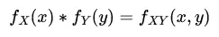
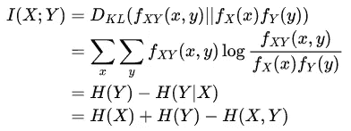
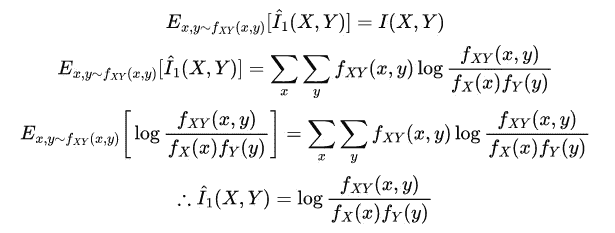
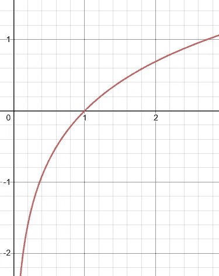
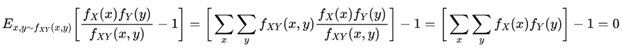
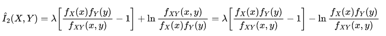
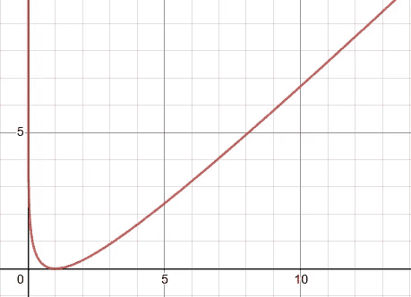
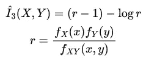

# 互信息的低方差样本估计量

> 原文：<https://towardsdatascience.com/a-low-variance-sample-estimator-for-mutual-information-c4aa479003aa>

## 与相关性竞争

[JESHOOTS.COM](https://unsplash.com/@jeshoots?utm_source=medium&utm_medium=referral)在 [Unsplash](https://unsplash.com?utm_source=medium&utm_medium=referral) 上拍照

这是我那篇关于 [**逼近 KL 发散** e](/approximating-kl-divergence-4151c8c85ddd) 的文章的续篇，遵循相同的思路。我想这应该有它自己的一部分，因为我还没有在互联网上的其他地方看到过这个具体的想法。

# 什么是互信息？

首先快速回顾一下，互信息描述了在一个数字中两个随机变量是如何相互依赖的。如果互信息为 0，则变量是独立的，否则存在一定的依赖性。你可能会认为这听起来很像相关性，但关键区别在于相关性衡量的是线性相关性，而互信息也考虑了非线性相关性。例如，给定随机变量 **X** 假设 **Y=X** 。很明显 **X** 和 **Y** 是相关的，但是相关性可能不会注意到它，因为关系是非线性的，而互信息会。

那么它到底是如何工作的呢？从概率论中我们知道，如果两个随机变量的单个概率密度函数的乘积等于联合概率密度函数，则这两个随机变量是独立的(因此也是不相关的):

作者图片:X 和 Y 独立的情况。

所以为了测量独立性，我们真的需要找到一种方法来测量联合概率密度函数和个体密度函数的乘积之间的相似性。幸运的是，我们有信息论的工具，KL 散度！为了简洁起见，我不会在这里深入研究 KL 散度，但如果你想知道更多，请在这里 查看我关于主题 [**的文章。因此，完整的互信息定义如下:**](/forward-and-reverse-kl-divergence-906625f1df06)

作者图片

# 为什么首先要估计？

1.  **无解析解**:互信息的完整形式解析解可能未知。例如，高斯混合分布就是这种情况。
2.  **高计算复杂度**:计算完整的互信息通常需要对整个分布空间求和。使用不需要这样做的近似是有用的，因为它可以更快。

# 估计量的标准

直觉上，一个估计量应该具有与被估计的原始度量相似的行为。我们可以用两种方法来衡量这种相似性:

1.  **偏差**:理想情况下，估计量应该是无偏的；也就是说，估计量的期望值应该等于原始度量。
2.  **方差**:方差为 0 的无偏估计量(确定性的)将完全等于原始度量！当然，这是不现实的，但理想情况下，方差应该尽可能低，从而增加获得更接近原始度量的值的可能性。

# 估计互信息

首先，我们需要计算出在我们的估计量中，我们的样本是来自哪个分布。假设我们有随机变量 **X** 和 **Y** ，在每个时间步，我们将同时采样一个 **x** 和 **y** 。因此，样本是从联合分布中生成的。这在处理估计量的第一个标准时是很重要的，即无偏性，知道在哪个分布上计算期望。让我们从目前使用的标准解决方案开始:

作者图片

这很好，但它有很高的方差，因为它可以取负值，而实际的互信息不能:

图片作者:当比值 f_{XY}(x，y)/f_X(x)f_Y(y)小于 1 时，上面给出的样本互信息估计量为负😞

改善这种情况的一种方法是添加一个期望值为 0 的项，该项与上面的原始近似值负相关。我们提出以下解决方案:

作者图片

假设 **f_X(x)** 和 **f_Y(y)** 是有效的概率函数(质量总和为 1)，这是可行的。然后，我们可以将估计值更新为:

作者图片

其中我们可以求解 **λ** 以找到最小方差。不幸的是，这取决于具体情况，很难分析计算。但是，通过选择值 1，我们仍然可以找到一个很好的折衷方案。这导致无论如何都是一个半正定的近似！如果我们把比值 **f_X(x)f_Y(y)/f_{XY}(x，y)** 作为自己的变量，并把它与近似值 **λ=1** 相对照，我们得到下面的正定图:

作者图片

这产生了最终的估计量:

作者图片

下一次你发现自己需要使用一个样本来近似交互信息时，请记住这个技巧！

如果您觉得这篇文章有用，请考虑:

*   跟踪我🙌
*   [**订阅我的邮件通知**](https://medium.com/subscribe/@rohan.tangri) 永不错过上传📧
*   使用我的媒介 [**推荐链接**](https://medium.com/@rohan.tangri/membership) 直接支持我并获得无限量的优质文章🤗

推广的方式，我真的希望你觉得这篇文章有趣，让我知道你的想法！！