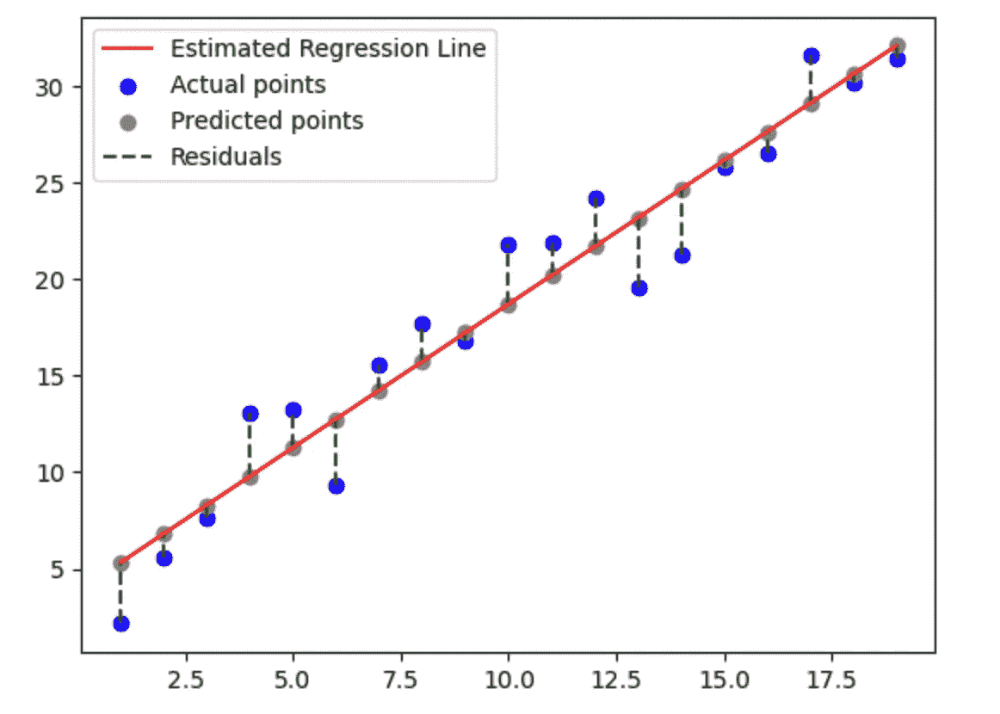
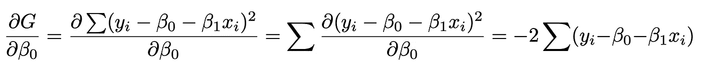
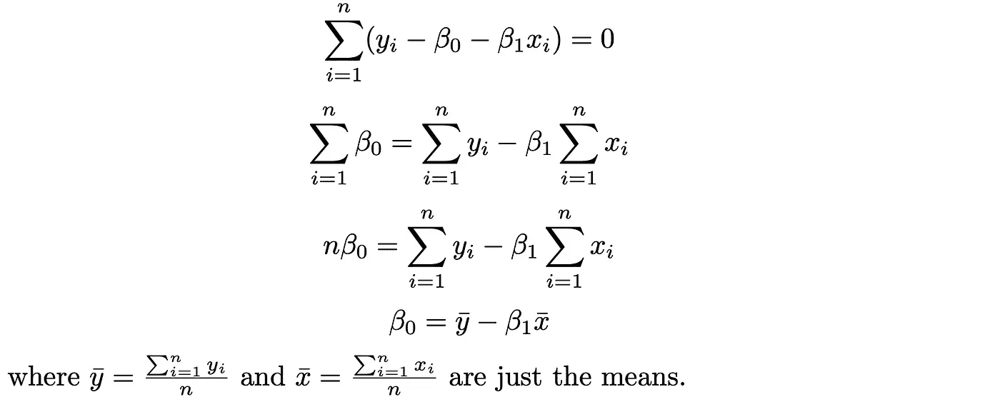
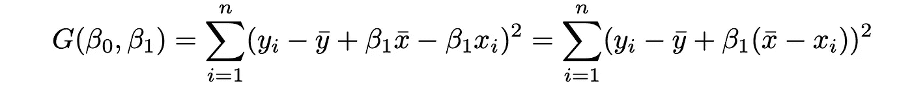
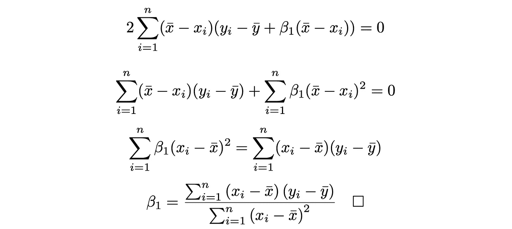

# 简单线性回归封闭方程的数学分解

> 原文：<https://towardsdatascience.com/a-mathematical-breakdown-of-the-closed-form-equation-of-simple-linear-regression-8f8306127900>

## 快速浏览，加强您的机器学习基础

线性回归被商业、科学、工程等领域的专业人士广泛使用，但没有太多人理解(或关心)幕后的数学。这篇文章将引导读者进入数学领域，并希望在此过程中获得一些数学欣赏。

# 一.导言和问题陈述

线性回归是一种统计模型，假设输入 **x** 和输出 **y** 之间的线性关系。目标是观察和预测。

假设我们有 n 个观测值 x_i，y_i 其中 i = 1，…，n，我们想得出一个可以根据 x_i 预测 y_i 的线性函数。

在哪里

每对β_0 和β_1 产生不同的谱线，但我们只对最好的谱线感兴趣。“最佳”线的定义是什么？我们如何找到最好的“β_0”和“β_1”？

# 二。剩余平方和

衡量线性回归性能的一种方法是找出它产生的误差。通过将预测值和实际值之间的所有差异(**残差**)相加，我们可以掌握什么是“坏的”，并从中尝试找到最佳模型。

估计回归线的残差(Huy Bui)

换句话说，如果 y_i 是实际值，ŷ_i 是预测值，那么成本函数**的平方和** ( **RSS** )的残差被定义为

我们希望我们的预测是准确的，这意味着误差应该很小。因此，目标是找到β_0 和β_1，使得 RSS 函数 G(β_0，β_1)最小。

事实上，β_0 和β_1 有一个封闭的公式，

让我们发现这个公式从何而来，从零开始推导！

# 三。求系数

记得在微积分中，要求局部/全局极值，需要求导数，求临界点。

类似地，我们可以使用偏导数找到成本函数 G 的临界点。这个临界点保证是**全局最小值**，因为 G 是凸函数。这里不讨论凸性的细节。然而，你可以把成本函数想象成一个溜冰场，全局最小值就是重力最终把你拉下来的地方。

滑板公园(资料来源:Unsplash)

现在回到数学上来。如上所述，成本函数 G 定义如下:

G 对β_0 的偏导数为:

设置 **∂G/∂β_0 = 0** 以获得

将 **β_0 = ȳ− β_1 x̄** 代入我们得到的 G(β_0，β_1)，

类似地，对 G 相对于β_1 求导得到，

设置 **∂G/∂β_0 = 0** 获得，

# 四。进一步讨论

我们用微积分推导出了 2D 线性回归的公式。理论上，我们可以对 3D 或 4D 应用同样的程序。随着维数的增加，公式的复杂性呈指数增长，因此计算更高维的公式是不切实际的。

已经开发了不同的优化技术来解决这个问题。其中一种叫做**梯度下降**。但这将是另一个不同的话题！

感谢您的阅读。