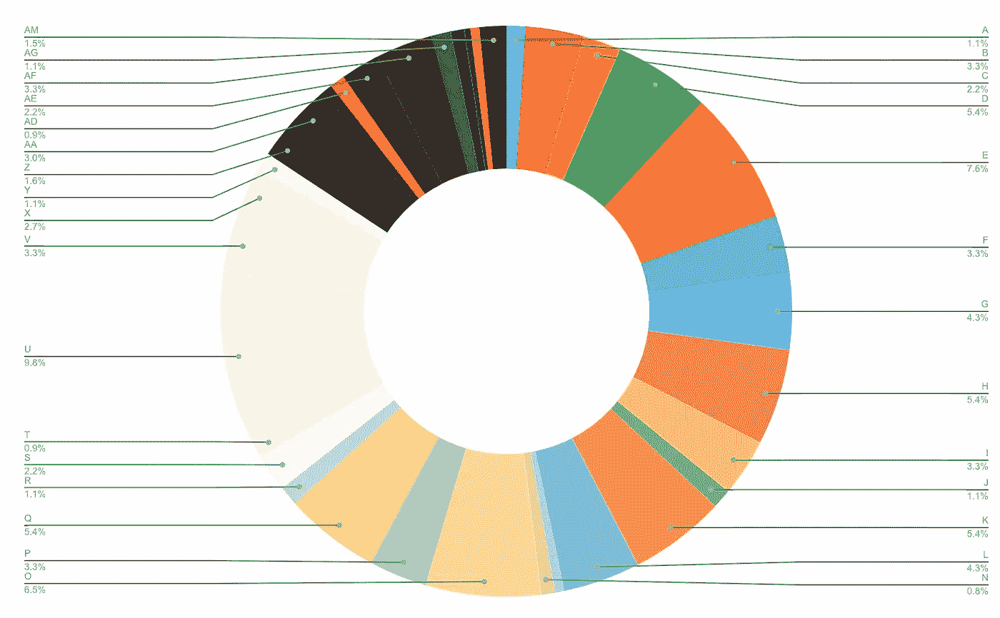
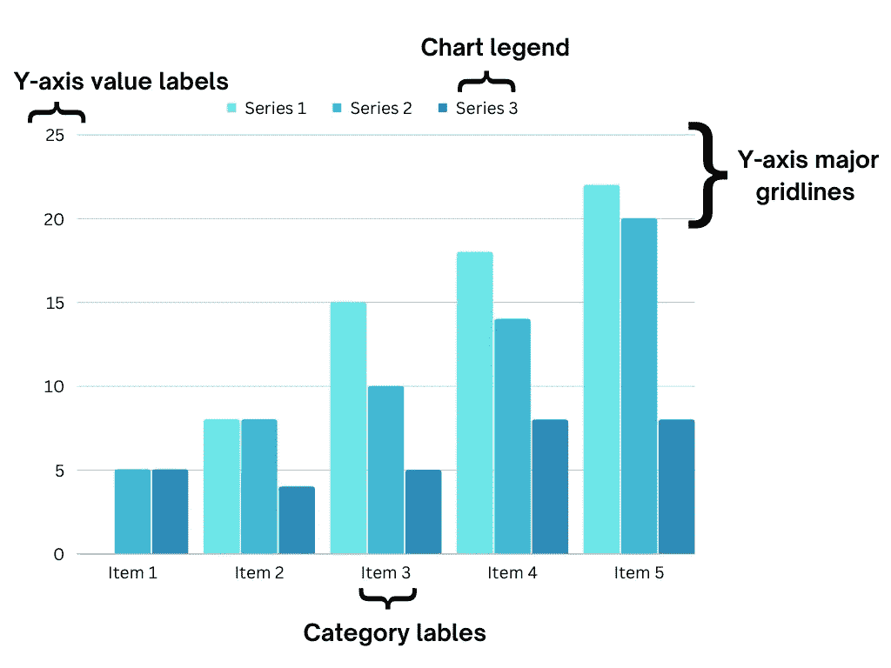
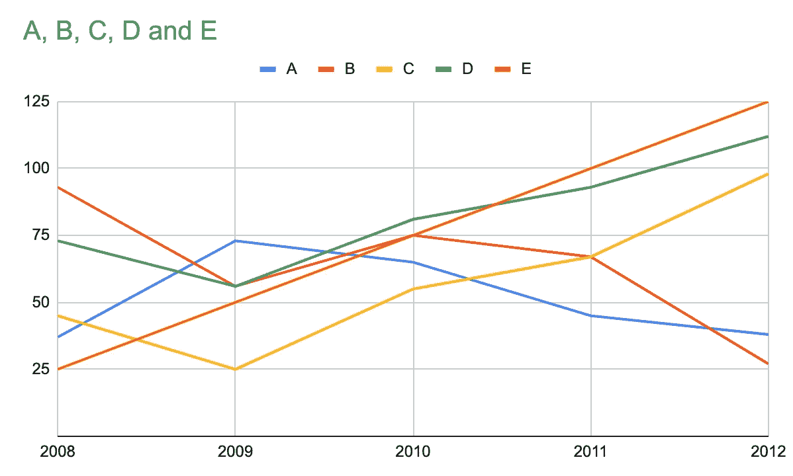
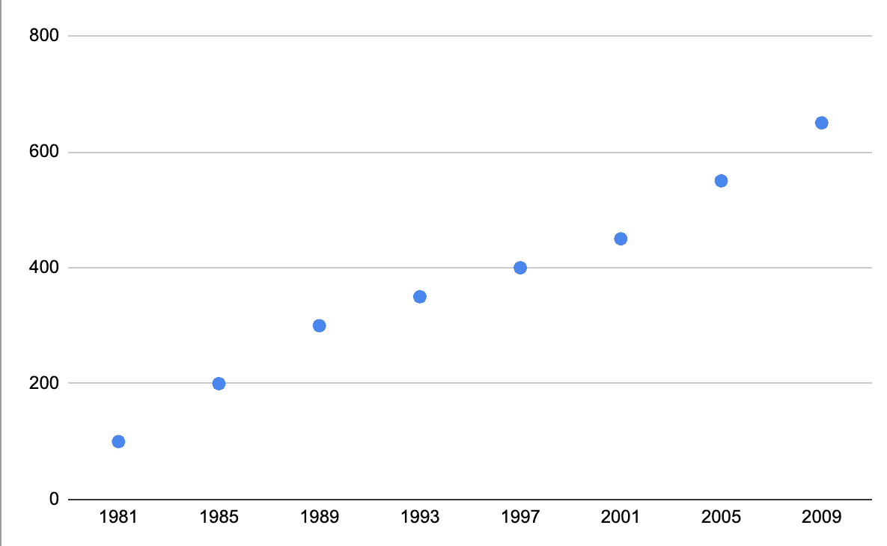
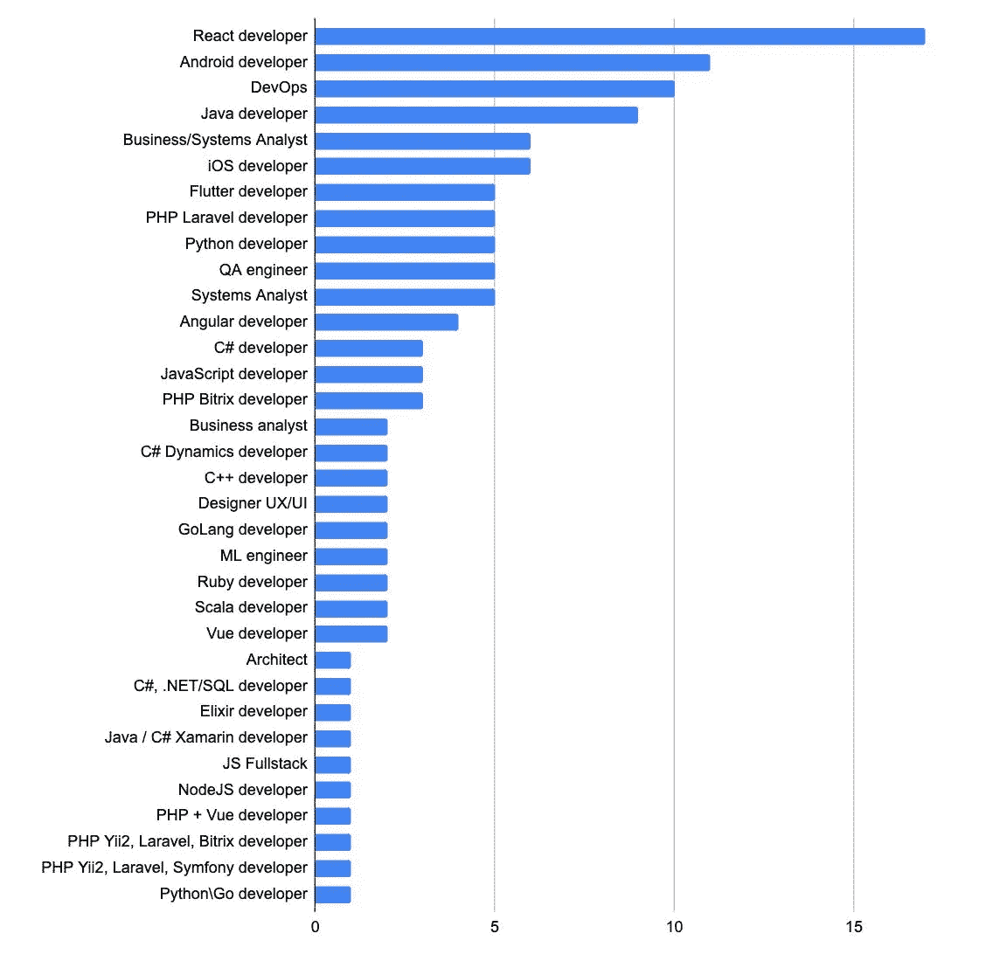

# 数据可视化的奇迹

> 原文：<https://towardsdatascience.com/a-miracle-of-data-visualization-5e966c2e1aa0>

## 意见

## 提高商业分析质量的正确方法

图片来源:[https://unsplash.com/photos/JKUTrJ4vK00?utm_source=unsplash&UTM _ medium = referral&UTM _ content = creditShareLink](https://unsplash.com/photos/JKUTrJ4vK00?utm_source=unsplash&utm_medium=referral&utm_content=creditShareLink)

选择正确的分析工作结果直接影响管理和决策的质量。A17 技术公司的创始人兼首席执行官******Andrew Bush 在本文中揭示了为什么数据可视化错误会让您的公司损失惨重，以及如何避免重大损失。******

******无论你公司的分析团队有多熟练，或者他们的数据和算法有多完整，结果都可能不令人满意。通常，这是由于对工作的不正确的视觉化，而这正是董事、投资者和股东们决策的基础。******

# ******可视化的意义是什么？******

******可视化是数据分析的一个阶段，有助于以信息丰富和互动的方式展示指标的主要趋势、相关性和偏差。为此，使用了各种图形元素。例如，选项卡、图表、信息面板(仪表板)等。******

******重要的是要理解，可视化不仅仅是一个花哨的报告，而是一个主要的可理解的业务逻辑，有助于做出正确的管理决策。事实是，那些刚开始实施和经常使用 BI 工具的人可能会混淆这些想法。由于向您的高级领导团队提交的数据质量不佳，整个分析值可能会在几分钟内消失。在花了大量时间研究摘要选项卡后，决策者可能会因为不完善或不方便的呈现格式而没有注意到依赖关系。******

******让我们考虑这样一种情况，将你的分析结果呈现给你的主管，以便对公司做出改变。如果你的数据展示得不好，你的老板就无法在最初的三秒钟内理解信息。他们没有时间研究它，因此只做了粗略的回顾。整个工作证明是无效的。这就是为什么你需要学习如何可视化数据。******

******商业分析师不仅拥有技能，而且知道呈现数据发现和见解的正确方法，加上为客户需求提供令人满意的解决方案，这些人在就业市场上总是很受重视……也很受欢迎。对数据可视化专家的需求也相当强烈。******

# ******专家应该记住什么？******

******有几件重要的事情应该考虑进去。首先考虑一下**受众**——那些会审核数据的人。最常见的是公司董事、部门主管、利益相关者、投资者等等。好的视觉效果和公司活动的演示一样。例如，根据出席会议的目标受众，演示看起来会有所不同。******

****一个可视化的方法也取决于它的**目的**。当你必须准备一份关于季度绩效统计动态的报告，让你的主管快速浏览是一回事。在这种情况下，你需要一个简单的图表，它可以在 1-2 秒内被理解，没有进一步的解释，并立即得到解释。然而，当需要可视化来消化复杂的企业流程以实现业务转型时，情况就完全不同了。在这种情况下，它应该非常详细，以便决策者有机会看到手头的整个流程。然后，解释可能需要几个小时，几天，甚至几个月。****

****此外，当需要呈现业务的利润状况时，例如在季度报表中，可视化可能是一个**一次性需求**。或者当**准备不断更新的仪表板**需要可视化时。这是完全不同的情况，它们需要不同的方法。例如，仪表板可视化适合于快速理解，因此，它应该具有最少的信息，以便主管可以快速理解数据。****

****此外，不管可视化的类型如何，都应该遵循几个基本规则。所有这些都与可理解性有关，代表了数据的正确含义。****

# ****最低纲领****

****首先，谨记**少即是多的原则。也就是过多的细节越少越好**。例如，避免在同一轴上放置不同的指标，使用 3D 图、阴影和其他花哨的东西。如果不需要，也可以删除图表网格。图表中的线条越多，正确阅读信息就越困难。例如，如果我们有一个图表，其中有几条线显示盈利能力、可用库存等，那么它们应该被分解成单独的图表。一个明显的例外是当我们需要比较数据的时候。当您根据地区或联邦辖区比较公司分支机构的盈利能力时，可能会出现这种情况。****

********

****在这里你可以找到更多有史以来最差图表的例子。****

****不管怎样，所有的可视化都是建立在比较的基础上的:用零水平，用过去时期的相似数字，用彩色。如果你的图表有几行，你必须提供一个清晰的描述:哪些值意味着什么。**悬疑传说**在这种情况下是必须的。此外，**不要使用几个 Y 轴**:这可能会导致读者混淆，并妨碍更好地解释数据。****

********

# ****轴缩放****

****分析初学者经常犯的另一个错误是**轴缩放** **(从非零点开始)。这导致不正确的数据解释。因此，整个分析工作的质量受到严重影响。在使用自动化工具时，这种情况经常发生。例如，如果你用百分比来表示一家公司生产线一年的工作量，它可能只从 80%变化到 100%。同时，这些数字本身的范围是从 0%到 100%。默认情况下，一些自动化可视化工具可以通过只显示从 80%到 100%的数字来隐藏从 0 到 80%的值。因此，该图的读者会有这样的印象，即这些值变化很大，而实际上并没有。******

********

****一个类似的问题是对数图。最好**不要使用对数标尺**，因为它是非线性的。如果由于某种原因使用了这种表示格式，那么应该明确指出:读者应该理解这是一个对数标度的事实，以及为什么使用它。你绝不应该在下面用小字体的星号来表明这一点。那是一面红旗。****

********

****使用直方图时也要特别小心。**直方图值应始终按照*度量*** 排序，而不是像通常那样按照字母顺序或随机分布。这种可视化的结果应该是三角形的，从最小到最大显示数字，反之亦然。这种表示格式允许您轻松识别最大值和最小值。有了对情况的清晰了解，将来处理这些数据会更容易。****

********

# ****代表性格式****

******将公司风格和身份融入你的形象**是重要的**，**这意味着包括公司的配色方案和字体等。利用公司品牌手册中的颜色图案是一种很好的做法。因此，分析师应该询问公司品牌手册中是否有单独的数据可视化指南。在较大的公司中，它肯定应该存在，并且还可能包含某种字体、线宽和文本布局。****

****你还应该考虑颜色和想法之间的心理联系。例如，默认情况下，红色意味着“停止、危险或小心”；绿色表示“去，安全，OK”；蓝色通常是冷的东西；黄色经常标记不重要的东西。这些颜色也相互影响。请考虑前面各地区分支机构盈利能力对比图中的数字示例。如果颜色不同，红色和绿色不得用于区分一个区域的数据和另一个区域的数据。由于心理偏见，数据值可能会被错误地解释。红色的图形可能被消极地感知，而绿色的图形可能被积极地感知。最好是将所有的值都着色成一种中性色，并调整其饱和度(亮度)或使用相近颜色的阴影。****

****最常用的 BI 工具已经有了默认设置，这有助于以统一的风格准备图表。分析师只需要制作正确的图例并调整颜色。但有时需要为年度股东大会定制可视化效果。在业务分析师完成准备好的数据和完成的仪表板的工作后，这些数据和仪表板应被转发给设计师，设计师以相同的比例重新绘制它们，但使用正确的缩进、排版、颜色、字体和线条粗细。****

# ****航行****

****高质量可视化的另一个原则是了解其用例，即用户将如何利用图表、仪表板和报告集。为此，有必要**提供从一般事物到特殊事物的简单导航**。****

****导航是图表中某些元素的范围，它有助于切换到各种类型的图表(页面)并执行诸如按年、季度、月、分支等对值进行排序的操作。一般来说，广泛使用的 BI 工具通常都有内置的导航设置，比如按钮过滤器，或者与其他页面的超链接兼容性。但是开发者必须计算公司员工将如何使用特定的信息图表。仅仅依靠自己的观点是不够的。分析师必须观察主管目前如何使用分析。这是通过追踪他们在 Excel 文件之间的点击流、通过通信或信使等评估功能性问题序列来实现的。****

# ****交互性和兼容性****

****在进行可视化工作时，**理解** **它是如何交互的是很重要的。**静态可视化的一个例子是来自企业 BI 系统的截屏，基于该截屏创建图形、图表或图片。最终，它们都被用于演示文稿或 PDF 文件。它们不能随着时间而改变。****

****交互式可视化需要不同的方法。例如，大多数分析工具允许创建支持进一步分析的仪表板或报告。它们提供了各种横截面报告和过滤器的选项。其目的是用户可以继续使用所有数据，并根据个人的判断更改图表及其内容。在这种情况下，重要的是尽可能将图表分成单独的报告和报告页面，按照目的、横截面或详细程度进行分类。这里“少即是多”的原则也是相关的。****

****除此之外，在准备可视化时，值得记住的是**将它用于各种类型的设备**:个人电脑、笔记本电脑、平板电脑、智能手机等。解决方案可以是准备好的 PDF 文件和仪表板。在准备阶段，考虑到您的内容在大小屏幕上可视化的所有特性是至关重要的，这样开发人员就不必在将来每次数据刷新后检查格式。唉，不幸的是，许多 BI 系统不适合在移动设备上工作。通常，这方面的兼容性是通过利用公司的编程专家来实现的。****

****此外，必须为可视化正确准备数据，以便加载到报告中的数据量最少。这个问题通常由系统分析师来解决。如果数据太多，加载报告将花费大量时间。如果几秒钟之内没有写好报告，没有人会愿意去做。****

****总而言之，事实上，负责商业分析数据可视化的专家们处理的是为决策者改善用户体验。他们的任务是确保用户与分析报告或仪表板的最佳交互。可视化系统本身倾向于解决与 UI 相关的问题。****

*****除非另有说明，所有图片均由作者创作。*****