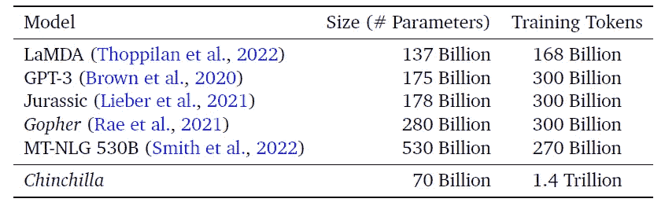
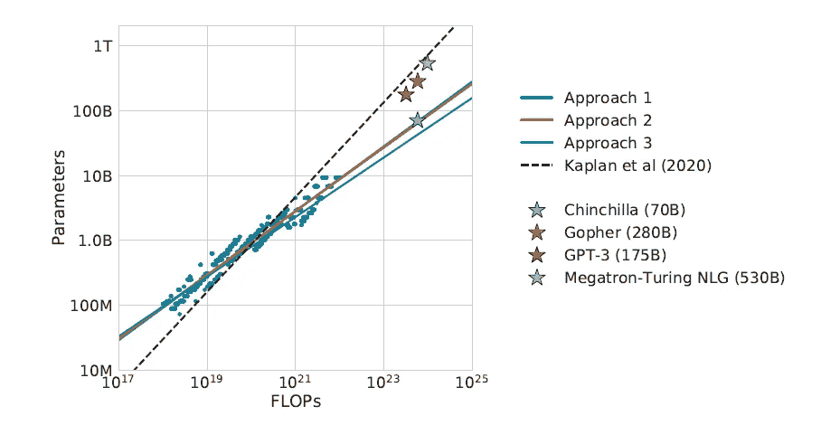
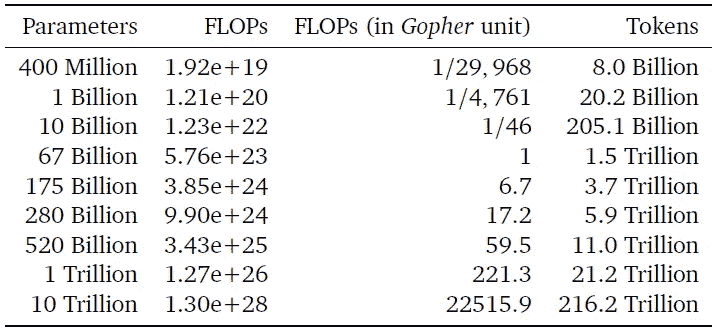
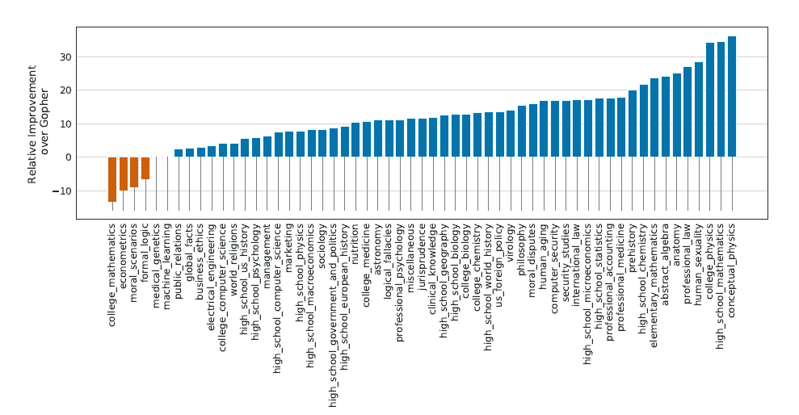
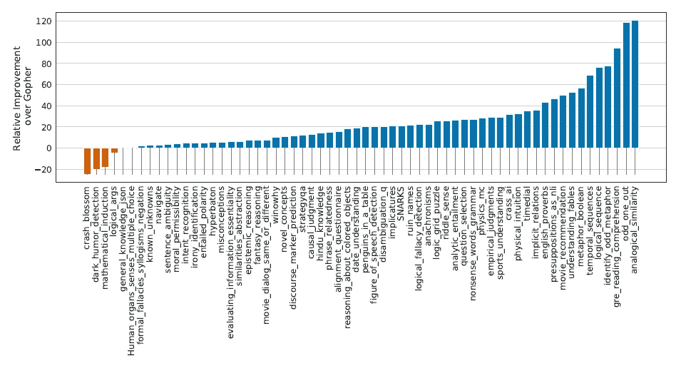
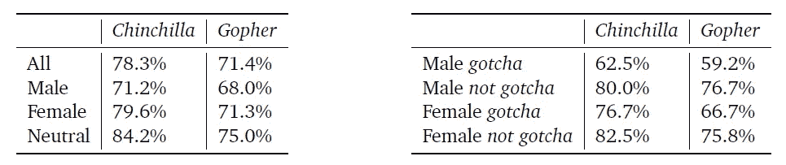

# 一个新的人工智能趋势:龙猫(70B)大大超过 GPT-3 (175B)和地鼠(280B)

> 原文：<https://towardsdatascience.com/a-new-ai-trend-chinchilla-70b-greatly-outperforms-gpt-3-175b-and-gopher-280b-408b9b4510>

## 意见

## DeepMind 已经发现了以低廉的成本扩展大型语言模型的秘密。

[照片](https://www.shutterstock.com/es/image-vector/filtering-machine-algorithms-wide-big-data-2067648317)由 Shutterstock 上的[亚瑟](https://www.shutterstock.com/es/g/ArtHead)拍摄

DeepMind 的最新论文摒弃了构建越来越大的模型来提高性能的陈旧趋势。

该公司发现了扩展大型语言模型的一个关键方面，这是以前从未有人应用过的。OpenAI、谷歌、微软、英伟达、脸书，甚至 DeepMind 本身，所有致力于创建强大语言模型的大型科技公司都做错了:让模型变大既不是最好的也不是最有效的方法。

2020 年，[卡普兰和其他人](https://arxiv.org/pdf/2001.08361.pdf%E4%B8%AD%E5%BE%97%E5%88%B0%E4%BA%86%E8%A7%A3%E9%87%8A)在 OpenAI 建立了增加模型大小作为提高性能的代理。他们发现了这些变量之间的幂律，并得出结论，随着更多的预算可用于训练模型，大部分预算应分配给使它们变得更大。

这就是为什么自 2020 年以来，我们每隔几个月就会看到更大的模型发布:GPT-3 (175B)，LaMDA (137B)，侏罗纪-1 (178B)，威震天-图灵 NLG (530B)，Gopher(280 b)——这只是密集模型。正如卡普兰定律预测的那样，这些模型比上一代产品(GPT-2，伯特)要好得多，只是还不够好。

他们得出了错误的结论，认为模型大小承担了改进模型的所有责任。他们忽略了另一个关键因素:数据。

# DeepMind 的发现将在未来定义语言模型缩放

在[的一篇新论文](https://arxiv.org/pdf/2203.15556.pdf)(Hoffmann 等人的《训练计算优化大型语言模型》)中，DeepMind 的研究人员重新审视了 Kaplan 的结论，发现缩放训练令牌的数量(即模型输入的文本数据量)与缩放模型大小一样重要。

给定固定的计算预算，研究人员应该以类似的比例分配预算，以增加模型大小和训练令牌的数量，从而达到计算最佳模型(通过最小训练损失来衡量)。"模型大小每增加一倍，训练标记的数量也应该增加一倍."这意味着，如果在数量明显更多的令牌上进行训练，较小的模型可以大大优于较大但次优的模型。

他们证明了这一点。新论文的明星是 Chinchilla，它是一个 70B 参数的模型，比之前语言人工智能领域的领导者 Gopher(也是由 DeepMind 构建的)小 4 倍，但训练的数据却多 4 倍。研究人员发现，在大量的语言基准测试中，龙猫“一致且显著地”优于地鼠、GPT-3、侏罗纪-1 和威震天-图灵 NLG。

结论很清楚:当前的大型语言模型“训练严重不足”，这是盲目遵循缩放假设的结果——让模型变大并不是提高性能的唯一途径。

不仅如此。因为龙猫更小，所以推理和微调的成本更低，这使得较小的公司或大学更容易使用这些模型，因为它们可能没有预算或最新一代的硬件来运行较大的模型。“因此，经过更优化训练的小型模型的好处不仅仅是其性能提高的直接好处。”

# 计算优化的大型语言模型

计算预算通常是限制因素——事先知道且独立。模型大小和训练令牌的数量不可避免地取决于公司可以在更好的硬件上花费的资金。为了研究这些变量如何影响性能，DeepMind 的研究人员考虑了这个问题:“给定一个固定的 FLOPs 预算，应该如何权衡模型大小和训练令牌的数量？”

如上所述，GPT-3、地鼠和 MT-NLG 等模型遵循卡普兰设计的缩放定律(表 1)。举一个具体的例子，如果计算预算增加 10 倍，卡普兰定律预测当模型大小增加 5.5 倍，训练令牌数量增加 1.8 倍时，性能最佳

表 1:所有以前的大型语言模型都是在大约 300B 的标记上训练的，这符合 Kaplan 设计的模型大小和训练标记之间的关系。龙猫遵循不同的关系。(所有数字和表格均来自[钦奇利亚的论文](https://arxiv.org/pdf/2203.15556.pdf)。)

卡普兰和他的同事们得出了这个结论，因为他们在分析中固定了训练标记的数量。这种假设阻止了他们找到 DeepMind 的答案——模型大小和令牌数量应该平行增加，大约增加 3.16 倍(或√10 倍)。

为了研究计算预算、模型大小和训练令牌数量之间的关系，研究人员使用了三种方法(有关更详细的解释，请参见论文的第 3 部分)。

1.  **固定模型尺寸:**他们定义了一系列模型尺寸(70M-16B)，并为每个模型改变了训练令牌的数量(4 个变体)。然后，他们为每项计算预算确定最佳组合。使用这种方法，使用与 Gopher 相同的计算量训练的计算优化模型将具有 67B 个参数和 1.5T 个令牌。
2.  **IsoFLOP 曲线:**他们确定了计算预算(从 6x10 ⁸到 3x10 的 9 种变化)并探索了模型大小(自动确定令牌数)。使用这种方法，使用与 Gopher 相同的计算量训练的计算优化模型将具有 63B 参数和 1.4T 令牌。
3.  **拟合参数损失函数:**使用方法 1 和 2 的结果，他们将损失建模为模型大小和令牌数量的参数函数。使用这种方法，用与 Gopher 相同的计算量训练的计算优化模型将具有 40B 个参数。

他们总共评估了 400 多个模型，参数范围从 70M 到 16B，训练令牌从 5B 到 500B。所有这三种方法对最佳模型大小和训练令牌数产生了类似的预测，与 Kaplan 的预测有显著不同。

这些发现表明，当前这一代的模型“考虑到各自的计算预算，规模明显过大”(图 1)。

图 1:地鼠、GPT-3 和 NLG 山遵循卡普兰建立的指导方针。根据新的发现，他们是相当大的(或训练不足)。龙猫有最适合它预算的尺寸。

如表 3 所示(第一种方法)，175B 模型(类似 GPT-3)应该使用 3.85x10 ⁴浮点运算的计算预算进行训练，并在 3.7T 令牌上进行训练(超过 OpenAI 用于其 GPT-3 175B 模型的 10 倍)。280B 模型(类似于 Gopher)应该使用 9.90x10 ⁴ FLOPs 和 5.9T 令牌(DeepMind 用于 Gopher 的 20 倍)进行训练。

表 3:从第一种方法产生的结果来看，类似 GPT 3 的模型(175B)将需要比 OpenAI 所使用的多得多的计算，并且应该在多 10 倍的令牌上训练以达到最优。对于现在这一代的每一款车型都是一样的。

他们采用保守估计(方法 1 和 2)来确定根据他们用于 Gopher 的预算训练的计算优化模型的训练令牌的大小和数量。龙猫就是由此产生的模型。70B 参数，在 1.4T 令牌上训练(比 Gopher 小 4 倍，数据多 4 倍)。龙猫的表现“一致且显著地”超过了 Gopher 和所有其他先前的语言模型。

他们证明了他们的假设:在其他条件相同的情况下，以与模型大小相同的速度增加训练令牌的数量可以提供最好的结果。

# 结果比较:龙猫与地鼠公司

当我们查看每个基准测试的结果时，说 Chinchilla 优于 Gopher 似乎是一种保守的说法。为了避免文章中过多的图表，我将在下面只展示大规模多任务语言理解(MMLU)和 Big-bench(占任务的 80%)以及道德相关的基准测试的结果，这些都值得优先考虑。(参见论文的第 4 部分，了解包括阅读、常识和问答基准在内的详细分析。)

## MMLU &大板凳

钦奇利亚在两项基准测试中都获得了新 SOTA 的分数。在 MMLU 上的平均准确率为 67.6%，在 BIG-bench 上的平均准确率为 65.1%，而 Gopher 分别获得了 60%和 54.4%(图 2，3)。对于 MMLU 来说，龙猫甚至超过了专家预测的 2023 年 6 月 SOTA 的 63.4%。没有人预料到这么快会有这样的进步。

图 2: MMLU。龙猫在几乎所有任务(51/57)上都优于地鼠，平均性能提高了 7.6%。

图 3:大板凳。Chinchilla 在几乎所有任务(56/62)上都优于 Gopher，平均性能提高了 10.7%。

在常识推理和阅读理解等其他基准测试中，龙猫一致优于之前的 LLM，无疑夺得了语言人工智能的宝座。

然而，它的统治地位持续的时间很短。Chinchilla 在发布一周后被 Google 的最新模型 PaLM 进一步超越(以 540B 的参数成为当前最大和性能最好的语言模型)。公司之间的这种连续传递链说明了该领域的快速发展。虽然谷歌没有完全考虑 DeepMind 的发现来构建 PaLM，但这是因为他们在测试一种不同的方法。(期待 PaLM 上很快会有新文章！)

## 性别偏见和毒性

预计与 Gopher 共享相同数据集和架构的 Chinchilla 将在偏见和毒性方面表现出类似的行为。它显示了在 Winogender 的性别和职业偏见数据集中相对于 Gopher 的一些改进(表 7)，但是在不同的组之间并不相等。

表 7:龙猫在正常和反刻板印象设置中代词得分较高，但仍有偏差(组间差异)。

在 PerspectiveAPI 毒性基准中，Chinchilla 和 Gopher 显示了类似的结果:“生成的绝大多数样本被归类为无毒，模型之间的差异可以忽略不计。”这也意味着，即使一个模型根据更多的数据进行训练，它也不一定会变得更有害。

# 假设:他们如何进一步提高龙猫的性能？

DeepMind 发现了计算预算、模型大小和训练令牌数量之间的新关系。但是这些并不是影响性能和效率的唯一参数。

训练大型模型的一个关键问题是找到最佳超参数。当前的语言模型如此庞大，以至于公司只能训练它们一次:寻找最佳的 HPs 集是不可行的。研究人员经常不得不做出困难的假设——通常是错误的——来设定它们。

最近，微软和 OpenAI [研究了一种新的参数化类型](/how-microsoft-openai-are-squeezing-the-best-out-of-gpt-3-ad0990a66cbe) (μP)，它可以很好地扩展到同一系列的不同大小的模型。较小模型的最佳 HPs 可以转移到较大模型，从而产生更好的结果。

DeepMind 的论文提到了之前在超参数调整方面的工作，但不是几周前发表的这篇论文。将最佳计算范例与μP 结合起来，对于任何大型语言模型来说，可能会产生更好的结果。

另一个改进可能是检索机制。尽管比 GPT 3 号小 25 倍，但复古号在任务上的表现与它不相上下。它的检索能力允许模型实时访问一个巨大的数据库(3T 令牌)(以类似于我们如何进行互联网搜索的方式)。

最后，如果我们想走完最后一英里，对齐技术不仅可以改善语言基准测试的结果，还可以改善现实世界的情况。OpenAI 使用了一种方法将 GPT-3 改进成具有巨大性能结果的[指令。然而，AI 比对极其复杂，InstructGPT 在安全性或毒性方面似乎没有比以前的模型有所改善。](/the-new-version-of-gpt-3-is-much-much-better-53ac95f21cfb)

如果一个公司将所有这些特性结合到一个模型中，他们会用我们今天所知道的大型语言模型创建出最好的整体模型。

# 龙猫的四个批判性思考

## 新趋势

钦奇利亚的表现不仅在改进的幅度上令人印象深刻，更重要的是因为这个模型比过去两年中展示 SOTA 表现的所有*大型语言模型都要小。正如许多人工智能专家[批评](https://dl.acm.org/doi/10.1145/3442188.3445922)的那样，公司和研究人员应该专注于优化他们拥有的资源和参数，而不是专注于让模型变得更大——否则他们就是在浪费金钱。*

就性能和效率而言，龙猫是一个突破。

钦奇利亚的表现不再是该领域中最好的，因为谷歌的 PaLM 在许多基准测试中取得了 SOTA 结果。然而，钦奇利亚的主要影响并不在于成为最好的模型，而是在打破模型越做越大的模式的同时变得非常好。

其结果将决定该领域的未来。首先，公司应该认识到模型大小不是影响业绩的唯一变量，而是许多变量中的一个。其次，它可能会平息公众对未来看到更大模型的炒作——这是一个迹象，表明我们比实际上更快地接近 AGI。最后，它可能有助于减少大型模型的环境影响，以及无法跟随大型技术的较小公司的进入壁垒。

最后这一点使我想到第二点。

## 有限的再现性

尽管比其他模型小，但对大多数公司和大学来说，训练或研究像龙猫这样的模型仍然不可行。称 70B 型号为“小型”应该会让任何人意识到这是多么有问题。大多数拥有所需人力资源的实体(能够从研究这些模型中获得最大收益的研究人员)没有足够的财力来进行必要的实验。正因为如此，目前的人工智能建立在脆弱的基础上，由少数几家定义科学发展方向的大公司驱动。

但是还有一个与金钱无关的限制因素。

DeepMind 很可能不会发布龙猫。谷歌也不会发布 PaLM，OpenAI 也不会发布 dalle——至少在它们相关的时候。这些模型通常只是作为一种手段发布，以表明谁在推进技术的发展，而不是为了让其他人将它们用于研究目的。值得称赞的是，DeepMind 是通过允许其他人在其发现的基础上发展而为推动科学和研究做出最大努力的人工智能公司之一(他们免费提供 AlphaFold 预测)，但炫耀的倾向仍然在该领域占主导地位。

DeepMind 试图通过建立一个更好、更小的模型来扭转这种破坏性趋势。但考虑到龙猫仍然是一个巨大的模型，我们应该意识到我们离将重新定义我们未来的技术大众化的可能性还有多远。如果我们继续朝着少数人控制科学探究资源、研究方向以及由此产生的突破的方向前进，那么创造 AGI 就不值得了。

## 数据审计

目前的模型训练不足(或过大)。为了建立最佳计算模型，公司将需要比他们目前所能使用的更大的数据集。在不久的将来，对大规模高质量文本数据集的需求将会非常大。

华盛顿大学语言学教授 Emily m . Bender[批评了](https://twitter.com/emilymbender/status/1511123935085006848)谷歌对 PaLM 的做法，因为 780B 令牌(他们用来训练模型的数据量)太多，无法很好地记录，这使得模型“太大，无法安全部署。”龙猫被训练了两倍的代币。如果我们推断 Bender 的批评(这将取决于 DeepMind 训练模型所遵循的过程)，我们可以得出结论，龙猫也不够安全，不能部署。

为了使模型更好，同时更小，他们需要更多的数据。但是使用更多的数据会使模型变得不安全。我们面临着一个艰难的选择，要么让模型变得更大(即，它们对该领域的大多数参与者来说越来越遥不可及，同时它们的碳足迹也会增加)，要么用更多的令牌训练它们(即，让数据审计变得更难，模型更不安全)。说龙猫总体上更好，因为它更小，现在看来是一种牵强的说法。

另一种选择总是将更多的注意力放在其他研究领域，不包括用巨大的数据集训练巨大的模型。然而，因为大型科技公司有钱资助他们想要的研究项目，只有那些项目提供结果——不是因为其他项目不行，而是因为它们没有被很好地探索。

## 固有偏见

似乎无论研究人员在性能或效率方面对模型进行了多少优化，它们似乎都无法达到可接受的偏差和毒性水平。无论模型大小、数据集大小、超参数质量、计算预算等如何，基于转换器的大型语言模型可能固有地受到这些问题的影响。

我们不会简单地通过提高语言模型的性能来解决它们的伦理问题。

*订阅* [**算法桥**](https://thealgorithmicbridge.substack.com/) *。弥合算法和人之间的鸿沟。关于与你生活相关的人工智能的时事通讯。*

*您也可以直接支持我在 Medium 上的工作，并通过使用我的推荐链接* [**这里**](https://albertoromgar.medium.com/membership) 成为会员来获得无限制的访问权限！ *:)*