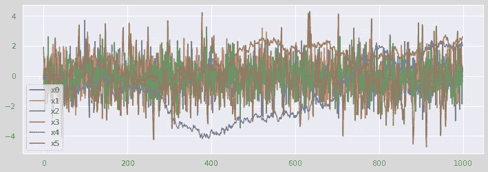
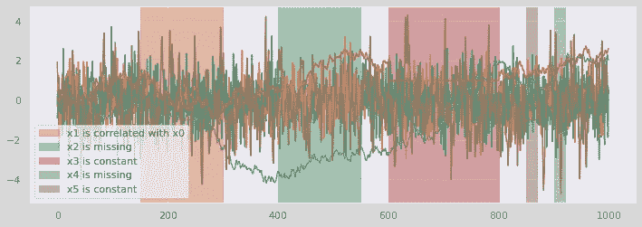
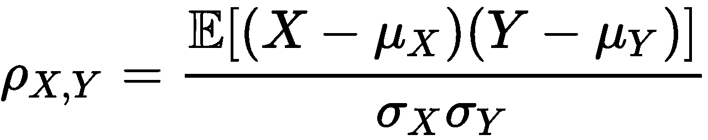
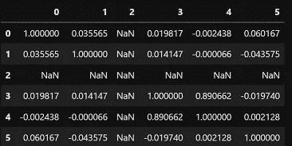
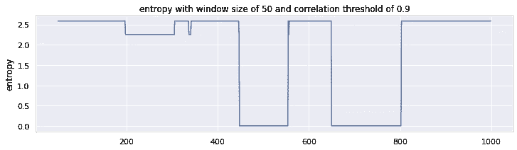
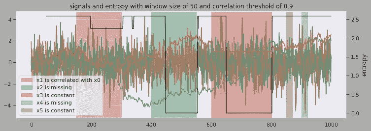

# 结构熵在多元时间序列异常检测中的新应用

> 原文：<https://towardsdatascience.com/a-new-application-of-structural-entropy-for-multivariate-time-series-anomaly-detection-1ea890bfef86>

## 如何快速找到多个信号中缺失或不变数据的出现

图片由来自[皮克斯拜](https://pixabay.com//?utm_source=link-attribution&utm_medium=referral&utm_campaign=image&utm_content=5598725)的[安娜·斯帕拉维克](https://pixabay.com/users/strodestudios-18441643/?utm_source=link-attribution&utm_medium=referral&utm_campaign=image&utm_content=5598725)拍摄

我喜欢时间序列。在这篇文章中，我将继续探索多变量时间序列，并介绍一种检测特殊异常的新方法。同样，我仍然使用熵，一个简单而强大的工具。

虽然这取决于应用程序，但我们通常可以假设我们希望我们的时间序列是**连续且变化的**，没有任何缺失值。但是由于设备错误、不正确的测量以及数据收集和存储问题，现实世界中的异常情况可能会出现。

这种异常的一个结果是特定时期的数据值丢失。另一种情况是用指示错误的唯一值替换数据，或者用先前的值填充数据。简而言之，对于那些异常时段，信号变得**缺失或恒定**。

我们可以用移动窗口扫描时间序列来识别这些异常。实现很简单。多时间序列呢？我们需要单独监控每个时间序列吗？

我将给出一个简单的解决方案，将这个问题作为多变量时间序列的异常检测问题。它不会关注单个时间序列，但如果任何时间序列丢失或不变，它仍然可以捕捉异常。

我将跳过结构熵的介绍及其在**检测相关性变化引起的异常**中的应用。如果概念对你来说是新的，请参考我的帖子，[用结构熵对多元时间序列进行异常检测](/anomaly-detection-for-multivariate-time-series-with-structural-entropy-63f9c34cb67?source=your_stories_page-------------------------------------)。

## 生成合成数据集

这次用合成数据吧。首先，生成六个时间序列。三个由高斯过程生成(x0，x1，x2)。两个是通过随机游走产生的(x3 和 x4)，一个是通过 ARMA 模型产生的(x5)。它们是独立的，不相关的。我将在下面的参考资料部分分享我的笔记本的链接。图 1 显示了结果。

情节一。合成时间序列(图片由作者提供)

接下来，我们添加一些异常部分。正如您在图 2 中看到的，有三种类型的异常:不相关变为相关，数据值缺失，数据值变为常数。

情节二。6 个具有五个异常截面的时间序列(图片由作者提供)

## 相关矩阵的一个技巧

计算结构熵依赖于滚动窗口中相关矩阵的结果。相关矩阵包含每个组合的皮尔逊相关系数。假设一个变量全部缺失或不变；当与其他变量结合时，皮尔逊相关系数是多少？

我们认为皮尔逊相关系数是由个体方差标准化的协方差(等式 1)。如果一个变量没有有效值，它的方差就不存在。如果一个变量是常数，那么它的方差是 0。对于这两种情况，等式 1 的分母将变为 Na 或 0，因此根据定义，皮尔逊相关系数**将不可用。**

等式 1(图片由作者提供)

下面是整个绿色异常部分的相关矩阵(x2 缺失)。由于 x2 的值缺失，您可以看到 x2 涉及的所有相关系数的 NaN。

图 3 相关矩阵(图片由作者提供)

现在让我们对矩阵使用一个技巧。如果我们**用 1 替换 NaN，那么 x2 将与其他变量 100%相关，并通过连接**将它们连接起来形成单个集群。一个组的熵是多少？零。

## 熵的魔力

曲线 4 示出了在应用相关矩阵计算技巧之后的结构熵，该技巧简单地是用 1 代替所有的 Na**。异常部分 1(橙色，在指数 200 到 300 附近)的熵下降，因为新构建的相关性，这是预期的。由于缺失数据或恒定数据，异常部分 2 和 3(绿色和红色)的熵下降到零。**

图 4 结构熵(图片由作者提供)

情节 5(作者图片)

我们可以将所有信息一起呈现在图 5 中。请注意，熵变成了右边的第二个 y 轴。您可能会注意到，最后两个异常区域(棕色和紫色)的熵没有变化。原因是观察或检测窗口的大小。该窗口设置有 50 个数据点。最后两个异常区的长度小于 50。这意味着在那些异常区域中，任何 50 的滚动窗口大小都有有效值，因此相关矩阵中没有 Na，最后，熵不会变为零。

## 结论

正如在[试验数据和股票市场例子](/anomaly-detection-for-multivariate-time-series-with-structural-entropy-63f9c34cb67)中看到的，结构熵比识别相关性变化提供了更多的好处。一个应用可能是**监控实时信号**。我们可以将许多时间序列组合在一起，并计算它们的熵。它不仅可以捕捉相关漂移和异常，还可以捕捉组中任何时间序列的缺失值或常数值。我们不需要监控每个人。

我们还可以将结构熵应用于多元**时间序列分段**，就像根据熵值将时间维度分割成段一样。

这种方法的缺点是，它不会明确地告诉我们哪些信号导致了异常熵值**。我们可能需要做更多的探索。我想这是一个公平的交易。我们现在可以看到几个甚至几百个时间序列的总体状况；作为交换，我们模糊了对个人的关注。我们还需要仔细选择适合数据和业务需求的窗口大小。**

**感谢阅读。**

**享受你的时间序列数据吧！**

## **参考**

**[GitHub 上的笔记本](https://github.com/ningja1/blog_notebooks/blob/main/anomaly_missing_constant/anomaly_missing_constant.ipynb)**

**[基于结构熵的多元时间序列异常检测](/anomaly-detection-for-multivariate-time-series-with-structural-entropy-63f9c34cb67?source=your_stories_page-------------------------------------)**