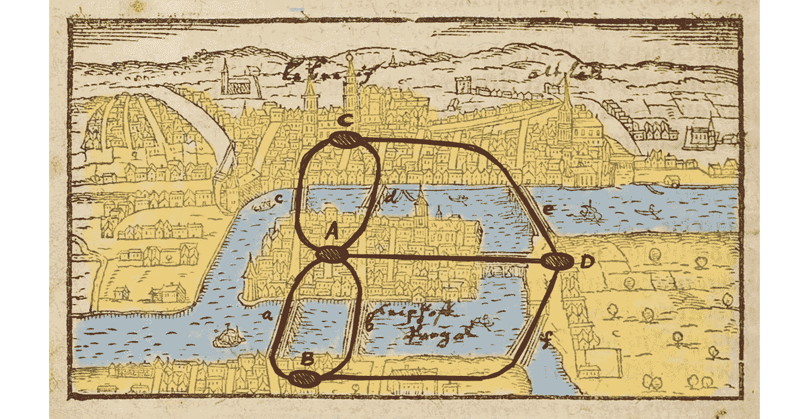
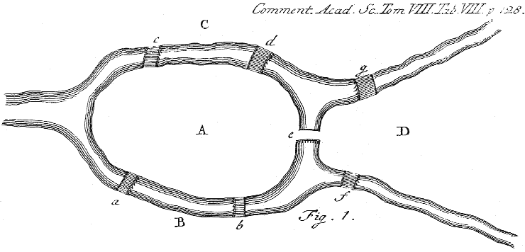
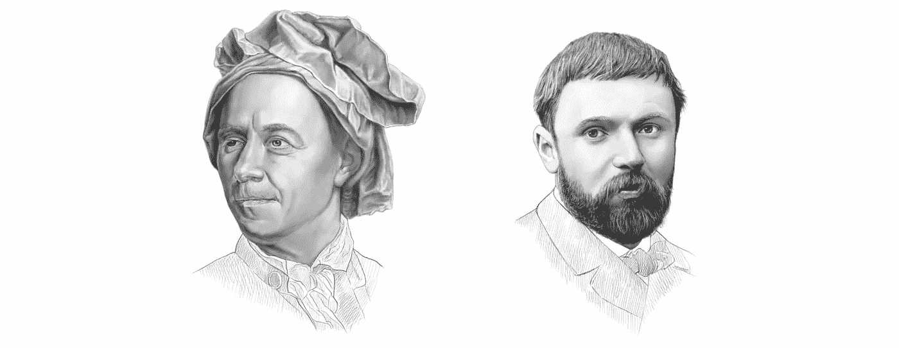
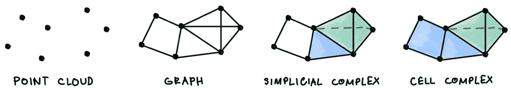
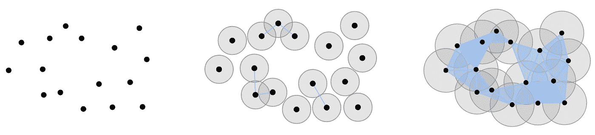
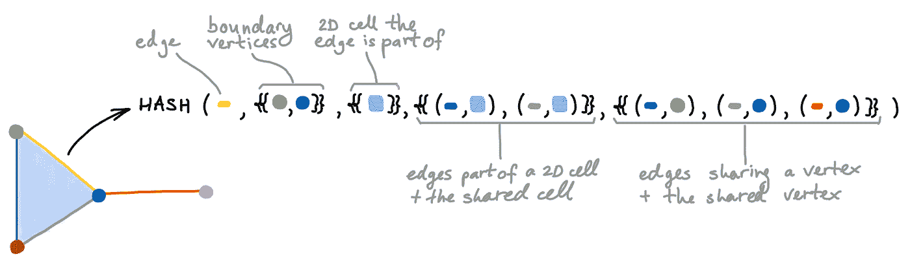
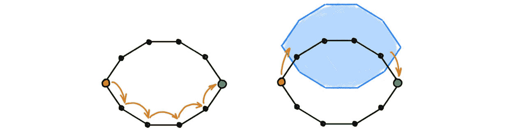
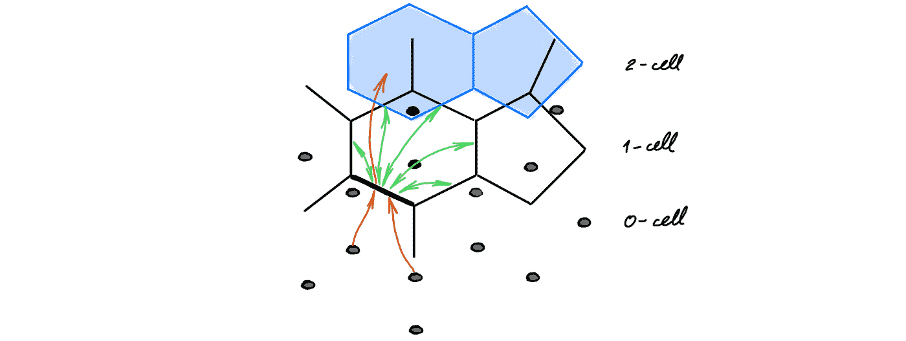
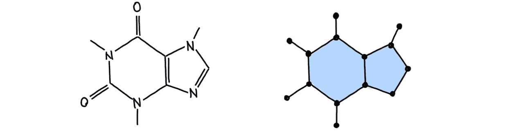
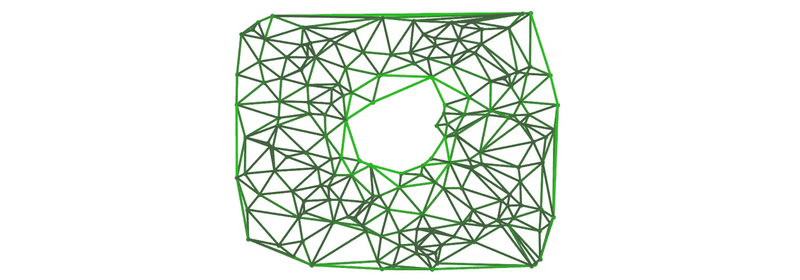

# 一种新的图形神经网络计算结构

> 原文：<https://towardsdatascience.com/a-new-computational-fabric-for-graph-neural-networks-280ea7e3ed1a>

## 拓扑空间上的学习

## **图形神经网络(gnn)通常将它们的计算图与输入图的结构对齐。但是图是 GNNs 的合适的计算结构吗？最近的一系列论文通过用来自代数拓扑领域的更一般的对象代替图来挑战这一假设，这提供了多种理论和计算优势。**

*图片:基于维基百科。*

*本文由克里斯蒂安·博德纳尔和法布里齐奥·弗拉斯卡合著，基于 c·博德纳尔、f·弗拉斯卡等人的论文* [*Weisfeiler 和 Lehman Go topology:Message Passing simplical Networks*](http://proceedings.mlr.press/v139/bodnar21a/bodnar21a.pdf)*(2021)ICML 和 c·博德纳尔、f·弗拉斯卡等人的论文* [*Weisfeiler 和 Lehman Go Cellular:CW Networks*](https://arxiv.org/pdf/2106.12575.pdf)*(2021)neur IPS。它是从微分几何和代数拓扑* *的角度看* [*图神经网络系列的一部分。另请参见讨论*](/graph-neural-networks-through-the-lens-of-differential-geometry-and-algebraic-topology-3a7c3c22d5f?source=your_stories_page----------------------------------------) [*神经扩散偏微分方程*](/graph-neural-networks-as-neural-diffusion-pdes-8571b8c0c774?sk=cf541fa43f94587bfa81454a98533e00) 、 [*图重布线与瑞奇流*](/over-squashing-bottlenecks-and-graph-ricci-curvature-c238b7169e16?sk=f5cf01cbd57b4fee8fb3a89d447e56a9) 、*和* [*细胞束*](/neural-sheaf-diffusion-for-deep-learning-on-graphs-bfa200e6afa6?sk=0b2f814a1180a64460699f6a3277053a) *系列的其他帖子。*

> “拓扑！人类思想的顶峰！在 24 世纪，它可能对某人有用。”——亚历山大·索尔仁尼琴，在第一圈 *(1968)*

raphs 被用来模拟从计算机网络到大型强子对撞机中的粒子相互作用的任何事物。使图形如此普遍的是它们的离散和组合性质，允许它们表达抽象的关系，同时仍然服从于计算。它们受欢迎的原因之一是图形抽象出了几何图形，即节点在空间中的位置或边是如何弯曲的，只留下节点如何连接的表示。图论的起源源于 1741 年莱昂哈德·欧拉在他关于*几何位置*(“位置几何”)【1】的工作中所做的观察，在该工作中，他表明了著名的柯尼斯堡[七桥](https://en.wikipedia.org/wiki/Seven_Bridges_of_K%C3%B6nigsberg)问题无解。

*七座桥问题要求寻找一条穿过柯尼斯堡城的自行车道，且不要穿过任何一座桥超过一次。正如欧拉所说，柯尼斯堡的确切形状并不重要。重要的是不同的陆地(图的节点)如何相互连接(边)。欧拉证明了当且仅当所有节点的度数都是偶数时，这种循环才存在。只有五座最初的桥保存到了现代。图片:维基百科。*

有趣的是，欧拉的发现不仅标志着图论的开始，而且通常被视为拓扑学的诞生。和图一样，拓扑学家感兴趣的是独立于特定形状或几何的空间属性。这些观点的现代表现出现在 1895 年亨利·庞加莱的开创性论文“分析情境”*。他的工作激发了人们对流形的组合描述的兴趣，从这种描述中可以更容易地找到和计算拓扑不变量。*

*莱昂哈德·欧拉(1707-1783，左)和亨利·庞加莱(1854-1912，右)。肖像:伊霍尔·高斯基。*

这些组合描述今天被称为*细胞复合体*【8】，可以被认为是图形的更高维度概括。与由节点和边组成的图不同，细胞复合体还可以包含更高维的结构或“细胞”:顶点是 0-细胞，边是 1-细胞，2D 表面是 2-细胞，等等。为了构建细胞复合体，可以通过将一个细胞的边界粘合到其他低维细胞上来进行分层。在特定情况下，当单元由单形(例如边、三角形、四面体等)形成时，这些空间也被称为*单形复形*。

图可以被看作是一组顶点，我们在这些顶点上附加边(单胞)。类似地，单纯复形和细胞复形可以被看作是我们附加 2-细胞(显示为蓝色)、3-细胞(绿色)等等的图。

# **机器学习和数据科学中的拓扑**

我们选择引用索尔仁尼琴的话来开始这篇文章[9]，与他的怀疑性格相反，人们不必等待四百年才能将拓扑学变成一种实用的工具。在[拓扑数据分析](https://en.wikipedia.org/wiki/Topological_data_analysis) (TDA)的保护下，单纯复形等拓扑结构已被用于机器学习和数据科学，这是一类出现于 20 世纪 90 年代的方法，试图以一种对度量不敏感且对噪声鲁棒的方式来分析“数据的形状”[4–7]。TDA 的起源可以追溯到 20 世纪 20 年代末，20 世纪最多产的拓扑学家之一 Leopold Vietoris [43]的工作。然而，这些技术必须等到现代计算的诞生才能大规模应用。

给定一个点云，围绕每个点的固定半径的闭球之间的交点产生一个单纯复形。通过逐渐增加球的半径，我们得到了一个嵌套的单纯复形序列。图片:巴斯蒂安·里克。

TDA 的主力是[持久同调](https://en.wikipedia.org/wiki/Persistent_homology)(PH)【7】，一种从点云中提取拓扑特征的方法。给定一个点的数据集，PH 创建一个嵌套的单纯复形序列，其中每个复形对应于一个特定的尺度，在该尺度下分析潜在的点云。然后，它会跟踪各种拓扑特征(例如，连接的组件、循环或空隙)，这些拓扑特征会随着比例的逐渐增加以及从序列中的一个复合体到下一个复合体的过渡而出现和消失。在深度学习时代，持续同源有了“第二次生命”，因为人们可以通过它反向传播，从而将已经建立的 TDA 装置整合到深度学习框架中[10–17]。

最近的一系列工作提出了几何深度学习中单纯和细胞复合体的不同用途，作为更丰富的底层拓扑空间来支持数据和在其上执行的计算。利用这一观点的最初几部作品[18–22]提出了卷积模型以及在单纯复形上操作的随机行走方法[42]。如我们的论文[24，25]所示，卷积模型可以理解为在单纯和细胞复合体上传递消息的具体实例[23–25]。因为计算是由这些空间的拓扑结构(即邻域结构)驱动的，我们将这组方法称为*拓扑消息传递。*在此框架中，相邻单元(可能具有不同维度)正在交换消息，如下所示。

*拓扑消息传递示意图。蓝色箭头表示上相邻单元之间的“水平”信息传播，即同一高维单元边界中的单元。红色箭头表示“垂直”信息传播，细胞从其边界内的低维细胞接收信息。将来自边界单元的信息汇总到一个粗略的表示中，这种计算可以被解释为一种形式的(可区分的)池。*

**超越 GNNs 中的图形**

尽管细胞复合体提供了丰富的结构，但我们不能忽视的是，图是迄今为止机器学习中最常见的拓扑对象，很少有数据集超越它们。尽管如此，我们表明人们仍然可以通过变换输入图来利用这些有趣的拓扑空间。我们将图到更高维度拓扑空间的转换称为“提升”，类似于范畴理论中的同名概念。它是一种通过遵循特定规则将高维单元附加到输入图的转换。例如，通过将一个更高维的单元附加到图的每个团或圈，可以将图提升为单元复合体。通过这样做，该图被替换为具有更多结构的不同空间，并且可以为 GNNs 提供比原始图更好的计算结构。在下文中，我们将讨论这种方法的具体优势。

*通过(例如)将 2D 封闭圆盘的边界粘合到图中的诱导循环，可以从图中构建更高维的细胞复合体。*

**高阶特征和结构。gnn 通常采用以节点为中心的观点，其中驻留在边上的数据仅被视为增强顶点之间通信的辅助信息。在拓扑信息传递中，*所有的*细胞都是一等公民。不管它们的维度如何，它们都被分配了一个特定的表示法，这个表示法是通过与相邻的细胞交换信息而演化出来的。这为明确地模拟某些高阶结构和它们之间的相互作用提供了一个方法。特别是，它提供了一种原则性的方法来演化输入图的边缘(即 1 个单元)特征，这是一大类 GNN 模型没有考虑的。**

**高阶相互作用。**根据定义*图是二元的*(成对的)，不能表示涉及两个以上对象的关系和交互【26】。当对以高阶相互作用为特征的复杂系统建模时，这可能是一个问题:例如，一个化学反应中的三种反应物可能同时相互作用。在细胞复合体中，这种情况可以通过由 2-细胞(即“填充”三角形)连接反应物来编码。因此，模型的计算流程适应高阶相互作用的存在。

*细胞 Weisfeiler-Lehman (CWL)试验[24，25]将经典的 WL 试验[27]扩展至细胞复合体。该算法的每一步都完美地散列了相邻单元的颜色(可能具有不同的维度)。*

**表现力。**消息传递 GNNs 的表达能力受到魏斯费勒-莱曼(WL)图同构测试的限制【27–29】。众所周知，WL 不能检测某些图的子结构，如三角形或圈，甚至不能区分非常简单的非同构图。在我们的论文[24，25]中，我们介绍了 WL 检验(CWL)的细胞版本，可用于检验细胞复合体的同构。当这种新测试与如上所述的图提升过程配对时，我们表明它可以区分比 WL 测试更大的图类。在某些条件下，我们提出的拓扑消息传递程序继承了这种测试的优点，与标准 GNNs [24，25，30]相比，提高了表达能力。

**不足、过度和瓶颈。**消息传递 GNNs 需要 *n* 层使 *n-* 跳远的节点进行通信。因此，当只使用几层时，相距很远的节点不能交换消息，这种现象被称为*欠到达* [31，32]。相比之下，使用过多的层可能会导致*过度平滑*【33，34】并且消息可能会在图的结构性*瓶颈*【32】中丢失。细胞复合体可以缓解这些问题，因为由高维细胞诱导的更丰富的邻近结构在可能相距很远的节点之间创建了捷径。因此，信息以有限的计算步骤有效地传播。

*GNNs 需要很多层才能让距离较远的节点进行通信(左图)。更高维度的细胞通过创建捷径来改变空间的底层拓扑结构(右图)。这使得距离较远的节点只需几个消息传递步骤就可以交换信息。*

**层次造型。**拓扑消息传递执行的计算自然是分层的，信息从低维单元流向高维单元，然后返回。这可以被视为一种“垂直”(和可区分的)池形式，与标准图形神经网络中的“水平”池相反。这保持了“压缩”图区域的归纳偏差，而没有忽略输入图的细粒度信息，这通常会损害基于池的 GNNs 的性能。

拓扑消息传递允许信息在不同维度的单元之间分层传递。

**结构域比对。**某些应用自然与细胞复合体的结构一致。例如，分子的原子、键和化学环可以表示为 0-细胞、1-细胞和 2-细胞。分子的物理结构和细胞复合体表示之间的直接对应自然地允许拓扑消息传递利用前述特性。使用这些表示，我们表明拓扑消息传递在分子性质预测任务中实现了最先进的结果[25]。其他排列良好的应用程序可以包括计算机图形应用程序中的离散流形(网格)、社交网络(其中派系尤为重要)或空间图形，如谷歌地图(其中街道之间的街区可以自然地表示为“立方体”单元)。

咖啡因分子被模拟成二维细胞复合体。

# **拓扑和微分几何相遇的地方**

拓扑消息传递保留了许多与代数拓扑和微分几何的有趣联系，允许利用迄今为止在图形和几何深度学习中尚未开发的数学工具。

**洞代数与方向等方差。**在代数拓扑中，人们通常使用面向*的*单形复形，其中每个单形都有一个任意的“方向”。例如，对于每条边，我们选择一个源节点和一个目标节点，对于每个三角形，我们选择一个顺序来遍历它的节点。一旦选择了一个方向，我们就可以在复形上进行有趣的代数运算，例如通过“边界算子”计算某些单形的边界。这些代数操作也可以用来寻找单纯复形中的“洞”——没有边界的区域，它们不在其他东西的边界上。在引擎盖下，持续同源依赖于这些计算来检测拓扑特征。

应用于 2-单纯形的边界算子产生一个三角形。再次将运算符应用于三角形，会得到零，因为三角形是一个循环，因此它没有边界。

拓扑消息传递可以被视为代数运算符(如边界运算符)的(非线性)推广。因此，拓扑消息传递必须有类似的行为:我们希望各层的输出“一致地”响应输入复合体方向的变化。换句话说，我们希望我们的层是*方向等变的*。在我们的工作[24]中，我们研究了拓扑消息传递如何通过选择正确的非线性和消息传递函数来满足这一特性。同时，这也在纯卷积环境中进行了检验[20]。

**区分拓扑空间。**第一批已知的拓扑不变量之一，欧拉特征[8，41]，最初用于柏拉图立体的分类。我们可以把它定义为每个维度上细胞数量的交替总和。令人惊讶的是，如果两个细胞复合体是同胚的，这些和将是相同的，即使它们是同一空间的非常不同的离散。

一个有趣的事实是，拓扑消息传递模型的读出操作可以很容易地计算这个拓扑不变量，因为它在每个维度的单元上应用了置换不变量归约。因此，这种类型的模型通过构造来区分某些*非*同胚的空间(即具有不同的欧拉特征)。从计算的角度来看，这可以被视为 WL 测试的一般化，其中我们不只是对确定两个细胞复合体是否严格相同感兴趣，而是对它们是否彼此同胚感兴趣。

**离散 Hodge 理论**为细胞复合体的拓扑性质提供了更具几何意义的解释。当与 *k* 细胞相关的特征符号取决于 k 细胞的方向时，这些特征在数学上可以被视为微分几何中微分 k 形式的离散版本(即可以被积分的 k 维体积元素)[45]。对图拉普拉斯进行一般化的拉普拉斯算子，称为 [*霍奇拉普拉斯*](https://en.wikipedia.org/wiki/Laplace_operators_in_differential_geometry#Hodge_Laplacian)【21，44】，可以作用于这些微分形式。可以看出，基于该拉普拉斯算子的扩散 PDE 在极限下收敛于与复合体的空穴相关的信号[44]。

基于 Hodge Laplacian 的扩散 PDE 收敛于初始微分形式到 Laplacian 的核上的投影的极限。这张图片显示了霍奇拉普拉斯的零特征向量如何在复杂的洞周围取高值。图片:安德烈·波佩斯库。

第一个单纯神经网络模型[18–20]实际上是基于 Hodge Laplacian 的卷积模型，它反过来受到拓扑信号处理的启发[21，22]。最近，基于该算子版本的卷积模型被用于解决计算代数拓扑中的 NP-hard 问题[35]。

# **最终想法**

**这些只是伪装的图形吗？**最近的论文【36，37】认为，其中，拓扑消息传递方法只不过是对编码细胞复合体结构的修改图进行操作的消息传递 GNN。这对于卷积模型来说当然是正确的，其消息传递计算涉及成对的信元。然而，在其最一般的形式中，消息函数允许较高维度的细胞在它们的边界上调制在较低维度的细胞之间传递的消息。这(通常)不再可能通过图中的常规消息传递来实现，因为一条边恰好连接两个节点，而 2-cell 可以连接任意多条边。

在这两种情况下，计算都是由数据附加到的底层空间的拓扑驱动的。我们认为，在消息传递中采用这种拓扑观点的好处远远超出了纯粹的计算考虑。除了有价值的数学联系之外，它还为其他数学和计算学科开启了研究话语，并有利于我们往往过于单一的社区之间的积极交叉授粉。

拓扑消息传递的下一步是什么？我们预测拓扑消息传递方法的两个主要未来方向。首先，GNNs 多年来开发的许多架构(如注意机制[38，39])将很可能在这些新的拓扑空间中采用，同时利用它们的具体特征。第二，来自代数拓扑领域的其他数学对象和工具(包括像细胞束[40]这样的结构，即使对最精通数学的 ML 研究人员来说也可能听起来很奇怪)将被图形和几何深度学习社区采用。这种方法既能为老问题提供答案，也能帮助解决新问题，或者，正如[罗伯特·格里斯特所说的](https://www.maa.org/meetings/calendar-events/putting-topology-to-work):“新的挑战需要新的数学”。

[1] L .欧拉，solution problematis ad geometriam situs pertinentis(1741)，ene strm 53，[欧拉档案](https://scholarlycommons.pacific.edu/euler-works/53/)。

[2]粗略地说，拓扑学使用邻域的概念，而不是距离或角度的概念，它们是几何构造。

[3] H .庞加莱，分析现状(1895 年)，《综合技术学院学报》。

[4] P. Frosini，欧几里得空间的子流形的相似类的距离(1990)，澳大利亚数学学会通报 42(3):407–415。

[5] H. Edelsbrunner 等人，拓扑持续性和简化(2002)，离散和计算几何 28(4):511–533。

[6] G. Carlsson,《拓扑与数据》( 2009 年),《美国数学学会公报》46:255–308。

[7] H. Edelsbrunner 和 J. Harer。计算拓扑:导论(2010)，美国数学学会。

[8] A. Hatcher，代数拓扑(2002)，剑桥大学出版社。

[9]原文为俄文:“топология！Стратосфера человеческой мысли!В двадцать четвёртом столетии она, может быть, и понадобится кому-нибудь."在小说中，这一判断是由半自传体人物格莱布·涅尔津(Gleb Nerzhin)宣布的，他是一位数学家，正在努力解决浮士德式的问题，即是否要从事有助于斯大林政权的应用研究。作者亚历山大·索尔仁尼琴本身就是一名训练有素的数学家，参见罗伯特·格里斯特讲座的注释，我们从其中剽窃了这段引文。

[10] M. Horn，E. De Brouwer 等人[拓扑图神经网络](https://arxiv.org/abs/2102.07835) (2022)，ICLR。

[11] R. Gabrielsson 等人，[一个用于机器学习的拓扑层](https://arxiv.org/abs/1905.12200) (2020)，AISTATS。

[12] M. Moor 等人，[拓扑自动编码器](https://arxiv.org/abs/1906.00722) (2020)，ICML。

[13] C. Hofer 等人，[具有拓扑签名的深度学习](https://arxiv.org/abs/1707.04041) (2017)，NIPS。

[14] C. Hofer 等人，[通过持续同源进行连通性优化的表征学习](https://proceedings.mlr.press/v97/hofer19a.html) (2019)，ICML。

[15] C. Hofer 等人，[持久性条形码的学习表征](https://jmlr.org/papers/v20/18-358.html) (2019)，JMLR 20(126):145，2019。

[16] C. Hofer 等人，[图过滤学习](https://arxiv.org/abs/1905.10996) (2020)，ICML

[17] C. Hofer 等人，[拓扑增密分布](https://arxiv.org/abs/2002.04805) (2020)，ICML

[18] E. Bunch 等人 [Simplicial 2-complex 卷积神经网络](https://arxiv.org/abs/2012.06010) (2020)，NeurIPS 拓扑数据分析及其他研讨会。

[19] S. Ebli 等人[单纯神经网络](https://arxiv.org/abs/2010.03633) (2020)，NeurIPS 拓扑数据分析研讨会及其他。

[20] M. T. Roddenberry，N. Glaze 和 S. Segarra，[用于轨迹预测的原则性单纯神经网络](http://proceedings.mlr.press/v139/roddenberry21a/roddenberry21a.pdf) (2021)，ICML。

[21] S .巴巴罗萨等人[单纯复形上的拓扑信号处理](https://arxiv.org/abs/1907.11577) (2020)，IEEE 信号处理汇刊 68:2992–3007。

[22] S. Sardellitti 等人[细胞复合体上的拓扑信号处理](https://arxiv.org/pdf/2112.06709) (2021)，Asilomar 信号、系统和计算机会议。

[23] M. Hajij 等人[细胞复杂神经网络](https://arxiv.org/abs/2010.00743) (2020)，NeurIPS 拓扑数据分析及其他研讨会。

[24] C .，f .，Y. G .王，g .蒙图法尔等[魏斯费勒和雷曼 go 拓扑:消息传递单纯网络](https://arxiv.org/abs/2103.03212) (2021)著。

[25] C .博德纳尔、f .弗拉斯卡等人[魏斯费勒和雷曼 go Cellular: CW Networks](https://arxiv.org/abs/2106.12575) (2021)，NeurIPS。

[26] F .巴蒂斯顿等人，[复杂系统中高阶相互作用的物理学](https://www.nature.com/articles/s41567-021-01371-4) (2021)，自然物理学 17:1093–1098。

[27] B. Weisfeiler 和 A. Leman，[将一个图简化为标准形式以及其中出现的代数](https://www.iti.zcu.cz/wl2018/pdf/wl_paper_translation.pdf) (1968)，Nauchno-Technicheskaya informatisia 2(9):12–16。关于 WL 测试和 GNNs 的关系，见[帖子](/expressive-power-of-graph-neural-networks-and-the-weisefeiler-lehman-test-b883db3c7c49?sk=5c2a28ccd38db3a7b6f80f161e825a5a)。有关深入的评论(和历史笔记)，请参见 C. Morris 等人的文章， [Weisfeiler 和 Leman go Machine Learning:the story 迄今为止](https://arxiv.org/abs/2112.09992) (2021) arXiv:2112.09992。

[28] K. Xu 等，[图神经网络到底有多强大？](https://arxiv.org/abs/1810.00826) (2019)，ICLR。

[29] C. Morris 等人， [Weisfeiler 和 Leman Go Neural:高阶图神经网络](https://arxiv.org/abs/1810.02244) (2019)，AAAI。

[30]我们注意到，与我们的方法正交的是 WL 测试的持久版本，由 B. Rieck 等人提出，[图分类的持久 Weisfeiler-Lehman 程序](https://proceedings.mlr.press/v97/rieck19a.html) (2019)，ICML。同时，持续的同源性也被用来使 GNNs 比 WL 测试更有表达力[10]。

[31] P. Barceló等人，图形神经网络的逻辑表达能力(2020 年)，ICLR。

[32] U. Alon 和 E. Yahav，[关于图神经网络的瓶颈及其实际意义](https://openreview.net/forum?id=i80OPhOCVH2) (2021)，ICLR。

[33] K. Oono 和 t .铃木，[图形神经网络对节点分类的表达能力指数性丧失](https://openreview.net/pdf?id=S1ldO2EFPr) (2020)，ICLR。

[34]蔡春华，王永元，[关于图神经网络过光滑问题的一个注记](https://arxiv.org/abs/2006.13318) (2020)，arXiv:2006.13318 .

[35] A. D. Keros 等人， [Dist2Cycle:用于同源定位的单纯神经网络](https://arxiv.org/abs/2110.15182) (2021)，AAAI。

[36]p .[veli kovi](https://openreview.net/profile?id=~Petar_Veli%C4%8Dkovi%C4%871)，[消息一路向上传递](https://openreview.net/forum?id=Bc8GiEZkTe5) (2022)，ICLR 几何与拓扑表征学习研讨会。

[37] F. Jogl 等人[将细胞复合体的学习简化为图形](https://openreview.net/forum?id=HKUxAE-J6lq) (2022)，ICLR 几何和拓扑表示学习研讨会。

[38] C. W. J. Goh 等人[单纯注意力网络](https://openreview.net/forum?id=ScfRNWkpec) (2022)，ICLR 几何和拓扑表示学习研讨会。

[39] L. Giusti 等人，[单纯注意神经网络](https://arxiv.org/abs/2203.07485) (2022)，arXiv:2203.07485。

[40] C .博德纳尔，f .迪·乔瓦尼等人，[神经束扩散:GNNs 中异嗜性和过度光滑的拓扑透视](https://arxiv.org/abs/2202.04579) (2022) arXiv:2202.04579。另请参见随附的[帖子](/neural-sheaf-diffusion-for-deep-learning-on-graphs-bfa200e6afa6)。

[41] L. Euler,《团结的理论基础》( 1758 年),《石油政治科学院新评论》: 109-140 页。

[42] C. Hacker，k-simplex 2 vec:node 2 vec 的单纯扩展(2020 年)，NeurIPS 拓扑数据分析研讨会及其他。

[43] L. Vietoris，1927 年，《数学年鉴》97:454-472。

[44] A. Muhammad 和 M. Egerstedt，在网络拓扑中使用高阶拉普拉斯算子的控制(2006)，网络和系统数学理论国际研讨会。

[45]当局限于边缘时，这些信号可以很好地解释为通过网络的流动。例如，参见 T. Gebhart 等人的《随波逐流？使用 Hodge 理论 (2021)对美国医疗保健服务网络进行大规模分析，IEEE 大数据 2021，作为拓扑数据分析应用于大数据研讨会的一部分。

我们非常感谢 Ben Chamberlain 和 Bastian Rieck 对这篇文章的校对。关于图形深度学习的其他文章，请参见我在《走向数据科学》中的 [*其他帖子*](https://towardsdatascience.com/graph-deep-learning/home) *，* [*订阅我的帖子*](https://michael-bronstein.medium.com/subscribe) *和* [*YouTube 频道*](https://www.youtube.com/c/MichaelBronsteinGDL) *，获取* [*中等会员*](https://michael-bronstein.medium.com/membership) *，或者关注我的* [*Twitter*](https://twitter.com/mmbronstein)