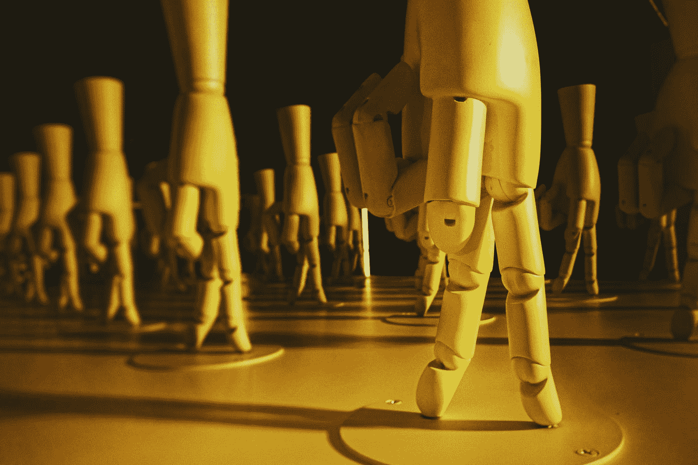
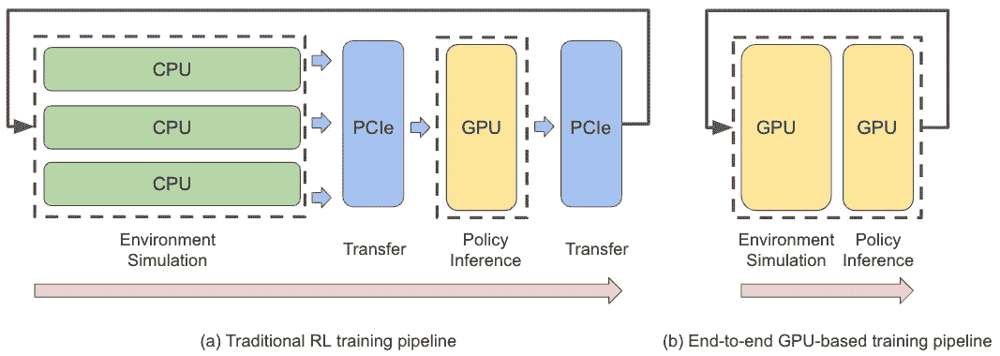
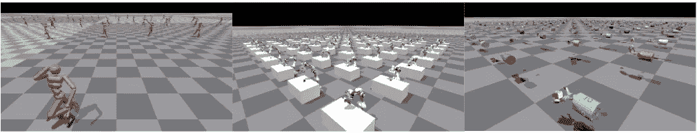
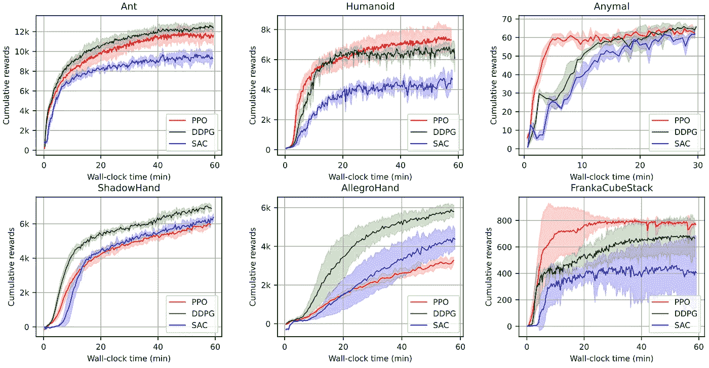
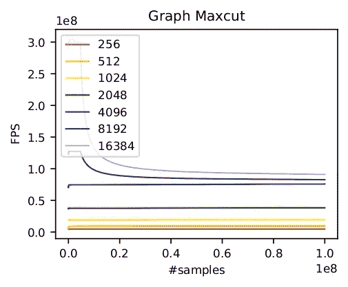
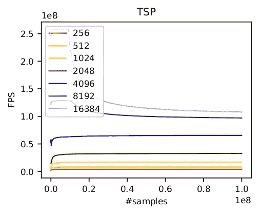

# 大规模并行模拟的新时代

> 原文：<https://towardsdatascience.com/a-new-era-of-massively-parallel-simulation-a-practical-tutorial-using-elegantrl-5ebc483c3385>

## 使用 ElegantRL 的实用教程



[Jason Yuen](https://unsplash.com/@fanfandyuen?utm_source=medium&utm_medium=referral) 在 [Unsplash](https://unsplash.com?utm_source=medium&utm_medium=referral) 上的照片

> *最近强化学习的一个突破是，GPU 加速的模拟器，如 NVIDIA 的* Isaac Gym *实现了* ***大规模并行模拟*** *。它在一个工作站 GPU 上运行数千个并行环境，并将数据收集过程加快了 2~3 个数量级。*

Steven Li 和的这篇文章解释了大规模并行模拟的最新突破。它还通过使用云原生开源强化学习(RL)库 *ElegantRL* 的实用教程，讲述了**如何训练机器人在 10 分钟内解决 Isaac Gym 基准任务**和**如何从头开始构建自己的并行模拟器**。

[](https://github.com/AI4Finance-Foundation/ElegantRL) [## GitHub-ai 4 finance-Foundation/ElegantRL:Cloud-native 深度强化学习。🔥

### ElegantRL(网站)是为从业者开发的，具有以下优势:云原生:遵循云原生…

github.com](https://github.com/AI4Finance-Foundation/ElegantRL) 

# 什么是 GPU 加速模拟？

与大多数数据驱动的方法类似，强化学习(RL)是数据饥渴的——一个相对简单的任务可能需要数百万次转换，而学习复杂的行为可能需要更多。

加速数据收集过程的一种自然而直接的方法是拥有多个环境，并让代理与它们并行交互。在 GPU 加速模拟器之前，使用基于 CPU 的模拟器(如 MuJoCo 和 PyBullet)的人通常需要一个 CPU 集群来实现这一点。例如，OpenAI 使用了几乎 30，000 个 CPU 核心(920 个工作机，每个 32 个核心)来训练一个机器人解魔方[1]。如此巨大的计算需求对于大多数研究人员和从业者来说是不可接受的！

幸运的是，多核 GPU 天然适合高度并行仿真，最近的一个突破是 NVIDIA 发布的*is AAC Gym*【2】，这是一个端到端 GPU 加速的机器人仿真平台。在 GPU 上运行模拟有几个优点:

1.  允许使用单个 GPU 同时运行**数万个**环境，
2.  加速每个环境前进一步，包括物理模拟，状态和奖励计算等。,
3.  避免在 CPU 和 GPU 之间来回传输数据，因为神经网络推理和训练位于 GPU 上。



图 1:传统 RL 训练流水线和基于 GPU 的端到端训练流水线之间的比较。[图片来自作者]

# 艾萨克体育馆机器人基准环境

Isaac Gym 提供了从运动到操作的一系列不同的机器人基准任务。为了使用 RL 成功训练机器人，我们展示了如何使用大规模并行库 *ElegantRL* 。

现在，ElegantRL 完全支持 Isaac 健身房环境。在下面的六个机器人任务中，我们展示了在 ElegantRL 中实现的三个常用深度 RL 算法 PPO [3]、DDPG [4]和 SAC [5]的性能。请注意，我们在任务中使用不同数量的并行环境，从 4，096 到 16，384 个环境不等。



图 2:三个艾萨克健身房任务:人形，弗兰卡立方体堆叠，快板手(从左到右)。[图片来自作者]



图 3:六项艾萨克健身任务的表现。[图片来自作者]

对比之前的魔方例子需要一个 CPU 集群，需要几个月的训练，我们可以在 30 分钟内解决一个类似的影手重定位任务！

# 从头开始构建自己的模拟器

有没有可能像艾萨克健身房一样，自己搭建一个基于 GPU 的模拟器？答案是肯定的！在本教程中，我们提供两个组合优化问题的例子:[图最大割](https://en.wikipedia.org/wiki/Maximum_cut)和[旅行商问题](https://en.wikipedia.org/wiki/Travelling_salesman_problem) (TSP)。

传统的 RL 环境主要由三个功能组成:

*   init():定义环境的关键变量，比如状态空间和动作空间。
*   step():接受一个动作作为输入，运行环境动力学的一个时间步长，并返回下一个状态、奖励和完成信号。
*   reset():重置环境并返回初始状态。

大规模并行环境具有类似的功能，但是接收和返回一批状态、动作和奖励。考虑最大割问题:给定一个图 *G* = ( *V* ， *E* )，其中 *V* 是节点的集合， *E* 是边的集合，找出使割集的权重最大化的子集 *S* ⊆ *V*


其中 *w* 是存储每个节点对之间权重的*邻接对称矩阵。因此，有了 *N 个*节点，*

*   状态空间:大小为 *N* × *N* 的邻接对称矩阵和大小为 *N* 的当前割集
*   动作空间:尺寸为 *N* 的割集
*   奖励函数:割集的权重之和

## **第一步:生成邻接对称矩阵并计算奖励 *:***

```
def generate_adjacency_symmetric_matrix(self, sparsity): # sparsity for binary
  upper_triangle = torch.mul(torch.rand(self.N, self.N).triu(diagonal=1), (torch.rand(self.N, self.N) < sparsity).int().triu(diagonal=1))
  adjacency_matrix = upper_triangle + upper_triangle.transpose(-1, -2)
  return adjacency_matrix # num_env x self.N x self.N

def get_cut_value(self,  adjacency_matrix, configuration):
  return torch.mul(torch.matmul(configuration.reshape(self.N, 1), (1 - configuration.reshape(-1, self.N, 1)).transpose(-1, -2)), adjacency_matrix).flatten().sum(dim=-1)
```

## **第二步:使用 vmap 批量执行函数**

在本教程中，我们使用 PyTorch 的 [vmap](https://pytorch.org/functorch/stable/generated/functorch.vmap.html) 函数在 GPU 上实现并行计算。vmap 函数是一个矢量化地图，它将函数作为输入并返回其矢量化版本。因此，我们基于 GPU 的 max cut 环境可以实现如下:

```
import torch
import functorch
import numpy as np

class MaxcutEnv():
  def __init__(self, N = 20, num_env=4096, device=torch.device("cuda:0"), episode_length=6):
      self.N = N
      self.state_dim = self.N * self.N + self.N # adjacency mat + configuration
      self.basis_vectors, _ = torch.linalg.qr(torch.randn(self.N * self.N, self.N * self.N, dtype=torch.float))
      self.num_env = num_env
      self.device = device
      self.sparsity = 0.005
      self.episode_length = episode_length
      self.get_cut_value_tensor = functorch.vmap(self.get_cut_value, in_dims=(0, 0))
      self.generate_adjacency_symmetric_matrix_tensor = functorch.vmap(self.generate_adjacency_symmetric_matrix, in_dims=0)

  def reset(self, if_test=False, test_adjacency_matrix=None):
      if if_test:
          self.adjacency_matrix = test_adjacency_matrix.to(self.device)
      else:
          self.adjacency_matrix = self.generate_adjacency_symmetric_matrix_batch(if_binary=False, sparsity=self.sparsity).to(self.device)
      self.configuration = torch.rand(self.adjacency_matrix.shape[0], self.N).to(self.device).to(self.device)
      self.num_steps = 0
      return self.adjacency_matrix, self.configuration

  def step(self, configuration):
      self.configuration = configuration   # num_env x N x 1
      self.reward = self.get_cut_value_tensor(self.adjacency_matrix, self.configuration)
      self.num_steps +=1
      self.done = True if self.num_steps >= self.episode_length else False
      return (self.adjacency_matrix, self.configuration.detach()), self.reward, self.done
```

我们也可以类似地实现 TSP 问题。如下所示，我们在一个 A100 GPU 上测试了基于 GPU 的环境的每秒帧数(FPS)。首先，在这两个任务中，随着使用更多的并行环境，FPS 线性增加。然而， **GPU 利用率实际上限制了并行环境的数量**。一旦 GPU 利用率达到最大，更多并行环境带来的加速会明显下降。在 max cut 中大约有 8，192 个环境会发生这种情况，在 TSP 中大约有 16，384 个环境会发生这种情况。因此，基于 GPU 的环境的最佳性能在很大程度上取决于 GPU 类型和任务的复杂性。



图 4:图 Maxcut 和 TSP 的每秒帧数。[图片来自作者]

最后，我们给出了[最大割](https://github.com/AI4Finance-Foundation/RLSolver/blob/main/helloworld/graph_maxcut/vecenv_matcut.py)问题和 [TSP](https://github.com/AI4Finance-Foundation/RLSolver/blob/main/helloworld/tsp/env_tsp.py) 问题的源代码。

# 结论

大规模并行模拟在数据驱动方法中具有巨大的潜力。它不仅可以加快数据收集过程和加速工作流程，而且为研究概括和探索问题提供了新的机会。例如，一个智能代理**可以简单地与数千个环境交互，其中每个环境包含不同的对象，以学习健壮的策略，**或**可以针对不同的环境利用不同的探索策略，以获得不同的数据**。因此，如何有效地利用这个奇妙的工具仍然是一个挑战！

希望这篇文章能为你提供一些见解。如果你对更多感兴趣，请关注我们的开源社区[和](https://github.com/AI4Finance-Foundation)[回购](https://github.com/AI4Finance-Foundation/ElegantRL)并加入我们的 [slack](https://ai4financeworkspace.slack.com/join/shared_invite/zt-v670l1jm-dzTgIT9fHZIjjrqprrY0kg#/shared-invite/email) ！

# 参考

[1] Akkaya，Ilge，Marcin Andrychowicz，Maciek Chociej，Mateusz Litwin，Bob McGrew，Arthur Petron，Alex Paino 等人*用机器手解魔方*。 *arXiv 预印本 arXiv:1910.07113，* 2019。

[2]维克多·马科维奇丘克，卢卡什·，·郭，米歇尔·卢，基尔·斯托里，迈尔斯·麦克林，大卫·赫勒，尼基塔·鲁丁，阿瑟·奥尔希尔，安库尔·汉达，等.*艾萨克健身房:基于高性能 GPU 的机器人学习物理仿真*。NeurIPS，数据集和基准专题，2021 年。

[3] J .舒尔曼、f .沃尔斯基、普拉富拉·德里瓦尔、亚历克·拉德福德和奥列格·克里莫夫。*近似策略优化算法*。ArXiv，abs/1707.06347，2017。

[4]斯科特·藤本、赫克·霍夫和大卫·梅格。*解决 actor-critic 方法中的函数近似错误*。2018 年机器学习国际会议。

[5] Tuomas Haarnoja、Aurick Zhou、P. Abbeel 和 Sergey Levine。*软行动者-批评家:具有随机行动者的非策略最大熵深度强化学习*。2018 年机器学习国际会议。