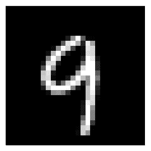
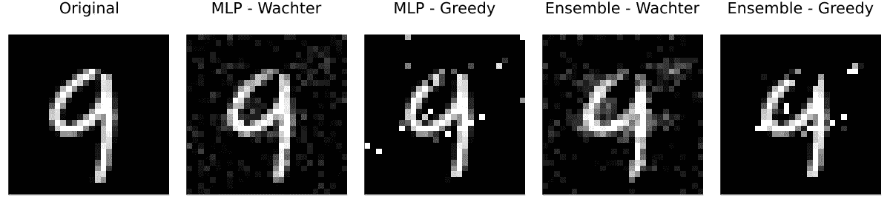
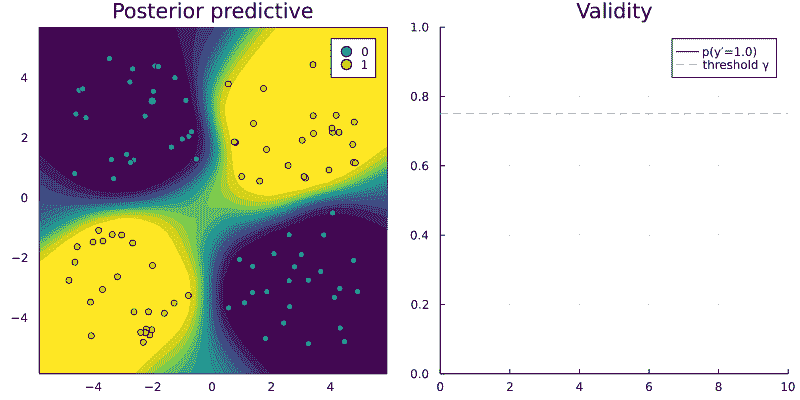

# 可解释人工智能的新工具

> 原文：<https://towardsdatascience.com/a-new-tool-for-explainable-ai-65834e757c28>

## 通过反事实解释在 Julia、Python 和 R 中训练的模型



把 9 变成 4。图片作者。

我在之前的[帖子](/individual-recourse-for-black-box-models-5e9ed1e4b4cc)中介绍的反事实解释，提供了一种简单直观的方式来解释黑盒模型，而无需打开它们。尽管如此，到今天为止，只有一个开源库提供了一种统一的方法来为用 Python 构建和训练的模型生成和测试反事实解释(Pawelczyk et al. 2021)。这很棒，但是对于其他编程语言🥲.的用户来说用处有限

输入`[CounterfactualExplanations.jl](https://www.paltmeyer.com/CounterfactualExplanations.jl/stable/)`:一个 Julia 包，可以用来解释用 Julia、Python 和 r 开发和训练的机器学习算法，反事实解释属于更广泛的可解释人工智能范畴(XAI)。

可解释的人工智能通常涉及模型，这些模型本身不可解释，但需要额外的工具才能对人类进行解释。后者的例子包括集成、支持向量机和深度神经网络。这不要与可解释的人工智能混淆，后者涉及本质上可解释和透明的模型，如通用加法模型(GAM)、决策树和基于规则的模型。

一些人会认为，我们最好避免解释黑盒模型(Rudin 2019)，而是只关注可解释的人工智能。虽然我同意最初的努力应该总是面向可解释的模型，停止在那里将意味着错过机会，而且无论如何在达尔-E 公司的时代可能是不太现实的

> *尽管[……]可解释性非常重要，并且应该加以追求，但原则上可以在不打开“黑匣子”的情况下提供解释。*
> 
> *-沃希特、米特斯塔特、罗素(*[*2017*](https://www.paltmeyer.com/blog/posts/a-new-tool-for-explainable-ai/#ref-wachter2017counterfactual)*)*

这篇文章介绍了新的 Julia 包的主要功能。通过一个使用 Julia 中训练的模型的激励性示例，我们将看到如何轻松地调整该包，以与 Python 和 r 中训练的模型一起工作。因为这篇文章的动机也是希望吸引贡献者，所以最后一节概述了我们计划的一些令人兴奋的开发。

# 图像数据🖼的反事实

为了介绍反事实的解释，我在之前的[帖子](/individual-recourse-for-black-box-models-5e9ed1e4b4cc)中使用了一个简单的二元分类问题。它包括一个线性分类器和一个线性可分的合成数据集，只有两个特征。这一次我们将更进一步:我们将从 MNIST 数据中得出反事实的解释。MNIST 数据集包含 60，000 个 28×28 像素灰度图像形式的手写数字训练样本(LeCun 1998)。每个图像都与一个标签相关联，该标签指示图像所代表的数字(0–9)。

`[CounterfactualExplanations.jl](https://www.paltmeyer.com/CounterfactualExplanations.jl/stable/)`包附带了两个黑盒模型，它们被训练来预测这些数据的标签:首先，一个简单的多层感知器(MLP ),其次，一个相应的深度集成。最初由 Lakshminarayanan、Pritzel 和 Blundell (2016)提出，深度集成实际上只是深度神经网络的集成。它们仍然是贝叶斯深度学习最流行的方法之一。有关贝叶斯深度学习的更多信息，请参见我之前的帖子:[ [TDS](/go-deep-but-also-go-bayesian-ab25efa6f7b) ，[ [博客](https://www.paltmeyer.com/blog/posts/effortsless-bayesian-dl/)。

# 黑盒模型

虽然该包目前可以处理一些简单的分类模型，但它被设计成可以通过用户和贡献者轻松扩展。扩展包以处理自定义模型通常只涉及两个简单的步骤:

1.  **子类型**:自定义模型需要声明为包内部类型`AbstractFittedModel`的子类型。
2.  **多分派**:包内部函数`logits`和`probs`需要通过新型号类型的自定义方法进行扩展。

实现这两个步骤的代码可以在我自己博客上相应的[帖子](https://www.paltmeyer.com/blog/posts/a-new-tool-for-explainable-ai/#black-box-models)中找到。

# 反事实生成器

接下来，我们需要指定我们想要使用的反事实生成器。该软件包目前附带了两个默认生成器，都需要梯度访问:首先，由沃希特、米特斯塔特和罗素(2017)引入的通用生成器，其次，由舒特等人(2021)引入的贪婪生成器。

greedy generator 设计用于预测中包含不确定性的模型，如上面介绍的 deep ensemble。它适用于概率(贝叶斯)模型，因为它们只在由训练样本填充的特征域区域中产生高置信度的预测。只要模型具有足够的表现力和良好的指定性，这些区域中的反事实将总是现实的和明确的，因为通过构造它们应该看起来非常类似于训练样本。其他流行的反事实解释方法，如 REVISE (Joshi 等人，2019 年)和 CLUE (Antorán 等人，2020 年)也在玩这个简单的想法。

下面两行代码实例化了当前问题的两个生成器:

```
generic = GenericGenerator(;loss=:logitcrossentropy) 
greedy = GreedyGenerator(;loss=:logitcrossentropy)
```

# 说明

一旦指定了模型和反事实生成器，使用这个包运行反事实搜索就非常容易了。对于给定的事实(`x`)、目标类(`target`)和数据集(`counterfactual_data`)，只需运行

```
generate_counterfactual(x, target, counterfactual_data, M, generic)
```

将生成结果，在本例中使用通用生成器(`generic`)生成 MLP ( `M`)。因为我们已经指定了两个不同的黑盒模型和两个不同的反事实生成器，所以我们总共有一个模型和一个生成器的四种组合。对于这些组合中的每一个，我都使用了`generate_counterfactual`函数来产生图 1 中的结果。

在每种情况下，期望的标签转换实际上都实现了，但从人类的角度来看，可以说只有深度系综的反事实看起来像 4。通用生成器在从人类角度看似乎不相关的区域产生轻微的扰动，但仍然产生可以作为 4 的反事实。贪婪的方法明显地瞄准了手写的 9 的顶部的像素，并且产生了总体上最好的结果。对于非贝叶斯 MLP，一般方法和贪婪方法都会产生看起来很像对立例子的反事实:它们扰乱了图像上看似随机区域的像素。



图 1:对 MNIST 的反事实解释:把 9 变成 4。图片作者。

# 语言互用性👥

Julia 语言为编程语言互操作性提供了独特的支持。例如，分别通过`RCall.jl`和`PyCall.jl`调用 R 或 Python 变得非常容易。这个功能可以用来使用`CounterfactualExplanations.jl`为用其他编程语言开发的模型生成解释。目前还没有对外国编程语言的本地支持，但是下面的例子涉及一个在`R`训练的`torch`神经网络，展示了这个包是多么的通用。涉及`PyTorch`的相应例子是类似的，因此省略，但在这里[可用](https://www.paltmeyer.com/CounterfactualExplanations.jl/dev/tutorials/interop/)。

# 解释在 R 中训练的模型

我们将考虑为二进制分类任务训练的简单 MLP。和以前一样，我们首先需要修改这个定制模型以用于我们的包。两个必要步骤(子类型和方法扩展)下面的代码。Logits 由`torch`模型返回，并从 R 环境复制到 Julia 范围。然后通过 sigmoid 函数传递 logits，在 Julia 范围内计算概率。

采用在 R 中训练的定制火炬模型用于反事实解释。

与在 Julia 中训练的模型相比，我们需要在这一点上做更多的工作。由于我们的反事实生成器需要梯度访问，我们本质上需要允许我们的包与 R `torch`库通信。虽然这可能听起来令人生畏，但事实证明这是非常容易管理的:我们所要做的就是重新指定计算关于反事实损失函数的梯度的函数，以便它可以处理我们上面定义的`TorchNetwork`类型。下面的代码实现了这一点。

调整反事实损失函数的梯度，以对 r 中训练的模型使用反事实解释。

这就是为我们的定制 R 模型使用`CounterfactualExplanations.jl`所需的所有调整。图 2 显示了随机选择的样本相对于 r 中训练的 MLP 的反事实路径



图 2:作者对 R. Image 中训练的模型使用通用反事实生成器的反事实路径。

# 我们需要你！🫵

`CounterfactualExplanations.jl`的目标是为 Julia 社区和其他社区提供一个反事实解释的去处。这是一个宏伟的目标，尤其是对于一个迄今为止由一个之前对 Julia 没有什么经验的开发人员构建的包来说。因此，我们非常希望邀请机构群体做出贡献。如果你对可信赖的人工智能、开源社区和 Julia 感兴趣，请参与进来！这个包仍然处于开发的早期阶段，所以任何类型的贡献都是受欢迎的:关于核心包架构的建议，拉请求，问题，讨论，甚至只是下面的评论都将不胜感激。

为了让您了解我们所设想的未来发展类型，以下是一个不完整的列表:

1.  原生支持额外的反事实生成器和预测模型，包括那些用 Python 或 r 构建和训练的。
2.  用于测试、评估和基准测试的附加数据集。
3.  改进的预处理，包括对分类特性的本机支持。
4.  支持回归模型。

最后，如果你喜欢这个项目，但没有太多时间，那么简单地分享这篇文章或在 GitHub 上主演[回购](https://github.com/pat-alt/CounterfactualExplanations.jl)也将大有帮助。

# 进一步阅读📚

如果您有兴趣了解这一发展的更多信息，请随时查阅以下资源:

*   打包文件:[【稳定】](https://pat-alt.github.io/CounterfactualExplanations.jl/stable)[【开发】](https://pat-alt.github.io/CounterfactualExplanations.jl/dev)。
*   [投稿指南](https://www.paltmeyer.com/CounterfactualExplanations.jl/stable/contributing/)。
*   [GitHub 回购](https://github.com/pat-alt/CounterfactualExplanations.jl)。

# 谢谢💐

《舒特》(2021)的通讯作者丽莎·舒特[和](https://twitter.com/miouantoinette?lang=en)[给了我很大的帮助，他们为这篇文章提供了反馈，并回答了我对他们论文的一些问题。谢谢大家！](https://oatml.cs.ox.ac.uk/members/oscar_key/)

# 参考

安托万、哈维尔、乌曼·巴特、塔米姆·阿德尔、阿德里安·韦勒和何塞·米格尔·埃尔南德斯·洛巴托。2020."获得线索:解释不确定性估计的方法."arXiv 预印本 arXiv:2006.06848 。

Joshi、Shalmali、Oluwasanmi Koyejo、Warut Vijitbenjaronk、Been Kim 和 Joydeep Ghosh。2019."黑箱决策系统中现实的个人求助和可操作的解释." *arXiv 预印本 arXiv:1907.09615* 。

拉克什米纳拉亚南、巴拉吉、亚历山大·普里策尔和查尔斯·布伦德尔。2016."使用深度集成的简单和可扩展的预测不确定性估计." *arXiv 预印本 arXiv:1612.01474* 。

勒昆，扬恩。1998." MNIST 手写数字数据库."[T5。](http://Http://Yann.) *乐存。Com/Exdb/Mnist/* 。

Pawelczyk、Martin、Sascha Bielawski、Johannes van den Heuvel、Tobias Richter 和 Gjergji Kasneci。2021."卡拉:一个 Python 库，用于测试算法资源和反事实解释算法." *arXiv 预印本 arXiv:2108.00783* 。

鲁丁辛西娅。2019."停止解释高风险决策的黑盒机器学习模型，转而使用可解释的模型."*自然机器智能*1(5):206–15。

舒特，丽莎，奥斯卡·基，罗里·麦克·格拉斯，卢卡·科斯塔贝洛，波格丹一世·萨卡利安努，亚林·加尔，等。"通过隐含最小化认知和随机不确定性产生可解释的反事实解释."在*人工智能和统计国际会议*中，1756–64。PMLR。

沃希特、桑德拉、布伦特·米特斯塔特和克里斯·拉塞尔。2017."不打开黑盒的反事实解释:自动化决策和 GDPR . "*哈维。JL 理工大学。* 31: 841。

*原载于 2022 年 4 月 20 日 https://www.paltmeyer.com**T21*[。](https://www.paltmeyer.com/blog/posts/a-new-tool-for-explainable-ai/)