# 一种新型的类别相关系数

> 原文：<https://towardsdatascience.com/a-new-type-of-categorical-correlation-coefficient-f5782036fc85>

## **分类预测系数**

照片由[琼·加梅尔](https://unsplash.com/@gamell?utm_source=medium&utm_medium=referral)在 [Unsplash](https://unsplash.com/?utm_source=medium&utm_medium=referral) 上拍摄

*   [***简介***](#1c0c)
*   [***二元分类示例***](#ef3b)
*   [***证明***](#0562)
*   [***回二进制分类示例***](#8a2d)
*   [***特殊情况***](#395f)
*   [***p 值***](#032d)
*   [***多类分类示例***](#7ed4)
*   [***相关矩阵***](#00ab)
*   [***结论***](#6564)
*   [***算法***](#0fd6)

## 介绍

想知道变量之间相关性的最常见原因是开发预测模型。输入变量与结果变量的相关性越高，预测变量就越好。但是检查输入变量之间的相关性也很重要。有必要消除模型中的多重共线性，多重共线性会降低模型度量的合法性和模型性能。

对于数字变量，我们可以创建一个表(相关矩阵)来轻松查看所有输入变量与结果变量的相关性，以及同时所有输入变量之间的相关性。比较很容易，因为相关性都在相同的范围内，通常从-1 到 1。但是分类变量就不是这样了。

对于分类变量，相关矩阵不容易使用，甚至不总是有意义的，因为计算出的值通常彼此之间没有相关性。每个相关值都有自己的临界值，必须与之进行比较，临界值根据每个变量对的自由度(以及所选的置信水平)而变化。例如，我们可能与一个结果变量有三个相关性，20、30 和 40。相关性为 20 和 30 的那些可能具有五个自由度，并且高于它们的临界值 15。但是相关性为 40 的变量可能低于其临界值 45，甚至不相关。

如果有一种方法可以创建一个相关矩阵，其中所有的值都与数值变量的大小相同，这不是很好吗？现在有了。

## 二元分类示例

假设我们有一个值为 A 和 B 的二进制结果变量和一个值为 C 和 D 的二进制输入变量。如果输入变量中每次出现 C，结果变量都是 A。输入变量中每次出现 D，结果变量都是 B，那么我们就有了一个完美的预测器。如果这是我们模型的唯一输入，我们就有了表现最好的模型。我们会有完美的模型度量，预测系数会是 1。如果每个输入变量值都有一个 50/50 的 A 和 B，那么我们有一个最没有帮助的预测器。如果这是我们模型的唯一输入，我们就会有表现最差的模型。预测系数将是 0。这同样适用于输入变量之间的关系。如果一个与另一个 100%的时间一致，我们将把基本相同的信息放入模型，并且应该检查它们之间的关系。

我们来分析一下这个。二进制变量的 50/50 分割将是均匀分布。我们要问的是，对于输入变量的每个值，结果变量的分布在多大程度上遵循均匀分布？如果完全匹配，输出变量的每个值出现的次数相同，则输入变量的这个值向模型添加的信息最少。如果所有输入变量值都是这种情况，则预测系数将为 0。如果它尽可能远离均匀分布，它会向模型添加最多的信息；100%都是一个值。如果所有输入变量值都是这种情况，则预测系数将为 1。同样的原理也适用于具有任意数量值的分类变量。

我们来量化一下这个。对于任何具有两个分类变量的数据集，我们创建一个列联表，其中每个单元格代表具有特定输入/输出组合的行数，即排名。举个例子，

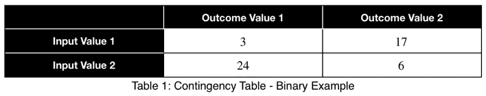

我们将对各行求和，以获得每个输入变量值的总数。

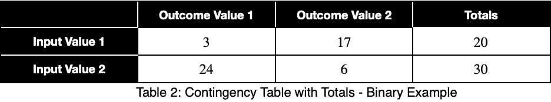

我们将通过除以每行中的总和来计算每个输入变量值的每个结果变量值的出现百分比。以十进制形式，我们有

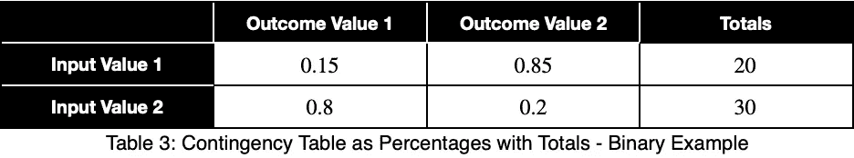

我们将计算均匀分布期望值的变化，两个可能值为 0.5，并将结果归一化。我们将像计算标准差一样计算它。我们将让 n 成为整个数据集中结果变量的唯一值的数量。假设它们的概率相等，1/n 是得到结果变量任一值的概率，即均匀分布的期望值。我们将 xⱼ作为输入变量的一个值的结果变量的每个 j 值的出现百分比。对于输入变量的每个 I 值，我们计算

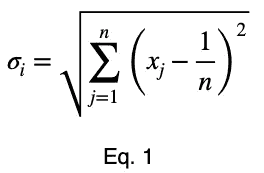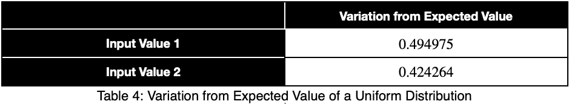

接下来，我们将根据最大值 Eq 对这些值进行归一化。1 可以服用。

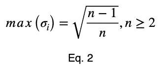

## 证明

为了证明这一点，我们将使用数学归纳法。数学归纳法指出，对于所有整数 n 和 k，如果我们能证明 n = k 和 n = k + 1 成立，那么对于所有 n ≥ k 成立。我们将证明 n = 2 和 n = 3 成立。然后通过数学归纳法，它将适用于所有 n ≥ 2。

对于 n = 2，我们有

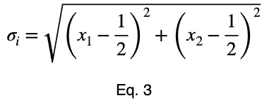

和

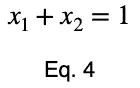

在哪里

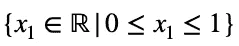

和

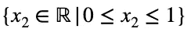

我们可以求解方程。3 代表 x₁，并将其代入方程。3 制作 Eq。3 一个变量的函数。

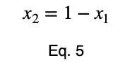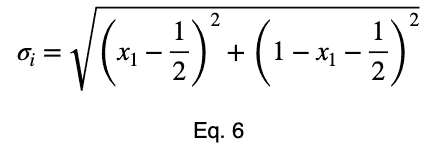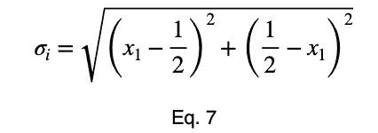

我们取导数，将其设置为零，并找到临界点。

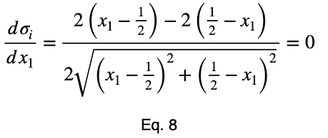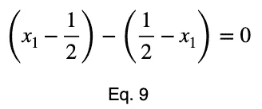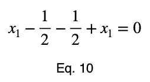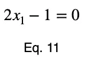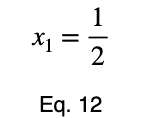

使用等式。5，我们找到了与 x₁.的这个值相对应的 x₂的临界值

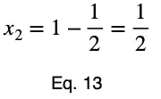

现在，我们将在临界点和端点创建一个函数值表，以确定最大值。

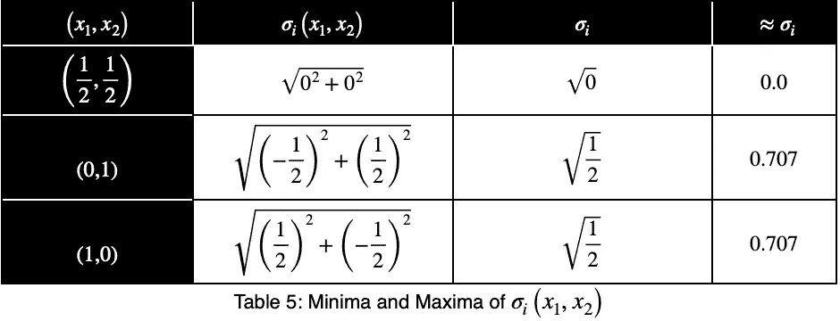

最大值出现在(x₁，x₂) = (0，1)和(x₁，x₂) = (1，0)，两者的计算结果均为

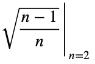

对于 n = 3，我们将使用拉格朗日乘子法。我们有

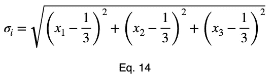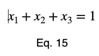

在哪里

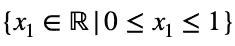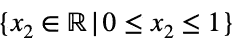

和

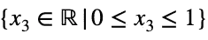

我们将约束方程转换成一个函数，将所有项放在方程的一边。

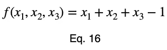

我们将得到𝜎ᵢ相对于 x₁的导数，并将其设置为等于 f(x₁、x₂、x₃相对于 x₁的导数乘以拉格朗日乘数λ。

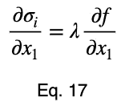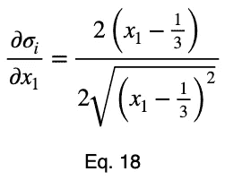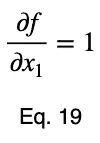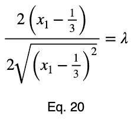

通常，我们会对 x₁和 x₂重复这个过程，用λ求解它们，将它们代入我们的约束方程，用这四个方程求解四个未知数，得到临界点。但是在简化 Eq 的同时。20，我们的λ项取消，我们直接求解 x₁。

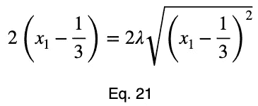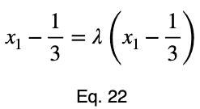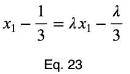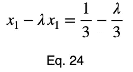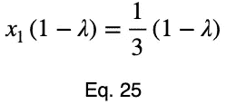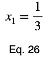

x₂和 x₃的方程与 x₁的方程相同，只是去掉了变量。这给了我们临界点。

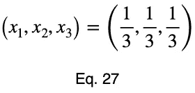

现在，我们将创建一个值表，在这个点及其端点评估我们的函数。

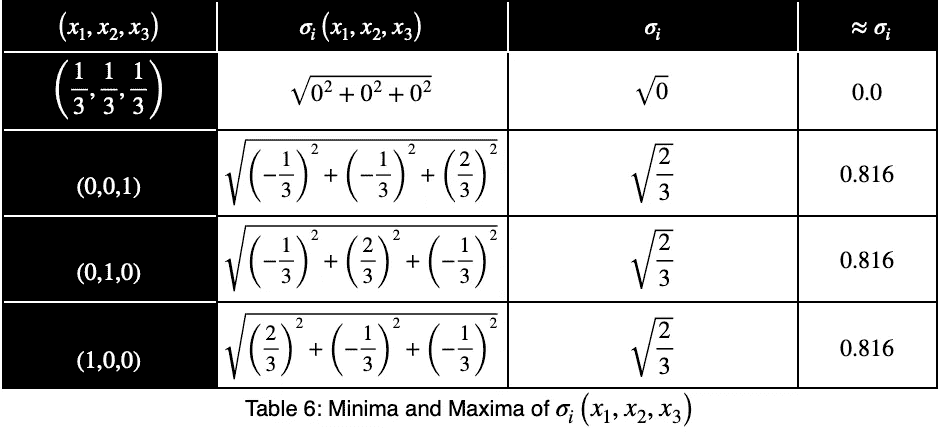

我们的最大值是 2/3 的平方根，等于

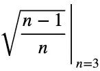

通过数学归纳法，最大值

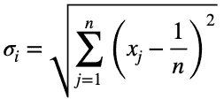

是

对于所有整数 n ≥ 2 和所有实数 xⱼ，这样对于每个 xⱼ

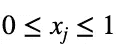

和

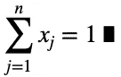

对于 n = 1，我们有一个简单的情况，即结果变量只有一个值。

## 回到二进制分类示例

现在，我们将除以 1/2 的平方根，得到归一化变量，ψᵢ。

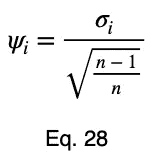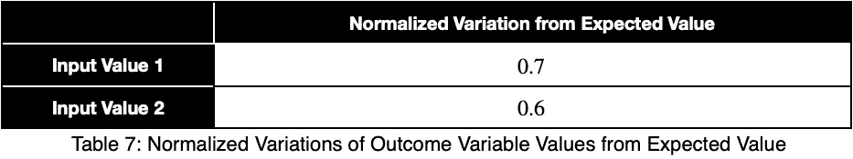

我们将取这些值的平均值，得到我们的预测系数ω。我们假设 m 是唯一输入变量值的数量。

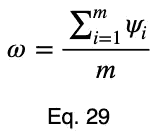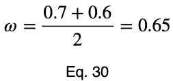

为了说明每个输入变量的变化对整个数据集的贡献有多大，我们可以采用加权平均值，权重是它们在数据集中出现的百分比。但是我们将通过将每个权重除以它们的最大值来归一化我们的权重。假设𝜌ᵢ是每个输入变量的出现百分比，ϕᵢ是加权归一化变量，我们有

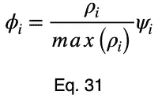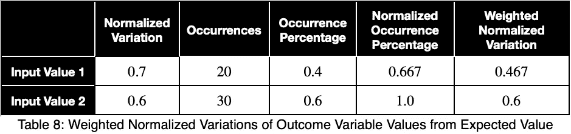

取这些的平均值，我们就有了加权预测系数。

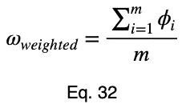

## **特殊情况**

让我们看看一个完美的预测器是什么样的。

请注意，加权导致即使是完美的预测值也小于 1。

当试图识别数据泄漏和输入变量之间的关系时，如数值变量之间的多重共线性，未加权的预测系数可能更具指示性。当使用预测系数进行特征选择时，加权预测系数可以给出更好的整体表示。建议两者都分析。

让我们看一个统一的预测器。

请注意，第一个示例中的ω值和加权ω值虽然与 1 相差甚远，但并不表示预测变量不佳。对于输入变量的第一个和第二个值，我们的结果变量的最大出现百分比分别是 85%和 80%。这是一个相当强的预测。当同时比较许多输入变量之间的值时，如在相关矩阵中，相对值将清楚地表明哪个作为预测变量表现更好。

为了更好地理解这些值的含义，我们来看一下预测系数的变化趋势，它取决于输出变量的一个值相对于输入变量的一个值出现的频率。

我们可以看到，预测系数等于 x₁和 1/n(n = 2)之差乘以 2。因此，给定一对二元变量的预测系数，我们可以取该值，除以 2，加上 0.5，并计算其中一个结果变量值的最大出现百分比，通过其出现百分比告诉我们该变量对结果变量的预测有多强。

这是图表。

趋势是线性的，系数可以放心使用。

## **p 值**

我们的零假设是，对于每个输入变量值，每个结果变量值都是同样可能的。并且它们的出现百分比遵循均匀分布。获得每个结果变量值出现的概率等于从多项式分布的概率质量函数(PMF)计算的概率。二元结果变量的概率值将遵循二项式分布的 PMF，这是多项式分布的一种特殊情况。我们必须计算每个输入变量值的概率。然后我们取它们的平均值。不需要考虑每个值出现的百分比。概率计算已经考虑到了这一点。

下面是从遵循二项式分布的试验总数中获得任意次数出现的概率的公式，其中每个值都是等概率的。为了避免重新定义我们已经在使用的变量，我们将与标准符号稍有不同。设 t 是试验的总数，y₁是一个结果变量值出现的次数，y₂是另一个结果变量值出现的次数，p 是从 t 个试验中获得 y₁和 y₂出现的概率。提醒一下，m 是结果变量的所有可能值。无效假设是这 m 个值中的每一个都是同样可能的。所以其中任何一个发生的概率都是 1/m。

我们可以用 tᵢ选择 y₂，而不是 tᵢ选择 y₁。38 并得到相同的概率。对于不熟悉这个公式的人，[点击此处](https://en.wikipedia.org/wiki/Binomial_distribution%23Probability_mass_function)了解更多信息。

现在，我们将添加下标 I 来表示每个输入变量值，并将大写的 P 改为小写的 P。

我们将在多类分类示例中看到多项式分布的更通用公式。

对于我们的第一个例子，我们有

然后我们取平均值得到 p 值。

## **多类分类示例**

假设我们的数据集中有一个变量，它的输入和输出值如下。

使用 Eq。1，我们从期望值计算我们的变化，对于三个可能的结果值是 1/3。

现在，我们将通过除以(n — 1)/n 的平方根进行归一化，其中 n = 3，2/3 的平方根。

这里我们看到 0.4 到 0.5 的值表示一个强预测值。

以下是当每个可能值的概率为 1/m 时多项式分布的概率质量函数的公式。p 将是概率，t 将是结果变量值的总数，y₁到 yₘ将是 m 个结果变量值中的每一个的出现次数。

关于此公式的更多信息，[点击此处](https://en.wikipedia.org/wiki/Multinomial_distribution%23Probability_mass_function)。

现在我们将添加下标 I 来表示这是针对 I 个输入变量值中的每一个的。

对于具有三个值的结果变量，具有一个结果变量值出现百分比的预测系数的趋势基本上是分段线性的。如果我们将剩余的百分比平均分配给另外两个值，我们就会得到这个图表。

在实践中，与直线的偏差并不值得关注。当我们每 4%评估一次时，每一件的趋势都是线性的。即使在这个图表中，每一块的趋势仍然是单调的。

我们的最小值出现在均匀分布的期望值处，对于具有三个值的结果变量为 1/3。随着结果变量值数量的增加，该值趋于零。并且可以通过从原点开始斜率为 1 的直线来估计这些值。

## **相关矩阵**

预测系数不是双向的，但是可以在一个视图中看到两个方向的关系。我们可以创建一个关联矩阵，其中每个单元格将行中的变量作为输入，将列中的变量作为输出。这将创建一个由两个对角矩阵组成的矩阵，每个矩阵显示两个方向中的一个。

举个例子，

利用这一点，我们可以在第一列中按降序对我们的表进行排序，并按最强预测值的顺序查看我们的输入变量。我们还可以检测数据泄漏和输入变量之间的关系。我们可以看到，输入变量 1 与输出变量在两个方向上都有很强的关系，这可能是数据泄漏的迹象。输入变量 2 不是结果变量的强预测器，并且与输入变量 1 没有强关系。

对于加权系数，我们用 NA 代替对角线。

## **结论**

该方法旨在简化分类变量之间强关系的检测。所有变量对都有一个相同范围内的数字，这将使检测哪些变量比其他变量具有更强的关系变得更简单、更容易、更快。虽然它被称为预测系数，但它告诉我们一个变量的变化与另一个变量的变化有多大关系。我们有一个单一的数字，它会告诉我们，一个变量作为另一个变量的预测器，根据这个信息会有多好。

## 算法

该算法的优化实现已经开发出来，并将免费发布。Python 的预发行版[在这里](https://github.com/QuantumAudio/Prediction-Coefficient)可用。官方版本将很快推出。我可能会发布一个 r 语言版本。请在评论中写下你想用的其他语言，我会尽最大努力满足你的要求。要在未来版本可用时得到通知，请单击“跟随我的名字”。

*(除特别注明外，所有图片均为作者*。)