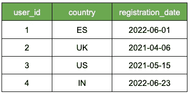
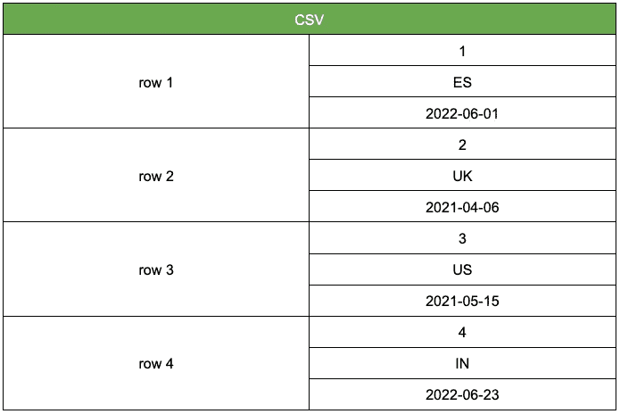
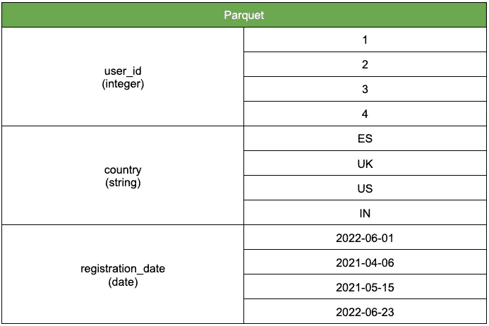

# 一个拼花文件是你所需要的

> 原文：<https://towardsdatascience.com/a-parquet-file-is-all-you-need-962df86886bb>

## 停止使用 CSV 并转向拼花地板

塞尔维亚诺瓦奇的机械(图片由作者提供)

您是使用 CSV 文件存储数据的数据科学家吗？如果我告诉你有更好的方法呢？你听说过开源拼花文件格式吗？

你能想象一个

*   驳船🦋
*   更快的🏎️
*   比较便宜的💸

保存数据集的文件格式？

读了这篇文章，你就不需要再去想象了。

# 问题是

不要误解我。我喜欢 CSV。

你可以用任何文本编辑器打开它们，检查它们并与他人分享。它们已经成为 AI/ML 社区中数据集的标准文件格式。

然而，他们有一个小问题…

CSV 文件存储为行列表(也称为面向行)，这导致了两个问题:

*   它们查询起来很慢:SQL 和 CSV 不能很好地结合在一起。
*   它们很难有效存储:CSV 文件占用大量磁盘空间。

有 CSV 的替代品吗？

是啊！

# 欢迎拼花文件

作为 CSV 面向行的格式的替代，我们有一个面向列的格式:Parquet。

Parquet 是一种存储数据的开源格式，由 Apache 许可。

数据工程师习惯于拼花地板。但是，可悲的是，数据科学家仍然落后。

## ***拼花格式与 CSV 有何不同？***

假设你有这个数据集。

样本数据(图片由作者提供)

在内部，CSV 文件根据其行存储数据

CSV 文件结构

另一方面，Parquet 基于它的列存储数据。它还保存每一列的数据类型，这是成功的关键。

## 为什么列存储比行存储好？

2 个技术原因和 1 个业务原因。

*   技术原因 1。拼花文件比 CSV 文件小得多。
    在 Parquet 中，文件根据其数据类型(如整数、字符串、日期)逐列压缩。1TB 的 CSV 文件变成了大约 100GB(原始大小的 10%)的拼花文件。
*   技术原因 2:拼花文件查询起来要快得多。
    柱状数据的扫描和提取速度更快。
    例如，选择和聚合列子集的 SQL 查询不需要扫描其他列。这减少了 I/O 并提高了查询速度。
*   商业原因#3:拼花文件存储在云服务中更便宜。AWS S3 或谷歌云存储等存储服务根据数据大小或扫描的数据量向您收费。拼花文件更轻，扫描速度更快，这意味着您可以用很少的成本存储相同的数据。

# …现在是蛋糕上的樱桃

在 Pandas 中处理拼花文件就像处理 CSV 一样简单

## 想要读取数据吗？

停止做:

`pd.read_csv('file.csv')`

相反，做

`pd.read_parquet('file.parquet')`

## 想要将数据保存到磁盘吗？

停止做:

`df.to_csv('my_file.csv')`

相反，做

`df.to_parquet('my_file.parquet')`

## 想要将您的旧 CSV 文件转换为拼花文件吗？

简单。

`pd.read_csv('my_file.csv').to_parquet('my_file.parquet')`

# 想成为机器学习和数据科学的专家吗？

🚀 [**加入 Datamachines 时事通讯，了解 ML 和数据科学的真实世界。**](https://datamachines.xyz/subscribe/)

➡️接上 [**碎碎念**](https://twitter.com/paulabartabajo_) 🐦，[**LinkedIn**](https://www.linkedin.com/in/pau-labarta-bajo-4432074b/)**👔**

**💎 [**今天使用我的推荐链接**](https://pau-labarta-bajo.medium.com/membership) 成为会员，可以无限制地访问我在媒体上发布的所有内容并支持我的写作。**

**  

快乐学习🤗

避寒胜地**