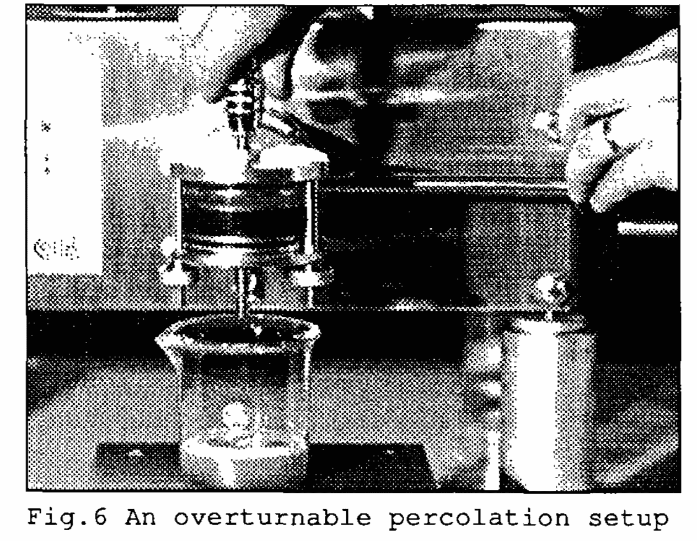
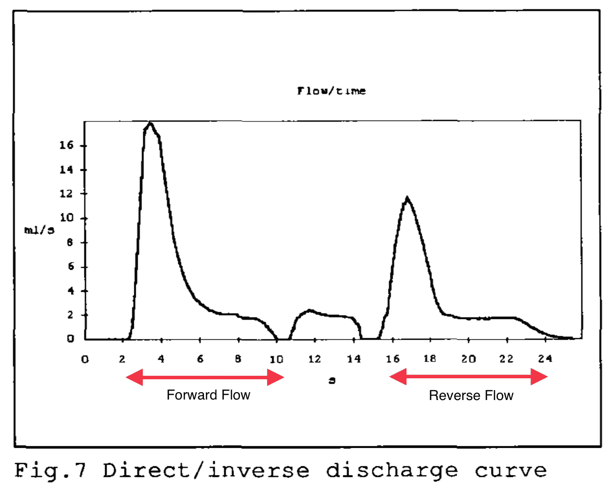
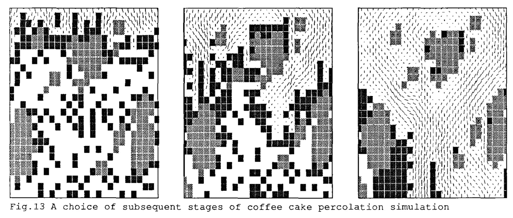

# 微粒迁移理论起源的同行评议

> 原文：<https://towardsdatascience.com/a-peer-review-of-the-origin-of-the-fines-migration-theory-f8d1aa1776ba>

## 咖啡数据科学

## 回顾一篇 30 年前的论文

在讨论细粒迁移时，所有的路都回到一篇论文，这篇论文的实验被看作是细粒迁移理论的证明。那篇论文叫做“浓缩咖啡酿造动力学:数学和计算模型的发展”，作者是 Petracco 和 Liverani [1]。我终于找到了一本，我有一些严肃的问题。

理解作者的方法是很重要的，因为很多东西都是基于他们对浓缩咖啡的实验和数学模型的结论。当我们在没有适当背景的情况下查看数据时，我们可以看到不存在的内容。这本来就是数据科学领域的一大挑战，人们可能会有意或无意地曲解数据。

首先，我将总结这篇论文的内容，然后我将讨论一些对他们的方法和结论的批评。虽然人们把他们的实验作为硬事实，但作者要求用硬数据来证明该模型，因为他们声称他们的模型和实验是“软”结果。

# 报纸

他们开始做一些实验来帮助理解浓缩咖啡的参数。这些实验观察了压力和温度对流量的影响。他们得出结论:

1.  流量不是恒定的，它具有瞬态和稳态响应。
2.  流量与压力不成正比，而是相关的。
3.  水温越低，流速越高。

他们假设滤床在提取过程中发生了改变，他们更具体地关注于微粒迁移的假设。他们将微粒定义为咖啡细胞壁的碎片(通常直径小于 100 微米)。他们认为，在喷射过程中，所有或大部分细粒会迁移到咖啡圆盘的底部，从而对水流产生影响。

所有用于合理使用的图片来自原始论文，在底部引用

然后，他们建造了一个可翻转的渗透装置，从这里他们推动**冷水(4 C)** 通过圆盘的一个方向，旋转小室，推动水流通过另一个方向。冷水解释了为什么有如此高的流速(我们将回到这一点)。

他们声称这是对微粒迁移的间接确认，因为顺流和逆流的曲线具有相似的形状。然而，他们没有直接观察到微粒的迁移，也没有在事后对圆盘进行分析。

然后，作者继续设计一个模型，假设微粒通过一个变量来描述迁移量而迁移。从这个模型，他们做了一个计算机模拟，他们有细颗粒和粗颗粒，水从中流过，如下图所示。

正如设计的那样，这个模型显示了微粒的迁移。

作者最后说，他们制作了一个模型来进行软实验，他们希望其他人也能为进行硬实验做出贡献，以验证或改进该模型。

# 评论

最高级别的评论是:

1.  他们用冷水(4 摄氏度)做实验。
2.  图 7 并不有趣，也没有充分隔离变量。
3.  他们的模拟没有考虑蛋糕压缩。

## 水温

作者在这些实验中使用冷水，但不仅仅是冷水。他们使用 4°c 的接近冰点的水。他们使用这种冷水是因为流动的瞬态和稳态曲线与使用热水的形状相似。

因此，水将做两件事:

1.  非常缓慢地提取咖啡。
2.  不会释放咖啡中的二氧化碳。

这两个变量对于理解水流过咖啡非常重要，因为它们都会干扰任何细小颗粒的运动。二氧化碳抑制流动，因为气泡必须在液体中穿行。

可溶物的提取使冰球在水压下发生变化，他们的实验没有明确说明他们使用的是用过的咖啡渣还是新鲜咖啡，所以我们没有关于实验关键部分的更好的信息。

## 图 7 并不奇怪

作者看着这个图说这两个形状是相似的，但是我不认为这说明了任何关于微粒迁移的事情。瞬态流量很高，直到圆盘被加压，然后流量达到稳定状态。

如果你以恒定的压力将水泵入一个圆盘，那么为了达到那个压力，你需要一个高流速直到圆盘增压。对于正在发生的事情，这是一个更好更简单的解释。

## 蛋糕造型

他们的模拟模型显示了水流过程中的微粒迁移，这就是模型的设计方式。然而，该模型假设较大的颗粒在高压和水流下是不动的。这是一个在实验数据中看不到的大假设。相反，较大的颗粒被向下推动并压缩，从而消除了细颗粒迁移的通道。

# 结束语

作者有一些有趣的研究，在那个时候，考虑到研究浓缩咖啡的技术限制，这是相当好的。然而，如此多的咖啡业内人士相信，即使是作者也不相信他们的结果有力或直接地证明了这一理论，但根据这一篇论文，微粒会迁移。此外，这些批评应该足以重新评估本文的影响和基础。

这篇论文收集了大量当时的数据，得到了作者的认可。Espresso 是一个高度复杂的多变量问题，在咖啡社区，特别是咖啡数据科学社区，我们应该质疑数据的潜在假设，这样我们就不会出错。

我希望有人能使用热水或更好的方法来重现这个实验和他们的结果，并找到微粒显著迁移的直接证据。

我的[数据](https://www.youtube.com/watch?v=6kmdriFIZjA)显示，微粒会移动，但移动的幅度非常小，我怀疑这对冰球的影响如此之大。

如果你愿意，可以在推特、 [YouTube](https://m.youtube.com/channel/UClgcmAtBMTmVVGANjtntXTw?source=post_page---------------------------) 和 [Instagram](https://www.instagram.com/espressofun/) 上关注我，我会在那里发布不同机器上的浓缩咖啡照片和浓缩咖啡相关的视频。你也可以在 [LinkedIn](https://www.linkedin.com/in/dr-robert-mckeon-aloe-01581595) 上找到我。也可以关注我在[中](https://towardsdatascience.com/@rmckeon/follow)和[订阅](https://rmckeon.medium.com/subscribe)。

# [我的进一步阅读](https://rmckeon.medium.com/story-collection-splash-page-e15025710347):

[我未来的书](https://www.kickstarter.com/projects/espressofun/engineering-better-espresso-data-driven-coffee)

[我的链接](https://rmckeon.medium.com/my-links-5de9eb69c26b?source=your_stories_page----------------------------------------)

[浓缩咖啡系列文章](https://rmckeon.medium.com/a-collection-of-espresso-articles-de8a3abf9917?postPublishedType=repub)

工作和学校故事集

1.  彼得拉科，m .和 f .苏吉·利维拉尼。"浓咖啡酿造动力学:数学和计算模型的发展."*国际咖啡科学研讨会*。第 15 卷。国际科学协会，1993 年。