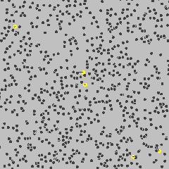

# 物理学家的观点:机器学习的热力学

> 原文：<https://towardsdatascience.com/a-physicists-view-of-machine-learning-the-thermodynamics-of-machine-learning-6a3ab00e46f1>

## 复杂系统在自然界中无处不在，物理学家利用热力学研究这些系统取得了巨大的成功。机器学习可以非常复杂，那么我们可以用热力学来理解它吗？

水往下游和机器学习有什么共同点？两者都在最小化某些东西，这种类比比你想象的更深刻

作为一个从理论物理学家转型为数据科学家的人，人们经常问我我的学术培训有多大的相关性。虽然我计算粒子相互作用和理解宇宙结构的能力与我的日常工作没有直接关系，但我学到的物理直觉具有不可估量的价值。

或许物理学与数据科学最相关的领域是统计物理学。下面，我将分享一些关于我如何连接这些点的想法，并从物理学中汲取灵感，以帮助我理解数据科学的一个重要部分——机器学习(ML)。

虽然下面的一些想法在数学上肯定不是完全严谨的，但我相信其中一些对于帮助我们理解为什么/如何产生 ML 有着深远的重要性。

# 作为动力系统的模型

数据科学的关键问题之一是用一些量来预测/描述一些量。例如，一个人可能想根据房子的特征来预测房子的价格，或者想了解光顾餐馆的顾客数量是如何受菜单影响的。

为了实现这一点，数据科学家可能会建立被称为*模型*的数学对象，它可以将一些原始输入转化为有用的输出。

为了让这些模型起作用，我们训练它们。现在许多读者可能听说过关于模型如何工作的传统解释；在这里，我将走一条非常规的道路——通过使用物理类比。

从数学角度思考模型的无聊方式是，它是某种参数化的函数。让我们从头开始，从物理角度思考。模型就像一台机器，将一些原材料转化为有用的产出。因此，这是一个由许多更小、更简单的运动部件组成的系统——就像一个装满不同粒子的盒子。

一个模型可以被认为是一个复杂的系统，由许多更小更简单的移动部件组成。(鸣谢:[乔纳森·博尔巴](https://unsplash.com/@jonathanborba?utm_source=medium&utm_medium=referral)

更小/更简单的部分从何而来？嗯，ML 模型通常由多层简单的数学运算构成:乘法、加法或基本逻辑运算(例如，决策树或神经网络中的 ReLU 单元)。这其实就像现实世界中的很多大型物理系统一样:一个由原子组成的晶体，或者一池由水分子组成的水。换句话说，

> ML 模型可以被认为是由具有简单相互作用的较小成分构成的动态系统

在这种语言中，训练的目标是智能地组合这些成分，就像某种美丽的雪花。

与机器学习模型类似，动力系统由大量简单的物理相互作用组成。就像雪花一样，非凡的结构往往可以从混沌中浮现出来

# 作为热浴的数据

向一个模型提供一个输入，然后得到一些输出，这意味着什么？用交互的语言来说，给一个模型输入相当于用一些外部的影响来刺激/扰乱系统，而输出则是系统的反应。

数据的类比是什么？在现实世界中，我们无法控制“选择”收集哪些数据点。通常假设它们是随机抽样的。明确的物理类比是热浴——随机性和不确定性的来源。

几乎我们日常生活中的一切都可以被认为是一个热水澡，这包括数据(鸣谢:[西蒙·赫里](https://unsplash.com/@bullterriere?utm_source=medium&utm_medium=referral))

这就是热力学类比的强大之处:热物理学从热波动的噪音中提取洞察力；最大似然模型从嘈杂的数据中提取洞察力。

请注意，在 ML 中，通常在训练/拟合模型与使用模型评估特定数据集之间存在差异。现在这种区别完全由我们来实施，并没有真正的物理模拟。无论如何，我们放弃了数学的严谨性；所以让我们看看它能让我们走多远。

# 作为动态过程的训练

为了更进一步，让我们真正深入挖掘我们模型的*动态*部分。

我们来看看模特训练流程。这是怎么做到的？通常我们给模型喂一些*训练数据*，并强制模型最小化一些*目标损失函数*。损失函数衡量模型预测与实际数据的接近程度(可能有一些额外的正则化项)。

物理学中的类比是什么？让我们看看，趋向于最小化的量是多少？是*能量*！在这里，我不是指任何特定类型的能量，而是将能量视为一个概念。例如，金属球上的电子将倾向于分散开来，这将倾向于降低整体能量。力可以被认为是由最小化这些能量的趋势产生的。

能量是物理学变化的关键驱动力，这类似于 ML 中的损失函数(鸣谢:[安德烈·梅特列夫](https://unsplash.com/@metelevan?utm_source=medium&utm_medium=referral)

尽管如此，系统并不只是盲目地最小化这些“能量”。太阳不会自发爆炸并冷却下来，我们也不会瞬间冻结并失去所有的热量。

一个系统的进化归结于其组成部分之间的基本相互作用。能量引导系统，但并不完全决定它做什么。在物理学中，“能量”只是为我们提供了一个系统的特定视图。

让我们把 ML 中的损失函数看作某种能量。虽然数据科学家总能找到新颖的方法来最小化损失函数，但损失函数并不代表一切。ML 模型不仅仅是盲目的最小化损失函数。相反，我们应该将 ML 模型训练视为复杂动力系统的进化:

> 训练一个模型类似于一个动力系统在一些相互作用下自我组织

加上外部训练数据，这个动力系统现在处于热浴的影响之下！总之，我们得到了一个非常有力的类比:

> 训练一个模型类似于一个动态系统在数据热浴的影响下自我组织

粒子在水中的随机运动类似于在随机数据中训练 ML 模型

事实上，这让我们更好地理解了机器学习中的正则化术语:它们是额外的*能量*，或者更确切地说是*额外的相互作用*，以帮助我们设计我们的模型的更理想的动态演化。

所以最后我们得出了物理学家对 ML 模型的看法:

1.  这是一个由许多相互作用的小部件组成的动力系统
2.  当模型训练时，它会在外部热池(即随机数据源)的影响下进行自我重组

现在，让我们将一些物理定律应用于 ML！

# 第二定律:熵总是上升的

热力学第二定律通常与时间箭头联系在一起，表明熵总是随着时间的推移而增加

也许物理学最著名的“定律”之一，热力学第二定律表明，存在一个叫做*熵*的概念，它只会随着时间的推移而增加(详细的探索见我另一篇关于[熵](https://medium.com/swlh/entropy-is-not-disorder-a-physicists-perspective-c0dccfea67f1)的文章)。

简而言之，熵捕捉到了一个系统有多普通，第二定律表明最*普通的*配置最有可能胜出(这几乎是一个同义反复的陈述)。

对我们来说，重要的一点是:

> 热力学系统不只是最小化能量。相反，系统使熵最大化。换句话说，系统倾向于稳定在最可能的配置。

当将此应用于 ML 模型时，语句变成

> 最大似然模型不一定使损失函数最小化，相反，它们只是确定最可能的配置

这听起来可能有违直觉，因为我们总是被告知要最小化损失函数，而损失函数经常被吹捧为关键的性能指标(尤其是在 Kaggle 比赛中)。

但是，请记住，训练数据(和测试数据)始终只是完整数据的子集。因此，目标实际上是大致最小化损失函数，同时也最小化过度拟合训练数据的风险。因此，熵最大化部分是一个可取的折衷:因为我们希望模型一般化，而不是过度拟合。

(*对于该定律的适用性有一些警告，因为一个要求是*遍历性*，或者动态系统可以有效地采样几乎所有可能性的概念；许多 ML 模型可能甚至没有接近任何遍历性。但是，嘿，我们并不是不努力做到 100%的数学严谨，所以我们不要太迂腐)

# 热平衡？

完美的模型是作为训练性能和可推广性的平衡而创建的。它类似于热平衡的概念吗？(信用: [Piret Ilver](https://unsplash.com/@saltsup?utm_source=medium&utm_medium=referral) )

我们可以引入热物理学中另一个强有力的概念来帮助我们理解模型:热平衡的概念。

那么当一个系统达到最大熵时会发生什么呢？最终的结果是热平衡。就物理学而言，这意味着:

1.  虽然系统的微观配置可以不断变化，但系统的宏观行为却停止了变化。
2.  系统的“历史”行为完全丢失，因为系统基本上忘记了过去发生的事情。

ML 的类比是相当深刻的。达到热平衡的模型具有以下特性:

1.  对于用不同随机种子初始化并用不同随机数据集训练的模型，它们将具有相同的性能(宏观行为)，而它们的参数可能不同(微观配置)
2.  总体 ML 模型性能对训练轨迹(遗忘历史)不敏感

这两者都是 ML 模型非常期望的结果。因此，训练 ML 模型的目标可能是驱动一个系统走向某种热平衡！

同样，这个类比不是 100%严格的，人们可以很容易地找到反例，如简单的线性模型。然而，不可否认的是，我们可以从物理学中得出一些有趣的相似之处和见解。

# 结论

总之，使用物理学中的能量、热浴和熵等概念，我们能够将 ML 模型视为由简单相互作用构建的复杂动力系统。

就像在自然界中一样，ML 模型在由损失函数(类似于能量)引导的复杂相互作用的影响下进化，这允许它在我们向其提供数据时进行自我重组(热浴)。最终，系统达到热平衡，产生类似雪花/晶体的有趣结构。

这个观点为什么有用？因为它给了我们一些关于为什么 ML 有效或者无效的提示:

1.  最大似然模型不只是最小化单一损失函数。相反，它们动态地进化。当考虑 ML 时，我们需要考虑动态演化。
2.  仅仅使用少数几个性能指标，我们无法完全理解 ML 模型。这些指标捕捉到了宏观行为，但遗漏了微观细节。我们应该将指标视为复杂动态系统的微小窗口，每个指标只突出我们模型的一个方面。

作为一名物理学家，我认为这些观点让我们对经常被吹捧的 ML 的“黑魔法”有了更多的直觉。

总之，我们可以将数据科学家的工作描述为系统工程师:创建正确类型的微观交互和环境，让模型将自身塑造成理想的宏观结构——构建完美的雪花。对我来说，这是一种更富有诗意的工作描述；与坐在计算机前，一行行地编写代码，然后等待培训工作结束相比。总之，这就是我对数据科学的看法。

好了，这就是现在所有的见解，希望你喜欢它！

请在下面留下评论和反馈，这将鼓励我写更多的真知灼见！