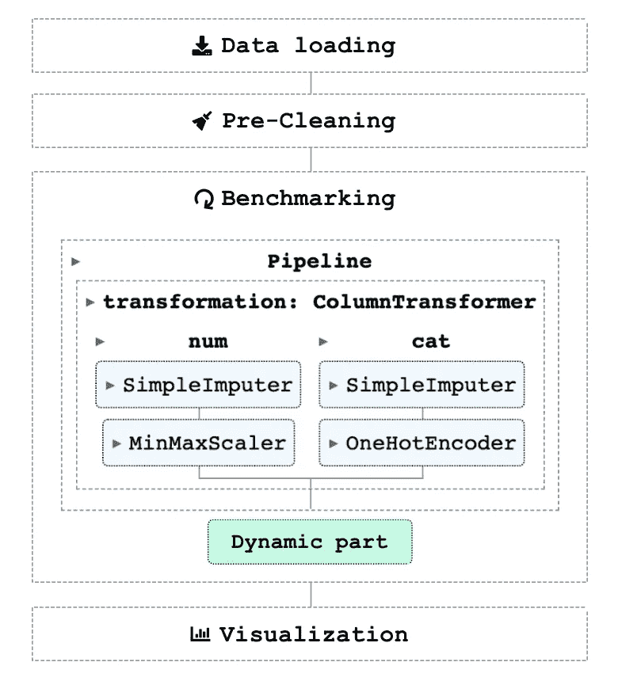
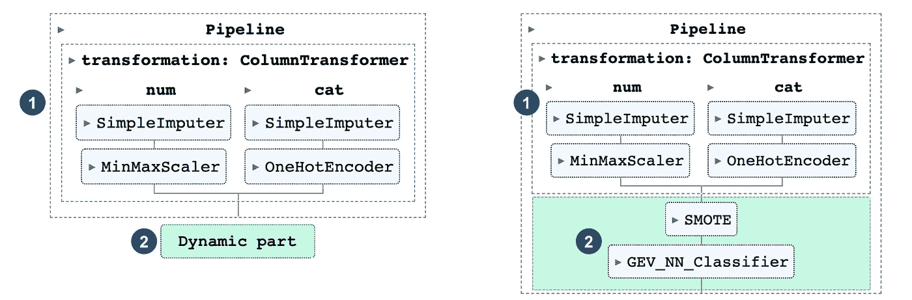
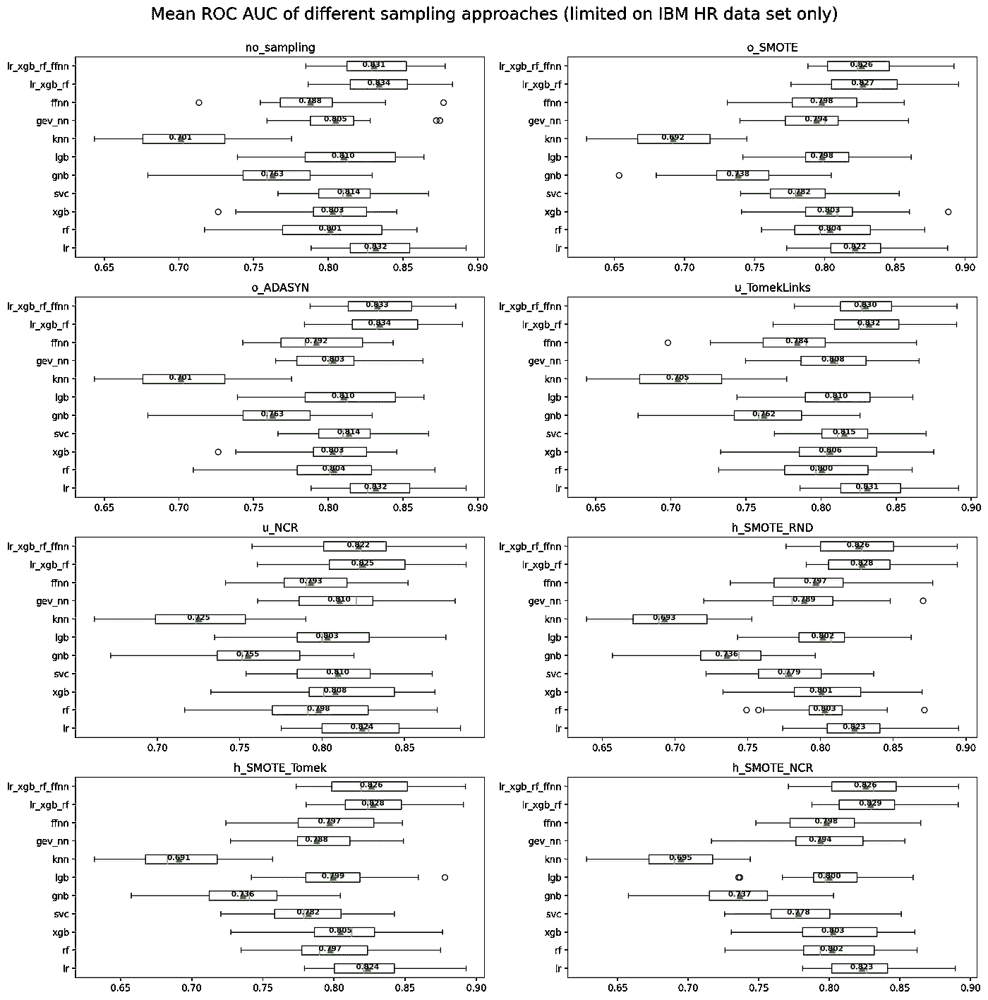

# 测试流失预测方法的管道

> 原文：<https://towardsdatascience.com/a-pipeline-for-benchmarking-churn-prediction-approaches-f5b533c53e30>

## 如何使用 scikit-learn 管道对不同数据集上的多种采样策略和模型进行基准测试


彼得·赫尔曼在 [Unsplash](https://unsplash.com/@ringo91/likes?utm_source=unsplash&utm_medium=referral&utm_content=creditCopyText) 上的照片。

C 客户流失预测是营销中非常常见的数据科学用例。这个想法是**估计**哪些客户**可能会取消订阅**或停止使用你的服务。

在过去的几年中，举办了许多比赛，开发了新的方法来更好地预测客户流失。几个月前，我发现了一篇由 Geiler et al. (2022) 撰写的伟大论文“*关于流失预测的机器学习方法的调查*”。本文对常见的客户流失预测方法进行了基准测试和分析。像大多数论文一样，找不到 Github 库或源代码。

所以我决定自己建立一个定制的基准测试管道，原因有两个:

1.  将描述的方法从论文转换成代码是数据科学中的一项关键技能。
2.  我想知道当使用他们用过的数据集的子集(具有高类别不平衡的数据集)时，我是否会得到类似的结果，因为他们的一些数据集具有高流失率(例如，50%)。

## 您将从本文中学到什么:

*   如何**创建 scikit-learn 管道**对不同数据集的不同流失预测方法进行基准测试
*   如何用**kers classifier**包装器实现一个**前馈神经网络**来与我们的管道兼容
*   如何在 scikit-learn 中实现一个神经网络作为**自定义分类器**

## 你在这篇文章中找不到的:

*   基准测试结果。他们值得拥有自己的文章。
*   **文章现在可以在这里找到**</findings-from-benchmarking-churn-prediction-methods-95940683523d>****。****
*   **对所用模型和管道功能的详细解释。**

> ****请注意** :
> 1。如果您对如何使用 scikit-learn 创建管道的更详细解释感兴趣，请查看我以前的文章“[使用 scikit-learn 的高级管道](/advanced-pipelines-with-scikit-learn-4204bb71019b)”。
> 2。为了关注代码的重要部分，下面的代码片段不包含任何导入语句。您可以在本文末尾找到完整代码的链接。**

# **概观**

**图 1 提供了流程中每个基准测试步骤的简要概述。*数据加载*和*预清洗*在第 0 章“预流水线步骤”中总结。基准测试本身包含在第 1 章到第 6 章中。最后，第 7 章“可视化”结束了这篇文章。**

****

**图一。基准测试流程概述(图片由作者提供)。**

# **0.管道前步骤**

**由于每个**数据集的结构**不同(例如，目标变量的不同名称或数据类型)，首先以**一致的格式**提交它们是有意义的。**

**在这种情况下，**目标列** **应该始终命名为****，其值为 *bool* 。同样，**不提供任何值**(例如，用户 id) **的列也应该被删除**。****

****上面的代码片段显示了加载和操作一个数据集的例子( *ibm hr* )。对于您想要用于基准测试的任何其他数据集，可以重复第`7-12`行。****

****每个数据集格式正确后，可以应用**次要预清洗步骤**(见以下代码)。****

****第`4-11` **行将列名转换为小写** ( `4`)，**删除**缺失值超过 20%的列**(`6-7`)。******

****在辅助函数 *df_pre_cleaning* 应用于所有数据集之后，可以使用一个简单的管道(`18-23`)来移除**重复列**和具有**常量值的列**。最后，预清理的数据集存储为。csv 文件(`31`)。****

# ****1.初始配置和加载数据****

****在确保数据集被预清理和持久化之后，可以构建实际的基准测试。作为初始步骤，必须设置类似于**抑制警告** ( `2–6`)、**启用日志记录** ( `9-16`)以及确保我们的**管道何时可视化**(当被调用时)(`23`)的配置。****

****在此步骤之后，以*_ cleaned . CSV*(26–30)结尾的每个数据集被加载到*数据集*字典中。****

# ****2.定义抽样方法****

****流失数据集通常遭受**高级不平衡**。这意味着**数量的搅棒**属于**少数**。为了处理这种等级不平衡，不平衡学习包带有一组不同采样方法的**。在这里，我将重点介绍 [Geiler 等人(2022)](https://link.springer.com/article/10.1007/s41060-022-00312-5#citeas) 也使用过的方法。但是，您可以随意扩展下面的列表。******

******为了稍后在管道中使用这些采样方法，必须先将它们引入**右格式**(元组)**。使用多个采样方法(`20-31`)的**组合的方法，必须被**包装在*im pipeline*对象中。************

# ****3.定义模型****

****有许多机器学习模型可以预测客户流失。对于这次基准测试，我决定坚持以下几点:****

*   ****[GEV-NN](https://github.com/lhagiimn/GEV-NN-A-deep-neural-network-architecture-for-class-imbalance-problem-in-binary-classification) (gev_nn)****
*   ****[前馈神经网络](https://github.com/naomifridman/Neural-Network-Churn-Prediction/blob/master/FFNN_churn_predict_0_12174.ipynb) (ffnn)****
*   ****[逻辑回归](https://scikit-learn.org/stable/modules/generated/sklearn.linear_model.LogisticRegression.html) (lr)****
*   ****[随机森林](https://scikit-learn.org/stable/modules/generated/sklearn.ensemble.RandomForestClassifier.html)(射频)****
*   ****[XGB 分类器](https://xgboost.readthedocs.io/en/stable/python/python_api.html) (xgb)****
*   ****[knighborsclassifier](https://scikit-learn.org/stable/modules/generated/sklearn.neighbors.KNeighborsClassifier.html)(KNN)****
*   ****[SVC](https://scikit-learn.org/stable/modules/generated/sklearn.svm.SVC.html) (svc)****
*   ****[lgbm 分类器](https://lightgbm.readthedocs.io/en/latest/pythonapi/lightgbm.LGBMClassifier.html) (lgb)****
*   ****高斯朴素贝叶斯 (gnb)****
*   ****两个[投票分类器](https://scikit-learn.org/stable/modules/generated/sklearn.ensemble.VotingClassifier.html)(软投票)，由 lr、xgb、rf 和 ffnn 组成****

****前两个**深度学习模型**是来自过去客户流失预测竞赛的(获胜)**解决方案。他们的代码不能在 scikit-learn 管道中直接使用。因此，我必须首先使他们的解决方案“管道兼容”。其余的模型是 scikit-learn 的默认实现，或者为它提供一个包装器(lgb)。******

## ****3.1 GEV-NN****

****GEV-NN 是一个用于不平衡分类的深度学习框架。作者 [Munkhdalai 等人(2020)](https://www.sciencedirect.com/science/article/abs/pii/S095070512030037X?via%3Dihub) 声称，它比最先进的基线算法最多高出约 2%。他们的 GitHub 代码可以在这里找到。****

****为了在我的 scikit-learn 管道中实现它们的架构，我实现了一个[定制分类器](https://scikit-learn.org/stable/developers/develop.html)，并从它们的代码中调用相关函数(MLP_AE)。****

****MLP_AE 类的代码存储在一个单独的文件中，这个文件与他们在 [Gev_network.py](https://github.com/lhagiimn/GEV-NN-A-deep-neural-network-architecture-for-class-imbalance-problem-in-binary-classification/blob/master/Gev_network.py) 中的代码几乎相同。作者在确定批量大小时考虑了给定(训练)集的大小。所以我确保将 *batch_size* 作为 fit_param ( `34–36`)提供。****

## ****3.2 前馈神经网络(FFNN)****

****与 GEV-NN 模型类似，FFNN 模型也是为一项竞赛开发的(WSDM-KKBox 的流失预测挑战)。内奥米·弗里德曼的代码可以在这里找到[。因为她的代码遵循一种更简单的方法，所以我不必编写自定义的分类器。相反，我可以构建一个](https://github.com/naomifridman/Neural-Network-Churn-Prediction) [KerasClassifier](https://www.tensorflow.org/api_docs/python/tf/keras/wrappers/scikit_learn) ，它是一个包装器，用于将 Scikit-Learn API 与 Keras 模型一起使用。****

****包装器(`36–41`)需要一个返回编译模型(`5-24`)的函数。基于原始代码，我还确保了除了存储模型之外的所有回调函数都得到实现。****

## ****3.3 整合一切****

****现在，这些定制解决方案与 sci-kit learn 管道兼容，其他默认 scikit-learn 模型可以快速定义，并作为元组**存储在列表** ( `48-58`)中，以便稍后在基准测试期间逐一调用**(参见步骤 6)。******

# ******4.初始管道******

******流水线的元素**非常动态**。在每次迭代中，**采样方法**和 **ML** 的**组合**在给定数据集上进行**基准测试。然而**管道**的某些部分**保持不变**。这些零件被定义为 ***初始管线*** (图 2，左)。********

****

**图二。初始管道(左)和扩展管道示例(右)(图片由作者提供)。**

****动态部分**表示在每次迭代中改变的采样方法和 ML 模型的组合。这个管道“扩展”的例子可以在图 2 的右边看到。在给定方法的交叉验证**评分完成**后，**管道被设置为其初始状态**(零件 2 从管道中移除)并且一个**新组合被附加到它**。**

**下面的代码显示了这个初始管道的实现。**

**管道**区分数字** ( `4-8`)和**类别特征** ( `9-13`)。**数值型**特征中的缺失值被特征的均值 ( `5`)代替**，而对于**类别型特征**，则使用**最频繁值**(`10`)。在插补步骤之后，一个**最小最大缩放器**被应用于**数字**列(`6`)和一个**一个**一个**分类**列(`11`)。****

# **5.要跟踪的分数和正确的批量**

## **5.1.得分**

**交叉验证期间跟踪的分数如下:**

*   **[提升得分](https://rasbt.github.io/mlxtend/user_guide/evaluate/lift_score/)(将模型预测与随机生成的预测进行比较)**
*   **[ROC AUC](https://scikit-learn.org/stable/modules/generated/sklearn.metrics.roc_auc_score.html)**
*   **[F1 分数](https://scikit-learn.org/stable/modules/generated/sklearn.metrics.f1_score.html)(用于真实类和宏)**
*   **[F2 分数](https://scikit-learn.org/stable/modules/generated/sklearn.metrics.fbeta_score.html)**
*   **[回想一下](https://scikit-learn.org/stable/modules/generated/sklearn.metrics.recall_score.html)(在客户流失预测中，我们通常在假阴性上有更高的成本)**
*   **[精度](https://scikit-learn.org/stable/modules/generated/sklearn.metrics.precision_score.html)**
*   **[平均精度](https://scikit-learn.org/stable/modules/generated/sklearn.metrics.average_precision_score.html) (PR AUC)**

**实现可以在下面找到。**

**由于提升分数不是默认的 sci-kit 学习分数，我使用了 *make_scorer* 函数(`3`)使其兼容。**

## **5.2 确定正确的批量**

**在运行基准测试之前，我创建了一个**助手函数**，该函数**根据(训练)数据确定正确的批量大小**。该功能遵循 [Munkhdalai 等人(2020)](https://www.sciencedirect.com/science/article/abs/pii/S095070512030037X?via%3Dihub) [设置**适当批量值**的方法](https://github.com/lhagiimn/GEV-NN-A-deep-neural-network-architecture-for-class-imbalance-problem-in-binary-classification/blob/master/evaluation_KEEL.py)。**

# **6.基准循环**

**基准测试(参见下面的代码)由**三个嵌套循环**组成:**

*   **第一级:数据集(`3`)**
*   **第二级:模特(`11`)**
*   **第三级:抽样方法(`14`**

**在每次循环之前，创建一个**字典** ( `9,13`)来存储各个基准组合的分数。上一步(5.1)中定义的 *bnchmrk_results* 字典的结构应该如下所示:**

```
**{
     '**data set ds**': {
        '**model m**':{
           '**sampling approach sa**': {
              'lift_score':[],
              'roc_auc':[],
              'f1_macro':[],
              'recall':[]
           }, ...
        }, ...
     }, ...
}**
```

**在第一个循环(数据集)中， **X 和 y 通过删除/分配目标变量 *churn* 来定义** ( `5-7`)。**

**在内循环(第三级—从`14`开始)中，相应的**采样方法被附加到初始管道** ( `21–25`)。由于一些采样方法具有**多个步骤**(例如，SMOTE + RND)，因此需要一个**循环来附加每个单独的步骤**。附加采样方法后，最后附加**模型和** ( `28`)。**

**如前所述，创建了一个助手函数来确定正确的批量大小。当当前模型是 FFNN 或 GEV-NN 时，调用该函数(`31–39`)。然后，其输出通过交叉验证函数中的 *fit_params* 参数提供给相应的深度学习模型。**

**在第`44-53`行中， [*cross_validate*](https://scikit-learn.org/stable/modules/generated/sklearn.model_selection.cross_validate.html) 函数被调用，其分割策略为 RepeatedStratifiedKFold。结果写入 *sampling_results* 字典(`55`)后，【扩展】流水线**被设置回初始状态** ( `59`)。**

**由于一些基准运行了相当长的时间，每个数据集的结果被存储为一个 pickle 文件(`68–69`)。**

# **7.形象化**

**可视化不同方法性能的综合方法是使用**箱线图**。对于这种类型的可视化，模型名称**与它们各自的(总体)性能**一起标绘在轴上。这意味着我们的 *bnchmrk_results* 字典(见#6) **中的数据集级别可以被跳过**。**

**但是首先，下面的脚本加载所有 pickle 文件，并将它们的内容(每个数据集上的基准)添加到*结果*字典中。**

**正如开始时提到的，在这个可视化中将不考虑数据集。因此，必须首先应用一些转换，使数据具有以下形状:**

```
**{
        '**sampling approach sa**':{
           '**model m**': {
              'lift_score':[],
              'roc_auc':[],
              'f1':[],
              'recall':[]
           }, ...
        }, ...
}**
```

**不幸的是，除了使用下面的代码之外，我没能及时找到更好的方法将数据带入正确的结构:**

**该代码创建一个新的字典(`12`)来存储原始字典中经过整形的数据。辅助函数 *metric_merger* ( `5–9`)连接每个误差度量的值。**

**最后，整形后的数据可以被可视化。下面的代码由两部分组成。第一个(lines `1–21`)是一个辅助函数，它创建一个单一的方框图。**

**第二部分(第`24-46`行)循环通过每个采样方法，然后绘制各自的箱线图。**

**如引言部分所述，**基准测试结果值得单列一篇文章**。这就是为什么我**将下面的可视化只限于 IBM HR 数据集**(图 3 ),并将结果保留不加注释。**

****

**图 3。不同方法的可视化仅限于 IBM HR 数据集(图片由作者提供)。**

# **结论**

**用定制的分类器或包装器创建一个更复杂的管道可能是一个挑战。然而，它也非常有趣，我有一个陡峭的学习曲线。最耗时的部分之一无疑是将定制的深度学习模型(gev_nn，ffnn)集成到 scikit-learn 管道中。**

**此外，在几个数据集上评估每种方法的计算时间可能会很紧张。这也可能通过最初的管道步骤得到加强。我使用了，像在 [Geiler 等人(2022)](https://link.springer.com/article/10.1007/s41060-022-00312-5#citeas) 的论文中，一键编码。如果具有大量类别特征的数据集进入管道，就会产生大量新列(维数灾难)。另一种方法是在这里增加一个降维步骤。**

**我希望这些代码能对您的下一个项目有所帮助:**

*   **[预清洗代码](https://github.com/darinkist/customer_churn_benchmarking/blob/main/Data_Preparation.ipynb)**
*   **[标杆](https://github.com/darinkist/customer_churn_benchmarking/blob/main/Benchmarking_Pipeline.ipynb)**
*   **[可视化](https://github.com/darinkist/customer_churn_benchmarking/blob/main/Visualization.ipynb)**

# **来源**

*   **盖勒，l .，阿费尔特，s .，纳迪夫，m .，2022。**流失预测的机器学习方法综述**。国际数据科学分析。[https://doi.org/10.1007/s41060-022-00312-5](https://doi.org/10.1007/s41060-022-00312-5)**
*   **蒙赫达莱，l，蒙赫达莱，t，刘，K.H，2020。GEV-NN: **针对二元分类中类别不平衡问题的深度神经网络架构**。基于知识的系统。[https://doi.org/10.1016/j.knosys.2020.105534](https://doi.org/10.1016/j.knosys.2020.105534)**

## **使用的数据**

*   ****IBM HR Analytics 员工流失&绩效** ( [数据库内容许可证(DbCL) v1.0](https://opendatacommons.org/licenses/dbcl/1-0/) )，[https://www . ka ggle . com/datasets/pavansubhasht/IBM-HR-Analytics-attraction-dataset](https://www.kaggle.com/datasets/pavansubhasht/ibm-hr-analytics-attrition-dataset)**

## **GitHubs**

*   **蒙克达莱湖，2020 年。**GEV-NN-A-deep-neural-network-architecture-for-class-unbalancy-problem-in-binary-classification**。[https://github . com/lhagiimn/GEV-NN-A-deep-neural-network-architecture-for-class-unbalancy-problem-in-binary-classification](https://github.com/lhagiimn/GEV-NN-A-deep-neural-network-architecture-for-class-imbalance-problem-in-binary-classification)**
*   **新泽西州弗里德曼，2019 年。**神经网络，流失预测**。[https://github . com/Naomi fridman/Neural-Network-Churn-Prediction](https://github.com/naomifridman/Neural-Network-Churn-Prediction)**