# K 均值聚类实用指南

> 原文：<https://towardsdatascience.com/a-practical-guide-on-k-means-clustering-ca3bef3c853d>

## 超越理论，充分利用 K-Means 聚类算法

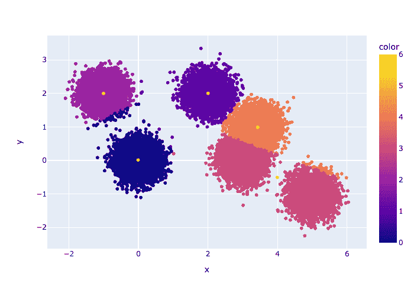

KMeans 中的迭代。原 GIF。

# 目录

1.  什么是 KMeans？
    a. Python 实现
2.  使用 KMeans 之前要知道的事情
    a. K-Means 无法处理非球状结构
    b. K-Means 对异常值很敏感
    c .在使用 KMeans 之前是否应该缩放数据？
3.  你如何衡量你的模型的性能？

*注意——本文中使用的数据集是使用 sklearn 的*[*make _ blobs*](https://scikit-learn.org/stable/modules/generated/sklearn.datasets.make_blobs.html)*和*[*make _ moons*](https://scikit-learn.org/stable/modules/generated/sklearn.datasets.make_moons.html)*方法*生成的

# 什么是 KMeans？

K-Means 使用迭代优化策略将数据集划分为 **k** (一个超参数)个聚类。每个集群由一个中心表示。一个点属于一个中心离它最近的簇。为简单起见，假设中心是随机初始化的。

该模型的目标是通过移动它们的中心来找到最小化 SSE 与 k 个 T21 聚类之和的聚类。SSE 或**群集的误差平方和**是其中心与其点之间的距离平方和。

使用微积分，可以证明最小化 SSE 的最佳方法是将聚类中心移动到聚类中所有点的质心(=平均值)。我们使用更新后的中心，基于相同的最近中心策略将点重新分配给聚类。

重复该过程，直到中心不再移动太多并会聚。

```
**K-Means summary
------------------------------** X -> dataset of N points and M features ((N,M) matrix)
k -> Number of chosen centers (hyper-parameter)
centers -> randomly initialized k centers ((k,M) matrix) for i in n_steps:
    - assign each point to a cluster based on the nearest center. points in jth cluster are denoted by X_j
    - updated_centers -> randomly initialized k centers ((k,M) matrix) - for j in [1, 2, .. k]
          - updated_center[j] = mean(X_j)

    - if distance(updated_centers, centers) is small
          - exit
    - else
          - centers = updated_centers
          - continue
```

## Python 实现

朴素的 K-意味着 Python 实现。原始代码。

# 使用 KMeans 之前要知道的事情

大多数 ML 模型对它们适合的数据有假设。在从一个训练有素的模型中推断出任何东西之前，检查这些是必要的。对 K-Means 来说，它们是—

## K-Means 不能处理非球形结构

数据集可以有任意数量的可以直观解释的模式。聚类算法的工作就是能够捕捉这些信息。不同的算法使用不同的策略。K-Means 等基于原型的算法使用质心作为每个聚类的参考(=原型)。DBSCAN 等基于密度的算法使用数据点的密度来形成聚类。

考虑下面的两个数据集—

**球状(球状)**

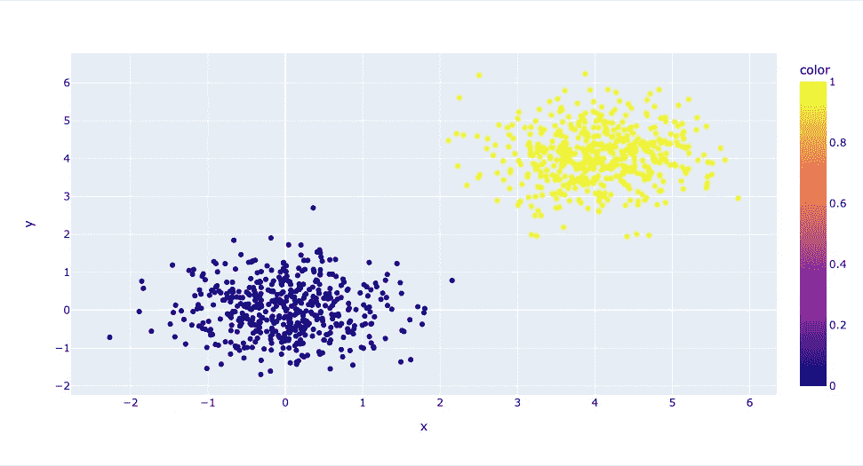

图一。原图。

**非球形**

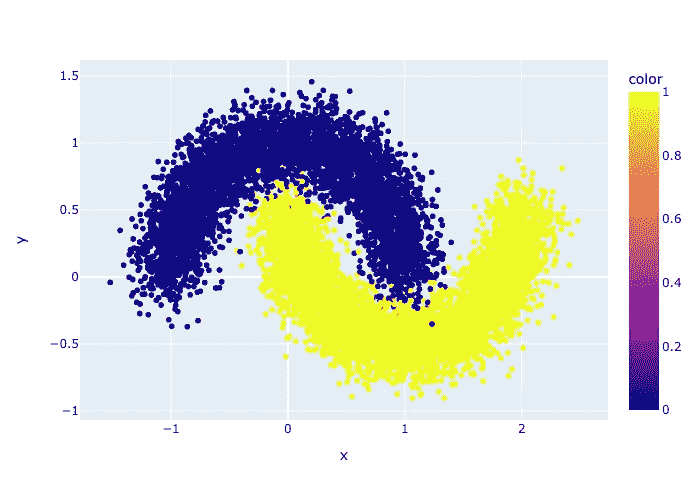

图二。原图。

K-Means 将为球状数据捕获更好的结构语义。这一点从 K-Means 对数据的拟合中可以明显看出。我们知道 K-Means 执行以下操作

> 每个聚类都有一个质心。一个点属于质心最近的聚类。K-Means 通过最优迭代移动质心来最小化 SSE 的和。

在某种程度上，K-means 通过在数据集中创建一个硬分区来工作，硬分区充当聚类边界。比如说—

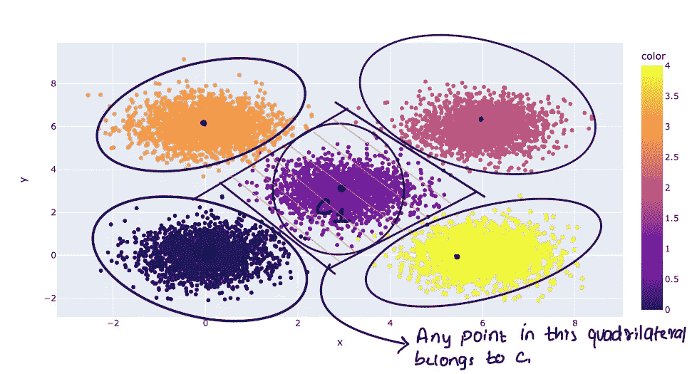

图 3。中心星团被命名为第一星团(C1)。原图。

在这个例子中，有五个集群，中间的一个(C1)被其他四个集群包围。基于最近的质心，四边包围是任何点被放置或不被放置在聚类-1 中的决定边界。

对于一个新点，聚类分配完全依赖于距质心的距离。点的位置并不重要，只要它最靠近特定的质心。这在球状结构中工作良好。回想一下，圆的边界是离圆心有固定距离的点的轨迹。

作为对比，让我们看看 K-Means 在非球形设置中是如何工作的。

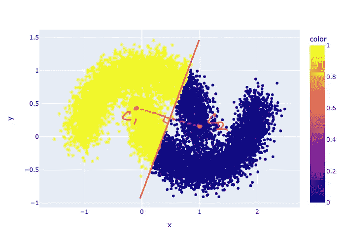

图 4。非球形数据集上 KMeans 聚类的结果。如您所见，聚类没有捕获数据集中的实际语义。原象

## KMeans 对异常值很敏感

由于 K-Means 是一种基于距离的算法，它容易受到离群值的影响。在每个更新步骤中，通过对聚类中的点进行平均来重新计算质心。众所周知，平均值对异常值很敏感。例如

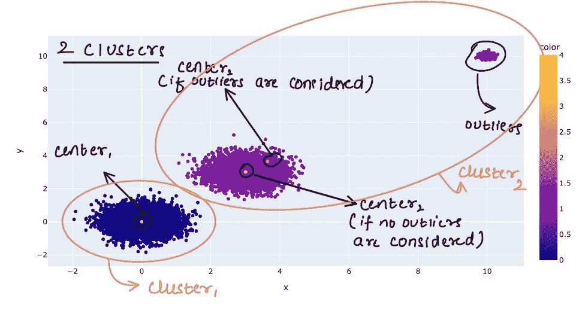

图 5。请注意两种不同情况下 cluster2 的中心——有离群点和没有离群点的聚类。当考虑离群点时，中心向离群点移动一点。原图。

***如何解决这个问题？***

请记住，离群值对更新步骤的贡献不成比例。您可以通过绘制质心到点距离的密度来识别异常值。在上面的例子中，cluster2 中的点到 center2 的距离分布如下所示

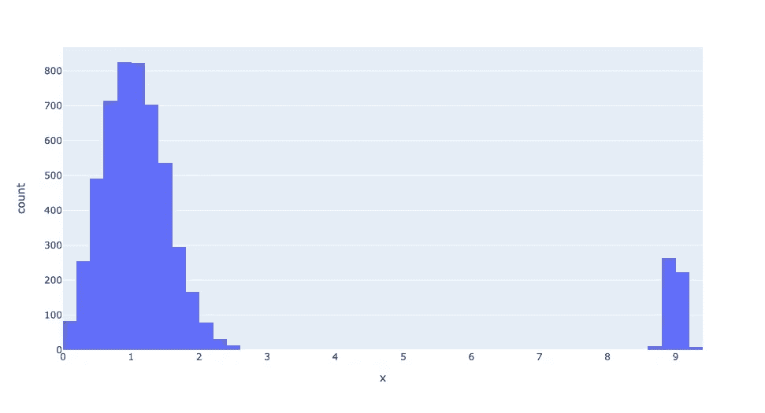

图 6。注意最右边的小密度。它们对应于异常值。

您可以从数据集中移除该点以获得实际的聚类。

另一种方法是增加聚类的数量，希望离群值可以形成自己的聚类。在上述情况下(图 5。)，如果我们设置簇的数量=3，我们得到

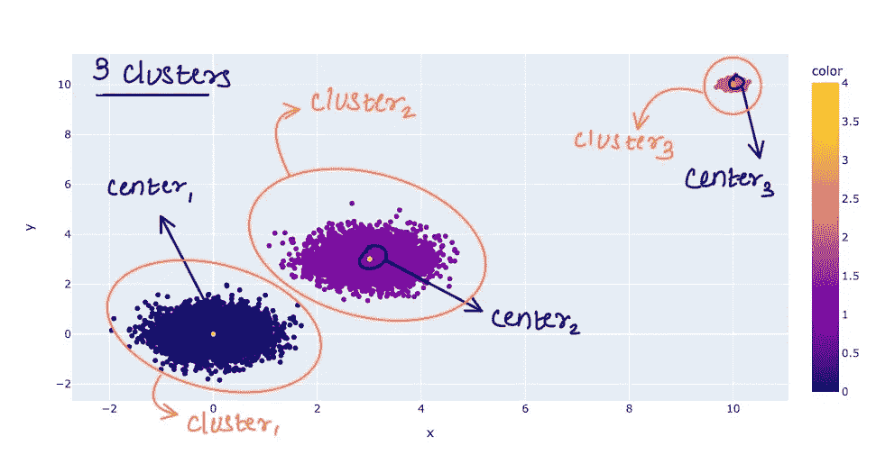

图 7。请注意，第三个集群完全是由离群值组成的。原图。

这反映在肘图中(如上所述)。添加第三个集群大大减少了集群内方差的总和。因此，人们会注意到情节的急剧下降。

## 在使用 KMeans 之前，应该对数据进行缩放吗？

许多 ML 算法受益于使用像最小-最大缩放或标准缩放这样的方法来缩放特征。“效益”是通过指标的增加来衡量的。

缩放如何影响 KMeans？我们怎么知道它是好是坏呢？让我们来理解缩放对模型的影响。

如果我们有两个特征，X1，X2。X1 的范围是-1 到 1，X2 是-100 到 100。在计算簇内方差时，X2 对上证综指的贡献将大于 X1。因此，该模型可以通过最小化 X2 的贡献来更大程度地最小化这种 SSE。如果使用标准缩放将要素转换为—

> X _ transformed =(X-X _ mean)/X _ STD _ dev

我们来看例子！

缩放特征—

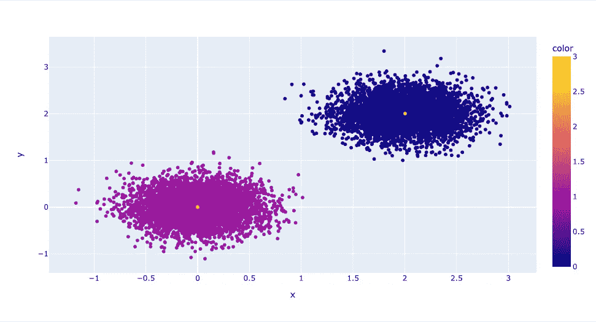

具有缩放要素的聚类。隔断很完美！原图。

相同的数据，但是特征没有改变—

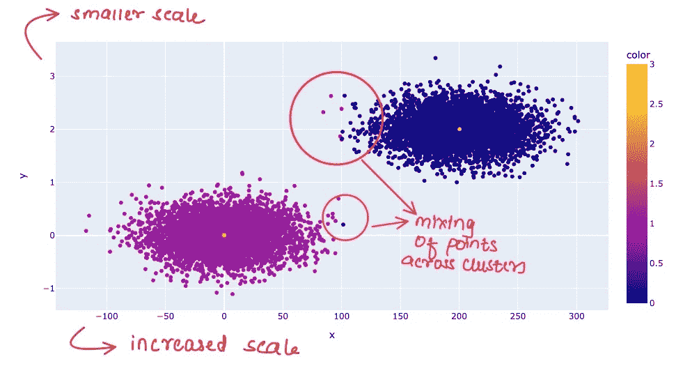

请注意 x 轴上的刻度和跨簇的混合点。原图。

> 您是希望一小部分要素主导您的聚类分析，还是希望所有要素都具有相同的贡献？

# 如何衡量模型性能？

标签的不可用性限制了您对聚类模型的描述。但并没有全部消失。我们主要是想看看在聚类中，聚类的形成情况如何。“井”的定义不是很精确。

> 理想情况下，我们希望集群分离良好，大而密。

通过将 **k** (聚类数)设置为 1，可以得到最大的聚类。你可以通过使用一个大的 **k** 来获得最密集的集群，创建许多密集的微集群。在这两种情况下，我们都失去了可能想要从集群中推断出的任何有见地的信息。

幸运的是，我们可以测量大，密度和分离。

```
Largeness --> number of points in the clusters.
Density --> Average of distance of two points in a cluster.
Separation --> overlap between two cluster.
```

考虑在数据集上拟合 KMeans 模型。我们如何决定集群的数量？请记住，KMeans 最大限度地减少了集群间的 SSE。随着我们增加 **k** ，我们跨集群的 SSE 将会减少。在**k**=数据集中的点数时，所有聚类的 SSE 将为 0，因为每个点将是其自己的聚类和其自己的质心。然而，这并没有用。因此，我们想增加 k，但只是增加到一个点，在这个点上，上证指数的进一步增加是微不足道的

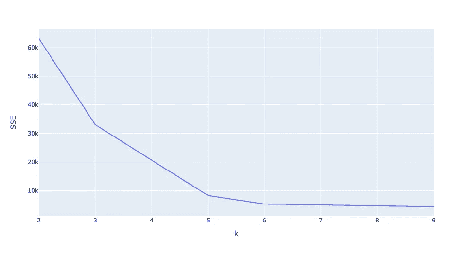

y 轴=跨集群的 SSE 总和。x 轴=k。这也称为碎石图或肘形曲线。原象

我们看到，上证指数在 k=5 之后的下跌是边际性的。因此，我们可以选择 5 个集群。

我们的星团足够大吗？让我们检查一下—

```
cluster index   number of points
-------------------------------- 0                 5001
    1                 5001
    2                 9952
    3                 5047
    4                 4999
```

似乎是这样。每个聚类都有相当多的点。很容易选择 k = 5，继续生活。但是，我们还没有检查分离度。可以有大量密集的集群重叠在一起。我们不想那样。

给大家介绍一下**剪影评分**。这是一个告诉您集群之间存在多少重叠的指标。范围在-1 到 1 之间，分数越大，重叠越少。它是通过计算两个测量值为数据集中的每个点 **p** 计算的—

1.  **a** = **。**
2.  **b** =与不属于 **p** 的任何簇的平均距离。如果有 N 个集群，我们得到 N-1 个这样的平均值。取其中的最小值，称之为 **b** 。

```
silhouette-score for **p** = (**b** - **a**)/max(**b**, **a**)
```

若要获得分类级别的分数，请对分类中每个点的分数进行平均。

我们来直观的看一下。如果两个群集重叠，许多重叠点将具有较低的 **b** ，反之亦然。较低的 **b** 表示较低的分数。如果 **a** =0，那么得分为 1。只有当集群中只有一个点时，才会发生这种情况。如果上面的表达不清楚，参考下面的可视化—

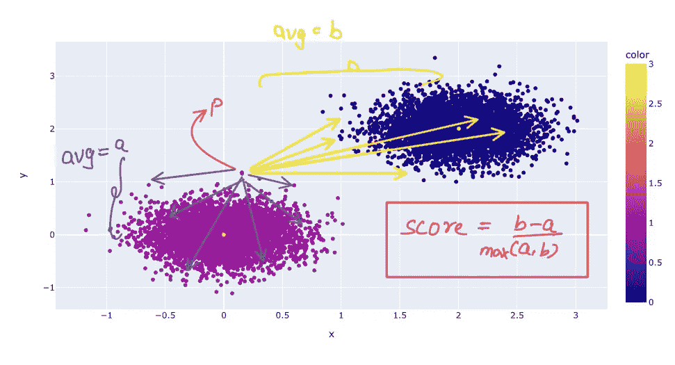

点 p 的轮廓分数的可视化示例。原始图像。

绘制轮廓分数与聚类数的关系图—

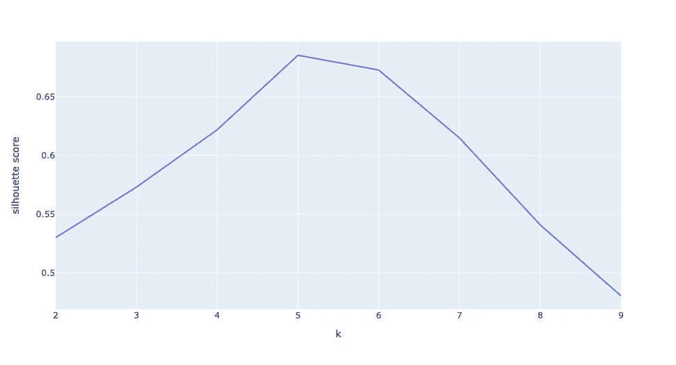

剪影分数 vs k .我们得到 k=5 的最高分。

我们可以保证 k=5 在尺寸、密度和分离度方面产生更好的团簇。注意，这些度量更关注嵌入空间的分布。集群的语义取决于应用程序。例如，检查文档簇中的主题优势。

# 结论

K-Means 是一个强大的工具，可以深入到一个复杂的数据集，并使用欧几里德数学找到模式。确保你遵循上述准则，以避免任何错误。希望你觉得有用。

如果你喜欢这篇文章，请订阅我的列表，点击你右边的关注按钮。这对我意义重大！

日安:)