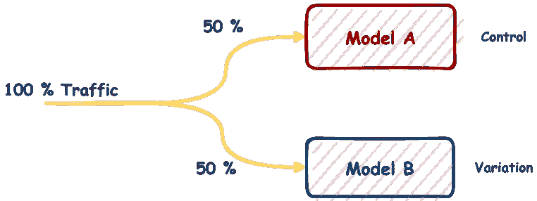
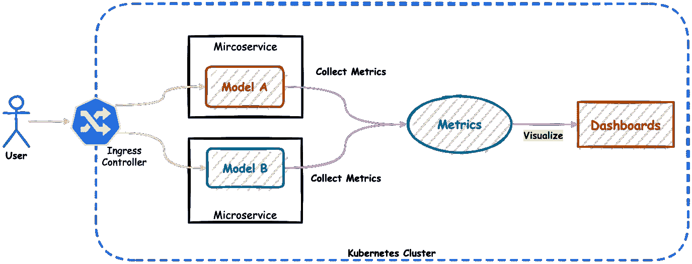
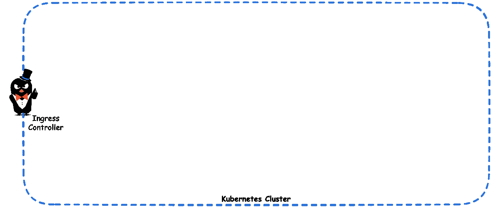
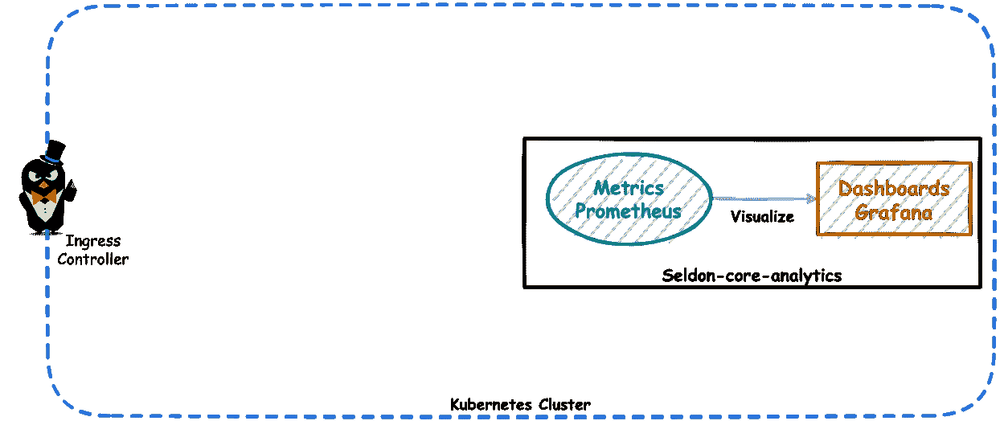
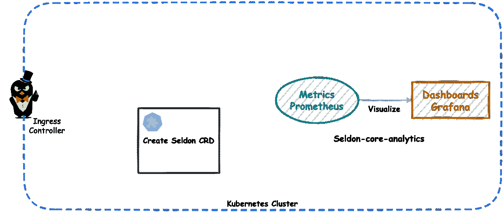
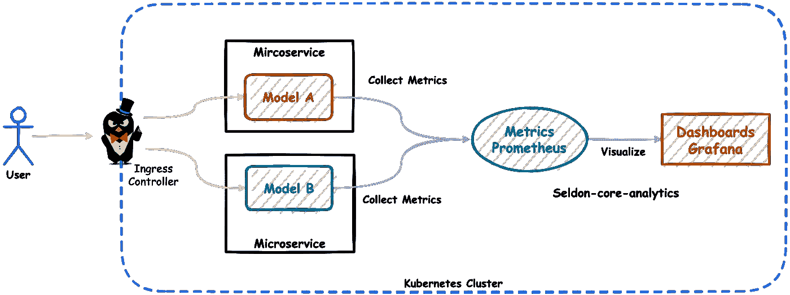
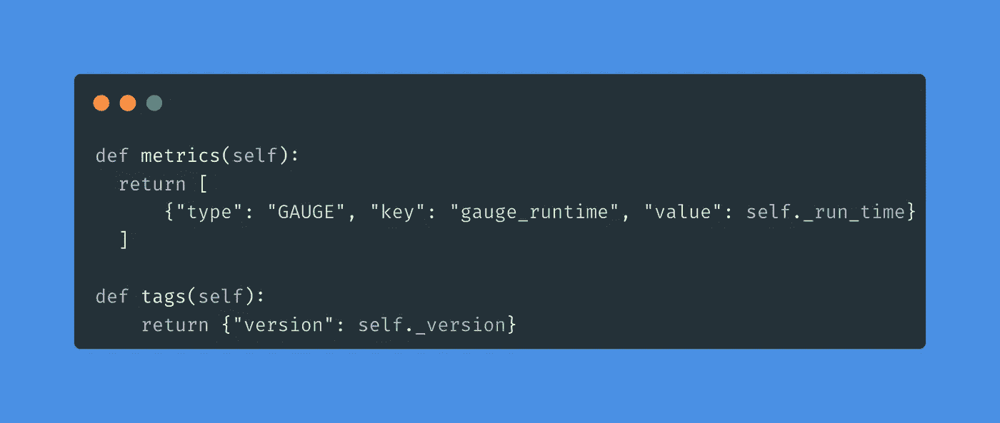
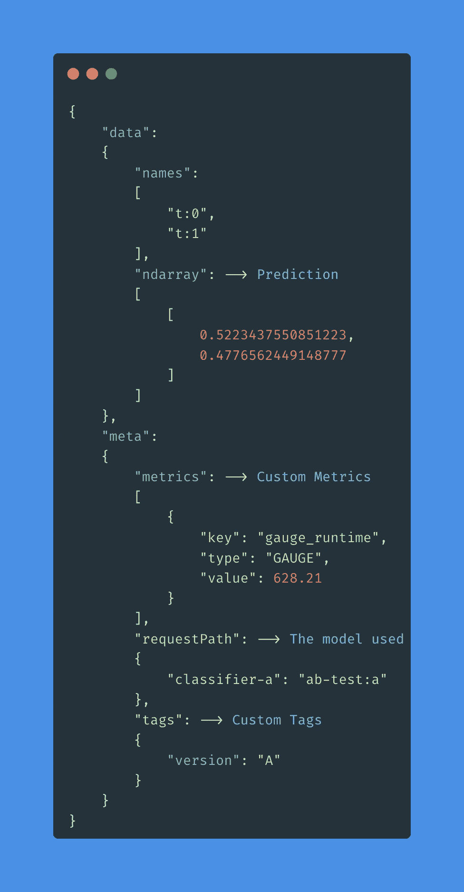
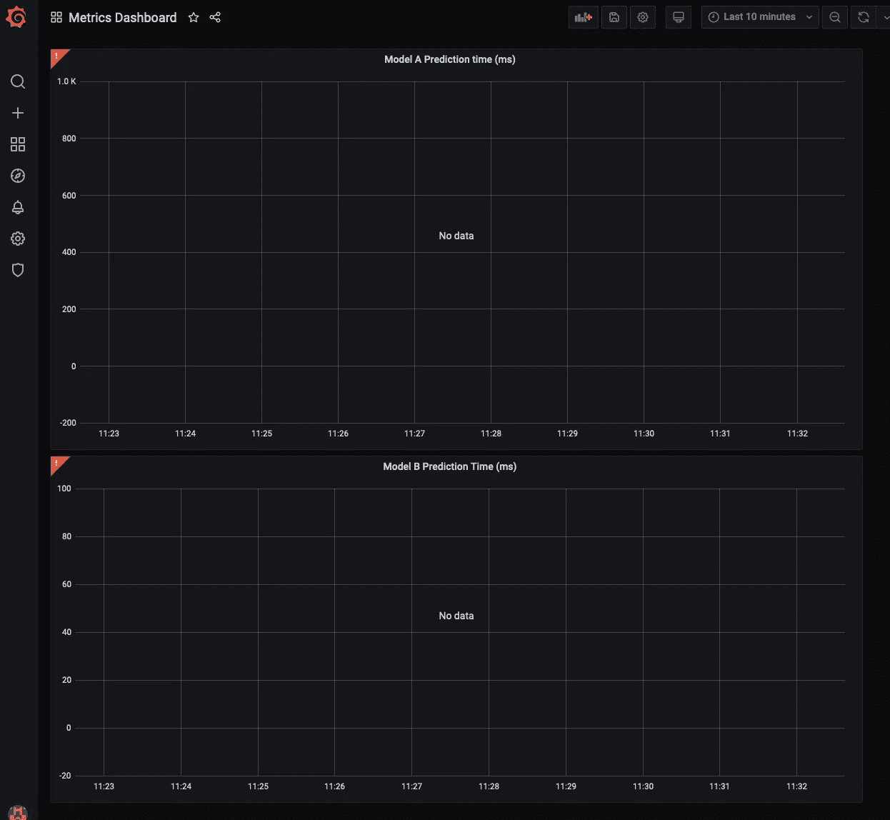
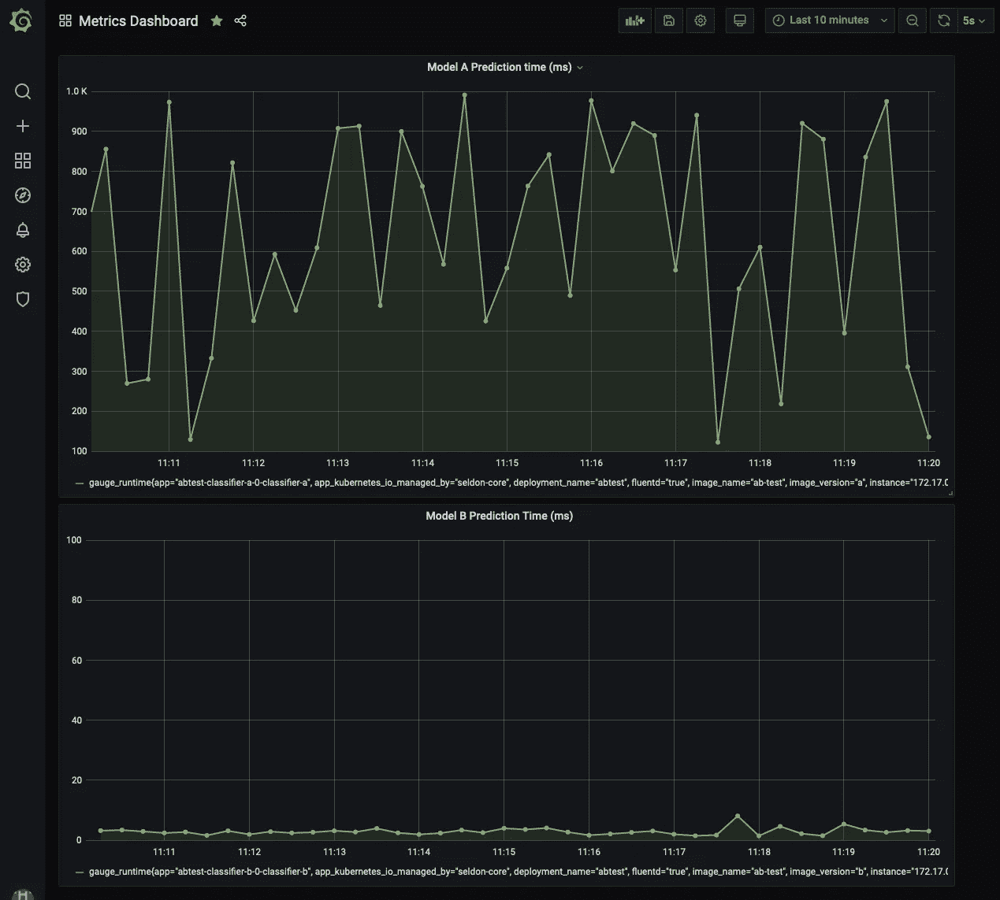

# 使用 Kubernetes 和 seldon-core 在 MLOps 中进行 A/B 测试的实用指南

> 原文：<https://towardsdatascience.com/a-practical-guide-to-a-b-testing-in-mlops-with-kubernetes-and-seldon-core-e75e91ef91ef>

## 如何设置容器化的微服务架构来运行 A/B 测试


照片由 [Unsplash](https://unsplash.com?utm_source=medium&utm_medium=referral) 上的[延斯·勒列](https://unsplash.com/@madebyjens?utm_source=medium&utm_medium=referral)拍摄

许多公司正在使用数据来推动他们的决策。目的是消除不确定性、猜测和直觉。A/B 测试是一种方法，可用于验证假设并引导决策朝着正确的方向发展。

在这篇博文中，我想展示如何创建一个容器化的微服务架构，在我们每次运行 A/B 测试时，该架构都易于部署、监控和扩展。重点将是模型部署的基础设施和自动化，而不是模型本身。因此，我将避免解释模型设计的细节。出于说明的目的，使用的模型是亚历杭德罗·绍切多在[本帖](/real-time-stream-processing-for-machine-learning-at-scale-with-spacy-kafka-seldon-core-6360f2fedbe)中创建的模型。该模型基于 Reddit 审核数据集进行文本分类。这个模型是如何建立的，它是如何工作的，在最初的帖子中有描述。

如果你已经知道 A/B 测试是如何工作的，请随意跳到 Kubernetes 中的*带 seldon-core 的 A/B 测试*部分。

除非另有说明，所有图片均为作者所有。

# 什么是 A/B 测试？

A/B 测试的核心是比较一个变量的两个变量，并确定哪个变量表现更好。变量可以是任何东西。例如，对于一个网站，它可以是背景色。我们可以使用 A/B 测试来验证改变背景颜色是否会让用户在网站上停留更长时间。对于推荐引擎，可以是改变模型参数是否产生更多的收入。

自二十世纪初以来，A/B 测试一直被用来提高广告活动的成功率。后来，A/B 测试被用于医学、市场营销、SaaS 和许多其他领域。值得注意的是，A/B 测试在奥巴马 2012 年的竞选中被用来增加选民的捐款。

## A/B 测试是如何工作的？

要运行 A/B 测试，您需要创建同一组件的两个不同版本，它们只有一个变量不同。在为我们的网站选择最诱人的背景色的情况下，版本 A 是当前的颜色(如红色)，也称为*控件*，版本 B 是新的颜色(如蓝色)，称为*变体*。随机向用户显示版本 A 或版本 b。



在 A/B 测试中，在版本 A 和版本 B 之间划分流量。

在我们选择性能更好的版本之前，我们需要一种方法来客观地衡量结果。为此，我们必须选择(至少)一个指标进行分析。在这个例子中，一个有意义的度量是用户会话持续时间。更长的会话意味着用户更多地使用网站。在我们的分析中，我们寻找更长用户会话的变化。如果我们对结果满意，我们可以选择向所有用户部署这个版本。

# A/B 测试如何应用在机器学习中

在机器学习中，就像几乎每个工程领域一样，没有灵丹妙药。我们需要测试以找到更好的解决方案。寻找最适合我们数据的数据科学技术，意味着我们必须测试其中的许多技术。为了优化模型，我们需要使用许多参数或参数集。

A/B 测试是验证一个新模型或新版本是否优于当前版本的极好策略。所有这些都是在实际用户中测试的。这些改进可以体现在 F1 分数、用户参与度或更快的响应时间方面。

# A/B 测试流程

当我们想要测试模型的性能时，让我们考虑这种情况。要运行 A/B 测试，我们需要:

1.  **定义假设**。在这一步，我们决定什么是我们想要测试的。在我们的例子中，我们想要测试新的模型版本是否提供更快的预测。
2.  **定义指标**。为了在测试中选择更好的版本，我们需要有一个度量标准来衡量。在这个例子中，我们将测量从用户的请求到达到得到响应所花费的时间。
3.  **创建变体**。这里我们需要创建一个使用新模型版本的部署。
4.  **运行实验。**准备好变体后，我们可以运行实验，理想情况下是在规定的时间框架内运行。
5.  **收集数据。**同时，我们必须从 2 中收集衡量指标所需的数据。
6.  **分析结果。现在剩下的就是分析数据，挑选出产生更好结果的变量。**

# 使用 seldon-core 在 Kubernetes 中进行 A/B 测试

**Kubernetes** 是基础设施层的默认选择，因为它的灵活性和行业范围的采用。我们可以基于我们想要运行的测试来动态地提供资源，并在测试阶段结束后释放它们。

在 MLOps 领域，支持开箱即用的 A/B 测试的开源工具并不多。**谢顿核心**在这里是个例外，它:

*   支持 Canary 部署(可配置的 A/B 部署)
*   提供可定制的指标端点
*   支持 REST 和 gRPC 接口
*   与 Kubernetes 有很好的集成
*   为指标收集和可视化提供现成的工具(Prometheus 和 Grafana)

因此，选择`seldon-core`进行模型部署并不是一个困难的决定。

本文使用的资源在[GitHub 资源库](https://github.com/data-max-hq/ab-testing-in-ml)中。

## 需要什么工具

我们的目标架构如下所示:



A/B 测试的 aim 体系结构。

1.  入口控制器—确保来自用户的请求到达正确的端点。Kubernetes [文档](https://kubernetes.io/docs/concepts/services-networking/ingress-controllers/)中详细描述了入口控制器的概念。我们将使用`ambassador`作为入口控制器，因为它受`seldon-core`支持。其他备选方案有 Istio、Linkerd 或 NGINX。
2.  seldon-core——如上所述，将用于将 ML 模型作为容器化的微服务，并用于公开指标。
3.  Seldon-core-analytics——是一个 sel don-core 组件，它将收集指标(Prometheus)和可视化指标(Grafana)的工具捆绑在一起。
4.  helm——是 Kubernetes 的软件包经理。它将帮助我们安装所有这些组件。

## **建立模型**

为了比较两个模型版本，我们首先需要模型版本。

在测试中，我们想找出哪个型号版本更好。对于这种情况，更好的模型版本被定义为提供预测更快的版本。出于演示的目的，两个版本之间的唯一区别是在返回响应之前给版本 A 添加了一个人工延迟。

让我们从克隆存储库开始:

```
git clone [git@github.com](mailto:git@github.com):data-max-hq/ab-testing-in-ml.git
cd ab-testing-in-ml
```

构建版本 A:

```
docker build -t ab-test:a -f Dockerfile.a .
```

现在，让我们构建版本 B:

```
docker build -t ab-test:b -f Dockerfile.b .
```

## 安装

准备好容器映像之后，让我们开始部署。我们将假设我们已经启动并运行了一个 Kubernetes 集群。获得 Kubernetes 集群最简单的方法是用 minikube、kind 或 k3s 建立一个本地集群。

最初，我们将安装助手组件。我们从入口控制器开始:



安装大使。

接下来，我们将安装`seldon-core-analytics`:



安装谢顿核心分析。

下一步是安装`seldon-core`:

这一步，在其他事情中，在我们的集群中安装必要的定制资源定义(CRD ),需要让`SeldonDeployment`工作。



安装 seldon-core CRDs。

到目前为止，我们已经为基础设施安装了必要的组件。接下来，我们需要用我们想要测试的实际微服务来实现这一基础设施。

# 将 ML 模型部署为微服务

下一步是部署我们 ML 模型的两个版本。这里，我们将使用一个`SeldonDeployment`资源的金丝雀配置。金丝雀配置是一种设置，其中部署了两个(或更多)版本，它们将接收部分整体流量。Kubernetes 清单文件如下所示:

部署完成后，我们就有了完整的架构并开始运行。



全功能架构。

在我们的代码中，我们创建了一个定制的指标，它报告了每个请求的预测时间。此外，我们还添加了一个标签，以便能够跟踪每个预测是从哪个版本生成的。



添加自定义指标和标记的代码段。

现在让我们测试一下部署是否有效。首先，我们将端口转发大使端口，直接从我们的机器发送请求:

```
kubectl port-forward svc/ambassador -n ambassador 8080:80
```

然后我们会发送一个请求:

```
curl -X POST -H 'Content-Type: application/json' \
  -d '{"data": { "ndarray": ["This is a nice comment."]}}' \
  http://localhost:8080/seldon/seldon/abtest/api/v1.0/predictions
```

检查回应我们可以看到:

*   在`data.ndarray`键中，我们得到了预测。
*   在`meta.metrics`和`meta.tags`键中，我们得到了上面定义的定制指标。
*   在`meta.requestPath`键中，我们可以看到处理这个请求的模型。



来自 seldon-core 微服务的 JSON 响应。

最后，我们需要构建一个仪表板来可视化收集的指标。我们从端口转发 Grafana 开始，使它可以从我们的机器到达:

```
kubectl port-forward svc/seldon-core-analytics-grafana -n seldon-system 3000:80
```

我们将创建仪表板，或者在此处导入已经从[准备好的仪表板。](https://github.com/data-max-hq/ab-testing-in-ml/blob/main/dashboard/dashboard.json)



导入的仪表板。

创建仪表板后，我们就准备好了部署和监控。

现在，让我们生成一些负载。repo 中的`seldon_client/client.py`脚本使用`seldon-core` python 客户端发送几千个请求。

```
python seldon_client/client.py
```

现在，我们可以在仪表板中看到可视化的值，并可以在预测响应时间的基础上比较模型版本。



模型 A 与模型 B 的预测时间。

不出所料，没有人为延迟的模型版本 B 响应速度更快。

# 下一步是什么？

在现实生活中，选择并不总是二元的。更多的时候，我们不得不考虑更多的选择。为了解决这个问题，我们可以使用多武装匪徒(MAB)。MAB 是 A/B/n 测试，根据每个变化的性能实时更新。在`seldon-core`上也支持单克隆抗体。

# 摘要

通过这个演示，我们能够为 A/B 测试设置所有必要的基础设施，收集和可视化指标，并最终对初始假设做出明智的决策。我们还可以选择使用我们在响应中添加的定制标签来跟踪进一步的指标。

我们专注于生产机器学习工作量，你可以在这里了解更多[。](https://www.data-max.io/)