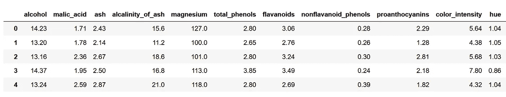
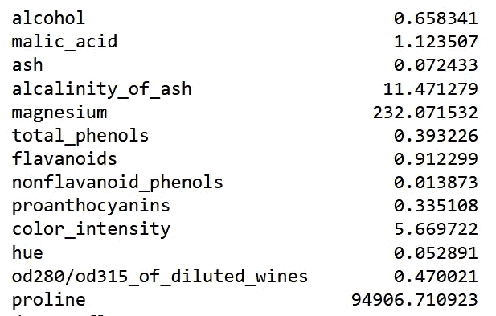
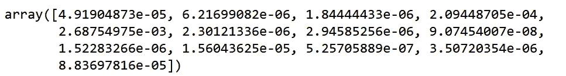
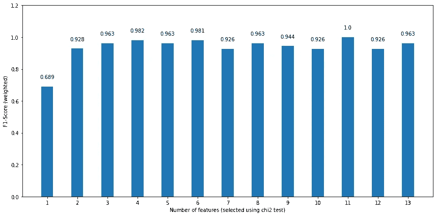
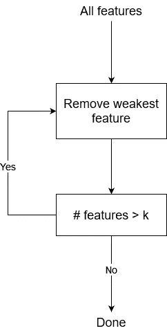
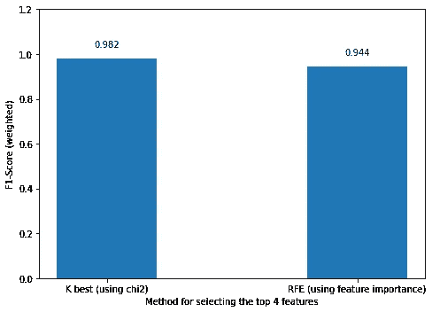

# 使用 Sklearn 进行功能选择的实用指南

> 原文：<https://towardsdatascience.com/a-practical-guide-to-feature-selection-using-sklearn-b3efa176bd96>

## 关于如何使用 Python 和 scikit-learn 为您的模型选择最佳要素的实践教程


JOSHUA COLEMAN 在 [Unsplash](https://unsplash.com?utm_source=medium&utm_medium=referral) 上拍摄的照片

构建预测模型时，我们的数据集中通常有许多可用于训练模型的特征或变量。然而，仅仅因为该特征存在于我们的数据集中，并不意味着它与我们的模型相关或者我们应该使用它。

那么我们如何知道在我们的模型中使用哪些特性呢？

这就是特性选择的用武之地。特征选择只是一个减少输入变量数量的过程，目的是只保留最重要的*变量。*

减少输入特征的数量具有优势，因为它简化了模型，降低了计算成本，并且还可以提高模型的性能。

现在，我们如何决定哪个特性是重要的？一个特性变得*重要*意味着什么？

对此没有明确的答案，所以我们需要用不同的方法进行实验，看看哪种方法能得到最好的结果。

在本文中，我们将探索并实现三种不同的特性选择方法:

*   方差阈值
*   k 最佳功能
*   递归特征消除(RFE)

每种方法都有自己的重要性定义，我们将看到它如何影响我们模型的性能。我们将使用 Python 和 scikit-learn 实现每个方法。在任何时候，你都可以在 GitHub 上查看完整的源代码。

> 以后的文章不要错过！[订阅](https://www.datasciencewithmarco.com/blog)我的列表，将新内容直接发送到您的收件箱！

我们开始吧！

# 获取数据

第一步自然是获取我们将在本教程中使用的数据。

这里，我们使用 sklearn 上的葡萄酒数据集。数据集包含 178 行，13 个特征和一个包含三个唯一类别的目标。因此，这是一项分类任务。

```
import pandas as pd
import numpy as np
import seaborn as sns
import matplotlib.pyplot as pltfrom sklearn.datasets import load_winewine_data = load_wine()wine_df = pd.DataFrame(
    data=wine_data.data, 
    columns=wine_data.feature_names)
wine_df['target'] = wine_data.target
```



截断的葡萄酒数据集。作者图片

从上面的图片中，我们可以看到我们有不同的葡萄酒特征，这将有助于我们对它进行分类。

我们可以选择绘制一些要素的箱线图，以查看是否有重叠。


前三个特征的箱线图。我们可以看到酒精没有太多重叠，但苹果酸和灰分有一些重叠。图片由作者提供。

从上面的图片中，我们可以看到*酒精*在每个类别之间没有太多重叠，而其他两个特征显然有一些重叠。

理想情况下，我们不会有任何重叠，这将使我们能够对每种葡萄酒进行完美的分类，但这不是这里的情况。

为了将重点放在特征选择技术上，我们在这里不做更多的探索。因此，在开始特性选择之前，让我们将数据分成训练集和测试集。

## 拆分数据

在实现特征选择技术之前，我们首先将数据分成训练集和测试集。

这样，我们就有了固定的起点和固定的测试集，这样我们就可以比较每种特征选择方法对模型性能的影响。

```
from sklearn.model_selection import train_test_splitX = wine_df.drop(['target'], axis=1)
y = wine_df['target']X_train, X_test, y_train, y_test = train_test_split(X, 
                                                    y, 
                                                    test_size=0.3, 
                                                    shuffle=True, 
                                                    stratify=y, 
                                                    random_state=42)
```

通过这种拆分，我们有 124 个样本用于训练集，54 个样本用于测试集。注意*分层*的使用，它确保训练集和测试集包含相同比例的目标类。

我们现在准备测试和实现不同的特性选择方法！

# 选择最佳功能

我们现在深入研究特征选择方法。如上所述，我们将尝试三种不同的方法，看看它如何影响模型的性能。

为了使这个实验更加健壮，我们将使用一个简单的决策树分类器。

## 方差阈值

我们将探讨的第一个方法是方差阈值。当然，这是基于方差的，方差是离差的一种度量。换句话说，它衡量的是一组数字与它们的平均值相差多远。

例如，[1，1，1，1，1]的方差为 0，因为每个数都等于它们的平均值。因此，它们不会超出平均值。

**方差阈值**然后简单地移除方差低于给定阈值的任何特征。

我们可以看到这对于移除方差接近于 0 的要素是多么有用，因为这意味着数据集的所有样本中的值都是恒定的或仅略有变化。因此，它们没有任何预测能力。

因此，让我们比较一下训练集中每个特征的方差。

```
X_train_v1 = X_train.copy()X_train_v1.var(axis=0)
```



训练集中每个特征的方差。图片由作者提供。

在上图中，我们可以看到训练集每个特征的方差。然而，我们现在还不能定义方差阈值，因为我们的数据没有相同的尺度，所以方差也不在相同的尺度上。

较大比例的数据可能比较小比例的要素具有更高的方差，即使它们的分布相似。

因此，在定义阈值之前，首先调整我们的数据是很重要的。在这里，我们将数据归一化，然后计算方差。

```
from sklearn.preprocessing import Normalizernorm = Normalizer().fit(X_train_v1)norm_X_train = norm.transform(X_train_v1)norm_X_train.var(axis=0)
```



归一化特征的方差。图片由作者提供。

从上图中，我们现在可以看到每个缩放特征的方差。虽然所有特性的方差都很小，但有些特性的方差小得令人难以置信，其幂为-8 到-7。

因此，让我们将阈值设置为 1e-6。方差低于该阈值的任何要素都将被移除。

```
from sklearn.feature_selection import VarianceThresholdselector = VarianceThreshold(threshold = 1e-6)
selected_features = selector.fit_transform(norm_X_train)selected_features.shape
```

这里去掉了两个特征，即*色相*和*非黄酮类 _ 酚类*。

我们现在可以看到决策树分类器在使用所有可用特征时的表现，我们删除了上面提到的两个特征。

```
from sklearn.tree import DecisionTreeClassifier
from sklearn.metrics import f1_scoredt = DecisionTreeClassifier(random_state=42)#Classifier with all features
dt.fit(X_train, y_train)
preds = dt.predict(X_test)f1_score_all = round(f1_score(y_test, preds, average='weighted'),3)# Classifier with selected features with variance thresholdX_train_sel = X_train.drop(['hue', 'nonflavanoid_phenols'], axis=1)
X_test_sel = X_test.drop(['hue', 'nonflavanoid_phenols'], axis=1)dt.fit(X_train_sel, y_train)
preds_sel = dt.predict(X_test_sel)f1_score_sel = round(f1_score(y_test, preds_sel, average='weighted'), 3)
```

打印两种型号的 F1 分数，得到 0.963。因此，删除两个特征并没有改进模型，但是我们确实实现了相同的性能。

因此，具有较少特征的更简单的模型获得了与使用所有特征相同的结果，这是一个好迹象。

现在，使用方差阈值有些简单，设置阈值有些随意。

使用下一种方法，我们可以很容易地找到在决定选择标准时要保留的变量的最佳数量。

## k 最佳功能

在这里，我们使用一种方法，这种方法在评估一个特性的重要性时提供了更多的灵活性。

算法很简单:我们简单地提供一种方法来计算一个特性的重要性和我们想要使用的特性的数量，记为 *k* 。然后，算法简单地返回顶部的 *k* 特征。

这种方法的主要优点是，我们可以自由选择各种方法来计算特征的重要性。例如，我们可以使用**卡方检验**来量化一个特性对目标的独立性。分数越高，特征和目标之间的相关性就越高，因此该特征的重要性就越高。

可以使用其他方法，例如计算互信息、使用假阳性率测试或计算回归任务的 F 统计量。

现在，我们仍然面临着确定应该为模型选择多少变量的挑战。在这里，由于我们总共只使用了 13 个特性，让我们试着对所有特性使用一个特性，看看哪种配置能得到最好的结果。

这里，我们使用卡方检验，因为我们正在处理一个分类任务。

```
from sklearn.feature_selection import SelectKBest
from sklearn.feature_selection import chi2X_train_v2, X_test_v2, y_train_v2, y_test_v2 = X_train.copy(), X_test.copy(), y_train.copy(), y_test.copy()f1_score_list = []for k in range(1, 14):
    selector = SelectKBest(chi2, k=k)
    selector.fit(X_train_v2, y_train_v2)

    sel_X_train_v2 = selector.transform(X_train_v2)
    sel_X_test_v2 = selector.transform(X_test_v2)

    dt.fit(sel_X_train_v2, y_train_v2)
    kbest_preds = dt.predict(sel_X_test_v2)f1_score_kbest = round(f1_score(y_test, kbest_preds, average='weighted'), 3)
    f1_score_list.append(f1_score_kbest)

print(f1_score_list)
```

我们现在可以绘制模型中使用的每个变量的 F1 分数:

```
fig, ax = plt.subplots(figsize=(12, 6))x = ['1','2','3','4','5','6','7','8','9','10','11','12','13']
y = f1_score_listax.bar(x, y, width=0.4)
ax.set_xlabel('Number of features (selected using chi2 test)')
ax.set_ylabel('F1-Score (weighted)')
ax.set_ylim(0, 1.2)for index, value in enumerate(y):
    plt.text(x=index, y=value + 0.05, s=str(value), ha='center')

plt.tight_layout()
```



f1-根据模型中使用的特征数量进行评分。图片由作者提供。

从上图中我们可以看出，根据卡方检验，仅使用最重要的特征会产生最差的性能，而使用前 11 个特征会产生完美的 F1 分数。但是，我们还要注意，使用前 6 个特性会得到 0.981 的 F1 分数，考虑到我们使用了一半的特性，这是一个小缺点。此外，我们看到仅使用前 4 项功能也有类似的性能。

通过这个例子，我们可以清楚地看到特征选择不仅可以简化模型，还可以提高模型的性能，即使我们正在处理一个简单的玩具数据集。

当然，使用不同的要素重要性赋值器可能会导致不同的结果。我邀请你使用另一个测试，而不是卡方测试，自己看看结果图是否有很大的变化。

让我们继续讨论我们将实现的最后一个方法:**R**E 反转 **F** 特性 **E** 消除或 **RFE** 。

## 递归特征消除(RFE)

我们在本文中实现的最后一种方法是递归特征消除或 RFE。

下图显示了 RFE 程序。



RFE 算法。图片由作者提供。

从上图中，我们看到 RFE 也要求我们设置一些特性。从那里开始，它将逐渐删除最不重要的功能，直到它达到所需的功能数量。

这种特征选择方法的有趣之处在于，它依赖于模型评估特征重要性的能力。因此，我们必须使用返回系数或特征重要性度量的模型。

在这里，由于我们使用了决策树，模型实际上可以计算一个特性的重要性。

在决策树中，特征的重要性是通过节点杂质的减少乘以到达该节点的概率来计算的。这是基于在决策树后台运行的 CART 算法。你可以在这里阅读更多相关信息[。](https://www.analyticssteps.com/blogs/classification-and-regression-tree-cart-algorithm)

现在，让我们测试 RFE 选择方法。我们将输入变量的数量设置为 4，并查看与使用卡方检验选择前 4 个特征相比，性能如何。这样，我们将看到哪种评估特征重要性的方法(卡方检验或决策树计算的特征重要性)可以为我们的模型选择最佳的四个特征。

使用 sklearn 实现 RFE 非常简单。首先，我们定义选择器并指定我们想要的特性数量。在这种情况下，我们需要四个。然后，我们在训练集上安装选择器，这将为我们返回前 4 个特征。

```
from sklearn.feature_selection import RFEX_train_v3, X_test_v3, y_train_v3, y_test_v3 = X_train.copy(), X_test.copy(), y_train.copy(), y_test.copy()RFE_selector = RFE(estimator=dt, n_features_to_select=4, step=1)RFE_selector.fit(X_train_v3, y_train_v3)
```

我们还可以通过访问 *support_* 属性来查看所选特性的名称。

```
X_train_v3.columns[RFE_selector.support_]
```

在这里，我们看到前 4 大功能是:

*   灰分的碱性
*   黄酮类化合物
*   颜色强度
*   脯氨酸

请记住，根据决策树本身的评估，这是前 4 个最重要的特征。

现在，我们可以仅使用前 4 个特征来拟合模型，并计算测试集的 F1 分数。

```
sel_X_train_v3 = RFE_selector.transform(X_train_v3)
sel_X_test_v3 = RFE_selector.transform(X_test_v3)dt.fit(sel_X_train_v3, y_train_v3)RFE_preds = dt.predict(sel_X_test_v3)rfe_f1_score = round(f1_score(y_test_v3, RFE_preds, average='weighted'),3)print(rfe_f1_score)
```

或者，我们可以直观显示仅使用前 4 项功能的两种模型的性能。



f1-使用根据不同方法选择的前 4 个特征的两个模型的得分。图片由作者提供。

从上图可以看出，卡方检验选出的前 4 个特性带来了更好的性能。

现在，带回家的信息不是 K 最佳特征是比 RFE 更好的特征选择方法。主要区别在于如何计算特征的重要性。一个使用卡方检验，而另一个使用决策树计算的特征重要性。

因此，我们可以得出结论，在这种情况下，使用卡方检验是评估前 4 个最佳特性的更好方法。

# 结论

在本文中，我们研究了特征选择，这是一种减少模型中的特征数量以简化模型并提高其性能的方法。

我们探索并实现了三种不同的特征选择方法:

*   方差阈值
*   k 最佳功能
*   递归特征消除(RFE)

方差阈值有利于移除方差为 0 的要素，因为常量变量肯定不是好变量。但是，设置方差阈值很难，而且相当随意，我建议将它与 K 最佳要素或 RFE 一起使用。

有了 K 个最佳特征，我们就能够选择如何评估一个特征的重要性，这也允许我们确定在我们的模型中包括的最佳方法和最佳数量的特征。

最后，RFE 是另一种特征选择方法，它依靠模型本身来计算特征的重要性。

请注意，没有选择特性的最佳方式。重要的是测试不同的特征选择方法和不同的特征重要性评估方法，以查看哪种方法对于给定的问题最有效。

谢谢你的阅读，我希望学到一些有用的东西！

干杯🍺