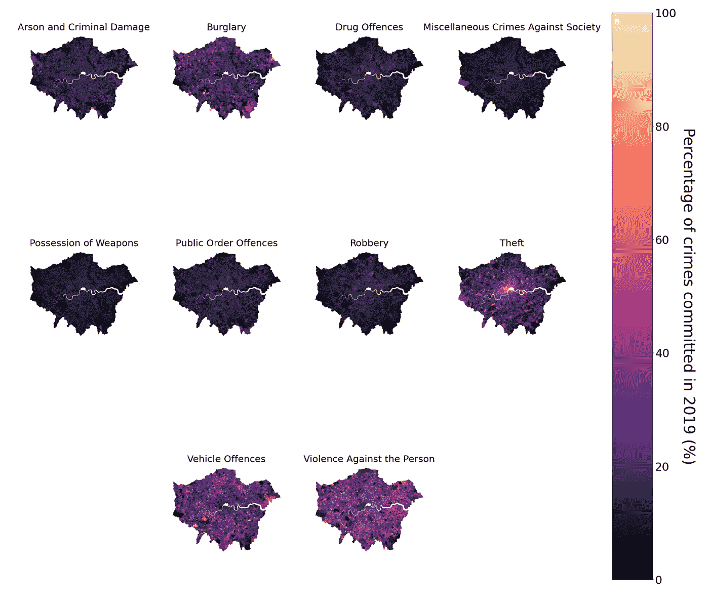
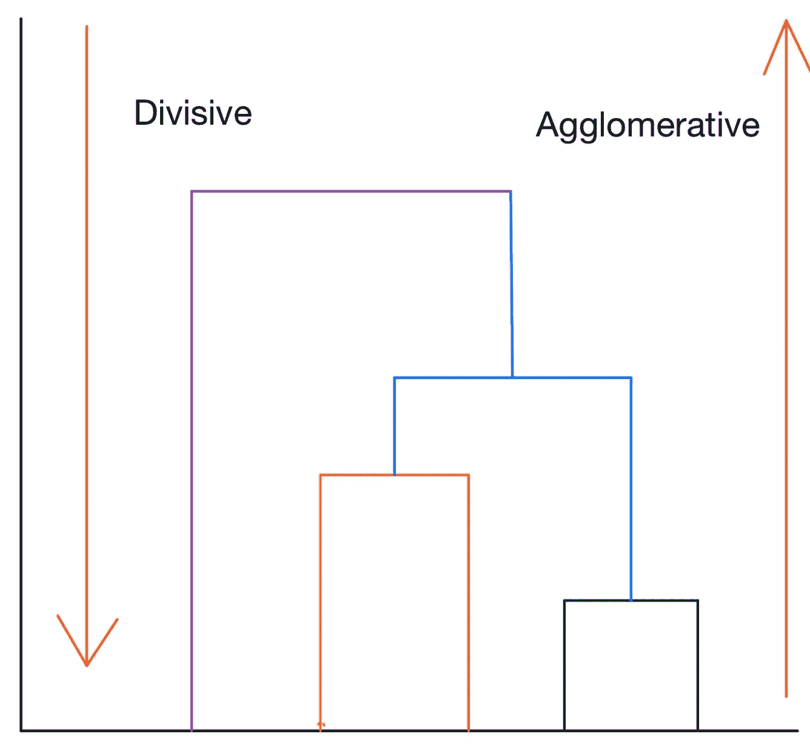
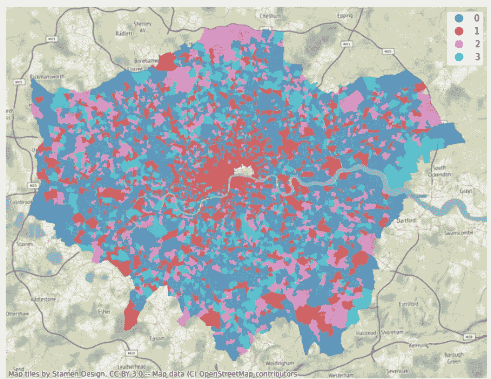
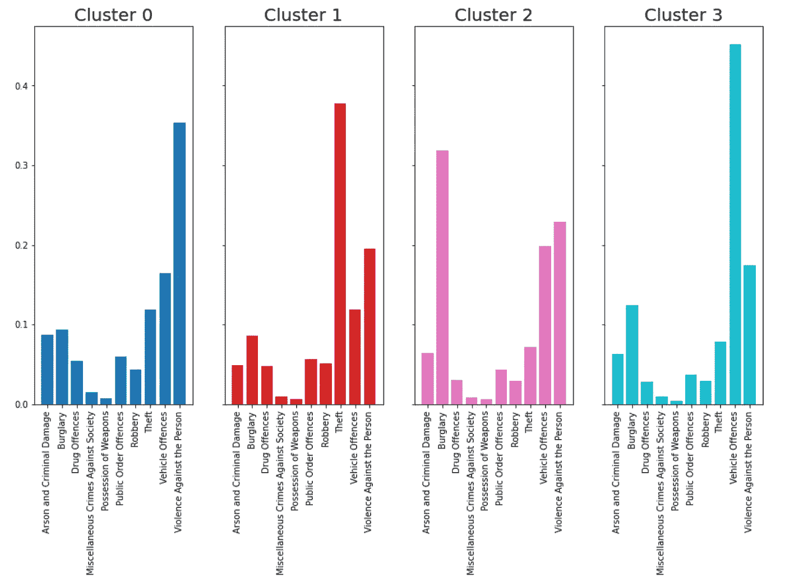
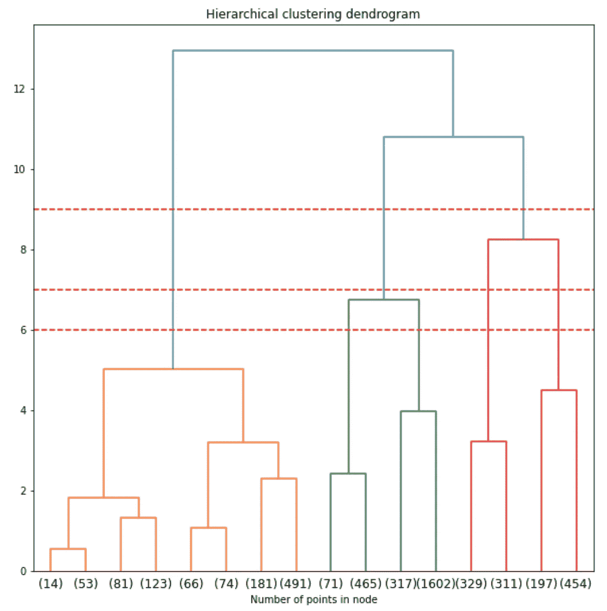

# scikit-learn 中的分层聚类实用介绍

> 原文：<https://towardsdatascience.com/a-practical-introduction-to-hierarchical-clustering-from-scikit-learn-ffaf8ee2670c>

## UCL 数据科学学会研讨会 17:什么是层次聚类、实现、解释和评估



作者图片

今年，作为 UCL 数据科学协会的科学负责人，该协会将在整个学年举办一系列 20 场研讨会，主题包括数据科学家工具包 Python 的介绍以及机器学习方法。每个人的目标是创建一系列的小博客文章，这些文章将概述主要观点，并为任何希望跟进的人提供完整研讨会的链接。所有这些都可以在我们的 [GitHub](https://github.com/UCL-DSS) 资源库中找到，并将在全年更新新的研讨会和挑战。

本系列的第 17 个研讨会是 Python 数据科学研讨会系列的一部分，涵盖了 scikit-learn 的层次聚类。在本次研讨会中，我们将介绍什么是层次聚类，如何实现该模型，解释结果，以及可视化的树状图。一如既往，这篇博文是整个研讨会的总结，可以在[这里](https://github.com/UCL-DSS/hierarchical_clustering)找到，它更详细地涵盖了这些主题，并提供了数据集。

如果您错过了之前的任何研讨会，您可以在这里找到:

[](/a-practical-introduction-to-kmeans-clustering-using-scikit-learn-fd9cff95144b)  [](/a-practical-introduction-to-support-vector-machines-from-scikit-learn-6e678cf1f228)  [](https://python.plainenglish.io/a-practical-introduction-to-random-forest-classifiers-from-scikit-learn-536e305d8d87)  

**什么是层次聚类？**

分层聚类是称为聚类的无监督学习模型组的一部分。这意味着我们没有一个明确的目标变量，不像传统的回归或分类任务。因此，这种机器学习算法的要点是通过对所选变量使用定义的距离度量来识别具有相似特征的不同对象群。属于这个家族的其他机器学习算法包括 Kmeans 或 DBscan。

这种特定的算法有两种主要的风格或形式:自顶向下或自底向上。第一种是自上而下的，首先将所有点视为一个单独的聚类，然后逐渐将它们分解成单独的聚类(分裂的),直到它们都是自己的聚类的一部分。第二种是自底向上的，从所有点都是它们自己的聚类的一部分的基础开始，然后迭代地将两个最近的点分组在一起，直到它们都是单个聚类的一部分(聚集的)。这种聚类的层次结构可以表示为如下的树(或树状图)。当我们沿着 y 轴向上走时，这就代表了单个的集群和距离的增加。这可以想象为:



作者图片

最常见的形式是我们在这里使用的凝聚法。

与其他聚类方法相比，层次聚类的优势在于它不需要指定聚类的数量，算法对距离度量不太敏感，并且当我们期望数据具有层次结构时，它非常有用。然而，这是以较低的效率为代价的，因为时间复杂度更高，并且没有自然的性能指标可以使用。

## 履行

分层聚类方法的应用将针对从伦敦犯罪数据存储中提取的伦敦犯罪数据，这些数据是关于在本地超级输出区域规模(人口普查几何)发生的犯罪的。选择这一级别是因为它们代表了每个地区家庭数量方面最标准化的单位，减少了由于非标准地理单位而可能出现的一些潜在差异。

为此，我们重点关注伦敦的 10 种主要犯罪类型，它们在每个 LSOA 的总体犯罪中所占的比例如下:


作者图片

基于这种分布，我们可以尝试对结果进行聚类，以了解聚类是如何发展的。这可以通过以下方式实现:

```
#import the necessary module
from sklearn.cluster import AgglomerativeClustering#create the model that we want, setting the linkage to ward, the distance threshold to 4 and 
#set the number of clusters to none so that we can plot the dendrogram afterwards
model = AgglomerativeClustering(linkage="ward", 
                                distance_threshold = 7, 
                                n_clusters=None)
#fit the model to the data
model.fit(crime_clus)
```

## 解释

正如我们在开始时所说，该模型是一种无监督的机器学习算法，这意味着我们不一定知道要实现的最佳聚类数，除非我们有一些先验理论或数据解释。这种方法也不同于 Kmeans 聚类，在 k means 聚类中，我们可以使用“肘方法”或“轮廓分数”来确定最佳的聚类数。因此，选择正确的模型实现取决于您的目的以及您自己和您的受众是否能够理解这些组。

在我们的例子中，由于我们的模型在本质上是地理的，所以我们既可以根据每个聚类内的值分布来解释模型，也可以根据地理来解释模型。这可以通过以下方式实现:

```
London_crime["Aggl_clus"] = model.labels_fig, ax = plt.subplots(figsize = (10,10))London_crime.plot(column = "Aggl_clus", 
                  categorical = True, 
                  legend=True, 
                  ax=ax,
                  alpha = 0.7,
                 cmap = "tab10")cx.add_basemap(ax = ax,
               crs = "EPSG:27700")ax.set_axis_off()
```



作者图片

```
agglom_means =London_crime.groupby("Aggl_clus")[to_plot].mean()
agglom_means_T = agglom_means.T.round(3)#agglom_means_T.reset_index(inplace=True)
agglom_means_T = pd.DataFrame(agglom_means_T)agglom_means_T.reset_index(inplace=True)#get the colours
colors = ["#1f77b4", "#d62728", "#e377c2", "#17becf"]#create subplots for each cluster
fig, ax = plt.subplots(1,4, figsize = (15,8), sharey = True, sharex = True)
#flatten the axis
axis = ax.flatten()#going over each column
for i, col  in enumerate(agglom_means_T.columns):
    #ignore the index column
    if col != "index":
        ax = axis[i-1]
        #plot the bar chart
        ax.bar(height = agglom_means_T[col], x=agglom_means_T["index"], color = colors[i-1] )
        #rotate the x-ticks
        ax.set_xticklabels(labels =agglom_means_T["index"], rotation = 90)
        #set the title
        ax.set_title(f"Cluster {col}", fontsize = 20)
```



作者图片

由此我们可以看出，与其他群组相比，群组 0 平均具有相对较高的人身暴力、纵火、刑事损害和毒品犯罪。灌肠 1 是占主导地位的盗窃案件相对较低的车辆犯罪。第二组主要是入室盗窃，而第三组主要是车辆犯罪，这表明每个地区的犯罪性质不同。

基于这些，我们可以分配标签，例如:

*   第 1 组:对人的暴力行为
*   **集群二**:盗窃
*   **集群 3** :入室盗窃
*   **群组 4** :车辆违法行为

## 估价

衡量这种聚类是否表现良好的一个很好的指标是聚类的大小。这是因为如果一个聚类占主导地位，那么它表明该聚类不一定表现良好(取决于您对底层数据的理论。我们可以这样检查:

```
agglom_sizes = London_crime.groupby("Aggl_clus").size()
agglom_sizes#out:
Aggl_clus
0    2455
1    1083
2     651
3     640
```

我们可以看到集群 0 占主导地位，这表明这可能会被打破，取决于如何构建层次结构。

假设这是层次聚类，我们可以通过绘制模型的树状图来了解模型的行为。这显示了模型如何表现的层次结构，目的是能够看到集群的层次结构如何相互适应，以及我们是否应该以更多或更少的组为目标。这可以通过以下方式实现:

```
import numpy as np
from scipy.cluster.hierarchy import dendrogramdef plot_dendrogram(model, **kwargs):

    counts = np.zeros(model.children_.shape[0])
    n_samples = len(model.labels_)
    for i, merge in enumerate(model.children_):
        current_count = 0
        for child_idx in merge:
            if child_idx < n_samples:
                current_count +=1
            else:
                current_count += counts[child_idx-n_samples]
        counts[i] = current_count

    linkage_matrix = np.column_stack([model.children_, model.distances_,
                                     counts]).astype(float)

    dendrogram(linkage_matrix, **kwargs)fig, ax = plt.subplots(figsize = (10,10))
ax.set_title("Hierarchical clustering dendrogram")
#plot the top three levels of the dendrogram
plot_dendrogram(model, truncate_mode='level', p=3)
plt.axhline(y = 7, color = "r", linestyle = "--")
plt.axhline(y = 6, color = "r", linestyle = "--")
plt.axhline(y = 9, color = "r", linestyle = "--")
ax.set_xlabel("Number of points in node")
plt.show()
```



作者图片

这表明，使用当前的距离度量，我们得到四个聚类，然而，我们可以看到，在稍大的距离处，出现三个聚类而不是四个，或者在稍小的距离处，则可能出现五个聚类。

这样，我们可以更详细地探索聚类及其可解释性如何随着模型本身内的不同距离而变化，或者随着数据的不同标准化、不同距离、甚至模型内的不同联系而改变模型实现。这也可以包括地理约束模型，将周围的 LSOAs 考虑到模型中，如此处的[所示](/introduction-to-hierarchical-clustering-part-3-spatial-clustering-1f8cbd451173)。

如果您想了解我们协会的更多信息，请随时关注我们的社交网站:

https://www.facebook.com/ucldata 脸书

insta gram:https://www.instagram.com/ucl.datasci/

领英:[https://www.linkedin.com/company/ucldata/](https://www.linkedin.com/company/ucldata/)

如果你想了解 UCL 数据科学协会和其他优秀作者的最新信息，请使用我下面的推荐代码注册 medium。

[](https://philip-wilkinson.medium.com/membership)  

或者在媒体上查看我的其他商店，例如:

[](/an-introduction-to-sql-for-data-scientists-e3bb539decdf)  [](/git-and-github-basics-for-data-scientists-b9fd96f8a02a)  [](/multi-variate-outlier-detection-in-python-e900a338da10) 