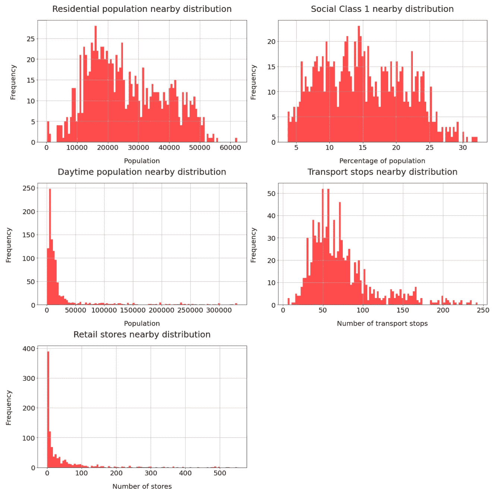
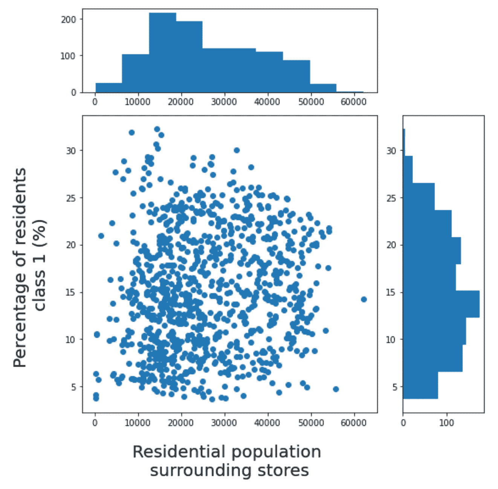
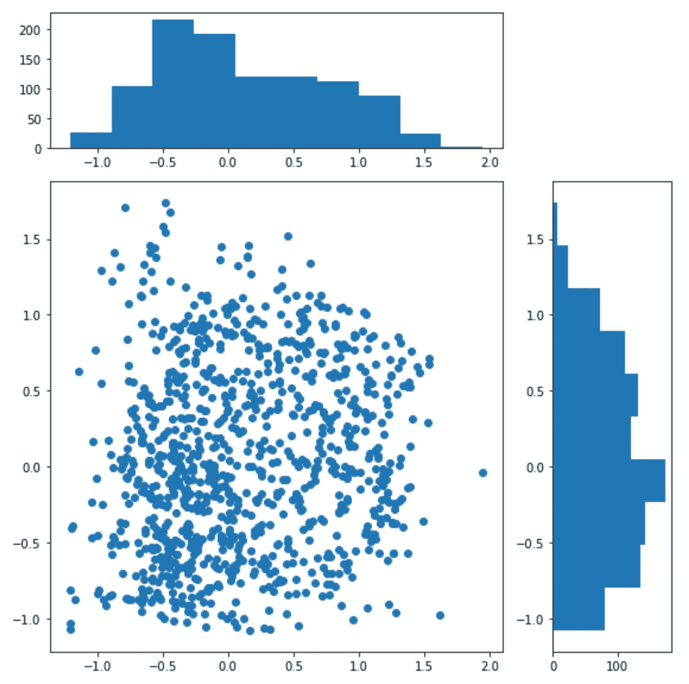
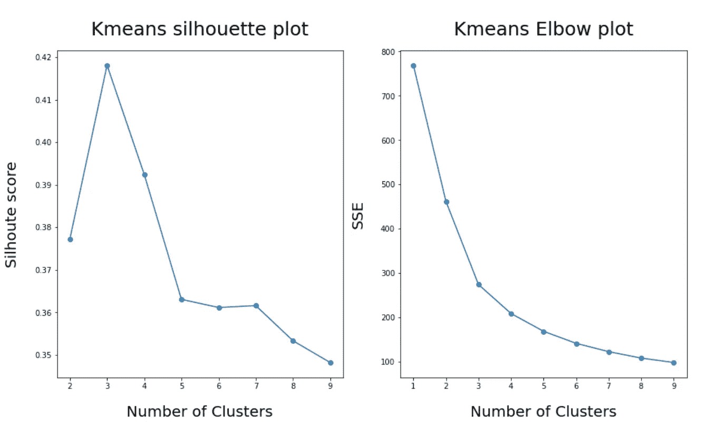
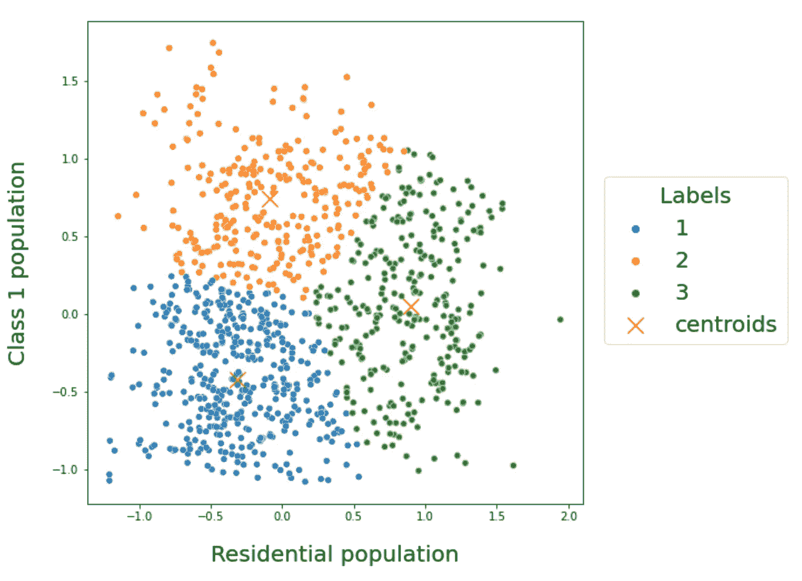
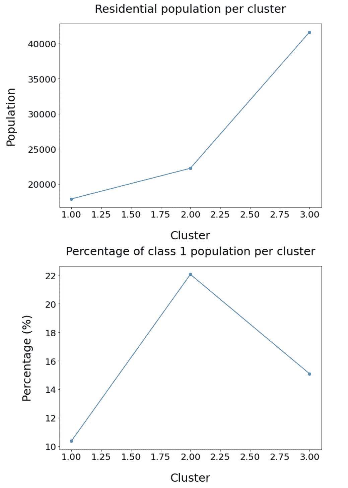
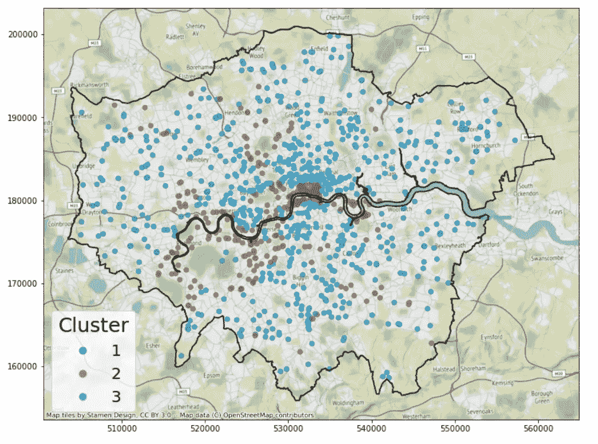

# 使用 scikit-learn 进行 Kmeans 聚类的实用介绍

> 原文：<https://towardsdatascience.com/a-practical-introduction-to-kmeans-clustering-using-scikit-learn-fd9cff95144b>

## UCL 数据科学学会研讨会 16:什么是 Kmeans 集群、实现、评估和解释


法比奥·巴拉西纳在 [Unsplash](https://unsplash.com?utm_source=medium&utm_medium=referral) 上拍摄的照片

今年，作为 UCL 数据科学协会的科学负责人，该协会将在整个学年举办一系列 20 场研讨会，主题包括 Python 简介、数据科学家工具包和机器学习方法等。每个人的目标是创建一系列的小博客文章，这些文章将概述主要观点，并为任何希望跟进的人提供完整研讨会的链接。所有这些都可以在我们的 [GitHub](https://github.com/UCL-DSS) 资源库中找到，并将在全年更新新的研讨会和挑战。

本系列的第十六个研讨会是 Python 数据科学研讨会系列的一部分，涵盖了 scikit-learn 中的 Kmeans 集群。在本次研讨会中，我们将讲述什么是 Kmeans 聚类，如何实现该模型，如何选择最佳的聚类数，以及如何解释结果。和往常一样，这篇博文是整个研讨会的总结，可以在[这里](https://github.com/UCL-DSS/Kmeans-clustering-workshop7)找到，它更详细地涵盖了这些主题并展示了数据集。

如果您错过了 UCL 数据科学协会之前举办的任何研讨会，可以在这里找到最后三场研讨会:

[](/a-practical-introduction-to-support-vector-machines-from-scikit-learn-6e678cf1f228) [## 来自 scikit-learn 的支持向量机实用介绍

### UCL 数据科学学会研讨会 15:什么是支持向量机，如何实现它们，以及如何评估它们

towardsdatascience.com](/a-practical-introduction-to-support-vector-machines-from-scikit-learn-6e678cf1f228) [](https://python.plainenglish.io/a-practical-introduction-to-random-forest-classifiers-from-scikit-learn-536e305d8d87) [## scikit-learn 中随机森林分类器的实用介绍

### UCL 数据科学学会研讨会 14:什么是随机森林分类器、实现、评估和改进

python .平原英语. io](https://python.plainenglish.io/a-practical-introduction-to-random-forest-classifiers-from-scikit-learn-536e305d8d87) [](/how-to-implement-and-evaluate-decision-tree-classifiers-from-scikit-learn-36ef7f037a78) [## 如何实现和评估来自 scikit-learn 的决策树分类器

### UCL 数据科学学会研讨会 13:什么是决策树，决策树的实现，可视化和…

towardsdatascience.com](/how-to-implement-and-evaluate-decision-tree-classifiers-from-scikit-learn-36ef7f037a78) 

## 什么是 Kmeans 集群？

Kmeans 聚类是机器学习的无监督分支的一部分。这意味着我们没有一个明确的目标变量来工作，或者像我们在传统的回归或分类任务中那样去瞄准。因此，该算法的目标是能够识别具有相似特征的不同对象组，例如购物者、电影或本例中的商店。

该方法的工作方式是首先定义要创建的组的目标数量 k，然后算法将初始化数据中的多个质心。从这些质心，每个数据点被分配到每个聚类的距离最近的质心。然后，这些点将进行调整以优化它们的位置，从而最小化类内平方和值。然后，当质心不随每次迭代而改变或者定义的迭代次数已经完成时，该模型被认为是优化的。

这方面的主要问题是，由于这是一种无监督的机器学习算法，我们并不总是知道最佳的聚类数是多少。该算法可以通过“肘方法”评估聚类的数量或通过识别最大轮廓分数来帮助实现这一点。这些将在后面展示，但需要注意的是，这两种技术并不总是完全一致，分组可能是主观的。这意味着我们需要评估与聚类背后的实际值相关的结果，看看它们对我们是否有意义，然后我们是否可以向我们选择的受众解释它们。

## Kmeans 实现

我们将在此应用中使用的数据集是伦敦便利店数据集，该数据集用于尝试复制由 [Hood 等人(2016)](https://www.tandfonline.com/doi/abs/10.1080/09593969.2015.1086403) 执行的分析。这里的目的是能够根据便利店服务的客户群来识别便利店群体。出于我们的目的，这意味着数据集包含以下信息:

*   500 米内居住人口的估计
*   500 米内白天人口的估计
*   500 米范围内交通站数量的计数
*   500 米范围内其他零售店的数量
*   社会阶层 1 内居住人口的百分比(根据 2011 年人口普查的定义)

伦敦的每一家便利店。我们可以将这些分布视为:

```
#set the columns we are interested in
columns = ["residential_pop", 
            "class_1_pop",
            "WZ_area_pop",
            "transport_nearby",
            "stores_nearby"]
#set the histogram titles
hist_titles = ["Residential population nearby distribution",
              "Social Class 1 nearby distribution",
              "Daytime population nearby distribution",
              "Transport stops nearby distribution",
              "Retail stores nearby distribution"]
#set the acis labels
axis_labels = ["Population", 
              "Percentage of population",
              "Population",
              "Number of transport stops",
              "Number of stores"]#create a base axis for teh plots
fig, ax = plt.subplots(3,2, figsize = (20,20))
#flatten the axis to make it easy to iteratre over
axis = ax.flatten()#iterate over each columns using the labels information already set up
for i, col in enumerate(columns):

    #create the histogram using the column
    stores_dataset[col].hist(bins = 100, ax = axis[i],
                                       color = "red",
                                       alpha = 0.7)
    #add label information
    axis[i].set_title(hist_titles[i], fontsize = 25, pad = 25)
    axis[i].set_ylabel("Frequency", fontsize  =20, labelpad = 30)
    axis[i].set_xlabel(f"{axis_labels[i]}", fontsize = 20, labelpad = 20)
    axis[i].tick_params(axis = "both", labelsize = 20)#remove the unused axis
axis[5].set_axis_off()
#keep the layout tight
plt.tight_layout()
#show the plot 
plt.show()
```



作者图片

就探索 Kmeans 算法而言，我们可以简单地关注商店 500 米范围内的居住人口，以及人口普查定义的社会阶层 1 中的人口百分比。

我们可以根据这些数据创建一个散点图，以查看分布情况，并查看是否有我们可以识别的明确分组:

```
from matplotlib.gridspec import GridSpec
#[https://stackabuse.com/matplotlib-scatter-plot-with-distribution-plots-histograms-jointplot/](https://stackabuse.com/matplotlib-scatter-plot-with-distribution-plots-histograms-jointplot/)#set the grid
fig = plt.figure(figsize = (8,8))
gs = GridSpec(4,4)#set the grids fr the catter and the distributions
ax_scatter = fig.add_subplot(gs[1:4, 0:3])
ax_hist_x = fig.add_subplot(gs[0, 0:3])
ax_hist_y = fig.add_subplot(gs[1:4, 3])#add the scatter plots
ax_scatter.scatter(
    stores_dataset["residential_pop"],
    stores_dataset["class_1_pop"])#add the histograms
ax_hist_x.hist(stores_dataset["residential_pop"])
ax_hist_y.hist(stores_dataset["class_1_pop"],
              orientation = "horizontal")ax_scatter.set_ylabel("Percentage of residents \nclass 1 (%)",
                     fontsize = 20,
                     labelpad = 20)
ax_scatter.set_xlabel("Residential population \nsurrounding stores",
                     fontsize = 20,
                     labelpad = 20)#show the plot
plt.tight_layout()
```



作者图片

由此我们可以清楚地看到，从当前图中没有出现明显的数据组。这可能意味着它可能不是最好的数据，但现在我们将运行它，看看我们会得到什么。

需要注意的一个关键问题是，这两个目标变量的规模有很大不同。由于 Kmeans 聚类是一种基于距离的算法，我们需要确保这些值在大致相同的范围和比例内。我们可以使用 sklearn 的定标器套件和归一化算法来实现这一点。因为为了简单起见，这些分布看起来大致是正态的(仅仅是大致的),我们可以如下使用`RobustScaler`:

```
#import the necessary scaler
from sklearn.preprocessing import RobustScaler#create the scaler
scaler = RobustScaler()#create data to transform on
tr_data = stores_dataset[["id", "retailer", "fascia",
                         "store_name", "residential_pop",
                         "class_1_pop"]].copy()#set the columns to transofmr
cols_transform = ["residential_pop",
                 "class_1_pop"]#fit the algorithm to the data
for col in cols_transform:
    tr_data[col] = scaler.fit_transform(tr_data[col].values.reshape(-1,1))#reapet the plot as before
fig = plt.figure(figsize = (8,8))
gs = GridSpec(4,4)ax_scatter = fig.add_subplot(gs[1:4, 0:3])
ax_hist_x = fig.add_subplot(gs[0, 0:3])
ax_hist_y = fig.add_subplot(gs[1:4, 3])ax_scatter.scatter(
    tr_data["residential_pop"],
    tr_data["class_1_pop"])ax_hist_x.hist(tr_data["residential_pop"])
ax_hist_y.hist(tr_data["class_1_pop"],
              orientation = "horizontal")plt.tight_layout()
```



作者图片

我们可以看到数据大致符合相同的范围，并遵循大致的正态分布。

但是等等，当初不是说不知道要实现多少个集群吗？正确！除非我们有一些理论或者上面数据中突然出现的聚类数，否则我们必须找出聚类数的最佳值。

## **挑选集群数量**

两种主要的方法是“肘图”法和轮廓评分法。

第一种方法使用聚类中的**惯性**，它是样本到它们最近的聚类中心的平方距离之和。目的是找到惯性增益开始变平的拐点(添加更多的集群总会有一些增益)，这表明已经达到了最佳的集群数量。为此，我们也可以在这种情况下使用失真值(从各自聚类的聚类中心的平均平方距离)。问题是添加更多集群总会有一些好处，因此不会出现明显的瓶颈。

第二种方法试图找到轮廓分数处于最大值的地方。这是因为这是一种衡量数据点与其自己的聚类相比与其他聚类相似程度的方法，值越接近 1，表明聚类分离越好。每个点都可以有自己的轮廓分数，所以我们的目标是找到最大的平均轮廓分数，因为这将建议最佳的聚类数。因此，我们将争取最大的价值。

我们可以按如下方式实现和评估这些功能:

*   对于肘法

```
#import the necessary libraries
from sklearn import metrics
from sklearn.cluster import KMeans#create an empty list
list_SSE = []
#set ther ange of clusters to evaluate
min_k = 1
max_k = 10
range_k = range(min_k, max_k)#iterate over the range
for i in range_k:
    #perform the clustering algorithm
    km = KMeans(n_clusters = i,
               init = "random",
               n_init = 10,
               max_iter = 300,
               tol = 1e-04, 
                random_state = 22)
    #fit this to the data
    km.fit(tr_data[["residential_pop",
                 "class_1_pop"]])
    #add the SEE score
    list_SSE.append(km.inertia_)
```

*   为了剪影配乐

```
#for the silhouette score
import random#create an empty list
silhouette = []#iteratre over the number of clusters to evaluate
for i in range(2,10):

    #create an empty list to hold the averages
    average = []
    #perform the clustering algorithm several times for each number of clusters
    for x in range(1,10):
        #set the number of clusters
        k_cluster = i
        #generate a arandom seed number
        random_seed = random.randint(1,101)
        #apply the KMeans clustering algorithm
        kmeans_method = KMeans(n_clusters = k_cluster,
                              random_state = random_seed)
        kmeans_method.fit(tr_data[["residential_pop",
                 "class_1_pop"]])
        #extract the labels
        labels = kmeans_method.labels_
        #extract the silhouette score
        a = metrics.silhouette_score(tr_data[["residential_pop",
                 "class_1_pop"]], labels)
        #append the result
        average.append(a)
    #clauclate the average silhouette score for each number of clusters 
    silhouette.append(sum(average)/len(average))
```

这两者都可以绘制成:

```
#combine both plots
fig, ax = plt.subplots(1,2, figsize = (15,8))ax[0].plot(range(2,10), silhouette, marker = "o")
ax[0].set_xlabel("Number of Clusters", fontsize = 20, labelpad = 20)
ax[0].set_ylabel("Silhoute score", fontsize =20, labelpad = 20)
ax[0].set_title("Kmeans silhouette plot", fontsize = 25, pad = 20)ax[1].plot(range_k, list_SSE, marker = "o")
ax[1].set_xlabel("Number of Clusters", fontsize = 20, labelpad = 20)
ax[1].set_ylabel("SSE", fontsize =20, labelpad = 20)
ax[1].set_title("Kmeans Elbow plot", fontsize = 25, pad = 20)
```



作者图片

这两个图似乎表明，用该数据集实现的聚类的最佳数量是三个聚类(最高轮廓得分和肘图的开始)。当然，尽管模型显示了这些结果，我们需要实际验证它们是否对我们有意义。

## 评估集群

我们可以首先从模型中提取标签，并将其附加到我们的数据集，如下所示:

```
#create the model
kmeans_method = KMeans(n_clusters = 3,
                      random_state = 42,
                      n_init = 10)
#fit it to the data
kmeans_method.fit(tr_data[["residential_pop",
                 "class_1_pop"]])
#extract the labels
tr_data["labels"] = kmeans_method.labels_ + 1
```

然后，我们可以提取聚类的质心，并将结果绘制为:

```
#extract the centres
centres = pd.DataFrame(kmeans_method.cluster_centers_,
                       columns = ["x", "y"])#plot the results
fig, ax = plt.subplots(1,1, figsize = (8,8))sns.scatterplot(data = tr_data,
               x = "residential_pop",
               y = "class_1_pop",
               hue = "labels",
               palette = "tab10" )sns.scatterplot(data = centres,
               x = "x",
               y = "y",
               marker = "x",
               facecolor = "red",
               s = 200,
               label = "centroids")ax.legend(fontsize = 20,
         title_fontsize = 20,
         title = "Labels",
         bbox_to_anchor = (1.02, 0.7))ax.set_ylabel("Class 1 population",
             fontsize = 20,
             labelpad = 20)
ax.set_xlabel("Residential population",
             fontsize = 20,
             labelpad = 20)
```



作者图片

但是，这是基于转换后的数据，可能很难解释(我们可以开始在转换后的数据上探索这一点，并比较聚类的均值和标准差，但我更喜欢在原始数据集上检查这一点)，因此我们可以在原始数据上应用这一点。由于这是二维地理数据，我们可以在以下位置查看模型:

*   原始数据
*   群体的手段
*   地域代表性

看看它们是否有意义。我们可以这样做:

```
#add the labels back to the original data
stores_dataset["labels"] = kmeans_method.labels_ + 1#create the base axis
fig, ax = plt.subplots(1,1, figsize = (8,8))#plot the results
sns.scatterplot(data = stores_dataset,
               x = "residential_pop",
               y = "class_1_pop",
               hue = "labels",
               palette = "tab10" )#adjust the legend
ax.legend(fontsize = 20,
         title_fontsize = 20,
         title = "Labels",
         bbox_to_anchor = (1.02, 0.7))#add the xis labels
ax.set_ylabel("Class 1 population (%)",
             fontsize = 20,
             labelpad = 20)
ax.set_xlabel("Residential population",
             fontsize = 20,
             labelpad = 20)
```


作者图片

```
#extract the columns
columns = ["residential_pop",
          "class_1_pop"]#set the titles
titles = ["Residential population per cluster", 
         "Percentage of class 1 population per cluster"]
#set the labels
ylabels = ["Population",
          "Percentage (%)"]#create a base plot
fig, ax = plt.subplots(2,1, figsize = (10,15))
#flatten the axis
axis = ax.flatten()#iterate over each column to create plots for each 
for i, col in enumerate(columns):
    #create an empty dictionary
    col_dict = {}
    #iterate over each label
    for label in list(stores_dataset["labels"].unique()):
        #crete a new dataframe for each label
        label_df = stores_dataset[stores_dataset["labels"] == label]
        #add the mean to the dataframe
        col_dict[label] = label_df[col].mean()
    #convert the dictionary to a dataframe
    column_df = pd.DataFrame.from_dict(col_dict, orient = "index")
    #reset the index
    column_df.reset_index(inplace=True)
    #sort the values by the index
    column_df.sort_values(by = "index", inplace=True)

    #plot the results
    axis[i].plot(column_df["index"], column_df[0],
                marker = "o")

    #set the plots up
    axis[i].set_title(titles[i], fontsize = 25, pad = 25)
    axis[i].set_xlabel("Cluster", fontsize = 25, labelpad = 25)
    axis[i].set_ylabel(ylabels[i], fontsize =25, labelpad = 25)
    axis[i].tick_params(axis = "both", labelsize = 20)#set the layout to tight so no overalp
plt.tight_layout()
```



作者图片

```
#create the base axis
fig, ax = plt.subplots(1,1, figsize = (12,12))#plot the boundary
London_outline.boundary.plot(ax = ax,
                        color = "black")#add the labels
stores_dataset.plot(column = "labels",
                   categorical = True,
                   legend = True,
                   ax = ax,
                   cmap = "tab10",
                   alpha = 0.7,
                   legend_kwds = {"title":"Cluster",
                                 "fontsize":"20",
                                 "title_fontsize":"25"})#add the basemap
cx.add_basemap(crs = "EPSG:27700",
              ax = ax)
```



作者图片

根据我个人的理解，这些集群可以解释为:

# 群组 1 —低密度低收入

这个集群中的商店似乎位于伦敦的外围，在低收入地区的相对低密度区域。

# 集群 2 —低密度高收入

这些商店往往位于伦敦市中心附近，事实上有些高度集中在伦敦市中心，尽管它们的当地人口数量与第 1 类商店没有太大区别，但它们往往位于更靠近高收入客户的地方

# 集群 3 —高密度商店

这些商店往往集中在靠近伦敦市中心的地方，但不在工作区，因为那里的人口密度较高，因此集中在居民需求上。

当然，这些只是解释，我们只使用了数据的一个子集！如果这些集群对你我都有意义，那么我已经完成了我的工作，但是你也可以根据你的目标和受众创建不同数量的集群。我们还可以使用[问题工作簿](https://github.com/UCL-DSS/Kmeans-clustering-workshop/blob/main/Problems.ipynb)中的完整数据集，您可以尝试自己解释结果并创建自己的聚类。

如果您想了解我们协会的更多信息，请随时关注我们的社交网站:

https://www.facebook.com/ucldata[脸书](https://www.facebook.com/ucldata)

insta gram:【https://www.instagram.com/ucl.datasci/ 

领英:[https://www.linkedin.com/company/ucldata/](https://www.linkedin.com/company/ucldata/)

如果你想了解 UCL 数据科学协会和其他优秀作者的最新信息，请使用我下面的推荐代码注册 medium。

[](https://philip-wilkinson.medium.com/membership) [## 通过我的推荐链接加入媒体-菲利普·威尔金森

### 作为一个媒体会员，你的会员费的一部分会给你阅读的作家，你可以完全接触到每一个故事…

philip-wilkinson.medium.com](https://philip-wilkinson.medium.com/membership) 

或者看看我的其他商店

[](/maximum-likelihood-estimation-and-ols-regression-36c049c94a48) [## 最大似然估计和 OLS 回归

### 介绍他们的关系和工作方式

towardsdatascience.com](/maximum-likelihood-estimation-and-ols-regression-36c049c94a48) [](/an-introduction-to-object-oriented-programming-for-data-scientists-879106d90d89) [## 面向数据科学家的面向对象编程介绍

### 面向对象的基础知识，适合那些以前可能没有接触过这个概念或者想知道更多的人

towardsdatascience.com](/an-introduction-to-object-oriented-programming-for-data-scientists-879106d90d89) [](/the-use-of-list-dictionary-and-set-comprehensions-to-shorten-your-code-66e6dfeaae13) [## 使用列表、字典和集合理解来缩短代码

### 在使用 Python 将近一年的时间里，我经常遇到“理解”这个词，但不一定…

towardsdatascience.com](/the-use-of-list-dictionary-and-set-comprehensions-to-shorten-your-code-66e6dfeaae13)