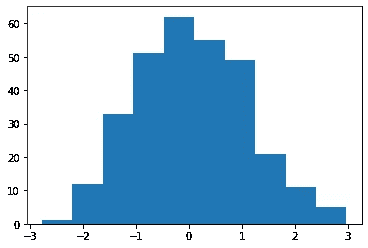
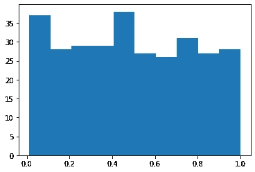

# 夏皮罗-维尔克正态性检验的实用介绍

> 原文：<https://towardsdatascience.com/a-practical-introduction-to-the-shapiro-wilk-test-for-normality-5675e52cee8f>

## 如何在 Python 中评估数据集的正态性



作者图片

数据科学家通常要检查数据是否正态分布。例如，为了正确使用 f 检验，对线性回归的残差进行正态性检查。让我们看看如何检查数据集的正态性。

# 什么是常态？

正态性意味着一个特定的样本是由高斯分布产生的。不一定是标准化的正态分布(均值为 0，方差等于 1)。

在几种情况下，数据科学家可能需要正态分布的数据:

*   使用 f 检验比较训练测试中的线性回归残差和测试集中的残差
*   使用单向方差分析测试或[学生测试](https://www.yourdatateacher.com/2022/10/25/3-easy-hypothesis-tests-for-the-mean-value/)比较不同组间变量的平均值
*   使用 Pearson 相关系数的适当测试来评估两个变量之间的线性相关性
*   为了评估在朴素贝叶斯模型中特征与目标的似然性是否允许我们使用高斯朴素贝叶斯分类模型

这些都是在数据科学家的日常工作中可能经常出现的不同例子。

不幸的是，数据并不总是正态分布的，尽管我们可以应用一些特定的变换来使分布更加对称(例如，[幂变换](https://www.yourdatateacher.com/2021/04/21/when-and-how-to-use-power-transform-in-machine-learning/))。

评估数据集正态性的一个好方法是使用 [Q-Q 图](https://www.yourdatateacher.com/2021/06/21/how-to-use-q-q-plot-for-checking-the-distribution-of-our-data/)，它给我们一个正态性的图形可视化。但是我们经常需要一个定量的结果来检查，一张图表是不够的。

这就是为什么我们可以使用假设检验来评估样本的正态性。

# 夏皮罗-维尔克试验

夏皮罗-维尔克检验是一种应用于样本的假设检验，其零假设是样本是由正态分布产生的。如果 p 值很低，我们可以拒绝这样的零假设，并说样本不是从正态分布生成的。

这是一个非常容易使用的统计工具，可以帮助我们得到我们需要的正态性检查的答案，但它有一个缺陷:它不能很好地处理大型数据集。数据集的最大允许大小取决于实现，但在 Python 中，我们看到大于 5000 的样本大小将为我们提供 p 值的近似计算。

然而，这个测试仍然是我们可以使用的一个非常强大的工具。让我们看一个 Python 中的实际例子。

# Python 中的一个例子

首先我们导入 NumPy 和 matplotlib。

```
import numpy as np import 
matplotlib.pyplot as plt
```

现在，我们必须导入计算夏皮罗-维尔克检验的 p 值的函数。这是 scipy.stats 中的“shapiro”函数

```
from scipy.stats import shapiro
```

现在让我们模拟两个数据集:一个由正态分布生成，另一个由均匀分布生成。

```
x = np.random.normal(size=300) 
y = np.random.uniform(size=300)
```

这是“x”的直方图:


“x”的直方图。

我们可以清楚地看到，该分布非常类似于正态分布。

这是“y”的直方图:



“y”直方图

不出所料，这种分布与正态分布相差甚远。

因此，我们期望夏皮罗-维尔克检验能为“x”样本给出一个相当大的 p 值，为“y”样本给出一个很小的 p 值(因为它不是正态分布的)。

让我们计算这样的 p 值:

```
shapiro(x) 
# ShapiroResult(statistic=0.9944895505905151, pvalue=0.35326337814331055)
```

正如我们所见,“x”样本的 p 值并没有低到允许我们拒绝零假设。

如果我们计算“y”上的 p 值，我们会得到一个完全不同的结果。

```
shapiro(y) 
# ShapiroResult(statistic=0.9485685229301453, pvalue=9.571677672681744e-09)
```

p 值低于 5%，因此我们可以拒绝数据集正态性的零假设。

如果我们试图计算大于 5000 点的样本的 p 值，我们会得到一个警告:

```
shapiro(np.random.uniform(size=6000)) # /usr/local/lib/python3.7/dist-packages/scipy/stats/morestats.py:1760: 
# UserWarning: p-value may not be accurate for N > 5000\. 
# warnings.warn("p-value may not be accurate for N > 5000.") 
# ShapiroResult(statistic=0.9526152014732361, pvalue=2.6791145079733313e-40)
```

所以，下面是我们如何在 Python 中执行夏皮罗-维尔克正态性测试。只需确保使用形状合适的数据集，以免使用近似的 p 值。

# 结论

夏皮罗-维尔克正态性检验是一种非常简单易用的统计工具，用于评估数据集的正态性。我通常在通过直方图和/或 Q-Q 图进行适当的数据可视化后应用它。这是一个非常有用的工具，可以确保我们每次需要时都满足正态性要求，它必须存在于数据科学家的工具箱中。

*原载于 2022 年 11 月 7 日*[*【https://www.yourdatateacher.com】*](https://www.yourdatateacher.com/2022/11/07/a-practical-introduction-to-the-shapiro-wilk-test-for-normality/)*。*