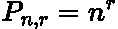
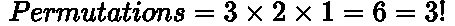
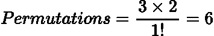
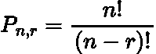
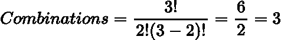
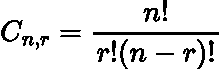
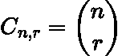
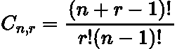

# 组合和排列入门

> 原文：<https://towardsdatascience.com/a-primer-on-combinations-and-permutations-d654aacea292>

## 组合排列及其区别的简明描述


让-路易·波林在 [Unsplash](https://unsplash.com?utm_source=medium&utm_medium=referral) 上拍摄的照片

# 介绍

C [组合](https://en.wikipedia.org/wiki/Combination)和[排列](https://en.wikipedia.org/wiki/Permutation)在数学和统计学中很常见，因此这是一个美国数据科学家应该知道的有用概念。

在这篇文章中，我想讨论两者之间的区别，两者内部的区别，以及对于一些给定的数据如何计算它们。

# 概述和简单示例

排列和组合的主要区别在于，对于前者来说**顺序很重要**，但对于后者来说并不重要。

例如，假设我们有三个不同颜色的球，红色、绿色和蓝色，我们想将它们按任意顺序排列，例如:

```
1: RED
2: GREEN
3: BLUE
```

这三个球的**组合**为 ***1*** ，因为每个订单将包含相同的三个球组合**。**然而，有 ***6* 排列**为我们所能拥有:

```
1: RED    1: RED    1: GREEN  1: GREEN  1: BLUE.  1: BLUE
2: GREEN  2: BLUE   2: RED.   2: BLUE   2: RED    2: GREEN
3: BLUE   3: GREEN  3: BLUE.  3: RED    3: GREEN  3: RED
```

现在你对组合和排列的含义有了基本的了解，让我们更深入地了解理论细节吧！

# 排列

就像我们说过的，对于排列来说，顺序很重要，我们需要所有可能的排序方式/列表。

实际上有两种类型的排列:

*   [**同**](https://www.mathsisfun.com/combinatorics/combinations-permutations.html)
*   [**无重复**](https://www.mathsisfun.com/combinatorics/combinations-permutations.html)

让我们从头到尾看一遍！

## 重复地

这个解释起来很直观。例如，给定一个挂锁，它有从***0–9***的四个 **数字**的选项。

> 这把挂锁的密码排列是什么？

井的第一个数字可以有 ***10 个*** 值，第二个数字可以有 ***10 个*** 值，第三个数字可以有 ***10 个*** 值，最后第四个数字也可以有 ***10 个*** 值。于是，就有了***10×10×10×10 = 10000 个*** 排列组合！

数学上， [**重复排列公式为**](https://www.cs.sfu.ca/~ggbaker/zju/math/perm-comb-more.html) **:**



作者在 LaTeX 中生成的方程。

在每个 r 阶段我们有 n 个选择。

## 无**重复**

让我们回到我们的球类比，我们想把三个彩色的球红色、绿色和蓝色按任意顺序排列。

> 三个不同颜色的球有多少种排列？

第一个球可以进入三个地点中的任何一个，因此它有 ***3*** 个选项。然后第二个球可以填充剩下的两个点中的任何一个，所以有 ***2*** 选项。最后最后一个球只有一个光点，所以 ***1*** 选项。

在这个过程中，每个球只能使用一次，因此没有**没有** **重复**，我们的**选项在每次选择**时减少。在这种情况下，我们有了 ***3*** 选项，然后是 ***2*** 然后是 ***1*** 。数学上我们有:



作者在 LaTeX 中生成的方程。

> 感叹号是 [**阶乘函数**](https://en.wikipedia.org/wiki/Factorial) **。**比如， **n！是从 1 到 n 的所有整数的乘积。**

现在让我们稍微重新定义一下这个问题。

> 从三个球中选择两个有多少种排列？

首先我有 ***3*** 个选择，然后在我的第二次选择中我有 ***2*** 个选择。我们还有剩余的 ***1*** 球，但是我们只想要 ***2*** 的选择！

为了说明这一点，我们**简单地除以**剩下的排列。在我们的例子中这很幸运只是 ***1！*** :



作者在 LaTeX 中生成的方程。

我们来通过一个更好的例子，让这个概念更具体。

> ***从一副普通牌中选择四张牌的排列有哪些？***

我们挑出来的第一张牌是 ***52*** 选项，第二张 ***51*** ，第三张是 ***50*** *，*第四张是*等等。因为我们只想要第一张 ***4 张*** 牌的排列，所以我们必须除以剩余的排列***(52–4 = 48)***:*

**

*作者在 LaTeX 中生成的方程。*

*太多了！*

> *另一个简单的方法是计算 **52、51、50 和 49 的乘积。***

*一般情况下，无重复排列的**公式**是由给出的[:](https://www.britannica.com/science/permutation)*

**

*作者在 LaTeX 中生成的方程。*

*   ****n*** 是事物的总数*
*   ****r*** 是我们选择的事物的数量*

*人们可以用这个公式来验证我们上面讨论的所有示例问题。*

# *组合*

*对于组合顺序无所谓，所以 ***(1，2) = (2，1)。****

*同样，排列也有两种类型的组合:*

*   *[**无重复**](https://www.mathsisfun.com/combinatorics/combinations-permutations.html)*
*   *[与**重复**与](https://www.mathsisfun.com/combinatorics/combinations-permutations.html)*

*让我们看一下这两种情况。*

## *没有重复*

*让我们再一次回到彩球的场景，我们从三个颜色分别为 ***红色、蓝色和绿色的球中选择两个。****

> *我们可以从三种不同的球中选择多少种不同的组合？*

*这个问题的排列是 ***6*** *，*但是这包括排序。为了说明排序，我们简单地用 ***除以两个元素的排列数:****

**

*作者在 LaTeX 中生成的方程。*

*其中的道理我们可以有: ***(红、蓝)、(蓝、绿)和(红、绿)。****

*为了得到组合，我们计算排列，然后除以我们选择的东西的排列数。*

*一般来说，没有重复 [的组合的**公式由**](https://www.britannica.com/science/permutation)给出:*

**

*作者在 LaTeX 中生成的方程。*

*   ****n*** 是事物的总数*
*   ****r*** 是我们选择的事物的数量*

*这通常用 [**二项式系数表示为***‘n 选 r’***。**](https://en.wikipedia.org/wiki/Binomial_coefficient)*

**

*作者在 LaTeX 中生成的方程。*

*可以使用上面的公式来验证我们上面讨论的例子的结果。*

## *重复地*

*这是其中最难理解的一个。*

*对于这个例子，我们将回到我们全能的三个不同颜色的球 ***【红绿蓝】*** 的场景并问:*

> *当我们从一组三个不同的球中选择两个球时，有多少种组合(有重复)？*

*[因为我们被允许重复球](https://www.superprof.co.uk/resources/academic/maths/probability/combinatorics/combinations-with-repetition.html)我们可以有这样的组合: ***(蓝，蓝)，(红，红)和(绿，绿)。因此，当我们选择一个球时，就好像同一个球神奇地重新出现在我们可以选择的下一个球中。****

*这些 ***3*** 的新组合是对我们上面计算的没有重复的组合数的一个加法，这个数就是 ***3。因此，这个问题的重复组合总数是 6。****

***重复组合的公式为:***

**

*作者在 LaTeX 中生成的方程。*

*   ****n*** 是事物的总数*
*   ****r*** 是我们选择的事物的数量*

*这个通式的完整推导是相当漫长而艰巨的，因此我在这里为感兴趣的读者链接了一个完整的推导！*

# *结论*

*在本文中，我们探讨了组合和排列背后的差异和数学。要记住的主要事情是，在排列中，顺序并不重要，但在组合中却很重要！*

# *和我联系！*

*   *要在媒体上阅读无限的故事，请务必在这里注册！T53*💜**
*   *[*在我发布注册邮件通知时获取更新！*T3*😀*](/subscribe/@egorhowell)*
*   *[*领英*](https://www.linkedin.com/in/egor-howell-092a721b3/) 👔*
*   *[*推特*](https://twitter.com/EgorHowell) 🖊*
*   *[*github*](https://github.com/egorhowell)*🖥**
*   **[](https://www.kaggle.com/egorphysics)**🏅****

> ***(所有表情符号由 [OpenMoji](https://openmoji.org/) 设计——开源表情符号和图标项目。许可证: [CC BY-SA 4.0](https://creativecommons.org/licenses/by-sa/4.0/#)***