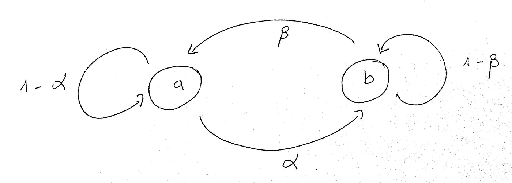
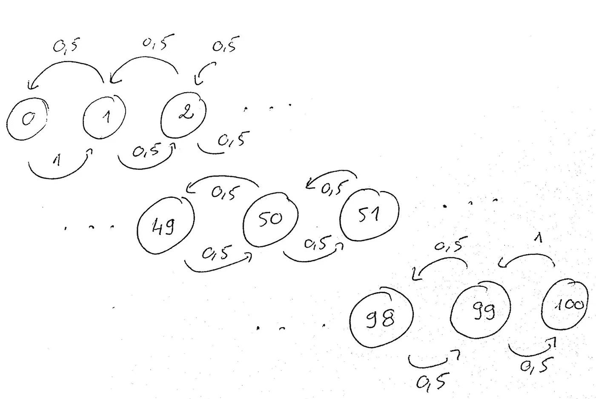
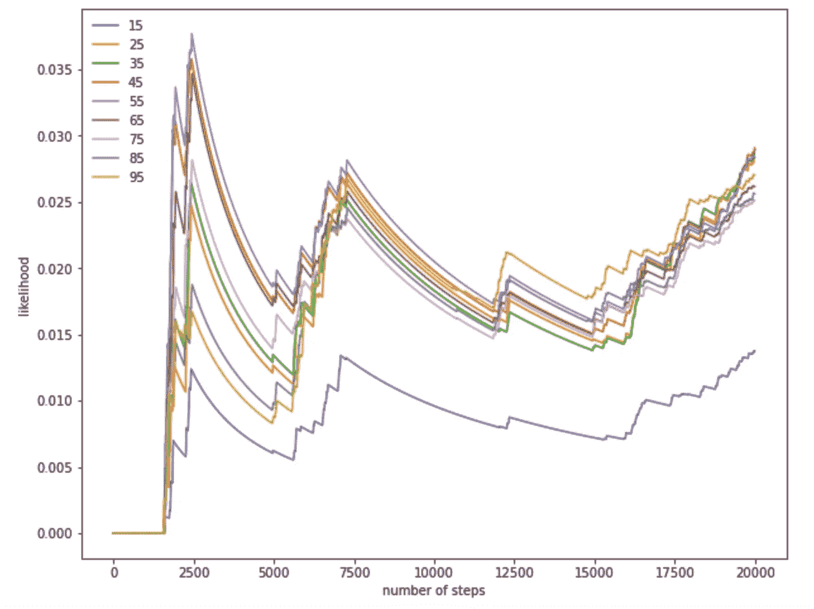
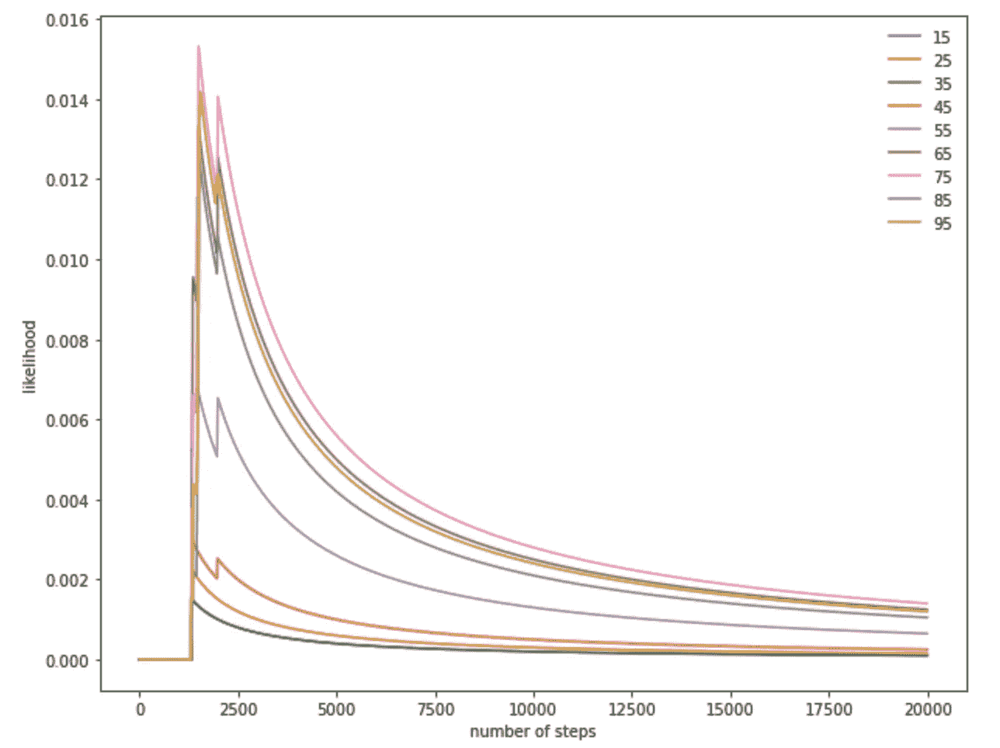
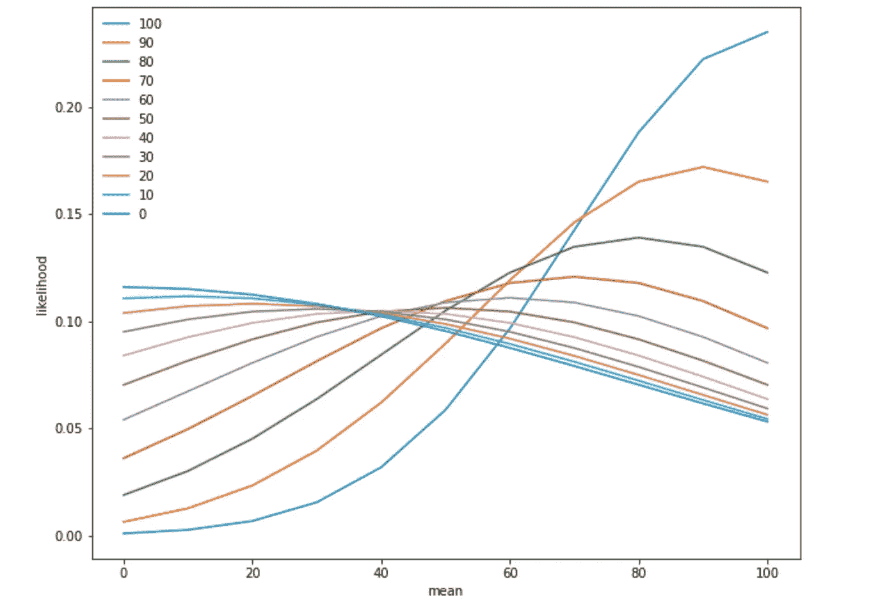
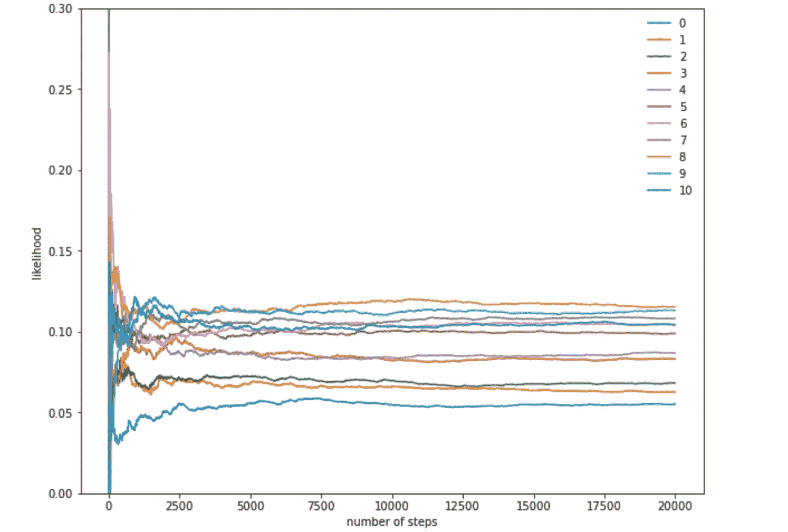
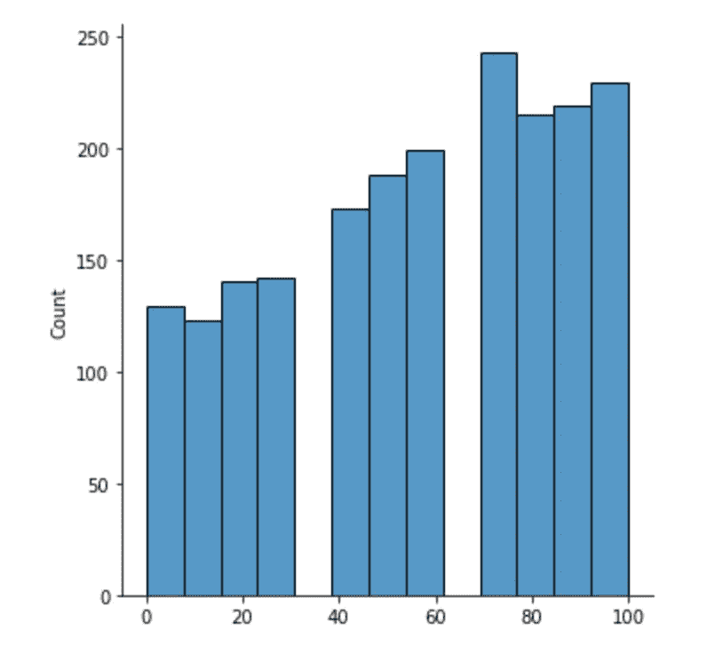
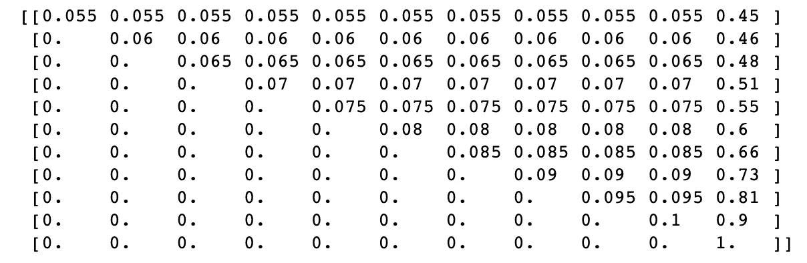
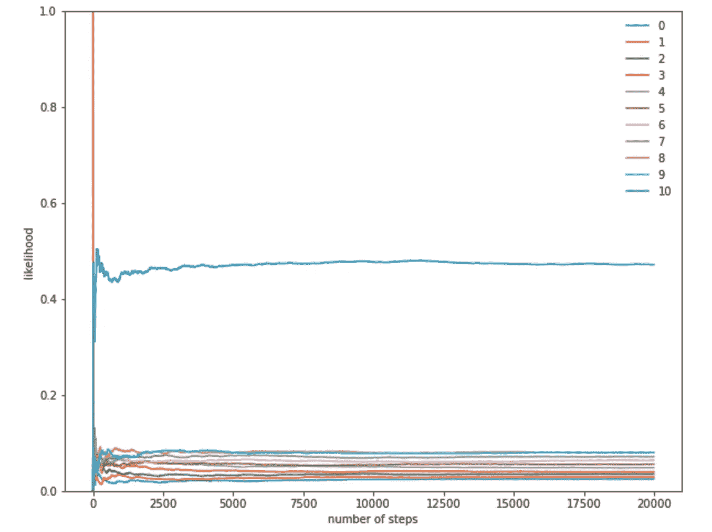

# 猜测我手机电池电量的概率方法。

> 原文：<https://towardsdatascience.com/a-probabilistic-approach-to-guess-my-phone-battery-level-3b10a0b1eb9d>

## 有些手机电池电量比其他的更频繁。这让我不止一次地思考是否有一种方法可以模拟这种频率现象。


照片由 [Unsplash](https://unsplash.com/) 上的 [Onur Binay](https://unsplash.com/@onurbinay) 拍摄

我总是把手机放在伸手可及的地方，我总是担心错过紧急电话或没有及时回复短信。当我检查它的时候，我忍不住偷看一下电池的电量，看看我是否需要带充电器。也就是说，我有时会发现一些电池电量比其他的更频繁。这让我不止一次地思考是否有一种方法可以模拟这种频率现象。

这篇文章的目的是提出一个概率建模的基础，试图估计和跟踪我的电池电量的波动。我不会从电子的角度考虑问题(没有电流强度，容量，..).当我面临着频率主义和贝叶斯范式的选择时，我只能采用频率主义的方法，因为我没有数据记录来更新我的信念。

我将简要介绍我的思维过程的基础:马尔可夫链。随着文章的进展，我将改进我的模型，尽可能接近真实的波动基数，估计手机屏幕上显示最多的平均电量水平，并确认我观察到的数字。

## 1.马尔可夫链

马尔可夫链是一族随机模型，用于逼近一段时间内的随机过程。这种模型在表示随机状态的方式上有其特殊性。研究中最著名的例子是老鼠在迷宫中的进化。它的决定(向右转或向左转、前进、后退)只取决于它最后的状态，而完全独立于它以前走过的路。

具有两种状态 a 和 b 的简单系统表示如下:



系统可以从 a 变到 b，反之亦然，也可以保持相同的状态。

形式上，这些演进可以通过转换矩阵来建模。一旦我们有了它，我们就可以通过一些计算，在给定的跃迁次数后，量化系统的概率轨迹。

## 2.第一个模型:

我们先来看看问题的成分。

我们将尝试模拟我们最终会在手机上看到的电池状态。电池准确地知道 101 种状态。所以我们会在这些状态中看到一个特定的状态。假设我们无法访问电话正在/曾经/将要被供电的信息。
在对充电器的发展没有任何先入为主的概念的情况下，我们可以对电池电量的观察建模如下:



该过程被建模以说明我们盲目且疯狂地跟随电池水平，而不知道它是增加还是减少。我们只知道它不会一成不变。

我们加载必要的库来使用:

```
import numpy as np
import matplotlib.pyplot as plt
import seaborn as sns
```

让我们实现转换矩阵，转换我们对问题的理解:

```
number_of_states = 101
state_space = list(range(number_of_states))transition_matrix = np.zeros((number_of_states , number_of_states))#When the battery level is veery low ..
transition_matrix[0, 1] = 1#When the battery is fully charged ..
transition_matrix[100, 99] = 1for row in range(1, 100):
        transition_matrix[row, row - 1] = .5
        transition_matrix[row, row + 1] = .5
```

让我们选择一个给定的状态，从一个给定的水平(这里是 50%)开始运行模拟，并注意我们在屏幕上看到的变化。

让我们选择一些特定的状态来代表，看看它们如何根据每个电池电量可被观察到的概率而演变:

```
fig, ax = plt.subplots(figsize=(15,10))
offsets = range(1, n_steps, 10)
for i, label in enumerate([15, 25, 35, 45, 55, 65, 75, 85, 95]):
    ax.plot(offsets, [np.sum(states[:offset] == i) / offset
            for offset in offsets], label=label)

ax.set_xlabel("number of steps")
ax.set_ylabel("likelihood")
ax.legend(frameon=False)
plt.show()
```



在某一点之后，概率似乎不再稳定。这个过程不是静止的。如果是这样的话，不同状态的概率会全部收敛。如果过程是稳定的，我们可以说在任何时间点，转移到其他状态的概率保持不变。这样就可以看到收敛。

在我们的情况下，不能说电池水平查看过程可能会收敛。这可以用两件事来解释:电池的充电没有被考虑在内，而且在现实生活中，一个人会有其他事情要做，而不是疯狂地不断看着他的手机。

让我们在模型中考虑后一种假设，并尝试解决这个问题。

我们通过注入一个带有`np.random.uniform`的随机条件修改了状态的演化。这个随机项表示在长的转换序列中，每一个状态变化平均只发生十分之一次。这种配置的目的是向马尔可夫模型表明，我不一定在每次状态改变时都要看屏幕，但是在这样做之前，我会稍微停顿一下，并重新检查电池电量。让我们观察一下这是如何发生的。



即使我们的模型仍然需要一些修正，这个过程似乎最终会收敛。事实上，我们没有被手机束缚住，这稳定了这个过程。然后，我们可以计算出我们通常会看到的电池电量的期望值。

```
>>> compute_expected_value(states, 2000)
19.4405
```

由于缺少一些信息，这个数字不太现实，但是这个模型可以作为未来改进的基准。

## 3.更现实的模型:

拥有所有的电池状态`(from 0 to 100%)`有点乏味，受到很多噪声的影响，并且很难与它们并不总是被咨询的事实相协调。为了缓解这个问题，我们假设从现在开始我们将有 11 个州，而不是 101 个`( 0%, 10%, 20%, .., 90%, and 100% )`。
此外，我们将考虑混淆矩阵的更好设计，因为电池状态的动态变化取决于它。

以前的型号过渡到直接低于或高于的水平(仅从`50%`电池水平开始到`49%`或`51%`)。此后，我们给自己更多的自由来放弃我们先前引入的随机项。

让我们以下面的方式推理:等级越低，转换的概率越低，这意味着当您有`100%`电池等级时，在下一次检查中看到`90%`等级百分比的机会比`10%`大得多，因为总是有可能在不检查电池的情况下在此期间加电。

从另一个角度来看，如果手机的电池处于`0%`状态，那么看到`10%`水平的可能性会比看到`50%`水平的可能性更大。除了过渡到`10%`不是压倒性的，因为当电量低时，人们倾向于将手机放在一边充电。

然后，我们可以继续逼近我们正在寻找的转变的形状，并构造我们的转变矩阵。我们将需要一个高斯，我们将调整这些形状。

```
def gaussian(x, mean, scale):
    return 1 / (np.sqrt(2*np.pi)*scale) * 
            np.exp(- np.power(x - mean, 2.) 
            / (2 * np.power(scale, 2.)))# declaring some parameters
scale = 30
max_charger = 100
X = range(0, max_charger + 1, 10)fig, ax = plt.subplots(figsize=(10,8))transition_list = []for mean in X:

    Y = [gaussian(x, mean, scale + mean / 2) for x in X]
    Y_norm = Y / np.sum(Y)
    Invert_Y_norm = Y_norm[::-1]
    transition_list.append(Invert_Y_norm)

    ax.plot( X, Invert_Y_norm, label = max_charger - mean)

ax.set_xlabel("mean")
ax.set_ylabel("likelihood")
ax.legend(frameon=False)#Adjusting the final list of distributions to have all battery #levels lined up.transition_matrix = np.array(transition_list[::-1])
```



每个级别将由一个以它为中心的高斯分布来表示，它也将作为一个过渡分布。

这里有一个从电池的`0%`电平状态开始的转移概率的例子:

```
>>> def display(list_x): return [round(x, 2) for x in list_x]
>>> display(transition_matrix[0])
[0.12, 0.11, 0.11, 0.11, 0.1, 0.1, 0.09, 0.08, 0.07, 0.06, 0.05]
```

这是一个 100%充满电的例子:

```
>>> display(transition_matrix[10])
[0.0, 0.0, 0.01, 0.02, 0.03, 0.06, 0.1, 0.14, 0.19, 0.22, 0.23]
```

同样，让我们运行一些模拟并监控不同的电池电量水平概率:



经验概率趋同。然后，我们能够计算期望值:

```
>>> compute_expected_value(states, last_steps=2000) * 10
56.685
```

最多人看到的电池电量似乎在`70 to 80%`附近，这似乎与我的观看习惯非常一致:

```
sns.displot(states[-2000:] * 10, kind = "hist")
```



## 4.现实模型:

问题是:我们如何让我们的模型更接近现实？
要回答这个问题，必须考虑到每个人生活节奏中的一个宝贵时刻:睡眠。一旦睡着，很少检查手机。就我而言，我总是让它充电，晚上醒来时很少检查它。人们可以把转移矩阵想成如下形式:

这种设计背后的直觉是，在夜间只能看到比放置时更高的电池电量:

```
with np.printoptions(threshold=np.inf):
    print(transition_matrix_night)
```



无论如何，不管我们检查手机屏幕的时刻(白天还是晚上)，两种观看状态之间的平均时间也应该被考虑在内。如果自上次以来液位下降，则电池正在放电。如果没有，则电池已充电。我们粗略地估计了这些过渡的持续时间。

基于我们在`compute_time_taken`函数中部署的时间单位，让我们估计一个典型的白天/夜晚的持续时间:

```
night_time = 6 * 60 # 6 hours 
day_time = 18 * 60 # 18 hours
```

然后，我们开始模拟白天和夜晚交替过渡的情况。
我们放置一个`counter_day_or_night`,它随着我们对不同转换的跟踪而递增。如果`counter_day_or_night`超过了夜晚持续时间，假设现在是夜晚时间，我们切换到白天模式并重复该过程:

模拟稳定后，我们尝试绘制不同水平的概率(显示的水平是真实电池水平的十分之一):



有趣的事实是，在我的手机屏幕上最常看到的水平是 100%。由于我坚持要有一部因电池没电而关机的手机，我总是确保在不需要的时候给它充电。由于分布趋于稳定，我们得到以下期望值:

```
>>> compute_expected_value(states, last_steps=2000) * 10
76.69
```

现在，当我看着我的手机，我有 83%的电池电量。几乎..

## 结束语:

该解决方案并不完全代表现实，因为它过分简化了几个要素，并且没有考虑转移概率的更新方面。贝叶斯方法将把每个转变视为一个整体分布，并包括我日常生活中非常多样的节奏。此外，游戏可能会更令人兴奋，因为我们可以增加一个与我的笔记本电脑电池水平有关的挑战。然后，我们可以将这两种设备合并成一个模型，并观察显示的图形中的神奇之处。

## 参考资料:

1.  [马尔可夫链蒙特卡罗(MCMC)抽样](https://www.tweag.io/blog/2019-10-25-mcmc-intro1/)
2.  [计算离散马尔可夫链的平稳分布](http://Computing Stationary Distributions of a Discrete Markov Chain)