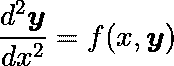
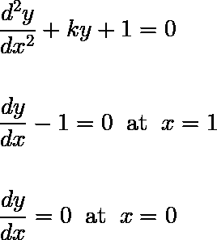
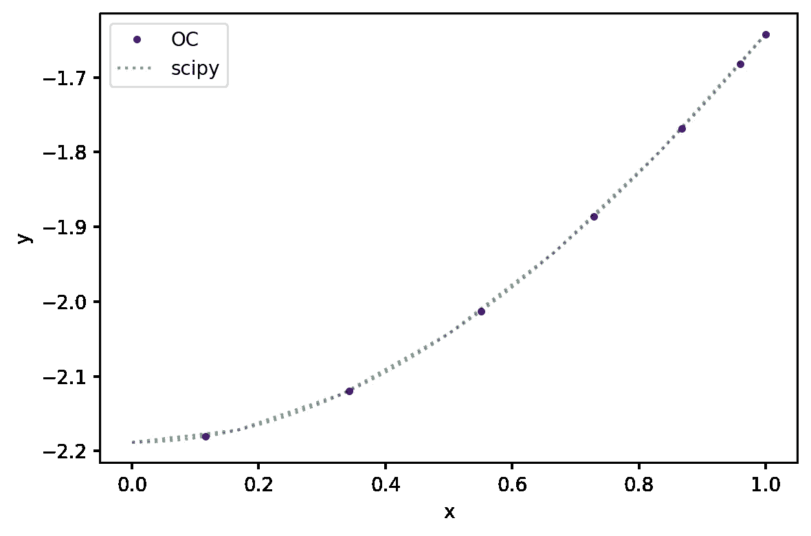
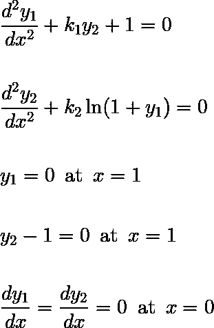
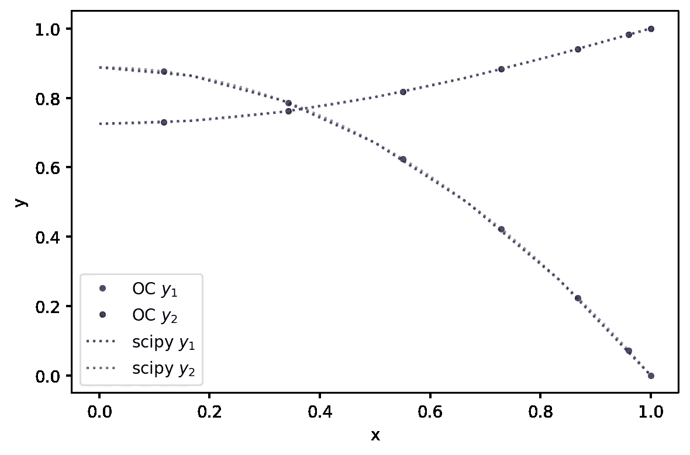
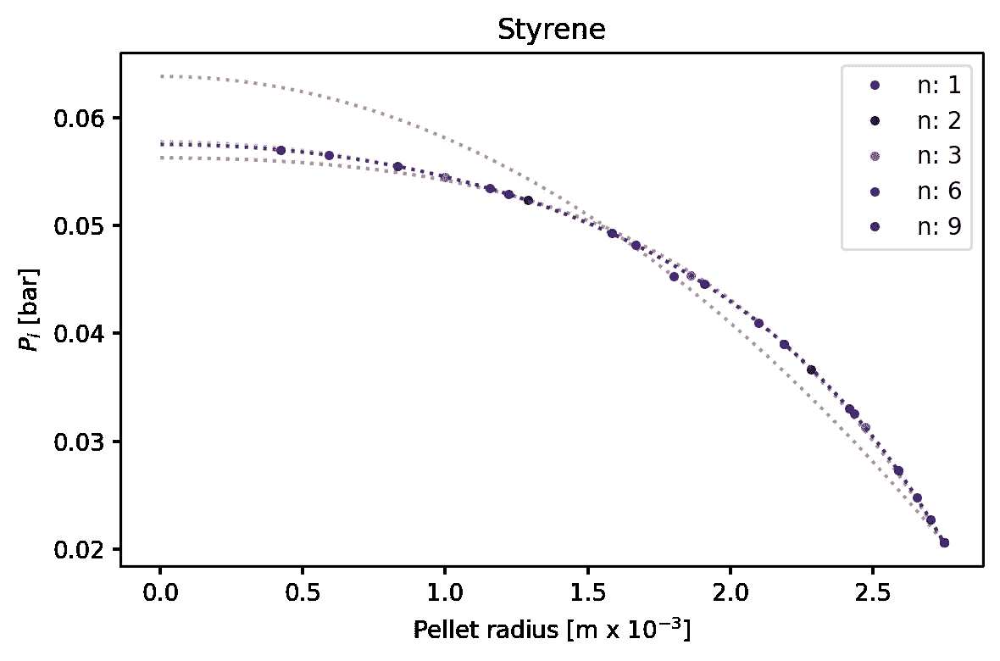

# 利用正交配置求解边值问题的 Python 框架

> 原文：<https://towardsdatascience.com/a-python-framework-for-solving-boundary-value-problems-using-orthogonal-collocation-705dfeec106b>

## 一个高效直观的框架，包含两个简单的示例和一个复杂的实际应用程序


由 [Unsplash](https://unsplash.com?utm_source=medium&utm_medium=referral) 上的[美元吉尔](https://unsplash.com/@dollargill?utm_source=medium&utm_medium=referral)拍摄的照片

T 我第一次读到“正交配置”这个表达是在 Lee & Froment (2008)关于苯乙烯反应器建模的文章中。原来二阶微分方程系统出现在许多工程课题中，大多与输运现象有关。因此，解决这些问题的方法在实践中非常有用。一旦一个过程被数学描述，它可以是数值优化问题的对象，在这种情况下，通常与过程设计和控制有关。

如果这些内容激发了你的兴趣，看看所用 Python 框架的[代码库](https://github.com/bruscalia/collocation.git)，也可以在 [ResearchGate](https://www.researchgate.net/publication/358914432_A_Python_module_to_solve_boundary_value_problems_using_orthogonal_collocation) 上找到。

正交配置是由 Villadsen 和 Stewart (1967)提出的，对于求解如下所示的方程组非常有用:



二阶微分方程的基本系统。(图片由作者提供)。

解决方案背后的数学可能非常复杂，但是，如果您可以像这样用适当的边界条件来制定您的方程组，我相信正交分配(python 框架)可以创造一些奇迹。

# 示例 1

让我们从只有一个因变量 *y.* 的简单二阶问题开始



例 1 的方程式。(图片由作者提供)。

让我们从导入框架的主类开始，*正交分配*。

```
from collocation import OrthogonalCollocation
```

然后，我们必须创建一个在内部点返回零的函数和另一个在表面边界返回零的函数(因为 *x* 中的原点被假定为对称条件)。两者都可以是 *x，y，y’，y”*的线性或非线性函数。

```
def fun_1(x, y, dy, d2y, k):
    return d2y[0] + k * y[0] + 1

def bc_1(x, y, dy, d2y, k):
    return dy[0] - 1
```

在定义了函数之后，这个过程就差不多完成了，我们只用三行代码就可以解决这个问题(可能只有两行)。我在这里使用了 *k* =1，但是我们可以尝试不同的数字。请随意下载我的代码库中的[示例笔记本](https://github.com/bruscalia/collocation/blob/main/notebooks/example_collocation.ipynb)，并尝试不同的功能。注意，当执行搭配时， *scipy.optimize.root* 用于求解问题中隐含的非线性方程组。*配置*中的所有附加关键字都被传递给*根*。

```
n_points = 6

# Create problem
problem_1 = OrthogonalCollocation(fun_1, bc_1, n_points, 1, x0=0.0, x1=1.0)

# Initial estimation
y01 = np.zeros([1, n_points + 1])

# Collocation using scipy.optimize.root in backend
problem_1.collocate(y01, args=k, method="hybr", tol=1e-6)
```

现在准备好了！配置点存储在我们的实例 *problem_1 的属性 *y* 中。*它的形状是( *m* ， *n* )，所以每行对应一个不同的变量，列对应不同的搭配点。我们还可以计算其他坐标的 *y* 的插值多项式值，而不仅仅是配置点。为此，我将从我们的问题实例中使用*插值*方法。

现在，让我们绘制结果，并将它们与对等解算器*scipy . integrate . solve _ BVP*获得的结果进行比较，以确保框架运行良好。

```
fig, ax = plt.subplots(figsize=[6, 4], dpi=200)
x = np.linspace(0, 1, 50)
ax.plot(x, problem_1.interpolate(x)[0], color="indigo", alpha=0.5, linestyle=":")
ax.plot(problem_1.x, problem_1.y[0], color="indigo", marker=".", label="OC", linestyle=" ")
ax.plot(res_scipy1.x, res_scipy1.y[0], color="green", alpha=0.5, linestyle=":", label="scipy")
ax.set_ylabel("y")
ax.set_xlabel("x")
ax.legend()
fig.tight_layout()
plt.show()
```

看起来是这样的:



搭配举例 1。(图片由作者提供)。

# 示例 2

一个只有一个因变量的例子效果很好。在本节中，让我们尝试一个带有非线性项的方程组。



例 2 的方程式。(图片由作者提供)。

我们再次公式化方程:

```
def fun_2(x, y, dy, d2y, k1, k2):
    return np.array([d2y[0] + k1 * y[1] + 1, d2y[1] + k2 * np.log(1 + y[0])])

def bc_2(x, y, dy, d2y, k1, k2):
    return np.array([y[0], y[1] - 1])
```

我在这里用 *k1* =1 和 *k2* =-1，让它更有挑战性。同样的第二步…

```
problem_2 = OrthogonalCollocation(fun_2, bc_2, n_points, 1, x0=0.0, x1=1.0)

y02 = np.zeros([2, n_points + 1])

problem_2.collocate(y02, args=(k1, k2), method="hybr", tol=1e-6)
```

现在看起来是这样的:



搭配举例 2。(图片由作者提供)。

求解器又一次返回了很好的结果！

在下面的例子中，让我们尝试一个复杂的现实世界的问题。

# 苯乙烯反应器问题

记得我提到过苯乙烯反应器吗？因此，我在这个问题上已经工作了一段时间，我已经能够开展一项有见地的研究，其中正交配置用于模拟颗粒内扩散。我相信这可以为真实世界的应用程序提供一个很好的例子。

一旦基本方程能够描述该过程，该模型就可以预测在不同条件下(例如温度和压力)有多少过程输入(反应物)被转化成期望的输出(苯乙烯)。然后，它是一个优化任务的目标“什么是将输入转换成期望输出的最适当的操作条件？”。

如果您对细节感兴趣，我邀请您看一下文章 [*【基于多相动力学模型*](https://doi.org/10.1016/j.ces.2021.116805) *的乙苯脱氢制苯乙烯轴流和径向反应器的模拟与优化】。*

简单来说(尽可能)，存在扩散问题，催化剂颗粒内部的反应物浓度与表面不同，有效反应速率也不同，因此我们必须计算反应的*有效性* *因子*。

在我的[示例笔记本](https://github.com/bruscalia/collocation/blob/main/notebooks/example_collocation.ipynb)中，我测试了不同数量的搭配点，详细描述了方程，并将结果与 scipy 进行了比较。对于一篇短文来说，完整的公式是相当长的，所以我将在这里展示不同数量的搭配点的主要结果。



用不同配置点数的正交配置法计算催化剂颗粒内的苯乙烯分压。(图片由作者提供)。

注意，三个配点产生的结果已经非常精确，六个配点的结果几乎等于九个。与基准测试*scipy . integrate . solve _ BVP*相比，所有这些结果花费的计算时间不到四分之一…

# 结论

用 Python 开发了一个简单而健壮的框架，用正交配置法求解对称边值问题。它易于使用，并通过了同行解决方案的验证。实现了一个复杂的真实世界的问题，其中用很少的配点结果是非常准确的。这个框架可以在这个 [GIT](https://github.com/bruscalia/collocation) 仓库中获得。

# 参考

李伟杰和弗罗蒙特，G. F .，2008。乙苯脱氢制苯乙烯:动力学模型和反应器模拟。*印度。英语。化学。第 47(23)卷，第 9183-9194 页。*

莱特，b，科斯塔，A. O. S .和科斯塔少年，E. F .，2021。基于非均相动力学模型的乙苯脱氢轴向流和径向流反应器的模拟与优化。*化学。英语。Sci。，*第 244 卷，第 116805 页。

维拉森，j .和斯图尔特，W. E .，1967 年。用正交配置法解边值问题。化学。英语。Sci。，第 22 卷第 11 期，第 1501—1483 页。