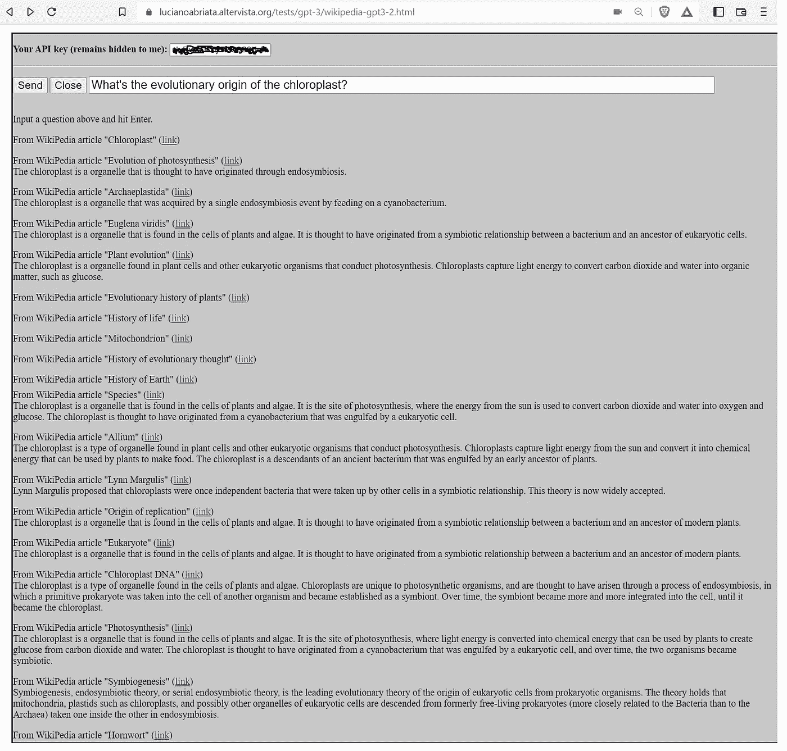
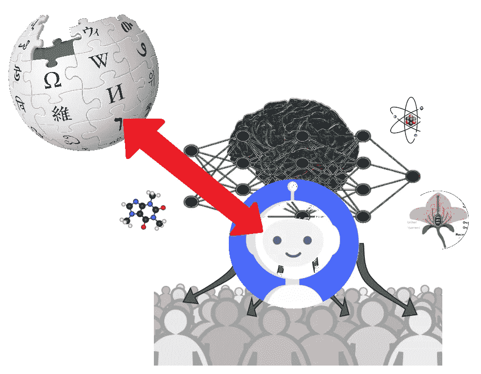

# 一个由维基百科驱动的问答机器人与 GPT 3 号结合在一起

> 原文：<https://towardsdatascience.com/a-question-answering-bot-powered-by-wikipedia-coupled-to-gpt-3-56889b5976d7>

## 仍然着迷于 GPT-3 提供的可能性和它的力量，这里耦合到维基百科


久尼尔·费雷拉在 [Unsplash](https://unsplash.com?utm_source=medium&utm_medium=referral) 上的照片

**如果你关注我，你会发现我对 GPT-3 非常着迷，它既是提高生产力的工具，也是通过自然问题进行信息检索的工具。您还看到，GPT-3 通常会提供问题的正确答案，但有时它不会，甚至会产生误导或混淆，因为尽管它的答案是错误的，但看起来很有把握。在某些情况下，但不总是，当它不能找到一个合理的完成(即，它“不知道”答案)，它告诉你，或者它只是不提供任何答案。我向您展示了通过微调模型，或者更容易地通过少量学习，可以提高事实准确性。但是决定在这些过程中使用什么信息并不容易，更不用说如何应用了。在这里，我向你展示一个相当简单的方法，通过使用它直接从维基百科检索的信息来增强你的机器人。正如你将看到的那样，它工作得很好。**

# 介绍

GPT 3 号为许多项目提供动力，这些项目在一年前还是不可想象的。只要看看我写的介绍各种示例应用程序的文章就知道了——它们都是基于网络并运行在客户端上的，因此很容易实现像与计算机进行自然对话一样具有未来感的东西:

  

## 需要更准确的信息

尽管在正确的设置下，GPT-3 很有可能会提供正确的答案，但有时它会回答说不知道，甚至根本不回答。然而，这是非常糟糕的，它通常会提供不正确的答案，这些答案可能会非常误导或令人困惑，因为他们似乎有很高的信心。这是我们看到可以通过微调，或者更容易地通过少量学习来纠正的。但是具体怎么做呢？

上个月，我一直在试验制造“更聪明”的问答机器人的方法，这些机器人可以使用来自可靠来源的信息。

为什么？因为我看到了在做我的研究或为我的科学家工作研究一个新课题时使用 GPT-3 作为助手的巨大潜力，甚至，为什么不呢，作为学生的 24/7 导师——我在这里特别阐述了这一点。

怎么会？基本上是通过在维基百科上查询相关文章，并使用获得的文本进行少量学习，然后提出问题。

在一些更详细的情况下(本文后面的完整细节)，机器人首先从用户的问题中删除所有停用词(在 NLP 行话中，停用词是指在文本处理之前或之后被过滤掉的词，因为它们意义不大或没有意义)；然后，它用被清除的单词查询维基百科，并得到一个可能包含该主题信息的文章列表；最后，将原始问题附加到每篇文章中，并用 GPT-3 进行处理，以根据维基百科文章计算出一个似乎合理的答案。因此，答案不是单一的，而是实际上每篇维基百科文章都有一个，每个答案都包括一个文章链接，这样用户就可以更深入地查阅它。这个工具不是绝对可靠的，但是在我所做的测试中，它运行得相当好。

## 第一个例子

现在，您可以通过一个例子看到这个机器人的运行，我在文章的结尾展示了另一个例子。是的，就像我所有的例子一样，你可以在我的网站的链接中访问和使用这个 web 应用程序(回想一下，你需要从 OpenAI 获得一个免费的 API 密钥才能使用 GPT-3)。

在第一个例子中，我向机器人询问了叶绿体的进化——植物用于光合作用的细胞器，它可能起源于非光合细胞吞噬光合蓝藻的时候。

确切的问题是:

*叶绿体的进化起源是什么？*

你会看到机器人很好地获得了信息，尤其是从列表中显示的最后几篇文章:



作者在自己的 web app 上截图。(请继续阅读下面的链接，亲自尝试并查看源代码)。

这是完整的输出，当时最多有 20 篇维基百科文章被请求，所有检索到的文章连同问题一起被馈送到 GPT-3:

> 来自维基百科的文章“叶绿体”([链接](https://en.wikipedia.org/w/index.php?curid=6355))
> 
> 来自维基百科文章“光合作用的进化”([链接](https://en.wikipedia.org/w/index.php?curid=41468418) )
> 叶绿体是一种细胞器，被认为是通过内共生起源的。
> 
> 来自维基百科的文章“Archaeplastida”([链接](https://en.wikipedia.org/w/index.php?curid=4256725) )
> 叶绿体是一种细胞器，它是通过以蓝细菌为食的单一内共生事件获得的。
> 
> 来自维基百科文章“绿色裸藻”([链接](https://en.wikipedia.org/w/index.php?curid=40664494) )
> 叶绿体是一种细胞器，存在于植物和藻类的细胞中。它被认为起源于细菌和真核细胞祖先之间的共生关系。
> 
> 来自维基百科文章《植物进化》([链接](https://en.wikipedia.org/w/index.php?curid=15756753) )
> 叶绿体是在植物细胞和其他真核生物中发现的进行光合作用的细胞器。叶绿体捕捉光能，将二氧化碳和水转化为有机物，如葡萄糖。
> 
> 来自维基百科的文章“植物进化史”([链接](https://en.wikipedia.org/w/index.php?curid=11008314))
> 
> 来自维基百科的文章“生命的历史”([链接](https://en.wikipedia.org/w/index.php?curid=12305127))
> 
> 来自维基百科文章“线粒体”([链接](https://en.wikipedia.org/w/index.php?curid=19588))
> 
> 来自维基百科的文章“进化思想史”([链接](https://en.wikipedia.org/w/index.php?curid=21501970))
> 
> 来自维基百科文章“地球的历史”([链接](https://en.wikipedia.org/w/index.php?curid=2068726))
> 
> 来自维基百科文章“物种”([链接](https://en.wikipedia.org/w/index.php?curid=21780446) )
> 叶绿体是一种存在于植物和藻类细胞中的细胞器。它是光合作用的场所，来自太阳的能量被用来将二氧化碳和水转化为氧气和葡萄糖。叶绿体被认为起源于被真核细胞吞噬的蓝细菌。
> 
> 来自维基百科文章“葱属”([链接](https://en.wikipedia.org/w/index.php?curid=47840567) )
> 叶绿体是一种存在于植物细胞和其他真核生物中进行光合作用的细胞器。叶绿体从太阳获取光能，并将其转化为化学能，植物可以利用化学能制造食物。叶绿体是被植物早期祖先吞噬的一种古老细菌的后代。
> 
> 来自维基百科文章“琳·马古利斯”([链接](https://en.wikipedia.org/w/index.php?curid=45473) )
> 琳·马古利斯提出，叶绿体曾经是独立的细菌，在共生关系中被其他细胞占据。这一理论现在被广泛接受。
> 
> 来自维基百科文章“复制的起源”([链接](https://en.wikipedia.org/w/index.php?curid=619137) )
> 叶绿体是一种存在于植物和藻类细胞中的细胞器。人们认为它起源于细菌和现代植物祖先之间的共生关系。
> 
> 来自维基百科文章“真核生物”([链接](https://en.wikipedia.org/w/index.php?curid=24536543) )
> 叶绿体是一种细胞器，存在于植物和藻类的细胞中。人们认为它起源于细菌和现代植物祖先之间的共生关系。
> 
> 来自维基百科文章“叶绿体 DNA”([链接](https://en.wikipedia.org/w/index.php?curid=25777451) )
> 叶绿体是植物和藻类细胞中发现的一种细胞器。叶绿体是光合生物特有的，被认为是通过内共生过程产生的，在这一过程中，原始原核生物被带入另一种生物的细胞中，并成为共生体。久而久之，共生体越来越融入细胞，直到变成叶绿体。
> 
> 来自维基百科文章“光合作用”([链接](https://en.wikipedia.org/w/index.php?curid=24544) )
> 叶绿体是一种细胞器，存在于植物和藻类的细胞中。它是光合作用的场所，光能在这里转化为化学能，植物可以利用化学能从二氧化碳和水生成葡萄糖。叶绿体被认为起源于被真核细胞吞噬的蓝细菌，随着时间的推移，这两种生物变得共生。
> 
> 来自维基百科文章“共生”(Symbiogenesis)([链接](https://en.wikipedia.org/w/index.php?curid=60426) )
> 共生，内共生理论，或系列内共生理论，是真核细胞起源于原核生物的主导进化理论。该理论认为，线粒体、质体(如叶绿体)以及真核细胞的其他细胞器可能都是由以前自由生活的原核生物(与细菌的关系比与古细菌的关系更密切)在内共生中一个放在另一个里面演化而来的。
> 
> 来自维基百科文章“金鱼藻”([链接](https://en.wikipedia.org/w/index.php?curid=460617) )
> 叶绿体是一种质体，是在植物和藻类细胞中发现的一种细胞器。质体是膜结合的细胞器，具有多种功能，包括光合作用、营养物质的储存以及脂质和其他分子的合成。叶绿体在质体中是独特的，因为它包含色素叶绿素，叶绿素用于捕获阳光并将其转化为植物可以用来生长和茁壮成长的化学能。叶绿体被认为起源于一种被祖先植物细胞吞噬的细菌。随着时间的推移
> 
> 来自维基百科文章《进化》([链接](https://en.wikipedia.org/w/index.php?curid=9236) )
> 叶绿体是绿色植物和藻类细胞中发现的一种细胞器。它是光合作用的场所，光合作用是绿色植物和藻类生产自己食物的过程。叶绿体被认为起源于一种叫做蓝细菌的细菌。蓝细菌被认为是最早产生氧气作为光合作用副产品的生物之一。这种氧气会在大气中积累，最终导致臭氧层的形成。臭氧层保护地球表面免受来自太阳的有害紫外线辐射。

需要注意的重要事项:

*   首先，机器人用它自己从每篇文章中生成的答案进行回复，但是…
*   当它没有找到所提问题的答案时，它不会回复任何内容。这一点很重要，因为有些文章，如标题为“*进化思想史*”的文章，包含了一个关键词(“进化”)，但并不真正与所提问题相关。感谢 GPT-3 的力量，我们的机器人“理解”这一点，所以它不提供任何回复。
*   最后，当然你可以把所有的答案汇集起来，然后用一段话概括所有的信息。这可以用 GPT-3 本身或其他程序来完成。举个例子，我用 Quillbot 的总结工具做了一个快速测试，我得到了这一段:

> 叶绿体是一种在绿色植物和藻类细胞中发现的细胞器。它们从太阳获取光能，并将其转化为化学能，植物可以利用化学能制造食物。叶绿体被认为起源于蓝细菌和现代植物祖先之间的共生关系。

如你所见，这组成了一个简洁但信息丰富的段落，包含了问题的答案。对于更深入的阅读，读者可以按照逐条回答中的链接。

要了解更多关于 Quillbot 的信息，请查看:

[](https://medium.com/technology-hits/could-this-automatic-summarization-tool-revolutionize-writing-c042908c170d)  

# 这个机器人到底是怎么工作的？

为了根据维基百科的文章为用户的问题提供合理的答案，机器人会经历以下步骤:

*   首先，它从用户的问题中删除所有停用词。在 NLP 行话中，所谓的停用词是低重要性或不重要的词，因此它们通常在处理时从文本中删除。
*   然后，机器人用清除的单词查询维基百科，从而得到包含查询单词或其中一些单词的文章列表，因此可以推测与问题的主题相关。
*   然后，机器人从每篇文章中提取前 2000 个字符，并在每篇 2000 个字符的长文本上…
*   它附加原始问题，并将结果字符串发送给 GPT-3，以便它根据维基百科的文章计算出一个合理的答案。
*   最后，该机器人提取 GPT-3 发回的答案，并将其显示在输出中，同时显示一个链接，指向 GPT-3 每次调用中提供的维基百科文章。通过这种方式，用户可以详细查阅文章，并有希望验证或反驳机器人的回答。

## 源代码和详细信息

为了移除停用词，我使用了由[http://geeklad.com](http://geeklad.com)编写的 JavaScript 函数，该函数使用了来自[http://www.lextek.com/manuals/onix/stopwords1.html](http://www.lextek.com/manuals/onix/stopwords1.html)的停用词列表。在 http://geeklad.com/remove-stop-words-in-javascript 的[可以找到描述这个功能的文章。](http://geeklad.com/remove-stop-words-in-javascript)

为了查询维基百科，我使用了一个典型的 fetch … then … then 子句:

```
fetch(endpointurl).then(function(resp) {
     return resp.json()
 }).then(function(data) {
     //code to analyze each retrieved article
})
```

其中 endpointurl 指向此类型的 url:

```
[https://en.wikipedia.org/w/api.php?action=query&list=search&prop=info&inprop=url&utf8=&format=json&origin=*&srlimit=20&srsearch=${userinput.removeStopWords()}](https://en.wikipedia.org/w/api.php?action=query&list=search&prop=info&inprop=url&utf8=&format=json&origin=*&srlimit=20&srsearch=${userinput.removeStopWords()})
```

然后，对于列表中检索到的每个对象(Wikipedia 文章),机器人会使用一个 fetch 命令进行新的调用以获取其全文:

```
data.query.search.forEach(result => {
   fetch(“[https://en.wikipedia.org/w/api.php?action=query&pageids=](https://en.wikipedia.org/w/api.php?action=query&pageids=)" + result.pageid + “&format=json&origin=*&prop=extracts”).then(function(article) {
 return article.json()
 }).then(function(dataarticle) {
 pageidnumber = Object.keys(dataarticle.query.pages)[0]
 //console.log(strip(dataarticle.query.pages[pageidnumber].extract))
 chatbotprocessinput(stripHTML(dataarticle.query.pages[pageidnumber].extract), dataarticle.query.pages[pageidnumber].pageid, dataarticle.query.pages[pageidnumber].title)
 })
```

请注意，维基百科文章的全文称为“摘录”

另外，请注意，该摘录是 HTML 格式的，因此为了删除所有 HTML 标签，bot 使用了一个名为 stripHTML 的函数，如下所示:

```
function stripHTML(html){
 let htmltoclean = new DOMParser().parseFromString(html, ‘text/html’);
 return htmltoclean.body.textContent;
}
```

最后，函数 **chatbotprocessinput()** 类似于我在以前的帖子中描述的那些函数，用于在提供一些提示以进行少量学习时调用 GPT-3。本质上，这个函数将原始问题附加到来自维基百科文章的文本中，并通过 PHP 将其发送到 GPT-3 API，就像我在其他文章中展示的那样。

你可以在我作为例子给出的 web 应用中看到所有的代码。

# 自己测试机器人

您可以在这里试用 web 应用程序:

[**https://lucianoabriata . alter vista . org/tests/GPT-3/Wikipedia-gp T3-2 . html**](https://lucianoabriata.altervista.org/tests/gpt-3/wikipedia-gpt3-2.html)

你可以通过 CTRL+U 看到它的完整源代码。它有点乱，是的，这就是为什么我在上面留下了包括代码关键部分的描述。

记住你需要一个来自 OpenAI 的 API 密匙来使用 GPT-3，你可以从他们的网站上获得一个免费的令牌。

还有一件非常酷的事情:你会看到这个机器人也在听并大声读出答案。正如我在这里展示的那样:

[](/coupling-gpt-3-with-speech-recognition-and-synthesis-to-achieve-a-fully-talking-chatbot-that-runs-abfcb7bf580)  

# 再举一个例子

最后，使用我在这里介绍的方法的另一个例子，让您更好地理解它是如何工作的，而不必获得 API 密钥并亲自尝试 bot。

**问:虚拟现实如何应用于化学教育？**

**答案:**

> 来自维基百科文章“教育期刊列表”([链接](https://en.wikipedia.org/w/index.php?curid=54852729) )
> 虚拟现实可用于创建化学反应和过程的模拟，可用于教育目的。
> 
> 来自维基百科文章“现实”([链接](https://en.wikipedia.org/w/index.php?curid=43854) )
> 虚拟现实可用于创建化学反应和过程的模拟，可用于教育目的。
> 
> 来自维基百科文章“谢尔游戏”([链接](https://en.wikipedia.org/w/index.php?curid=54019976) )
> 虚拟现实可以用于化学教育，帮助学生可视化和理解复杂的化学反应。它还可以用来模拟危险或难以观察的化学反应。
> 
> 来自维基百科文章“数字图书馆”([链接](https://en.wikipedia.org/w/index.php?curid=18934863) )
> 虚拟现实可用于化学教育，帮助学生可视化和理解复杂的化学过程。比如 VR 可以用来展示分子的三维结构，或者模拟化学反应。VR 还可以用来创建虚拟实验室，学生可以在那里用化学物质做实验，而不需要昂贵和危险的设备。
> 
> 来自维基百科的文章“虚拟现实”([链接](https://en.wikipedia.org/w/index.php?curid=32612) )
> 虚拟现实可以用于化学教育，为学生创造身临其境的学习环境。例如，学生可以被放置在一个虚拟实验室中，在那里他们可以进行化学实验和反应。
> 
> 来自维基百科文章“混合现实”([链接](https://en.wikipedia.org/w/index.php?curid=877295) )
> 虚拟现实可以用于化学教育，帮助学生可视化和理解复杂的化学反应。例如，VR 可以用来显示化学反应中分子的形成或电子的运动。虚拟现实还可以用来创建虚拟实验室，学生可以在那里用化学物质做实验，而不需要昂贵和危险的设备。
> 
> 来自维基百科的文章“增强现实”([链接](https://en.wikipedia.org/w/index.php?curid=85631) )
> 虚拟现实可以用来创建化学反应的模拟，这在现实世界的设置中太危险了。这使学生能够了解反应中涉及的反应物、产物和中间体，以及反应的动力学和热力学。
> 
> 来自维基百科文章“模拟”([链接](https://en.wikipedia.org/w/index.php?curid=43444) )
> 虚拟现实可用于化学教育，为学生创造身临其境的环境，探索化学概念。例如，学生可以使用虚拟现实来可视化分子的结构以及它们如何相互作用。虚拟现实还可以用来创建化学反应的模拟，让学生看到不同的变量如何影响反应的结果。

这里的几个答案非常翔实，反映了虚拟现实在化学教育中的实际应用，还涉及到密切相关的领域和概念，如增强现实，模拟，化学教育游戏等。

# 局限性和进一步探索的可能性

你可能已经发现了一些局限性。让我们看看它们，并讨论如何通过解决它们来改进机器人。

可能最关键的限制是，bot 只从检索到的每篇维基百科文章中提取前 2000 个字符。这是因为在 API 调用中将字符作为 URL 参数发送是受限制的。通过只捕获 2000 个字符，我们为问题占用的字符留出了一些空间，我们将这些字符追加到从文章中提取的 2000 个字符(通常 URL 限制为 2048 个字符)。

总的来说，我发现如果一篇文章真的是在讨论问题中的主题，那么引言已经有一些信息来帮助创造一个合理的答案。但是，如果文章中包含有助于回答问题的信息的部分超过了前 200 个字符，它将被错过，机器人将无法使用它。这可能是为什么在某些情况下(看看我的第一个例子)，一些文章被检索，然后没有产生任何答案。

一种可能的解决方法是不提取前 2000 个字符，而是提取关键字周围的部分文本，甚至小于 2000 个字符。然而，如何处理关键字的多次出现并不完全清楚，这最终会再次导致需要封顶的长文本。

另一种可能的变通办法是，首先用一种不如 GPT-3 强大但可以处理较长文本的技术来总结每篇文章，然后将问题附加到这一总结中，并将其提供给 GPT-3。这种可能性很有趣，因为人们甚至可以从所有检索到的文章中汇总出一个摘要，然后添加问题，并用 GPT-3 只处理一次该文本，从而获得一个可能有效的输出。这也有可能作为我的机器人的一个增强，如果一个人扩展它，将所有的部分答案汇集在一起，然后使用它作为一段新的文本，产生一个新的，更合成的答案。

也有可能根本不用文章，而是用一些预先做好的总结。事实上，当使用其搜索引擎时，维基百科提供了大部分文章的摘要和摘录。还有维基数据，一个免费开放的知识库，可以被人类和计算机程序阅读和编辑。此外，许多维基百科文章都有一个摘要版本，你可以通过编辑网址以“简单”开头来访问；例如，链接[https://en.wikipedia.org/wiki/Photosynthesis](https://en.wikipedia.org/wiki/Photosynthesis)变成了[https://simple.wikipedia.org/wiki/Photosynthesis](https://simple.wikipedia.org/wiki/Photosynthesis)，其中包含大约 15-20%的材料，应该是由人类策划的——即不是自动生成的。(请注意，简单维基百科的主要目标实际上是以简化的、更容易理解的英语语言复制文本，而不一定是文章的较短版本，尽管在实践中这最终会发生，正如你可以验证的那样)。

作为文章文本的替代，我测试了人们可以通过编程从维基百科搜索中获得的片段([参见此处的示例 JavaScript 代码](https://freshman.tech/wikipedia-javascript/))。这不是很好，可能是因为片段包含的文本太短，信息不够丰富。

其他可取但可行的功能？一个——我下一步打算做的——将所有部分答案汇集成一个单一的、确定的答案，这对用户更有帮助。

另一点，更多地取决于 GPT-3 如何工作，而不是我们作为程序员使用它能做什么，是给 GPT-3 代分配可靠性分数。此外，与此相关的是，如果 GPT-3 不仅能返回答案，还能返回生成答案的原始文本部分，就像谷歌的 lambda 似乎能够做到的那样，那就太好了。

可用性一般？这需要测试，所以我邀请你试用这个机器人，并评论它是如何工作的。玩得开心点，我希望这篇文章和我留在这里的开源代码能给你带来灵感，让你创造出更酷的东西。

# 相关阅读资料、资源和项目

[](https://arxiv.org/abs/2005.14165)  [](https://freshman.tech/wikipedia-javascript/)  [](/control-web-apps-via-natural-language-by-casting-speech-to-commands-with-gpt-3-113177f4eab1)  [](/gpt-3-like-models-with-extended-training-could-be-the-future-24-7-tutors-for-biology-students-904d2ae7986a)  [](/coupling-gpt-3-with-speech-recognition-and-synthesis-to-achieve-a-fully-talking-chatbot-that-runs-abfcb7bf580)  

图由作者来自公开图片。

www.lucianoabriata.com*[***我写作并拍摄我广泛兴趣范围内的一切事物:自然、科学、技术、编程等等。***](https://www.lucianoabriata.com/) **[***成为媒介会员***](https://lucianosphere.medium.com/membership) *访问其所有故事(我免费获得小额收入的平台的附属链接)和* [***订阅获取我的新故事***](https://lucianosphere.medium.com/subscribe) ***通过电子邮件*** *。到* ***咨询关于小职位*** *查看我的* [***服务页面这里***](https://lucianoabriata.altervista.org/services/index.html) *。你可以* [***这里联系我***](https://lucianoabriata.altervista.org/office/contact.html) ***。******