# Pandas 中条件格式的快速简易指南

> 原文：<https://towardsdatascience.com/a-quick-and-easy-guide-to-conditional-formatting-in-pandas-8783035071ee>

## 了解如何对熊猫数据框架应用条件格式

照片由[小型企业计算](https://www.smallbusinesscomputing.com/guides/excel-tools-functions/)

Python 中的 Pandas 库主要用于数据操作和分析，但是您知道 Pandas 还允许数据帧的条件格式吗？

条件格式是一种允许您对满足特定条件的单元格应用特定格式的功能。这在 Microsoft Excel 等电子表格应用程序中很常见，它有助于将查看者的注意力吸引到重要的数据点和值上。它还允许您基于颜色直观地剖析数据集，从而更容易处理大型数据集。

在本文中，我将提供一个简单的指南，介绍如何对 Pandas 数据帧应用条件格式。这篇文章中的代码可以在这个 [GitHub repo](https://github.com/zeyalt/My-Articles/tree/master/Python%20Tips/A%20Quick%20and%20Easy%20Guide%20to%20Conditional%20Formatting%20in%C2%A0Pandas) 的[笔记本](https://github.com/zeyalt/My-Articles/blob/master/Python%20Tips/A%20Quick%20and%20Easy%20Guide%20to%20Conditional%20Formatting%20in%C2%A0Pandas/Notebook.ipynb)中找到。

# 数据集

在本文中，我们将使用来自`seaborn`包的内置虹膜数据集。为简单起见，我们将随机抽取 10 个观察值。

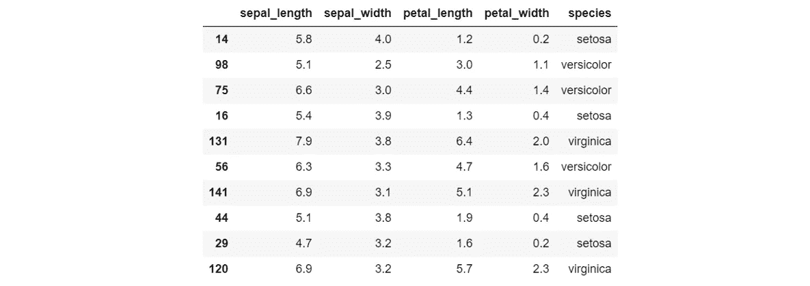

作者图片

# 熊猫数据帧样式器入门

在我们深入探讨之前，有必要先介绍一下熊猫数据帧样式器的概念。熊猫有一个`DataFrame.style` 属性，它返回一个`Styler`对象。正是这个`Styler`对象使我们能够访问和修改熊猫数据帧的各种样式属性。在我们的 DataFrame `df`上调用`.style`将原样显示 DataFrame，但是它显示为一个`pandas.io.formats.style.Style`对象，而不是通常的`pandas.core.frame.DataFrame`。

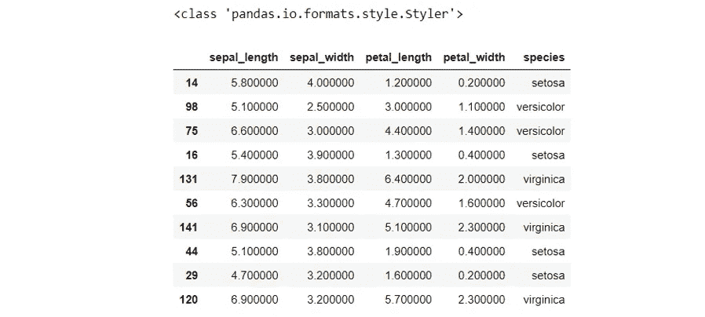

作者图片

注意调用`df`上的`.style`会改变浮子的精度。当我们实现条件格式时，它实际上不会影响任何东西，所以我们将让它保持原样。但是，如果您对此很挑剔，可以随意使用下面的代码来相应地配置精度。

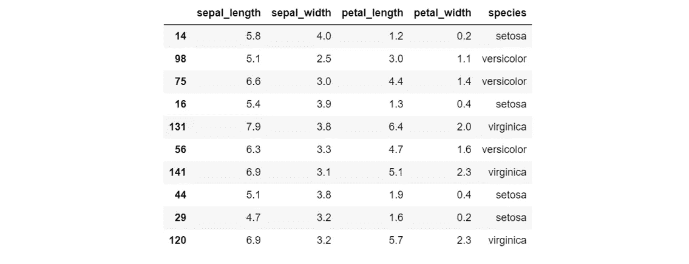

作者图片

在底层，`Styler`对象使用层叠样式表(CSS)来定制影响数据帧显示的各种参数。这是通过使用`.apply()`或`.applymap()`将样式函数传递给`Styler`对象来实现的。因此，样式函数的输出应该是包含 CSS 属性-值对的字符串，采用`'attr: value'`格式。如果什么都不应用，函数应该返回一个空字符串`'’`或`None`。

关于`DataFrame.style`属性和`Styler`对象的更多细节，请查看熊猫官方文档中的以下链接:

*   [熊猫。DataFrame.style](https://pandas.pydata.org/docs/reference/api/pandas.DataFrame.style.html#pandas.DataFrame.style)
*   [pandas . io . formats . style . styler](https://pandas.pydata.org/docs/reference/api/pandas.io.formats.style.Styler.html#pandas.io.formats.style.Styler)

# 条件单元格高亮显示

有条件地格式化你的熊猫数据帧的一个方法是**高亮显示满足特定条件的单元格**。为此，我们可以编写一个简单的函数，并使用`.apply()`或`.applymap()`将该函数传递给`Styler`对象:

*   `.applymap()`:对 DataFrame 元素应用函数；
*   `.apply()`:按行或按列对数据帧应用函数。

现在让我们探索几个场景。

## 1.突出显示任何符合条件的单元格

假设我们想用黄色背景突出显示数据帧`df`中值为 5.1 的所有单元格。我们可以编写一个简单的函数，并以如下方式使用`.applymap()`:

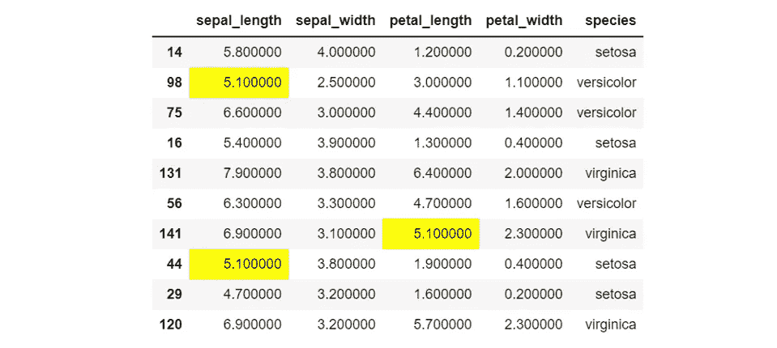

作者图片

## 2.突出显示任何不符合条件的单元格

请注意前面的颜色片段，如果不满足条件，`color`被设置为`''`。如果我们还想突出显示不满足条件的单元格，我们当然可以设置颜色，而不是空字符串。这里，我们将保留值为 5.1 黄色的单元格，并突出显示值不是 5.1 淡蓝色的单元格。请注意，在设置颜色时，您可以使用任何有效的 HTML/CSS 颜色名称或十六进制颜色代码。出于演示目的，我们将使用十六进制颜色代码。

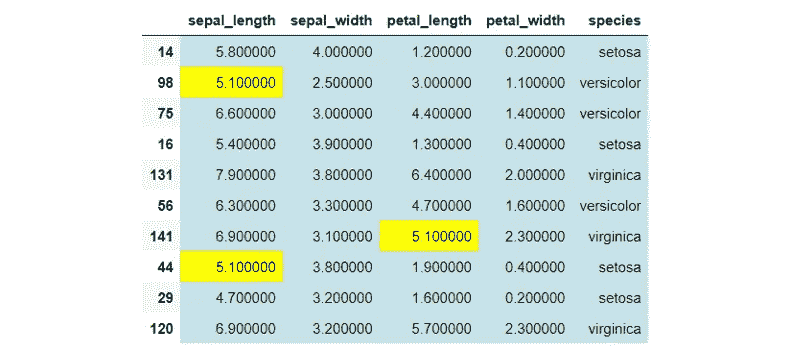

作者图片

我们可以更进一步，将样式函数一般化。这样做意味着我们可以将条件为真和条件为假时用来突出显示单元格的颜色作为参数传递给函数。下面的代码片段将显示与上面相同的输出。

## 3.仅突出显示选定列中符合条件的单元格

如果我们只想在某些列上应用条件突出显示，而不是整个数据帧，该怎么办？您可以通过将列名列表传递到`.applymap()`中的`subset`参数中来实现。

在下面的代码中，我们仅对“sepal_length”和“petal_length”列应用条件格式。

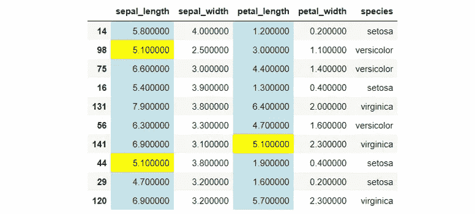

作者图片

## 4.基于分类值突出显示行

我们还可以根据分类列中的值突出显示数据帧中的行。这将允许我们可视化地分割数据集，这在处理大型数据集时尤其有用。在这里，如果我们想根据花的种类来突出显示行，我们可以这样做:

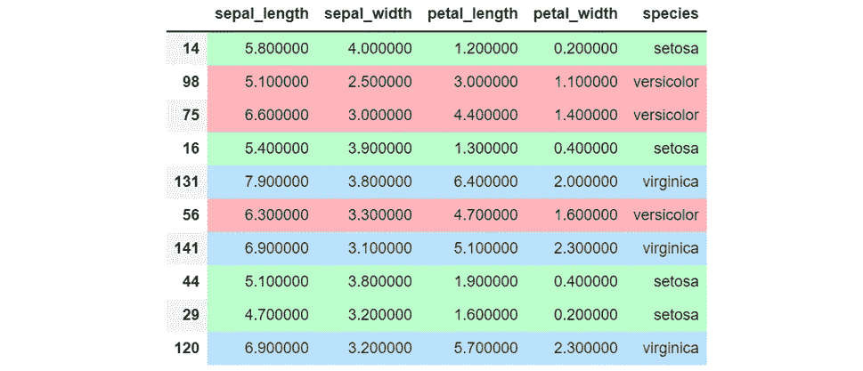

作者图片

请注意，上面的代码中有一些关键的区别:

*   首先，样式函数`highlight_rows()`现在将每一行作为一个参数，与之前的`highlight_cells()`函数相反，它将每个单元格的值作为一个参数。
*   第二，因为我们是按行应用样式函数，所以我们使用`.apply()`和`axis=1`而不是`.applymap()`。
*   第三，因为我们是按行应用函数，所以 style 函数的输出是 CSS 字符串的列表，而不是单个字符串。

## 5.基于列名突出显示列

我们还可以根据列名突出显示单元格。我们可以定义样式函数，将每一列作为参数，然后通过指定`axis=0`按列应用该函数。

假设我们想用与其他列不同的颜色突出显示“物种”列，我们可以这样做:

作者图片

# 条件文本格式

我们可能希望格式化数据帧的另一种方式是**定制每个单元格中的文本**。上一节中介绍的场景也适用于文本格式化。

如果您已经意识到了这种模式，我们已经配置的用于单元格突出显示的 CSS 属性-值对将采用以下格式:`background-color: <set color>`。我们可以通过指定不同的 CSS 属性-值对格式来应用其他类型的条件格式。下面是一些我们可以定制的`Styler`对象的公共属性和它们相应的 CSS 字符串格式:

1.  **字体颜色** : `'color: <set color>’`
2.  **字体类型** : `'font-family: <set font type>'`
3.  **字号** : `'font-size: <set font size>’`
4.  **字体粗细** : `'font-weight: <set font weight>'`

我们甚至可以在一个样式函数中指定多种类型的属性，用分号将它们链接起来，就像这样:`"background-color: 'yellow'; color: 'blue'; font-size: '15px'"`。当然，这只适用于单个条件。如果我们想为不同的条件指定不同类型的格式，我们需要定义不同的样式函数。

# 导出为 Excel 文件

现在，已经在 Pandas 中完成了所有这些条件格式，接下来我们可能要做的是将数据帧导出为 Excel 文件。当然，我们希望保留导出的 Excel 文件中的所有格式。我们可以使用`.to_excel()`方法，指定一个. xlsx 文件名和引擎(或者是`openpyxl`或者是`xlsxwriter`)。

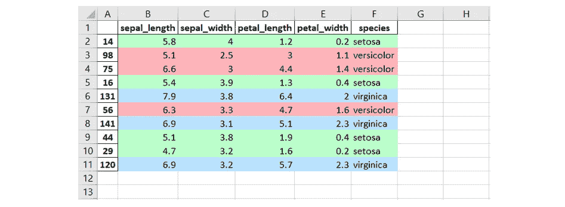

作者图片

# 把所有的放在一起

到目前为止，已经介绍了很多内容。让我们通过一个具体的例子把这些想法放入上下文中。假设我们想以下列方式格式化我们的数据帧`df`:

*   根据花的种类突出显示行；
*   当萼片长度或萼片宽度在 3.5 毫米至 5.5 毫米之间时，将字体颜色设置为红色，字体粗细设置为粗体；
*   当花瓣长度或花瓣宽度在 1.5 毫米到 3.5 毫米之间时，设置字体大小为 15px，字体类型为草书。

让我们一步一步地完成这个例子:

**第一步:根据花卉种类突出显示行**

我们之前已经用`highlight_rows()`样式函数完成了。

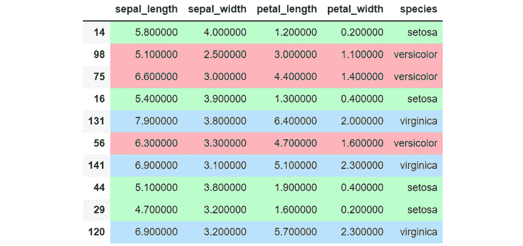

作者图片

**第二步:当萼片长度或宽度在 3.5 毫米到 5.5 毫米之间时，设置字体颜色和粗细**

因为我们对萼片长度和萼片宽度的值感兴趣，所以我们可以定义一个样式函数，它接受一个单元格值作为参数，然后在使用`subset`参数指定感兴趣的列时使用`.applymap()`。

这里，我们正在格式化字体颜色和字体粗细，所以样式函数应该返回的 CSS 字符串需要是`'color: <set color>; font-weight: <set font weight>’`格式。下面是代码和输出:

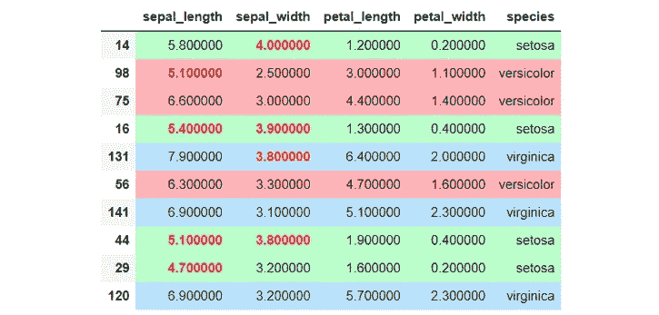

作者图片

**第三步:当花瓣长度或宽度在 1.5 毫米到 3.5 毫米之间时，设置字体大小和类型**

类似地，我们定义了另一个样式函数来返回一个`'font-size: <set font size>; font-family: <set font type>’`格式的 CSS 字符串。请注意，我们可以通过简单地将方法链接在一起，为不同的条件应用不同的格式。

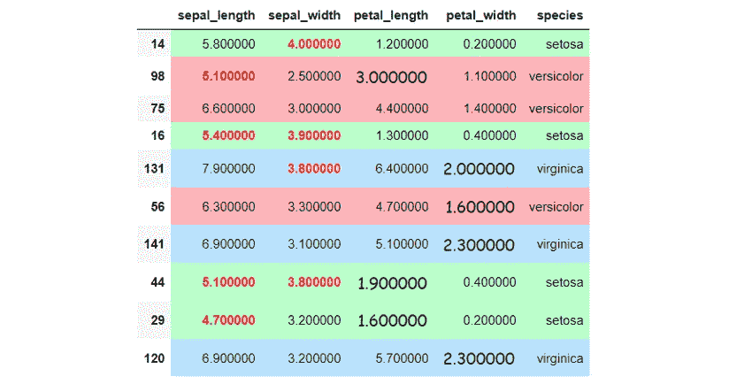

作者图片

**第四步:导出为 Excel 文件**

好了，我们的数据帧开始看起来奇怪了，所以我们应该停止格式化它。我相信你已经明白了。让我们做最后一件事——将其导出为 Excel 文件。

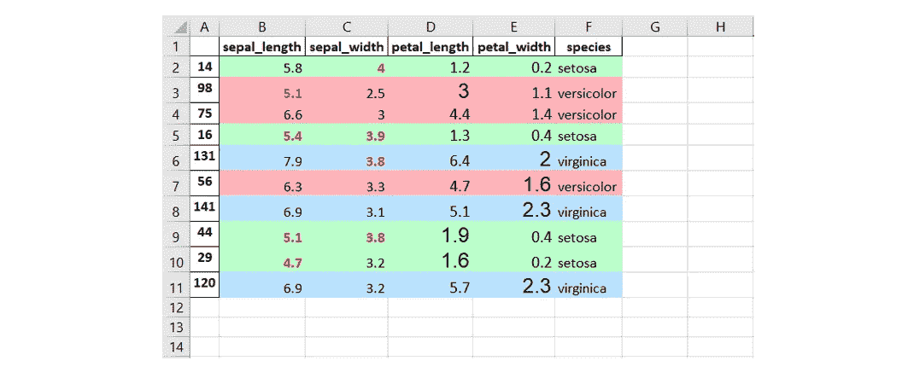

作者图片

在保留字体格式方面似乎有一些问题，但其余的格式看起来很好。

# 其他资源

由于`DataFrame.style`在幕后使用 CSS，我们可以用许多其他方式有条件地格式化数据帧。熊猫还提供了其他有趣的功能。请务必查看以下资源以了解更多信息:

*   [使用 CSS 的文本和字体样式](https://developer.mozilla.org/en-US/docs/Learn/CSS/Styling_text/Fundamentals)
*   [熊猫的表格可视化](https://pandas.pydata.org/docs/user_guide/style.html#)

# 结论

恭喜你！您已经在 Pandas 中学习了条件格式的基本知识。快速回顾一下——您已经了解了 Pandas DataFrame Styler 对象在定制数据帧显示方式中的作用。你已经学会了如何使用`'attr: value'`格式的 CSS 来指定各种设置，包括单元格高亮颜色、字体颜色、字体大小和字体类型。

您还看到了如何以保留格式的方式将`Styler`对象导出为 Excel 文件。有很多其他方法可以有条件地格式化数据帧。没有什么可以阻止您进一步尝试，创建更复杂的格式，并在此过程中获得一些乐趣！

> **在你走之前……**
> 
> 如果这篇文章有价值，并且你希望支持我作为一个作家，请考虑注册一个中级会员。一个月 5 美元，费用直接支持我和其他你读其文章的作家。作为会员，你可以无限制地阅读媒体上发表的故事。如果你使用[这个链接](https://zeyalt.medium.com/membership)注册，我将获得一小笔佣金。如果你希望在我发布时得到通知，也可以随时加入我的[电子邮件列表](https://zeyalt.medium.com/subscribe)。