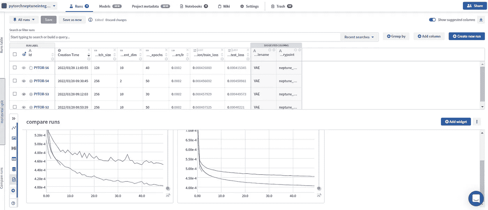
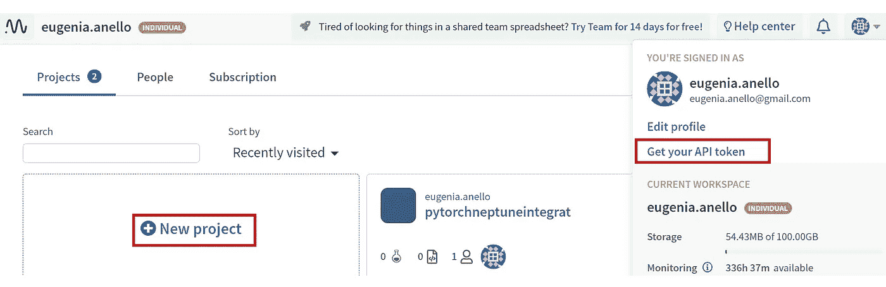
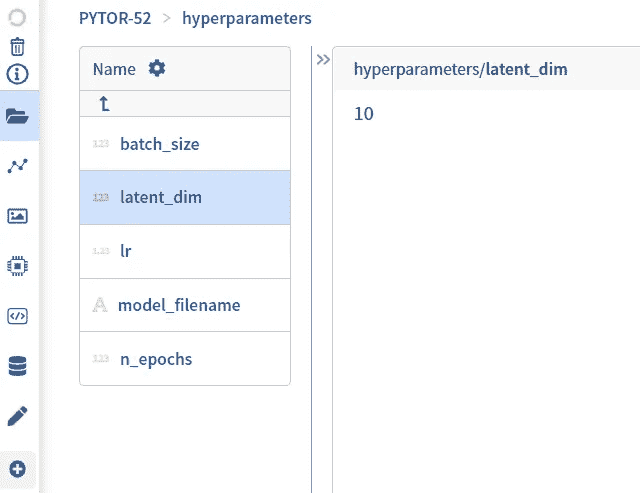
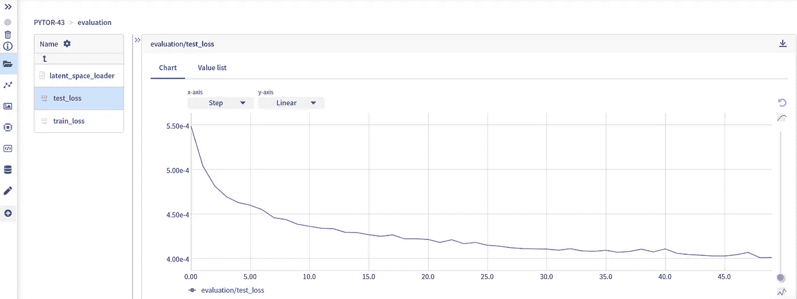
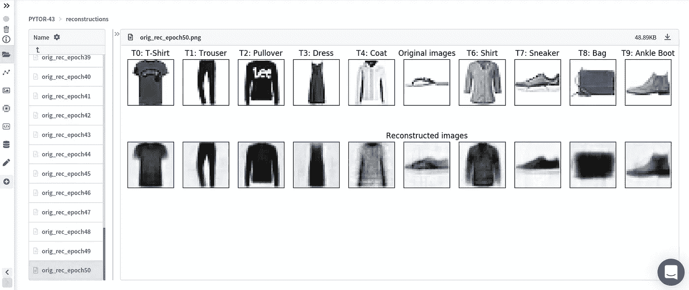
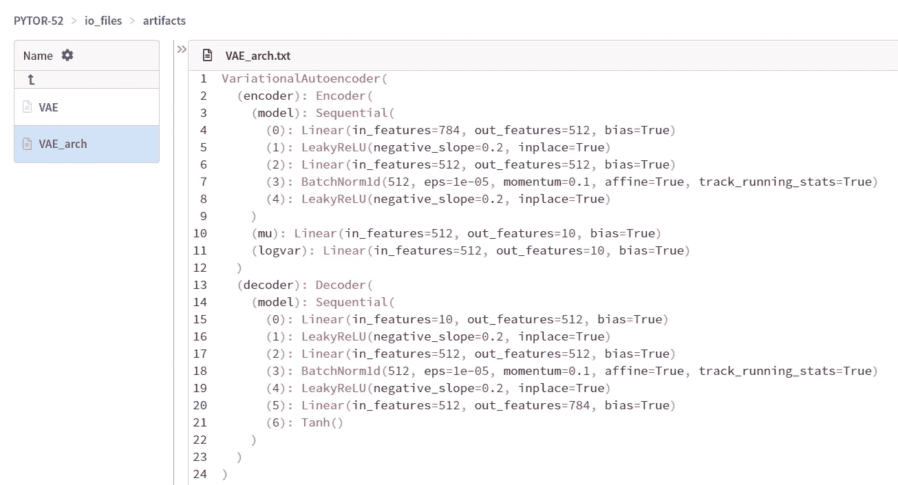
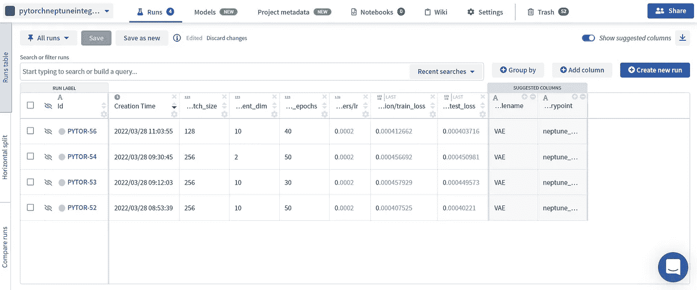
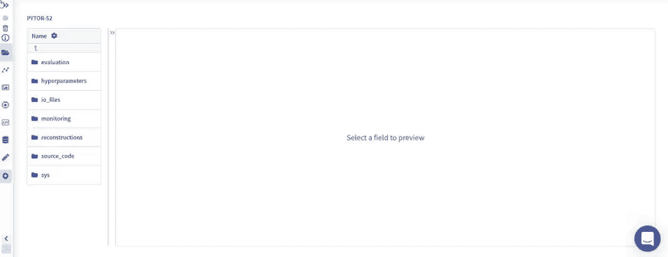
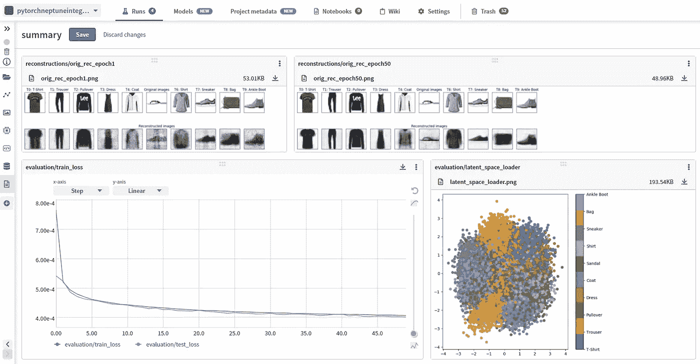

# 使用 Neptune.ai 跟踪 Pytorch 实验的快速指南

> 原文：<https://towardsdatascience.com/a-quick-guide-for-tracking-pytorch-experiments-using-neptune-ai-6321e4b6040f>

## 该平台的演示可以帮助您有效地跟踪模型结果


佩吉·科迪在 [Unsplash](https://unsplash.com/photos/ITTqjS3UpoY) 上拍摄的照片

> 这篇文章是故事[的续篇，故事是使用 MLflow](/an-intuitive-guide-to-track-your-ml-experiments-with-mlflow-7ac50e63b09?sk=3f8a40911438b223c67f9842834f8827) 跟踪你的 ML 实验的直观指南。在上一篇文章中，我介绍了 MLflow，这是一个允许保存模型的超参数和度量的在线源代码平台。我发现的唯一缺点是它没有提供在线仪表板，这对于查看模型性能很有用。为此，我开发了另一个平台，名为 Neptune.ai。它不仅仅限于保存训练好的模型、指标和超参数，还允许在漂亮的仪表板中可视化图形绘图，并与其他队友分享结果。此外，还有可能比较运行实验的性能。

# 介绍



作者插图

[**Neptune.ai**](https://neptune.ai/) 是一个管理你的 ML 实验、模型注册和模型监控的在线平台。这个工具并不局限于监控单个模型的性能，它也有助于在单个仪表板中跟踪更多的模型。每次执行实验代码时，它都会填充表中的一行，称为**运行表**，因为它显示了所有的实验运行。通过这种方式，您可以根据超参数、指标和其他度量来比较不同的模型。

另一个重要的方面是，您可以为每个实验存储任何类型的元数据，例如超参数、度量和学习曲线、图形的图像和 HTML 对象、表格、包含训练模型的文件等等。除了这些对象之外，还可以创建一个仪表板，将存储在单个界面屏幕中的不同元数据组合起来。

此外，该平台很酷，因为它允许创建不同的项目，每个项目都包含所有的实验运行。也有可能与其他团队成员合作。您可以轻松地将项目的 URL 或单个实验的 URL 发送给您的同事，这可以可视化您的模型的结果。所有这些列出的优势都是免费的。无论如何，如果你需要更高级的功能，比如更大的内存存储和更长时间的监控，你需要订阅。

# 先决条件



作者插图。

在展示如何将 Neptune 与 Pytorch 集成之前，需要遵循四个步骤:

1.  检查您的电脑上是否安装了 Python 3.6 或更高版本
2.  [在 neptune.ai 网站上注册](https://ui.neptune.ai/auth/realms/neptune/protocol/openid-connect/registrations?client_id=neptune-frontend&redirect_uri=https%3A%2F%2Fapp.neptune.ai%2F-%2Fonboarding&state=5674af86-9d94-469a-8847-e62d83f42797&response_mode=fragment&response_type=code&scope=openid&nonce=ea0882f7-acb7-4fda-84b8-9677bd5b1af4)为用户，以访问私人项目
3.  复制您的概要文件的 API 令牌
4.  创建一个新项目，该项目可以是公共的，也可以是私有的，具体取决于您的范围。*如果你打算和同事分享成果，公共项目更合适。*

将软件包安装到笔记本电脑后:

```
pip install neptune-client
```

为了完成这个过程，我们需要初始化一次 Neptune 运行，其中我们传递 API 令牌和项目的路径:

```
import neptune.new as neptune
from neptune.new.types import Filerun = neptune.init(
    project="<username>/pytorchneptuneintegrat",
    api_token="<insert-your-API-token>"
)
```

当您运行这些代码行时，会返回一个 URL 作为输出。瞧啊！需求现在已经满足，我们可以专注于更有趣的部分。

# 用 Neptune.ai 进行跟踪实验

我们终于可以开始探索 Neptune.ai 的学习之旅了。这一部分可以进一步分为不同的步骤:

1.  **导入库和数据集**
2.  [**在 Neptune.ai 中保存超参数**](#6cc3)
3.  [**定义模型并实例化 Pytorch 对象**](#d55f)
4.  [**记录损失并保存数字**](#4230)
5.  [**保存模型架构和权重**](#d357)
6.  [**运行文件 train_vae.py**](#6d91)
7.  [**创建新仪表板**](#e5fc)

## **1。导入库和数据集**

第一步是导入库、时尚 MNIST 和运行 python 代码 train_vae.py 时要在终端上传递的参数列表

正如您所看到的，我们创建了一个 ArgumentParser 对象，它包含了我们希望在终端上传递的所有参数。为了将信息填充到解析器中，我们使用 add_argument()方法。例如，使用此方法创建变量 n_epochs。这个变量的类型是一个整数，默认值是 50，并且指定了一个帮助消息。

这样，用命令行`python train_vae.py`运行文件时，模型会自动训练 50 个历元。如果你想改变超参数的值，命令行应该改为`python train_vae.py — n_epochs <optional_value>`。

## **2。在 Neptune.ai 中保存超参数**

我们感兴趣的第一件事是在 Neptune.ai 中保存超参数。做起来非常简单:

这一行代码创建了一个名为 hyperparameters 的新文件夹，其中显示了所有的 hyperparameters 和字典中指定的相应值。如果打开实验的链接，您可以在运行文件后找到保存在表格中的信息:



作者插图

## **3。定义模型并实例化 Pytorch 对象**

我们创建了 VariationalAutoencoder 类，它由两个神经网络组成，具有线性层的编码器和解码器，作为激活函数的泄漏 ReLU 和批量标准化层。还定义了函数来计算变分自动编码器的 Elbo 损耗。

train_eval_vae 类中指定了训练和评估变分自动编码器性能的方法，您可以在第 6 节中找到该类，其中提供了所有代码。我们可以初始化变体自动编码器、优化器和先前定义的类 train_eval_vae:

## **4。记录损失并保存数字**

现在，我们终于可以在训练装载机和测试装载机上训练和评估变型自动编码器了。

有两种主要的方法用来保存不同类型的信息。第一种方法是`log`方法，将一组数字存储在指定的路径中。在这种情况下，它应用于保存文件夹评估中每个时期的训练和测试重建损失:



作者插图

另一种方法是`upload`在运行该行代码时，立即将文件上传到
创建的指定目录中。在示例中，我们使用它来保存两个 matplotlib 图形。



作者插图

不错，你不觉得吗？我们可以在这个神奇的平台上存储所有的模型结果，而无需填充您的实际工作环境、Jupyter Lab 或 Visual Studio 或您正在使用的任何 IDE。

**5。保存模型架构和权重**

Neptune 不仅限于存储超参数、评估方法和数字，它还允许保存模型架构，这在使用不同模型比较实验时非常有用。此外，它允许上传训练模型的学习参数。



这些是您运行脚本时会发现的输出。文本文件提供了模型架构的快速概览，而另一个文件包含了模型的权重。

## 6.运行 train_vae.py

前面显示的所有代码都保存在一个带有格式的文件中。py:

编写完代码后，可以用下面的命令行运行它:

```
python train_vae.py
```

要尝试超参数的其他值，您可以在命令行上传递它们:

```
python train_vae.py --latent_dim 2
```

所有实验结果都可以在平台上的个人项目中可视化:



作者插图

该表是监控和比较您到目前为止已经尝试过的模型的性能的基础。Id 列的每一行都包含一个链接，用于查看该特定实验的结果。通过按+添加列按钮，可以很容易地添加其他列。如果您希望可视化具有特定超参数的实验，也可以过滤结果。

## 7.使用 Neptune.ai 创建仪表板

最后一步是创建一个漂亮的仪表板，它很好地总结了实验中获得的结果。这样做的过程非常直观:

*   选择左侧菜单上的 **+** 按钮
*   选择仪表板的标题，然后单击保存
*   按下 **+Add widget** 按钮，决定显示哪种类型的数据可视化。例如，我们可以选择 Image 小部件来显示在第一个时期获得的重建图像。



作者 Gif。

按照此步骤，我们可以添加其他图表，这样就可以获得一个仪表板:



作者插图

当您对仪表板感到满意时，记得单击保存按钮。

# 最终想法:

我希望你已经开始使用 neptune.ai 喜欢这个教程。它提供了非常有用的功能来处理你的模型实验。感谢阅读！祝你有愉快的一天。

## 参考资料:

*   [https://py torch . org/vision/main/generated/torch vision . datasets . fashion mnist . html](https://pytorch.org/vision/main/generated/torchvision.datasets.FashionMNIST.html)
*   [https://docs . Neptune . ai/integrations-and-supported-tools/model-training/py torch](https://docs.neptune.ai/integrations-and-supported-tools/model-training/pytorch)

你喜欢我的文章吗？ [*成为会员*](https://eugenia-anello.medium.com/membership) *每天无限获取数据科学新帖！这是一种间接的支持我的方式，不会给你带来任何额外的费用。如果您已经是会员，* [*订阅*](https://eugenia-anello.medium.com/subscribe) *每当我发布新的数据科学和 python 指南时，您都会收到电子邮件！*