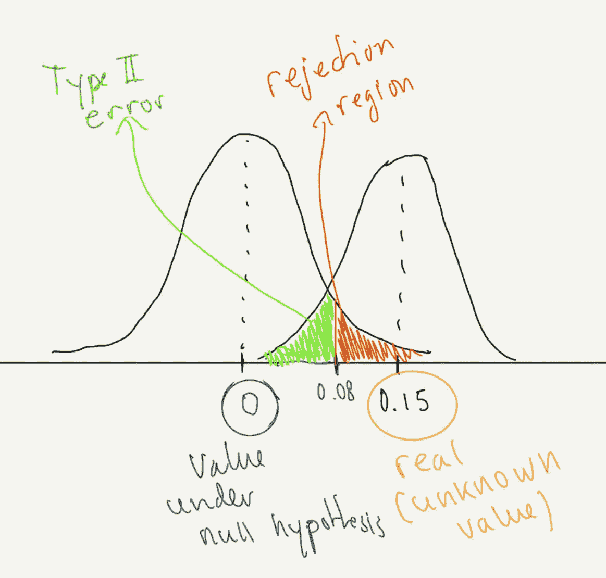
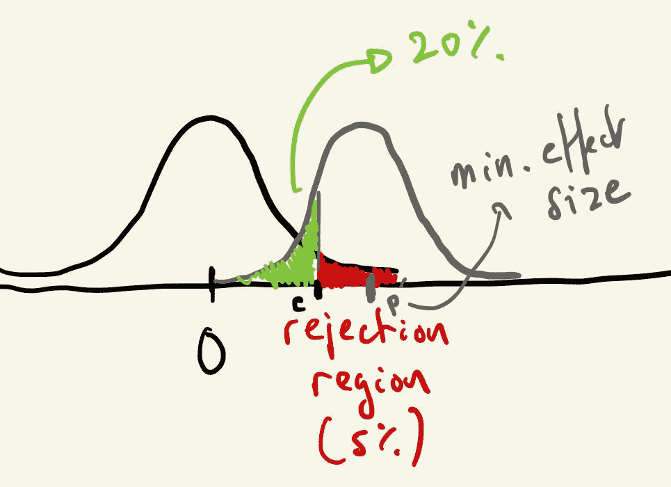
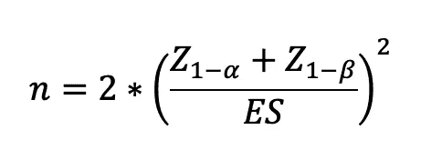
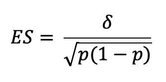
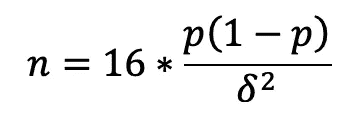
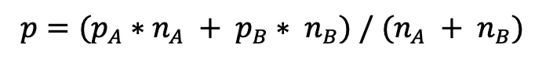
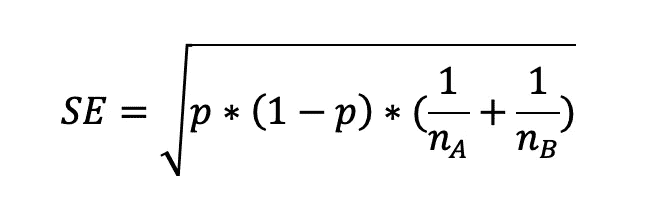
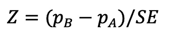
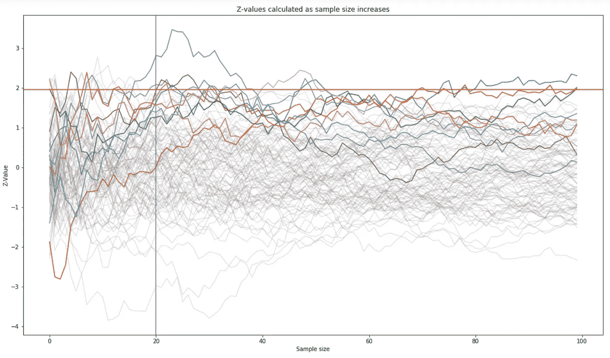
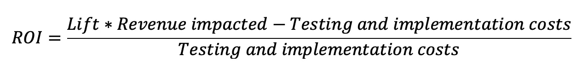

# A/B 测试快速入门指南

> 原文：<https://towardsdatascience.com/a-quick-start-guide-to-a-b-testing-da71de09b61d>

## 寻找有价值见解的循序渐进的方法


布拉登·科拉姆在 [Unsplash](https://unsplash.com?utm_source=medium&utm_medium=referral) 拍摄的照片

# 介绍

所以你的任务是建立一个营销 A/B 测试，但你没有太多的时间来解决问题。这里有一个快速入门指南，告诉你当需要提高的主要指标是一个比例:点击率、转化率、打开率、回复率…

## 1.定义你的零假设并选择你的显著性水平

这个过程的第一步是定义你想要测试的假设。通常情况下，你希望登录页面、横幅广告或电子邮件副本(B 版本，或治疗)的变化比当前版本(A 版本，或对照组)的表现更好。所以规则是:你把你的零假设定义为你希望是假的。例如，你想为一个提交按钮测试一种新的颜色，并希望这个按钮能比原来的按钮产生更多的表单提交。你的**无效假设** ( **H0** )是新按钮会表现**更差**或者和现有的一样，而**替代假设(H1)** 是新按钮会表现更好(所以:产生更高的点击率)。

我们正在测试 pA 和 pB 两个比例之间的差异，因此:

**H0: pB ≤ pA** 或者等价地，**p b-pA≤0**；这是我们的零假设，我们希望证明的是错误的:B 版本(pB)中的事件比例——点击、转换、回复——低于或等于原始 A 版本(pA)中的事件比例

**H1: pB > pA** 或**pB-pA>0；**我们的替代假设，新版本 B 比 a 显示了更高比例的事件

最后，您必须选择一个显著性水平，通常称为 alpha，它代表犯**类型 I 错误**的概率(当它实际上表现更差时采用新版本)。通常使用的水平是 5%或 1%，这大致意味着如果你一年运行 100 个测试，你应该平均预期其中的 5 个(或者 1 个，取决于你的 alpha 值)你会做出错误的决定，并实施一个实际上没有改善事情的改变。

## 2.随机化你的用户

这是至关重要的一步，您的技术团队了解这一要求非常重要，因为为了简化流程，用户不会随机看到版本 A 或 b。例如，为期 4 周的测试可以分为 2 周使用当前版本，接下来的 2 周使用新版本，或者上午与下午，或者一个浏览器与另一个浏览器。这不是好的做法，很可能会在你的数据中引入偏见，因此，你的结论很可能不适用于你的所有听众。了解观察单位也很重要:我们是基于设备、cookies、IP 还是登录用户？

## 3.有多少用户？强大的能力带来巨大的样本量

您应该确保您的测试设计有足够的功效(通常使用的值是 80%)，但是统计测试的功效是什么，我们如何选择一个足够大的样本量来提供足够的功效呢？如果你没有时间阅读这个理论，可以跳到这一部分的末尾，找到一个快速的经验法则和一个在线计算器(甚至是一个手机应用程序！)


照片由 [Grzegorz Rakowski](https://unsplash.com/@gregory_rak?utm_source=medium&utm_medium=referral) 在 [Unsplash](https://unsplash.com?utm_source=medium&utm_medium=referral) 上拍摄

要了解 power，我们需要了解什么是 I 型和 II 型错误。第一类错误是当零假设事实上为真时，我们拒绝了它。例如，假设我们的新横幅版本(B)比我们的原始设计(A)表现更差，但由于随机性，数据显示 B 表现明显更好，因此我们错误地拒绝了我们的零假设。根据定义，如果您使用 5%的显著性(alpha 级别),这意味着平均会发生 5%的情况。

一个**第二类错误**是在我们应该拒绝零假设的时候没有拒绝。在我们的例子中，假设版本 B 比版本 A 执行得更好，但是我们的测试没有提供足够的能力来拒绝零假设，所以我们保留版本 A，失去了一个提高性能的机会。正如我们在下图(非常粗略)中看到的，在 pB-pA=0 的零假设下，如果观察值大于 0.08(红色区域)，我们将拒绝该零假设。如果真正的(未知的)差异实际上是 0.15，我们将无法拒绝任何落在绿色区域的值，因此我们无法确定版本 B 优于版本 a。这是犯类型 II 错误的概率，我们测试的功效是 1 减去该概率。



第二类错误和权力(图片由作者提供)

让我们来看看下面的假设结果，我们用 Python 创建了一个模拟，用一个二项式数据生成过程来说明这一点，A 组的概率为. 005，B 组的概率为. 0075:

```
from scipy.stats import norm
import numpy as np# Let's define our sample size
n=500
p_a = .005  # real underlying probability of each trial for version A
p_b = .0075 # same for B# We generate the random binomial samples (number of clicks for 500 ad impressions in each group)s_a = np.random.binomial(n, p_a, 1)
s_b = np.random.binomial(n, p_b, 1)# calculate pooled p
p=(sum(s_b)+sum(s_a))/(2*n)
print(p)# calculate standard error
se=np.sqrt(p*(1-p)*(2/n))
print(se)# calculate test statistic
z=(s_b/n-s_a/n)/se
print(z)
# get the p-value
print(1-norm.cdf(z))
```

在样本量为 500 的情况下，我们获得了以下结果(请随意运行您自己的测试)，p_A=0.004，p_B=0.01，p 值为 0.32。**我们不能拒绝零假设，尽管我们知道我们应该拒绝**，因为样本是以已知的潜在概率生成的(并且 pB 高于 pA)。这显然是第二类错误。

我们如何降低这种风险？很简单，我们需要增加样本量。使用相同的代码，但将样本大小更改为 100，000，我们得到:p_A=0.0048，pB=0.0074，p 值远低于 0.001。但是我们使用了相同的底层流程，我们只是改变了样本大小！

计算足够大样本的公式依赖于效应大小的概念，或者说:你希望能够检测到的最小差异是多少(这有商业意义)？例如，这可能是至少 0.05 个百分点的差异，从而将现有的 0.1%的转换率提高到 0.15%。当然，所需的效果大小会因业务部门和应用程序而异，但它需要对管理团队有一定的合理性。

计算样本量的公式使用显著性水平(α)、功效水平(1-β)和效应大小(es)，您可以在这里找到一个很好的公式推导解释(【https://online.stat.psu.edu/stat415/lesson/25/25.3】T2)，我们本质上是在寻找一个 c 值，它既是拒绝区域的临界值，也是我们得到假阴性的概率(见下图)



找到满足这两个条件的 n(图片由作者提供)

所以，公式如下:



ES 为:



Delta 是您希望能够检测到的最小差异，p 是两个样本(A 和 B)的总体平均比例。

举个例子应该更简单:你正在运行一个点击率为 0.5%的横幅广告(A)活动，你想测试一个新的横幅广告(B)。你只对最低 50%的点击率提升感兴趣，所以新提升的点击率为 0.5%*1.5=0.75%，绝对**差 0.25 个百分点**。为了至少有 **80%** 的把握检测到 **5%显著性水平**的差异，您需要在每个版本中运行的最小印数是多少？

a)显著性水平为 5%，因此我们的 Z(1-alpha)值为 **1.645**
b)所需功效为 80%，因此我们的 Z(1-beta)为 **0.842**
c)我们的总体(平均)比例 p 为(0.005+0.0075)/2=0.00625
d)并且我们的效应大小 ES 为(0.0075–0.005

所以我们的 n = 2*[(1.645+0.842)/0.03172] =每个横幅上的 12，296 次展示

如果我们运行我们的 Python 代码 12，296 次，我们会看到，在这个样本大小下，我们平均有 20%的时间得到 p 值> 0.05！

> 最后，对于 80%的幂和 5%的显著性水平，计算 n 的一个有用的**经验法则**:



> 您也可以使用这个在线样本量计算器:

[](https://www.evanmiller.org/ab-testing/sample-size.html)  

> 或者在 Android 或 iOS 上下载 **A/B 好友 app** 。

## 4.比例之间的差异用什么测试？


照片由[鲁特森·齐默曼](https://unsplash.com/@ruthson_zimmerman?utm_source=medium&utm_medium=referral)在 [Unsplash](https://unsplash.com?utm_source=medium&utm_medium=referral) 拍摄

测试结束后，第一步是比较结果，A 版和 B 版哪个版本表现更好？此外，**两个版本之间的差异是显著的还是偶然的**？在统计测试中，有几种方法来测试观察到的差异是否具有统计显著性，TDS 上的一些帖子建议使用 Fisher 精确测试或卡方测试，但我们将使用 Z 测试。Z 测试背后的主要思想是，如果我们从二项分布中抽取许多样本，成功的比例将是正态分布的(理想情况下，我们还希望确保 n*p > 5)。所以我们需要回答这个问题:*如果零假设为真*得到现有结果的概率是多少？我们只需要计算一个我们知道遵循标准正态分布的检验统计量，并找出如果版本 B 确实比版本 a 更差或相同，观察到一个值至少为极端值的概率。

这里是一个简单的一步一步的程序和一个例子。假设您在两个不同的广告横幅之间进行测试，在测试运行几天后，您会得到以下结果:

**版本 A:**12000 次展示，18 次点击，也就是 0.15%的点击率(18/12000 = 0.0015)

**版本 B:** 11，800 次展示和 23 次点击，或 0.195%的点击率

**第一步**:计算汇集比例，p



在我们的示例中，nA=12，000，pA=0.0015，nB=11，800，pB=0.00195，由此得出:

p= (18 + 23)/(12，000+11，800) = 0.00172，即 0.172%

**第二步:**计算 p，SE 的标准误差



其给出:sqrt[0.00172 * 0.998 * (1/12，000+1/11，800)] = 0.00054 或 0.054%

第三步:计算检验统计量 Z



所以 Z =(0.00195–0.0015)/0.00054 = 0.833

**第四步:**求得到那个特定值的概率。

使用 Python、R 或 Excel 获取您的 p 值。

**Python**

```
from scipy.stats import norm
p_value = 1-norm.cdf(zvalue)
```

**Excel**

```
1-NORM.S.DIST(*zvalue*,TRUE)
```

**R**

```
p_value <- 1 **-** pnorm(zvalue,mean=0,sd**=**1)
```

我们得到的 p 值为 0.202，因此我们不能拒绝零假设，因此不能确定版本 B 的表现优于版本 a。

# 也很高兴知道

## A/A 测试

什么是 A/A 测试，为什么要关注？A/A 测试基本上是在一个测试设计中运行两次相同版本的网站、横幅广告或电子邮件，以评估随机过程和您使用的工具。每组中的用户看到相同的东西，但是您想要比较结果，看看性能的差异是否可以归因于偶然。如果差异在统计上是显著的，这可能反映了您的测试设计或过程中的问题，您必须进行调查。同样值得注意的是，如果你的显著性水平(alpha)是 5%,平均来说，你会看到大约 5%的假阳性。

## 顺序测试

如果结果似乎表明一个明显的改进，或者当被测试的新版本明显表现不佳时，你能在计划的测试结束之前停止吗？“窥视”的问题是它倾向于产生更多的误报，正如在下面的模拟中可以看到的。我们用零假设的值生成 100 个随机样本。在显著性水平为 0.05 的情况下，我们可以看到 100 个样本中有 3 个样本会导致我们拒绝零假设，这与 5 个样本的预期值相差不远。但是如果我们在样本大小达到 20 后开始查看和计算 z 值，我们将拒绝下图中所有的彩色线条(10/100)。



对于给定的显著性水平，扫视会产生比预期更多的假阳性(图片由作者提供)

因在战机上观察幸存者偏差而闻名的亚伯拉罕·瓦尔德和他在统计研究小组的同事设计了一种方法来加快测试过程，即序贯概率比测试。这需要理解似然比的概念，您可以在这里找到对该方法的精彩解释:

[](/experiments-peeking-and-optimal-stopping-954506cec665)  

## 贝叶斯方法

到目前为止，我们已经介绍了“传统的”频率主义方法，但是贝叶斯框架在 A/B 测试中也非常流行。它有一些优点:

a.使用贝叶斯框架，更容易向业务中的利益相关者传达结果，因为与频率主义方法不同，我们可以用“B 优于 A 的概率”这样的术语来谈论。

b.贝叶斯 A/B 测试往往更快**，并且在决定何时停止实验时给予更多的灵活性**

**c.frequentist 方法的一个问题是，我们拒绝基于 p 值的版本，但没有直接考虑影响的大小。Bayesians 使用一个“**损失函数**”，它将小错误视为不如大错误严重，并帮助确定他们可以接受的损失阈值和风险水平。这与其他业务领域的决策过程相匹配。**

**在一个非常高的层次上，这个过程包括为我们正在试验的速率选择一个先验分布(很可能是一个 Beta 分布)。先验允许将“专家意见”或过去的数据包含到模型中。然后，我们运行测试(在我们的情况下，有效地对二项式变量进行测试),并将结果与先验结果相结合，以获得 pA 和 pB 的后验分布。然后，可以运行蒙特卡罗模拟，以获得 pB>pA 的概率，并建立前述损失函数。**

**你可以在 Chris Stucchio 的这篇优秀的[白皮书](https://cdn2.hubspot.net/hubfs/310840/VWO_SmartStats_technical_whitepaper.pdf)中读到更多关于贝叶斯 A/B 测试的内容。**

## **多臂强盗算法(MAB)**

**以一个经典的数学优化问题命名，在这个问题中，一个赌徒需要在一套具有不同(未知)支付的老虎机上最大化他的奖金。MAB 算法是一个优化过程，它将印象分配更改为表现最佳的版本，从而以牺牲统计有效性为代价最大限度地提高转化数量，因为由于该优化过程，结果可能变得难以分析。它回答了**探索与利用的困境**。更多关于 MAB 的信息，请点击此处:**

**[](/a-b-testing-is-there-a-better-way-an-exploration-of-multi-armed-bandits-98ca927b357d)  

## 分段 A/B 测试

您可以针对特定细分市场进行测试，并根据人口统计、位置等因素对子群体进行个性化优化，而不是使用平均值并向每个受众展示总体优化设计。Yaniv Navot 写了一篇很好的博文。

## 投资回报考虑因素

显然，在进行实验之前，将实验成本、实施新版本与业务影响考虑在内是很重要的。ROI 的计算方法如下:



举个例子，如果一个新版本的网站使我们 100 万美元的年销售额增加了 1%，但测试和实施新版本的成本是 12，000 美元，这真的值得吗？你可以查看格奥尔吉·格奥尔杰夫的投资回报率计算器，这是他的 A/B 规划和分析工具的一部分:

[https://www.analytics-toolkit.com/ab-test-roi-calculator/](https://www.analytics-toolkit.com/ab-test-roi-calculator/)

## 外部效度

外部有效性是指我们的结果有多普遍。有许多因素是我们无法轻易控制的，比如我们的受众的变化、我们竞争对手的行动、经济的变化等等。它们都可能影响实验后的结果。你需要知道的两个概念是**新颖性和学习因素**。这两个影响指的是这样一个事实，例如，一个电子商务网站的忠实用户在看到网站的不同版本时可能会感到有点迷惑，从而影响我们正在跟踪的 KPI(负面地)。这里的关键是，我们希望这些用户随着时间的推移而适应，所以我们在短期测试中观察到的情况并不适用于更长的时间范围。三名谷歌员工(Hohnhold、O'Brien 和 Tang)构建了一个“使用短期可测量的指标来预测长期的模型”，见论文[这里](https://research.google.com/pubs/archive/43887.pdf)或视频演示[这里](https://www.youtube.com/watch?v=QMJHuLtqNLk)。

## 测试两个以上的版本:A/B/n 测试

最后，如果你想测试超过 2 个版本的网站、横幅广告或电子邮件，你需要考虑围绕[家庭错误率](https://en.wikipedia.org/wiki/Family-wise_error_rate#:~:text=In%20statistics%2C%20family%2Dwise%20error,when%20performing%20multiple%20hypotheses%20tests.) (FWER)的问题，并相应地调整 p 值。有几种选择，如 Bonferroni 校正、Dunnet 校正或 Sidak 校正。

这是另一个庞大的主题，你可以在这里找到更多的信息。

祝你好运！


照片由[阿齐兹·阿查基](https://unsplash.com/@acharki95?utm_source=medium&utm_medium=referral)在 [Unsplash](https://unsplash.com?utm_source=medium&utm_medium=referral) 上拍摄** 

## **推荐链接和书籍**

**柯哈维，r .，唐，d .，，徐，Y. (2020)。*可信的在线控制实验:A/B 测试实用指南*。剑桥:剑桥大学出版社。**

**[格奥尔基·兹德拉夫科夫·乔尔杰夫](https://blackwells.co.uk/bookshop/search/author/Georgi%20Zdravkov%20Georgiev) (2019)，*在线 A/B 测试中的统计方法:电子商务中数据驱动的商业决策和风险管理的统计。*独立发表。**

**[](https://www.evanmiller.org/ab-testing/sample-size.html)  [](/exploring-bayesian-a-b-testing-with-simulations-7500b4fc55bc)  [](/a-b-testing-is-there-a-better-way-an-exploration-of-multi-armed-bandits-98ca927b357d) **